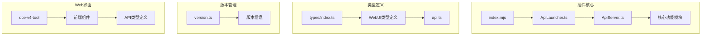
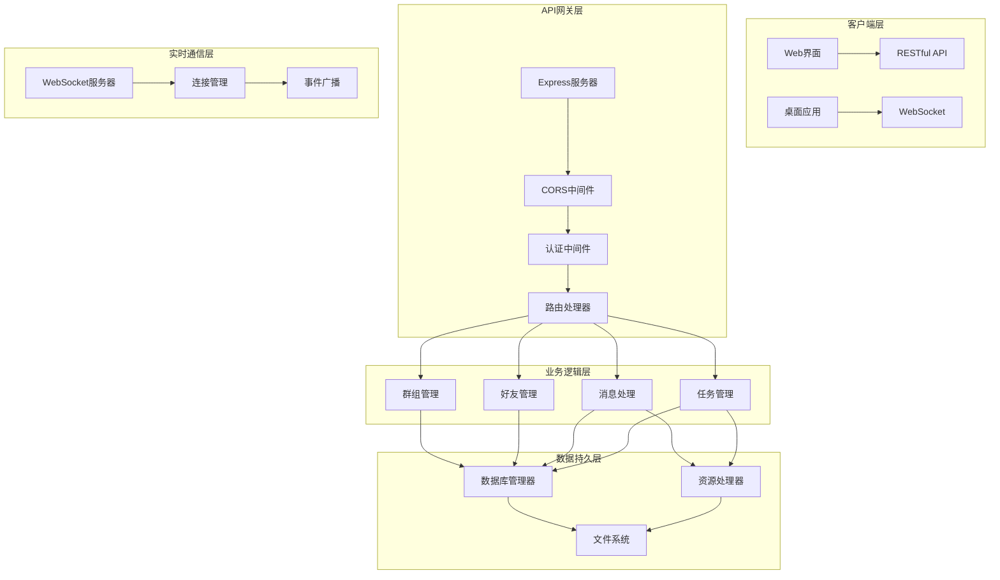
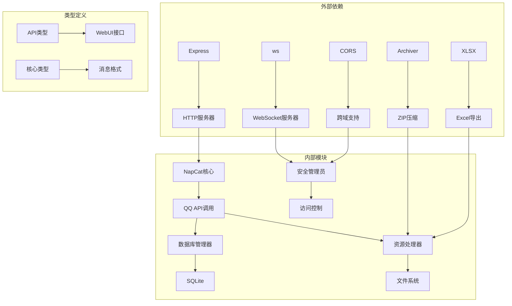

# API参考文档

<cite>
**本文档引用的文件**
- [index.mjs](file://plugins/qq-chat-exporter/index.mjs)
- [ApiLauncher.ts](file://plugins/qq-chat-exporter/lib/api/ApiLauncher.ts)
- [ApiServer.ts](file://plugins/qq-chat-exporter/lib/api/ApiServer.ts)
- [types/index.ts](file://plugins/qq-chat-exporter/lib/types/index.ts)
- [version.ts](file://plugins/qq-chat-exporter/lib/version.ts)
- [api.ts](file://qce-v4-tool/types/api.ts)
- [package.json](file://plugins/qq-chat-exporter/package.json)
- [package.json](file://qce-v4-tool/package.json)
</cite>

## 目录
1. [简介](#简介)
2. [项目结构](#项目结构)
3. [核心组件](#核心组件)
4. [架构概览](#架构概览)
5. [详细组件分析](#详细组件分析)
6. [依赖关系分析](#依赖关系分析)
7. [性能考虑](#性能考虑)
8. [故障排除指南](#故障排除指南)
9. [结论](#结论)
10. [附录](#附录)

## 简介

QQ聊天导出器是一个基于NapCat框架的QQ聊天记录导出工具，提供了完整的RESTful API和WebSocket实时通信接口。该系统支持多种导出格式（文本、JSON、HTML、Excel），具备强大的消息筛选功能，并提供Web界面进行可视化操作。

## 项目结构

该项目采用模块化架构设计，主要包含以下核心模块：



**图表来源**
- [index.mjs](file://plugins/qq-chat-exporter/index.mjs#L1-L77)
- [ApiLauncher.ts](file://plugins/qq-chat-exporter/lib/api/ApiLauncher.ts#L1-L68)
- [ApiServer.ts](file://plugins/qq-chat-exporter/lib/api/ApiServer.ts#L1-L200)

**章节来源**
- [index.mjs](file://plugins/qq-chat-exporter/index.mjs#L1-L77)
- [package.json](file://plugins/qq-chat-exporter/package.json#L1-L42)

## 核心组件

### API服务器启动器
负责初始化和管理API服务器的生命周期，支持启动、停止和重启操作。

### API服务器
提供完整的RESTful API接口，包括群组管理、好友管理、消息处理、任务管理等功能模块。

### 安全管理器
实现访问令牌验证、IP白名单管理和安全状态检查功能。

### 资源处理器
管理导出文件的存储和访问，支持缓存机制以提高性能。

**章节来源**
- [ApiLauncher.ts](file://plugins/qq-chat-exporter/lib/api/ApiLauncher.ts#L1-L68)
- [ApiServer.ts](file://plugins/qq-chat-exporter/lib/api/ApiServer.ts#L1-L200)

## 架构概览



**图表来源**
- [ApiServer.ts](file://plugins/qq-chat-exporter/lib/api/ApiServer.ts#L84-L187)
- [ApiLauncher.ts](file://plugins/qq-chat-exporter/lib/api/ApiLauncher.ts#L8-L67)

## 详细组件分析

### RESTful API端点

#### 基础信息接口

**GET /** - 获取API信息
- **认证**: 无需认证
- **响应**: 包含API版本、描述、可用端点列表
- **使用场景**: 系统发现和健康检查

**GET /health** - 健康检查
- **认证**: 无需认证
- **响应**: 包含系统健康状态、在线状态、运行时间
- **使用场景**: 监控和运维检查

#### 系统管理接口

**GET /api/system/info** - 获取系统信息
- **认证**: 需要访问令牌
- **响应**: 包含应用版本、运行时信息、用户信息
- **使用场景**: 系统配置和诊断

**GET /api/system/status** - 获取系统状态
- **认证**: 需要访问令牌
- **响应**: 包含内存使用、连接数、运行时间
- **使用场景**: 性能监控

**GET /api/config** - 获取配置
- **认证**: 需要访问令牌
- **响应**: 包含输出目录配置
- **使用场景**: 配置管理

**PUT /api/config** - 更新配置
- **认证**: 需要访问令牌
- **请求体**: customOutputDir, customScheduledExportDir
- **使用场景**: 动态配置更新

#### 安全管理接口

**GET /security-status** - 获取安全状态
- **认证**: 无需认证
- **响应**: 包含安全配置、IP信息、认证要求
- **使用场景**: 安全审计

**POST /auth** - 验证访问令牌
- **认证**: 无需认证
- **请求体**: token
- **响应**: 认证结果和服务器IP信息
- **使用场景**: 访问令牌验证

**GET /api/security/ip-whitelist** - 获取IP白名单
- **认证**: 需要访问令牌
- **响应**: 包含允许的IP列表和配置状态
- **使用场景**: IP白名单管理

**POST /api/security/ip-whitelist** - 添加IP到白名单
- **认证**: 需要访问令牌
- **请求体**: ip
- **使用场景**: IP访问控制

**DELETE /api/security/ip-whitelist** - 从白名单移除IP
- **认证**: 需要访问令牌
- **请求体**: ip
- **使用场景**: IP访问控制

**PUT /api/security/ip-whitelist/toggle** - 切换IP白名单验证
- **认证**: 需要访问令牌
- **请求体**: disabled (布尔值)
- **使用场景**: 安全策略调整

**POST /api/security/ip-whitelist/add-current** - 添加当前客户端IP
- **认证**: 需要访问令牌
- **响应**: 包含新IP和更新后的列表
- **使用场景**: 快速访问授权

#### 群组管理接口

**GET /api/groups** - 获取群组列表
- **认证**: 需要访问令牌
- **查询参数**: page, limit, forceRefresh
- **响应**: 分页的群组列表
- **使用场景**: 群组浏览和选择

**GET /api/groups/:groupCode** - 获取群组详情
- **认证**: 需要访问令牌
- **路径参数**: groupCode
- **响应**: 群组详细信息
- **使用场景**: 群组信息展示

**GET /api/groups/:groupCode/members** - 获取群成员
- **认证**: 需要访问令牌
- **路径参数**: groupCode
- **查询参数**: forceRefresh
- **响应**: 群成员列表
- **使用场景**: 成员管理

**GET /api/groups/:groupCode/essence** - 获取群精华消息
- **认证**: 需要访问令牌
- **路径参数**: groupCode
- **响应**: 精华消息列表
- **使用场景**: 精华内容提取

**POST /api/groups/:groupCode/essence/export** - 导出群精华消息
- **认证**: 需要访问令牌
- **路径参数**: groupCode
- **请求体**: format (json/html)
- **响应**: 导出结果和下载链接
- **使用场景**: 精华内容备份

**POST /api/groups/:groupCode/avatars/export** - 导出群成员头像
- **认证**: 需要访问令牌
- **路径参数**: groupCode
- **响应**: 头像导出结果
- **使用场景**: 头像备份和整理

#### 好友管理接口

**GET /api/friends** - 获取好友列表
- **认证**: 需要访问令牌
- **查询参数**: page, limit
- **响应**: 分页的好友列表
- **使用场景**: 好友管理

**GET /api/friends/:uid** - 获取好友详情
- **认证**: 需要访问令牌
- **路径参数**: uid
- **查询参数**: no_cache
- **响应**: 好友详细信息
- **使用场景**: 好友信息展示

**GET /api/users/:uid** - 获取用户信息
- **认证**: 需要访问令牌
- **路径参数**: uid
- **查询参数**: no_cache
- **响应**: 用户详细信息
- **使用场景**: 用户信息查询

#### 消息处理接口

**POST /api/messages/fetch** - 批量获取消息
- **认证**: 需要访问令牌
- **请求体**: peer, filter, batchSize, page, limit
- **响应**: 消息列表和分页信息
- **使用场景**: 消息检索和预览

**POST /api/messages/export** - 导出消息
- **认证**: 需要访问令牌
- **请求体**: peer, filter, options
- **响应**: 导出任务信息
- **使用场景**: 消息导出

#### 任务管理接口

**GET /api/tasks** - 获取所有导出任务
- **认证**: 需要访问令牌
- **响应**: 任务列表
- **使用场景**: 任务监控

**GET /api/tasks/:taskId** - 获取指定任务状态
- **认证**: 需要访问令牌
- **路径参数**: taskId
- **响应**: 任务详细信息
- **使用场景**: 任务状态查询

**DELETE /api/tasks/:taskId** - 删除任务
- **认证**: 需要访问令牌
- **路径参数**: taskId
- **响应**: 删除结果
- **使用场景**: 任务清理

**DELETE /api/tasks/:taskId/original-files** - 删除原始文件
- **认证**: 需要访问令牌
- **路径参数**: taskId
- **响应**: 删除结果
- **使用场景**: 存储空间管理

#### 表情包管理接口

**GET /api/sticker-packs** - 获取表情包
- **认证**: 需要访问令牌
- **查询参数**: types
- **响应**: 表情包列表
- **使用场景**: 表情包浏览

**POST /api/sticker-packs/export** - 导出指定表情包
- **认证**: 需要访问令牌
- **请求体**: stickerPackIds
- **响应**: 导出结果
- **使用场景**: 表情包备份

**POST /api/sticker-packs/export-all** - 导出所有表情包
- **认证**: 需要访问令牌
- **响应**: 导出结果
- **使用场景**: 全量备份

**GET /api/sticker-packs/export-records** - 获取导出记录
- **认证**: 需要访问令牌
- **查询参数**: limit
- **响应**: 导出历史记录
- **使用场景**: 导出历史追踪

#### 群相册管理接口

**GET /api/groups/:groupCode/albums** - 获取群相册列表
- **认证**: 需要访问令牌
- **路径参数**: groupCode
- **响应**: 相册列表
- **使用场景**: 相册浏览

**GET /api/groups/:groupCode/albums/:albumId/media** - 获取相册媒体
- **认证**: 需要访问令牌
- **路径参数**: groupCode, albumId
- **响应**: 媒体列表
- **使用场景**: 媒体管理

**POST /api/groups/:groupCode/albums/export** - 导出群相册
- **认证**: 需要访问令牌
- **路径参数**: groupCode
- **请求体**: albumIds
- **响应**: 导出结果
- **使用场景**: 相册备份

**GET /api/group-albums/export-records** - 获取导出记录
- **认证**: 需要访问令牌
- **查询参数**: limit
- **响应**: 导出历史记录
- **使用场景**: 导出历史追踪

#### 群文件管理接口

**GET /api/groups/:groupCode/files** - 获取群文件列表
- **认证**: 需要访问令牌
- **路径参数**: groupCode
- **响应**: 文件和文件夹列表
- **使用场景**: 文件管理

**GET /api/groups/:groupCode/files/count** - 获取群文件数量
- **认证**: 需要访问令牌
- **路径参数**: groupCode
- **响应**: 文件数量统计
- **使用场景**: 存储空间评估

**POST /api/groups/:groupCode/files/download** - 获取下载链接
- **认证**: 需要访问令牌
- **路径参数**: groupCode
- **请求体**: fileId
- **响应**: 下载链接
- **使用场景**: 文件下载

**POST /api/groups/:groupCode/files/export** - 导出群文件列表
- **认证**: 需要访问令牌
- **路径参数**: groupCode
- **请求体**: options
- **响应**: 导出结果
- **使用场景**: 文件列表备份

**POST /api/groups/:groupCode/files/export-with-download** - 导出群文件（含下载）
- **认证**: 需要访问令牌
- **路径参数**: groupCode
- **请求体**: options
- **响应**: 导出结果
- **使用场景**: 文件完整备份

**GET /api/group-files/export-records** - 获取导出记录
- **认证**: 需要访问令牌
- **查询参数**: limit
- **响应**: 导出历史记录
- **使用场景**: 导出历史追踪

### WebSocket实时通信接口

#### 连接处理
- **协议**: ws://localhost:40653
- **认证**: 通过HTTP API获取访问令牌后建立连接
- **连接管理**: 自动维护连接状态，支持断线重连

#### 消息格式
```typescript
interface WebSocketMessage {
  type: string;
  data?: any;
}
```

#### 事件类型

**exportProgress** - 导出进度事件
- **数据结构**:
```typescript
interface ExportProgressMessage {
  type: "exportProgress";
  data: {
    taskId: string;
    progress: number;
    status: string;
  };
}
```

**notification** - 通知事件
- **数据结构**:
```typescript
interface NotificationMessage {
  type: "notification";
  data: {
    message: string;
  };
}
```

**export_progress** - 导出进度更新
- **数据结构**:
```typescript
interface WebSocketProgressMessage {
  type: "export_progress" | "export_complete" | "export_error";
  data: {
    taskId: string;
    progress: number;
    status: "running" | "completed" | "failed";
    error?: string;
    fileName?: string;
    filePath?: string;
    fileSize?: number;
    downloadUrl?: string;
    completedAt?: string;
    isZipExport?: boolean;
    originalFilePath?: string;
    streamingMode?: boolean;
    chunkCount?: number;
    message?: string;
    messageCount?: number;
  };
}
```

#### 实时交互模式
1. **任务创建**: 客户端发送导出任务请求
2. **进度监听**: 服务器通过WebSocket推送进度更新
3. **状态同步**: 实时同步任务状态和最终结果
4. **错误通知**: 异常情况下的即时错误报告

**章节来源**
- [ApiServer.ts](file://plugins/qq-chat-exporter/lib/api/ApiServer.ts#L84-L187)
- [ApiServer.ts](file://plugins/qq-chat-exporter/lib/api/ApiServer.ts#L718-L1599)
- [api.ts](file://qce-v4-tool/types/api.ts#L190-L249)

## 依赖关系分析



**图表来源**
- [package.json](file://plugins/qq-chat-exporter/package.json#L22-L30)
- [ApiServer.ts](file://plugins/qq-chat-exporter/lib/api/ApiServer.ts#L17-L36)

**章节来源**
- [package.json](file://plugins/qq-chat-exporter/package.json#L1-L42)
- [package.json](file://qce-v4-tool/package.json#L1-L74)

## 性能考虑

### 缓存策略
- **消息缓存**: 10分钟缓存机制，避免重复获取相同时间段的消息
- **资源文件缓存**: 延迟加载的文件名映射表，支持O(1)查找
- **配置缓存**: 用户配置文件的内存缓存

### 内存管理
- **连接池**: WebSocket连接的集中管理
- **任务队列**: 导出任务的异步处理
- **垃圾回收**: 定期清理缓存和临时文件

### 并发控制
- **批量大小**: 默认5000条消息批次
- **最大并发**: 受系统资源限制
- **超时设置**: 30秒请求超时

### 存储优化
- **流式导出**: 支持超大消息量的流式ZIP导出
- **增量更新**: 只更新变化的数据
- **压缩存储**: 自动压缩导出文件

## 故障排除指南

### 常见错误代码

**认证相关错误**
- `MISSING_TOKEN`: 缺少访问令牌
- `INVALID_TOKEN`: 无效的访问令牌
- `TOKEN_EXPIRED`: 令牌已过期

**参数验证错误**
- `INVALID_GROUP_CODE`: 无效的群组代码
- `INVALID_PEER`: 无效的对话参数
- `INVALID_TIME_RANGE`: 无效的时间范围

**系统错误**
- `API_ERROR`: API调用失败
- `DATABASE_ERROR`: 数据库操作失败
- `FILESYSTEM_ERROR`: 文件系统操作失败

### 调试建议
1. **启用详细日志**: 检查服务器日志输出
2. **验证网络连接**: 确认防火墙和代理设置
3. **检查磁盘空间**: 确保有足够的存储空间
4. **监控内存使用**: 避免内存泄漏导致的性能问题

**章节来源**
- [types/index.ts](file://plugins/qq-chat-exporter/lib/types/index.ts#L429-L476)
- [ApiServer.ts](file://plugins/qq-chat-exporter/lib/api/ApiServer.ts#L67-L79)

## 结论

QQ聊天导出器提供了完整的企业级API解决方案，具有以下特点：

1. **全面的功能覆盖**: 支持群组、好友、消息、任务等多种类型的管理
2. **强大的实时通信**: WebSocket实现实时进度监控和状态同步
3. **灵活的安全机制**: 基于令牌的访问控制和IP白名单管理
4. **高性能设计**: 缓存机制、流式处理和并发控制确保系统稳定性
5. **丰富的导出格式**: 支持文本、JSON、HTML、Excel等多种格式

该系统适合需要大规模QQ聊天数据管理和导出的企业级应用场景。

## 附录

### API版本控制策略
- **主版本**: 基于应用主版本号（当前为5）
- **语义化版本**: 遵循语义化版本控制原则
- **向后兼容**: 保持现有API的向后兼容性
- **迁移指南**: 提供详细的版本升级指导

### 安全最佳实践
1. **访问令牌管理**: 定期轮换访问令牌
2. **IP白名单**: 限制访问来源IP
3. **HTTPS部署**: 生产环境使用HTTPS
4. **输入验证**: 严格验证所有用户输入
5. **日志审计**: 记录所有敏感操作

### 性能优化建议
1. **合理设置批量大小**: 根据系统资源调整批量获取大小
2. **使用流式导出**: 大数据量时使用流式ZIP导出
3. **启用缓存**: 利用内置缓存机制减少重复操作
4. **监控资源使用**: 定期检查内存和磁盘使用情况
5. **负载均衡**: 高并发场景下考虑多实例部署

### 集成示例
```javascript
// 基本API调用示例
const response = await fetch('http://localhost:40653/api/groups', {
  method: 'GET',
  headers: {
    'Authorization': 'Bearer YOUR_ACCESS_TOKEN',
    'Content-Type': 'application/json'
  }
});

// WebSocket连接示例
const ws = new WebSocket('ws://localhost:40653');
ws.onmessage = (event) => {
  const message = JSON.parse(event.data);
  console.log('进度更新:', message);
};
```