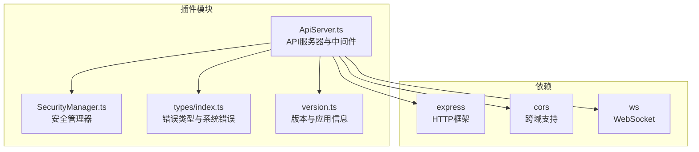
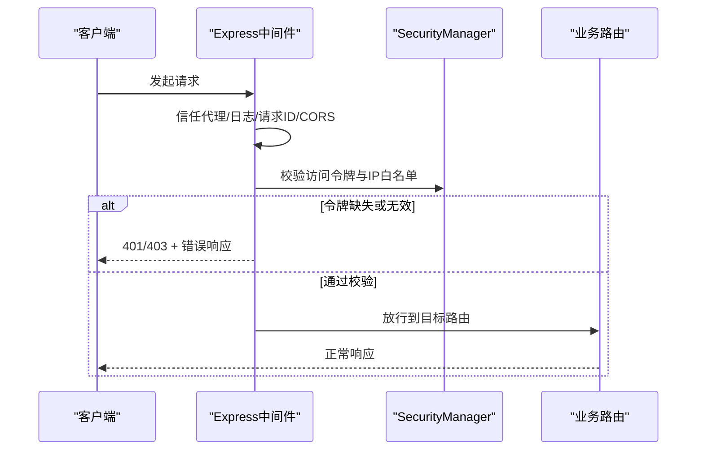
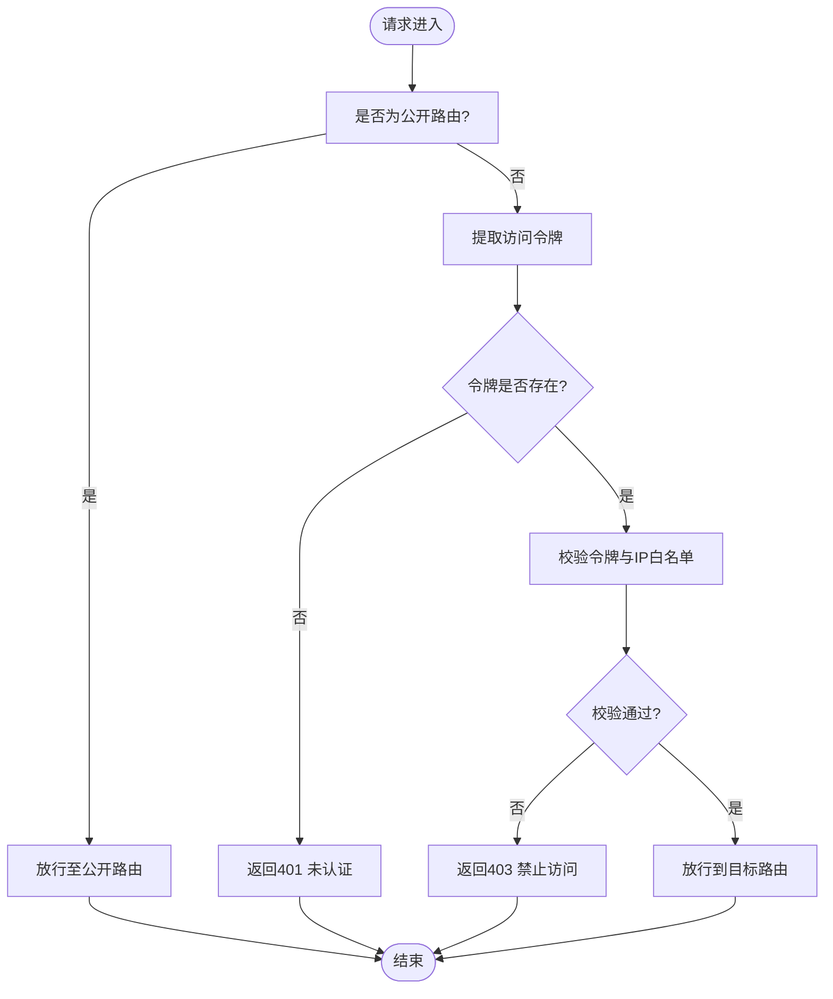
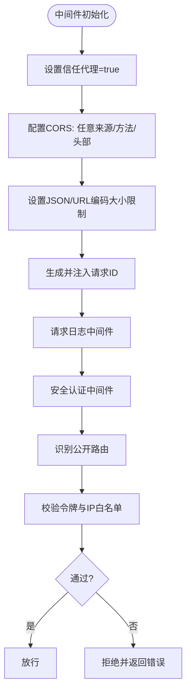
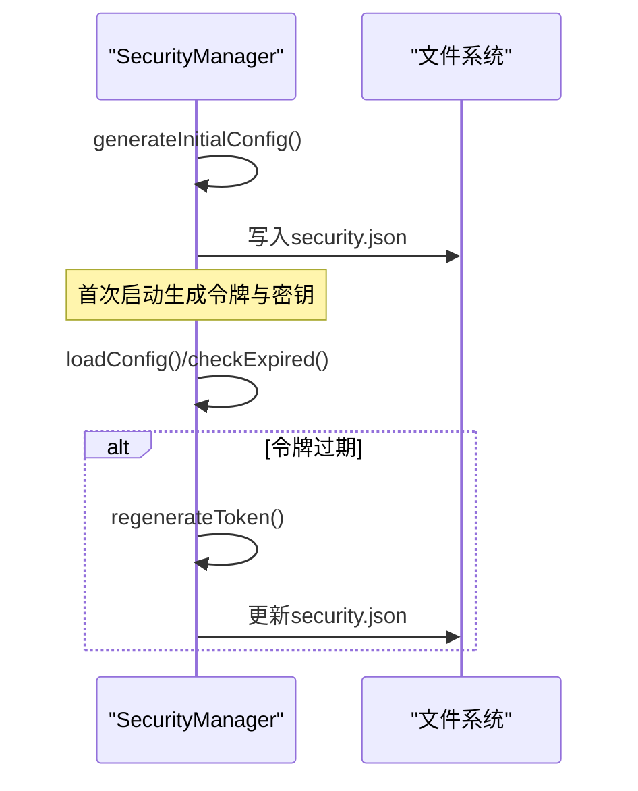
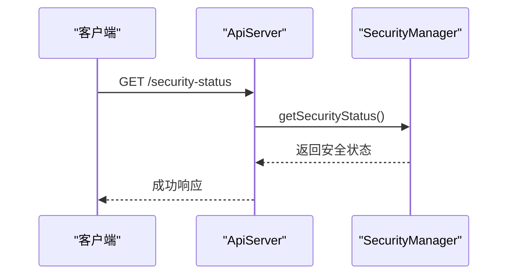
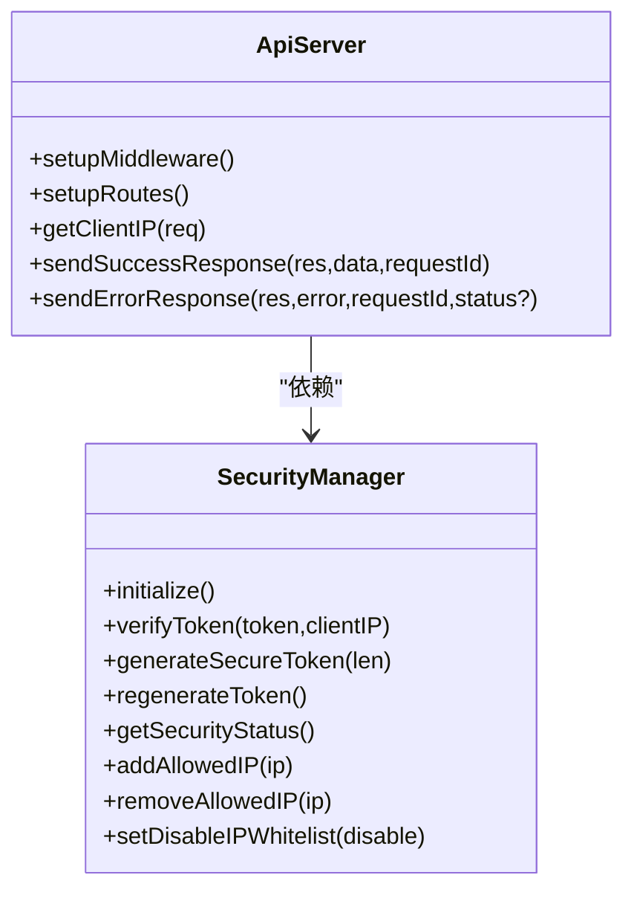

# API认证与安全

<cite>
**本文档引用的文件**
- [ApiServer.ts](file://plugins/qq-chat-exporter/lib/api/ApiServer.ts)
- [SecurityManager.ts](file://plugins/qq-chat-exporter/lib/security/SecurityManager.ts)
- [package.json](file://plugins/qq-chat-exporter/package.json)
- [index.ts](file://plugins/qq-chat-exporter/lib/types/index.ts)
- [version.ts](file://plugins/qq-chat-exporter/lib/version.ts)
</cite>

## 目录
1. [简介](#简介)
2. [项目结构](#项目结构)
3. [核心组件](#核心组件)
4. [架构总览](#架构总览)
5. [详细组件分析](#详细组件分析)
6. [依赖关系分析](#依赖关系分析)
7. [性能考虑](#性能考虑)
8. [故障排除指南](#故障排除指南)
9. [结论](#结论)

## 简介
本文件面向QQ聊天导出器的API认证与安全机制，系统性说明访问控制策略、身份验证方法、权限级别与访问令牌管理；记录安全中间件的配置与使用，包括CORS设置、请求限制与IP白名单；详述API密钥生成、管理和轮换流程；提供安全最佳实践（HTTPS强制、敏感数据保护、SQL注入防护）、CSRF/XSS防护及其他常见Web攻击防范；覆盖安全审计日志与异常访问检测机制，并给出完整配置示例与故障排除指南。

## 项目结构
- 安全相关代码主要集中在插件模块的API层与安全管理器：
  - API服务器负责中间件、路由与认证拦截
  - 安全管理器负责令牌生成、校验、IP白名单与配置持久化
- 依赖项中包含CORS与Express，用于跨域与HTTP中间件支持

**图表来源**
- [ApiServer.ts](file://plugins/qq-chat-exporter/lib/api/ApiServer.ts#L1-L120)
- [SecurityManager.ts](file://plugins/qq-chat-exporter/lib/security/SecurityManager.ts#L1-L60)
- [package.json](file://plugins/qq-chat-exporter/package.json#L22-L30)

**章节来源**
- [ApiServer.ts](file://plugins/qq-chat-exporter/lib/api/ApiServer.ts#L1-L120)
- [SecurityManager.ts](file://plugins/qq-chat-exporter/lib/security/SecurityManager.ts#L1-L60)
- [package.json](file://plugins/qq-chat-exporter/package.json#L22-L30)

## 核心组件
- API服务器（ApiServer）
  - 中间件：信任代理、CORS、JSON解析、请求ID、日志、安全认证
  - 路由：健康检查、安全状态、认证验证、服务器地址配置、IP白名单管理、系统信息等
- 安全管理器（SecurityManager）
  - 配置：访问令牌、密钥、创建时间、最后访问、IP白名单、过期时间、服务器地址
  - 功能：生成初始配置、令牌校验、IP白名单检查、配置热加载、令牌轮换、IP白名单增删改查

**章节来源**
- [ApiServer.ts](file://plugins/qq-chat-exporter/lib/api/ApiServer.ts#L288-L397)
- [SecurityManager.ts](file://plugins/qq-chat-exporter/lib/security/SecurityManager.ts#L10-L521)

## 架构总览
API认证与安全的整体流程如下：

**图表来源**
- [ApiServer.ts](file://plugins/qq-chat-exporter/lib/api/ApiServer.ts#L291-L397)
- [SecurityManager.ts](file://plugins/qq-chat-exporter/lib/security/SecurityManager.ts#L331-L364)

## 详细组件分析

### 认证与授权策略
- 身份验证方法
  - Bearer Token：从请求头Authorization中提取
  - 查询参数token：兼容旧式调用
  - 自定义头X-Access-Token：增强兼容性
- 权限级别
  - 公开路由：健康检查、认证验证、安全状态、静态资源、部分导出资源等无需认证
  - 受保护路由：除公开路由外的所有API均需认证
- 访问令牌管理
  - 令牌生成：首次启动自动生成，长度32字符，包含字母、数字与特殊字符
  - 令牌轮换：支持手动重新生成与自动过期轮换（默认7天后过期）
  - 令牌校验：严格比对，同时进行IP白名单检查（若启用）

**图表来源**
- [ApiServer.ts](file://plugins/qq-chat-exporter/lib/api/ApiServer.ts#L320-L396)
- [SecurityManager.ts](file://plugins/qq-chat-exporter/lib/security/SecurityManager.ts#L334-L364)

**章节来源**
- [ApiServer.ts](file://plugins/qq-chat-exporter/lib/api/ApiServer.ts#L320-L396)
- [SecurityManager.ts](file://plugins/qq-chat-exporter/lib/security/SecurityManager.ts#L238-L329)

### 安全中间件配置与使用
- 信任代理（trust proxy）
  - 开启以正确解析反向代理后的客户端真实IP（Docker/Nginx等场景）
- CORS设置
  - 允许任意来源、常用方法与头部，包含Authorization、X-Request-ID、X-Access-Token等
- 请求限制
  - JSON大小限制：100MB
  - URL编码大小限制：100MB
- IP白名单
  - 支持精确匹配、CIDR网段匹配、通配符
  - Docker环境下默认开启IP白名单禁用选项，便于容器网络访问

**图表来源**
- [ApiServer.ts](file://plugins/qq-chat-exporter/lib/api/ApiServer.ts#L291-L397)

**章节来源**
- [ApiServer.ts](file://plugins/qq-chat-exporter/lib/api/ApiServer.ts#L291-L318)

### API密钥生成、管理与轮换
- 初始生成
  - 首次启动自动生成访问令牌与密钥，写入用户目录下的安全配置文件
- 密钥轮换
  - 支持手动重新生成访问令牌与过期时间
  - 自动过期：默认7天后过期，到期自动重新生成
- 配置持久化
  - 安全配置文件采用热加载，变更后自动生效

**图表来源**
- [SecurityManager.ts](file://plugins/qq-chat-exporter/lib/security/SecurityManager.ts#L238-L291)
- [SecurityManager.ts](file://plugins/qq-chat-exporter/lib/security/SecurityManager.ts#L322-L329)

**章节来源**
- [SecurityManager.ts](file://plugins/qq-chat-exporter/lib/security/SecurityManager.ts#L238-L291)
- [SecurityManager.ts](file://plugins/qq-chat-exporter/lib/security/SecurityManager.ts#L322-L329)

### 安全状态与审计
- 安全状态端点
  - 返回令牌是否过期、创建时间、最后访问时间、服务器IP、Docker环境、IP白名单状态、允许IP列表、当前客户端IP、配置文件路径
- 审计日志
  - 中间件记录每次请求的方法与路径，便于审计与异常追踪

**图表来源**
- [ApiServer.ts](file://plugins/qq-chat-exporter/lib/api/ApiServer.ts#L803-L816)
- [SecurityManager.ts](file://plugins/qq-chat-exporter/lib/security/SecurityManager.ts#L431-L445)

**章节来源**
- [ApiServer.ts](file://plugins/qq-chat-exporter/lib/api/ApiServer.ts#L803-L816)
- [SecurityManager.ts](file://plugins/qq-chat-exporter/lib/security/SecurityManager.ts#L431-L445)

### CSRF与XSS防护
- CSRF防护
  - 当前实现未内置CSRF令牌校验。建议在前端或客户端侧：
    - 使用同源策略与SameSite Cookie（若使用Cookie）
    - 在关键操作中增加一次性令牌并在服务端校验
    - 对敏感操作要求二次确认（前端交互）
- XSS防护
  - 对HTML输出进行转义，避免直接拼接用户输入
  - 建议在前端渲染时统一使用安全的模板引擎或框架内置转义

**章节来源**
- [ApiServer.ts](file://plugins/qq-chat-exporter/lib/api/ApiServer.ts#L530-L538)

### SQL注入防护
- 项目中未发现直接使用SQL查询的逻辑，主要通过核心模块与资源处理器间接访问数据。
- 若未来扩展涉及数据库访问，建议：
  - 使用参数化查询或ORM
  - 输入校验与白名单过滤
  - 最小权限原则与只读查询优先

**章节来源**
- [ApiServer.ts](file://plugins/qq-chat-exporter/lib/api/ApiServer.ts#L1-L80)

### HTTPS与传输安全
- 当前中间件未强制HTTPS，建议：
  - 在反向代理（Nginx/Traefik）层强制重定向至HTTPS
  - 使用Let’s Encrypt证书自动化
  - 配置HSTS头（在反代层设置）

**章节来源**
- [ApiServer.ts](file://plugins/qq-chat-exporter/lib/api/ApiServer.ts#L291-L301)

## 依赖关系分析
- ApiServer依赖SecurityManager进行令牌与IP白名单校验
- 依赖Express与CORS提供HTTP服务与跨域支持
- 类型系统通过SystemError统一错误格式，便于前端与日志处理

**图表来源**
- [ApiServer.ts](file://plugins/qq-chat-exporter/lib/api/ApiServer.ts#L84-L187)
- [SecurityManager.ts](file://plugins/qq-chat-exporter/lib/security/SecurityManager.ts#L133-L521)

**章节来源**
- [ApiServer.ts](file://plugins/qq-chat-exporter/lib/api/ApiServer.ts#L84-L187)
- [SecurityManager.ts](file://plugins/qq-chat-exporter/lib/security/SecurityManager.ts#L133-L521)

## 性能考虑
- 中间件顺序与开销
  - 信任代理与CORS在高频请求下应保持默认配置，避免过度宽松
  - 日志中间件建议按需开启，生产环境可降低日志级别
- 缓存与资源访问
  - 资源文件名缓存采用延迟加载与O(1)查找，减少磁盘扫描
- 并发与连接
  - WebSocket连接集中管理，注意内存占用与心跳检测

**章节来源**
- [ApiServer.ts](file://plugins/qq-chat-exporter/lib/api/ApiServer.ts#L404-L485)

## 故障排除指南
- 常见问题与定位
  - 401 未认证：检查请求头Authorization、查询参数token或X-Access-Token是否正确传递
  - 403 禁止访问：检查IP白名单配置与客户端真实IP是否被允许
  - 令牌过期：调用安全状态端点确认过期时间，必要时重新生成令牌
  - CORS失败：确认浏览器端请求头与实际允许的头部一致
- 排查步骤
  - 使用安全状态端点获取当前配置与状态
  - 检查日志中间件输出的请求信息
  - 在Docker环境下确认是否启用了IP白名单禁用选项
- 修复建议
  - 修正令牌传递方式（Bearer前缀或查询参数）
  - 将当前客户端IP加入白名单或调整CIDR范围
  - 在反向代理层强制HTTPS并配置安全头

**章节来源**
- [ApiServer.ts](file://plugins/qq-chat-exporter/lib/api/ApiServer.ts#L803-L816)
- [SecurityManager.ts](file://plugins/qq-chat-exporter/lib/security/SecurityManager.ts#L334-L364)

## 结论
本项目采用“令牌+IP白名单”的双重认证策略，结合CORS与中间件实现基础安全控制。建议在生产环境中配合反向代理强制HTTPS、完善CSRF/XSS防护、引入参数化查询与最小权限原则，并建立完善的日志与告警机制以提升整体安全性与可观测性。