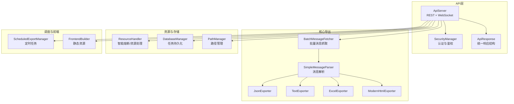
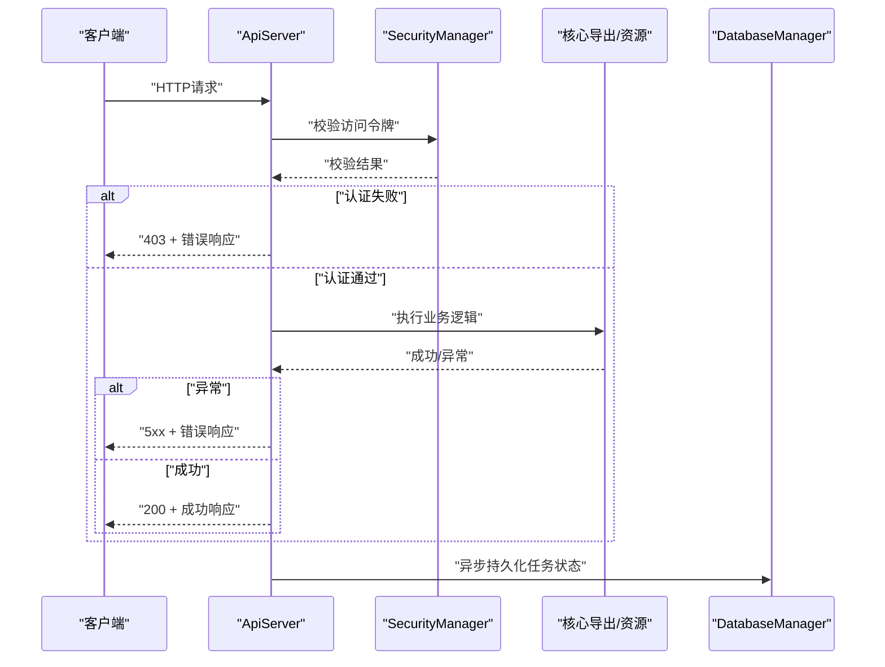
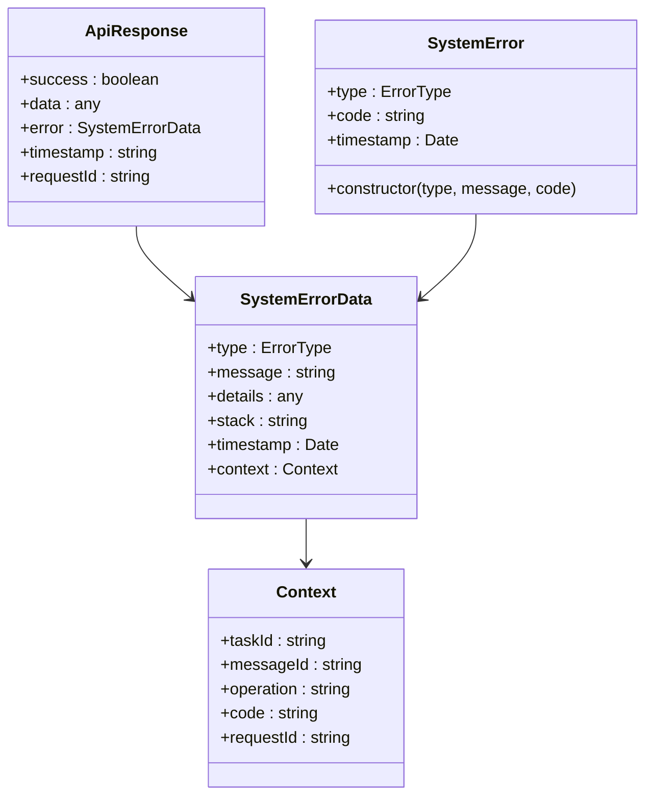
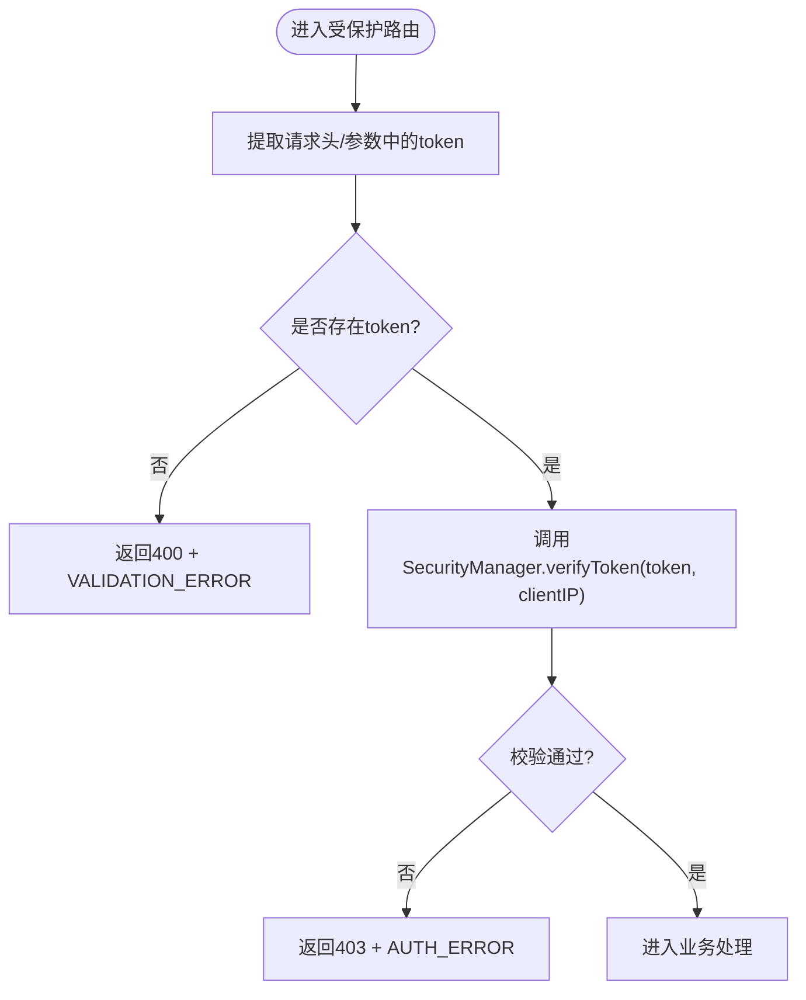
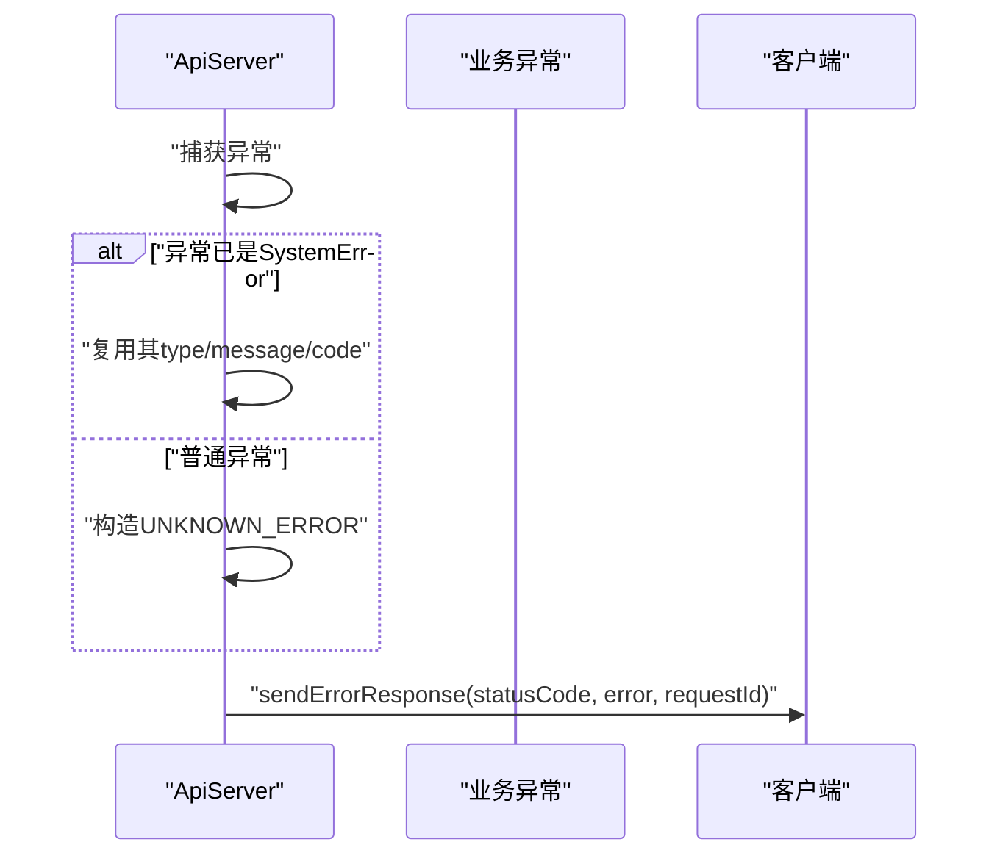
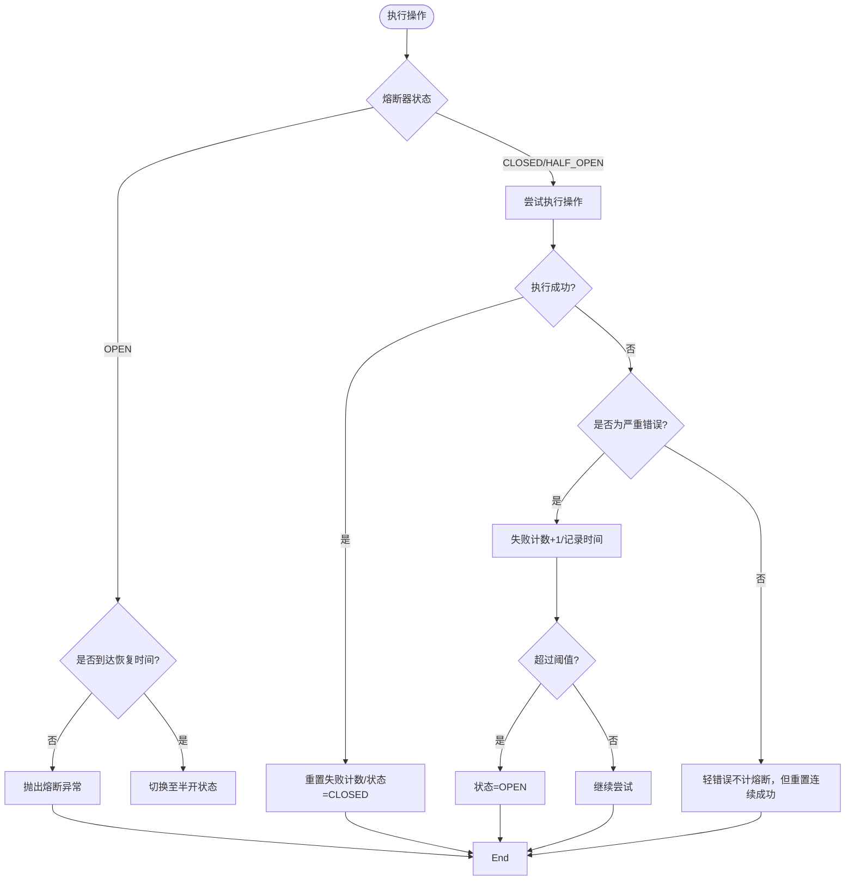
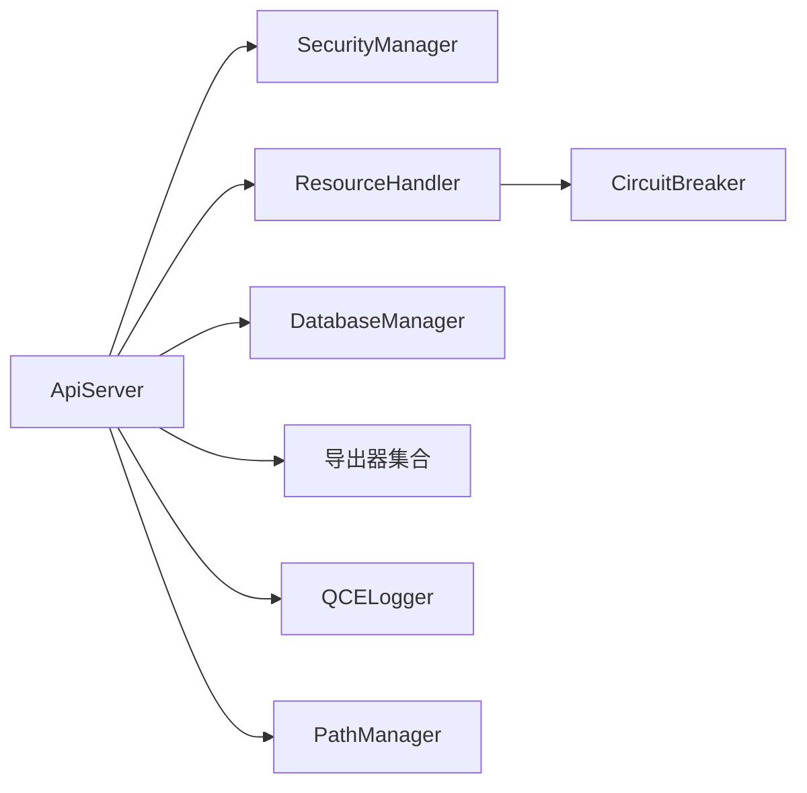

# API错误处理与调试

<cite>
**本文引用的文件**
- [plugins/qq-chat-exporter/lib/api/index.ts](file://plugins/qq-chat-exporter/lib/api/index.ts)
- [plugins/qq-chat-exporter/lib/api/ApiServer.ts](file://plugins/qq-chat-exporter/lib/api/ApiServer.ts)
- [plugins/qq-chat-exporter/lib/times/index.ts](file://plugins/qq-chat-exporter/lib/times/index.ts)
- [plugins/qq-chat-exporter/lib/utils/logger.ts](file://plugins/qq-chat-exporter/lib/utils/logger.ts)
- [plugins/qq-chat-exporter/lib/types/index.ts](file://plugins/qq-chat-exporter/lib/types/index.ts)
- [plugins/qq-chat-exporter/lib/core/resource/ResourceHandler.ts](file://plugins/qq-chat-exporter/lib/core/resource/ResourceHandler.ts)
- [plugins/qq-chat-exporter/dist/core/resource/ResourceHandler.js](file://plugins/qq-chat-exporter/dist/core/resource/ResourceHandler.js)
- [plugins/qq-chat-exporter/lib/security/SecurityManager.ts](file://plugins/qq-chat-exporter/lib/security/SecurityManager.ts)
- [plugins/qq-chat-exporter/lib/services/StreamSearchService.ts](file://plugins/qq-chat-exporter/lib/services/StreamSearchService.ts)
- [plugins/qq-chat-exporter/lib/webui/FrontendBuilder.ts](file://plugins/qq-chat-exporter/lib/webui/FrontendBuilder.ts)
- [plugins/qq-chat-exporter/lib/utils/PathManager.ts](file://plugins/qq-chat-exporter/lib/utils/PathManager.ts)
- [plugins/qq-chat-exporter/lib/version.ts](file://plugins/qq-chat-exporter/lib/version.ts)
- [plugins/qq-chat-exporter/lib/core/exporter/JsonExporter.ts](file://plugins/qq-chat-exporter/lib/core/exporter/JsonExporter.ts)
- [plugins/qq-chat-exporter/lib/core/exporter/TextExporter.ts](file://plugins/qq-chat-exporter/lib/core/exporter/TextExporter.ts)
- [plugins/qq-chat-exporter/lib/core/exporter/ExcelExporter.ts](file://plugins/qq-chat-exporter/lib/core/exporter/ExcelExporter.ts)
- [plugins/qq-chat-exporter/lib/core/exporter/ModernHtmlExporter.ts](file://plugins/qq-chat-exporter/lib/core/exporter/ModernHtmlExporter.ts)
- [plugins/qq-chat-exporter/lib/core/fetcher/BatchMessageFetcher.ts](file://plugins/qq-chat-exporter/lib/core/fetcher/BatchMessageFetcher.ts)
- [plugins/qq-chat-exporter/lib/core/parser/SimpleMessageParser.ts](file://plugins/qq-chat-exporter/lib/core/parser/SimpleMessageParser.ts)
- [plugins/qq-chat-exporter/lib/utils/ZipExporter.ts](file://plugins/qq-chat-exporter/lib/utils/ZipExporter.ts)
- [plugins/qq-chat-exporter/lib/utils/StreamingZipExporter.ts](file://plugins/qq-chat-exporter/lib/utils/StreamingZipExporter.ts)
- [plugins/qq-chat-exporter/lib/core/sticker/StickerPackExporter.ts](file://plugins/qq-chat-exporter/lib/core/sticker/StickerPackExporter.ts)
- [plugins/qq-chat-exporter/lib/core/group/GroupAlbumExporter.ts](file://plugins/qq-chat-exporter/lib/core/group/GroupAlbumExporter.ts)
- [plugins/qq-chat-exporter/lib/core/group/GroupFilesExporter.ts](file://plugins/qq-chat-exporter/lib/core/group/GroupFilesExporter.ts)
- [plugins/qq-chat-exporter/lib/core/scheduler/ScheduledExportManager.ts](file://plugins/qq-chat-exporter/lib/core/scheduler/ScheduledExportManager.ts)
- [plugins/qq-chat-exporter/lib/core/storage/DatabaseManager.ts](file://plugins/qq-chat-exporter/lib/core/storage/DatabaseManager.ts)
- [plugins/qq-chat-exporter/lib/utils/PathManager.ts](file://plugins/qq-chat-exporter/lib/utils/PathManager.ts)
- [plugins/qq-chat-exporter/lib/utils/ZipExporter.ts](file://plugins/qq-chat-exporter/lib/utils/ZipExporter.ts)
- [plugins/qq-chat-exporter/lib/utils/StreamingZipExporter.ts](file://plugins/qq-chat-exporter/lib/utils/StreamingZipExporter.ts)
- [plugins/qq-chat-exporter/lib/core/sticker/StickerPackExporter.ts](file://plugins/qq-chat-exporter/lib/core/sticker/StickerPackExporter.ts)
- [plugins/qq-chat-exporter/lib/core/group/GroupAlbumExporter.ts](file://plugins/qq-chat-exporter/lib/core/group/GroupAlbumExporter.ts)
- [plugins/qq-chat-exporter/lib/core/group/GroupFilesExporter.ts](file://plugins/qq-chat-exporter/lib/core/group/GroupFilesExporter.ts)
- [plugins/qq-chat-exporter/lib/core/scheduler/ScheduledExportManager.ts](file://plugins/qq-chat-exporter/lib/core/scheduler/ScheduledExportManager.ts)
- [plugins/qq-chat-exporter/lib/core/storage/DatabaseManager.ts](file://plugins/qq-chat-exporter/lib/core/storage/DatabaseManager.ts)
- [plugins/qq-chat-exporter/lib/utils/PathManager.ts](file://plugins/qq-chat-exporter/lib/utils/PathManager.ts)
</cite>

## 目录
1. [简介](#简介)
2. [项目结构](#项目结构)
3. [核心组件](#核心组件)
4. [架构总览](#架构总览)
5. [详细组件分析](#详细组件分析)
6. [依赖关系分析](#依赖关系分析)
7. [性能考量](#性能考量)
8. [故障排除指南](#故障排除指南)
9. [结论](#结论)
10. [附录](#附录)

## 简介
本文件面向QQ聊天导出器的API错误处理机制，系统性梳理错误响应标准结构、错误类型与HTTP状态码映射、常见错误场景与诊断流程、调试工具与测试方法、错误日志分析技巧以及性能与恢复策略。目标是帮助开发者与运维人员快速定位问题、制定修复方案并提升系统稳定性。

## 项目结构
QQ聊天导出器采用“插件+WebUI”的架构，API层位于插件工程内，负责对外提供REST接口与WebSocket事件推送；核心导出能力由多个子模块协同完成；安全与资源管理通过独立模块实现；日志与版本信息贯穿各模块。

图表来源
- [plugins/qq-chat-exporter/lib/api/ApiServer.ts](file://plugins/qq-chat-exporter/lib/api/ApiServer.ts#L1-L200)
- [plugins/qq-chat-exporter/lib/api/ApiServer.ts](file://plugins/qq-chat-exporter/lib/api/ApiServer.ts#L4800-L4999)
- [plugins/qq-chat-exporter/lib/core/fetcher/BatchMessageFetcher.ts](file://plugins/qq-chat-exporter/lib/core/fetcher/BatchMessageFetcher.ts)
- [plugins/qq-chat-exporter/lib/core/parser/SimpleMessageParser.ts](file://plugins/qq-chat-exporter/lib/core/parser/SimpleMessageParser.ts)
- [plugins/qq-chat-exporter/lib/core/exporter/JsonExporter.ts](file://plugins/qq-chat-exporter/lib/core/exporter/JsonExporter.ts)
- [plugins/qq-chat-exporter/lib/core/exporter/TextExporter.ts](file://plugins/qq-chat-exporter/lib/core/exporter/TextExporter.ts)
- [plugins/qq-chat-exporter/lib/core/exporter/ExcelExporter.ts](file://plugins/qq-chat-exporter/lib/core/exporter/ExcelExporter.ts)
- [plugins/qq-chat-exporter/lib/core/exporter/ModernHtmlExporter.ts](file://plugins/qq-chat-exporter/lib/core/exporter/ModernHtmlExporter.ts)
- [plugins/qq-chat-exporter/lib/core/resource/ResourceHandler.ts](file://plugins/qq-chat-exporter/lib/core/resource/ResourceHandler.ts)
- [plugins/qq-chat-exporter/lib/core/storage/DatabaseManager.ts](file://plugins/qq-chat-exporter/lib/core/storage/DatabaseManager.ts)
- [plugins/qq-chat-exporter/lib/utils/PathManager.ts](file://plugins/qq-chat-exporter/lib/utils/PathManager.ts)
- [plugins/qq-chat-exporter/lib/core/scheduler/ScheduledExportManager.ts](file://plugins/qq-chat-exporter/lib/core/scheduler/ScheduledExportManager.ts)
- [plugins/qq-chat-exporter/lib/webui/FrontendBuilder.ts](file://plugins/qq-chat-exporter/lib/webui/FrontendBuilder.ts)

章节来源
- [plugins/qq-chat-exporter/lib/api/index.ts](file://plugins/qq-chat-exporter/lib/api/index.ts#L1-L35)
- [plugins/qq-chat-exporter/lib/api/ApiServer.ts](file://plugins/qq-chat-exporter/lib/api/ApiServer.ts#L1-L200)

## 核心组件
- API服务器与中间件：负责路由注册、请求校验、认证拦截、统一响应与错误处理。
- 统一响应结构：所有接口返回success、data/error、timestamp、requestId等字段，便于前端与监控系统消费。
- 错误类型体系：以枚举形式定义错误类别，结合业务错误码形成标准化错误描述。
- 安全管理器：提供令牌校验、白名单/IP检测、安全状态查询等能力。
- 资源处理器与智能熔断：对资源下载/处理进行熔断保护，区分业务错误与系统故障。
- 日志系统：提供彩色控制台日志、级别控制与上下文输出，支持调试模式。

章节来源
- [plugins/qq-chat-exporter/lib/api/ApiServer.ts](file://plugins/qq-chat-exporter/lib/api/ApiServer.ts#L56-L80)
- [plugins/qq-chat-exporter/lib/types/index.ts](file://plugins/qq-chat-exporter/lib/types/index.ts#L428-L506)
- [plugins/qq-chat-exporter/lib/utils/logger.ts](file://plugins/qq-chat-exporter/lib/utils/logger.ts#L1-L114)
- [plugins/qq-chat-exporter/lib/core/resource/ResourceHandler.ts](file://plugins/qq-chat-exporter/lib/core/resource/ResourceHandler.ts#L67-L193)

## 架构总览
API层作为统一入口，向上提供REST与WebSocket能力，向下协调导出、资源、存储与调度模块。错误处理在API层集中实现，确保响应一致性与可观测性。

图表来源
- [plugins/qq-chat-exporter/lib/api/ApiServer.ts](file://plugins/qq-chat-exporter/lib/api/ApiServer.ts#L371-L423)
- [plugins/qq-chat-exporter/lib/api/ApiServer.ts](file://plugins/qq-chat-exporter/lib/api/ApiServer.ts#L4819-L4853)
- [plugins/qq-chat-exporter/lib/core/storage/DatabaseManager.ts](file://plugins/qq-chat-exporter/lib/core/storage/DatabaseManager.ts)

## 详细组件分析

### 统一响应与错误模型
- 成功响应：包含success=true、data、timestamp、requestId。
- 错误响应：包含success=false、error对象（type、message、timestamp、stack、context）、timestamp、requestId。
- 错误上下文：包含code（业务错误码）、requestId，便于追踪与审计。
- 错误类型：API_ERROR、NETWORK_ERROR、DATABASE_ERROR、RESOURCE_ERROR、FILESYSTEM_ERROR、CONFIG_ERROR、VALIDATION_ERROR、PERMISSION_ERROR、TIMEOUT_ERROR、AUTH_ERROR、UNKNOWN_ERROR。

图表来源
- [plugins/qq-chat-exporter/lib/api/ApiServer.ts](file://plugins/qq-chat-exporter/lib/api/ApiServer.ts#L56-L80)
- [plugins/qq-chat-exporter/lib/types/index.ts](file://plugins/qq-chat-exporter/lib/types/index.ts#L458-L506)

章节来源
- [plugins/qq-chat-exporter/lib/api/ApiServer.ts](file://plugins/qq-chat-exporter/lib/api/ApiServer.ts#L56-L80)
- [plugins/qq-chat-exporter/lib/types/index.ts](file://plugins/qq-chat-exporter/lib/types/index.ts#L428-L506)

### 认证与授权中间件
- 中间件拦截所有受保护路由，提取token并调用安全管理器校验。
- 若缺少token，返回401/403与VALIDATION_ERROR/AUTH_ERROR。
- 校验通过后进入业务处理；失败则立即返回错误响应。

图表来源
- [plugins/qq-chat-exporter/lib/api/ApiServer.ts](file://plugins/qq-chat-exporter/lib/api/ApiServer.ts#L371-L423)

章节来源
- [plugins/qq-chat-exporter/lib/api/ApiServer.ts](file://plugins/qq-chat-exporter/lib/api/ApiServer.ts#L371-L423)

### 错误响应发送流程
- sendSuccessResponse：构造成功响应并返回。
- sendErrorResponse：将任意异常包装为SystemError（若非SystemError），填充错误上下文与请求ID，设置HTTP状态码并返回。

图表来源
- [plugins/qq-chat-exporter/lib/api/ApiServer.ts](file://plugins/qq-chat-exporter/lib/api/ApiServer.ts#L4819-L4853)

章节来源
- [plugins/qq-chat-exporter/lib/api/ApiServer.ts](file://plugins/qq-chat-exporter/lib/api/ApiServer.ts#L4819-L4853)

### 智能熔断与资源处理
- ResourceHandler内置CircuitBreaker，区分“轻微业务错误”和“系统故障”，仅对后者计入熔断阈值。
- 轻微错误（如404、未找到、权限/认证错误、磁盘配额、空路径等）不触发熔断，但会重置连续成功计数。
- 熔断开启时，后续操作会被拒绝，直到恢复时间到达后进入半开试探。

图表来源
- [plugins/qq-chat-exporter/lib/core/resource/ResourceHandler.ts](file://plugins/qq-chat-exporter/lib/core/resource/ResourceHandler.ts#L85-L193)
- [plugins/qq-chat-exporter/dist/core/resource/ResourceHandler.js](file://plugins/qq-chat-exporter/dist/core/resource/ResourceHandler.js#L39-L133)

章节来源
- [plugins/qq-chat-exporter/lib/core/resource/ResourceHandler.ts](file://plugins/qq-chat-exporter/lib/core/resource/ResourceHandler.ts#L67-L193)
- [plugins/qq-chat-exporter/dist/core/resource/ResourceHandler.js](file://plugins/qq-chat-exporter/dist/core/resource/ResourceHandler.js#L39-L133)

### 错误类型与HTTP状态码映射
- 认证失败：403 + AUTH_ERROR（INVALID_TOKEN/MISSING_TOKEN）。
- 参数缺失/非法：400 + VALIDATION_ERROR（如缺少token）。
- 业务资源不存在/权限不足：404/403 + RESOURCE_ERROR/PERMISSION_ERROR（由具体业务抛出）。
- 系统内部错误：500 + UNKNOWN_ERROR（未捕获异常）。
- 超时：根据超时策略返回504或业务错误（TIMEOUT_ERROR）。
- 其他网络异常：依据底层网络库返回，通常映射为502/503/504。

章节来源
- [plugins/qq-chat-exporter/lib/api/ApiServer.ts](file://plugins/qq-chat-exporter/lib/api/ApiServer.ts#L371-L423)
- [plugins/qq-chat-exporter/lib/api/ApiServer.ts](file://plugins/qq-chat-exporter/lib/api/ApiServer.ts#L4819-L4853)
- [plugins/qq-chat-exporter/lib/types/index.ts](file://plugins/qq-chat-exporter/lib/types/index.ts#L428-L506)

### 常见错误场景与诊断步骤
- 网络错误
  - 现象：请求超时、连接中断、DNS解析失败。
  - 诊断：检查网络连通性、代理设置、防火墙规则；确认服务监听地址与端口。
  - 解决：修复网络环境、调整超时参数、使用稳定代理。
- 认证失败
  - 现象：403，提示无效令牌或缺少令牌。
  - 诊断：核对令牌生成方式、有效期、客户端IP白名单；查看安全状态接口。
  - 解决：重新签发令牌、更新白名单、修正客户端IP。
- 参数验证错误
  - 现象：400，提示缺少必要参数或参数非法。
  - 诊断：对照接口文档检查请求体/查询参数；查看日志中的上下文信息。
  - 解决：补齐必填项、修正参数类型与范围。
- 资源不存在/权限不足
  - 现象：404/403，提示资源不存在或权限不足。
  - 诊断：确认资源ID/路径正确性、检查文件系统权限与磁盘配额。
  - 解决：修正路径/ID、调整权限或清理过期资源。
- 熔断保护触发
  - 现象：大量请求被拒绝，提示熔断恢复倒计时。
  - 诊断：查看熔断器状态与失败计数；分析最近失败原因。
  - 解决：降低并发、修复上游问题、等待恢复或手动重置。

章节来源
- [plugins/qq-chat-exporter/lib/api/ApiServer.ts](file://plugins/qq-chat-exporter/lib/api/ApiServer.ts#L371-L423)
- [plugins/qq-chat-exporter/lib/core/resource/ResourceHandler.ts](file://plugins/qq-chat-exporter/lib/core/resource/ResourceHandler.ts#L140-L158)

### API调试工具与测试方法
- 健康检查与安全状态
  - GET /health：检查服务运行状态与在线状态。
  - GET /security-status：查看安全配置与是否需要认证。
- 认证验证
  - POST /auth：传入token进行验证，返回认证结果与IP信息。
- 日志与调试
  - 使用QCELogger输出彩色日志；开启QCE_DEBUG=true输出调试日志。
  - 在错误响应中携带requestId，便于跨模块关联日志。
- 前端调试
  - 通过WebUI查看任务状态、导出进度与错误信息；结合浏览器开发者工具观察网络请求与响应。

章节来源
- [plugins/qq-chat-exporter/lib/api/ApiServer.ts](file://plugins/qq-chat-exporter/lib/api/ApiServer.ts#L394-L423)
- [plugins/qq-chat-exporter/lib/utils/logger.ts](file://plugins/qq-chat-exporter/lib/utils/logger.ts#L69-L73)

### 错误日志分析技巧
- 关联requestId：所有错误响应包含requestId，结合服务端日志与客户端日志进行交叉定位。
- 分类聚合：按ErrorType与code分类统计，识别高频错误与热点问题。
- 上下文提取：关注SystemError.context中的任务ID、消息ID、操作名等字段，辅助回溯调用链。
- 性能指标：结合任务状态与资源处理耗时，定位慢点与瓶颈。

章节来源
- [plugins/qq-chat-exporter/lib/api/ApiServer.ts](file://plugins/qq-chat-exporter/lib/api/ApiServer.ts#L4835-L4853)
- [plugins/qq-chat-exporter/lib/types/index.ts](file://plugins/qq-chat-exporter/lib/types/index.ts#L469-L476)

### 性能问题排查方法
- 资源下载与导出
  - 观察资源处理器的熔断状态与失败计数，避免频繁重试导致雪崩。
  - 合理设置批大小与并发度，平衡吞吐与稳定性。
- 数据库写入
  - 异步保存任务状态，避免阻塞主流程；关注数据库锁与索引。
- 导出格式选择
  - 大体量导出优先考虑流式压缩与分块写入，减少内存占用。
- 前端构建与静态资源
  - 使用FrontendBuilder优化静态资源加载，减少首屏等待。

章节来源
- [plugins/qq-chat-exporter/lib/api/ApiServer.ts](file://plugins/qq-chat-exporter/lib/api/ApiServer.ts#L4988-L4999)
- [plugins/qq-chat-exporter/lib/utils/StreamingZipExporter.ts](file://plugins/qq-chat-exporter/lib/utils/StreamingZipExporter.ts)
- [plugins/qq-chat-exporter/lib/webui/FrontendBuilder.ts](file://plugins/qq-chat-exporter/lib/webui/FrontendBuilder.ts)

### 错误恢复策略与降级处理
- 熔断降级：当熔断器开启时，拒绝新请求并提示恢复时间；半开状态进行试探性放行。
- 超时与重试：对可重试的网络/IO错误进行有限次重试，避免无限循环。
- 降级开关：在资源不可用时，返回明确的业务错误而非系统异常，指导前端展示友好提示。
- 回滚与补偿：对部分成功的任务记录当前进度，支持后续补偿处理。

章节来源
- [plugins/qq-chat-exporter/lib/core/resource/ResourceHandler.ts](file://plugins/qq-chat-exporter/lib/core/resource/ResourceHandler.ts#L85-L135)
- [plugins/qq-chat-exporter/lib/api/ApiServer.ts](file://plugins/qq-chat-exporter/lib/api/ApiServer.ts#L4935-L4983)

## 依赖关系分析
API层依赖安全、资源、存储与导出模块；资源模块内部集成熔断器；日志与路径管理贯穿全局。

图表来源
- [plugins/qq-chat-exporter/lib/api/ApiServer.ts](file://plugins/qq-chat-exporter/lib/api/ApiServer.ts#L140-L187)
- [plugins/qq-chat-exporter/lib/core/resource/ResourceHandler.ts](file://plugins/qq-chat-exporter/lib/core/resource/ResourceHandler.ts#L67-L80)
- [plugins/qq-chat-exporter/lib/utils/logger.ts](file://plugins/qq-chat-exporter/lib/utils/logger.ts#L103-L114)
- [plugins/qq-chat-exporter/lib/utils/PathManager.ts](file://plugins/qq-chat-exporter/lib/utils/PathManager.ts)

章节来源
- [plugins/qq-chat-exporter/lib/api/ApiServer.ts](file://plugins/qq-chat-exporter/lib/api/ApiServer.ts#L140-L187)

## 性能考量
- 响应结构最小化：仅传输必要字段，避免冗余数据。
- 异步持久化：保存任务状态异步进行，降低主流程延迟。
- 流式导出：大文件采用流式写入与压缩，减少内存峰值。
- 并发控制：合理设置资源下载与消息抓取的并发度，避免资源争用。

## 故障排除指南
- 快速定位
  - 查看HTTP状态码与错误类型，确认属于认证、参数、资源还是系统错误。
  - 通过requestId在服务端日志中检索完整调用链。
- 常见问题清单
  - 403：检查令牌有效性与IP白名单。
  - 400：核对请求参数与数据类型。
  - 404：确认资源ID/路径与权限。
  - 500：查看堆栈与SystemError.context，定位具体模块。
  - 熔断：等待恢复时间或修复上游问题。
- 修复建议
  - 优化网络与代理配置。
  - 调整超时与重试策略。
  - 修复权限与磁盘配额问题。
  - 降低并发或优化上游性能。

章节来源
- [plugins/qq-chat-exporter/lib/api/ApiServer.ts](file://plugins/qq-chat-exporter/lib/api/ApiServer.ts#L4819-L4853)
- [plugins/qq-chat-exporter/lib/core/resource/ResourceHandler.ts](file://plugins/qq-chat-exporter/lib/core/resource/ResourceHandler.ts#L140-L158)

## 结论
通过统一的错误模型、严格的认证与中间件拦截、智能熔断与详尽的日志体系，QQ聊天导出器的API实现了高可靠与易诊断的错误处理机制。遵循本文提供的诊断流程与最佳实践，可显著缩短故障定位时间并提升系统稳定性。

## 附录
- 版本与信息：通过版本模块获取应用信息与版本号，便于排障时提供环境信息。
- 路径管理：确保导出目录、缓存目录与数据库文件存在，避免因路径问题引发错误。

章节来源
- [plugins/qq-chat-exporter/lib/version.ts](file://plugins/qq-chat-exporter/lib/version.ts)
- [plugins/qq-chat-exporter/lib/utils/PathManager.ts](file://plugins/qq-chat-exporter/lib/utils/PathManager.ts)