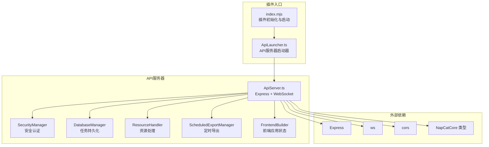
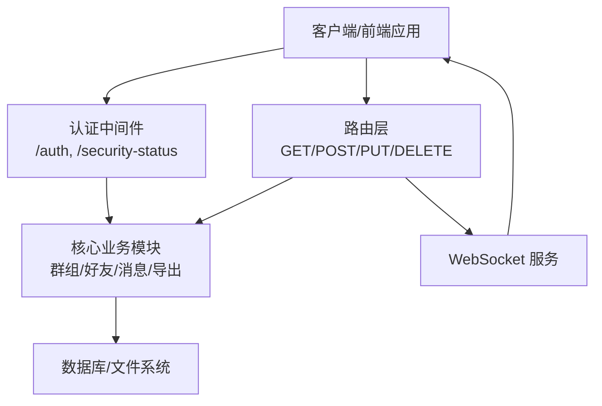
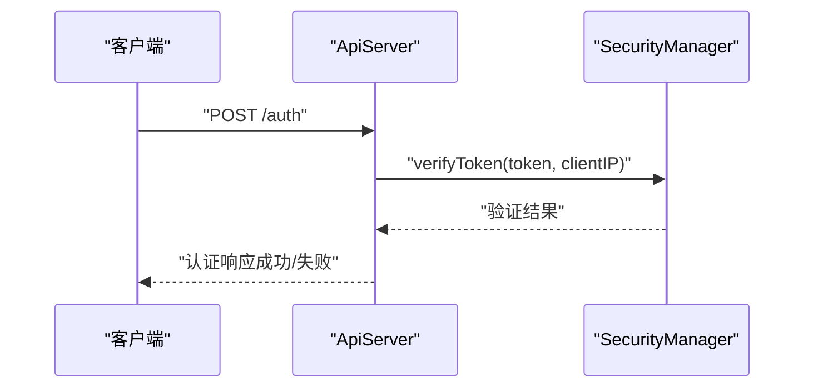
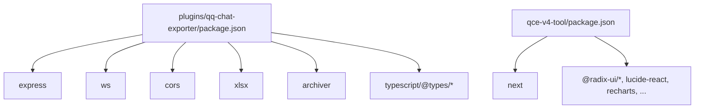

# REST API接口

<cite>
**本文档引用的文件**
- [plugins/qq-chat-exporter/index.mjs](file://plugins/qq-chat-exporter/index.mjs)
- [plugins/qq-chat-exporter/lib/api/ApiLauncher.ts](file://plugins/qq-chat-exporter/lib/api/ApiLauncher.ts)
- [plugins/qq-chat-exporter/lib/api/ApiServer.ts](file://plugins/qq-chat-exporter/lib/api/ApiServer.ts)
- [plugins/qq-chat-exporter/package.json](file://plugins/qq-chat-exporter/package.json)
- [qce-v4-tool/package.json](file://qce-v4-tool/package.json)
</cite>

## 目录
1. [简介](#简介)
2. [项目结构](#项目结构)
3. [核心组件](#核心组件)
4. [架构总览](#架构总览)
5. [详细组件分析](#详细组件分析)
6. [依赖关系分析](#依赖关系分析)
7. [性能考虑](#性能考虑)
8. [故障排除指南](#故障排除指南)
9. [结论](#结论)
10. [附录](#附录)

## 简介
本文件为 QQ 聊天导出器的 REST API 接口文档，覆盖所有 HTTP 端点的 URL 路径、请求方法、认证机制、请求参数、请求体格式、响应数据结构与状态码含义，并提供完整的请求/响应示例与错误处理策略。API 采用统一的响应格式，支持健康检查、群组管理、好友管理、消息处理、导出任务管理、配置管理、文件下载、表情包与群相册/群文件导出等功能。

## 项目结构
QQ 聊天导出器的 API 服务器由插件入口负责启动，核心逻辑位于 ApiServer 类中，通过 Express 提供 HTTP 接口，WebSocket 提供实时通知，同时集成安全认证、资源管理与定时导出等功能模块。

**图表来源**
- [plugins/qq-chat-exporter/index.mjs](file://plugins/qq-chat-exporter/index.mjs#L28-L64)
- [plugins/qq-chat-exporter/lib/api/ApiLauncher.ts](file://plugins/qq-chat-exporter/lib/api/ApiLauncher.ts#L17-L32)
- [plugins/qq-chat-exporter/lib/api/ApiServer.ts](file://plugins/qq-chat-exporter/lib/api/ApiServer.ts#L141-L187)

**章节来源**
- [plugins/qq-chat-exporter/index.mjs](file://plugins/qq-chat-exporter/index.mjs#L28-L64)
- [plugins/qq-chat-exporter/lib/api/ApiLauncher.ts](file://plugins/qq-chat-exporter/lib/api/ApiLauncher.ts#L1-L68)
- [plugins/qq-chat-exporter/lib/api/ApiServer.ts](file://plugins/qq-chat-exporter/lib/api/ApiServer.ts#L141-L187)

## 核心组件
- 插件入口与启动器
  - 插件入口负责检测运行环境并动态加载 TypeScript 源码，创建并启动 API 服务器。
  - API 启动器封装了服务器的启动、停止与重启流程，并提供状态查询。
- API 服务器
  - 基于 Express 提供 HTTP 接口，内置 CORS、JSON 解析、请求 ID、日志与安全认证中间件。
  - 提供 WebSocket 通道用于实时进度与事件推送。
  - 集成数据库管理、资源处理、定时导出、前端构建器等子系统。
- 安全与认证
  - 支持基于令牌的认证，公开路由无需认证；其他路由需携带有效的访问令牌。
  - 支持 IP 白名单与安全状态查询。

**章节来源**
- [plugins/qq-chat-exporter/index.mjs](file://plugins/qq-chat-exporter/index.mjs#L28-L64)
- [plugins/qq-chat-exporter/lib/api/ApiLauncher.ts](file://plugins/qq-chat-exporter/lib/api/ApiLauncher.ts#L17-L62)
- [plugins/qq-chat-exporter/lib/api/ApiServer.ts](file://plugins/qq-chat-exporter/lib/api/ApiServer.ts#L291-L397)

## 架构总览
下图展示了 API 的整体架构与关键组件交互：

**图表来源**
- [plugins/qq-chat-exporter/lib/api/ApiServer.ts](file://plugins/qq-chat-exporter/lib/api/ApiServer.ts#L291-L397)
- [plugins/qq-chat-exporter/lib/api/ApiServer.ts](file://plugins/qq-chat-exporter/lib/api/ApiServer.ts#L718-L791)

## 详细组件分析

### 统一响应格式
所有 API 响应遵循统一格式，包含成功标志、数据主体、错误对象、时间戳与请求 ID。

- 字段说明
  - success: 布尔值，请求是否成功
  - data: 成功时返回的数据对象或数组
  - error: 失败时返回的错误对象
  - timestamp: ISO 时间字符串
  - requestId: 请求唯一标识

- 错误对象字段
  - type: 错误类型枚举
  - message: 错误描述
  - code: 错误码
  - timestamp: 发生时间
  - context: 上下文信息（如 requestId）

- 状态码
  - 200: 成功
  - 400: 参数校验失败或请求格式错误
  - 401: 缺少或无效访问令牌
  - 403: 访问被拒绝（令牌无效或权限不足）
  - 404: 资源不存在
  - 500: 服务器内部错误

**章节来源**
- [plugins/qq-chat-exporter/lib/api/ApiServer.ts](file://plugins/qq-chat-exporter/lib/api/ApiServer.ts#L56-L79)
- [plugins/qq-chat-exporter/lib/api/ApiServer.ts](file://plugins/qq-chat-exporter/lib/api/ApiServer.ts#L3249-L3262)

### 认证与安全
- 认证方式
  - Bearer Token：通过 Authorization 头传递，格式为 Bearer xxx
  - 查询参数 token：也可通过查询参数传入
  - 自定义头 X-Access-Token：支持该头部
- 公开路由
  - /、/health、/auth、/security-status、/qce-v4-tool 及部分静态资源与导出资源访问
- 安全状态
  - /security-status 返回服务器安全状态与对外 IP

- 认证流程序列图

**图表来源**
- [plugins/qq-chat-exporter/lib/api/ApiServer.ts](file://plugins/qq-chat-exporter/lib/api/ApiServer.ts#L412-L423)
- [plugins/qq-chat-exporter/lib/api/ApiServer.ts](file://plugins/qq-chat-exporter/lib/api/ApiServer.ts#L354-L396)

**章节来源**
- [plugins/qq-chat-exporter/lib/api/ApiServer.ts](file://plugins/qq-chat-exporter/lib/api/ApiServer.ts#L320-L397)
- [plugins/qq-chat-exporter/lib/api/ApiServer.ts](file://plugins/qq-chat-exporter/lib/api/ApiServer.ts#L818-L840)
- [plugins/qq-chat-exporter/lib/api/ApiServer.ts](file://plugins/qq-chat-exporter/lib/api/ApiServer.ts#L803-L810)

### 健康检查与系统信息
- GET /health
  - 用途：检查服务健康状态
  - 响应字段：status、online、timestamp、uptime
- GET /api/system/info
  - 用途：获取系统信息
- GET /api/system/status
  - 用途：获取系统状态

**章节来源**
- [plugins/qq-chat-exporter/lib/api/ApiServer.ts](file://plugins/qq-chat-exporter/lib/api/ApiServer.ts#L793-L801)
- [plugins/qq-chat-exporter/lib/api/ApiServer.ts](file://plugins/qq-chat-exporter/lib/api/ApiServer.ts#L1007-L1016)

### 配置管理
- GET /api/config
  - 用途：获取当前配置
- PUT /api/config
  - 请求体：配置对象（如自定义输出目录、定时导出目录）
  - 用途：更新配置

**章节来源**
- [plugins/qq-chat-exporter/lib/api/ApiServer.ts](file://plugins/qq-chat-exporter/lib/api/ApiServer.ts#L1016-L1045)

### 群组管理
- GET /api/groups
  - 查询参数：page、limit、forceRefresh
  - 用途：获取所有群组（支持分页）
- GET /api/groups/:groupCode
  - 路径参数：groupCode
  - 查询参数：forceRefresh
  - 用途：获取群组详情
- GET /api/groups/:groupCode/members
  - 用途：获取群成员列表
- GET /api/groups/:groupCode/essence
  - 用途：获取群精华消息列表
- POST /api/groups/:groupCode/essence/export
  - 请求体：导出配置（如格式、时间范围等）
  - 用途：导出群精华消息

**章节来源**
- [plugins/qq-chat-exporter/lib/api/ApiServer.ts](file://plugins/qq-chat-exporter/lib/api/ApiServer.ts#L1118-L1194)
- [plugins/qq-chat-exporter/lib/api/ApiServer.ts](file://plugins/qq-chat-exporter/lib/api/ApiServer.ts#L1194-L1247)

### 好友管理
- GET /api/friends
  - 查询参数：page、limit
  - 用途：获取所有好友（支持分页）
- GET /api/friends/:uid
  - 路径参数：uid
  - 查询参数：no_cache
  - 用途：获取好友详情

**章节来源**
- [plugins/qq-chat-exporter/lib/api/ApiServer.ts](file://plugins/qq-chat-exporter/lib/api/ApiServer.ts#L1135-L1155)

### 用户信息
- GET /api/users/:uid
  - 用途：获取用户信息

**章节来源**
- [plugins/qq-chat-exporter/lib/api/ApiServer.ts](file://plugins/qq-chat-exporter/lib/api/ApiServer.ts#L1155-L1175)

### 消息处理
- POST /api/messages/fetch
  - 请求体：会话标识、起止时间、分页参数等
  - 用途：批量获取消息
- POST /api/messages/export
  - 请求体：导出配置（如格式、过滤条件等）
  - 用途：导出消息（支持过滤纯图片消息）

**章节来源**
- [plugins/qq-chat-exporter/lib/api/ApiServer.ts](file://plugins/qq-chat-exporter/lib/api/ApiServer.ts#L1175-L1194)

### 导出任务管理
- GET /api/tasks
  - 用途：获取所有导出任务
- GET /api/tasks/:taskId
  - 用途：获取指定任务状态
- DELETE /api/tasks/:taskId
  - 用途：删除任务
- DELETE /api/tasks/:taskId/original-files
  - 用途：删除 ZIP 导出的原始文件

**章节来源**
- [plugins/qq-chat-exporter/lib/api/ApiServer.ts](file://plugins/qq-chat-exporter/lib/api/ApiServer.ts#L1194-L1247)

### 表情包管理
- GET /api/sticker-packs
  - 查询参数：types（可选类型筛选）
  - 用途：获取表情包列表
- POST /api/sticker-packs/export
  - 请求体：目标表情包标识与导出配置
  - 用途：导出指定表情包
- POST /api/sticker-packs/export-all
  - 请求体：导出配置
  - 用途：导出所有表情包
- GET /api/sticker-packs/export-records
  - 查询参数：limit
  - 用途：获取导出记录

**章节来源**
- [plugins/qq-chat-exporter/lib/api/ApiServer.ts](file://plugins/qq-chat-exporter/lib/api/ApiServer.ts#L1247-L1290)

### 群相册管理
- GET /api/groups/:groupCode/albums
  - 用途：获取群相册列表
- GET /api/groups/:groupCode/albums/:albumId/media
  - 用途：获取相册媒体列表
- POST /api/groups/:groupCode/albums/export
  - 请求体：导出配置
  - 用途：导出群相册
- GET /api/group-albums/export-records
  - 查询参数：limit
  - 用途：获取群相册导出记录

**章节来源**
- [plugins/qq-chat-exporter/lib/api/ApiServer.ts](file://plugins/qq-chat-exporter/lib/api/ApiServer.ts#L1290-L1330)

### 群文件管理
- GET /api/groups/:groupCode/files
  - 用途：获取群文件列表
- GET /api/groups/:groupCode/files/count
  - 用途：获取群文件数量
- POST /api/groups/:groupCode/files/download
  - 请求体：文件标识
  - 用途：获取单个文件下载链接
- POST /api/groups/:groupCode/files/export
  - 请求体：导出配置
  - 用途：导出群文件列表
- POST /api/groups/:groupCode/files/export-with-download
  - 请求体：导出配置
  - 用途：导出群文件（含下载）
- GET /api/group-files/export-records
  - 查询参数：limit
  - 用途：获取群文件导出记录

**章节来源**
- [plugins/qq-chat-exporter/lib/api/ApiServer.ts](file://plugins/qq-chat-exporter/lib/api/ApiServer.ts#L1330-L1380)

### 文件下载与资源访问
- GET /api/exports/files
  - 用途：离线查看聊天记录索引
- GET /api/exports/files/:sessionId/preview
  - 用途：预览聊天记录
- GET /api/exports/files/:sessionId/info
  - 用途：获取文件信息
- GET /api/exports/files/:sessionId/resources/*
  - 用途：导出文件的资源访问
- GET /resources/*
  - 用途：全局资源访问
- GET /downloads/*
  - 用途：下载文件访问
- GET /scheduled-downloads/*
  - 用途：定时导出文件访问
- GET /download
  - 用途：QQ 文件下载 API（用于图片等资源）
- GET /api/download-file
  - 用途：下载导出文件（需要认证）

注意：/api/download-file 需要认证，不在公开路由列表中。

**章节来源**
- [plugins/qq-chat-exporter/lib/api/ApiServer.ts](file://plugins/qq-chat-exporter/lib/api/ApiServer.ts#L334-L349)
- [plugins/qq-chat-exporter/lib/api/ApiServer.ts](file://plugins/qq-chat-exporter/lib/api/ApiServer.ts#L340-L348)

### WebSocket 实时通知
- 端点：ws://localhost:40653
- 用途：推送导出进度、任务状态变更等实时事件
- 连接建立：服务器监听连接事件并维护连接集合

**章节来源**
- [plugins/qq-chat-exporter/lib/api/ApiServer.ts](file://plugins/qq-chat-exporter/lib/api/ApiServer.ts#L3268-L3273)

## 依赖关系分析
- 运行时依赖
  - Express：Web 框架
  - ws：WebSocket 服务
  - cors：跨域支持
  - xlsx、archiver：导出与打包
- 开发依赖
  - typescript、@types/*：类型定义
- 版本信息
  - 插件版本：5.5.0
  - UI 版本：5.5.3

**图表来源**
- [plugins/qq-chat-exporter/package.json](file://plugins/qq-chat-exporter/package.json#L22-L30)
- [qce-v4-tool/package.json](file://qce-v4-tool/package.json#L12-L74)

**章节来源**
- [plugins/qq-chat-exporter/package.json](file://plugins/qq-chat-exporter/package.json#L22-L30)
- [qce-v4-tool/package.json](file://qce-v4-tool/package.json#L12-L74)

## 性能考虑
- 中间件配置
  - JSON/URL 编码限制：100MB，满足大体积导出场景
  - CORS 允许所有来源与方法，便于前端调试
- 资源缓存
  - 资源文件名缓存（短名称到完整文件名映射），提升资源查找效率
- 并发与稳定性
  - 进程信号处理（SIGINT、SIGTERM、beforeExit、uncaughtException），确保优雅关闭与数据安全保存
- 导出优化
  - 支持流式导出与压缩，减少内存占用

**章节来源**
- [plugins/qq-chat-exporter/lib/api/ApiServer.ts](file://plugins/qq-chat-exporter/lib/api/ApiServer.ts#L296-L305)
- [plugins/qq-chat-exporter/lib/api/ApiServer.ts](file://plugins/qq-chat-exporter/lib/api/ApiServer.ts#L404-L452)
- [plugins/qq-chat-exporter/lib/api/ApiServer.ts](file://plugins/qq-chat-exporter/lib/api/ApiServer.ts#L192-L233)

## 故障排除指南
- 常见错误与处理
  - 401 未授权：检查 Authorization 头或查询参数 token 是否正确
  - 403 禁止访问：确认令牌有效且来源 IP 在白名单内
  - 404 资源不存在：检查 URL 路径与参数
  - 500 服务器错误：查看服务日志，确认核心模块运行状态
- 日志与诊断
  - 所有请求均记录请求方法与路径
  - 健康检查与安全状态接口可用于快速诊断
- 优雅关闭
  - 收到 SIGINT/SIGTERM 时自动保存数据库并退出
  - 未捕获异常时尝试保存数据并退出

**章节来源**
- [plugins/qq-chat-exporter/lib/api/ApiServer.ts](file://plugins/qq-chat-exporter/lib/api/ApiServer.ts#L3249-L3262)
- [plugins/qq-chat-exporter/lib/api/ApiServer.ts](file://plugins/qq-chat-exporter/lib/api/ApiServer.ts#L192-L233)

## 结论
本 REST API 提供了完整的 QQ 聊天导出能力，覆盖群组、好友、消息、导出任务、配置管理、文件下载与多种资源导出场景。通过统一的认证机制、标准化的响应格式与 WebSocket 实时通知，能够满足桌面端与 Web 界面的多样化使用需求。建议在生产环境中启用 IP 白名单与访问令牌，确保 API 的安全性。

## 附录

### API 端点一览（按功能分类）
- 基础信息
  - GET / - API 信息
  - GET /health - 健康检查
- 群组管理
  - GET /api/groups?page=1&limit=999&forceRefresh=false
  - GET /api/groups/:groupCode?forceRefresh=false
  - GET /api/groups/:groupCode/members?forceRefresh=false
  - GET /api/groups/:groupCode/essence
  - POST /api/groups/:groupCode/essence/export
- 好友管理
  - GET /api/friends?page=1&limit=999
  - GET /api/friends/:uid?no_cache=false
- 用户信息
  - GET /api/users/:uid
- 消息处理
  - POST /api/messages/fetch
  - POST /api/messages/export
- 导出任务管理
  - GET /api/tasks
  - GET /api/tasks/:taskId
  - DELETE /api/tasks/:taskId
  - DELETE /api/tasks/:taskId/original-files
- 配置管理
  - GET /api/config
  - PUT /api/config
- 系统信息
  - GET /api/system/info
  - GET /api/system/status
- 前端应用
  - GET /qce-v4-tool
- 表情包管理
  - GET /api/sticker-packs?types=...
  - POST /api/sticker-packs/export
  - POST /api/sticker-packs/export-all
  - GET /api/sticker-packs/export-records?limit=50
- 群相册管理
  - GET /api/groups/:groupCode/albums
  - GET /api/groups/:groupCode/albums/:albumId/media
  - POST /api/groups/:groupCode/albums/export
  - GET /api/group-albums/export-records?limit=50
- 群文件管理
  - GET /api/groups/:groupCode/files
  - GET /api/groups/:groupCode/files/count
  - POST /api/groups/:groupCode/files/download
  - POST /api/groups/:groupCode/files/export
  - POST /api/groups/:groupCode/files/export-with-download
  - GET /api/group-files/export-records?limit=50
- 文件下载与资源访问
  - GET /api/exports/files
  - GET /api/exports/files/:sessionId/preview
  - GET /api/exports/files/:sessionId/info
  - GET /api/exports/files/:sessionId/resources/*
  - GET /resources/*
  - GET /downloads/*
  - GET /scheduled-downloads/*
  - GET /download
  - GET /api/download-file（需要认证）

### 认证与安全
- 认证方式
  - Authorization: Bearer xxx
  - 查询参数 token
  - X-Access-Token 头
- 公开路由
  - /、/health、/auth、/security-status、/qce-v4-tool 及部分静态资源与导出资源访问
- 安全状态
  - GET /security-status

### 请求/响应示例（结构说明）
- 成功响应
  - 字段：success=true、data=具体数据、timestamp、requestId
- 失败响应
  - 字段：success=false、error={type, message, code, timestamp, context}、timestamp、requestId

### 版本控制与兼容性
- 插件版本：5.5.0
- UI 版本：5.5.3
- 兼容性说明
  - 保持向后兼容的路由与响应结构
  - 新增功能以扩展形式提供，不破坏现有接口

**章节来源**
- [plugins/qq-chat-exporter/lib/api/ApiServer.ts](file://plugins/qq-chat-exporter/lib/api/ApiServer.ts#L719-L791)
- [plugins/qq-chat-exporter/lib/api/ApiServer.ts](file://plugins/qq-chat-exporter/lib/api/ApiServer.ts#L320-L397)
- [plugins/qq-chat-exporter/package.json](file://plugins/qq-chat-exporter/package.json#L2-L4)
- [qce-v4-tool/package.json](file://qce-v4-tool/package.json#L1-L5)