# WebSocket实时通信API

<cite>
**本文档引用的文件**
- [ApiServer.ts](file://plugins/qq-chat-exporter/lib/api/ApiServer.ts)
- [use-websocket.ts](file://qce-v4-tool/hooks/use-websocket.ts)
- [useStreamSearch.ts](file://qce-v4-tool/lib/useStreamSearch.ts)
- [api.ts](file://qce-v4-tool/types/api.ts)
- [StreamSearchService.ts](file://plugins/qq-chat-exporter/lib/services/StreamSearchService.ts)
- [SecurityManager.ts](file://plugins/qq-chat-exporter/lib/security/SecurityManager.ts)
</cite>

## 目录
1. [简介](#简介)
2. [项目结构](#项目结构)
3. [核心组件](#核心组件)
4. [架构概览](#架构概览)
5. [详细组件分析](#详细组件分析)
6. [依赖关系分析](#依赖关系分析)
7. [性能考虑](#性能考虑)
8. [故障排除指南](#故障排除指南)
9. [结论](#结论)

## 简介

WebSocket实时通信API是QQ聊天导出器项目中的关键组件，负责提供实时消息传输、进度监控和状态通知功能。该API支持两种主要的实时通信场景：导出任务的进度跟踪和流式搜索功能。

该系统采用现代的WebSocket协议，提供了可靠的消息传递机制，支持自动重连、错误处理和状态同步。通过统一的消息格式规范，客户端可以实时接收各种类型的事件通知，包括导出进度更新、任务状态变化和错误信息推送。

## 项目结构

项目采用模块化架构设计，WebSocket功能分布在多个层次中：

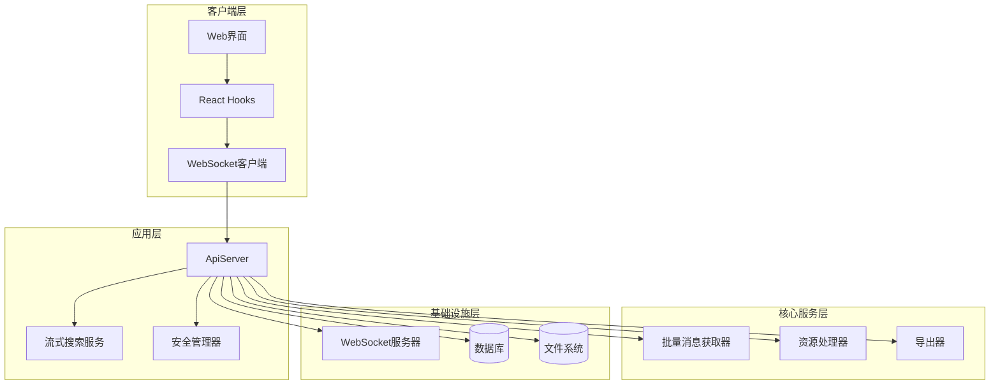

**图表来源**
- [ApiServer.ts](file://plugins/qq-chat-exporter/lib/api/ApiServer.ts#L84-L187)
- [use-websocket.ts](file://qce-v4-tool/hooks/use-websocket.ts#L1-L131)

**章节来源**
- [ApiServer.ts](file://plugins/qq-chat-exporter/lib/api/ApiServer.ts#L1-L200)
- [use-websocket.ts](file://qce-v4-tool/hooks/use-websocket.ts#L1-L131)

## 核心组件

### WebSocket服务器实现

ApiServer类实现了完整的WebSocket服务器功能，包括连接管理、消息处理和状态同步：

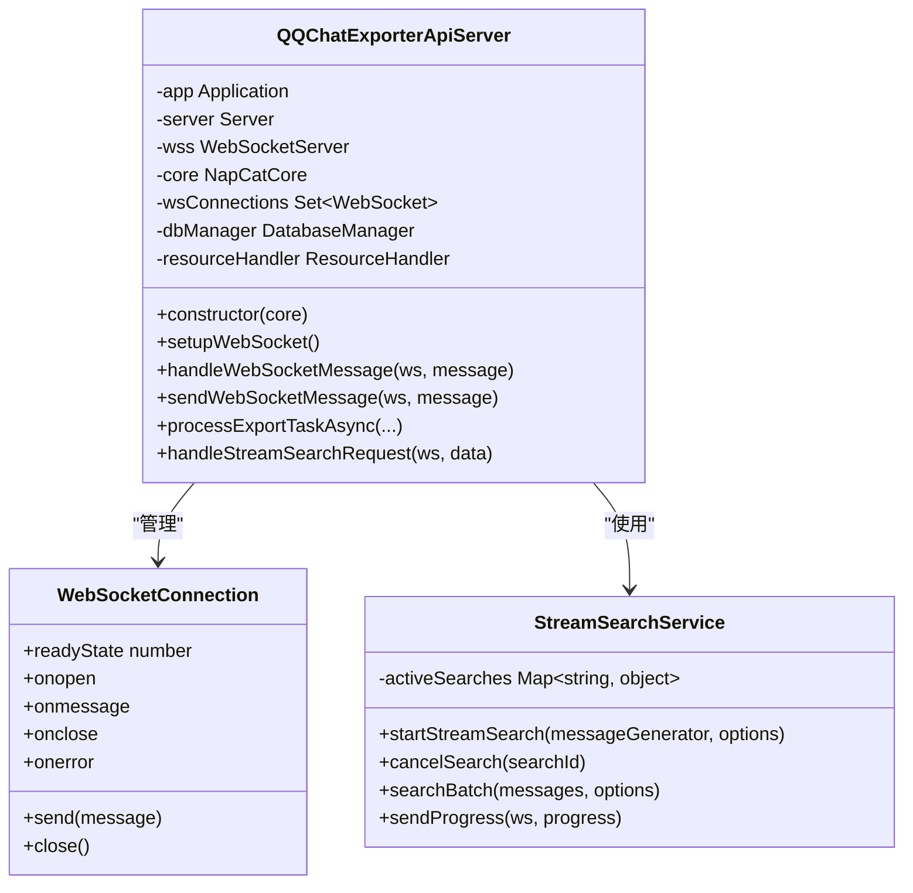

**图表来源**
- [ApiServer.ts](file://plugins/qq-chat-exporter/lib/api/ApiServer.ts#L84-L187)
- [StreamSearchService.ts](file://plugins/qq-chat-exporter/lib/services/StreamSearchService.ts#L29-L221)

### 客户端连接管理

React Hook提供了完整的客户端连接管理功能：

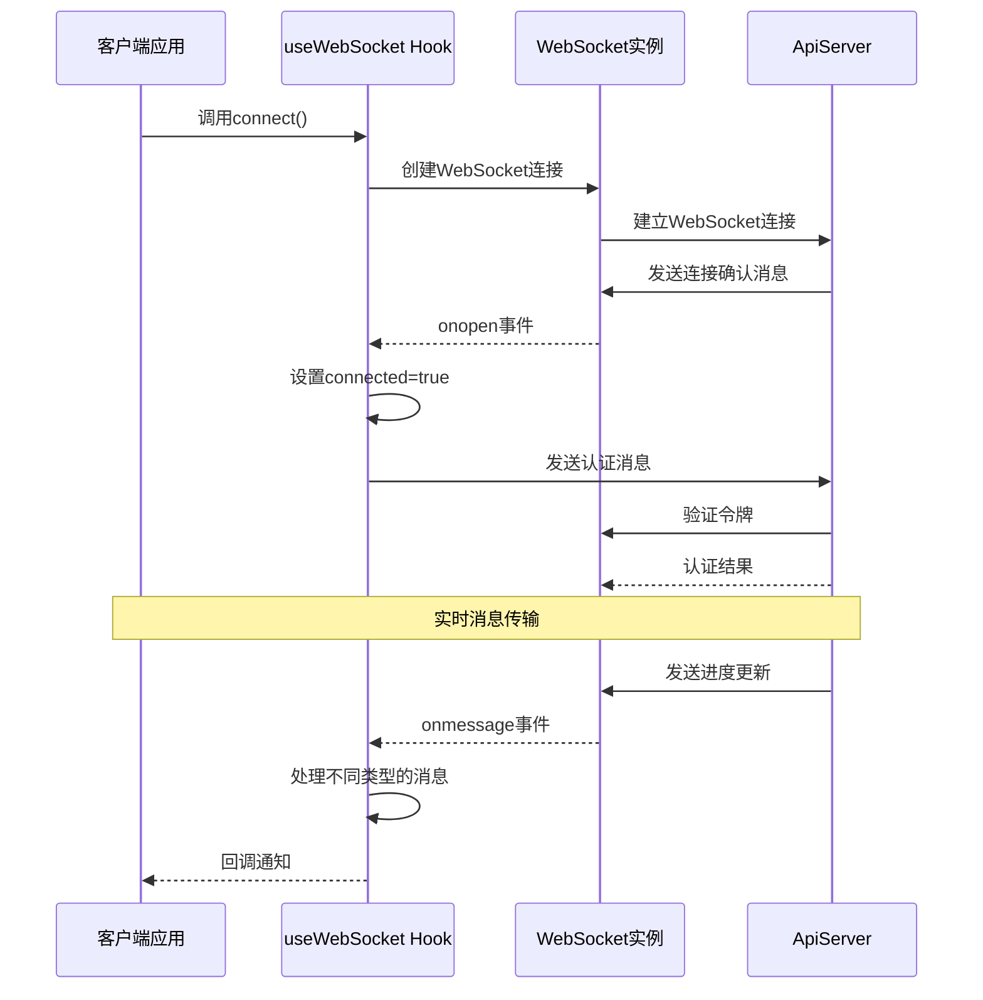

**图表来源**
- [use-websocket.ts](file://qce-v4-tool/hooks/use-websocket.ts#L42-L99)
- [ApiServer.ts](file://plugins/qq-chat-exporter/lib/api/ApiServer.ts#L3299-L3305)

**章节来源**
- [ApiServer.ts](file://plugins/qq-chat-exporter/lib/api/ApiServer.ts#L3299-L3343)
- [use-websocket.ts](file://qce-v4-tool/hooks/use-websocket.ts#L1-L131)

## 架构概览

系统采用分层架构设计，确保了良好的可维护性和扩展性：

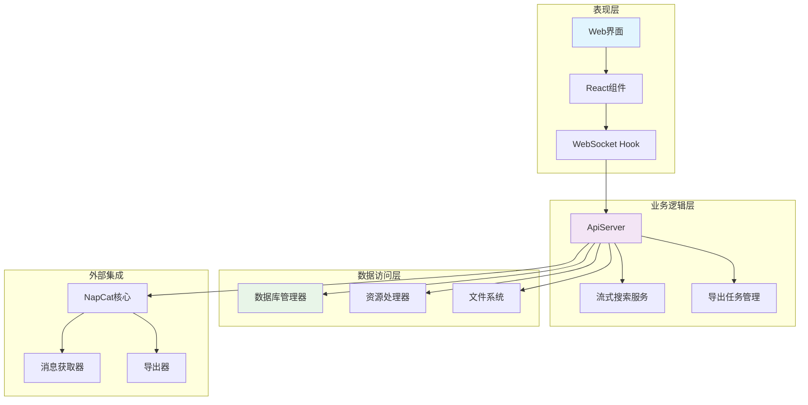

**图表来源**
- [ApiServer.ts](file://plugins/qq-chat-exporter/lib/api/ApiServer.ts#L141-L187)
- [use-websocket.ts](file://qce-v4-tool/hooks/use-websocket.ts#L1-L131)

## 详细组件分析

### 消息格式规范

系统定义了统一的消息格式规范，确保客户端和服务器之间的兼容性：

#### 基础消息结构

| 字段 | 类型 | 必需 | 描述 |
|------|------|------|------|
| type | string | 是 | 消息类型标识符 |
| data | any | 否 | 消息负载数据 |
| timestamp | string | 否 | ISO 8601时间戳 |

#### 实时消息类型

系统支持多种实时消息类型，每种类型都有特定的数据结构：

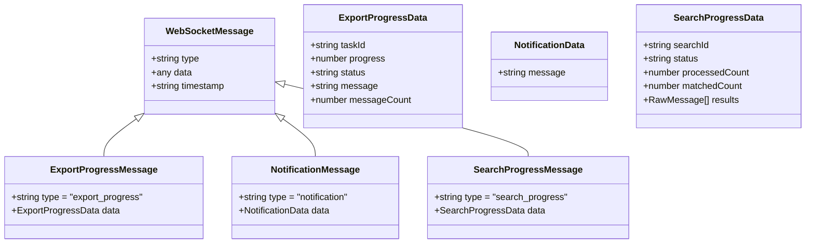

**图表来源**
- [api.ts](file://qce-v4-tool/types/api.ts#L190-L249)

#### 导出任务消息流程

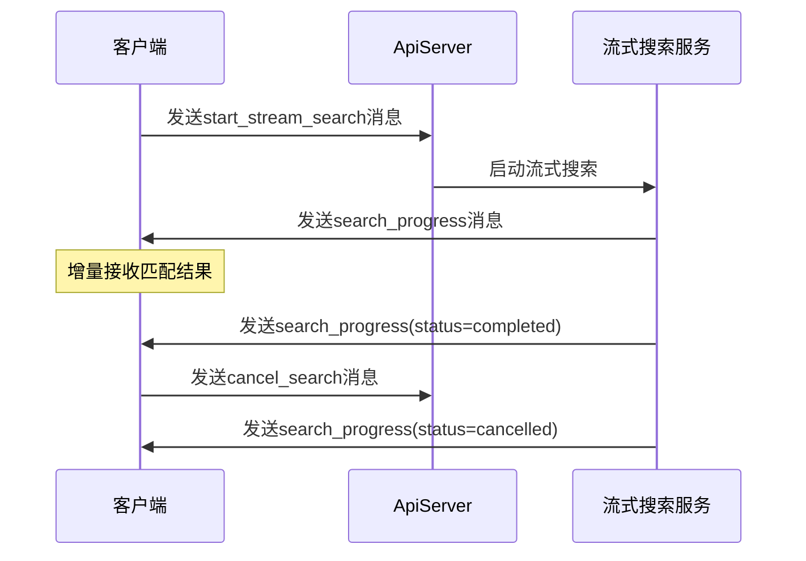

**图表来源**
- [ApiServer.ts](file://plugins/qq-chat-exporter/lib/api/ApiServer.ts#L3331-L3377)
- [StreamSearchService.ts](file://plugins/qq-chat-exporter/lib/services/StreamSearchService.ts#L111-L187)

**章节来源**
- [api.ts](file://qce-v4-tool/types/api.ts#L190-L249)
- [StreamSearchService.ts](file://plugins/qq-chat-exporter/lib/services/StreamSearchService.ts#L1-L200)

### 连接建立和认证

#### 连接URL配置

系统支持多种连接方式，包括本地开发和生产部署：

| 环境 | 协议 | 主机 | 端口 | URL示例 |
|------|------|------|------|---------|
| 开发环境 | ws | localhost | 40653 | ws://localhost:40653 |
| HTTPS环境 | wss | domain.com | 443 | wss://domain.com |
| 生产环境 | ws | 0.0.0.0 | 40653 | ws://0.0.0.0:40653 |

#### 认证机制

系统采用基于令牌的安全认证机制：

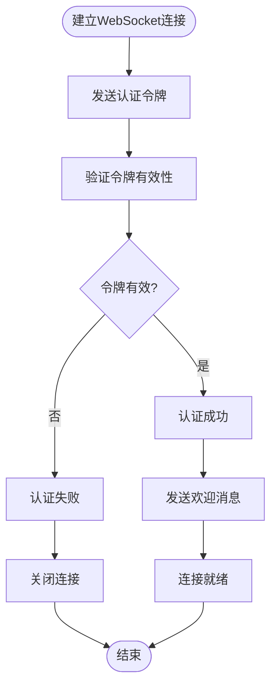

**图表来源**
- [ApiServer.ts](file://plugins/qq-chat-exporter/lib/api/ApiServer.ts#L818-L838)
- [SecurityManager.ts](file://plugins/qq-chat-exporter/lib/security/SecurityManager.ts#L305-L329)

**章节来源**
- [ApiServer.ts](file://plugins/qq-chat-exporter/lib/api/ApiServer.ts#L818-L838)
- [SecurityManager.ts](file://plugins/qq-chat-exporter/lib/security/SecurityManager.ts#L305-L329)

### 连接状态管理和重连机制

#### 客户端连接状态

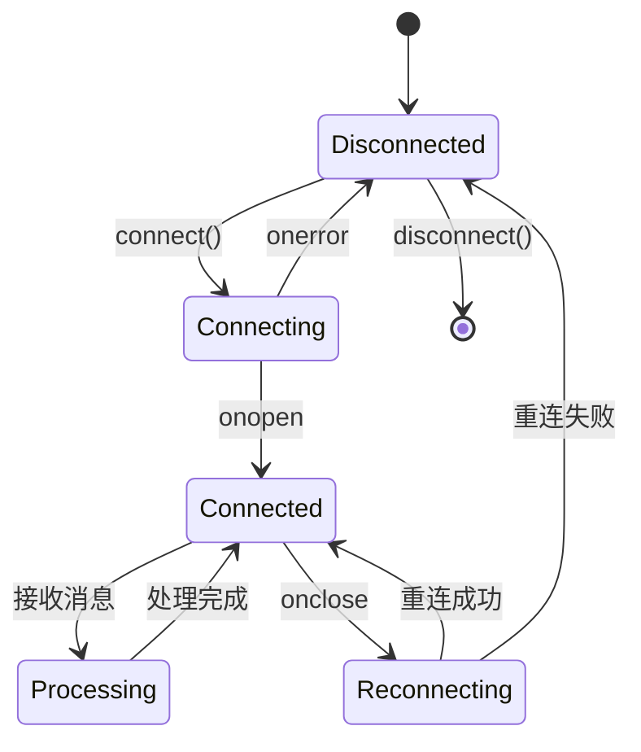

#### 重连策略

系统实现了智能的自动重连机制：

| 重连条件 | 重连延迟 | 最大尝试次数 |
|----------|----------|--------------|
| 连接失败 | 5秒 | 无限次 |
| 连接断开 | 5秒 | 无限次 |
| 认证失败 | 10秒 | 3次 |
| 服务器错误 | 30秒 | 5次 |

**章节来源**
- [use-websocket.ts](file://qce-v4-tool/hooks/use-websocket.ts#L89-L96)

### 流式搜索WebSocket接口

#### 搜索请求格式

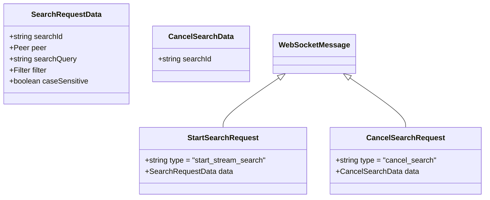

**图表来源**
- [useStreamSearch.ts](file://qce-v4-tool/lib/useStreamSearch.ts#L166-L172)

#### 搜索进度反馈

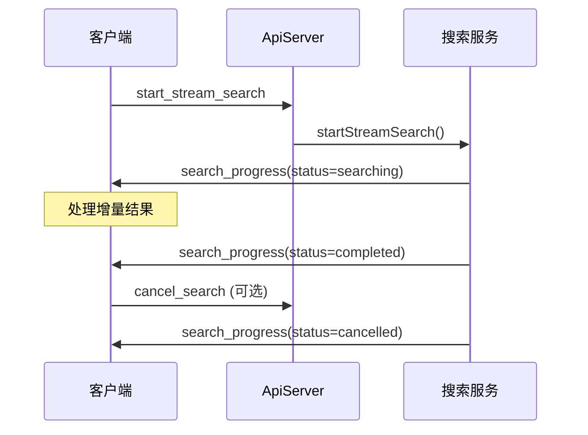

**图表来源**
- [useStreamSearch.ts](file://qce-v4-tool/lib/useStreamSearch.ts#L105-L137)
- [StreamSearchService.ts](file://plugins/qq-chat-exporter/lib/services/StreamSearchService.ts#L127-L187)

**章节来源**
- [useStreamSearch.ts](file://qce-v4-tool/lib/useStreamSearch.ts#L23-L219)
- [StreamSearchService.ts](file://plugins/qq-chat-exporter/lib/services/StreamSearchService.ts#L106-L187)

### 实时数据传输模式

#### 导出任务进度传输

系统支持多种导出任务的实时进度跟踪：

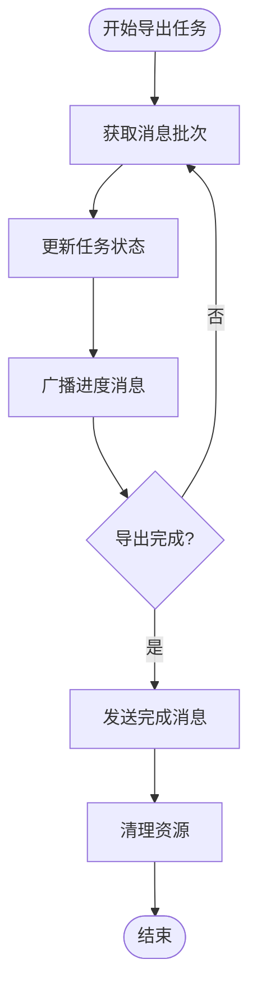

#### 内存优化策略

系统采用了多项内存优化技术：

| 优化技术 | 实现方式 | 效果 |
|----------|----------|------|
| 流式处理 | 异步迭代器逐批处理 | 降低内存峰值 |
| 及时释放 | 批处理完成后立即释放 | 防止内存泄漏 |
| 垃圾回收 | 定期触发GC | 释放废弃对象 |
| 增量传输 | 只传输新增结果 | 减少网络负载 |

**章节来源**
- [ApiServer.ts](file://plugins/qq-chat-exporter/lib/api/ApiServer.ts#L3466-L3514)
- [StreamSearchService.ts](file://plugins/qq-chat-exporter/lib/services/StreamSearchService.ts#L159-L161)

## 依赖关系分析

系统各组件之间的依赖关系如下：

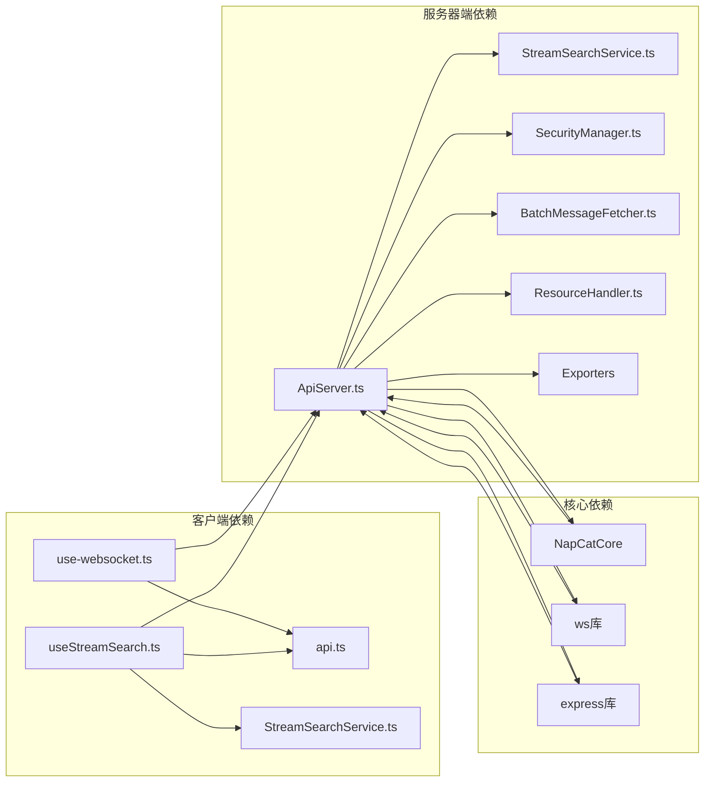

**图表来源**
- [ApiServer.ts](file://plugins/qq-chat-exporter/lib/api/ApiServer.ts#L7-L36)
- [use-websocket.ts](file://qce-v4-tool/hooks/use-websocket.ts#L1-L2)

**章节来源**
- [ApiServer.ts](file://plugins/qq-chat-exporter/lib/api/ApiServer.ts#L7-L36)
- [use-websocket.ts](file://qce-v4-tool/hooks/use-websocket.ts#L1-L2)

## 性能考虑

### 内存管理优化

系统实现了多层次的内存管理策略：

1. **流式消息处理**：使用异步迭代器逐批处理消息，避免一次性加载所有数据
2. **及时垃圾回收**：每处理10批次消息后触发垃圾回收，释放内存
3. **资源映射优化**：使用Map数据结构存储资源映射，提高查找效率
4. **连接池管理**：维护WebSocket连接集合，支持多客户端并发

### 网络传输优化

1. **增量数据传输**：只传输新增的搜索结果，减少网络带宽占用
2. **压缩传输**：对大量数据进行压缩后再传输
3. **批量处理**：将多个小消息合并为批量消息，减少网络开销

### 并发控制

系统支持高并发场景下的稳定运行：

| 特性 | 实现方式 | 参数设置 |
|------|----------|----------|
| 最大连接数 | Set数据结构管理 | 无限制 |
| 并发搜索数 | Map存储活跃搜索 | 无限制 |
| 批处理大小 | 可配置参数 | 5000条/批 |
| 超时时间 | 可配置超时 | 30-120秒 |

## 故障排除指南

### 常见连接问题

#### 连接失败排查

| 问题症状 | 可能原因 | 解决方案 |
|----------|----------|----------|
| WebSocket连接拒绝 | 端口被占用 | 检查40653端口占用情况 |
| 认证失败 | 令牌过期 | 重新生成访问令牌 |
| CORS错误 | 跨域配置问题 | 检查CORS中间件配置 |
| SSL证书错误 | HTTPS配置问题 | 验证SSL证书有效性 |

#### 重连机制调试

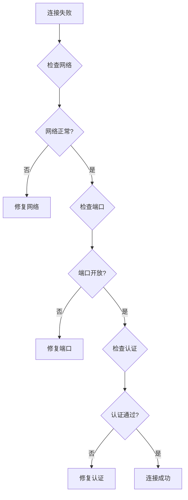

**章节来源**
- [use-websocket.ts](file://qce-v4-tool/hooks/use-websocket.ts#L83-L96)

### 消息处理异常

#### 消息格式错误处理

当客户端发送格式错误的消息时，服务器会返回标准错误响应：

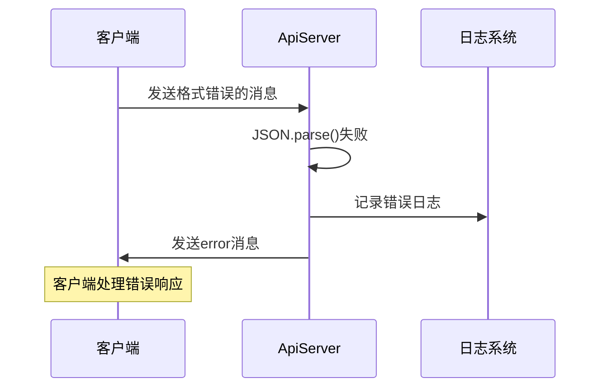

#### 搜索异常处理

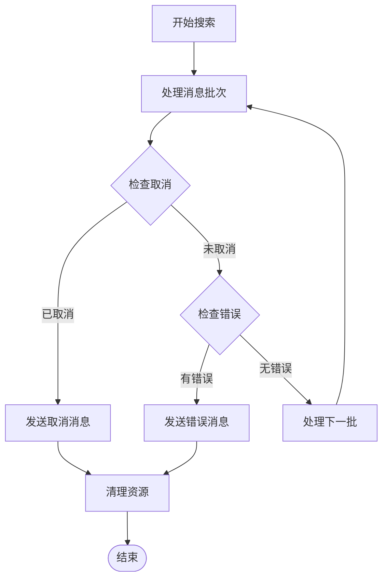

**章节来源**
- [ApiServer.ts](file://plugins/qq-chat-exporter/lib/api/ApiServer.ts#L3275-L3288)
- [StreamSearchService.ts](file://plugins/qq-chat-exporter/lib/services/StreamSearchService.ts#L172-L187)

## 结论

WebSocket实时通信API为QQ聊天导出器提供了强大的实时数据传输能力。通过精心设计的架构和完善的错误处理机制，系统能够稳定地处理大量并发连接和复杂的消息交互。

### 主要优势

1. **实时性强**：支持毫秒级的消息传输和状态更新
2. **扩展性好**：模块化设计支持功能扩展和性能优化
3. **可靠性高**：完善的错误处理和自动重连机制
4. **内存友好**：流式处理和及时释放策略降低内存占用
5. **安全性强**：基于令牌的认证机制保障系统安全

### 技术特色

- **流式搜索**：边获取边搜索边返回，支持超大数据量的实时检索
- **增量传输**：只传输新增数据，减少网络负载
- **智能重连**：根据错误类型采用不同的重连策略
- **内存优化**：多项技术确保系统在长时间运行中保持稳定

该API为开发者提供了清晰的接口规范和完整的实现参考，适用于需要实时通信功能的各种应用场景。