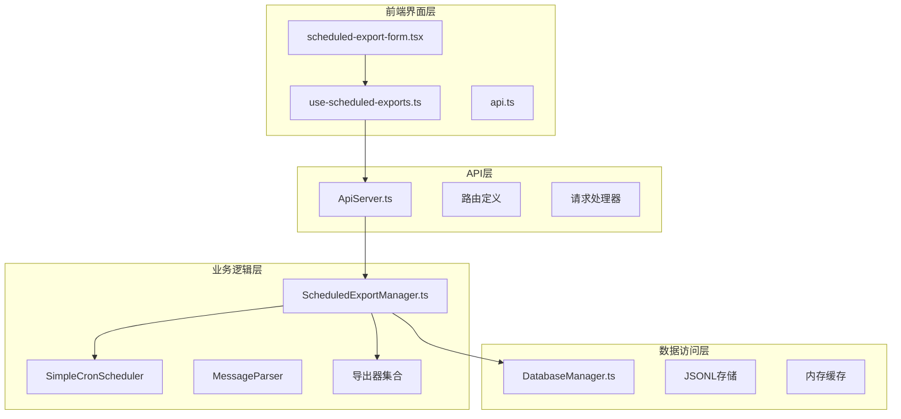
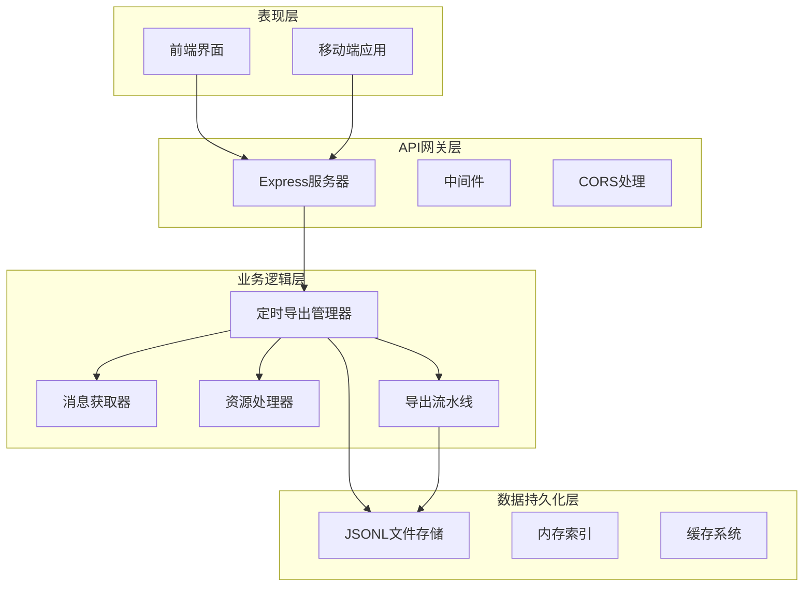
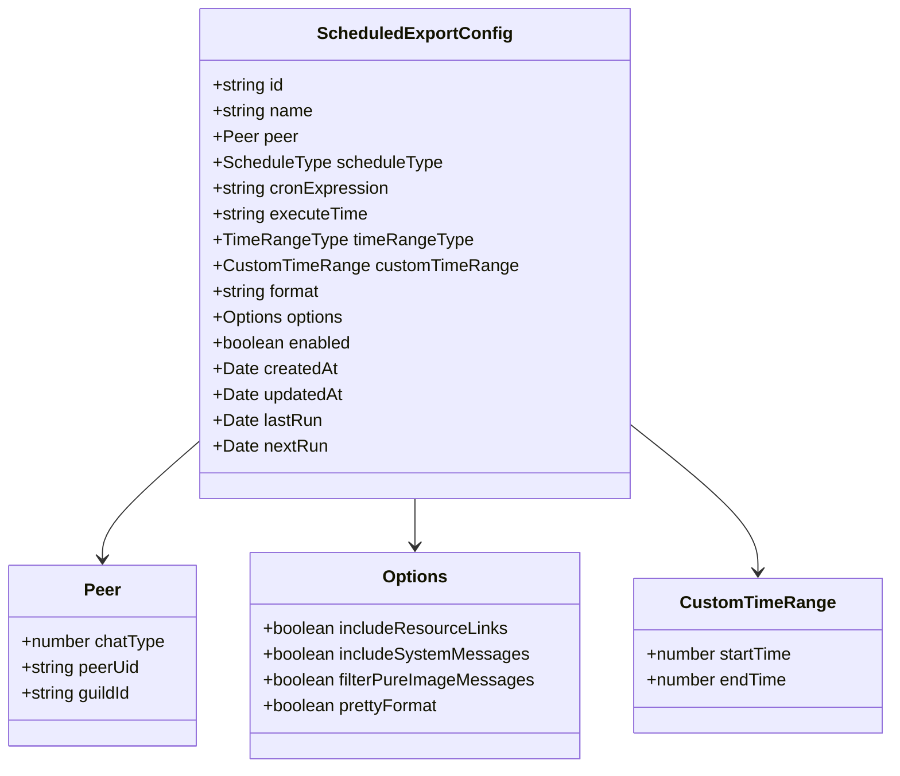
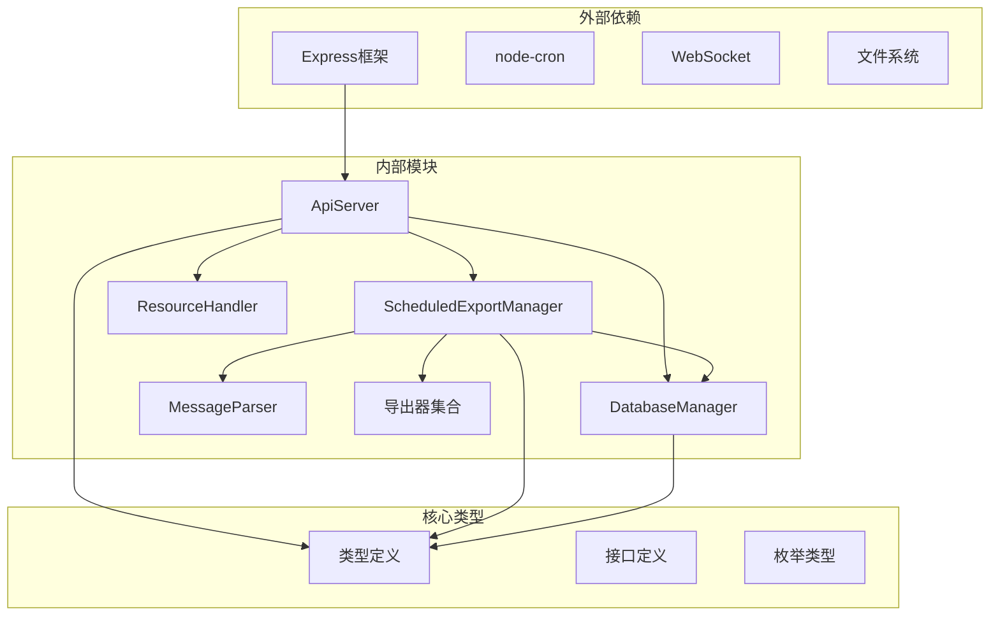

# 定时导出任务API

<cite>
**本文档引用的文件**
- [ApiServer.ts](file://plugins/qq-chat-exporter/lib/api/ApiServer.ts)
- [ScheduledExportManager.ts](file://plugins/qq-chat-exporter/lib/core/scheduler/ScheduledExportManager.ts)
- [DatabaseManager.ts](file://plugins/qq-chat-exporter/lib/core/storage/DatabaseManager.ts)
- [use-scheduled-exports.ts](file://qce-v4-tool/hooks/use-scheduled-exports.ts)
- [api.ts](file://qce-v4-tool/types/api.ts)
- [scheduled-export-form.tsx](file://qce-v4-tool/components/ui/scheduled-export-form.tsx)
- [index.ts](file://plugins/qq-chat-exporter/lib/types/index.ts)
</cite>

## 目录
1. [简介](#简介)
2. [项目结构](#项目结构)
3. [核心组件](#核心组件)
4. [架构概览](#架构概览)
5. [详细组件分析](#详细组件分析)
6. [依赖关系分析](#依赖关系分析)
7. [性能考虑](#性能考虑)
8. [故障排除指南](#故障排除指南)
9. [结论](#结论)

## 简介

定时导出任务API是QQ聊天导出器项目中的核心功能模块，负责管理定时导出任务的生命周期。该API提供了完整的RESTful接口，支持创建、查询、更新、删除定时导出任务，并具备手动触发、历史记录查询等功能。

该项目基于Node.js开发，采用Express框架构建API服务器，结合自定义的调度器实现定时任务管理。系统支持多种导出格式（HTML、JSON、TXT），并提供灵活的时间范围配置和Cron表达式支持。

## 项目结构

定时导出任务API的项目结构遵循模块化设计原则，主要分为以下几个层次：

**图表来源**
- [ApiServer.ts](file://plugins/qq-chat-exporter/lib/api/ApiServer.ts#L84-L187)
- [ScheduledExportManager.ts](file://plugins/qq-chat-exporter/lib/core/scheduler/ScheduledExportManager.ts#L202-L215)
- [DatabaseManager.ts](file://plugins/qq-chat-exporter/lib/core/storage/DatabaseManager.ts#L1278-L1315)

**章节来源**
- [ApiServer.ts](file://plugins/qq-chat-exporter/lib/api/ApiServer.ts#L1-L200)
- [ScheduledExportManager.ts](file://plugins/qq-chat-exporter/lib/core/scheduler/ScheduledExportManager.ts#L1-L100)

## 核心组件

### API服务器组件

API服务器采用Express框架构建，集成了CORS支持、WebSocket通信、安全管理和前端资源服务。服务器初始化时会创建并配置各种管理器实例，包括定时导出管理器、数据库管理器、资源处理器等。

### 定时导出管理器

定时导出管理器是整个系统的核心组件，负责：
- 任务生命周期管理（创建、更新、删除、查询）
- Cron调度器集成
- 执行历史记录管理
- 导出任务的实际执行逻辑

### 数据库管理器

数据库管理器采用JSONL格式存储数据，提供高效的数据持久化能力。支持任务配置、执行历史、系统信息等多种数据类型的存储和查询。

**章节来源**
- [ApiServer.ts](file://plugins/qq-chat-exporter/lib/api/ApiServer.ts#L141-L187)
- [ScheduledExportManager.ts](file://plugins/qq-chat-exporter/lib/core/scheduler/ScheduledExportManager.ts#L202-L215)
- [DatabaseManager.ts](file://plugins/qq-chat-exporter/lib/core/storage/DatabaseManager.ts#L1278-L1315)

## 架构概览

定时导出任务API采用分层架构设计，各层职责明确，耦合度低：

**图表来源**
- [ApiServer.ts](file://plugins/qq-chat-exporter/lib/api/ApiServer.ts#L84-L187)
- [ScheduledExportManager.ts](file://plugins/qq-chat-exporter/lib/core/scheduler/ScheduledExportManager.ts#L489-L632)

## 详细组件分析

### API路由定义

系统提供了完整的RESTful API接口，涵盖定时导出任务的所有操作：

#### 创建定时导出任务
- **HTTP方法**: POST
- **URL**: `/api/scheduled-exports`
- **功能**: 创建新的定时导出任务
- **请求体**: 包含任务配置信息
- **响应**: 返回创建的任务详情

#### 获取任务列表
- **HTTP方法**: GET
- **URL**: `/api/scheduled-exports`
- **功能**: 获取所有定时导出任务
- **响应**: 返回任务数组

#### 查询任务详情
- **HTTP方法**: GET
- **URL**: `/api/scheduled-exports/:id`
- **功能**: 获取指定ID的定时导出任务详情
- **参数**: 任务ID
- **响应**: 返回任务详情

#### 更新定时导出任务
- **HTTP方法**: PUT
- **URL**: `/api/scheduled-exports/:id`
- **功能**: 更新现有定时导出任务
- **参数**: 任务ID
- **请求体**: 更新的任务配置
- **响应**: 返回更新后的任务详情

#### 删除定时导出任务
- **HTTP方法**: DELETE
- **URL**: `/api/scheduled-exports/:id`
- **功能**: 删除指定ID的定时导出任务
- **参数**: 任务ID
- **响应**: 返回删除成功消息

#### 手动触发任务
- **HTTP方法**: POST
- **URL**: `/api/scheduled-exports/:id/trigger`
- **功能**: 手动触发指定任务执行
- **参数**: 任务ID
- **响应**: 返回执行历史记录

#### 获取执行历史
- **HTTP方法**: GET
- **URL**: `/api/scheduled-exports/:id/history`
- **功能**: 获取任务执行历史记录
- **参数**: 任务ID，可选limit参数限制返回数量
- **响应**: 返回历史记录数组

**章节来源**
- [ApiServer.ts](file://plugins/qq-chat-exporter/lib/api/ApiServer.ts#L2612-L2721)

### Cron表达式支持

系统实现了自定义的Cron调度器，支持标准的Cron表达式格式：

| 字段 | 允许值 | 描述 |
|------|--------|------|
| 分钟 | 0-59 | 0表示午夜 |
| 小时 | 0-23 | 24小时制 |
| 日 | 1-31 | 月份中的第几天 |
| 月 | 1-12 | 月份 |
| 周 | 1-7 | 星期几（1=星期日） |

**Cron表达式示例**:
- `0 2 * * *` - 每天凌晨2点执行
- `0 2 * * 1` - 每周一凌晨2点执行
- `0 2 1 * *` - 每月1号凌晨2点执行

### 任务配置模型

定时导出任务采用强类型配置模型，包含以下关键属性：

**图表来源**
- [ScheduledExportManager.ts](file://plugins/qq-chat-exporter/lib/core/scheduler/ScheduledExportManager.ts#L120-L173)

### 执行历史管理

系统提供完整的执行历史记录功能，包括：

- **历史记录结构**: 包含执行时间、状态、消息数量、文件路径等信息
- **存储策略**: 使用内存缓存和数据库双重存储
- **查询接口**: 支持按任务ID查询，可设置返回数量限制
- **清理机制**: 自动清理超过100条的历史记录

**章节来源**
- [ScheduledExportManager.ts](file://plugins/qq-chat-exporter/lib/core/scheduler/ScheduledExportManager.ts#L178-L197)
- [ScheduledExportManager.ts](file://plugins/qq-chat-exporter/lib/core/scheduler/ScheduledExportManager.ts#L330-L333)

### 前端集成

前端提供了完整的定时导出任务管理界面，包括：

- **任务列表展示**: 实时显示所有定时任务的状态
- **任务创建表单**: 支持多种配置选项的可视化配置
- **任务编辑功能**: 允许修改现有任务的配置
- **手动触发**: 支持立即执行某个任务
- **历史记录查看**: 展示任务的执行历史

**章节来源**
- [use-scheduled-exports.ts](file://qce-v4-tool/hooks/use-scheduled-exports.ts#L47-L298)
- [scheduled-export-form.tsx](file://qce-v4-tool/components/ui/scheduled-export-form.tsx#L48-L443)

## 依赖关系分析

定时导出任务API的依赖关系呈现清晰的分层结构：

**图表来源**
- [ApiServer.ts](file://plugins/qq-chat-exporter/lib/api/ApiServer.ts#L7-L51)
- [ScheduledExportManager.ts](file://plugins/qq-chat-exporter/lib/core/scheduler/ScheduledExportManager.ts#L76-L88)

**章节来源**
- [ApiServer.ts](file://plugins/qq-chat-exporter/lib/api/ApiServer.ts#L1-L200)
- [index.ts](file://plugins/qq-chat-exporter/lib/types/index.ts#L428-L453)

## 性能考虑

### 内存管理

系统采用了多项内存优化策略：
- **延迟加载**: 任务配置仅在需要时加载到内存
- **定期清理**: 自动清理过期的执行历史记录
- **流式处理**: 大文件导出采用流式处理减少内存占用

### 并发控制

- **任务隔离**: 每个任务使用独立的资源处理器
- **队列管理**: 数据库写入采用队列机制避免阻塞
- **超时控制**: 导出操作设置合理的超时时间

### 存储优化

- **JSONL格式**: 采用高效的JSONL格式存储数据
- **索引机制**: 内存中维护数据索引提高查询效率
- **批量操作**: 支持批量数据处理减少I/O操作

## 故障排除指南

### 常见错误类型

系统定义了完整的错误类型体系：

| 错误类型 | 描述 | 处理建议 |
|----------|------|----------|
| VALIDATION_ERROR | 参数验证失败 | 检查请求参数格式和必填字段 |
| DATABASE_ERROR | 数据库操作失败 | 检查数据库文件权限和磁盘空间 |
| FILESYSTEM_ERROR | 文件系统操作失败 | 检查目标目录权限和磁盘空间 |
| NETWORK_ERROR | 网络连接问题 | 检查网络连接和防火墙设置 |
| TIMEOUT_ERROR | 操作超时 | 增加超时时间或优化系统性能 |

### 调试技巧

1. **启用详细日志**: 查看系统日志了解错误详情
2. **检查配置文件**: 确认数据库路径和导出目录配置正确
3. **验证Cron表达式**: 使用在线Cron表达式测试工具验证语法
4. **监控系统资源**: 检查CPU、内存和磁盘使用情况

**章节来源**
- [index.ts](file://plugins/qq-chat-exporter/lib/types/index.ts#L428-L453)

## 结论

定时导出任务API是一个功能完整、架构清晰的定时任务管理系统。它提供了丰富的配置选项、灵活的调度机制和完善的错误处理能力。通过模块化的架构设计，系统具有良好的可扩展性和维护性。

该API的主要优势包括：
- **完整的生命周期管理**: 支持任务的创建、查询、更新、删除和执行
- **灵活的调度配置**: 支持标准Cron表达式和预设执行频率
- **多格式导出支持**: 提供HTML、JSON、TXT等多种导出格式
- **完善的监控功能**: 包含执行历史记录和状态监控
- **用户友好的界面**: 提供直观的Web界面进行任务管理

未来可以考虑的功能增强包括：
- 增量备份模式支持
- 任务模板功能
- 批量配置管理
- 更高级的调度规则
- 任务依赖关系管理