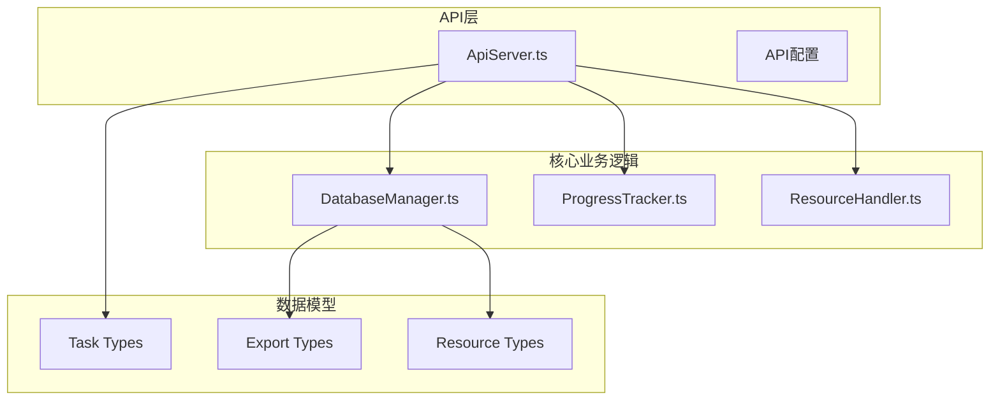
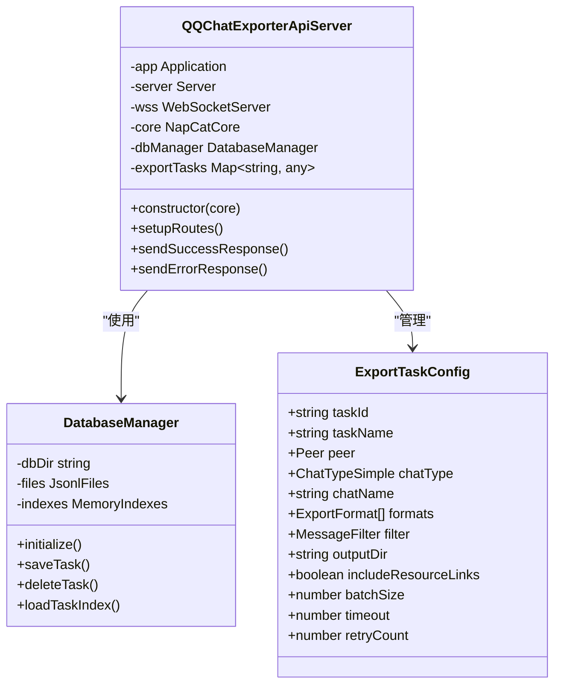
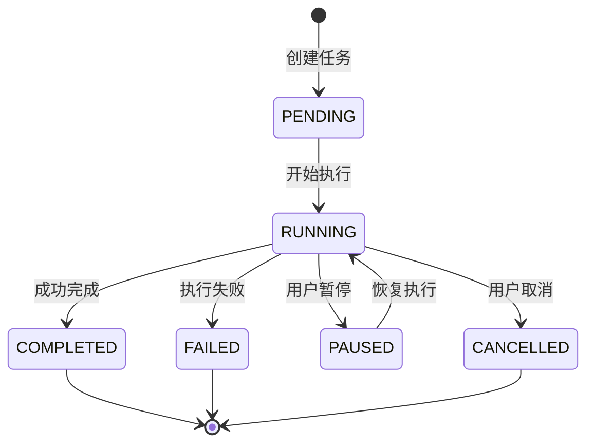
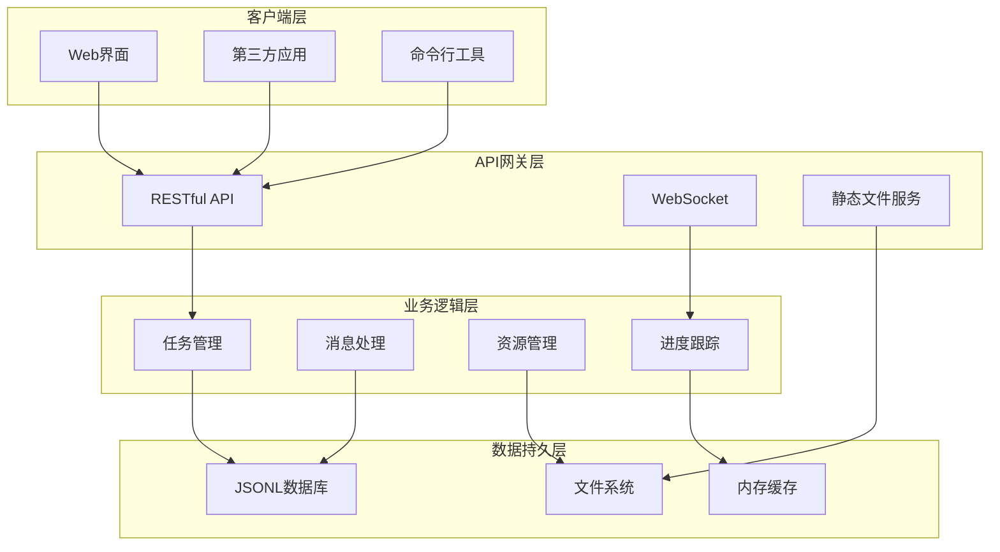
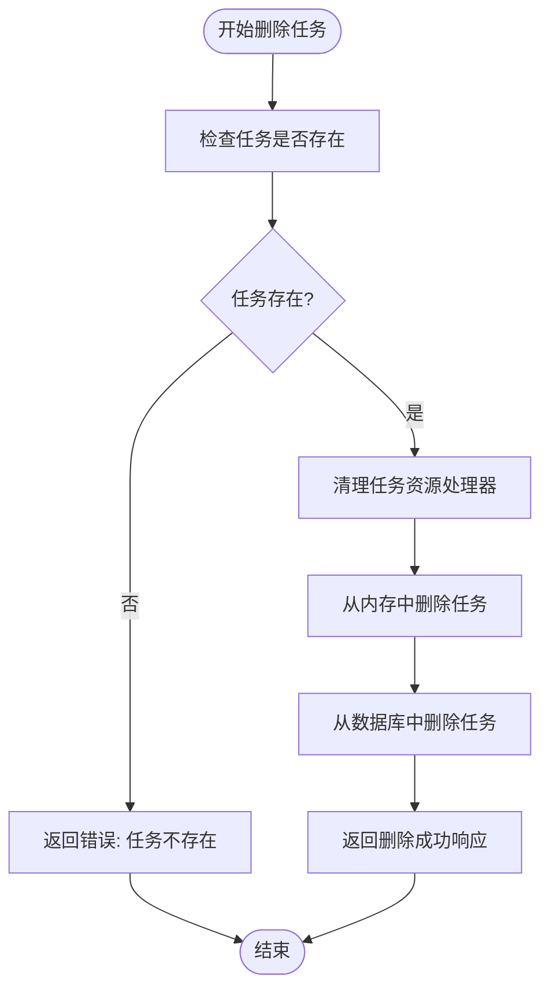
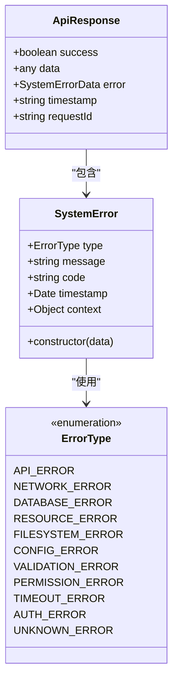
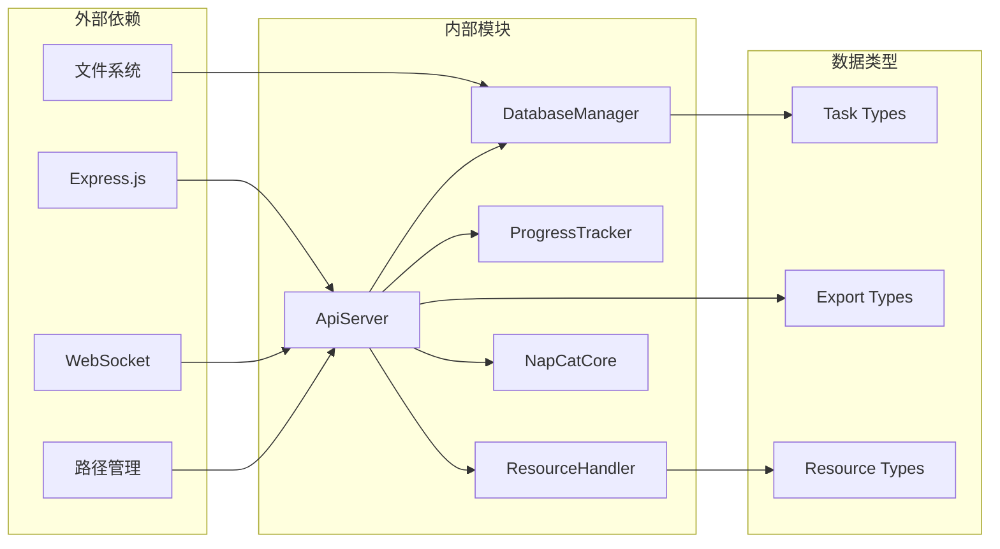
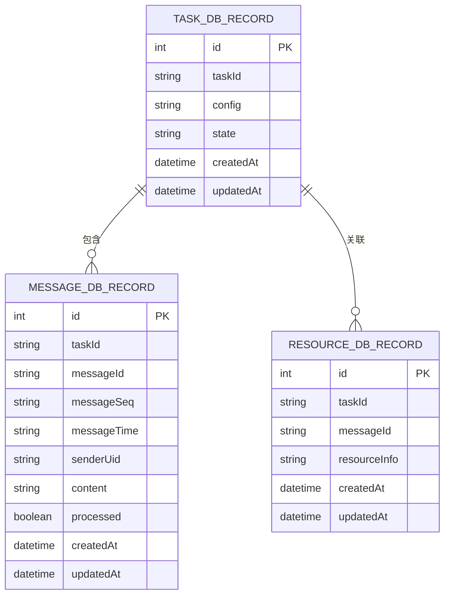

# 导出任务管理API

<cite>
**本文档引用的文件**
- [ApiServer.ts](file://plugins/qq-chat-exporter/lib/api/ApiServer.ts)
- [index.ts](file://plugins/qq-chat-exporter/lib/api/index.ts)
- [index.ts](file://plugins/qq-chat-exporter/lib/types/index.ts)
- [DatabaseManager.ts](file://plugins/qq-chat-exporter/lib/core/storage/DatabaseManager.ts)
</cite>

## 目录
1. [简介](#简介)
2. [项目结构](#项目结构)
3. [核心组件](#核心组件)
4. [架构概览](#架构概览)
5. [详细组件分析](#详细组件分析)
6. [依赖关系分析](#依赖关系分析)
7. [性能考虑](#性能考虑)
8. [故障排除指南](#故障排除指南)
9. [结论](#结论)

## 简介

本文档详细说明了QQ聊天记录导出器的导出任务管理API。该API提供了完整的导出任务生命周期管理，包括任务创建、查询、更新和删除功能。系统支持多种导出格式（TXT、JSON、HTML、Excel），并具备强大的消息筛选和资源管理能力。

## 项目结构

导出任务管理API位于QQ聊天记录导出器插件的核心部分，采用模块化设计：



**图表来源**
- [ApiServer.ts](file://plugins/qq-chat-exporter/lib/api/ApiServer.ts#L1-L200)
- [DatabaseManager.ts](file://plugins/qq-chat-exporter/lib/core/storage/DatabaseManager.ts#L1-L200)

**章节来源**
- [ApiServer.ts](file://plugins/qq-chat-exporter/lib/api/ApiServer.ts#L1-L200)
- [index.ts](file://plugins/qq-chat-exporter/lib/api/index.ts#L1-L35)

## 核心组件

### API服务器架构

API服务器采用Express框架构建，提供RESTful接口和WebSocket实时通信功能：



**图表来源**
- [ApiServer.ts](file://plugins/qq-chat-exporter/lib/api/ApiServer.ts#L84-L187)
- [DatabaseManager.ts](file://plugins/qq-chat-exporter/lib/core/storage/DatabaseManager.ts#L57-L100)
- [index.ts](file://plugins/qq-chat-exporter/lib/types/index.ts#L82-L115)

### 导出任务状态管理

系统支持六种任务状态，实现完整的状态流转：



**图表来源**
- [index.ts](file://plugins/qq-chat-exporter/lib/types/index.ts#L13-L26)

**章节来源**
- [index.ts](file://plugins/qq-chat-exporter/lib/types/index.ts#L10-L26)

## 架构概览

导出任务管理API采用分层架构设计，确保高内聚低耦合：



**图表来源**
- [ApiServer.ts](file://plugins/qq-chat-exporter/lib/api/ApiServer.ts#L141-L187)
- [DatabaseManager.ts](file://plugins/qq-chat-exporter/lib/core/storage/DatabaseManager.ts#L57-L100)

## 详细组件分析

### 任务创建接口

#### POST /api/messages/export

**功能描述**: 创建新的异步导出任务，支持多种导出格式和消息筛选

**请求参数**:
- 路径参数: 无
- 查询参数: 无
- 请求体: JSON格式

**请求体字段**:
| 字段名 | 类型 | 必填 | 描述 |
|--------|------|------|------|
| peer | Object | 是 | 聊天对象信息 |
| format | string | 否 | 导出格式，默认JSON |
| filter | Object | 否 | 消息筛选条件 |
| options | Object | 否 | 导出选项 |
| sessionName | string | 否 | 自定义会话名称 |

**peer对象字段**:
| 字段名 | 类型 | 必填 | 描述 |
|--------|------|------|------|
| chatType | number | 是 | 聊天类型 (1=私聊, 2=群聊) |
| peerUid | string | 是 | 对象唯一标识符 |

**filter对象字段**:
| 字段名 | 类型 | 必填 | 描述 |
|--------|------|------|------|
| startTime | number | 否 | 开始时间戳(秒) |
| endTime | number | 否 | 结束时间戳(秒) |
| senderUids | string[] | 否 | 发送者UID列表 |
| excludeUserUins | string[] | 否 | 排除的用户UIN列表 |
| messageTypes | Array | 否 | 消息类型筛选 |
| keywords | string[] | 否 | 关键词筛选 |
| includeRecalled | boolean | 否 | 包含撤回消息 |
| includeSystem | boolean | 否 | 包含系统消息 |

**options对象字段**:
| 字段名 | 类型 | 必填 | 描述 |
|--------|------|------|------|
| outputDir | string | 否 | 自定义输出目录 |
| useNameInFileName | boolean | 否 | 文件名包含聊天名称 |
| batchSize | number | 否 | 批量获取大小 |
| timeout | number | 否 | 超时时间(毫秒) |
| retryCount | number | 否 | 重试次数 |

**响应数据结构**:
```json
{
  "success": true,
  "data": {
    "taskId": "string",
    "sessionName": "string", 
    "fileName": "string",
    "downloadUrl": "string",
    "filePath": "string",
    "messageCount": 0,
    "status": "running",
    "startTime": "2025-01-01T00:00:00Z",
    "endTime": "2025-01-01T00:00:00Z"
  },
  "timestamp": "2025-01-01T00:00:00Z",
  "requestId": "string"
}
```

**状态码**:
- 200: 任务创建成功
- 400: 参数验证失败
- 500: 服务器内部错误

**章节来源**
- [ApiServer.ts](file://plugins/qq-chat-exporter/lib/api/ApiServer.ts#L1866-L1999)

### 任务查询接口

#### GET /api/tasks

**功能描述**: 获取所有导出任务列表

**请求参数**:
- 路径参数: 无
- 查询参数: 无

**响应数据结构**:
```json
{
  "success": true,
  "data": {
    "tasks": [
      {
        "id": "string",
        "peer": {
          "chatType": 1,
          "peerUid": "string"
        },
        "sessionName": "string",
        "status": "pending",
        "progress": 0,
        "format": "json",
        "messageCount": 0,
        "fileName": "string",
        "filePath": "string",
        "downloadUrl": "string",
        "createdAt": "2025-01-01T00:00:00Z",
        "completedAt": "2025-01-01T00:00:00Z",
        "error": "string",
        "startTime": "2025-01-01T00:00:00Z",
        "endTime": "2025-01-01T00:00:00Z",
        "isZipExport": false,
        "originalFilePath": "string"
      }
    ]
  },
  "timestamp": "2025-01-01T00:00:00Z",
  "requestId": "string"
}
```

**状态码**:
- 200: 查询成功
- 500: 服务器内部错误

**章节来源**
- [ApiServer.ts](file://plugins/qq-chat-exporter/lib/api/ApiServer.ts#L1725-L1758)

#### GET /api/tasks/:taskId

**功能描述**: 获取指定任务的详细状态信息

**请求参数**:
- 路径参数: taskId (任务ID)
- 查询参数: 无

**响应数据结构**:
```json
{
  "success": true,
  "data": {
    "id": "string",
    "peer": {
      "chatType": 1,
      "peerUid": "string"
    },
    "sessionName": "string",
    "status": "running",
    "progress": 0,
    "format": "json",
    "messageCount": 0,
    "fileName": "string",
    "downloadUrl": "string",
    "createdAt": "2025-01-01T00:00:00Z",
    "completedAt": "2025-01-01T00:00:00Z",
    "error": "string",
    "startTime": "2025-01-01T00:00:00Z",
    "endTime": "2025-01-01T00:00:00Z"
  },
  "timestamp": "2025-01-01T00:00:00Z",
  "requestId": "string"
}
```

**状态码**:
- 200: 查询成功
- 404: 任务不存在
- 500: 服务器内部错误

**章节来源**
- [ApiServer.ts](file://plugins/qq-chat-exporter/lib/api/ApiServer.ts#L1760-L1789)

### 任务删除接口

#### DELETE /api/tasks/:taskId

**功能描述**: 删除指定的导出任务及其相关资源

**请求参数**:
- 路径参数: taskId (任务ID)
- 查询参数: 无

**删除流程**:


**图表来源**
- [ApiServer.ts](file://plugins/qq-chat-exporter/lib/api/ApiServer.ts#L1791-L1821)

**响应数据结构**:
```json
{
  "success": true,
  "data": {
    "message": "任务已彻底删除"
  },
  "timestamp": "2025-01-01T00:00:00Z",
  "requestId": "string"
}
```

**状态码**:
- 200: 删除成功
- 404: 任务不存在
- 500: 服务器内部错误

**章节来源**
- [ApiServer.ts](file://plugins/qq-chat-exporter/lib/api/ApiServer.ts#L1791-L1821)

#### DELETE /api/tasks/:taskId/original-files

**功能描述**: 删除ZIP导出任务的原始文件

**请求参数**:
- 路径参数: taskId (任务ID)
- 查询参数: 无

**删除条件**:
- 任务必须存在
- 任务必须为ZIP导出格式
- 必须存在原始文件路径

**响应数据结构**:
```json
{
  "success": true,
  "data": {
    "message": "原始文件已删除",
    "deleted": true
  },
  "timestamp": "2025-01-01T00:00:00Z",
  "requestId": "string"
}
```

**状态码**:
- 200: 删除成功
- 400: 参数验证失败或非ZIP导出
- 404: 任务不存在
- 500: 删除失败

**章节来源**
- [ApiServer.ts](file://plugins/qq-chat-exporter/lib/api/ApiServer.ts#L1823-L1863)

### 错误处理机制

系统采用统一的错误处理机制，提供详细的错误信息：



**图表来源**
- [index.ts](file://plugins/qq-chat-exporter/lib/types/index.ts#L456-L506)
- [index.ts](file://plugins/qq-chat-exporter/lib/types/index.ts#L431-L453)

**章节来源**
- [index.ts](file://plugins/qq-chat-exporter/lib/types/index.ts#L431-L506)

## 依赖关系分析

### 核心依赖关系



**图表来源**
- [ApiServer.ts](file://plugins/qq-chat-exporter/lib/api/ApiServer.ts#L7-L36)
- [DatabaseManager.ts](file://plugins/qq-chat-exporter/lib/core/storage/DatabaseManager.ts#L1-L23)

### 数据持久化架构

系统采用JSONL格式进行数据持久化，提供高性能的数据存储解决方案：



**图表来源**
- [DatabaseManager.ts](file://plugins/qq-chat-exporter/lib/core/storage/DatabaseManager.ts#L297-L348)

**章节来源**
- [DatabaseManager.ts](file://plugins/qq-chat-exporter/lib/core/storage/DatabaseManager.ts#L423-L460)

## 性能考虑

### 内存管理策略

系统采用内存映射和缓存机制优化性能：

1. **任务状态缓存**: 使用Map结构存储任务状态，提供O(1)访问性能
2. **消息缓存**: 预览和搜索功能使用缓存避免重复获取
3. **资源文件名缓存**: 短名称到完整文件名的映射缓存

### 数据库优化

1. **JSONL格式**: 使用JSON Lines格式提供极致性能和完美兼容性
2. **内存索引**: 所有数据加载到内存索引提供O(1)查询性能
3. **批量写入**: 写入队列支持批量操作减少I/O开销

### 并发控制

系统支持多任务并发执行，通过以下机制保证稳定性：

1. **最大并发任务数限制**: 防止系统资源耗尽
2. **超时机制**: 避免长时间阻塞
3. **重试机制**: 提高任务成功率

## 故障排除指南

### 常见错误及解决方案

| 错误类型 | 错误代码 | 描述 | 解决方案 |
|----------|----------|------|----------|
| VALIDATION_ERROR | INVALID_PEER | peer参数不完整 | 检查peer对象的chatType和peerUid字段 |
| VALIDATION_ERROR | TASK_NOT_FOUND | 任务不存在 | 确认任务ID正确性 |
| VALIDATION_ERROR | NOT_ZIP_EXPORT | 非ZIP导出任务 | 仅对ZIP导出任务执行原始文件删除 |
| FILESYSTEM_ERROR | DELETE_FAILED | 删除原始文件失败 | 检查文件权限和磁盘空间 |
| DATABASE_ERROR | UPDATE_FAILED | 数据库更新失败 | 检查数据库连接和权限 |
| NETWORK_ERROR | FETCH_TIMEOUT | 消息获取超时 | 增加超时时间或检查网络连接 |

### 调试建议

1. **启用调试日志**: 设置enableDebugLog为true获取详细日志
2. **监控系统状态**: 使用GET /health端点检查系统健康状况
3. **检查资源使用**: 监控内存和CPU使用情况
4. **验证配置**: 确认输出目录和权限设置正确

**章节来源**
- [index.ts](file://plugins/qq-chat-exporter/lib/types/index.ts#L431-L453)

## 结论

导出任务管理API提供了完整的导出任务生命周期管理功能，具有以下特点：

1. **完整的API覆盖**: 支持任务创建、查询、更新和删除的完整流程
2. **灵活的配置选项**: 支持多种导出格式和丰富的消息筛选条件
3. **强大的错误处理**: 统一的错误处理机制和详细的错误信息
4. **高性能设计**: 采用JSONL数据库和内存缓存优化性能
5. **稳定的架构**: 分层设计确保系统的可维护性和扩展性

该API为QQ聊天记录导出提供了可靠的技术基础，支持从简单的消息导出到复杂的批量处理场景。