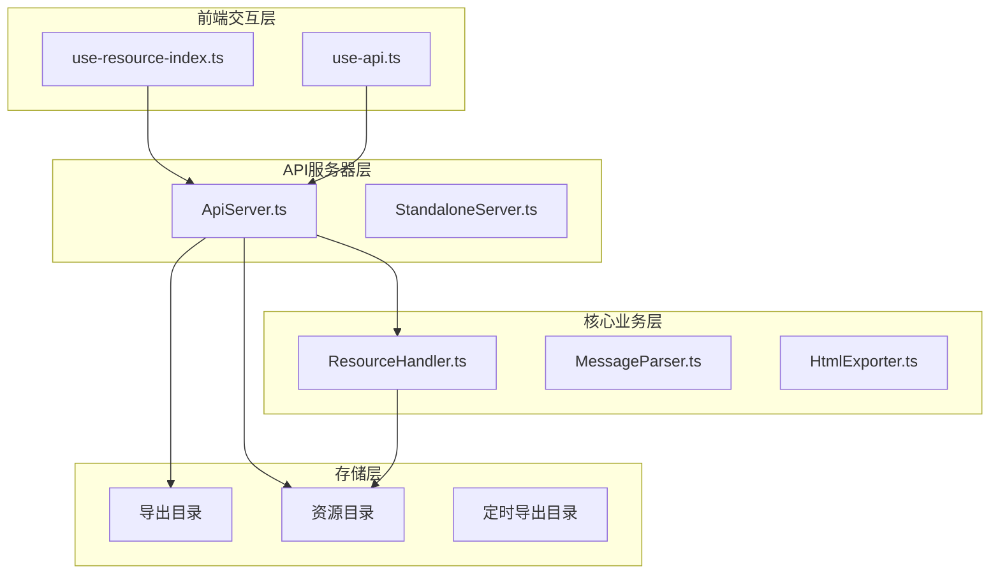
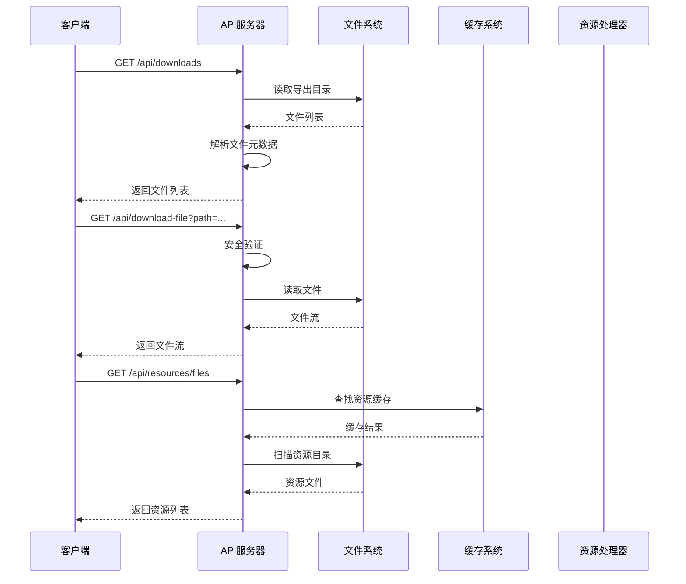
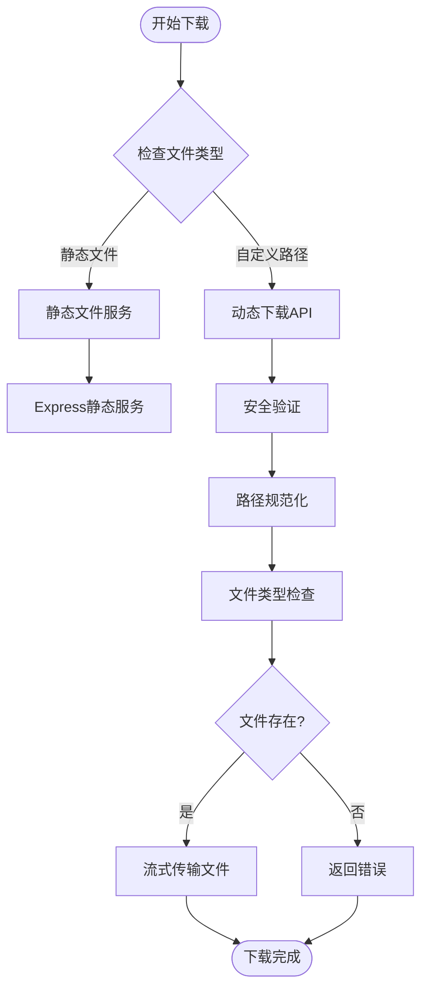
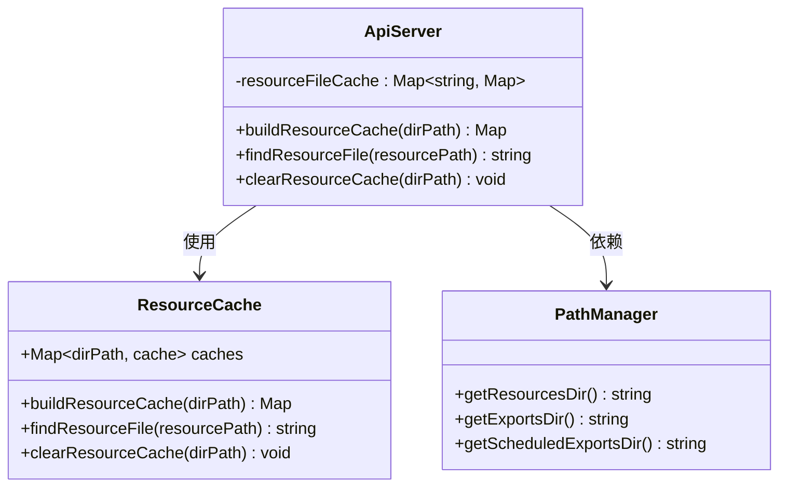
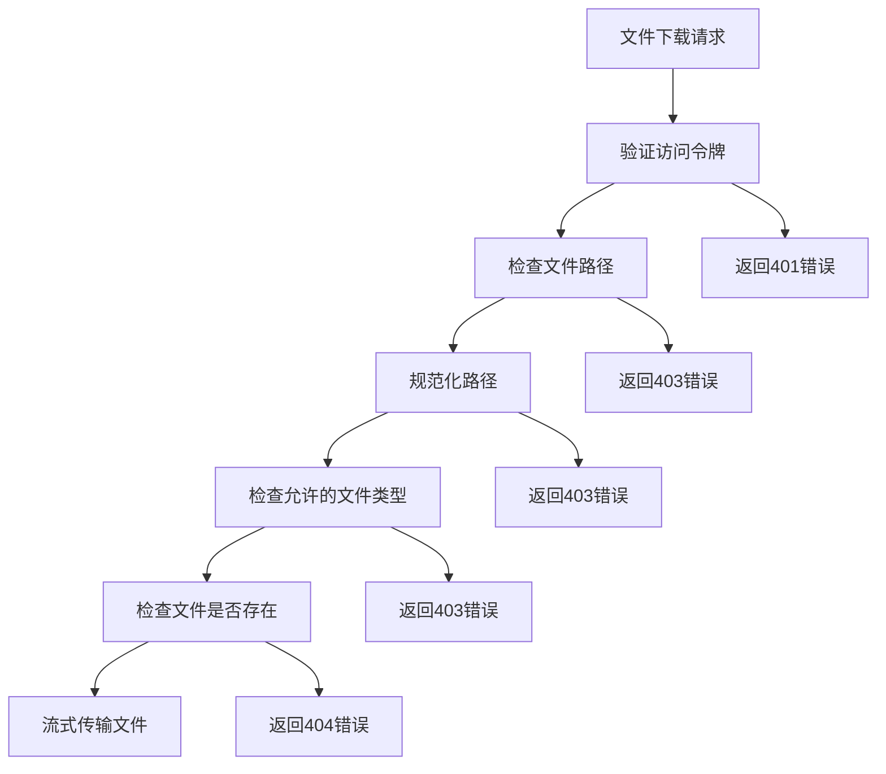
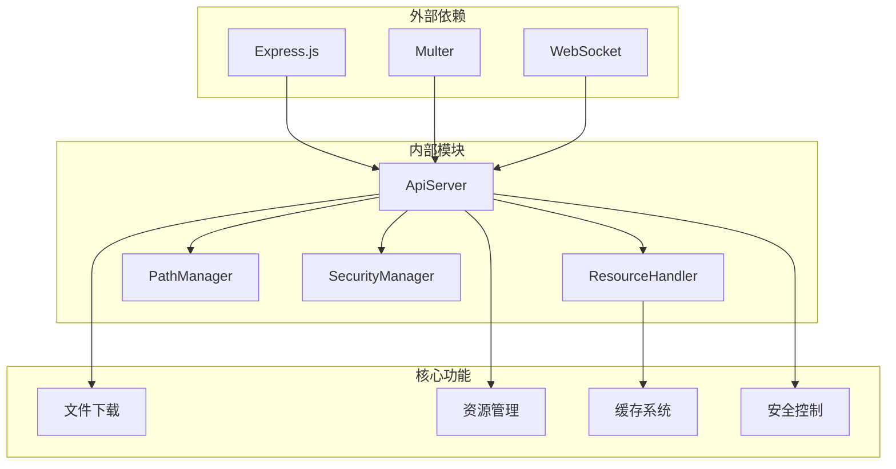

# 文件下载与资源API

<cite>
**本文档引用的文件**
- [ApiServer.ts](file://plugins/qq-chat-exporter/lib/api/ApiServer.ts)
- [StandaloneServer.ts](file://plugins/qq-chat-exporter/lib/api/StandaloneServer.ts)
- [use-resource-index.ts](file://qce-v4-tool/hooks/use-resource-index.ts)
- [use-api.ts](file://qce-v4-tool/hooks/use-api.ts)
- [ResourceHandler.ts](file://plugins/qq-chat-exporter/lib/core/resource/ResourceHandler.ts)
</cite>

## 目录
1. [简介](#简介)
2. [项目结构](#项目结构)
3. [核心组件](#核心组件)
4. [架构概览](#架构概览)
5. [详细组件分析](#详细组件分析)
6. [依赖关系分析](#依赖关系分析)
7. [性能考虑](#性能考虑)
8. [故障排除指南](#故障排除指南)
9. [结论](#结论)

## 简介

本文档详细说明了QQ聊天记录导出工具中的文件下载与资源API系统。该系统提供了完整的导出文件管理和多媒体资源访问功能，包括：

- **导出文件管理**：支持获取导出文件列表、下载特定文件、删除文件
- **多媒体资源访问**：提供表情包、图片、音频、视频等资源的统一访问接口
- **文件命名规范**：标准化的文件命名规则和路径结构
- **缓存机制**：高效的资源文件缓存系统
- **安全机制**：多层安全防护和访问控制

## 项目结构

项目采用模块化架构设计，主要包含以下关键组件：



**图表来源**
- [ApiServer.ts](file://plugins/qq-chat-exporter/lib/api/ApiServer.ts#L84-L187)
- [ResourceHandler.ts](file://plugins/qq-chat-exporter/lib/core/resource/ResourceHandler.ts#L1-L50)

**章节来源**
- [ApiServer.ts](file://plugins/qq-chat-exporter/lib/api/ApiServer.ts#L1-L80)
- [StandaloneServer.ts](file://plugins/qq-chat-exporter/lib/api/StandaloneServer.ts#L1-L50)

## 核心组件

### API服务器核心功能

API服务器实现了完整的文件下载和资源管理功能，主要包括：

#### 文件下载接口
- **GET /api/downloads**：获取导出文件列表
- **GET /api/downloads/{filename}**：下载特定导出文件
- **DELETE /api/downloads/{filename}**：删除导出文件

#### 资源访问接口
- **GET /api/resources**：获取资源文件列表
- **GET /api/resources/files**：获取全局资源文件列表
- **GET /api/resources/index**：获取资源索引信息

#### 安全下载接口
- **GET /api/download-file**：动态下载API，支持自定义路径的文件下载

**章节来源**
- [ApiServer.ts](file://plugins/qq-chat-exporter/lib/api/ApiServer.ts#L3150-L3245)
- [ApiServer.ts](file://plugins/qq-chat-exporter/lib/api/ApiServer.ts#L5155-L5396)

### 资源处理器

资源处理器负责多媒体资源的下载、管理和缓存：

- **并发下载控制**：支持最大并发下载数配置
- **健康检查机制**：定期检查下载状态和资源可用性
- **缓存清理**：自动清理过期的缓存文件
- **进度跟踪**：实时跟踪下载进度和状态

**章节来源**
- [ResourceHandler.ts](file://plugins/qq-chat-exporter/lib/core/resource/ResourceHandler.ts#L596-L688)
- [ResourceHandler.ts](file://plugins/qq-chat-exporter/lib/core/resource/ResourceHandler.ts#L1122-L1149)

## 架构概览

系统采用分层架构设计，确保功能模块的清晰分离和高效协作：



**图表来源**
- [ApiServer.ts](file://plugins/qq-chat-exporter/lib/api/ApiServer.ts#L3165-L3238)
- [ApiServer.ts](file://plugins/qq-chat-exporter/lib/api/ApiServer.ts#L459-L474)

## 详细组件分析

### 文件下载系统

#### 导出文件管理

系统支持两种导出文件的管理方式：

1. **静态文件服务**：通过 `/downloads` 和 `/scheduled-downloads` 路径提供静态文件服务
2. **动态下载API**：通过 `/api/download-file` 提供安全的动态下载功能



**图表来源**
- [ApiServer.ts](file://plugins/qq-chat-exporter/lib/api/ApiServer.ts#L3240-L3245)
- [ApiServer.ts](file://plugins/qq-chat-exporter/lib/api/ApiServer.ts#L3165-L3238)

#### 文件命名规范

系统采用标准化的文件命名规则：

**导出文件命名格式**：
```
{类型}_{聊天名}_{ID}_{日期}_{时间}.{扩展名}
```

**示例**：
- `group_群名_123456789_20250830_142843.html`
- `friend_张三_u_123_20250830_142843.json`

**资源文件命名格式**：
```
md5_原始文件名
```

**章节来源**
- [ApiServer.ts](file://plugins/qq-chat-exporter/lib/api/ApiServer.ts#L4724-L4742)
- [ApiServer.ts](file://plugins/qq-chat-exporter/lib/api/ApiServer.ts#L431-L442)

### 资源管理系统

#### 资源类型分类

系统支持多种资源类型的统一管理：

| 资源类型 | 扩展名 | MIME类型 |
|---------|--------|----------|
| 图片 | .jpg, .png, .gif, .webp, .bmp, .ico, .svg | image/* |
| 视频 | .mp4, .avi, .mov, .mkv, .webm, .flv, .wmv | video/* |
| 音频 | .mp3, .wav, .ogg, .flac, .aac, .m4a, .wma, .amr, .silk | audio/* |
| 文件 | 其他 | application/octet-stream |

#### 资源缓存机制

系统实现了高效的资源文件缓存系统：



**图表来源**
- [ApiServer.ts](file://plugins/qq-chat-exporter/lib/api/ApiServer.ts#L404-L452)
- [ApiServer.ts](file://plugins/qq-chat-exporter/lib/api/ApiServer.ts#L459-L474)

**章节来源**
- [ApiServer.ts](file://plugins/qq-chat-exporter/lib/api/ApiServer.ts#L6223-L6278)
- [ApiServer.ts](file://plugins/qq-chat-exporter/lib/api/ApiServer.ts#L6175-L6218)

### 安全机制

#### 多层安全防护

系统实施了多层安全防护措施：

1. **路径安全检查**：防止路径遍历攻击
2. **文件类型限制**：仅允许特定类型的文件下载
3. **访问令牌验证**：基于JWT的访问控制
4. **IP白名单**：支持基于IP的访问控制



**图表来源**
- [ApiServer.ts](file://plugins/qq-chat-exporter/lib/api/ApiServer.ts#L3165-L3238)

**章节来源**
- [ApiServer.ts](file://plugins/qq-chat-exporter/lib/api/ApiServer.ts#L321-L396)

### 性能优化特性

#### 并发下载控制

系统支持智能的并发下载控制：

- **最大并发数**：可配置的最大并发下载数
- **下载槽位管理**：动态管理下载槽位
- **健康检查**：定期检查下载状态
- **超时处理**：支持下载超时配置

#### 缓存优化

- **延迟加载**：按需构建资源缓存
- **内存缓存**：使用Map数据结构实现快速查找
- **缓存清理**：自动清理过期缓存

**章节来源**
- [ResourceHandler.ts](file://plugins/qq-chat-exporter/lib/core/resource/ResourceHandler.ts#L654-L665)
- [ApiServer.ts](file://plugins/qq-chat-exporter/lib/api/ApiServer.ts#L404-L452)

## 依赖关系分析

### 组件间依赖关系



**图表来源**
- [ApiServer.ts](file://plugins/qq-chat-exporter/lib/api/ApiServer.ts#L7-L36)
- [ResourceHandler.ts](file://plugins/qq-chat-exporter/lib/core/resource/ResourceHandler.ts#L1-L50)

### 第三方库依赖

系统依赖的关键第三方库：

- **Express.js**：Web框架和HTTP服务器
- **Multer**：文件上传处理
- **WebSocket**：实时通信支持
- **CORS**：跨域资源共享支持

**章节来源**
- [ApiServer.ts](file://plugins/qq-chat-exporter/lib/api/ApiServer.ts#L7-L14)

## 性能考虑

### 下载性能优化

1. **流式传输**：使用Node.js流式API进行文件传输
2. **静态文件服务**：对于静态文件使用Express内置的静态文件服务
3. **缓存策略**：实现多层次的缓存机制减少磁盘I/O

### 内存管理

- **资源文件缓存**：使用Map数据结构实现O(1)查找
- **内存限制**：避免加载过大的文件到内存
- **垃圾回收**：及时清理不再使用的缓存数据

### 并发控制

- **下载并发限制**：防止过多并发下载导致系统过载
- **资源竞争避免**：使用锁机制避免资源竞争
- **超时处理**：设置合理的超时时间防止长时间占用

## 故障排除指南

### 常见问题及解决方案

#### 文件下载失败

**问题**：客户端无法下载文件
**可能原因**：
- 文件路径不正确
- 访问权限不足
- 文件已被删除

**解决步骤**：
1. 验证文件路径是否正确
2. 检查文件是否存在
3. 确认访问令牌有效
4. 查看服务器日志

#### 资源文件无法访问

**问题**：资源文件无法在前端显示
**可能原因**：
- 资源缓存未更新
- 文件权限问题
- 路径映射错误

**解决步骤**：
1. 清除资源缓存
2. 检查文件权限
3. 验证路径映射
4. 重新生成资源索引

#### 下载速度慢

**问题**：文件下载速度缓慢
**可能原因**：
- 网络带宽限制
- 服务器负载过高
- 并发下载过多

**优化建议**：
1. 减少同时下载的文件数量
2. 检查网络连接质量
3. 调整服务器配置
4. 使用CDN加速

**章节来源**
- [ApiServer.ts](file://plugins/qq-chat-exporter/lib/api/ApiServer.ts#L3227-L3238)
- [ResourceHandler.ts](file://plugins/qq-chat-exporter/lib/core/resource/ResourceHandler.ts#L1122-L1149)

## 结论

QQ聊天记录导出工具的文件下载与资源API系统提供了完整、安全、高效的文件管理解决方案。系统的主要特点包括：

1. **全面的功能覆盖**：支持导出文件管理和多媒体资源访问
2. **强大的安全机制**：多层安全防护确保系统安全
3. **高性能设计**：优化的缓存和并发控制机制
4. **灵活的配置**：支持自定义输出路径和各种配置选项
5. **良好的扩展性**：模块化设计便于功能扩展

该系统为用户提供了便捷的文件下载和资源访问体验，同时确保了系统的安全性和稳定性。