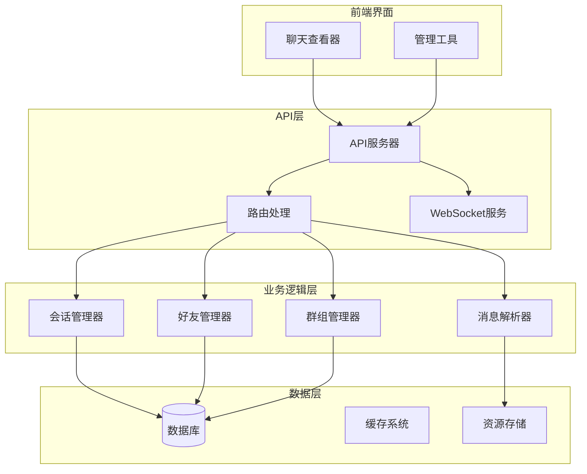
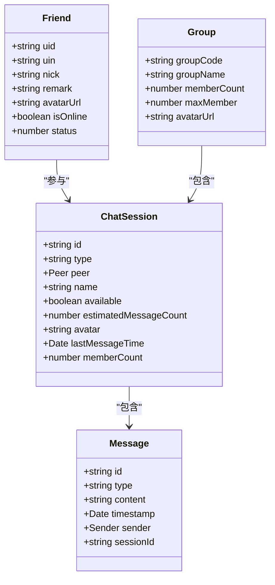
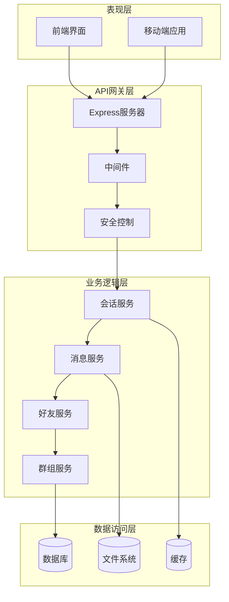
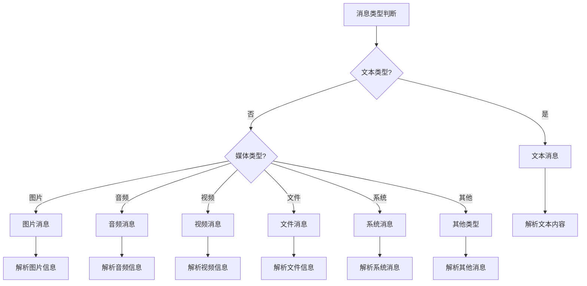
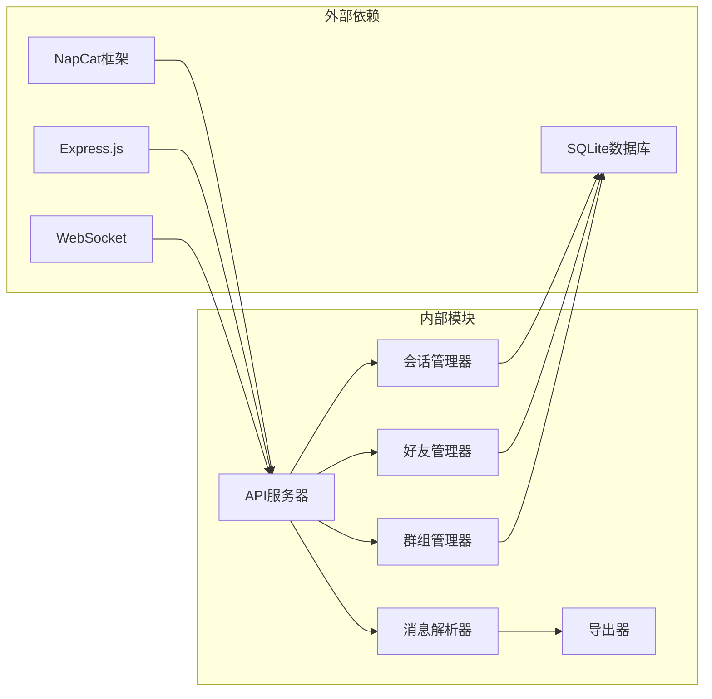

# 聊天数据查询API

<cite>
**本文档引用的文件**
- [package.json](file://plugins/qq-chat-exporter/package.json)
- [ApiServer.d.ts](file://plugins/qq-chat-exporter/dist/api/ApiServer.d.ts)
- [ApiServer.ts](file://plugins/qq-chat-exporter/lib/api/ApiServer.ts)
- [api.ts](file://qce-v4-tool/types/api.ts)
- [server.js](file://qce-viewer/server.js)
- [useStreamSearch.ts](file://qce-v4-tool/lib/useStreamSearch.ts)
- [message-preview-modal.tsx](file://qce-v4-tool/components/ui/message-preview-modal.tsx)
- [ChatSessionManager.ts](file://plugins/qq-chat-exporter/lib/core/chat/ChatSessionManager.ts)
- [FriendInfoManager.ts](file://plugins/qq-chat-exporter/lib/core/chat/FriendInfoManager.ts)
- [GroupInfoManager.ts](file://plugins/qq-chat-exporter/lib/core/chat/GroupInfoManager.ts)
- [SimpleMessageParser.ts](file://plugins/qq-chat-exporter/lib/core/parser/SimpleMessageParser.ts)
</cite>

## 目录
1. [简介](#简介)
2. [项目结构](#项目结构)
3. [核心组件](#核心组件)
4. [架构概览](#架构概览)
5. [详细组件分析](#详细组件分析)
6. [依赖关系分析](#依赖关系分析)
7. [性能考虑](#性能考虑)
8. [故障排除指南](#故障排除指南)
9. [结论](#结论)

## 简介

本项目是一个基于NapCat框架的QQ聊天记录导出工具，提供了完整的聊天数据查询API接口。该系统支持多种消息类型的查询、流式搜索功能、以及好友和群组信息的管理。

主要功能特性包括：
- 会话列表查询和搜索
- 消息记录查询和分页
- 聊天内容搜索
- 流式WebSocket搜索
- 好友信息查询
- 群组信息管理
- 多种消息类型支持（文本、图片、语音、视频、文件等）

## 项目结构

项目采用模块化架构设计，主要分为以下几个核心模块：



**图表来源**
- [ApiServer.d.ts](file://plugins/qq-chat-exporter/dist/api/ApiServer.d.ts#L9-L143)
- [ChatSessionManager.ts](file://plugins/qq-chat-exporter/lib/core/chat/ChatSessionManager.ts#L15-L353)
- [FriendInfoManager.ts](file://plugins/qq-chat-exporter/lib/core/chat/FriendInfoManager.ts#L134-L525)
- [GroupInfoManager.ts](file://plugins/qq-chat-exporter/lib/core/chat/GroupInfoManager.ts#L138-L477)

**章节来源**
- [package.json](file://plugins/qq-chat-exporter/package.json#L1-L42)
- [ApiServer.d.ts](file://plugins/qq-chat-exporter/dist/api/ApiServer.d.ts#L1-L143)

## 核心组件

### API服务器架构

API服务器采用Express框架构建，支持RESTful API和WebSocket双向通信。主要组件包括：

- **路由管理**：负责HTTP请求的路由分发
- **中间件系统**：提供CORS、安全认证、日志记录等功能
- **WebSocket服务**：支持实时流式搜索和进度通知
- **数据库管理**：负责会话、消息、资源数据的持久化
- **资源处理**：管理聊天相关的多媒体资源文件

### 数据模型

系统定义了完整的数据模型来描述聊天相关的各种实体：



**图表来源**
- [api.ts](file://qce-v4-tool/types/api.ts#L58-L104)
- [ChatSessionManager.ts](file://plugins/qq-chat-exporter/lib/core/chat/ChatSessionManager.ts#L257-L273)

**章节来源**
- [api.ts](file://qce-v4-tool/types/api.ts#L1-L509)

## 架构概览

系统采用分层架构设计，确保各层之间的职责分离和松耦合：



**图表来源**
- [ApiServer.d.ts](file://plugins/qq-chat-exporter/dist/api/ApiServer.d.ts#L9-L143)
- [package.json](file://plugins/qq-chat-exporter/package.json#L22-L30)

## 详细组件分析

### 会话查询接口

#### GET /api/chat/sessions

会话查询接口用于获取用户的聊天会话列表，支持多种查询参数：

**请求参数**
- `forceRefresh` (可选): 是否强制刷新缓存，默认false
- `keyword` (可选): 搜索关键词，支持按会话名称、ID、群号模糊匹配
- `page` (可选): 页码，默认1
- `pageSize` (可选): 每页大小，默认50

**响应数据结构**
```typescript
interface SessionsResponse {
  sessions: ChatSession[];
  totalCount: number;
  currentPage: number;
  totalPages: number;
  hasNext: boolean;
  hasPrev: boolean;
}
```

**章节来源**
- [ChatSessionManager.ts](file://plugins/qq-chat-exporter/lib/core/chat/ChatSessionManager.ts#L42-L102)
- [ChatSessionManager.ts](file://plugins/qq-chat-exporter/lib/core/chat/ChatSessionManager.ts#L305-L320)

### 消息查询接口

#### GET /api/chat/messages

消息查询接口用于获取指定会话的消息记录：

**请求参数**
- `peer.chatType`: 聊天类型（1=私聊, 2=群聊）
- `peer.peerUid`: 对方ID或群号
- `peer.guildId`: 服务器ID（可选）
- `page`: 页码，默认1
- `limit`: 每页消息数，默认50
- `filter.startTime`: 开始时间戳
- `filter.endTime`: 结束时间戳
- `filter.keywords`: 关键词数组

**响应数据结构**
```typescript
interface MessagesResponse {
  messages: Message[];
  totalCount: number;
  totalPages: number;
  hasNext: boolean;
  hasPrev: boolean;
}
```

**章节来源**
- [message-preview-modal.tsx](file://qce-v4-tool/components/ui/message-preview-modal.tsx#L108-L146)

### 聊天搜索接口

#### GET /api/chat/search

聊天内容搜索接口支持全文搜索聊天记录：

**请求参数**
- `q`: 搜索关键词
- `peer`: 会话过滤条件（可选）
- `startTime`: 开始时间（可选）
- `endTime`: 结束时间（可选）

**响应数据结构**
```typescript
interface SearchResponse {
  results: SearchResult[];
  totalCount: number;
  matchedCount: number;
}
```

**章节来源**
- [server.js](file://qce-viewer/server.js#L114-L136)

### 流式搜索WebSocket接口

系统提供WebSocket接口支持实时流式搜索：

**WebSocket消息格式**

1. **连接建立**
```json
{
  "type": "start_stream_search",
  "data": {
    "searchId": "string",
    "peer": {
      "chatType": number,
      "peerUid": string,
      "guildId": string
    },
    "filter": {
      "startTime": number,
      "endTime": number
    },
    "searchQuery": string
  }
}
```

2. **搜索进度**
```json
{
  "type": "search_progress",
  "data": {
    "searchId": "string",
    "status": "searching|completed|cancelled|error",
    "processedCount": number,
    "matchedCount": number,
    "results": Message[],
    "error": string
  }
}
```

3. **搜索取消**
```json
{
  "type": "cancel_search",
  "data": {
    "searchId": "string"
  }
}
```

**章节来源**
- [useStreamSearch.ts](file://qce-v4-tool/lib/useStreamSearch.ts#L23-L219)
- [ApiServer.ts](file://plugins/qq-chat-exporter/lib/api/ApiServer.ts#L3331-L3343)

### 好友信息查询接口

#### GET /api/friends

好友信息查询接口支持获取好友列表和详细信息：

**请求参数**
- `keyword` (可选): 搜索关键词
- `page` (可选): 页码
- `pageSize` (可选): 每页大小

**响应数据结构**
```typescript
interface FriendsResponse {
  friends: FriendDetailInfo[];
  totalCount: number;
  currentPage: number;
  totalPages: number;
  hasNext: boolean;
  hasPrev: boolean;
}
```

**章节来源**
- [FriendInfoManager.ts](file://plugins/qq-chat-exporter/lib/core/chat/FriendInfoManager.ts#L259-L286)

### 群组信息查询接口

#### GET /api/groups

群组信息查询接口支持获取群组列表和详细信息：

**请求参数**
- `keyword` (可选): 搜索关键词
- `page` (可选): 页码
- `pageSize` (可选): 每页大小

**响应数据结构**
```typescript
interface GroupsResponse {
  groups: GroupDetailInfo[];
  totalCount: number;
  currentPage: number;
  totalPages: number;
  hasNext: boolean;
  hasPrev: boolean;
}
```

**章节来源**
- [GroupInfoManager.ts](file://plugins/qq-chat-exporter/lib/core/chat/GroupInfoManager.ts#L226-L260)

### 消息类型支持

系统支持多种消息类型的解析和展示：



**图表来源**
- [SimpleMessageParser.ts](file://plugins/qq-chat-exporter/lib/core/parser/SimpleMessageParser.ts#L413-L440)

**章节来源**
- [SimpleMessageParser.ts](file://plugins/qq-chat-exporter/lib/core/parser/SimpleMessageParser.ts#L410-L884)

## 依赖关系分析

系统各组件之间的依赖关系如下：



**图表来源**
- [package.json](file://plugins/qq-chat-exporter/package.json#L22-L30)
- [ApiServer.d.ts](file://plugins/qq-chat-exporter/dist/api/ApiServer.d.ts#L5-L25)

**章节来源**
- [package.json](file://plugins/qq-chat-exporter/package.json#L1-L42)

## 性能考虑

### 缓存策略

系统实现了多层缓存机制来提升性能：

1. **会话缓存**：5分钟有效期，避免频繁调用底层API
2. **好友信息缓存**：10分钟有效期，减少用户信息查询开销
3. **群组信息缓存**：10分钟有效期，优化群组数据访问
4. **资源文件缓存**：延迟加载，快速定位资源文件

### 并发控制

- **批量处理**：好友信息批量获取，限制并发数量避免API限流
- **分页查询**：消息查询支持分页，避免大量数据一次性传输
- **流式处理**：搜索结果流式返回，提升用户体验

### 资源管理

- **内存优化**：及时清理不再使用的缓存数据
- **文件处理**：多媒体资源采用链接而非直接存储，节省磁盘空间
- **连接池**：数据库连接采用连接池管理，提高连接复用率

## 故障排除指南

### 常见问题及解决方案

1. **API连接失败**
   - 检查服务器端口是否正确监听
   - 验证CORS配置是否允许跨域访问
   - 确认防火墙设置是否放行相应端口

2. **搜索结果为空**
   - 确认搜索关键词是否正确
   - 检查时间范围设置是否合理
   - 验证会话ID是否有效

3. **WebSocket连接异常**
   - 检查网络连接稳定性
   - 确认WebSocket协议支持情况
   - 验证服务器SSL证书配置

4. **性能问题**
   - 检查缓存配置是否生效
   - 优化查询参数设置
   - 考虑增加服务器硬件资源

### 日志监控

系统提供完整的日志记录功能：

- **请求日志**：记录所有API请求的详细信息
- **错误日志**：捕获并记录系统异常
- **性能日志**：监控关键操作的执行时间
- **调试日志**：提供详细的调试信息

**章节来源**
- [ApiServer.d.ts](file://plugins/qq-chat-exporter/dist/api/ApiServer.d.ts#L33-L37)

## 结论

本聊天数据查询API系统提供了完整的QQ聊天记录查询功能，具有以下特点：

1. **功能完整**：涵盖会话查询、消息检索、好友管理、群组管理等核心功能
2. **性能优秀**：通过多层缓存和流式处理机制提升系统性能
3. **扩展性强**：模块化设计便于功能扩展和维护
4. **用户体验好**：支持实时搜索和进度反馈，提供良好的交互体验

系统采用现代化的技术栈和架构设计，能够满足大规模聊天数据查询的需求，为用户提供高效、稳定的聊天数据管理解决方案。