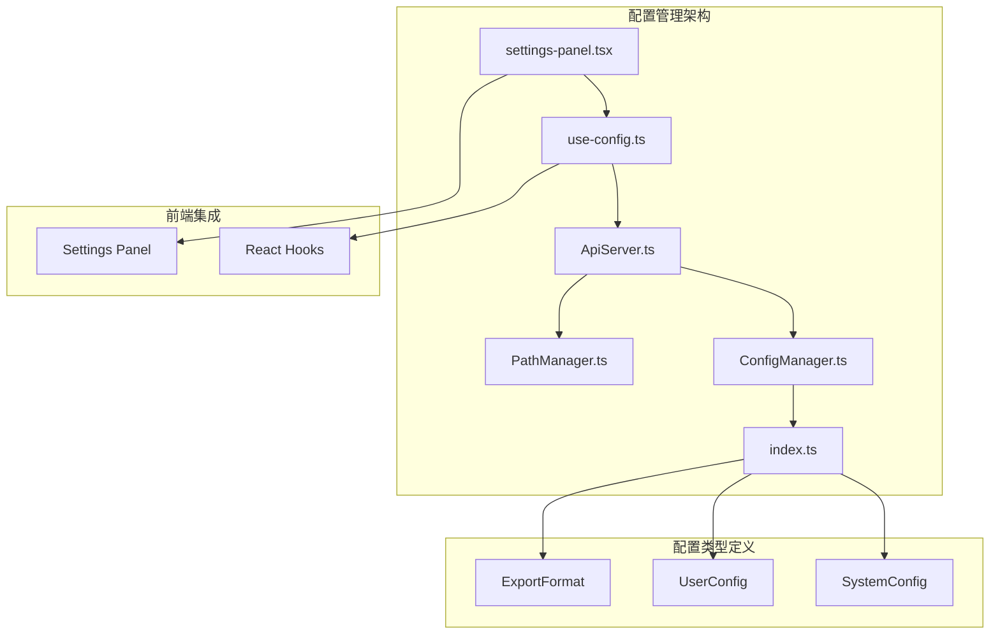
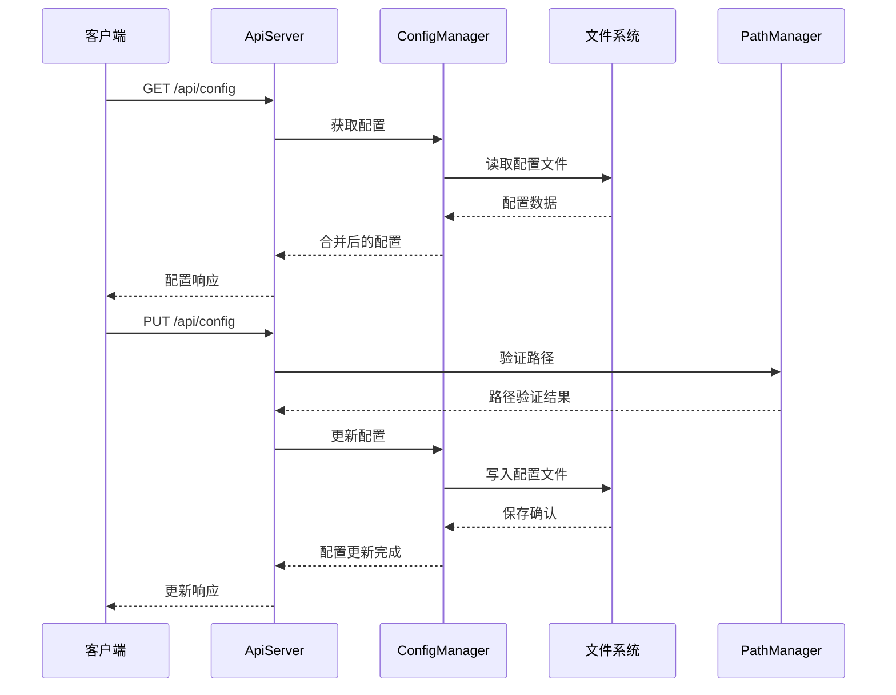
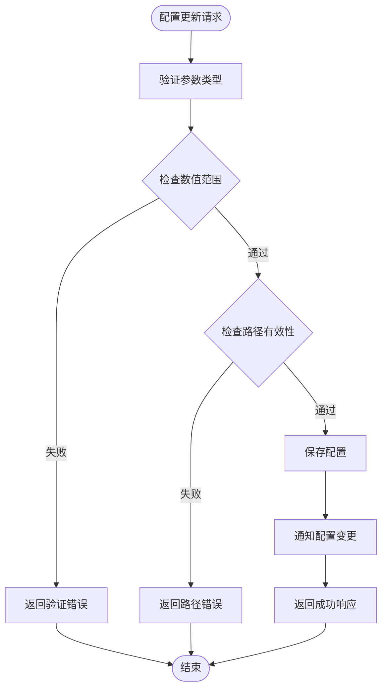
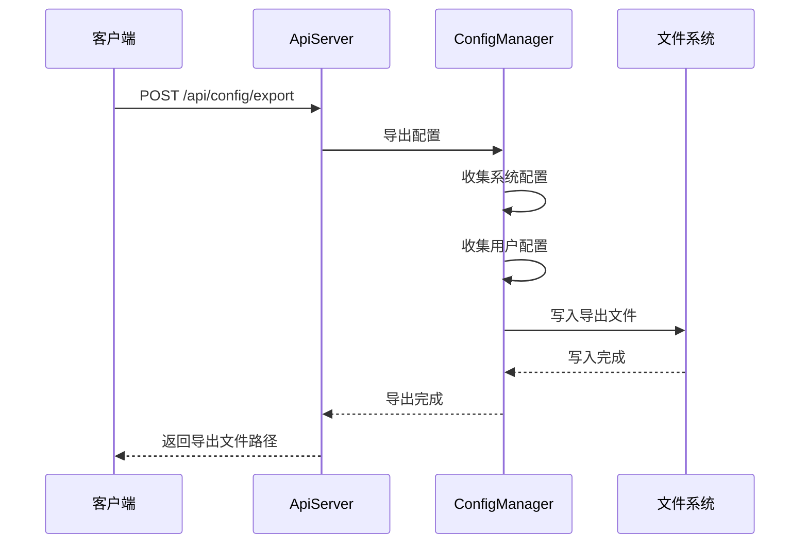
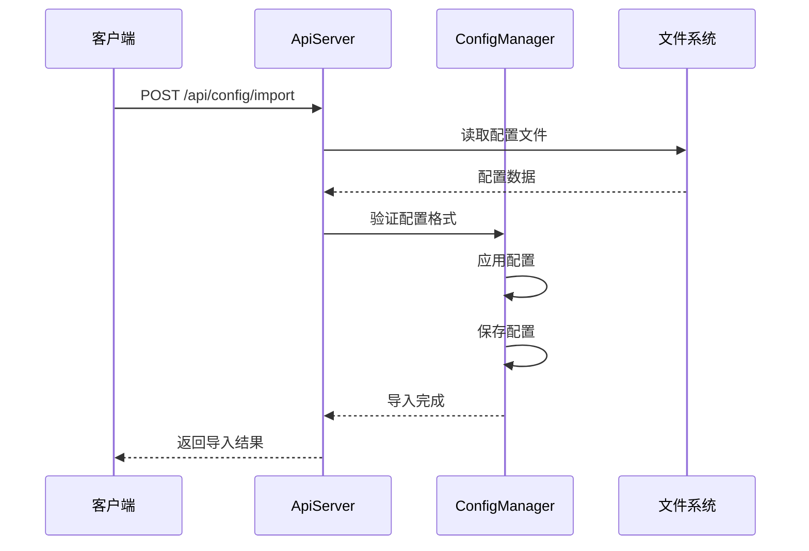
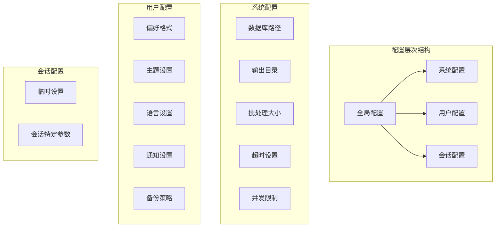
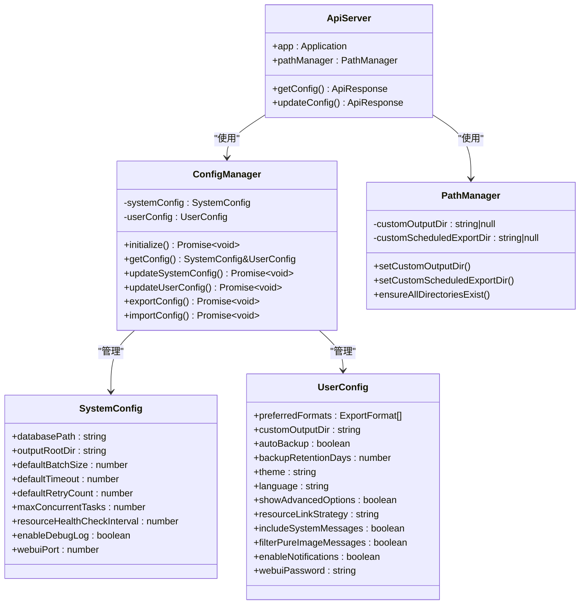
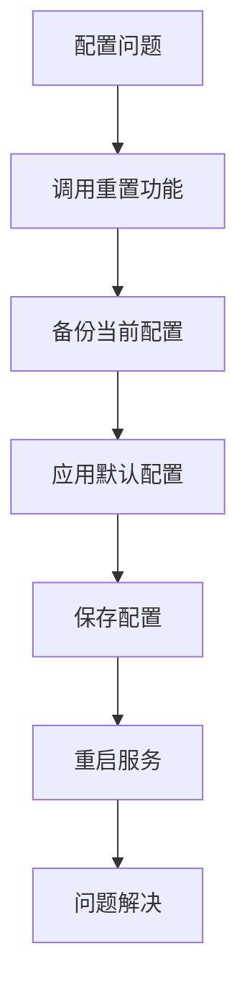

# 配置管理API

<cite>
**本文档引用的文件**
- [ConfigManager.ts](file://plugins/qq-chat-exporter/lib/core/storage/ConfigManager.ts)
- [ApiServer.ts](file://plugins/qq-chat-exporter/lib/api/ApiServer.ts)
- [index.ts](file://plugins/qq-chat-exporter/lib/types/index.ts)
- [PathManager.ts](file://plugins/qq-chat-exporter/lib/utils/PathManager.ts)
- [use-config.ts](file://qce-v4-tool/hooks/use-config.ts)
- [settings-panel.tsx](file://qce-v4-tool/components/ui/settings-panel.tsx)
</cite>

## 目录
1. [简介](#简介)
2. [项目结构](#项目结构)
3. [核心组件](#核心组件)
4. [架构概览](#架构概览)
5. [详细组件分析](#详细组件分析)
6. [依赖关系分析](#依赖关系分析)
7. [性能考虑](#性能考虑)
8. [故障排除指南](#故障排除指南)
9. [结论](#结论)

## 简介

配置管理API是QQ聊天导出器系统中的关键组件，负责管理系统配置的获取、设置、验证和持久化。该API提供了RESTful接口来管理导出器的各种配置参数，包括导出格式设置、文件保存路径、网络代理配置、日志级别等。

系统采用分层架构设计，将配置分为全局配置、用户配置和会话配置三个层次，每种配置都有其特定的作用域和优先级。配置管理支持实时验证、热重载和环境变量覆盖功能，确保系统的稳定性和灵活性。

## 项目结构

配置管理API在项目中的组织结构如下：



**图表来源**
- [ApiServer.ts](file://plugins/qq-chat-exporter/lib/api/ApiServer.ts#L1035-L1117)
- [ConfigManager.ts](file://plugins/qq-chat-exporter/lib/core/storage/ConfigManager.ts#L98-L124)
- [index.ts](file://plugins/qq-chat-exporter/lib/types/index.ts#L272-L292)

**章节来源**
- [ApiServer.ts](file://plugins/qq-chat-exporter/lib/api/ApiServer.ts#L1035-L1117)
- [ConfigManager.ts](file://plugins/qq-chat-exporter/lib/core/storage/ConfigManager.ts#L98-L124)

## 核心组件

### 配置管理器 (ConfigManager)

ConfigManager是配置管理的核心组件，负责配置的加载、验证、保存和监听。它实现了以下关键功能：

- **配置分类管理**：分离系统配置和用户配置
- **配置验证**：内置验证规则确保配置的有效性
- **文件持久化**：自动保存配置到JSON文件
- **热重载支持**：监听文件变化自动重载配置
- **环境变量覆盖**：支持通过环境变量动态调整配置

### API服务器 (ApiServer)

API服务器提供RESTful接口来访问配置管理功能：

- **GET /api/config**：获取当前配置状态
- **PUT /api/config**：更新配置参数
- **错误处理**：统一的错误响应格式
- **安全验证**：路径安全检查和验证

### 路径管理器 (PathManager)

PathManager专门负责文件路径管理和安全验证：

- **路径验证**：防止访问系统关键目录
- **自定义路径支持**：允许用户自定义输出目录
- **目录创建**：自动创建必要的目录结构

**章节来源**
- [ConfigManager.ts](file://plugins/qq-chat-exporter/lib/core/storage/ConfigManager.ts#L98-L124)
- [ApiServer.ts](file://plugins/qq-chat-exporter/lib/api/ApiServer.ts#L1035-L1117)
- [PathManager.ts](file://plugins/qq-chat-exporter/lib/utils/PathManager.ts#L5-L51)

## 架构概览

配置管理API采用分层架构设计，确保各组件职责清晰、耦合度低：



**图表来源**
- [ApiServer.ts](file://plugins/qq-chat-exporter/lib/api/ApiServer.ts#L1035-L1117)
- [ConfigManager.ts](file://plugins/qq-chat-exporter/lib/core/storage/ConfigManager.ts#L437-L482)
- [PathManager.ts](file://plugins/qq-chat-exporter/lib/utils/PathManager.ts#L45-L59)

## 详细组件分析

### 配置类型定义

系统配置分为两个主要类别：

#### 系统配置 (SystemConfig)
系统配置影响整个应用的行为和性能设置：

| 参数名 | 类型 | 默认值 | 有效范围 | 描述 |
|--------|------|--------|----------|------|
| databasePath | string | 用户主目录/.qq-chat-exporter/database.db | 任意有效路径 | SQLite数据库文件路径 |
| outputRootDir | string | 用户主目录/.qq-chat-exporter/exports | 任意有效路径 | 默认导出根目录 |
| defaultBatchSize | number | 5000 | 1-50000 | 默认批量获取大小 |
| defaultTimeout | number | 30000 | 1000-300000 | 默认超时时间(毫秒) |
| defaultRetryCount | number | 3 | 0-10 | 默认重试次数 |
| maxConcurrentTasks | number | 3 | 1-10 | 最大并发任务数 |
| resourceHealthCheckInterval | number | 60000 | 1000-300000 | 资源健康检查间隔 |
| enableDebugLog | boolean | false | true/false | 是否启用调试日志 |
| webuiPort | number | 8080 | 1024-65535 | WebUI服务端口 |

#### 用户配置 (UserConfig)
用户配置影响用户界面和偏好设置：

| 参数名 | 类型 | 默认值 | 有效范围 | 描述 |
|--------|------|--------|----------|------|
| preferredFormats | ExportFormat[] | [HTML, JSON] | 任意组合 | 偏好的导出格式 |
| customOutputDir | string | null | 任意有效路径 | 自定义输出目录 |
| customBatchSize | number | null | 1-50000 | 自定义批量大小 |
| autoBackup | boolean | true | true/false | 是否自动备份 |
| backupRetentionDays | number | 7 | 1-365 | 备份保留天数 |
| theme | 'light'\|'dark'\|'auto' | 'auto' | 'light'/'dark'/'auto' | 主题设置 |
| language | 'zh-CN'\|'en-US' | 'zh-CN' | 'zh-CN'/'en-US' | 语言设置 |
| showAdvancedOptions | boolean | false | true/false | 是否显示高级选项 |
| resourceLinkStrategy | 'keep'\|'download'\|'placeholder' | 'keep' | 'keep'/'download'/'placeholder' | 资源链接处理策略 |
| includeSystemMessages | boolean | true | true/false | 导出时是否包含系统消息 |
| filterPureImageMessages | boolean | false | true/false | 是否过滤纯多媒体消息 |
| enableNotifications | boolean | true | true/false | 是否启用通知 |
| webuiPassword | string | null | 任意字符串 | WebUI访问密码 |

**章节来源**
- [index.ts](file://plugins/qq-chat-exporter/lib/types/index.ts#L272-L292)
- [index.ts](file://plugins/qq-chat-exporter/lib/types/index.ts#L41-L84)

### 配置验证规则

系统实现了严格的配置验证机制：



**图表来源**
- [ConfigManager.ts](file://plugins/qq-chat-exporter/lib/core/storage/ConfigManager.ts#L282-L327)
- [PathManager.ts](file://plugins/qq-chat-exporter/lib/utils/PathManager.ts#L23-L43)

### 配置获取接口 (GET /api/config)

GET /api/config接口提供当前配置状态的查询功能：

**请求示例**
```
GET /api/config
Authorization: Bearer <token>
```

**响应结构**
```json
{
  "success": true,
  "data": {
    "customOutputDir": "C:/exports",
    "customScheduledExportDir": "C:/scheduled-exports",
    "currentExportsDir": "C:/exports",
    "currentScheduledExportsDir": "C:/scheduled-exports"
  },
  "timestamp": "2024-01-01T00:00:00Z",
  "requestId": "req-123"
}
```

**错误处理**
- 配置文件损坏：返回CONFIG_ERROR
- 文件权限问题：返回FILESYSTEM_ERROR
- 系统异常：返回SYSTEM_ERROR

### 配置更新接口 (PUT /api/config)

PUT /api/config接口支持动态更新配置参数：

**请求示例**
```json
{
  "customOutputDir": "C:/my-exports",
  "customScheduledExportDir": null
}
```

**响应结构**
```json
{
  "success": true,
  "data": {
    "message": "配置更新成功",
    "customOutputDir": "C:/my-exports",
    "customScheduledExportDir": null,
    "currentExportsDir": "C:/my-exports",
    "currentScheduledExportsDir": "C:/Users/.qq-chat-exporter/scheduled-exports"
  },
  "timestamp": "2024-01-01T00:00:00Z",
  "requestId": "req-123"
}
```

**更新流程**
1. 解析请求体中的配置参数
2. 验证路径参数的安全性
3. 更新内存中的配置状态
4. 保存到用户配置文件
5. 确保必要目录存在
6. 返回更新后的配置状态

**章节来源**
- [ApiServer.ts](file://plugins/qq-chat-exporter/lib/api/ApiServer.ts#L1046-L1117)
- [PathManager.ts](file://plugins/qq-chat-exporter/lib/utils/PathManager.ts#L45-L106)

### 配置导入导出功能

系统支持配置的导入导出功能，便于批量管理和迁移：

#### 导出配置


#### 导入配置


**章节来源**
- [ConfigManager.ts](file://plugins/qq-chat-exporter/lib/core/storage/ConfigManager.ts#L502-L573)

### 配置分类与作用域

系统配置采用分层管理模式：



**配置优先级**
1. **环境变量**：最高优先级，用于生产环境覆盖
2. **用户配置**：用户特定设置
3. **系统配置**：应用默认行为
4. **会话配置**：临时会话设置

**章节来源**
- [ConfigManager.ts](file://plugins/qq-chat-exporter/lib/core/storage/ConfigManager.ts#L255-L277)
- [ConfigManager.ts](file://plugins/qq-chat-exporter/lib/core/storage/ConfigManager.ts#L413-L432)

## 依赖关系分析

配置管理API的依赖关系图：



**图表来源**
- [ApiServer.ts](file://plugins/qq-chat-exporter/lib/api/ApiServer.ts#L84-L187)
- [ConfigManager.ts](file://plugins/qq-chat-exporter/lib/core/storage/ConfigManager.ts#L98-L124)
- [index.ts](file://plugins/qq-chat-exporter/lib/types/index.ts#L272-L84)

**章节来源**
- [ApiServer.ts](file://plugins/qq-chat-exporter/lib/api/ApiServer.ts#L84-L187)
- [ConfigManager.ts](file://plugins/qq-chat-exporter/lib/core/storage/ConfigManager.ts#L98-L124)

## 性能考虑

配置管理API在设计时充分考虑了性能优化：

### 缓存策略
- **内存缓存**：配置数据存储在内存中，避免频繁磁盘I/O
- **文件监听**：使用文件系统监听器实现配置热重载
- **防抖处理**：配置文件变更时进行防抖处理，避免频繁重载

### 异步操作
- **非阻塞I/O**：使用Promise和async/await确保异步操作
- **并发控制**：限制同时进行的配置操作数量
- **超时机制**：为长时间操作设置合理的超时时间

### 内存管理
- **垃圾回收**：及时清理不再使用的配置监听器
- **资源释放**：正确关闭文件句柄和网络连接
- **内存泄漏防护**：使用弱引用和适当的生命周期管理

## 故障排除指南

### 常见配置错误

| 错误类型 | 错误代码 | 描述 | 解决方案 |
|----------|----------|------|----------|
| 配置验证失败 | VALIDATION_ERROR | 配置值超出有效范围 | 检查配置参数的有效性 |
| 文件系统错误 | FILESYSTEM_ERROR | 配置文件读写失败 | 检查文件权限和磁盘空间 |
| 路径验证失败 | INVALID_PATH | 路径包含危险字符 | 使用合法的文件路径 |
| 配置加载失败 | CONFIG_ERROR | 配置文件格式错误 | 检查JSON格式的正确性 |

### 调试方法

1. **启用调试日志**：设置`enableDebugLog`为true获取详细日志
2. **检查配置文件**：验证配置文件的JSON格式
3. **验证权限**：确保应用程序有文件读写权限
4. **监控系统资源**：检查磁盘空间和内存使用情况

### 配置重置

如果配置出现问题，可以使用重置功能恢复到默认状态：



**章节来源**
- [ConfigManager.ts](file://plugins/qq-chat-exporter/lib/core/storage/ConfigManager.ts#L487-L497)
- [ApiServer.ts](file://plugins/qq-chat-exporter/lib/api/ApiServer.ts#L1042-L1043)

## 结论

配置管理API为QQ聊天导出器提供了强大而灵活的配置管理能力。通过分层架构设计、严格的验证机制和完善的错误处理，系统确保了配置的安全性和可靠性。

主要特点包括：
- **多层配置管理**：支持系统、用户和会话级别的配置
- **实时验证**：在配置更新时立即进行有效性检查
- **热重载支持**：配置变更后自动生效，无需重启
- **安全保护**：防止访问系统关键目录和恶意路径
- **完整备份**：支持配置的导入导出功能

该API的设计充分考虑了易用性和安全性，在保证功能完整性的同时，为用户提供了直观的配置管理体验。