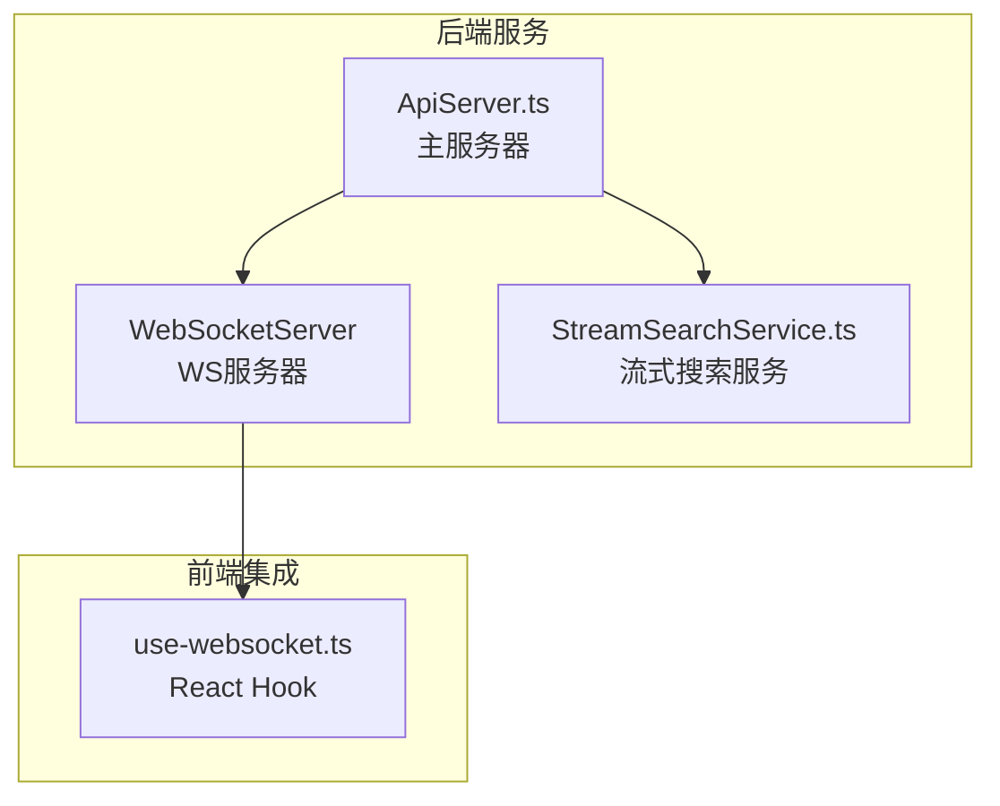
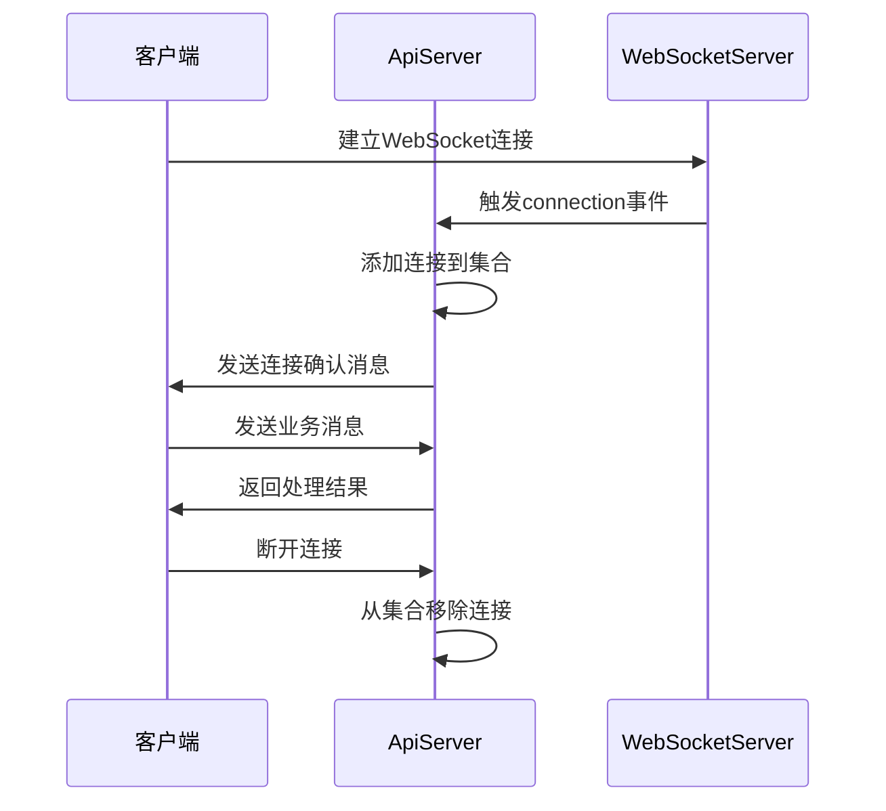
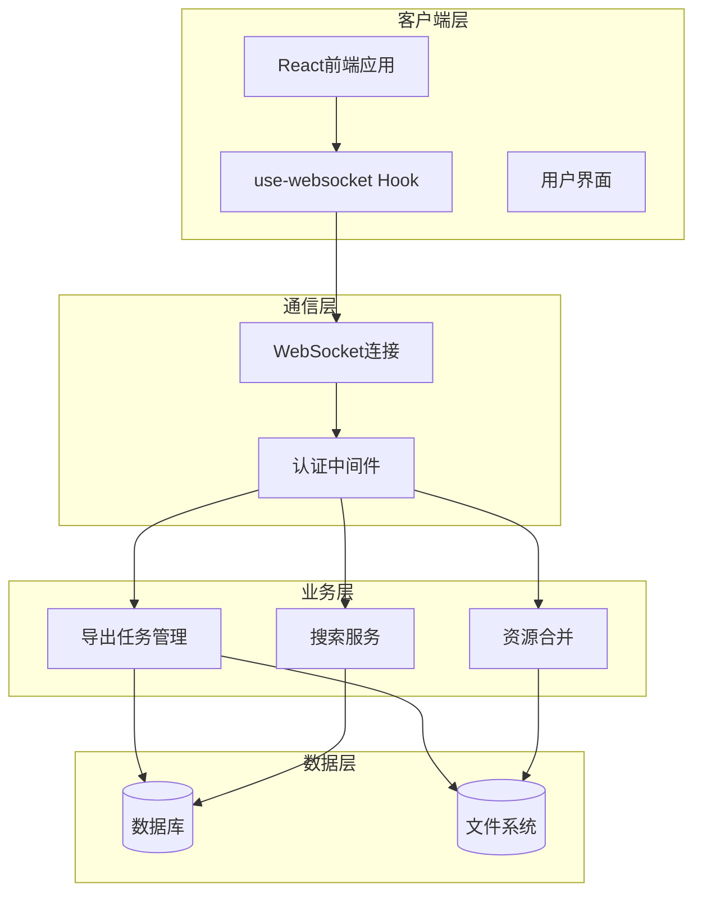
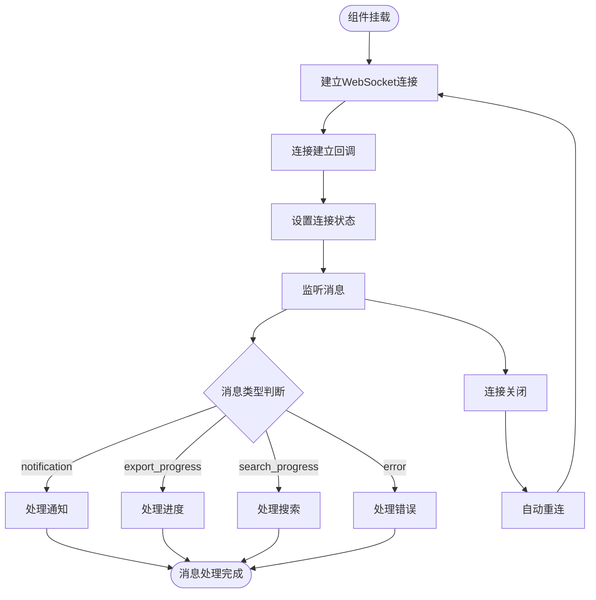
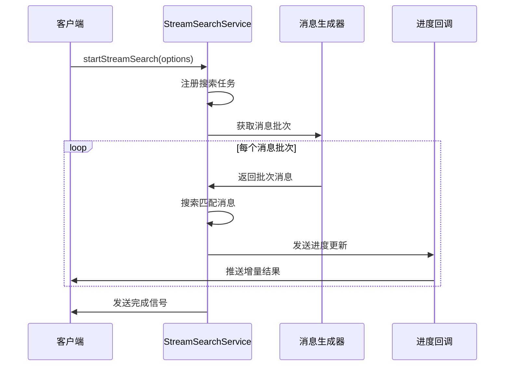
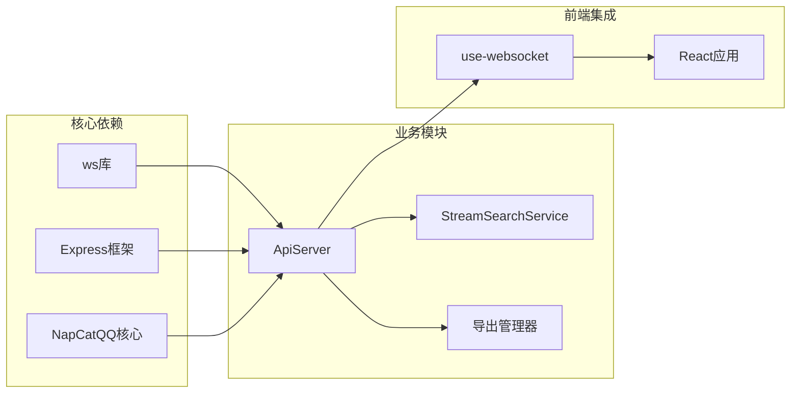
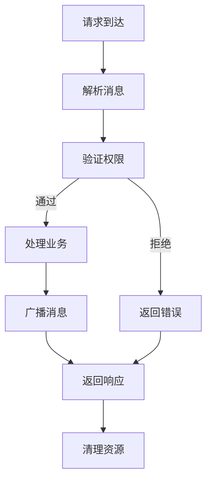

# WebSocket实时通信

<cite>
**本文档引用的文件**
- [ApiServer.ts](file://plugins/qq-chat-exporter/lib/api/ApiServer.ts)
- [use-websocket.ts](file://qce-v4-tool/hooks/use-websocket.ts)
- [StreamSearchService.ts](file://plugins/qq-chat-exporter/lib/services/StreamSearchService.ts)
</cite>

## 目录
1. [简介](#简介)
2. [项目结构](#项目结构)
3. [核心组件](#核心组件)
4. [架构概览](#架构概览)
5. [详细组件分析](#详细组件分析)
6. [依赖关系分析](#依赖关系分析)
7. [性能考虑](#性能考虑)
8. [故障排除指南](#故障排除指南)
9. [结论](#结论)

## 简介

QQ聊天导出器的WebSocket实时通信接口提供了与前端应用的双向通信能力，支持导出进度通知、任务状态更新、错误信息推送等功能。该系统基于Node.js的ws库实现，采用事件驱动的架构设计，能够实时传输各种类型的业务消息。

## 项目结构

WebSocket相关的核心文件分布如下：



**图表来源**
- [ApiServer.ts](file://plugins/qq-chat-exporter/lib/api/ApiServer.ts#L140-L187)
- [use-websocket.ts](file://qce-v4-tool/hooks/use-websocket.ts#L1-L131)

**章节来源**
- [ApiServer.ts](file://plugins/qq-chat-exporter/lib/api/ApiServer.ts#L140-L187)
- [use-websocket.ts](file://qce-v4-tool/hooks/use-websocket.ts#L1-L131)

## 核心组件

### WebSocket服务器配置

ApiServer类负责WebSocket服务器的初始化和管理：

- **服务器实例**: 使用ws库创建WebSocketServer实例
- **连接管理**: 维护活动连接集合(Set<WebSocket>)
- **消息广播**: 提供广播消息给所有连接的功能
- **安全认证**: 集成现有的API认证机制

### 连接生命周期管理



**图表来源**
- [ApiServer.ts](file://plugins/qq-chat-exporter/lib/api/ApiServer.ts#L3267-L3310)

**章节来源**
- [ApiServer.ts](file://plugins/qq-chat-exporter/lib/api/ApiServer.ts#L3267-L3310)

## 架构概览

### 整体架构设计



**图表来源**
- [ApiServer.ts](file://plugins/qq-chat-exporter/lib/api/ApiServer.ts#L180-L187)
- [use-websocket.ts](file://qce-v4-tool/hooks/use-websocket.ts#L12-L131)

## 详细组件分析

### WebSocket消息类型定义

系统支持多种消息类型，每种都有特定的数据结构：

#### 通知消息 (notification)
用于系统级别的通知和状态更新：
- **用途**: 连接成功确认、系统状态变更、操作反馈
- **数据结构**: 包含消息内容和时间戳
- **触发场景**: 服务器启动、连接建立、任务完成

#### 导出进度消息 (export_progress)
实时传输导出任务的进度信息：
- **用途**: 监控导出任务的执行状态
- **数据结构**: 包含任务ID、当前进度、总进度、处理状态
- **更新频率**: 导出过程中的每个批次完成后发送

#### 合并进度消息 (merge-progress)
资源合并操作的实时进度：
- **用途**: 监控多任务资源合并的执行情况
- **数据结构**: 包含合并统计信息和进度百分比

#### 群相册导出进度 (album_export_progress)
群相册导出的详细进度：
- **用途**: 监控群相册资源的导出状态
- **数据结构**: 包含群组信息和导出统计

#### 群文件导出进度 (files_export_progress)
群文件导出的实时状态：
- **用途**: 监控群文件列表和实际文件的导出进度

#### 搜索进度消息 (search_progress)
流式搜索的实时结果推送：
- **用途**: 实时展示搜索进度和匹配结果
- **数据结构**: 包含搜索ID、处理计数、匹配计数、结果列表

### 消息协议规范

#### 基本消息结构
所有WebSocket消息遵循统一的结构：

```typescript
interface WebSocketMessage {
  type: string;           // 消息类型
  data: any;              // 消息数据
  timestamp?: string;     // 时间戳
}
```

#### 认证机制
系统采用与REST API相同的认证方式：
- **头部认证**: Authorization: Bearer {token}
- **查询参数**: token={token}
- **自定义头部**: X-Access-Token: {token}
- **IP绑定**: 令牌与客户端IP地址关联验证

#### 错误处理
系统提供标准化的错误消息格式：
- **错误类型**: 包含错误代码和描述
- **上下文信息**: 请求ID和时间戳
- **状态码**: 对应HTTP状态码

### 客户端连接管理

#### React Hook实现
前端使用自定义Hook管理WebSocket连接：



**图表来源**
- [use-websocket.ts](file://qce-v4-tool/hooks/use-websocket.ts#L42-L99)

#### 连接状态管理
- **连接状态**: 使用React状态管理连接状态
- **自动重连**: 断线后5秒自动重连
- **消息解析**: JSON格式消息的解析和验证
- **回调处理**: 类型化的消息处理器

**章节来源**
- [use-websocket.ts](file://qce-v4-tool/hooks/use-websocket.ts#L1-L131)

### 实时搜索功能

#### 流式搜索架构
系统实现了高效的流式搜索机制：



**图表来源**
- [StreamSearchService.ts](file://plugins/qq-chat-exporter/lib/services/StreamSearchService.ts#L111-L187)

#### 搜索特性
- **内存优化**: 批次处理，避免内存累积
- **实时推送**: 增量推送匹配结果
- **取消支持**: 支持用户主动取消搜索
- **状态跟踪**: 完整的搜索进度监控

**章节来源**
- [StreamSearchService.ts](file://plugins/qq-chat-exporter/lib/services/StreamSearchService.ts#L1-L223)

## 依赖关系分析

### 组件间依赖



**图表来源**
- [ApiServer.ts](file://plugins/qq-chat-exporter/lib/api/ApiServer.ts#L1-L51)
- [use-websocket.ts](file://qce-v4-tool/hooks/use-websocket.ts#L1-L10)

### 外部依赖管理

系统对外部依赖的管理策略：
- **版本锁定**: 使用package-lock.json确保依赖一致性
- **安全更新**: 定期更新ws和相关依赖的安全补丁
- **兼容性**: 确保与NapCatQQ核心版本的兼容性

**章节来源**
- [ApiServer.ts](file://plugins/qq-chat-exporter/lib/api/ApiServer.ts#L1-L51)

## 性能考虑

### 连接池管理

系统采用简单的连接池管理策略：
- **无连接限制**: 当前实现允许任意数量的并发连接
- **内存管理**: 使用Set数据结构高效管理连接集合
- **资源清理**: 进程退出时自动清理所有连接

### 并发处理



**图表来源**
- [ApiServer.ts](file://plugins/qq-chat-exporter/lib/api/ApiServer.ts#L3310-L3388)

### 性能优化建议

1. **连接复用**: 建议客户端复用单个WebSocket连接
2. **消息压缩**: 对大数据量消息考虑压缩传输
3. **批量处理**: 合并频繁的小消息为批量消息
4. **背压控制**: 实现客户端背压处理机制
5. **连接监控**: 添加连接健康检查和超时处理

## 故障排除指南

### 常见连接问题

#### 连接失败排查
- **检查服务器状态**: 确认API服务器正在运行
- **验证端口**: 确认40653端口可用且未被占用
- **防火墙设置**: 检查防火墙是否阻止WebSocket连接
- **CORS配置**: 验证跨域资源共享设置

#### 认证失败排查
- **令牌有效性**: 检查访问令牌是否正确传递
- **IP绑定**: 确认客户端IP与令牌绑定一致
- **令牌过期**: 验证令牌是否在有效期内
- **头部格式**: 确认认证头部格式正确

### 消息处理问题

#### 消息丢失处理
- **重连机制**: 自动重连确保消息传输可靠性
- **消息确认**: 实现消息确认机制防止丢失
- **本地缓存**: 客户端实现消息缓存机制

#### 性能问题诊断
- **连接数监控**: 监控活动连接数量
- **内存使用**: 监控内存使用情况
- **CPU负载**: 监控CPU使用率
- **消息延迟**: 监控消息处理延迟

**章节来源**
- [use-websocket.ts](file://qce-v4-tool/hooks/use-websocket.ts#L83-L96)

## 结论

QQ聊天导出器的WebSocket实时通信接口提供了完整的双向通信能力，支持多种业务场景的消息传输。系统采用简洁的设计模式，具有良好的可扩展性和维护性。

### 主要优势
- **实时性**: 支持实时进度更新和状态通知
- **可靠性**: 自动重连机制确保连接稳定性
- **安全性**: 集成现有认证机制保障通信安全
- **可扩展性**: 模块化设计便于功能扩展

### 改进建议
1. **连接限制**: 实现连接数限制防止资源耗尽
2. **心跳机制**: 添加WebSocket心跳保活机制
3. **断线重连**: 实现智能断线重连策略
4. **性能监控**: 添加详细的性能指标监控
5. **消息持久化**: 实现关键消息的持久化存储

该WebSocket接口为QQ聊天导出器提供了强大的实时通信能力，能够满足各种复杂的业务需求。