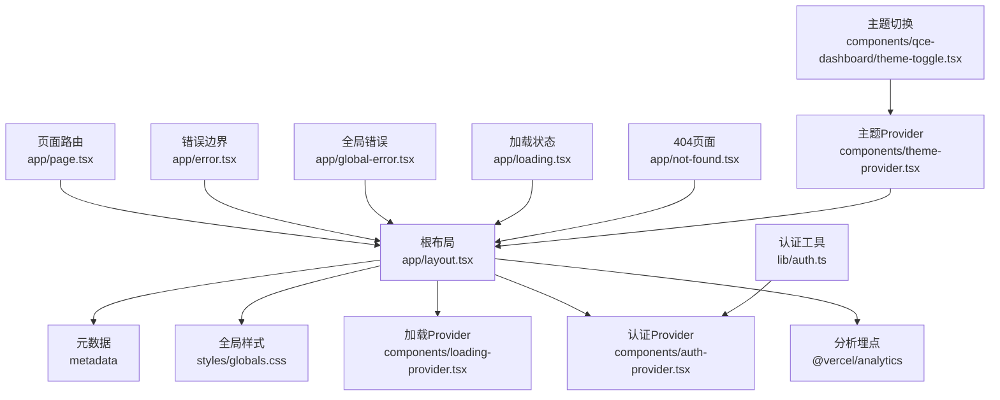
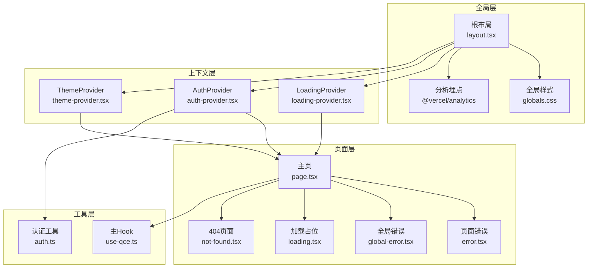
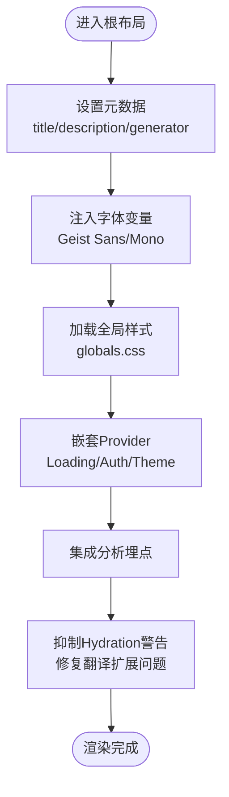
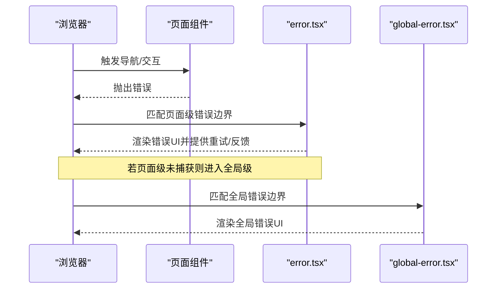
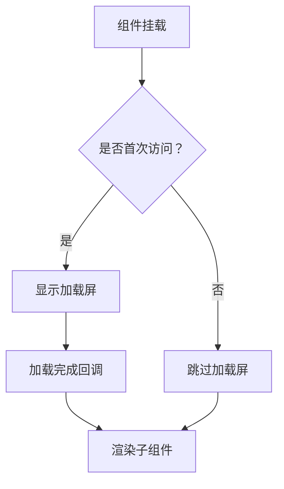
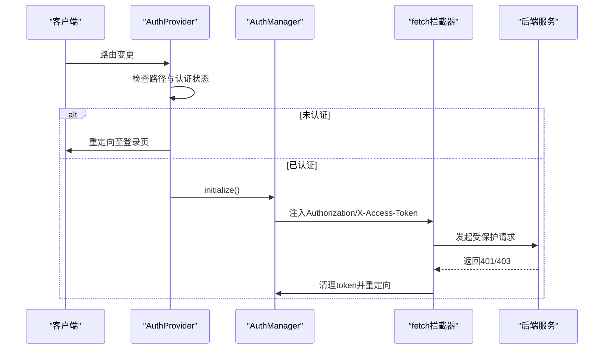
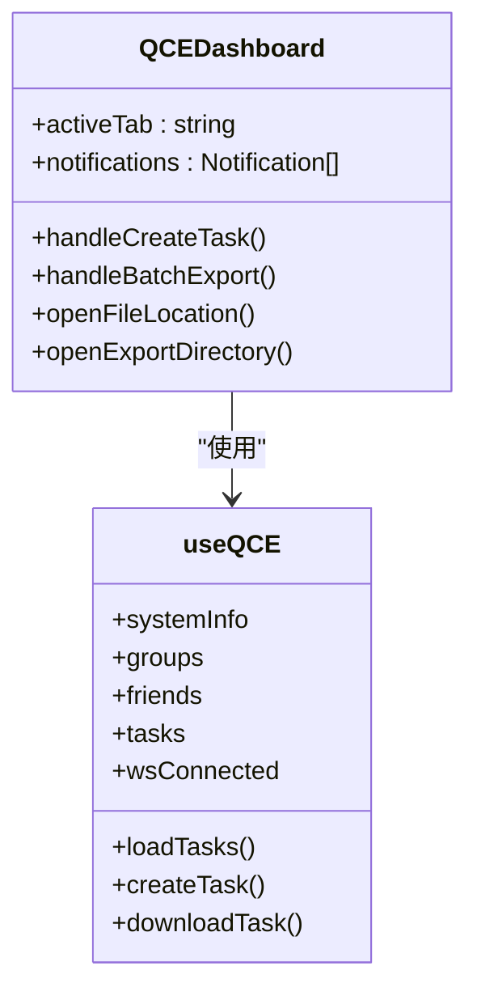
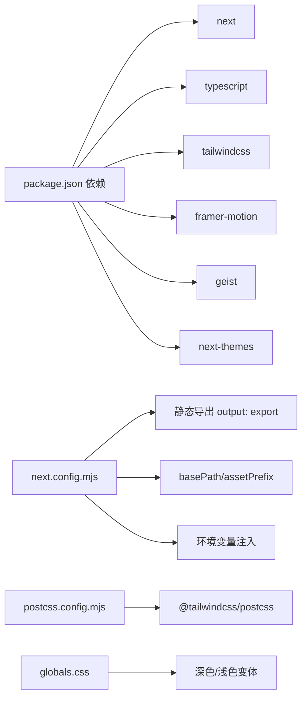

# Next.js应用架构

<cite>
**本文档引用的文件**
- [next.config.mjs](file://qce-v4-tool/next.config.mjs)
- [package.json](file://qce-v4-tool/package.json)
- [layout.tsx](file://qce-v4-tool/app/layout.tsx)
- [error.tsx](file://qce-v4-tool/app/error.tsx)
- [global-error.tsx](file://qce-v4-tool/app/global-error.tsx)
- [loading.tsx](file://qce-v4-tool/app/loading.tsx)
- [page.tsx](file://qce-v4-tool/app/page.tsx)
- [not-found.tsx](file://qce-v4-tool/app/not-found.tsx)
- [loading-provider.tsx](file://qce-v4-tool/components/loading-provider.tsx)
- [auth-provider.tsx](file://qce-v4-tool/components/auth-provider.tsx)
- [theme-provider.tsx](file://qce-v4-tool/components/theme-provider.tsx)
- [theme-toggle.tsx](file://qce-v4-tool/components/qce-dashboard/theme-toggle.tsx)
- [auth.ts](file://qce-v4-tool/lib/auth.ts)
- [use-qce.ts](file://qce-v4-tool/hooks/use-qce.ts)
- [globals.css](file://qce-v4-tool/styles/globals.css)
- [postcss.config.mjs](file://qce-v4-tool/postcss.config.mjs)
- [tsconfig.json](file://qce-v4-tool/tsconfig.json)
</cite>

## 目录
1. [简介](#简介)
2. [项目结构](#项目结构)
3. [核心组件](#核心组件)
4. [架构总览](#架构总览)
5. [详细组件分析](#详细组件分析)
6. [依赖关系分析](#依赖关系分析)
7. [性能考虑](#性能考虑)
8. [故障排除指南](#故障排除指南)
9. [结论](#结论)
10. [附录](#附录)

## 简介
本文件面向Next.js 14+应用的架构设计，围绕根布局配置、路由管理、错误边界处理、加载状态管理展开，同时覆盖元数据配置、字体加载优化、国际化支持、生命周期管理、Hydration处理、浏览器兼容性优化、性能优化策略（代码分割、懒加载、缓存）、最佳实践与部署注意事项。该应用采用App Router模式，结合自定义Provider、认证与主题系统，以及Tailwind CSS + Framer Motion的前端体验。

## 项目结构
应用位于`qce-v4-tool`目录，采用Next.js App Router标准目录结构：
- 根布局与元数据：`app/layout.tsx`、`app/metadata`
- 错误边界：`app/error.tsx`（页面级）、`app/global-error.tsx`（全局级）
- 加载状态：`app/loading.tsx`
- 路由页面：`app/page.tsx`为主页，`app/not-found.tsx`处理404
- 核心Provider：`components/loading-provider.tsx`、`components/auth-provider.tsx`、`components/theme-provider.tsx`
- 认证工具：`lib/auth.ts`
- 主题切换：`components/qce-dashboard/theme-toggle.tsx`
- 样式与主题：`styles/globals.css`、`postcss.config.mjs`
- 构建配置：`next.config.mjs`、`tsconfig.json`、`package.json`

**图表来源**
- [layout.tsx](file://qce-v4-tool/app/layout.tsx#L1-L69)
- [error.tsx](file://qce-v4-tool/app/error.tsx#L1-L129)
- [global-error.tsx](file://qce-v4-tool/app/global-error.tsx#L1-L190)
- [loading.tsx](file://qce-v4-tool/app/loading.tsx#L1-L4)
- [page.tsx](file://qce-v4-tool/app/page.tsx#L1-L800)
- [not-found.tsx](file://qce-v4-tool/app/not-found.tsx#L1-L43)
- [loading-provider.tsx](file://qce-v4-tool/components/loading-provider.tsx#L1-L57)
- [auth-provider.tsx](file://qce-v4-tool/components/auth-provider.tsx#L1-L90)
- [theme-provider.tsx](file://qce-v4-tool/components/theme-provider.tsx#L1-L12)
- [theme-toggle.tsx](file://qce-v4-tool/components/qce-dashboard/theme-toggle.tsx#L1-L37)
- [auth.ts](file://qce-v4-tool/lib/auth.ts#L1-L123)
- [globals.css](file://qce-v4-tool/styles/globals.css#L1-L135)

**章节来源**
- [layout.tsx](file://qce-v4-tool/app/layout.tsx#L1-L69)
- [page.tsx](file://qce-v4-tool/app/page.tsx#L1-L800)
- [error.tsx](file://qce-v4-tool/app/error.tsx#L1-L129)
- [global-error.tsx](file://qce-v4-tool/app/global-error.tsx#L1-L190)
- [loading.tsx](file://qce-v4-tool/app/loading.tsx#L1-L4)
- [not-found.tsx](file://qce-v4-tool/app/not-found.tsx#L1-L43)

## 核心组件
- 根布局与元数据：定义站点标题、描述、语言、字体变量注入、全局样式、分析埋点与Hydration警告抑制。
- Provider体系：LoadingProvider负责首访加载屏与全局加载状态；AuthProvider负责认证检查与重定向；ThemeProvider与ThemeToggle提供主题切换能力。
- 错误边界：页面级error.tsx与全局级global-error.tsx分别处理路由错误与服务器级异常，并提供反馈链接。
- 加载状态：loading.tsx为空实现，用于App Router的默认加载占位。
- 路由页面：page.tsx为核心仪表盘，集成任务、定时导出、聊天历史、表情包等功能模块。
- 认证工具：AuthManager统一管理token存储、URL参数解析、fetch拦截与401/403处理。
- 样式与主题：globals.css使用Tailwind与自定义oklch色彩变量，支持深色/浅色变体；postcss配置启用Tailwind插件。

**章节来源**
- [layout.tsx](file://qce-v4-tool/app/layout.tsx#L1-L69)
- [loading-provider.tsx](file://qce-v4-tool/components/loading-provider.tsx#L1-L57)
- [auth-provider.tsx](file://qce-v4-tool/components/auth-provider.tsx#L1-L90)
- [theme-provider.tsx](file://qce-v4-tool/components/theme-provider.tsx#L1-L12)
- [theme-toggle.tsx](file://qce-v4-tool/components/qce-dashboard/theme-toggle.tsx#L1-L37)
- [error.tsx](file://qce-v4-tool/app/error.tsx#L1-L129)
- [global-error.tsx](file://qce-v4-tool/app/global-error.tsx#L1-L190)
- [loading.tsx](file://qce-v4-tool/app/loading.tsx#L1-L4)
- [page.tsx](file://qce-v4-tool/app/page.tsx#L1-L800)
- [auth.ts](file://qce-v4-tool/lib/auth.ts#L1-L123)
- [globals.css](file://qce-v4-tool/styles/globals.css#L1-L135)
- [postcss.config.mjs](file://qce-v4-tool/postcss.config.mjs#L1-L9)

## 架构总览
应用采用“根布局 + 多Provider + 页面路由”的分层架构。根布局负责全局上下文注入（字体、样式、分析、Hydration警告），Provider层提供业务上下文（加载、认证、主题），页面层承载具体功能逻辑。

**图表来源**
- [layout.tsx](file://qce-v4-tool/app/layout.tsx#L1-L69)
- [loading-provider.tsx](file://qce-v4-tool/components/loading-provider.tsx#L1-L57)
- [auth-provider.tsx](file://qce-v4-tool/components/auth-provider.tsx#L1-L90)
- [theme-provider.tsx](file://qce-v4-tool/components/theme-provider.tsx#L1-L12)
- [page.tsx](file://qce-v4-tool/app/page.tsx#L1-L800)
- [error.tsx](file://qce-v4-tool/app/error.tsx#L1-L129)
- [global-error.tsx](file://qce-v4-tool/app/global-error.tsx#L1-L190)
- [loading.tsx](file://qce-v4-tool/app/loading.tsx#L1-L4)
- [not-found.tsx](file://qce-v4-tool/app/not-found.tsx#L1-L43)
- [auth.ts](file://qce-v4-tool/lib/auth.ts#L1-L123)
- [use-qce.ts](file://qce-v4-tool/hooks/use-qce.ts#L1-L75)

## 详细组件分析

### 根布局与元数据配置
- 元数据：包含标题、描述、生成器等，确保SEO与分享卡片一致性。
- 字体加载：通过Geist Sans/Mono的CSS变量注入，避免FOIT，提升可访问性。
- 分析埋点：集成Vercel Analytics，便于统计与监控。
- Hydration处理：抑制Hydration警告，避免浏览器翻译扩展导致的DOM不一致问题。
- 样式与主题：全局样式使用Tailwind与自定义oklch变量，支持深色/浅色主题切换。

**图表来源**
- [layout.tsx](file://qce-v4-tool/app/layout.tsx#L9-L68)
- [globals.css](file://qce-v4-tool/styles/globals.css#L1-L135)

**章节来源**
- [layout.tsx](file://qce-v4-tool/app/layout.tsx#L1-L69)
- [globals.css](file://qce-v4-tool/styles/globals.css#L1-L135)

### 错误边界处理
- 页面级错误：error.tsx捕获路由内抛出的错误，展示错误信息、digest、环境信息，并提供重试与反馈入口。
- 全局错误：global-error.tsx处理服务器级异常，保证在SSR/CSR混合场景下的兜底显示。
- 反馈机制：内置GitHub Issue模板，自动填充错误信息与环境信息，便于问题追踪。

**图表来源**
- [error.tsx](file://qce-v4-tool/app/error.tsx#L1-L129)
- [global-error.tsx](file://qce-v4-tool/app/global-error.tsx#L1-L190)

**章节来源**
- [error.tsx](file://qce-v4-tool/app/error.tsx#L1-L129)
- [global-error.tsx](file://qce-v4-tool/app/global-error.tsx#L1-L190)

### 加载状态管理
- LoadingProvider：首次访问显示加载屏，后续访问跳过；提供全局setLoading接口，供子组件控制。
- loading.tsx：默认空实现，作为App Router的加载占位符。
- useLoading：自定义Hook，确保在Provider上下文中使用，避免越界调用。

**图表来源**
- [loading-provider.tsx](file://qce-v4-tool/components/loading-provider.tsx#L21-L57)
- [loading.tsx](file://qce-v4-tool/app/loading.tsx#L1-L4)

**章节来源**
- [loading-provider.tsx](file://qce-v4-tool/components/loading-provider.tsx#L1-L57)
- [loading.tsx](file://qce-v4-tool/app/loading.tsx#L1-L4)

### 认证与主题系统
- AuthProvider：在客户端检查路径与认证状态，必要时重定向至登录页；通过AuthManager初始化fetch拦截器，处理401/403。
- AuthManager：单例管理token存储、URL参数解析、请求头注入与错误重定向。
- ThemeProvider/ThemeToggle：基于next-themes的主题切换，支持跟随系统、深色、浅色三种模式。

**图表来源**
- [auth-provider.tsx](file://qce-v4-tool/components/auth-provider.tsx#L7-L90)
- [auth.ts](file://qce-v4-tool/lib/auth.ts#L28-L120)

**章节来源**
- [auth-provider.tsx](file://qce-v4-tool/components/auth-provider.tsx#L1-L90)
- [auth.ts](file://qce-v4-tool/lib/auth.ts#L1-L123)
- [theme-provider.tsx](file://qce-v4-tool/components/theme-provider.tsx#L1-L12)
- [theme-toggle.tsx](file://qce-v4-tool/components/qce-dashboard/theme-toggle.tsx#L1-L37)

### 页面路由与功能模块
- page.tsx：核心仪表盘，整合任务创建、定时导出、聊天历史、表情包导出、资源索引、通知系统等。
- useQCE：聚合系统信息、聊天数据、导出任务与WebSocket进度，统一对外暴露状态与方法。
- 404页面：not-found.tsx提供友好的404提示与返回操作。

**图表来源**
- [page.tsx](file://qce-v4-tool/app/page.tsx#L74-L800)
- [use-qce.ts](file://qce-v4-tool/hooks/use-qce.ts#L1-L75)

**章节来源**
- [page.tsx](file://qce-v4-tool/app/page.tsx#L1-L800)
- [use-qce.ts](file://qce-v4-tool/hooks/use-qce.ts#L1-L75)
- [not-found.tsx](file://qce-v4-tool/app/not-found.tsx#L1-L43)

## 依赖关系分析
- 构建与运行时：Next.js 14+、TypeScript、Tailwind CSS、Framer Motion、Geist字体、next-themes。
- 配置：next.config.mjs启用静态导出、基础路径与资源前缀、Turbopack、环境变量注入；tsconfig.json配置路径别名与严格模式；postcss.config.mjs启用Tailwind插件。
- 样式：globals.css使用oklch色彩空间与自定义变量，支持深色/浅色变体与动画基类。

**图表来源**
- [package.json](file://qce-v4-tool/package.json#L12-L74)
- [next.config.mjs](file://qce-v4-tool/next.config.mjs#L17-L40)
- [postcss.config.mjs](file://qce-v4-tool/postcss.config.mjs#L1-L9)
- [globals.css](file://qce-v4-tool/styles/globals.css#L1-L135)

**章节来源**
- [package.json](file://qce-v4-tool/package.json#L1-L74)
- [next.config.mjs](file://qce-v4-tool/next.config.mjs#L1-L41)
- [tsconfig.json](file://qce-v4-tool/tsconfig.json#L1-L56)
- [postcss.config.mjs](file://qce-v4-tool/postcss.config.mjs#L1-L9)
- [globals.css](file://qce-v4-tool/styles/globals.css#L1-L135)

## 性能考虑
- 代码分割与懒加载：利用Next.js App Router的路由级分割与动态导入，减少首屏体积；页面组件按需加载。
- 缓存策略：静态导出（output: export）适合CDN部署；合理设置缓存头与版本化资源；利用basePath/assetPrefix优化CDN路径。
- 字体与样式：Geist字体通过CSS变量注入，避免字体闪烁；Tailwind按需生成，减少运行时开销。
- 动画与交互：Framer Motion提供流畅过渡，建议在高刷新率设备上启用硬件加速；减少不必要的重渲染。
- 网络与认证：AuthManager拦截fetch，统一添加认证头，减少重复逻辑；对401/403进行快速重定向，避免无效请求。
- 构建优化：启用Turbopack（开发）与生产构建优化；TS严格模式与类型检查降低运行时错误。

[本节为通用性能指导，无需特定文件引用]

## 故障排除指南
- Hydration不匹配：根布局中抑制Hydration警告，并修复浏览器翻译扩展对DOM的操作，避免React在客户端更新时抛错。
- 认证失败：检查AuthManager初始化流程与fetch拦截器；确认401/403时token清理与重定向逻辑。
- 错误反馈：页面级与全局级错误边界均提供GitHub Issue模板，收集错误信息与环境信息，便于定位问题。
- 404处理：not-found.tsx提供友好提示与返回操作，确保用户体验。

**章节来源**
- [layout.tsx](file://qce-v4-tool/app/layout.tsx#L21-L68)
- [auth.ts](file://qce-v4-tool/lib/auth.ts#L84-L120)
- [error.tsx](file://qce-v4-tool/app/error.tsx#L35-L75)
- [global-error.tsx](file://qce-v4-tool/app/global-error.tsx#L33-L73)
- [not-found.tsx](file://qce-v4-tool/app/not-found.tsx#L25-L38)

## 结论
该Next.js应用通过根布局统一注入元数据、字体与分析，配合Provider体系实现加载、认证与主题管理；错误边界覆盖页面级与全局级异常；路由与功能模块清晰分离，具备良好的可维护性与扩展性。结合静态导出与Tailwind/Framer Motion等技术栈，可在保证性能的同时提供优秀的用户体验。

[本节为总结性内容，无需特定文件引用]

## 附录
- 国际化支持：当前项目以中文为主，如需国际化，可在根布局lang属性基础上引入i18n方案，并在路由层按语言组织页面。
- 浏览器兼容性：通过严格TS配置与现代浏览器特性使用，建议在CI中加入兼容性测试矩阵。
- 部署注意事项：静态导出模式下，确保CDN正确映射basePath/assetPrefix；生产环境开启Gzip/Brotli压缩与HTTP/2；监控Vercel Analytics指标。

[本节为通用指导，无需特定文件引用]