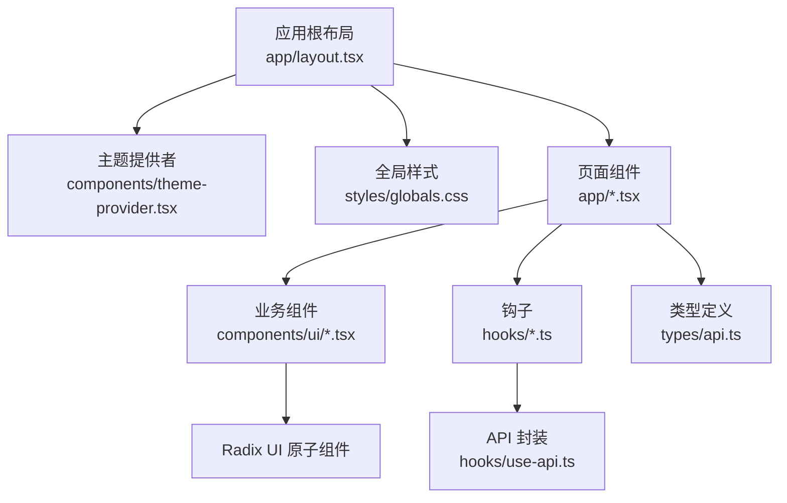
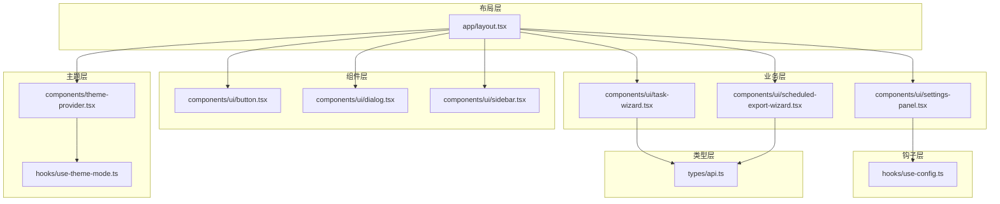
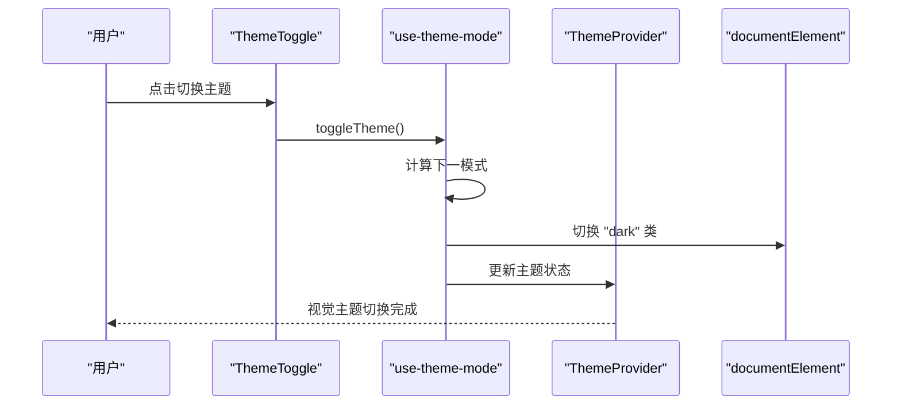
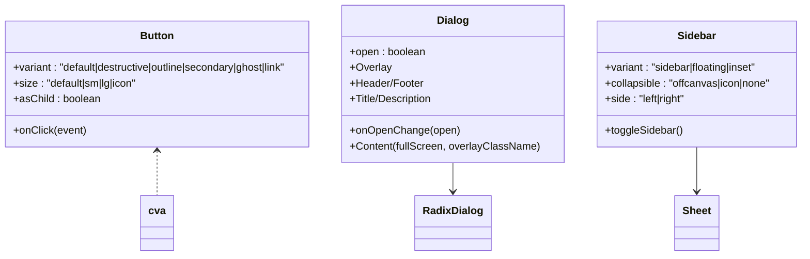
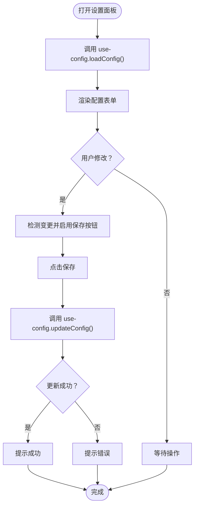
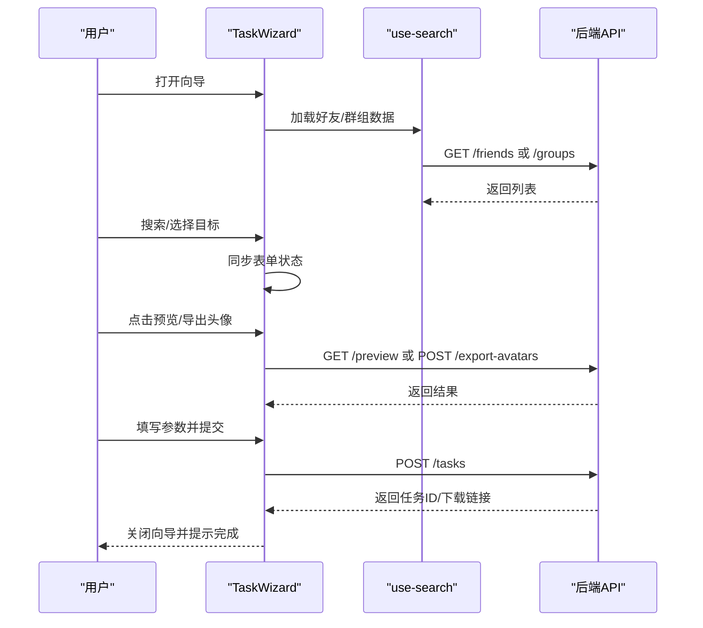
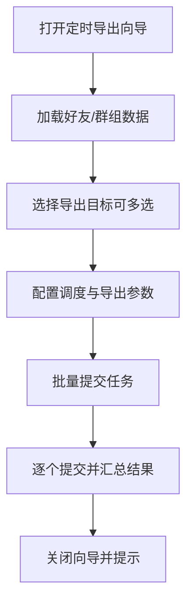
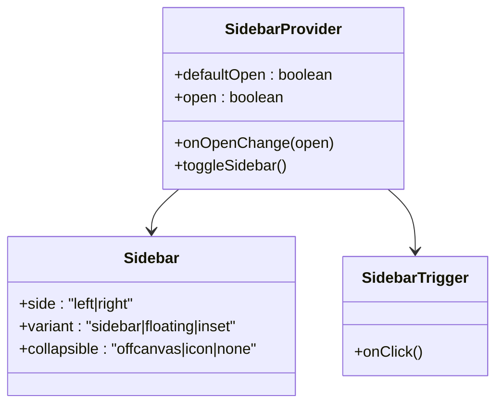
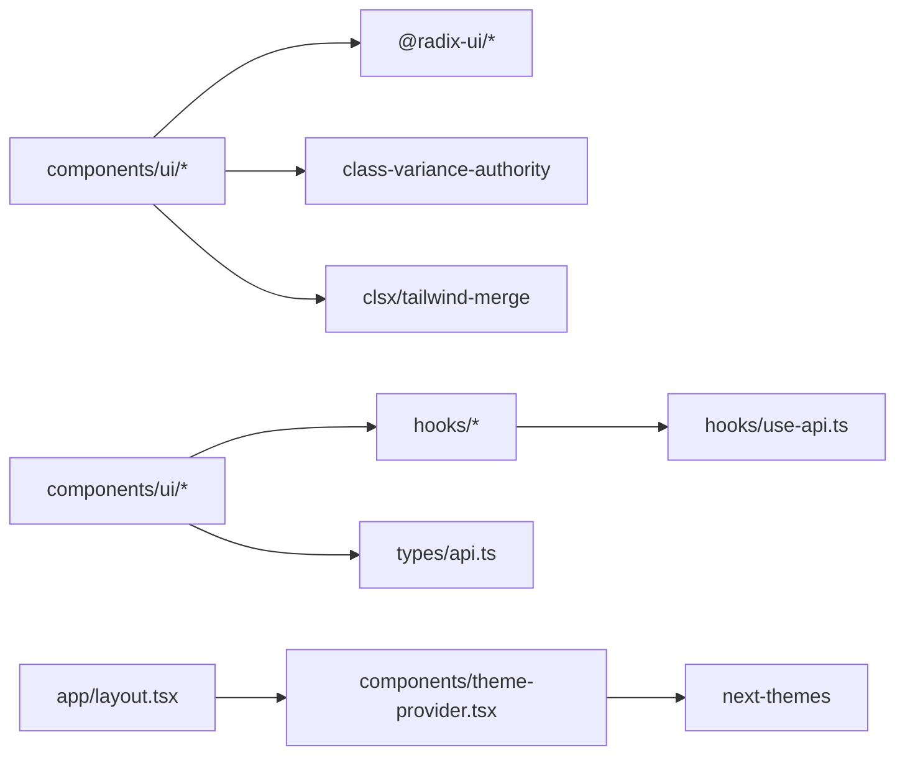

# 前端界面系统

<cite>
**本文档引用的文件**
- [package.json](file://qce-v4-tool/package.json)
- [next.config.mjs](file://qce-v4-tool/next.config.mjs)
- [app/layout.tsx](file://qce-v4-tool/app/layout.tsx)
- [styles/globals.css](file://qce-v4-tool/styles/globals.css)
- [components/theme-provider.tsx](file://qce-v4-tool/components/theme-provider.tsx)
- [components/qce-dashboard/theme-toggle.tsx](file://qce-v4-tool/components/qce-dashboard/theme-toggle.tsx)
- [components/ui/button.tsx](file://qce-v4-tool/components/ui/button.tsx)
- [components/ui/dialog.tsx](file://qce-v4-tool/components/ui/dialog.tsx)
- [components/ui/settings-panel.tsx](file://qce-v4-tool/components/ui/settings-panel.tsx)
- [components/ui/task-wizard.tsx](file://qce-v4-tool/components/ui/task-wizard.tsx)
- [components/ui/scheduled-export-wizard.tsx](file://qce-v4-tool/components/ui/scheduled-export-wizard.tsx)
- [components/ui/sidebar.tsx](file://qce-v4-tool/components/ui/sidebar.tsx)
- [hooks/use-config.ts](file://qce-v4-tool/hooks/use-config.ts)
- [hooks/use-theme-mode.ts](file://qce-v4-tool/hooks/use-theme-mode.ts)
- [types/api.ts](file://qce-v4-tool/types/api.ts)
</cite>

## 目录
1. [简介](#简介)
2. [项目结构](#项目结构)
3. [核心组件](#核心组件)
4. [架构总览](#架构总览)
5. [详细组件分析](#详细组件分析)
6. [依赖关系分析](#依赖关系分析)
7. [性能考量](#性能考量)
8. [故障排查指南](#故障排查指南)
9. [结论](#结论)
10. [附录](#附录)

## 简介
本文件系统性梳理 QQ 聊天导出器前端界面系统，基于 Next.js 构建，采用 Radix UI 组件体系与 TailwindCSS 样式框架，结合自定义动画与主题系统，提供仪表板、导出向导、任务管理与设置面板等核心功能模块。文档覆盖路由与布局管理、主题系统、UI 组件设计与实现、状态管理与事件处理、组件组合与集成、响应式与跨浏览器兼容性，以及属性定义、事件回调与样式定制选项。

## 项目结构
前端工程位于 qce-v4-tool 目录，采用 Next.js App Router 结构，核心组织方式如下：
- 应用入口与全局布局：app/layout.tsx
- 主题提供者：components/theme-provider.tsx
- 全局样式：styles/globals.css
- 组件库：components/ui/*（基于 Radix UI 的二次封装）
- 业务组件：components/qce-dashboard/*
- 钩子：hooks/*
- 类型定义：types/api.ts
- 构建配置：next.config.mjs、package.json

图表来源
- [app/layout.tsx](file://qce-v4-tool/app/layout.tsx#L15-L68)
- [components/theme-provider.tsx](file://qce-v4-tool/components/theme-provider.tsx#L9-L11)
- [styles/globals.css](file://qce-v4-tool/styles/globals.css#L1-L135)

章节来源
- [next.config.mjs](file://qce-v4-tool/next.config.mjs#L17-L40)
- [package.json](file://qce-v4-tool/package.json#L1-L74)

## 核心组件
- 主题系统：通过 next-themes 提供主题切换，配合 use-theme-mode 实现系统/浅色/深色三种模式与持久化存储。
- 布局与容器：Sidebar 提供桌面/移动端双态侧边栏，支持折叠、悬浮与嵌入变体；SidebarTrigger 与键盘快捷键控制。
- 通用 UI：Button、Dialog、Input、Select、Switch、Checkbox、Avatar、Badge、Separator 等，均基于 Radix UI 并按设计规范封装。
- 业务组件：SettingsPanel（设置面板）、TaskWizard（导出向导）、ScheduledExportWizard（定时导出向导）。
- 钩子：use-config（配置读取与更新）、use-theme-mode（主题模式）、use-search（聊天列表搜索）、use-toast（提示）等。

章节来源
- [components/theme-provider.tsx](file://qce-v4-tool/components/theme-provider.tsx#L9-L11)
- [hooks/use-theme-mode.ts](file://qce-v4-tool/hooks/use-theme-mode.ts#L24-L110)
- [components/ui/sidebar.tsx](file://qce-v4-tool/components/ui/sidebar.tsx#L154-L254)
- [components/ui/button.tsx](file://qce-v4-tool/components/ui/button.tsx#L38-L59)
- [components/ui/dialog.tsx](file://qce-v4-tool/components/ui/dialog.tsx#L7-L107)
- [components/ui/settings-panel.tsx](file://qce-v4-tool/components/ui/settings-panel.tsx#L12-L171)
- [components/ui/task-wizard.tsx](file://qce-v4-tool/components/ui/task-wizard.tsx#L38-L800)
- [components/ui/scheduled-export-wizard.tsx](file://qce-v4-tool/components/ui/scheduled-export-wizard.tsx#L41-L927)
- [hooks/use-config.ts](file://qce-v4-tool/hooks/use-config.ts#L12-L73)

## 架构总览
前端采用“布局层-主题层-组件层-业务层-钩子层-类型层”的分层架构：
- 布局层：RootLayout 负责全局 HTML 结构、字体、Analytics 注入与 Hydration 保护。
- 主题层：ThemeProvider 包裹应用，use-theme-mode 管理主题模式与系统偏好联动。
- 组件层：基于 Radix UI 的原子组件二次封装，统一风格与交互。
- 业务层：SettingsPanel、TaskWizard、ScheduledExportWizard 等承载具体业务流程。
- 钩子层：use-config、use-theme-mode、use-search 等提供状态与副作用。
- 类型层：types/api.ts 定义前后端通信的数据契约。

图表来源
- [app/layout.tsx](file://qce-v4-tool/app/layout.tsx#L15-L68)
- [components/theme-provider.tsx](file://qce-v4-tool/components/theme-provider.tsx#L9-L11)
- [hooks/use-theme-mode.ts](file://qce-v4-tool/hooks/use-theme-mode.ts#L24-L110)
- [components/ui/button.tsx](file://qce-v4-tool/components/ui/button.tsx#L38-L59)
- [components/ui/dialog.tsx](file://qce-v4-tool/components/ui/dialog.tsx#L7-L107)
- [components/ui/sidebar.tsx](file://qce-v4-tool/components/ui/sidebar.tsx#L154-L254)
- [components/ui/settings-panel.tsx](file://qce-v4-tool/components/ui/settings-panel.tsx#L12-L171)
- [components/ui/task-wizard.tsx](file://qce-v4-tool/components/ui/task-wizard.tsx#L38-L800)
- [components/ui/scheduled-export-wizard.tsx](file://qce-v4-tool/components/ui/scheduled-export-wizard.tsx#L41-L927)
- [hooks/use-config.ts](file://qce-v4-tool/hooks/use-config.ts#L12-L73)
- [types/api.ts](file://qce-v4-tool/types/api.ts#L106-L188)

## 详细组件分析

### 主题系统与布局
- 主题提供者：ThemeProvider 包裹应用，透传 next-themes 的主题能力。
- 主题模式钩子：use-theme-mode 支持 system/light/dark 三模式，持久化到 localStorage，监听系统配色变化并同步。
- 根布局：RootLayout 注入字体、Analytics、Hydration 保护脚本，确保 SSR/CSR 一致与浏览器翻译兼容性修复。

图表来源
- [components/qce-dashboard/theme-toggle.tsx](file://qce-v4-tool/components/qce-dashboard/theme-toggle.tsx#L9-L36)
- [hooks/use-theme-mode.ts](file://qce-v4-tool/hooks/use-theme-mode.ts#L81-L95)
- [components/theme-provider.tsx](file://qce-v4-tool/components/theme-provider.tsx#L9-L11)
- [app/layout.tsx](file://qce-v4-tool/app/layout.tsx#L21-L56)

章节来源
- [components/theme-provider.tsx](file://qce-v4-tool/components/theme-provider.tsx#L9-L11)
- [components/qce-dashboard/theme-toggle.tsx](file://qce-v4-tool/components/qce-dashboard/theme-toggle.tsx#L9-L36)
- [hooks/use-theme-mode.ts](file://qce-v4-tool/hooks/use-theme-mode.ts#L24-L110)
- [app/layout.tsx](file://qce-v4-tool/app/layout.tsx#L15-L68)
- [styles/globals.css](file://qce-v4-tool/styles/globals.css#L42-L75)

### 通用 UI 组件设计
- Button：基于 cva 的变体与尺寸系统，支持 asChild、禁用态与聚焦态样式。
- Dialog：基于 Radix UI Dialog，扩展全屏模式、模糊遮罩与动画类名。
- Sidebar：提供桌面/移动端双态、折叠/图标/离屏三种可折叠策略，支持 Cookie 记忆状态与键盘快捷键。

图表来源
- [components/ui/button.tsx](file://qce-v4-tool/components/ui/button.tsx#L38-L59)
- [components/ui/dialog.tsx](file://qce-v4-tool/components/ui/dialog.tsx#L7-L107)
- [components/ui/sidebar.tsx](file://qce-v4-tool/components/ui/sidebar.tsx#L154-L254)

章节来源
- [components/ui/button.tsx](file://qce-v4-tool/components/ui/button.tsx#L38-L59)
- [components/ui/dialog.tsx](file://qce-v4-tool/components/ui/dialog.tsx#L35-L74)
- [components/ui/sidebar.tsx](file://qce-v4-tool/components/ui/sidebar.tsx#L154-L254)

### 设置面板（SettingsPanel）
- 功能：加载/更新导出路径配置，支持手动导出与定时导出路径分别设置。
- 状态：本地状态维护输入框值与变更检测，use-config 钩子负责与后端 API 交互。
- 交互：加载中旋转、保存中禁用、重置恢复、成功/失败提示。

图表来源
- [components/ui/settings-panel.tsx](file://qce-v4-tool/components/ui/settings-panel.tsx#L12-L171)
- [hooks/use-config.ts](file://qce-v4-tool/hooks/use-config.ts#L12-L73)

章节来源
- [components/ui/settings-panel.tsx](file://qce-v4-tool/components/ui/settings-panel.tsx#L12-L171)
- [hooks/use-config.ts](file://qce-v4-tool/hooks/use-config.ts#L12-L73)

### 导出向导（TaskWizard）
- 功能：选择好友/群组、设置导出参数（格式、时间范围、关键词、系统消息、图片过滤、压缩、头像嵌入、流式 ZIP、自定义路径、文件名含名称等），并提交创建任务。
- 搜索与分页：use-search 提供好友/群组搜索与懒加载，支持滚动触底加载更多。
- 成员选择：群组场景支持排除成员（多选），通过成员列表筛选与确认。
- 手动输入：支持手动输入 QQ 号与备注名，生成虚拟好友对象以供展示与提交。
- 预览与头像导出：支持预览与批量导出群组头像。

图表来源
- [components/ui/task-wizard.tsx](file://qce-v4-tool/components/ui/task-wizard.tsx#L38-L800)
- [types/api.ts](file://qce-v4-tool/types/api.ts#L106-L188)

章节来源
- [components/ui/task-wizard.tsx](file://qce-v4-tool/components/ui/task-wizard.tsx#L38-L800)
- [types/api.ts](file://qce-v4-tool/types/api.ts#L106-L188)

### 定时导出向导（ScheduledExportWizard）
- 功能：批量为目标（好友/群组）创建定时导出任务，支持调度类型（每日/每周/每月/自定义）、执行时间/Cron 表达式、时间范围（昨天/上周/上月/最近N天/自定义）、导出格式与高级选项。
- 批量提交：逐项构造任务表单并逐一提交，汇总成功数量。
- 目标选择：支持多选，支持移除与重新选择。

图表来源
- [components/ui/scheduled-export-wizard.tsx](file://qce-v4-tool/components/ui/scheduled-export-wizard.tsx#L41-L927)
- [types/api.ts](file://qce-v4-tool/types/api.ts#L251-L316)

章节来源
- [components/ui/scheduled-export-wizard.tsx](file://qce-v4-tool/components/ui/scheduled-export-wizard.tsx#L41-L927)
- [types/api.ts](file://qce-v4-tool/types/api.ts#L251-L316)

### 侧边栏（Sidebar）
- 功能：提供导航菜单、分组、动作与徽标，支持桌面/移动端双态、折叠/图标/离屏三种模式，Cookie 记忆状态，键盘快捷键（Cmd/Ctrl+B）快速切换。
- 交互：SidebarTrigger 触发切换；SidebarMenuButton 支持激活态与 Tooltip；SidebarMenuAction 支持悬停显示。

图表来源
- [components/ui/sidebar.tsx](file://qce-v4-tool/components/ui/sidebar.tsx#L56-L152)
- [components/ui/sidebar.tsx](file://qce-v4-tool/components/ui/sidebar.tsx#L154-L254)
- [components/ui/sidebar.tsx](file://qce-v4-tool/components/ui/sidebar.tsx#L256-L280)

章节来源
- [components/ui/sidebar.tsx](file://qce-v4-tool/components/ui/sidebar.tsx#L56-L280)

## 依赖关系分析
- 组件依赖：业务组件依赖通用 UI 组件与 Radix UI；通用 UI 组件依赖 Radix UI 原子组件与样式工具（cva、cn）。
- 钩子依赖：业务组件依赖钩子；钩子依赖 API 封装与 toast 提示。
- 类型依赖：所有业务组件与钩子共享 types/api.ts 中的接口定义。

图表来源
- [package.json](file://qce-v4-tool/package.json#L12-L72)
- [components/ui/button.tsx](file://qce-v4-tool/components/ui/button.tsx#L1-L60)
- [components/ui/dialog.tsx](file://qce-v4-tool/components/ui/dialog.tsx#L1-L107)
- [components/ui/sidebar.tsx](file://qce-v4-tool/components/ui/sidebar.tsx#L1-L727)
- [hooks/use-config.ts](file://qce-v4-tool/hooks/use-config.ts#L1-L73)
- [types/api.ts](file://qce-v4-tool/types/api.ts#L1-L509)
- [app/layout.tsx](file://qce-v4-tool/app/layout.tsx#L1-L69)
- [components/theme-provider.tsx](file://qce-v4-tool/components/theme-provider.tsx#L1-L12)

章节来源
- [package.json](file://qce-v4-tool/package.json#L12-L72)

## 性能考量
- 懒加载与分页：聊天列表使用滚动触底加载更多，避免一次性渲染大量数据。
- 动画与过渡：使用 Framer Motion 与 Tailwind 动画类，注意在低端设备上的性能影响，建议在用户偏好中提供减少动画的选项。
- 图片与头像：支持 Base64 嵌入与流式 ZIP 导出，针对超大消息量优化内存占用。
- 样式体积：Tailwind 4 使用 CSS 变量与 @theme inline，减少运行时样式计算成本。
- 构建优化：Next.js 输出静态站点（export），生产环境设置 basePath/assetPrefix，利于 CDN 分发。

## 故障排查指南
- 主题不生效：检查 use-theme-mode 是否正确写入 localStorage 与 documentElement 的 "dark" 类；确认系统配色监听是否可用。
- 搜索无结果：确认 use-search 的 allData/hasMore/loading 状态，检查网络请求与分页逻辑。
- 保存设置失败：use-config.updateConfig 返回错误时会弹出 toast，检查后端返回的 error 字段与网络状态。
- 移动端侧边栏无法关闭：检查 Sheet 与 useIsMobile 的状态同步，确认键盘快捷键绑定。
- 浏览器翻译导致 DOM 错误：RootLayout 内置对 Node.removeChild/insertBefore 的修复，若仍出现异常，检查第三方翻译扩展。

章节来源
- [hooks/use-theme-mode.ts](file://qce-v4-tool/hooks/use-theme-mode.ts#L32-L79)
- [hooks/use-config.ts](file://qce-v4-tool/hooks/use-config.ts#L32-L64)
- [components/ui/sidebar.tsx](file://qce-v4-tool/components/ui/sidebar.tsx#L96-L110)
- [app/layout.tsx](file://qce-v4-tool/app/layout.tsx#L35-L53)

## 结论
该前端界面系统以 Next.js 为基础，围绕 Radix UI 与 TailwindCSS 构建了高内聚、低耦合的组件体系，结合自定义主题与动画、完善的钩子与类型系统，实现了从仪表板到导出向导与定时任务的完整工作流。通过懒加载、流式导出与样式优化，兼顾了性能与体验。建议后续在无障碍、国际化与测试覆盖率方面持续完善。

## 附录

### 组件属性与事件回调清单（节选）
- Button
  - 属性：variant（default/destructive/outline/secondary/ghost/link）、size（default/sm/lg/icon）、asChild、className
  - 事件：onClick 等原生事件透传
- Dialog
  - 属性：open、onOpenChange、fullScreen、overlayClassName
  - 子组件：Overlay、Content、Header/Footer、Title/Description、Trigger/Close
- Sidebar
  - 属性：side（left/right）、variant（sidebar/floating/inset）、collapsible（offcanvas/icon/none）
  - 方法：toggleSidebar、useSidebar 提供上下文状态
- SettingsPanel
  - 属性：无（通过 use-config 钩子管理）
  - 事件：onSubmit（保存）、onReset（重置）
- TaskWizard
  - 属性：isOpen、onClose、onSubmit、isLoading、prefilledData、groups、friends、onLoadData、onPreview、onExportAvatars、avatarExportLoading
  - 事件：目标选择、成员多选、参数变更、提交
- ScheduledExportWizard
  - 属性：isOpen、onClose、onSubmit、isLoading、prefilledData、groups、friends、onLoadData
  - 事件：目标多选、参数配置、批量提交

章节来源
- [components/ui/button.tsx](file://qce-v4-tool/components/ui/button.tsx#L38-L59)
- [components/ui/dialog.tsx](file://qce-v4-tool/components/ui/dialog.tsx#L35-L107)
- [components/ui/sidebar.tsx](file://qce-v4-tool/components/ui/sidebar.tsx#L154-L280)
- [components/ui/settings-panel.tsx](file://qce-v4-tool/components/ui/settings-panel.tsx#L12-L171)
- [components/ui/task-wizard.tsx](file://qce-v4-tool/components/ui/task-wizard.tsx#L19-L50)
- [components/ui/scheduled-export-wizard.tsx](file://qce-v4-tool/components/ui/scheduled-export-wizard.tsx#L21-L50)