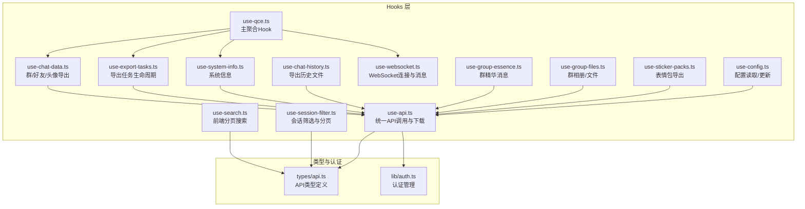
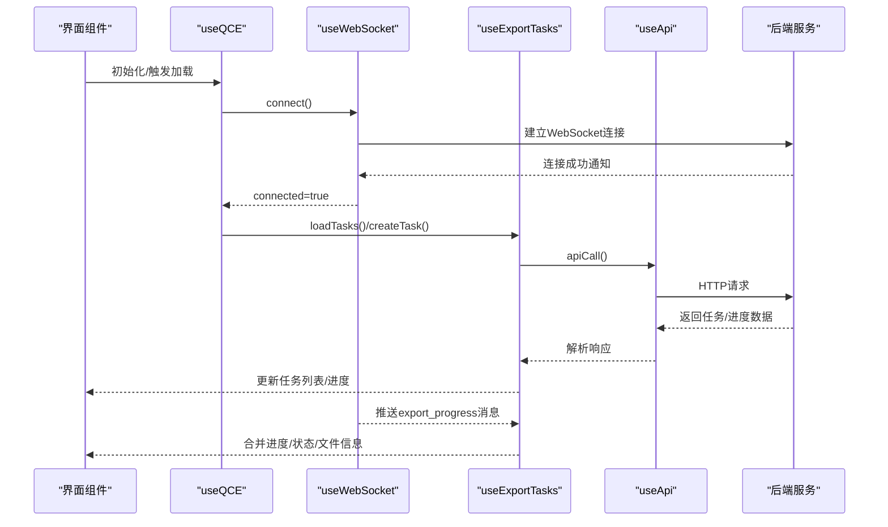
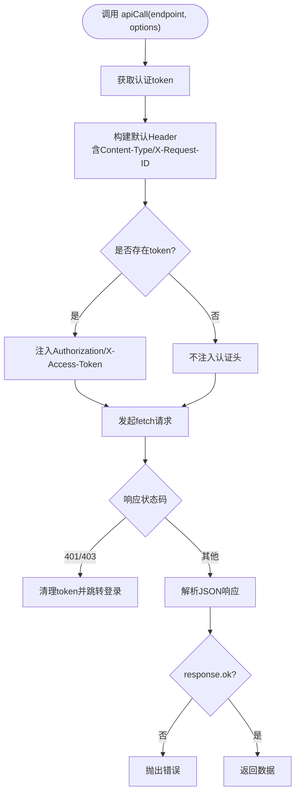
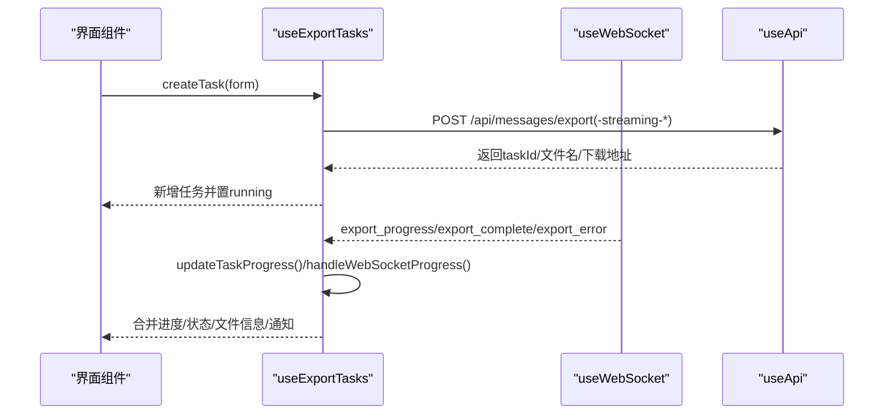
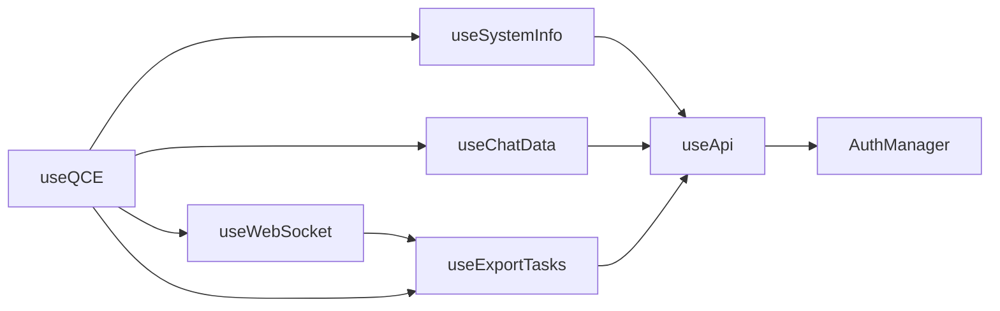

# 状态管理系统

<cite>
**本文档引用的文件**
- [use-api.ts](file://qce-v4-tool/hooks/use-api.ts)
- [use-config.ts](file://qce-v4-tool/hooks/use-config.ts)
- [use-chat-data.ts](file://qce-v4-tool/hooks/use-chat-data.ts)
- [use-qce.ts](file://qce-v4-tool/hooks/use-qce.ts)
- [use-websocket.ts](file://qce-v4-tool/hooks/use-websocket.ts)
- [use-export-tasks.ts](file://qce-v4-tool/hooks/use-export-tasks.ts)
- [use-system-info.ts](file://qce-v4-tool/hooks/use-system-info.ts)
- [use-chat-history.ts](file://qce-v4-tool/hooks/use-chat-history.ts)
- [use-search.ts](file://qce-v4-tool/hooks/use-search.ts)
- [use-session-filter.ts](file://qce-v4-tool/hooks/use-session-filter.ts)
- [use-group-essence.ts](file://qce-v4-tool/hooks/use-group-essence.ts)
- [use-group-files.ts](file://qce-v4-tool/hooks/use-group-files.ts)
- [use-sticker-packs.ts](file://qce-v4-tool/hooks/use-sticker-packs.ts)
- [api.ts](file://qce-v4-tool/types/api.ts)
- [auth.ts](file://qce-v4-tool/lib/auth.ts)
</cite>

## 目录
1. [简介](#简介)
2. [项目结构](#项目结构)
3. [核心组件](#核心组件)
4. [架构总览](#架构总览)
5. [详细组件分析](#详细组件分析)
6. [依赖关系分析](#依赖关系分析)
7. [性能考虑](#性能考虑)
8. [故障排除指南](#故障排除指南)
9. [结论](#结论)
10. [附录](#附录)

## 简介
本文件系统性梳理“QQ聊天导出器”前端状态管理架构，覆盖全局状态、本地状态与组件状态的分层设计；详解各Hook的职责、实现与交互；阐述状态持久化策略、状态同步机制与错误处理；并提供最佳实践、性能优化与调试技巧，以及扩展指南与自定义Hook开发方法。

## 项目结构
状态管理主要集中在 qce-v4-tool 的 hooks 目录，围绕 API 调用、WebSocket 连接、系统信息、聊天数据、导出任务、搜索与筛选、群相册/文件、表情包等模块构建。类型定义集中于 types/api.ts，认证逻辑封装在 lib/auth.ts 中。

**图表来源**
- [use-qce.ts](file://qce-v4-tool/hooks/use-qce.ts#L11-L75)
- [use-api.ts](file://qce-v4-tool/hooks/use-api.ts#L7-L70)
- [use-system-info.ts](file://qce-v4-tool/hooks/use-system-info.ts#L5-L39)
- [use-chat-data.ts](file://qce-v4-tool/hooks/use-chat-data.ts#L18-L176)
- [use-export-tasks.ts](file://qce-v4-tool/hooks/use-export-tasks.ts#L18-L579)
- [use-websocket.ts](file://qce-v4-tool/hooks/use-websocket.ts#L12-L131)
- [use-search.ts](file://qce-v4-tool/hooks/use-search.ts#L17-L260)
- [use-session-filter.ts](file://qce-v4-tool/hooks/use-session-filter.ts#L65-L257)
- [use-chat-history.ts](file://qce-v4-tool/hooks/use-chat-history.ts#L28-L127)
- [use-group-essence.ts](file://qce-v4-tool/hooks/use-group-essence.ts#L5-L79)
- [use-group-files.ts](file://qce-v4-tool/hooks/use-group-files.ts#L14-L365)
- [use-sticker-packs.ts](file://qce-v4-tool/hooks/use-sticker-packs.ts#L51-L197)
- [api.ts](file://qce-v4-tool/types/api.ts#L1-L509)
- [auth.ts](file://qce-v4-tool/lib/auth.ts#L7-L123)

**章节来源**
- [use-qce.ts](file://qce-v4-tool/hooks/use-qce.ts#L11-L75)
- [use-api.ts](file://qce-v4-tool/hooks/use-api.ts#L7-L70)
- [api.ts](file://qce-v4-tool/types/api.ts#L1-L509)
- [auth.ts](file://qce-v4-tool/lib/auth.ts#L7-L123)

## 核心组件
- useApi：统一网络请求与下载，内置认证头注入、401/403自动清理与跳转、响应体解析与错误抛出。
- useConfig：读取/更新配置，结合useApi，提供加载与更新状态及Toast反馈。
- useSystemInfo：系统信息拉取与刷新。
- useChatData：群/好友分页加载、全量加载、头像导出、加载进度与错误状态。
- useExportTasks：任务生命周期管理（创建、查询、删除、静默刷新）、WebSocket进度同步、下载与原文件清理、任务统计与过期检测。
- useWebSocket：WebSocket连接、自动重连、消息分发与回调桥接。
- useSearch/useSessionFilter：前端分页加载与筛选，支持搜索词、类型、排序与分页。
- useChatHistory：导出历史文件列表、统计、删除与下载。
- useGroupEssence/useGroupFiles/useStickerPacks：群精华消息、群相册/文件、表情包导出与记录。
- useQCE：主聚合Hook，组合上述能力并暴露统一接口。

**章节来源**
- [use-api.ts](file://qce-v4-tool/hooks/use-api.ts#L7-L70)
- [use-config.ts](file://qce-v4-tool/hooks/use-config.ts#L12-L73)
- [use-system-info.ts](file://qce-v4-tool/hooks/use-system-info.ts#L5-L39)
- [use-chat-data.ts](file://qce-v4-tool/hooks/use-chat-data.ts#L18-L176)
- [use-export-tasks.ts](file://qce-v4-tool/hooks/use-export-tasks.ts#L18-L579)
- [use-websocket.ts](file://qce-v4-tool/hooks/use-websocket.ts#L12-L131)
- [use-search.ts](file://qce-v4-tool/hooks/use-search.ts#L17-L260)
- [use-session-filter.ts](file://qce-v4-tool/hooks/use-session-filter.ts#L65-L257)
- [use-chat-history.ts](file://qce-v4-tool/hooks/use-chat-history.ts#L28-L127)
- [use-group-essence.ts](file://qce-v4-tool/hooks/use-group-essence.ts#L5-L79)
- [use-group-files.ts](file://qce-v4-tool/hooks/use-group-files.ts#L14-L365)
- [use-sticker-packs.ts](file://qce-v4-tool/hooks/use-sticker-packs.ts#L51-L197)
- [use-qce.ts](file://qce-v4-tool/hooks/use-qce.ts#L11-L75)

## 架构总览
整体采用“Hook分层 + 类型约束 + 认证拦截”的架构：
- Hook层负责状态与副作用，彼此通过组合与回调协作。
- 类型层确保API响应与业务模型一致，降低运行时风险。
- 认证层通过拦截器与Hook配合，保证请求一致性与安全性。
- WebSocket作为实时同步通道，驱动任务进度与通知。

**图表来源**
- [use-qce.ts](file://qce-v4-tool/hooks/use-qce.ts#L11-L75)
- [use-websocket.ts](file://qce-v4-tool/hooks/use-websocket.ts#L42-L131)
- [use-export-tasks.ts](file://qce-v4-tool/hooks/use-export-tasks.ts#L32-L579)
- [use-api.ts](file://qce-v4-tool/hooks/use-api.ts#L8-L70)

## 详细组件分析

### useApi：统一API与下载
- 功能要点
  - 统一请求封装，自动注入认证头与请求ID。
  - 处理401/403并清理本地token与跳转登录。
  - 提供下载文件能力，支持Blob下载与自动触发。
- 数据结构
  - 泛型响应体：APIResponse<T>，包含success/data/error/timestamp/requestId。
- 错误处理
  - 非2xx抛出Error，包含后端错误message或HTTP状态。
- 性能与优化
  - 使用useCallback稳定函数引用，避免无谓重渲染。
  - 使用useMemo稳定返回对象，减少下游订阅抖动。

**图表来源**
- [use-api.ts](file://qce-v4-tool/hooks/use-api.ts#L8-L70)
- [auth.ts](file://qce-v4-tool/lib/auth.ts#L84-L120)
- [api.ts](file://qce-v4-tool/types/api.ts#L2-L15)

**章节来源**
- [use-api.ts](file://qce-v4-tool/hooks/use-api.ts#L7-L70)
- [auth.ts](file://qce-v4-tool/lib/auth.ts#L7-L123)
- [api.ts](file://qce-v4-tool/types/api.ts#L1-L509)

### useConfig：配置读取与更新
- 功能要点
  - loadConfig：拉取当前配置，更新本地状态。
  - updateConfig：PUT更新配置，成功后回填数据并Toast提示。
- 状态管理
  - 本地useState维护config/loading，useApi提供网络能力。
- 错误处理
  - try/catch捕获异常，控制台输出并Toast错误。

**章节来源**
- [use-config.ts](file://qce-v4-tool/hooks/use-config.ts#L12-L73)

### useSystemInfo：系统信息
- 功能要点
  - loadSystemInfo：拉取系统版本、NapCat状态、运行时信息。
  - refreshSystemInfo：便捷刷新入口。
- 状态管理
  - 三态：systemInfo/loading/error。

**章节来源**
- [use-system-info.ts](file://qce-v4-tool/hooks/use-system-info.ts#L5-L39)

### useChatData：聊天数据与头像导出
- 功能要点
  - loadGroups/loadFriends：分页自动加载，支持进度条与实时更新。
  - loadAll：并发加载群与好友。
  - exportGroupAvatars：触发群成员头像导出并返回结果。
- 状态管理
  - groups/friends/loading/error/loadProgress/avatarExportLoading。
- 错误处理
  - 捕获异常并设置error，清空进度。

**章节来源**
- [use-chat-data.ts](file://qce-v4-tool/hooks/use-chat-data.ts#L18-L176)

### useExportTasks：导出任务生命周期
- 功能要点
  - 任务CRUD：loadTasks/refreshTasks/deleteTask/createTask。
  - 进度同步：updateTaskProgress/handleWebSocketProgress。
  - 下载与清理：downloadTask/deleteOriginalFiles。
  - 统计与过期：getTaskStats/isDataStale。
  - 自动轮询：对运行中任务静默刷新。
- 状态管理
  - tasks/loading/error/lastLoadTime/pollingTimerRef。
- WebSocket集成
  - 支持旧版exportProgress与新版export_progress/export_complete/export_error消息。
- 通知与交互
  - 根据导出类型（JSONL/ZIP/HTML）弹出不同通知与动作按钮。

**图表来源**
- [use-export-tasks.ts](file://qce-v4-tool/hooks/use-export-tasks.ts#L105-L194)
- [use-websocket.ts](file://qce-v4-tool/hooks/use-websocket.ts#L64-L81)
- [use-api.ts](file://qce-v4-tool/hooks/use-api.ts#L8-L70)

**章节来源**
- [use-export-tasks.ts](file://qce-v4-tool/hooks/use-export-tasks.ts#L18-L579)

### useWebSocket：WebSocket连接与消息分发
- 功能要点
  - connect/disconnect/sendMessage：连接管理与消息发送。
  - 自动重连：断开后5秒重试。
  - 消息分发：根据type路由到onExportProgress/onProgressUpdate/onNotification/onError。
- 回调桥接
  - 使用ref存储最新回调，避免闭包陷阱导致的重复连接。

**章节来源**
- [use-websocket.ts](file://qce-v4-tool/hooks/use-websocket.ts#L12-L131)

### useSearch/useSessionFilter：前端搜索与筛选
- useSearch
  - 前端分页加载群/好友，自动递归加载至全部数据。
  - 前端过滤：按名称/备注/ID匹配。
  - 支持手动加载更多。
- useSessionFilter
  - 将群/好友统一为SessionItem，支持搜索、类型、排序与分页。
  - 内置分页计算与页码边界保护。

**章节来源**
- [use-search.ts](file://qce-v4-tool/hooks/use-search.ts#L17-L260)
- [use-session-filter.ts](file://qce-v4-tool/hooks/use-session-filter.ts#L65-L257)

### useChatHistory：导出历史文件
- 功能要点
  - 加载文件列表、统计HTML/JSON数量与总大小、删除与下载。
- 状态管理
  - files/loading/error。

**章节来源**
- [use-chat-history.ts](file://qce-v4-tool/hooks/use-chat-history.ts#L28-L127)

### useGroupEssence/useGroupFiles/useStickerPacks：专项数据
- useGroupEssence：精华消息加载与导出。
- useGroupFiles：相册/文件列表、导出与下载、导出记录。
- useStickerPacks：表情包列表、导出与记录。

**章节来源**
- [use-group-essence.ts](file://qce-v4-tool/hooks/use-group-essence.ts#L5-L79)
- [use-group-files.ts](file://qce-v4-tool/hooks/use-group-files.ts#L14-L365)
- [use-sticker-packs.ts](file://qce-v4-tool/hooks/use-sticker-packs.ts#L51-L197)

### useQCE：主聚合Hook
- 功能要点
  - 组合useSystemInfo/useChatData/useExportTasks/useWebSocket。
  - 汇总全局loading/error状态。
  - 暴露统一接口给仪表盘页面。

**章节来源**
- [use-qce.ts](file://qce-v4-tool/hooks/use-qce.ts#L11-L75)

## 依赖关系分析
- 组件耦合
  - useExportTasks与useWebSocket强耦合，通过回调桥接消息。
  - useChatData/useExportTasks/useSystemInfo均依赖useApi。
  - useQCE作为门面，聚合多个Hook。
- 外部依赖
  - 后端API：/api/*、/downloads/*、WebSocket ws://localhost:40653。
  - 类型定义：types/api.ts。
  - 认证拦截：lib/auth.ts。

**图表来源**
- [use-api.ts](file://qce-v4-tool/hooks/use-api.ts#L7-L70)
- [auth.ts](file://qce-v4-tool/lib/auth.ts#L7-L123)
- [use-system-info.ts](file://qce-v4-tool/hooks/use-system-info.ts#L5-L39)
- [use-chat-data.ts](file://qce-v4-tool/hooks/use-chat-data.ts#L18-L176)
- [use-export-tasks.ts](file://qce-v4-tool/hooks/use-export-tasks.ts#L18-L579)
- [use-websocket.ts](file://qce-v4-tool/hooks/use-websocket.ts#L12-L131)
- [use-qce.ts](file://qce-v4-tool/hooks/use-qce.ts#L11-L75)

**章节来源**
- [use-qce.ts](file://qce-v4-tool/hooks/use-qce.ts#L11-L75)
- [use-api.ts](file://qce-v4-tool/hooks/use-api.ts#L7-L70)
- [use-export-tasks.ts](file://qce-v4-tool/hooks/use-export-tasks.ts#L18-L579)
- [use-websocket.ts](file://qce-v4-tool/hooks/use-websocket.ts#L12-L131)

## 性能考虑
- 函数稳定性
  - useCallback包裹异步方法与回调，避免子组件重渲染。
  - useMemo稳定返回对象，减少订阅者无效更新。
- 并发与批处理
  - useChatData.loadAll并发加载群/好友。
  - useExportTasks对运行中任务静默轮询（每8秒），避免频繁阻塞。
- 分页与前端过滤
  - useSearch自动递归加载，前端过滤减少后端压力；注意大数据集下的内存占用。
- 下载与Blob
  - useApi.downloadFile使用URL.createObjectURL，完成后及时释放，避免内存泄漏。
- WebSocket
  - 自动重连与回调ref桥接，避免重复连接与闭包陷阱。

[无需章节来源——本节为通用指导]

## 故障排除指南
- 认证问题
  - 现象：401/403后自动跳转登录。
  - 排查：确认token存在与有效；检查拦截器是否生效。
- 网络错误
  - 现象：非2xx响应抛错；Toast提示。
  - 排查：查看控制台错误与后端日志；确认API可达。
- WebSocket断连
  - 现象：断线后5秒自动重连；connected=false。
  - 排查：检查ws://localhost:40653可用性；确认跨域与CORS。
- 任务进度不同步
  - 现象：exportProgress与export_progress混用。
  - 排查：确认handleWebSocketProgress正确合并字段；检查任务状态机。
- 导出历史无法下载
  - 现象：JSONL目录格式需打开文件位置而非下载。
  - 排查：downloadTask内部分支逻辑；确认文件路径存在。

**章节来源**
- [use-api.ts](file://qce-v4-tool/hooks/use-api.ts#L32-L47)
- [auth.ts](file://qce-v4-tool/lib/auth.ts#L108-L119)
- [use-websocket.ts](file://qce-v4-tool/hooks/use-websocket.ts#L83-L96)
- [use-export-tasks.ts](file://qce-v4-tool/hooks/use-export-tasks.ts#L472-L488)

## 结论
该状态管理方案以Hook为核心，通过类型约束与认证拦截保障一致性与安全性；通过WebSocket实现实时同步；通过分页与前端过滤提升交互体验。建议在扩展新功能时遵循现有模式：统一使用useApi、合理拆分Hook职责、明确错误处理与通知策略。

[无需章节来源——本节为总结]

## 附录

### 状态持久化策略
- 本地持久化
  - 认证token：localStorage（AuthManager）。
  - UI状态：组件内useState，随组件卸载丢失；如需持久化可引入zustand/valtio等。
- 服务端持久化
  - 配置、任务、导出记录、系统信息等由后端维护，前端通过API读写。

**章节来源**
- [auth.ts](file://qce-v4-tool/lib/auth.ts#L50-L72)
- [use-config.ts](file://qce-v4-tool/hooks/use-config.ts#L12-L73)
- [use-export-tasks.ts](file://qce-v4-tool/hooks/use-export-tasks.ts#L32-L79)

### 状态同步机制
- HTTP轮询：useExportTasks.refreshTasks静默刷新运行中任务。
- WebSocket推送：export_progress/export_complete/export_error消息驱动UI更新。
- 合并策略：handleWebSocketProgress按字段增量更新，避免覆盖。

**章节来源**
- [use-export-tasks.ts](file://qce-v4-tool/hooks/use-export-tasks.ts#L58-L79)
- [use-websocket.ts](file://qce-v4-tool/hooks/use-websocket.ts#L64-L81)

### 错误处理最佳实践
- 明确错误边界：useApi统一抛错；各Hook捕获并设置error与Toast。
- 用户感知：对关键操作（配置更新、任务创建、文件下载）提供Toast反馈。
- 日志记录：控制台输出错误与进度，便于调试。

**章节来源**
- [use-config.ts](file://qce-v4-tool/hooks/use-config.ts#L25-L64)
- [use-export-tasks.ts](file://qce-v4-tool/hooks/use-export-tasks.ts#L186-L194)

### 性能优化清单
- 使用useCallback/useMemo稳定函数与对象。
- 合理分页与前端过滤，避免一次性加载超大数据集。
- Blob下载后及时revokeObjectURL。
- WebSocket回调使用ref桥接，避免闭包陷阱。

**章节来源**
- [use-search.ts](file://qce-v4-tool/hooks/use-search.ts#L155-L159)
- [use-websocket.ts](file://qce-v4-tool/hooks/use-websocket.ts#L22-L40)

### 调试技巧
- 控制台日志：useExportTasks.handleWebSocketProgress打印关键字段。
- 通知辅助：不同类型导出触发不同通知与动作。
- 断点定位：在apiCall与handleWebSocketProgress设置断点。

**章节来源**
- [use-export-tasks.ts](file://qce-v4-tool/hooks/use-export-tasks.ts#L242-L332)

### 扩展指南与自定义Hook开发方法
- 设计原则
  - 单一职责：每个Hook聚焦一个领域。
  - 组合优先：通过useApi/useWebSocket等基础Hook组合。
  - 类型先行：先定义types/api.ts中的接口，再实现Hook。
- 开发步骤
  - 定义状态与动作：useState + useCallback。
  - 封装副作用：useEffect中调用useApi或WebSocket。
  - 错误与加载：loading/error双态管理。
  - 对外暴露：返回稳定的对象，必要时useMemo稳定返回值。
- 示例参考
  - useConfig/useSystemInfo/useChatData/useExportTasks的实现模式。

**章节来源**
- [use-config.ts](file://qce-v4-tool/hooks/use-config.ts#L12-L73)
- [use-system-info.ts](file://qce-v4-tool/hooks/use-system-info.ts#L5-L39)
- [use-chat-data.ts](file://qce-v4-tool/hooks/use-chat-data.ts#L18-L176)
- [use-export-tasks.ts](file://qce-v4-tool/hooks/use-export-tasks.ts#L18-L579)