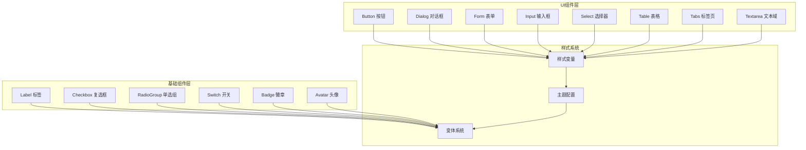
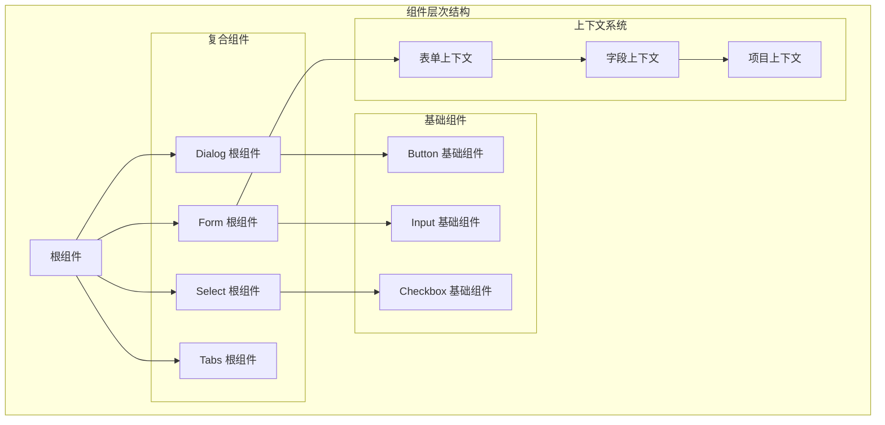
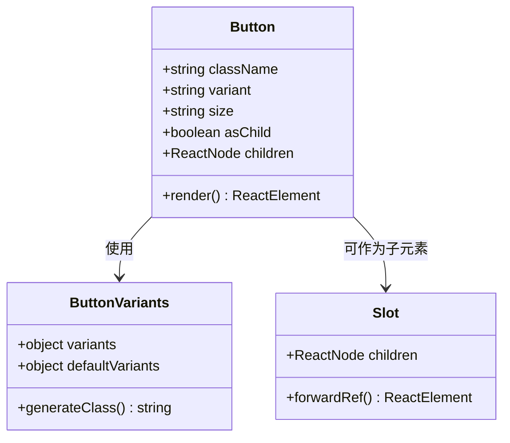
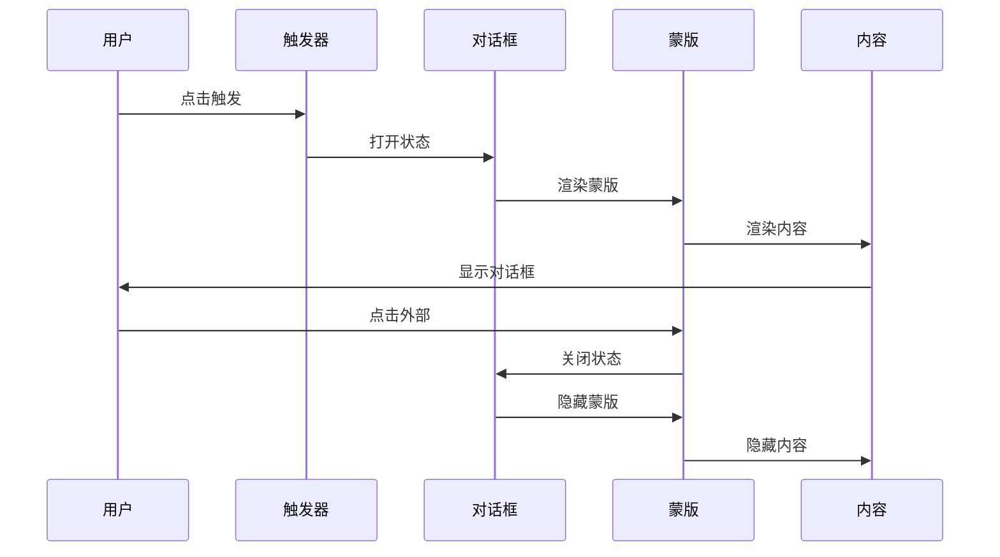
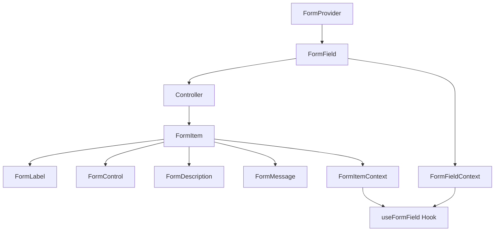
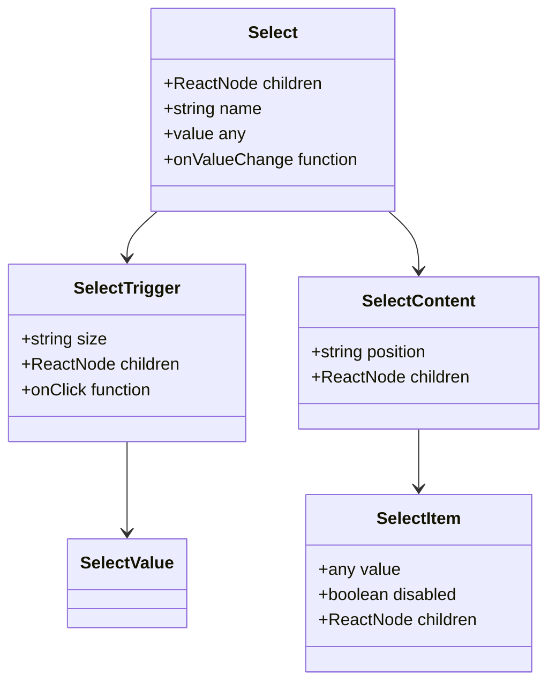

# Radix UI基础组件

<cite>
**本文档引用的文件**
- [button.tsx](file://qce-v4-tool/components/ui/button.tsx)
- [dialog.tsx](file://qce-v4-tool/components/ui/dialog.tsx)
- [form.tsx](file://qce-v4-tool/components/ui/form.tsx)
- [input.tsx](file://qce-v4-tool/components/ui/input.tsx)
- [select.tsx](file://qce-v4-tool/components/ui/select.tsx)
- [table.tsx](file://qce-v4-tool/components/ui/table.tsx)
- [tabs.tsx](file://qce-v4-tool/components/ui/tabs.tsx)
- [textarea.tsx](file://qce-v4-tool/components/ui/textarea.tsx)
- [label.tsx](file://qce-v4-tool/components/ui/label.tsx)
- [checkbox.tsx](file://qce-v4-tool/components/ui/checkbox.tsx)
- [radio-group.tsx](file://qce-v4-tool/components/ui/radio-group.tsx)
- [switch.tsx](file://qce-v4-tool/components/ui/switch.tsx)
- [badge.tsx](file://qce-v4-tool/components/ui/badge.tsx)
- [avatar.tsx](file://qce-v4-tool/components/ui/avatar.tsx)
- [globals.css](file://qce-v4-tool/styles/globals.css)
- [components.json](file://qce-v4-tool/components.json)
</cite>

## 目录
1. [简介](#简介)
2. [项目结构](#项目结构)
3. [核心组件](#核心组件)
4. [架构概览](#架构概览)
5. [详细组件分析](#详细组件分析)
6. [依赖关系分析](#依赖关系分析)
7. [性能考虑](#性能考虑)
8. [故障排除指南](#故障排除指南)
9. [结论](#结论)
10. [附录](#附录)

## 简介

本项目基于Radix UI构建了一套完整的基础UI组件库，采用现代化的React设计系统，提供了从基础按钮到复杂表单控件的完整解决方案。所有组件都遵循无障碍访问标准，支持键盘导航和屏幕阅读器兼容性。

项目采用Tailwind CSS进行样式管理，使用class-variance-authority实现变体系统，确保组件的一致性和可扩展性。组件库支持深色模式切换，具有良好的主题定制能力。

## 项目结构

项目采用按功能模块组织的结构，核心UI组件位于`qce-v4-tool/components/ui/`目录下，每个组件都是独立的模块，便于单独使用和维护。



**图表来源**
- [button.tsx](file://qce-v4-tool/components/ui/button.tsx#L1-L60)
- [dialog.tsx](file://qce-v4-tool/components/ui/dialog.tsx#L1-L107)
- [form.tsx](file://qce-v4-tool/components/ui/form.tsx#L1-L168)
- [globals.css](file://qce-v4-tool/styles/globals.css#L1-L135)

**章节来源**
- [components.json](file://qce-v4-tool/components.json#L1-L21)

## 核心组件

### 组件系统架构

项目中的UI组件主要分为两大类：**基础组件**和**复合组件**。

**基础组件**（原子级组件）：
- Button、Input、Textarea、Label
- Checkbox、RadioGroup、Switch
- Badge、Avatar

**复合组件**（分子级组件）：
- Dialog、Form、Select、Table、Tabs

每个组件都遵循统一的设计原则：
- 使用`data-slot`属性标识组件槽位
- 支持className属性进行样式覆盖
- 遵循无障碍访问标准
- 支持深色模式适配

**章节来源**
- [button.tsx](file://qce-v4-tool/components/ui/button.tsx#L38-L57)
- [input.tsx](file://qce-v4-tool/components/ui/input.tsx#L5-L19)
- [textarea.tsx](file://qce-v4-tool/components/ui/textarea.tsx#L7-L18)

## 架构概览



**图表来源**
- [dialog.tsx](file://qce-v4-tool/components/ui/dialog.tsx#L7-L9)
- [form.tsx](file://qce-v4-tool/components/ui/form.tsx#L19-L30)
- [button.tsx](file://qce-v4-tool/components/ui/button.tsx#L38-L48)

## 详细组件分析

### Button 组件

Button组件是项目中最基础的交互组件，提供了丰富的变体和尺寸选项。

#### 组件特性

**变体系统**：
- `default`: 主要操作按钮
- `destructive`: 危险操作按钮
- `outline`: 描边按钮
- `secondary`: 次要按钮
- `ghost`: 幽灵按钮
- `link`: 链接按钮

**尺寸系统**：
- `default`: 标准尺寸
- `sm`: 小尺寸
- `lg`: 大尺寸
- `icon`: 图标按钮

**样式特性**：
- 支持SVG图标自动适配
- 禁用状态自动处理
- 焦点状态视觉反馈
- 无障碍属性支持



**图表来源**
- [button.tsx](file://qce-v4-tool/components/ui/button.tsx#L7-L36)
- [button.tsx](file://qce-v4-tool/components/ui/button.tsx#L38-L57)

**章节来源**
- [button.tsx](file://qce-v4-tool/components/ui/button.tsx#L1-L60)

### Dialog 组件

Dialog组件提供了完整的模态对话框解决方案，支持全屏和普通模式。

#### 组件结构

**核心组件**：
- `Dialog`: 根组件
- `DialogTrigger`: 触发器
- `DialogClose`: 关闭按钮
- `DialogContent`: 内容容器
- `DialogHeader`: 头部区域
- `DialogFooter`: 底部区域
- `DialogTitle`: 标题
- `DialogDescription`: 描述文本

**功能特性**：
- 背景模糊效果
- 动画过渡效果
- 键盘导航支持
- 点击外部关闭
- ESC键关闭



**图表来源**
- [dialog.tsx](file://qce-v4-tool/components/ui/dialog.tsx#L13-L32)
- [dialog.tsx](file://qce-v4-tool/components/ui/dialog.tsx#L40-L73)

**章节来源**
- [dialog.tsx](file://qce-v4-tool/components/ui/dialog.tsx#L1-L107)

### Form 组件

Form组件基于React Hook Form构建，提供了完整的表单管理解决方案。

#### 表单上下文系统

**核心上下文**：
- `FormFieldContext`: 字段上下文
- `FormItemContext`: 项目上下文
- `FormContext`: 表单上下文

**组件协作**：
- `Form`: 表单根组件
- `FormField`: 字段包装器
- `FormItem`: 表单项容器
- `FormLabel`: 表单标签
- `FormControl`: 控制器
- `FormDescription`: 描述信息
- `FormMessage`: 错误消息



**图表来源**
- [form.tsx](file://qce-v4-tool/components/ui/form.tsx#L19-L30)
- [form.tsx](file://qce-v4-tool/components/ui/form.tsx#L32-L43)
- [form.tsx](file://qce-v4-tool/components/ui/form.tsx#L45-L66)

**章节来源**
- [form.tsx](file://qce-v4-tool/components/ui/form.tsx#L1-L168)

### Input 组件

Input组件提供了标准化的输入框样式，支持多种输入类型。

#### 样式特性

**焦点状态**：
- 边框高亮
- 阴影效果
- 颜色变化

**错误状态**：
- 红色边框
- 透明度调整
- 无障碍属性

**响应式设计**：
- 移动端优化
- 字体大小调整
- 内边距适配

**章节来源**
- [input.tsx](file://qce-v4-tool/components/ui/input.tsx#L1-L22)

### Select 组件

Select组件提供了增强的选择器功能，支持分组、滚动和搜索。

#### 组件层次

**基础组件**：
- `Select`: 根组件
- `SelectTrigger`: 触发器
- `SelectValue`: 值显示
- `SelectContent`: 下拉内容

**高级组件**：
- `SelectGroup`: 分组
- `SelectLabel`: 分组标签
- `SelectItem`: 选项项
- `SelectSeparator`: 分隔线
- `SelectScrollUpButton`: 向上滚动按钮
- `SelectScrollDownButton`: 向下滚动按钮



**图表来源**
- [select.tsx](file://qce-v4-tool/components/ui/select.tsx#L9-L13)
- [select.tsx](file://qce-v4-tool/components/ui/select.tsx#L27-L51)
- [select.tsx](file://qce-v4-tool/components/ui/select.tsx#L53-L86)

**章节来源**
- [select.tsx](file://qce-v4-tool/components/ui/select.tsx#L1-L186)

### Table 组件

Table组件提供了响应式的表格解决方案，支持复杂的表格布局。

#### 表格结构

**容器组件**：
- `Table`: 表格容器
- `TableHeader`: 表头区域
- `TableBody`: 表格主体
- `TableFooter`: 表尾区域

**单元组件**：
- `TableRow`: 行组件
- `TableHead`: 表头单元格
- `TableCell`: 表格单元格
- `TableCaption`: 表格标题

**特性支持**：
- 水平滚动
- 悬停效果
- 选中状态
- 响应式布局

**章节来源**
- [table.tsx](file://qce-v4-tool/components/ui/table.tsx#L1-L117)

### Tabs 组件

Tabs组件提供了标签页切换功能，支持多种布局和样式。

#### 组件结构

**核心组件**：
- `Tabs`: 根组件
- `TabsList`: 标签列表
- `TabsTrigger`: 标签触发器
- `TabsContent`: 标签内容

**样式特性**：
- 激活状态高亮
- 过渡动画
- 响应式设计
- 焦点状态

**章节来源**
- [tabs.tsx](file://qce-v4-tool/components/ui/tabs.tsx#L1-L67)

### Textarea 组件

Textarea组件提供了多行文本输入功能，支持自动调整高度。

#### 功能特性

**基础属性**：
- `minHeight`: 最小高度
- `resize`: 调整大小
- `placeholder`: 占位符文本

**样式系统**：
- 标准输入样式
- 焦点状态
- 禁用状态
- 无障碍支持

**章节来源**
- [textarea.tsx](file://qce-v4-tool/components/ui/textarea.tsx#L1-L22)

### Label 组件

Label组件提供了表单标签功能，与表单控件建立关联。

#### 无障碍特性

**关联机制**：
- `htmlFor` 属性绑定
- 自动ID生成
- 错误状态指示
- 禁用状态处理

**样式系统**：
- 字体权重
- 字体大小
- 禁用样式
- 错误样式

**章节来源**
- [label.tsx](file://qce-v4-tool/components/ui/label.tsx#L1-L21)

### Checkbox 组件

Checkbox组件提供了复选框功能，支持三态状态。

#### 状态管理

**状态属性**：
- `checked`: 已选中
- `unchecked`: 未选中
- `indeterminate`: 未确定

**视觉反馈**：
- 选中指示器
- 动画过渡
- 焦点状态
- 错误状态

**章节来源**
- [checkbox.tsx](file://qce-v4-tool/components/ui/checkbox.tsx#L1-L33)

### RadioGroup 组件

RadioGroup组件提供了单选按钮组功能。

#### 组件特性

**状态同步**：
- 组内互斥
- 值绑定
- 变更事件
- 默认值支持

**视觉设计**：
- 圆形指示器
- 颜色变化
- 尺寸适配
- 焦点状态

**章节来源**
- [radio-group.tsx](file://qce-v4-tool/components/ui/radio-group.tsx#L1-L46)

### Switch 组件

Switch组件提供了开关控件功能。

#### 交互设计

**滑动动画**：
- 平滑过渡
- 位置变化
- 颜色切换
- 状态指示

**状态管理**：
- `checked`: 开启状态
- `unchecked`: 关闭状态
- `disabled`: 禁用状态
- `onCheckedChange`: 状态变更回调

**章节来源**
- [switch.tsx](file://qce-v4-tool/components/ui/switch.tsx#L1-L29)

### Badge 组件

Badge组件提供了徽章标签功能。

#### 变体系统

**样式变体**：
- `default`: 默认样式
- `secondary`: 次要样式
- `destructive`: 危险样式
- `outline`: 描边样式

**尺寸控制**：
- 圆角设计
- 内边距调整
- 字体大小
- 边框样式

**章节来源**
- [badge.tsx](file://qce-v4-tool/components/ui/badge.tsx#L1-L30)

### Avatar 组件

Avatar组件提供了头像显示功能，支持图片加载失败回退。

#### 加载状态

**状态管理**：
- `imageLoaded`: 图片加载状态
- `setImageLoaded`: 状态更新
- 加载成功处理
- 加载失败处理

**回退机制**：
- 占位符显示
- 颜色方案
- 文字缩写
- 占位符样式

**章节来源**
- [avatar.tsx](file://qce-v4-tool/components/ui/avatar.tsx#L1-L82)

## 依赖关系分析

```mermaid
graph LR
subgraph "外部依赖"
RadixUI[@radix-ui/react-*]
Lucide[lucide-react]
ClassVariance[class-variance-authority]
Tailwind[tailwindcss]
end
subgraph "内部组件"
Button[Button]
Dialog[Dialog]
Form[Form]
Select[Select]
Table[Table]
Tabs[Tabs]
Input[Input]
Textarea[Textarea]
end
subgraph "工具函数"
Utils[cn 函数]
Hooks[自定义Hooks]
end
RadixUI --> Button
RadixUI --> Dialog
RadixUI --> Form
RadixUI --> Select
RadixUI --> Table
RadixUI --> Tabs
Lucide --> Select
Lucide --> Checkbox
Lucide --> RadioGroup
Lucide --> Switch
ClassVariance --> Button
ClassVariance --> Badge
Tailwind --> Utils
Utils --> Button
Utils --> Dialog
Utils --> Form
Utils --> Select
Utils --> Table
Utils --> Tabs
Utils --> Input
Utils --> Textarea
```

**图表来源**
- [button.tsx](file://qce-v4-tool/components/ui/button.tsx#L1-L6)
- [dialog.tsx](file://qce-v4-tool/components/ui/dialog.tsx#L3-L5)
- [form.tsx](file://qce-v4-tool/components/ui/form.tsx#L3-L17)
- [select.tsx](file://qce-v4-tool/components/ui/select.tsx#L4-L7)

**章节来源**
- [pnpm-lock.yaml](file://qce-v4-tool/pnpm-lock.yaml#L2626-L2669)

## 性能考虑

### 样式优化

**CSS变量系统**：
- 使用CSS自定义属性实现主题切换
- 减少重复样式定义
- 支持运行时主题修改
- 优化渲染性能

**Tailwind集成**：
- 原子化CSS减少打包体积
- 按需生成样式类
- 缓存机制提升构建速度
- Tree Shaking优化

### 组件性能

**懒加载策略**：
- 大型组件按需加载
- 虚拟化滚动支持
- 组件记忆化
- 事件委托优化

**内存管理**：
- 无状态组件优先
- 合理的生命周期管理
- 事件处理器缓存
- 引用优化

## 故障排除指南

### 常见问题

**样式不生效**：
1. 检查Tailwind配置是否正确
2. 确认CSS变量已定义
3. 验证组件className传递
4. 检查z-index层级

**无障碍访问问题**：
1. 确保正确的ARIA属性
2. 检查tab索引顺序
3. 验证键盘导航
4. 测试屏幕阅读器兼容性

**主题切换异常**：
1. 检查CSS变量更新
2. 验证深色模式类名
3. 确认媒体查询设置
4. 测试浏览器兼容性

### 调试技巧

**开发工具**：
- 使用React DevTools检查组件树
- 检查data-slot属性验证组件结构
- 监控事件处理器执行
- 分析渲染性能指标

**测试方法**：
- 单元测试覆盖核心逻辑
- 集成测试验证组件交互
- 无障碍测试自动化
- 跨浏览器兼容性测试

**章节来源**
- [globals.css](file://qce-v4-tool/styles/globals.css#L42-L75)

## 结论

本Radix UI基础组件库提供了完整的UI解决方案，具有以下优势：

**技术优势**：
- 基于Radix UI的可靠性和可访问性
- 现代化的React设计模式
- 完善的TypeScript支持
- 优秀的性能表现

**设计优势**：
- 一致的视觉语言
- 灵活的主题系统
- 响应式设计支持
- 无障碍访问优先

**开发优势**：
- 清晰的组件接口
- 完善的文档和示例
- 良好的扩展性
- 社区支持活跃

建议在项目中优先使用这些组件，以确保用户体验的一致性和应用的可维护性。

## 附录

### 组件使用示例

由于代码库限制，无法在此提供具体的代码示例。建议参考以下路径获取使用示例：

- [Button 组件示例](file://qce-v4-tool/components/ui/button.tsx)
- [Dialog 组件示例](file://qce-v4-tool/components/ui/dialog.tsx)
- [Form 组件示例](file://qce-v4-tool/components/ui/form.tsx)

### 主题定制指南

**CSS变量定制**：
- 修改颜色变量定义
- 调整尺寸参数
- 自定义字体设置
- 定义新的颜色方案

**组件变体扩展**：
- 添加新的变体类型
- 扩展尺寸选项
- 自定义样式规则
- 集成第三方图标库

**章节来源**
- [globals.css](file://qce-v4-tool/styles/globals.css#L6-L40)
- [components.json](file://qce-v4-tool/components.json#L3-L21)