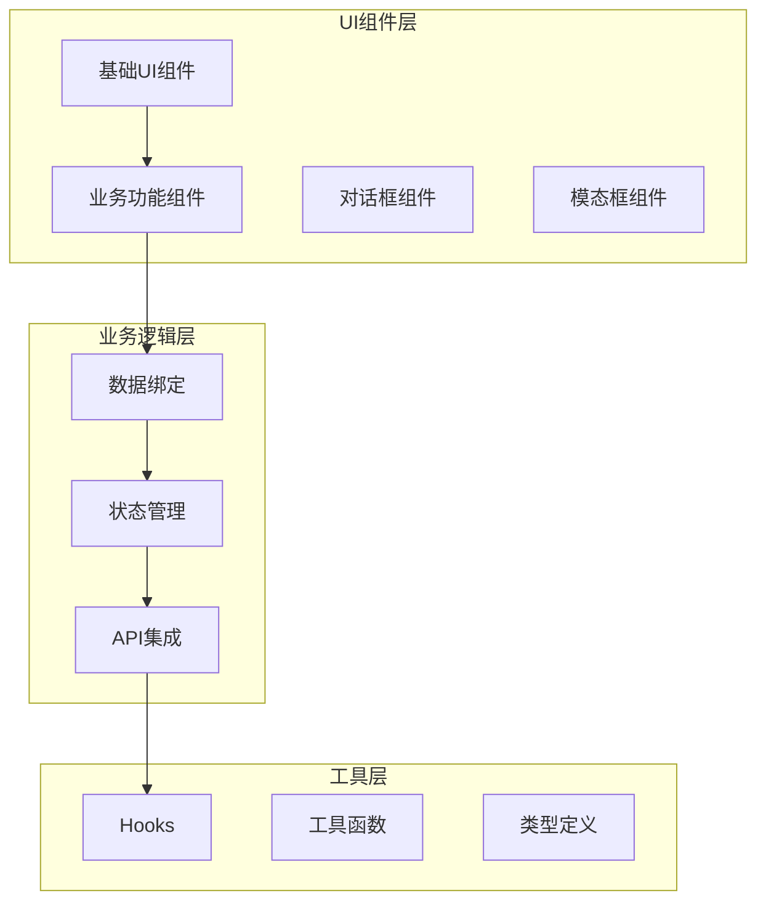
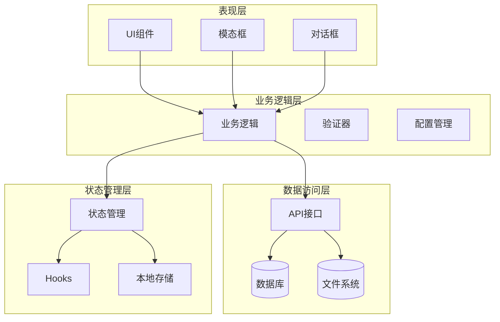
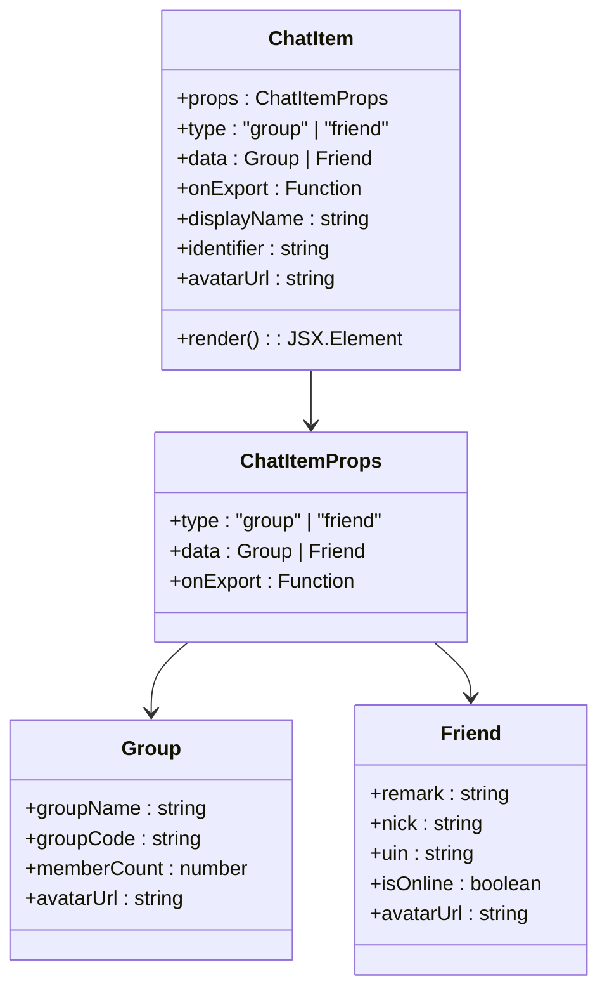
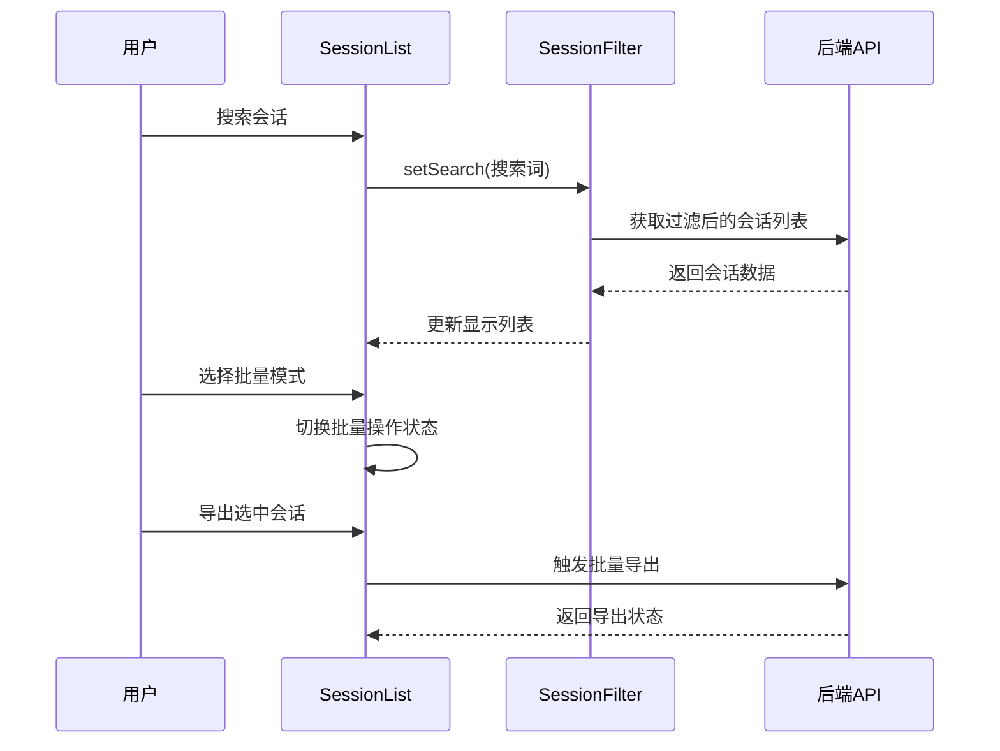
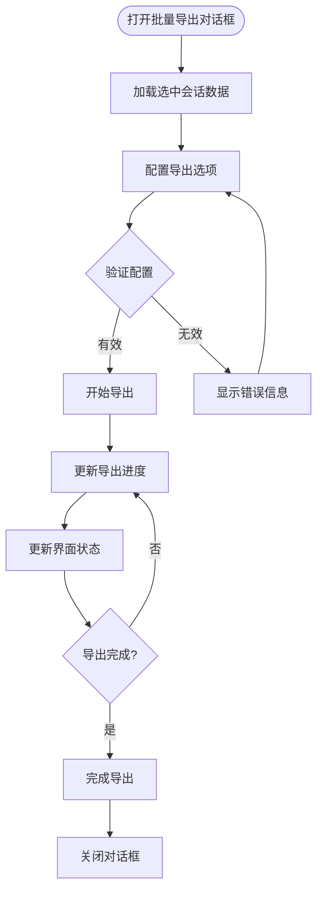
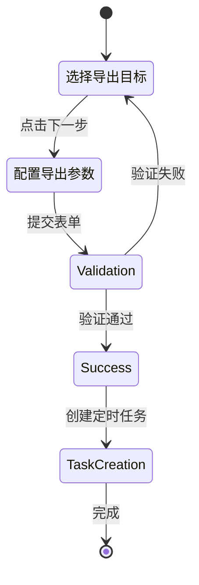
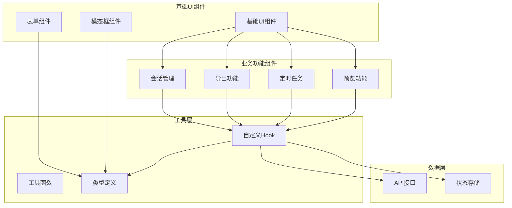

# 业务功能组件

<cite>
**本文档引用的文件**
- [chat-item.tsx](file://qce-v4-tool/components/ui/chat-item.tsx)
- [session-list.tsx](file://qce-v4-tool/components/ui/session-list.tsx)
- [batch-export-dialog.tsx](file://qce-v4-tool/components/ui/batch-export-dialog.tsx)
- [execution-history-modal.tsx](file://qce-v4-tool/components/ui/execution-history-modal.tsx)
- [group-essence-modal.tsx](file://qce-v4-tool/components/ui/group-essence-modal.tsx)
- [group-files-modal.tsx](file://qce-v4-tool/components/ui/group-files-modal.tsx)
- [message-preview-modal.tsx](file://qce-v4-tool/components/ui/message-preview-modal.tsx)
- [sticker-export-modal.tsx](file://qce-v4-tool/components/ui/sticker-export-modal.tsx)
- [merge-dialog.tsx](file://qce-v4-tool/components/ui/merge-dialog.tsx)
- [scheduled-backup-merge-dialog.tsx](file://qce-v4-tool/components/ui/scheduled-backup-merge-dialog.tsx)
- [scheduled-export-form.tsx](file://qce-v4-tool/components/ui/scheduled-export-form.tsx)
- [scheduled-export-wizard.tsx](file://qce-v4-tool/components/ui/scheduled-export-wizard.tsx)
- [task-wizard.tsx](file://qce-v4-tool/components/ui/task-wizard.tsx)
- [settings-panel.tsx](file://qce-v4-tool/components/ui/settings-panel.tsx)
</cite>

## 目录
1. [简介](#简介)
2. [项目结构](#项目结构)
3. [核心组件](#核心组件)
4. [架构概览](#架构概览)
5. [详细组件分析](#详细组件分析)
6. [依赖关系分析](#依赖关系分析)
7. [性能考虑](#性能考虑)
8. [故障排除指南](#故障排除指南)
9. [结论](#结论)

## 简介

QQ聊天导出器是一个专为QQ聊天记录导出设计的现代化Web应用。该项目采用React + Next.js技术栈构建，提供了完整的聊天记录导出、管理和分析功能。本文档深入分析了业务功能组件的设计理念、实现细节和最佳实践。

该系统的核心价值在于为用户提供直观、高效且功能丰富的聊天记录导出体验，支持多种导出格式、时间范围选择、批量操作以及定时任务管理等功能。

## 项目结构

项目采用模块化的组件架构，主要分为以下几个层次：

**图表来源**
- [session-list.tsx](file://qce-v4-tool/components/ui/session-list.tsx#L1-L580)
- [chat-item.tsx](file://qce-v4-tool/components/ui/chat-item.tsx#L1-L91)

**章节来源**
- [session-list.tsx](file://qce-v4-tool/components/ui/session-list.tsx#L1-L580)
- [chat-item.tsx](file://qce-v4-tool/components/ui/chat-item.tsx#L1-L91)

## 核心组件

### 会话展示组件

会话展示组件是整个系统的入口点，负责展示和管理用户的聊天会话。

**章节来源**
- [session-list.tsx](file://qce-v4-tool/components/ui/session-list.tsx#L69-L580)

### 批量导出组件

批量导出组件提供了强大的批量操作能力，支持多会话同时导出和复杂的导出配置。

**章节来源**
- [batch-export-dialog.tsx](file://qce-v4-tool/components/ui/batch-export-dialog.tsx#L59-L482)

### 定时任务组件

定时任务组件涵盖了从简单表单到复杂向导的完整定时导出解决方案。

**章节来源**
- [scheduled-export-form.tsx](file://qce-v4-tool/components/ui/scheduled-export-form.tsx#L48-L539)
- [scheduled-export-wizard.tsx](file://qce-v4-tool/components/ui/scheduled-export-wizard.tsx#L51-L927)

## 架构概览

系统采用分层架构设计，确保了良好的可维护性和扩展性：

**图表来源**
- [task-wizard.tsx](file://qce-v4-tool/components/ui/task-wizard.tsx#L38-L1138)
- [settings-panel.tsx](file://qce-v4-tool/components/ui/settings-panel.tsx#L12-L171)

## 详细组件分析

### ChatItem 组件分析

ChatItem组件是会话列表的基础展示单元，负责渲染单个聊天会话的信息。

**图表来源**
- [chat-item.tsx](file://qce-v4-tool/components/ui/chat-item.tsx#L10-L30)

**组件特性**：
- 支持群组和好友两种类型的会话展示
- 动态头像显示和在线状态指示
- 响应式布局适配不同屏幕尺寸
- 点击导出功能集成

**章节来源**
- [chat-item.tsx](file://qce-v4-tool/components/ui/chat-item.tsx#L16-L91)

### SessionList 组件分析

SessionList组件是会话管理的核心组件，提供了完整的会话列表展示和交互功能。

**图表来源**
- [session-list.tsx](file://qce-v4-tool/components/ui/session-list.tsx#L87-L160)

**核心功能**：
- 实时搜索和过滤会话
- 分页加载大量会话数据
- 批量选择和操作
- 键盘快捷键支持
- 动画效果增强用户体验

**章节来源**
- [session-list.tsx](file://qce-v4-tool/components/ui/session-list.tsx#L69-L580)

### BatchExportDialog 组件分析

BatchExportDialog组件提供了完整的批量导出功能，支持复杂的导出配置和进度监控。

**图表来源**
- [batch-export-dialog.tsx](file://qce-v4-tool/components/ui/batch-export-dialog.tsx#L150-L197)

**高级特性**：
- 多格式导出支持（HTML、JSON、TXT、EXCEL）
- 流式ZIP模式处理超大数据量
- 实时进度监控和状态反馈
- 智能配置默认值设置
- 错误处理和重试机制

**章节来源**
- [batch-export-dialog.tsx](file://qce-v4-tool/components/ui/batch-export-dialog.tsx#L59-L482)

### ScheduledExportWizard 组件分析

ScheduledExportWizard组件提供了完整的定时导出任务创建向导，支持批量创建多个定时任务。

**图表来源**
- [scheduled-export-wizard.tsx](file://qce-v4-tool/components/ui/scheduled-export-wizard.tsx#L184-L217)

**组件优势**：
- 分步骤向导设计提升用户体验
- 支持批量创建定时任务
- 智能预填充和默认值设置
- 实时搜索和加载机制
- 完整的表单验证和错误处理

**章节来源**
- [scheduled-export-wizard.tsx](file://qce-v4-tool/components/ui/scheduled-export-wizard.tsx#L41-L927)

### TaskWizard 组件分析

TaskWizard组件专注于单个导出任务的创建和配置，提供了详细的导出参数设置。

**章节来源**
- [task-wizard.tsx](file://qce-v4-tool/components/ui/task-wizard.tsx#L38-L1138)

### GroupEssenceModal 组件分析

GroupEssenceModal组件专门处理群组精华消息的查看和导出功能。

**章节来源**
- [group-essence-modal.tsx](file://qce-v4-tool/components/ui/group-essence-modal.tsx#L24-L292)

### GroupFilesModal 组件分析

GroupFilesModal组件提供了群组文件和相册的完整管理功能。

**章节来源**
- [group-files-modal.tsx](file://qce-v4-tool/components/ui/group-files-modal.tsx#L19-L420)

### MessagePreviewModal 组件分析

MessagePreviewModal组件实现了消息预览和搜索功能。

**章节来源**
- [message-preview-modal.tsx](file://qce-v4-tool/components/ui/message-preview-modal.tsx#L61-L468)

### StickerExportModal 组件分析

StickerExportModal组件处理表情包的导出操作。

**章节来源**
- [sticker-export-modal.tsx](file://qce-v4-tool/components/ui/sticker-export-modal.tsx#L33-L246)

### MergeDialog 组件分析

MergeDialog组件提供了备份资源的合并功能。

**章节来源**
- [merge-dialog.tsx](file://qce-v4-tool/components/ui/merge-dialog.tsx#L43-L241)

### ScheduledBackupMergeDialog 组件分析

ScheduledBackupMergeDialog组件专门处理定时备份的合并操作。

**章节来源**
- [scheduled-backup-merge-dialog.tsx](file://qce-v4-tool/components/ui/scheduled-backup-merge-dialog.tsx#L39-L372)

### ExecutionHistoryModal 组件分析

ExecutionHistoryModal组件展示了定时导出任务的执行历史。

**章节来源**
- [execution-history-modal.tsx](file://qce-v4-tool/components/ui/execution-history-modal.tsx#L24-L248)

### SettingsPanel 组件分析

SettingsPanel组件提供了系统设置和配置管理功能。

**章节来源**
- [settings-panel.tsx](file://qce-v4-tool/components/ui/settings-panel.tsx#L12-L171)

## 依赖关系分析

系统组件之间的依赖关系体现了清晰的分层架构：

**图表来源**
- [session-list.tsx](file://qce-v4-tool/components/ui/session-list.tsx#L32-L40)
- [chat-item.tsx](file://qce-v4-tool/components/ui/chat-item.tsx#L3-L8)

**章节来源**
- [session-list.tsx](file://qce-v4-tool/components/ui/session-list.tsx#L1-L580)
- [chat-item.tsx](file://qce-v4-tool/components/ui/chat-item.tsx#L1-L91)

## 性能考虑

### 数据加载优化

系统采用了多种性能优化策略：

1. **虚拟滚动**：对于大量会话数据，使用虚拟滚动减少DOM节点数量
2. **分页加载**：避免一次性加载所有数据，提升响应速度
3. **缓存机制**：合理使用React.memo和useMemo避免不必要的重渲染
4. **懒加载**：图片和媒体资源采用懒加载策略

### 状态管理

- 使用React Hooks进行状态管理，避免复杂的Redux配置
- 组件内部状态与全局状态分离，确保状态更新的精确性
- 使用useCallback优化函数传递，减少子组件重渲染

### API集成优化

- 请求去重和防抖处理
- 错误边界和降级策略
- 进度反馈和用户体验优化

## 故障排除指南

### 常见问题及解决方案

**会话列表加载失败**
- 检查网络连接和API服务状态
- 验证QQ账号登录状态
- 清除浏览器缓存后重试

**导出任务执行异常**
- 检查目标路径权限和磁盘空间
- 验证导出格式兼容性
- 查看错误日志获取详细信息

**定时任务不执行**
- 检查系统时间和时区设置
- 验证Cron表达式格式
- 确认任务状态为启用状态

**性能问题**
- 减少同时进行的导出任务数量
- 优化导出参数配置
- 升级硬件配置满足性能需求

**章节来源**
- [execution-history-modal.tsx](file://qce-v4-tool/components/ui/execution-history-modal.tsx#L41-L52)
- [batch-export-dialog.tsx](file://qce-v4-tool/components/ui/batch-export-dialog.tsx#L150-L197)

## 结论

QQ聊天导出器的业务功能组件展现了现代前端开发的最佳实践。通过精心设计的组件架构、完善的错误处理机制和优秀的用户体验设计，该系统为用户提供了强大而易用的聊天记录导出解决方案。

### 主要成就

1. **模块化设计**：清晰的组件分层和职责分离
2. **用户体验优化**：流畅的动画效果和响应式设计
3. **功能完整性**：覆盖从基础导出到高级管理的完整功能链
4. **性能优化**：多项性能优化策略确保系统稳定运行
5. **可扩展性**：灵活的架构设计支持未来功能扩展

### 技术亮点

- 采用React Hooks实现现代化状态管理
- 使用Framer Motion提供流畅的动画效果
- 实现完整的键盘快捷键支持
- 提供丰富的自定义配置选项
- 建立完善的错误处理和用户反馈机制

该系统不仅满足了当前的业务需求，更为未来的功能扩展和技术演进奠定了坚实的基础。通过持续的优化和完善，QQ聊天导出器将继续为用户提供卓越的服务体验。