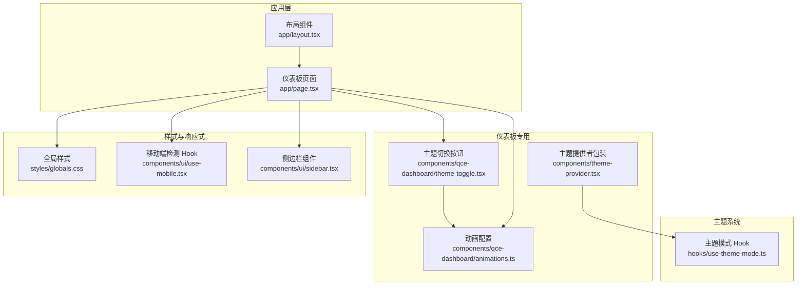
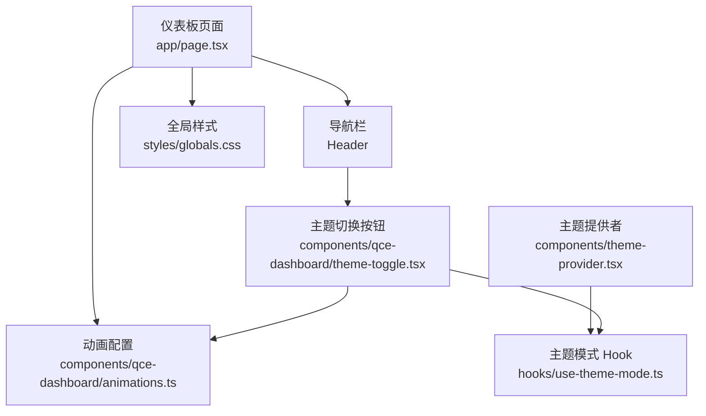
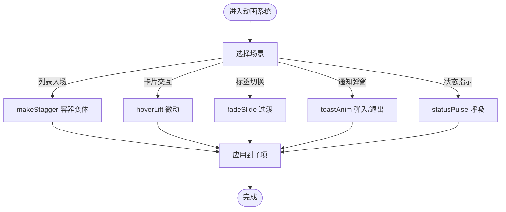
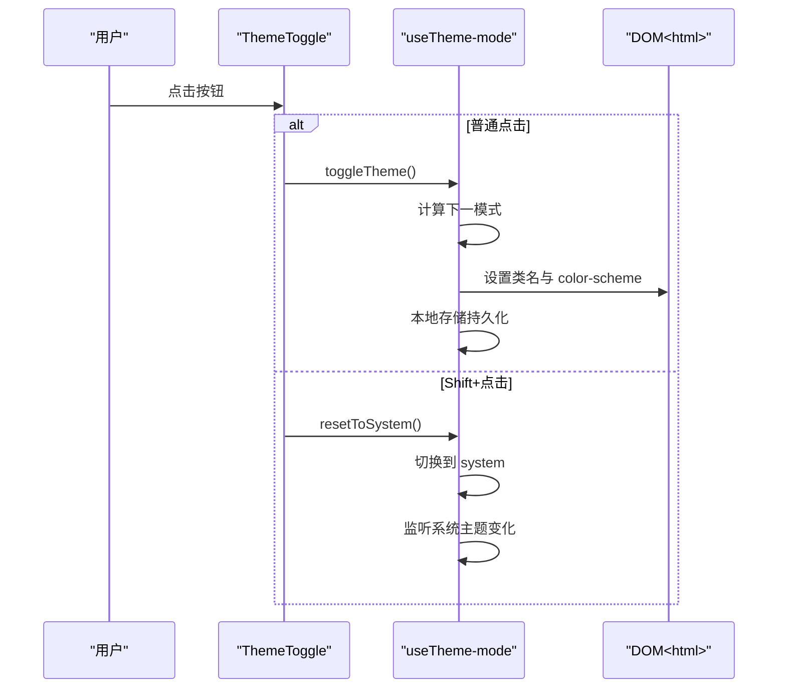
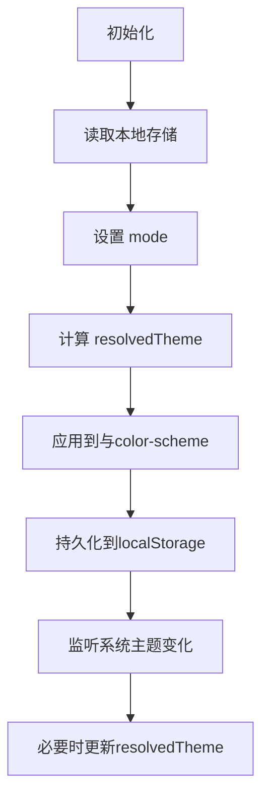
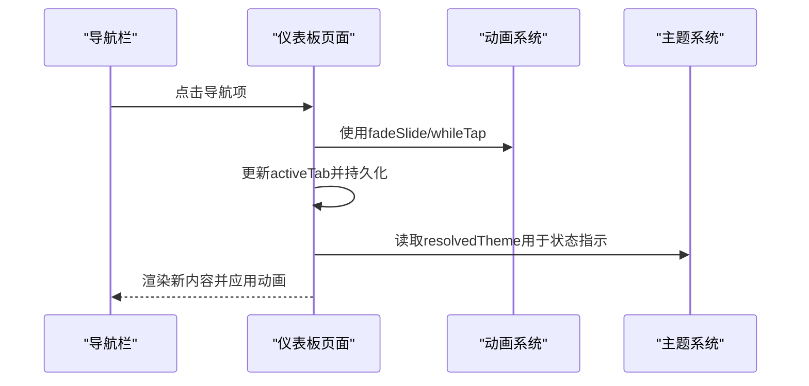
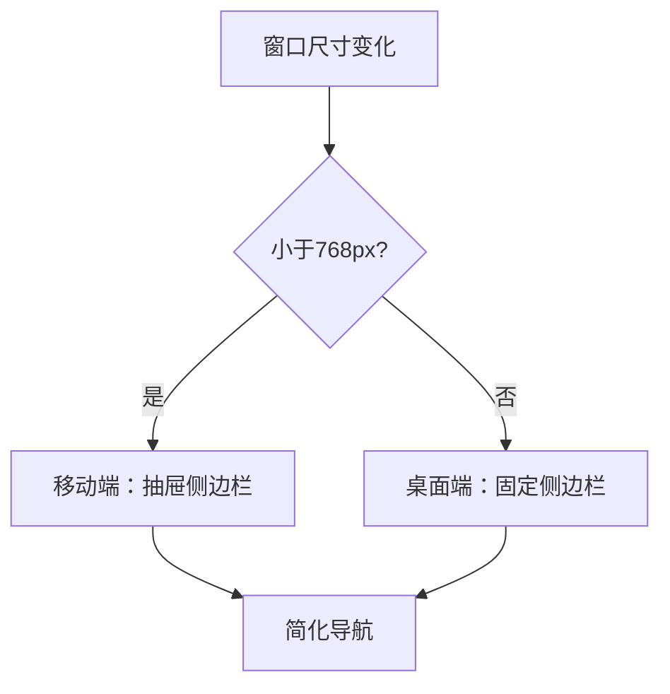
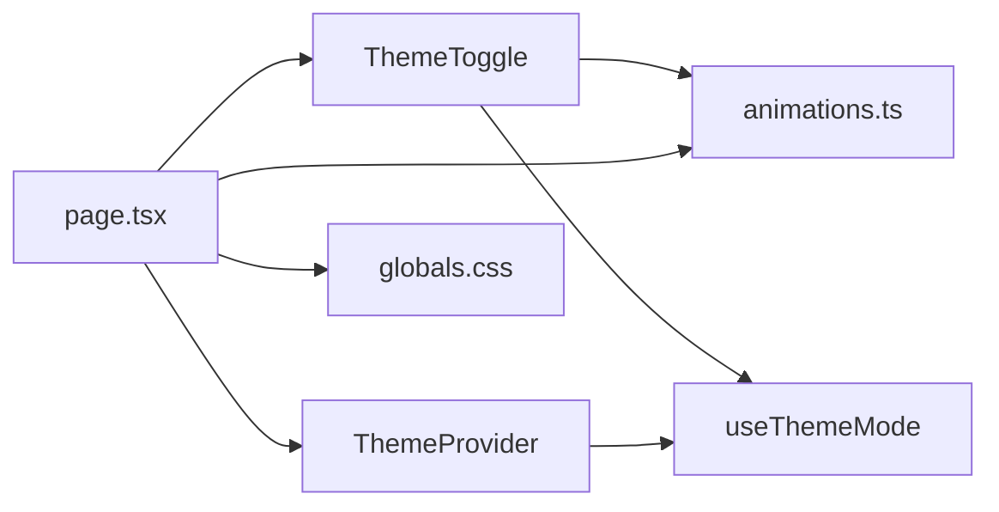

# 仪表板组件

<cite>
**本文档引用的文件**
- [animations.ts](file://qce-v4-tool/components/qce-dashboard/animations.ts)
- [theme-toggle.tsx](file://qce-v4-tool/components/qce-dashboard/theme-toggle.tsx)
- [use-theme-mode.ts](file://qce-v4-tool/hooks/use-theme-mode.ts)
- [theme-provider.tsx](file://qce-v4-tool/components/theme-provider.tsx)
- [page.tsx](file://qce-v4-tool/app/page.tsx)
- [layout.tsx](file://qce-v4-tool/app/layout.tsx)
- [globals.css](file://qce-v4-tool/styles/globals.css)
- [sidebar.tsx](file://qce-v4-tool/components/ui/sidebar.tsx)
- [use-mobile.tsx](file://qce-v4-tool/components/ui/use-mobile.tsx)
</cite>

## 目录
1. [简介](#简介)
2. [项目结构](#项目结构)
3. [核心组件](#核心组件)
4. [架构总览](#架构总览)
5. [详细组件分析](#详细组件分析)
6. [依赖关系分析](#依赖关系分析)
7. [性能考虑](#性能考虑)
8. [故障排除指南](#故障排除指南)
9. [结论](#结论)
10. [附录](#附录)

## 简介
本文件面向 QQ 聊天导出器仪表板的专用组件，重点覆盖动画系统与主题切换系统的设计与实现。内容包括：
- 动画配置与过渡效果：统一的缓动曲线、时长常量、级联动画、微动反馈与状态提示。
- 主题切换逻辑：系统/浅色/深色三种模式、用户偏好的持久化、运行时切换与系统主题监听。
- 仪表板响应式设计：移动端断点、导航与侧边栏适配、交互反馈。
- 性能优化策略：减少动画、分页加载、懒加载与内存控制。
- 用户体验增强：Toast 通知、渐进式加载、无障碍与可访问性。

## 项目结构
仪表板位于 Next.js 应用的根页面中，使用 Framer Motion 实现流畅动画，配合自定义主题 Hook 与全局样式变量实现深色/浅色主题切换。

**图表来源**
- [layout.tsx](file://qce-v4-tool/app/layout.tsx#L15-L68)
- [page.tsx](file://qce-v4-tool/app/page.tsx#L74-L1599)
- [animations.ts](file://qce-v4-tool/components/qce-dashboard/animations.ts#L1-L59)
- [theme-toggle.tsx](file://qce-v4-tool/components/qce-dashboard/theme-toggle.tsx#L9-L36)
- [theme-provider.tsx](file://qce-v4-tool/components/theme-provider.tsx#L9-L11)
- [use-theme-mode.ts](file://qce-v4-tool/hooks/use-theme-mode.ts#L24-L110)
- [globals.css](file://qce-v4-tool/styles/globals.css#L1-L135)
- [use-mobile.tsx](file://qce-v4-tool/components/ui/use-mobile.tsx#L1-L20)
- [sidebar.tsx](file://qce-v4-tool/components/ui/sidebar.tsx#L154-L254)

**章节来源**
- [layout.tsx](file://qce-v4-tool/app/layout.tsx#L15-L68)
- [page.tsx](file://qce-v4-tool/app/page.tsx#L74-L1599)

## 核心组件
- 动画系统（animations.ts）
  - 缓动曲线常量：标准 in-out、快速出、轻柔入。
  - 时长常量：快速、正常、缓慢。
  - 级联容器与子项：支持延迟与 beforeChildren 控制，适合列表入场。
  - 微动反馈：卡片悬停上浮与按压缩放。
  - 通用淡入淡出：用于标签页切换。
  - Toast 弹入与退出。
  - 状态点呼吸：无限重复的缩放动画。
- 主题切换组件（theme-toggle.tsx）
  - 基于 useThemeMode 的模式与解析主题状态。
  - 支持 Shift 点击恢复系统模式。
  - 图标随模式动态切换。
- 主题模式 Hook（use-theme-mode.ts）
  - 三态模式：system/light/dark。
  - 解析主题：根据系统偏好或显式模式。
  - DOM 类与 color-scheme 应用。
  - 本地存储持久化。
  - 系统主题变更监听与实时同步。
- 主题提供者（theme-provider.tsx）
  - 包装 next-themes 提供者，统一主题上下文。
- 全局样式（globals.css）
  - OKLCH 颜色变量与深色变体。
  - Tailwind 与动画层叠。
- 响应式与导航（use-mobile.tsx、sidebar.tsx、page.tsx）
  - 移动端断点与导航行为。
  - 侧边栏在移动端的抽屉式交互。
  - 页面内动画与过渡。

**章节来源**
- [animations.ts](file://qce-v4-tool/components/qce-dashboard/animations.ts#L1-L59)
- [theme-toggle.tsx](file://qce-v4-tool/components/qce-dashboard/theme-toggle.tsx#L9-L36)
- [use-theme-mode.ts](file://qce-v4-tool/hooks/use-theme-mode.ts#L24-L110)
- [theme-provider.tsx](file://qce-v4-tool/components/theme-provider.tsx#L9-L11)
- [globals.css](file://qce-v4-tool/styles/globals.css#L1-L135)
- [use-mobile.tsx](file://qce-v4-tool/components/ui/use-mobile.tsx#L1-L20)
- [sidebar.tsx](file://qce-v4-tool/components/ui/sidebar.tsx#L154-L254)
- [page.tsx](file://qce-v4-tool/app/page.tsx#L74-L1599)

## 架构总览
仪表板采用“页面容器 + 专用组件 + 主题系统 + 动画系统”的分层架构。页面负责状态管理与业务流程，专用组件封装交互细节，主题系统提供跨组件的一致外观，动画系统统一视觉反馈节奏。

**图表来源**
- [page.tsx](file://qce-v4-tool/app/page.tsx#L920-L994)
- [theme-toggle.tsx](file://qce-v4-tool/components/qce-dashboard/theme-toggle.tsx#L9-L36)
- [animations.ts](file://qce-v4-tool/components/qce-dashboard/animations.ts#L1-L59)
- [theme-provider.tsx](file://qce-v4-tool/components/theme-provider.tsx#L9-L11)
- [use-theme-mode.ts](file://qce-v4-tool/hooks/use-theme-mode.ts#L24-L110)
- [globals.css](file://qce-v4-tool/styles/globals.css#L1-L135)

## 详细组件分析

### 动画系统（animations.ts）
- 设计目标
  - 统一的缓动与时长，确保交互节奏一致。
  - 针对不同场景的变体：级联列表、卡片微动、标签页切换、Toast、状态指示。
- 关键配置
  - EASE：inOut、out、in 三类常用缓动。
  - DUR：fast、normal、slow 三档时长。
  - makeStagger：容器与子项的变体，支持延迟与 beforeChildren。
  - hoverLift：卡片悬停上浮与按压缩放。
  - fadeSlide：标签页切换的淡入淡出。
  - toastAnim：Toast 的弹入与退出。
  - statusPulse：状态点呼吸动画。
- 使用示例（来自页面）
  - 导航栏与内容区使用统一的动画变体。
  - 列表项使用 makeStagger 容器与 item 子项变体。
  - 状态指示器使用 statusPulse。
  - Toast 使用 toastAnim。

**图表来源**
- [animations.ts](file://qce-v4-tool/components/qce-dashboard/animations.ts#L17-L30)
- [animations.ts](file://qce-v4-tool/components/qce-dashboard/animations.ts#L33-L36)
- [animations.ts](file://qce-v4-tool/components/qce-dashboard/animations.ts#L39-L43)
- [animations.ts](file://qce-v4-tool/components/qce-dashboard/animations.ts#L46-L50)
- [animations.ts](file://qce-v4-tool/components/qce-dashboard/animations.ts#L53-L58)

**章节来源**
- [animations.ts](file://qce-v4-tool/components/qce-dashboard/animations.ts#L1-L59)
- [page.tsx](file://qce-v4-tool/app/page.tsx#L1166-L1599)

### 主题切换组件（theme-toggle.tsx）
- 功能特性
  - 读取 useThemeMode 返回的 mode/resolvedTheme/toggle/resetToSystem。
  - 根据当前模式动态选择图标（Monitor/Moon/Sun）。
  - 支持普通点击切换深浅，Shift 点击恢复系统模式。
  - 使用 whileTap 实现按压反馈，结合 DUR/EASE 常量保证一致性。
- 交互流程

**图表来源**
- [theme-toggle.tsx](file://qce-v4-tool/components/qce-dashboard/theme-toggle.tsx#L9-L36)
- [use-theme-mode.ts](file://qce-v4-tool/hooks/use-theme-mode.ts#L81-L95)
- [use-theme-mode.ts](file://qce-v4-tool/hooks/use-theme-mode.ts#L42-L49)
- [use-theme-mode.ts](file://qce-v4-tool/hooks/use-theme-mode.ts#L51-L79)

**章节来源**
- [theme-toggle.tsx](file://qce-v4-tool/components/qce-dashboard/theme-toggle.tsx#L9-L36)
- [use-theme-mode.ts](file://qce-v4-tool/hooks/use-theme-mode.ts#L24-L110)

### 主题模式 Hook（use-theme-mode.ts）
- 数据模型
  - ThemeMode：system | light | dark
  - ResolvedTheme：light | dark
- 生命周期
  - 初始化：从 localStorage 读取模式，无则默认 system。
  - 模式变化：计算 resolvedTheme，应用到 <html> 类名与 color-scheme，写入 localStorage。
  - 系统模式：监听系统偏好变化，实时更新 resolvedTheme。
- 关键函数
  - setThemeMode：设置模式（内部使用 ref 保持最新值）。
  - toggleTheme：在 resolvedTheme 上深浅切换。
  - resetToSystem：回到 system 模式。
  - isDark：便捷判断。

**图表来源**
- [use-theme-mode.ts](file://qce-v4-tool/hooks/use-theme-mode.ts#L32-L40)
- [use-theme-mode.ts](file://qce-v4-tool/hooks/use-theme-mode.ts#L42-L49)
- [use-theme-mode.ts](file://qce-v4-tool/hooks/use-theme-mode.ts#L51-L79)

**章节来源**
- [use-theme-mode.ts](file://qce-v4-tool/hooks/use-theme-mode.ts#L24-L110)

### 页面中的动画与主题集成（page.tsx）
- 导航栏与内容区
  - 使用统一的动画变体实现进入/离开过渡。
  - 导航按钮使用 whileTap 微动反馈。
- 列表级联动画
  - 根据 reduceMotion 与列表大小动态调整 stagger 延迟，避免大列表卡顿。
- 状态指示器
  - 使用 statusPulse 实现呼吸动画。
- Toast 通知
  - 使用 toastAnim 实现弹入/退出，支持多条叠加与层级定位。
- 主题切换
  - 在导航右侧集成 ThemeToggle，图标与标题动态反映当前模式。

**图表来源**
- [page.tsx](file://qce-v4-tool/app/page.tsx#L920-L994)
- [page.tsx](file://qce-v4-tool/app/page.tsx#L1166-L1599)
- [animations.ts](file://qce-v4-tool/components/qce-dashboard/animations.ts#L39-L43)
- [animations.ts](file://qce-v4-tool/components/qce-dashboard/animations.ts#L53-L58)

**章节来源**
- [page.tsx](file://qce-v4-tool/app/page.tsx#L74-L1599)

### 响应式设计与导航
- 移动端断点
  - 使用 768px 作为断点，移动端使用抽屉式侧边栏与简化导航。
- 侧边栏行为
  - 支持键盘快捷键、Cookie 记忆展开/收起状态。
  - 移动端通过抽屉展示，桌面端固定侧边栏。
- 导航与头部
  - 头部固定，包含导航按钮与主题切换，使用统一动画变体。

**图表来源**
- [use-mobile.tsx](file://qce-v4-tool/components/ui/use-mobile.tsx#L1-L20)
- [sidebar.tsx](file://qce-v4-tool/components/ui/sidebar.tsx#L166-L254)
- [page.tsx](file://qce-v4-tool/app/page.tsx#L920-L994)

**章节来源**
- [use-mobile.tsx](file://qce-v4-tool/components/ui/use-mobile.tsx#L1-L20)
- [sidebar.tsx](file://qce-v4-tool/components/ui/sidebar.tsx#L154-L254)
- [page.tsx](file://qce-v4-tool/app/page.tsx#L920-L994)

## 依赖关系分析
- 组件耦合
  - ThemeToggle 依赖 useThemeMode 与动画常量。
  - 页面依赖动画系统与主题系统，同时消费大量业务 Hook。
- 外部依赖
  - Framer Motion：提供动画与过渡能力。
  - next-themes：提供主题提供者与 SSR 支持。
  - Tailwind CSS：提供原子化样式与颜色变量。
- 潜在循环依赖
  - 无直接循环，主题系统通过 DOM 操作影响全局样式，属于副作用而非导入循环。

**图表来源**
- [theme-toggle.tsx](file://qce-v4-tool/components/qce-dashboard/theme-toggle.tsx#L6-L7)
- [use-theme-mode.ts](file://qce-v4-tool/hooks/use-theme-mode.ts#L24-L110)
- [animations.ts](file://qce-v4-tool/components/qce-dashboard/animations.ts#L1-L59)
- [page.tsx](file://qce-v4-tool/app/page.tsx#L74-L1599)
- [theme-provider.tsx](file://qce-v4-tool/components/theme-provider.tsx#L9-L11)
- [globals.css](file://qce-v4-tool/styles/globals.css#L1-L135)

**章节来源**
- [theme-toggle.tsx](file://qce-v4-tool/components/qce-dashboard/theme-toggle.tsx#L6-L7)
- [use-theme-mode.ts](file://qce-v4-tool/hooks/use-theme-mode.ts#L24-L110)
- [animations.ts](file://qce-v4-tool/components/qce-dashboard/animations.ts#L1-L59)
- [page.tsx](file://qce-v4-tool/app/page.tsx#L74-L1599)
- [theme-provider.tsx](file://qce-v4-tool/components/theme-provider.tsx#L9-L11)
- [globals.css](file://qce-v4-tool/styles/globals.css#L1-L135)

## 性能考虑
- 动画降级
  - 使用 useReducedMotion 自动检测系统偏好，大列表禁用 stagger，避免卡顿。
- 列表优化
  - 大于阈值的列表禁用级联延迟，降低渲染压力。
- 本地存储与 SSR
  - 布局脚本预设深色类名，减少 Hydration 抖动。
- 资源加载
  - 仅在激活标签页时加载对应数据，避免一次性渲染过多内容。
- 通知与 Toast
  - 使用 AnimatePresence 管理挂载/卸载，避免残留节点。

**章节来源**
- [page.tsx](file://qce-v4-tool/app/page.tsx#L155-L157)
- [page.tsx](file://qce-v4-tool/app/page.tsx#L916-L918)
- [layout.tsx](file://qce-v4-tool/app/layout.tsx#L23-L36)

## 故障排除指南
- 主题不生效
  - 检查 <html> 是否存在 dark 类名；确认 color-scheme 是否正确设置。
  - 确认 localStorage 中的 qce-theme-mode 值是否被意外修改。
- 系统主题未同步
  - 确认浏览器媒体查询监听是否可用；检查回调是否被移除。
- 动画异常
  - 检查 reduceMotion 是否启用；确认大列表是否禁用了 stagger。
  - 确认 Framer Motion 版本与配置兼容。
- 移动端交互问题
  - 确认抽屉式侧边栏是否正确绑定事件；检查断点逻辑。

**章节来源**
- [use-theme-mode.ts](file://qce-v4-tool/hooks/use-theme-mode.ts#L16-L22)
- [use-theme-mode.ts](file://qce-v4-tool/hooks/use-theme-mode.ts#L51-L79)
- [sidebar.tsx](file://qce-v4-tool/components/ui/sidebar.tsx#L96-L110)
- [page.tsx](file://qce-v4-tool/app/page.tsx#L916-L918)

## 结论
仪表板组件通过统一的动画系统与主题系统，实现了高一致性与良好用户体验。动画配置模块化、主题切换逻辑清晰、响应式设计完善，并辅以性能优化策略。建议在扩展新场景时复用现有动画变体与主题 Hook，保持整体风格统一。

## 附录
- 自定义动画配置
  - 在 animations.ts 中新增变体时，遵循 EASE/DUR 常量命名规范，确保与现有组件一致。
  - 对于大列表场景，优先考虑禁用 stagger 或增大延迟以平衡流畅度与性能。
- 主题系统扩展
  - 新增模式需在 ThemeMode 类型中声明，并在 useThemeMode 中处理解析与持久化。
  - 如需支持更多图标或文案，可在 ThemeToggle 中扩展条件分支。
- 响应式最佳实践
  - 使用统一断点常量，避免硬编码。
  - 移动端优先考虑触摸可达性与手势交互。