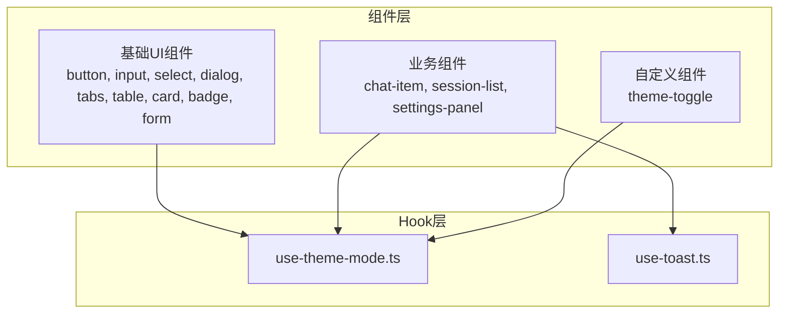
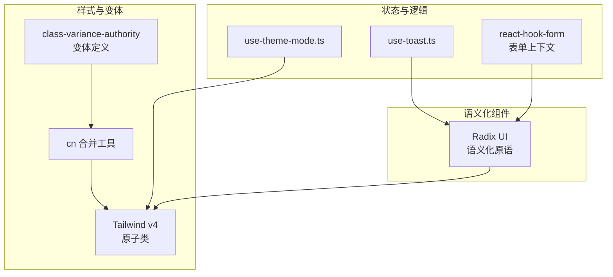
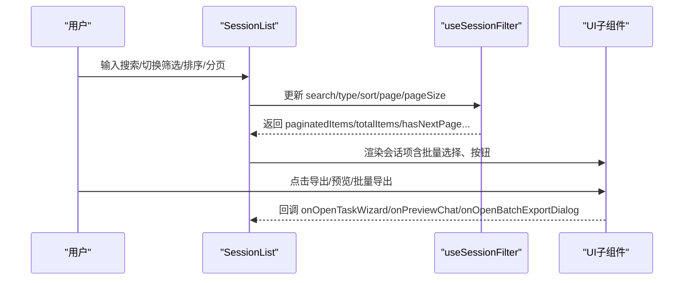
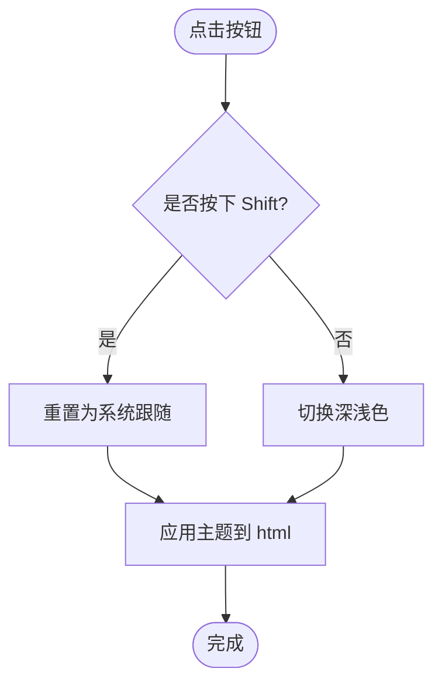
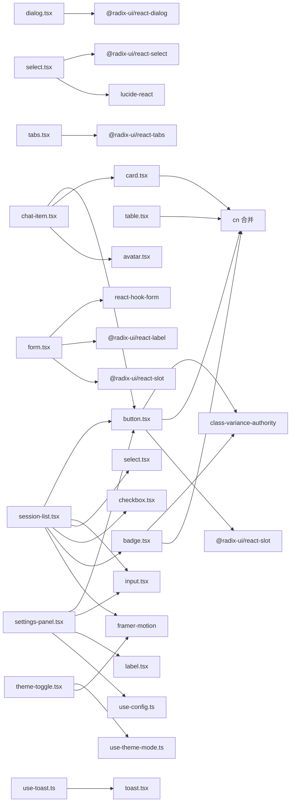

# 组件库系统

<cite>
**本文引用的文件**
- [package.json](file://qce-v4-tool/package.json)
- [button.tsx](file://qce-v4-tool/components/ui/button.tsx)
- [dialog.tsx](file://qce-v4-tool/components/ui/dialog.tsx)
- [form.tsx](file://qce-v4-tool/components/ui/form.tsx)
- [input.tsx](file://qce-v4-tool/components/ui/input.tsx)
- [select.tsx](file://qce-v4-tool/components/ui/select.tsx)
- [tabs.tsx](file://qce-v4-tool/components/ui/tabs.tsx)
- [table.tsx](file://qce-v4-tool/components/ui/table.tsx)
- [card.tsx](file://qce-v4-tool/components/ui/card.tsx)
- [badge.tsx](file://qce-v4-tool/components/ui/badge.tsx)
- [chat-item.tsx](file://qce-v4-tool/components/ui/chat-item.tsx)
- [session-list.tsx](file://qce-v4-tool/components/ui/session-list.tsx)
- [settings-panel.tsx](file://qce-v4-tool/components/ui/settings-panel.tsx)
- [theme-toggle.tsx](file://qce-v4-tool/components/qce-dashboard/theme-toggle.tsx)
- [use-theme-mode.ts](file://qce-v4-tool/hooks/use-theme-mode.ts)
- [use-toast.ts](file://qce-v4-tool/hooks/use-toast.ts)
</cite>

## 目录
1. [简介](#简介)
2. [项目结构](#项目结构)
3. [核心组件](#核心组件)
4. [架构总览](#架构总览)
5. [组件详解](#组件详解)
6. [依赖关系分析](#依赖关系分析)
7. [性能与可访问性](#性能与可访问性)
8. [故障排查指南](#故障排查指南)
9. [结论](#结论)
10. [附录](#附录)

## 简介
本组件库系统基于 Radix UI 和 Tailwind CSS 构建，覆盖基础 UI 组件、业务组件与自定义组件三类。系统通过 Variants（变体）与 Tailwind 类合并工具实现一致的样式体系；通过 React Hooks 提供状态管理与交互能力；通过 Radix UI 的语义化组件确保可访问性与跨浏览器一致性。本文档面向开发者与产品同学，系统讲解组件分类、功能特性、属性配置、事件处理、样式定制、状态管理、Hook 使用、组件通信、响应式设计、无障碍支持与性能优化。

## 项目结构
- 组件层位于 qce-v4-tool/components/ui，采用“基础组件 + 业务组件 + 自定义组件”的分层组织。
- Hook 层位于 qce-v4-tool/hooks，封装主题、通知、表单、会话过滤等横切能力。
- 样式与主题通过 Tailwind v4 与 next-themes 实现暗色模式与系统跟随策略。
- 基础依赖来自 Radix UI 各生态包与 Tailwind 生态，保证组件行为与视觉的一致性。

**图表来源**
- [button.tsx](file://qce-v4-tool/components/ui/button.tsx#L1-L60)
- [dialog.tsx](file://qce-v4-tool/components/ui/dialog.tsx#L1-L107)
- [form.tsx](file://qce-v4-tool/components/ui/form.tsx#L1-L168)
- [input.tsx](file://qce-v4-tool/components/ui/input.tsx#L1-L22)
- [select.tsx](file://qce-v4-tool/components/ui/select.tsx#L1-L186)
- [tabs.tsx](file://qce-v4-tool/components/ui/tabs.tsx#L1-L67)
- [table.tsx](file://qce-v4-tool/components/ui/table.tsx#L1-L117)
- [card.tsx](file://qce-v4-tool/components/ui/card.tsx#L1-L93)
- [badge.tsx](file://qce-v4-tool/components/ui/badge.tsx#L1-L30)
- [chat-item.tsx](file://qce-v4-tool/components/ui/chat-item.tsx#L1-L91)
- [session-list.tsx](file://qce-v4-tool/components/ui/session-list.tsx#L1-L580)
- [settings-panel.tsx](file://qce-v4-tool/components/ui/settings-panel.tsx#L1-L171)
- [theme-toggle.tsx](file://qce-v4-tool/components/qce-dashboard/theme-toggle.tsx#L1-L37)
- [use-theme-mode.ts](file://qce-v4-tool/hooks/use-theme-mode.ts#L1-L111)
- [use-toast.ts](file://qce-v4-tool/hooks/use-toast.ts#L1-L195)

**章节来源**
- [package.json](file://qce-v4-tool/package.json#L12-L73)

## 核心组件
- 基础 UI 组件：按钮、输入框、选择器、对话框、标签页、表格、卡片、徽标、表单容器与字段。
- 业务组件：会话项、会话列表、设置面板。
- 自定义组件：主题切换器。
- Hook：主题模式、通知提示。

这些组件共同构成“样式变体 + 语义化组件 + 状态 Hook”的统一设计语言。

**章节来源**
- [button.tsx](file://qce-v4-tool/components/ui/button.tsx#L1-L60)
- [input.tsx](file://qce-v4-tool/components/ui/input.tsx#L1-L22)
- [select.tsx](file://qce-v4-tool/components/ui/select.tsx#L1-L186)
- [dialog.tsx](file://qce-v4-tool/components/ui/dialog.tsx#L1-L107)
- [tabs.tsx](file://qce-v4-tool/components/ui/tabs.tsx#L1-L67)
- [table.tsx](file://qce-v4-tool/components/ui/table.tsx#L1-L117)
- [card.tsx](file://qce-v4-tool/components/ui/card.tsx#L1-L93)
- [badge.tsx](file://qce-v4-tool/components/ui/badge.tsx#L1-L30)
- [form.tsx](file://qce-v4-tool/components/ui/form.tsx#L1-L168)
- [chat-item.tsx](file://qce-v4-tool/components/ui/chat-item.tsx#L1-L91)
- [session-list.tsx](file://qce-v4-tool/components/ui/session-list.tsx#L1-L580)
- [settings-panel.tsx](file://qce-v4-tool/components/ui/settings-panel.tsx#L1-L171)
- [theme-toggle.tsx](file://qce-v4-tool/components/qce-dashboard/theme-toggle.tsx#L1-L37)
- [use-theme-mode.ts](file://qce-v4-tool/hooks/use-theme-mode.ts#L1-L111)
- [use-toast.ts](file://qce-v4-tool/hooks/use-toast.ts#L1-L195)

## 架构总览
组件库以“变体 + 语义 + Hook”为核心：
- 变体：通过 class-variance-authority 定义组件的 variant/size 等变体，结合 cn 合并 Tailwind 类，实现一致的外观与交互。
- 语义：基于 Radix UI 的语义化组件，确保键盘导航、焦点管理、ARIA 属性与可访问性。
- Hook：集中处理主题、通知、表单状态、业务过滤等逻辑，降低组件复杂度。

**图表来源**
- [button.tsx](file://qce-v4-tool/components/ui/button.tsx#L7-L36)
- [dialog.tsx](file://qce-v4-tool/components/ui/dialog.tsx#L13-L32)
- [form.tsx](file://qce-v4-tool/components/ui/form.tsx#L1-L168)
- [use-theme-mode.ts](file://qce-v4-tool/hooks/use-theme-mode.ts#L24-L49)
- [use-toast.ts](file://qce-v4-tool/hooks/use-toast.ts#L1-L195)

## 组件详解

### 基础 UI 组件

#### 按钮 Button
- 功能特性
  - 支持多种变体（默认、破坏性、描边、次级、幽灵、链接）与尺寸（默认、小、大、图标）。
  - 支持 asChild（Slot）以复用父级元素语义。
  - 内嵌 SVG 自动适配尺寸与指针事件。
  - 键盘焦点与可访问性增强（边框环、无效态边框）。
- 属性配置
  - className：追加样式
  - variant：变体
  - size：尺寸
  - asChild：是否渲染为子节点
  - 其余透传至原生 button
- 事件处理
  - onClick 等标准事件透传
- 样式定制
  - 通过 variant/size 与 className 组合，利用 cn 合并 Tailwind 类
- 可访问性
  - 自带 focus-visible 边框与 ring 效果，支持 aria-invalid

**章节来源**
- [button.tsx](file://qce-v4-tool/components/ui/button.tsx#L1-L60)

#### 输入框 Input
- 功能特性
  - 统一的边框、圆角、阴影与聚焦态样式
  - 支持 invalid 态与选择态高亮
- 属性配置
  - className：追加样式
  - type：原生 input 类型
  - 其余透传至原生 input
- 事件处理
  - onChange/onClick 等原生事件透传

**章节来源**
- [input.tsx](file://qce-v4-tool/components/ui/input.tsx#L1-L22)

#### 选择器 Select
- 功能特性
  - 触发器、内容区、项、分隔符、滚动按钮、图标等完整子组件
  - 支持大小（sm/default）、占位文本、多选指示器
  - Portal 渲染，避免溢出遮挡
- 属性配置
  - SelectTrigger：size、className
  - SelectContent：position、className
  - SelectItem：className
  - SelectScrollUpButton/Down：className
- 事件处理
  - onValueChange 等由根组件透传

**章节来源**
- [select.tsx](file://qce-v4-tool/components/ui/select.tsx#L1-L186)

#### 对话框 Dialog
- 功能特性
  - Overlay 支持模糊背景与动画
  - 支持全屏模式与居中布局
  - 头尾部与标题描述子组件
- 属性配置
  - DialogOverlay：overlayClassName
  - DialogContent：fullScreen、className
  - DialogHeader/DialogFooter：className
  - DialogTitle/DialogDescription：className
- 事件处理
  - DialogTrigger/DialogClose 作为触发与关闭入口

**章节来源**
- [dialog.tsx](file://qce-v4-tool/components/ui/dialog.tsx#L1-L107)

#### 标签页 Tabs
- 功能特性
  - 根容器、列表、触发器、内容区
  - 触发器支持 active 态与聚焦环
- 属性配置
  - Tabs/TabsList/TabsTrigger/TabsContent：className

**章节来源**
- [tabs.tsx](file://qce-v4-tool/components/ui/tabs.tsx#L1-L67)

#### 表格 Table
- 功能特性
  - 容器自动横向滚动，表头/体/脚/行/单元格/标题/描述完整封装
  - 支持 hover 与选中态
- 属性配置
  - Table/TableHeader/TableBody/TableFooter/TableRow/TableCell/TableCaption：className

**章节来源**
- [table.tsx](file://qce-v4-tool/components/ui/table.tsx#L1-L117)

#### 卡片 Card
- 功能特性
  - 标题、描述、操作、内容、底部区域
  - 响应式网格布局与动作区定位
- 属性配置
  - Card/CardHeader/CardTitle/CardDescription/CardAction/CardContent/CardFooter：className

**章节来源**
- [card.tsx](file://qce-v4-tool/components/ui/card.tsx#L1-L93)

#### 徽标 Badge
- 功能特性
  - 支持多种变体（默认、次级、破坏、描边）
- 属性配置
  - variant：变体
  - className：追加样式

**章节来源**
- [badge.tsx](file://qce-v4-tool/components/ui/badge.tsx#L1-L30)

#### 表单 Form
- 功能特性
  - FormProvider、FormField、FormLabel、FormControl、FormDescription、FormMessage
  - useFormField 获取字段状态与 ARIA 属性
  - 与 react-hook-form 深度集成
- 属性配置
  - FormField：ControllerProps
  - FormLabel/FormControl/FormDescription/FormMessage：className
- 事件处理
  - 通过 react-hook-form 上下文传递

**章节来源**
- [form.tsx](file://qce-v4-tool/components/ui/form.tsx#L1-L168)

### 业务组件

#### 会话项 ChatItem
- 功能特性
  - 支持群组与好友两种类型
  - 头像、名称、标识、在线状态、导出按钮
- 属性配置
  - type：'group' | 'friend'
  - data：Group | Friend
  - onExport：导出回调
- 事件处理
  - Button onClick 触发导出

**章节来源**
- [chat-item.tsx](file://qce-v4-tool/components/ui/chat-item.tsx#L1-L91)

#### 会话列表 SessionList
- 功能特性
  - 搜索、筛选、排序、分页、批量选择、键盘快捷键、动画过渡
  - 支持预览、导出、头像导出、精华、文件等业务操作
- 属性配置
  - groups/friends：数据源
  - isLoading/batchMode/selectedItems/avatarExportLoading：状态
  - 各种回调：onRefresh/onToggleBatchMode/onSelectAll/onClearSelection/onToggleItem/onOpenBatchExportDialog/onPreviewChat/onOpenTaskWizard/onExportGroupAvatars/onOpenEssenceModal/onOpenGroupFilesModal
- 事件处理
  - 搜索输入、筛选、排序、分页、批量操作、键盘事件监听
- 性能优化
  - 大列表启用 stagger 动画节流
  - useCallback 缓存渲染函数

**图表来源**
- [session-list.tsx](file://qce-v4-tool/components/ui/session-list.tsx#L69-L160)
- [session-list.tsx](file://qce-v4-tool/components/ui/session-list.tsx#L164-L318)

**章节来源**
- [session-list.tsx](file://qce-v4-tool/components/ui/session-list.tsx#L1-L580)

#### 设置面板 SettingsPanel
- 功能特性
  - 加载/保存/重置配置
  - 手动导出路径与定时导出路径配置
- 属性配置
  - 无
- 事件处理
  - 保存时调用 useConfig.updateConfig，重置时回滚本地状态

**章节来源**
- [settings-panel.tsx](file://qce-v4-tool/components/ui/settings-panel.tsx#L1-L171)

### 自定义组件

#### 主题切换器 ThemeToggle
- 功能特性
  - 支持系统/浅色/深色三种模式
  - Shift 点击恢复系统跟随
  - Framer Motion 动画
- 属性配置
  - 无
- 事件处理
  - 点击切换模式，支持重置

**图表来源**
- [theme-toggle.tsx](file://qce-v4-tool/components/qce-dashboard/theme-toggle.tsx#L23-L29)
- [use-theme-mode.ts](file://qce-v4-tool/hooks/use-theme-mode.ts#L81-L95)

**章节来源**
- [theme-toggle.tsx](file://qce-v4-tool/components/qce-dashboard/theme-toggle.tsx#L1-L37)
- [use-theme-mode.ts](file://qce-v4-tool/hooks/use-theme-mode.ts#L1-L111)

### Hook 与状态管理

#### use-theme-mode
- 功能
  - 读取/写入本地存储，监听系统主题变化
  - 提供切换、重置、查询当前解析主题的能力
- 关键点
  - 通过 documentElement.classList 切换 dark 类
  - colorScheme 影响浏览器原生控件外观

**章节来源**
- [use-theme-mode.ts](file://qce-v4-tool/hooks/use-theme-mode.ts#L1-L111)

#### use-toast
- 功能
  - 轻量通知系统，限制同时显示数量
  - 支持添加、更新、关闭、移除
- 关键点
  - 基于 reducer 的内存状态
  - 自动清理超时队列

**章节来源**
- [use-toast.ts](file://qce-v4-tool/hooks/use-toast.ts#L1-L195)

## 依赖关系分析

**图表来源**
- [button.tsx](file://qce-v4-tool/components/ui/button.tsx#L1-L60)
- [dialog.tsx](file://qce-v4-tool/components/ui/dialog.tsx#L1-L107)
- [select.tsx](file://qce-v4-tool/components/ui/select.tsx#L1-L186)
- [tabs.tsx](file://qce-v4-tool/components/ui/tabs.tsx#L1-L67)
- [table.tsx](file://qce-v4-tool/components/ui/table.tsx#L1-L117)
- [card.tsx](file://qce-v4-tool/components/ui/card.tsx#L1-L93)
- [badge.tsx](file://qce-v4-tool/components/ui/badge.tsx#L1-L30)
- [form.tsx](file://qce-v4-tool/components/ui/form.tsx#L1-L168)
- [chat-item.tsx](file://qce-v4-tool/components/ui/chat-item.tsx#L1-L91)
- [session-list.tsx](file://qce-v4-tool/components/ui/session-list.tsx#L1-L580)
- [settings-panel.tsx](file://qce-v4-tool/components/ui/settings-panel.tsx#L1-L171)
- [theme-toggle.tsx](file://qce-v4-tool/components/qce-dashboard/theme-toggle.tsx#L1-L37)
- [use-theme-mode.ts](file://qce-v4-tool/hooks/use-theme-mode.ts#L1-L111)
- [use-toast.ts](file://qce-v4-tool/hooks/use-toast.ts#L1-L195)

**章节来源**
- [package.json](file://qce-v4-tool/package.json#L12-L73)

## 性能与可访问性

- 性能
  - 大列表渲染：SessionList 在项目数较多时启用 stagger 动画节流，减少卡顿。
  - 事件处理：大量回调使用 useCallback 缓存，避免不必要的重渲染。
  - 动画：仅在必要场景使用 Framer Motion，控制动画层级与开销。
- 可访问性
  - 所有交互组件均基于 Radix UI，具备键盘导航、焦点管理与 ARIA 属性。
  - 表单组件通过 useFormField 自动注入 aria-invalid、aria-describedby 等属性。
  - 对话框 Overlay 支持 backdropFilter 与 blur 效果，兼顾视觉与可读性。
- 响应式设计
  - 组件普遍使用 Tailwind 原子类，配合 @container 与断点类实现自适应布局。
  - 表格容器支持横向滚动，避免小屏拥挤。
- 跨浏览器兼容
  - 通过 Autoprefixer 与 Tailwind v4，确保主流浏览器与部分旧版浏览器的样式表现稳定。
  - 对话框 Overlay 显式添加 WebkitBackdropFilter 以提升 Safari 兼容性。

[本节为通用指导，不直接分析具体文件]

## 故障排查指南

- 主题切换无效
  - 检查 use-theme-mode 是否正确写入 localStorage 并应用到 documentElement.classList
  - 确认系统主题监听事件是否绑定成功
- 对话框无法关闭或遮罩无效
  - 检查 Portal 渲染与 z-index 层级
  - 确认 Overlay 的 backdropFilter 与 Webkit 前缀
- 表单校验未生效
  - 确认 FormField 包裹在 FormProvider 下
  - 检查 useFormField 是否在正确的上下文中使用
- 通知不消失
  - 检查 use-toast 的 reducer 分发与定时器清理
- 会话列表卡顿
  - 大列表场景启用 stagger 动画
  - 确保渲染函数使用 useCallback 缓存

**章节来源**
- [use-theme-mode.ts](file://qce-v4-tool/hooks/use-theme-mode.ts#L32-L79)
- [dialog.tsx](file://qce-v4-tool/components/ui/dialog.tsx#L13-L32)
- [form.tsx](file://qce-v4-tool/components/ui/form.tsx#L45-L66)
- [use-toast.ts](file://qce-v4-tool/hooks/use-toast.ts#L77-L130)
- [session-list.tsx](file://qce-v4-tool/components/ui/session-list.tsx#L112-L113)

## 结论
该组件库以 Radix UI 语义化与 Tailwind 原子类为基础，结合 class-variance-authority 的变体系统与 React Hooks 的状态管理，实现了高内聚、低耦合、强可访问性的前端组件体系。业务组件围绕会话管理与导出流程构建，自定义组件强化了主题与通知体验。整体架构清晰、扩展性强，适合在 Next.js 生态中持续演进。

[本节为总结性内容，不直接分析具体文件]

## 附录

### 组件属性与事件速查（示例）

- Button
  - 属性：variant, size, asChild, className
  - 事件：onClick 等原生事件透传
- Input
  - 属性：type, className
  - 事件：onChange/onClick 等
- Select
  - 子组件：SelectTrigger/SelectContent/SelectItem/SelectLabel/SelectScrollUpButton/SelectScrollDownButton
  - 属性：size/position/className 等
- Dialog
  - 子组件：DialogTrigger/DialogClose/DialogOverlay/DialogContent/DialogHeader/DialogFooter/DialogTitle/DialogDescription
  - 属性：overlayClassName/fullScreen/className 等
- Tabs
  - 子组件：Tabs/TabsList/TabsTrigger/TabsContent
  - 属性：className
- Table
  - 子组件：Table/TableHeader/TableBody/TableFooter/TableRow/TableCell/TableCaption
  - 属性：className
- Card
  - 子组件：Card/CardHeader/CardTitle/CardDescription/CardAction/CardContent/CardFooter
  - 属性：className
- Badge
  - 属性：variant, className
- Form
  - 子组件：Form/FormField/FormLabel/FormControl/FormDescription/FormMessage
  - 属性：FormProvider 透传

**章节来源**
- [button.tsx](file://qce-v4-tool/components/ui/button.tsx#L38-L57)
- [input.tsx](file://qce-v4-tool/components/ui/input.tsx#L5-L19)
- [select.tsx](file://qce-v4-tool/components/ui/select.tsx#L9-L185)
- [dialog.tsx](file://qce-v4-tool/components/ui/dialog.tsx#L7-L106)
- [tabs.tsx](file://qce-v4-tool/components/ui/tabs.tsx#L8-L66)
- [table.tsx](file://qce-v4-tool/components/ui/table.tsx#L7-L116)
- [card.tsx](file://qce-v4-tool/components/ui/card.tsx#L5-L92)
- [badge.tsx](file://qce-v4-tool/components/ui/badge.tsx#L23-L27)
- [form.tsx](file://qce-v4-tool/components/ui/form.tsx#L19-L167)