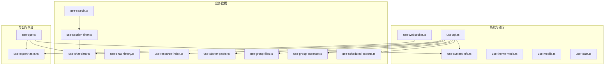
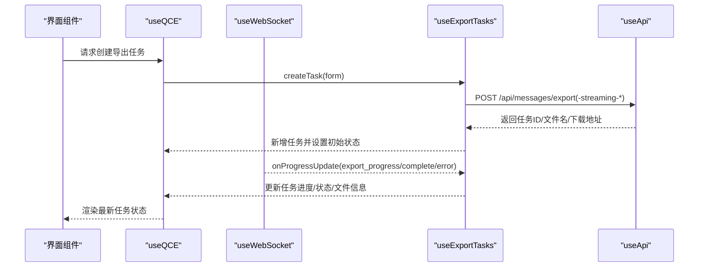
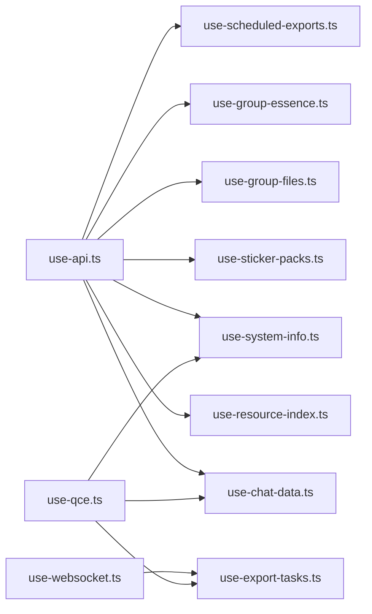

# 自定义Hook钩子

<cite>
**本文档引用的文件**
- [use-api.ts](file://qce-v4-tool/hooks/use-api.ts)
- [use-chat-data.ts](file://qce-v4-tool/hooks/use-chat-data.ts)
- [use-chat-history.ts](file://qce-v4-tool/hooks/use-chat-history.ts)
- [use-config.ts](file://qce-v4-tool/hooks/use-config.ts)
- [use-export-tasks.ts](file://qce-v4-tool/hooks/use-export-tasks.ts)
- [use-group-essence.ts](file://qce-v4-tool/hooks/use-group-essence.ts)
- [use-group-files.ts](file://qce-v4-tool/hooks/use-group-files.ts)
- [use-mobile.ts](file://qce-v4-tool/hooks/use-mobile.ts)
- [use-qce.ts](file://qce-v4-tool/hooks/use-qce.ts)
- [use-resource-index.ts](file://qce-v4-tool/hooks/use-resource-index.ts)
- [use-scheduled-exports.ts](file://qce-v4-tool/hooks/use-scheduled-exports.ts)
- [use-search.ts](file://qce-v4-tool/hooks/use-search.ts)
- [use-session-filter.ts](file://qce-v4-tool/hooks/use-session-filter.ts)
- [use-sticker-packs.ts](file://qce-v4-tool/hooks/use-sticker-packs.ts)
- [use-system-info.ts](file://qce-v4-tool/hooks/use-system-info.ts)
- [use-theme-mode.ts](file://qce-v4-tool/hooks/use-theme-mode.ts)
- [use-toast.ts](file://qce-v4-tool/hooks/use-toast.ts)
- [use-websocket.ts](file://qce-v4-tool/hooks/use-websocket.ts)
</cite>

## 目录
1. [简介](#简介)
2. [项目结构](#项目结构)
3. [核心组件](#核心组件)
4. [架构总览](#架构总览)
5. [详细组件分析](#详细组件分析)
6. [依赖关系分析](#依赖关系分析)
7. [性能考虑](#性能考虑)
8. [故障排除指南](#故障排除指南)
9. [结论](#结论)

## 简介
本文件系统性梳理 QQ 聊天导出器（QCE）前端使用的自定义 Hook，覆盖数据获取、状态管理、导出流程、资源管理、定时任务、主题与移动端适配等多个维度。每个 Hook 的功能职责、参数配置、返回值结构、使用场景、依赖关系、数据流与状态同步机制均有详细说明，并提供性能优化建议、错误处理策略与最佳实践。

## 项目结构
这些 Hook 主要位于 qce-v4-tool 项目的 hooks 目录中，围绕“系统信息、聊天数据、导出任务、资源索引、定时导出、群组文件/精华、表情包、搜索与筛选、主题与移动端、WebSocket 通信、全局提示”等模块组织，形成清晰的分层与职责边界。

图表来源
- [use-websocket.ts](file://qce-v4-tool/hooks/use-websocket.ts#L1-L131)
- [use-api.ts](file://qce-v4-tool/hooks/use-api.ts#L1-L70)
- [use-system-info.ts](file://qce-v4-tool/hooks/use-system-info.ts#L1-L39)
- [use-chat-data.ts](file://qce-v4-tool/hooks/use-chat-data.ts#L1-L176)
- [use-export-tasks.ts](file://qce-v4-tool/hooks/use-export-tasks.ts#L1-L579)
- [use-qce.ts](file://qce-v4-tool/hooks/use-qce.ts#L1-L75)

章节来源
- [use-api.ts](file://qce-v4-tool/hooks/use-api.ts#L1-L70)
- [use-system-info.ts](file://qce-v4-tool/hooks/use-system-info.ts#L1-L39)
- [use-websocket.ts](file://qce-v4-tool/hooks/use-websocket.ts#L1-L131)

## 核心组件
- useApi：统一网络请求封装，负责鉴权头注入、401/403 处理、下载能力与响应标准化。
- useSystemInfo：系统信息拉取与刷新。
- useWebSocket：WebSocket 连接、消息分发与自动重连。
- useQCE：主聚合 Hook，组合系统、聊天数据、导出任务与 WebSocket，提供全局状态与操作入口。
- useExportTasks：导出任务生命周期管理、进度更新、文件下载、原文件清理、静默轮询与通知策略。
- useChatData：群组/好友分页加载、头像导出、加载进度与错误管理。
- useChatHistory：导出历史文件列表、统计、删除与下载。
- useResourceIndex：资源索引、资源文件分页、导出资源明细与统计。
- useScheduledExports：定时导出任务 CRUD、手动触发、执行历史查询与统计。
- useGroupFiles：群相册/文件列表、导出与下载、导出记录与文件大小格式化。
- useGroupEssence：群精华消息加载与导出。
- useStickerPacks：表情包列表、导出与记录、统计。
- useSearch：前端群/好友搜索与无限滚动加载。
- useSessionFilter：会话筛选、排序、分页与统计。
- useConfig：配置读取与更新（输出目录等）。
- useThemeMode：主题模式切换与持久化。
- useMobile：移动端断点检测。
- useToast：全局通知队列与去重策略。

章节来源
- [use-api.ts](file://qce-v4-tool/hooks/use-api.ts#L1-L70)
- [use-system-info.ts](file://qce-v4-tool/hooks/use-system-info.ts#L1-L39)
- [use-websocket.ts](file://qce-v4-tool/hooks/use-websocket.ts#L1-L131)
- [use-qce.ts](file://qce-v4-tool/hooks/use-qce.ts#L1-L75)
- [use-export-tasks.ts](file://qce-v4-tool/hooks/use-export-tasks.ts#L1-L579)
- [use-chat-data.ts](file://qce-v4-tool/hooks/use-chat-data.ts#L1-L176)
- [use-chat-history.ts](file://qce-v4-tool/hooks/use-chat-history.ts#L1-L127)
- [use-resource-index.ts](file://qce-v4-tool/hooks/use-resource-index.ts#L1-L209)
- [use-scheduled-exports.ts](file://qce-v4-tool/hooks/use-scheduled-exports.ts#L1-L402)
- [use-group-files.ts](file://qce-v4-tool/hooks/use-group-files.ts#L1-L365)
- [use-group-essence.ts](file://qce-v4-tool/hooks/use-group-essence.ts#L1-L79)
- [use-sticker-packs.ts](file://qce-v4-tool/hooks/use-sticker-packs.ts#L1-L197)
- [use-search.ts](file://qce-v4-tool/hooks/use-search.ts#L1-L260)
- [use-session-filter.ts](file://qce-v4-tool/hooks/use-session-filter.ts#L1-L257)
- [use-config.ts](file://qce-v4-tool/hooks/use-config.ts#L1-L73)
- [use-theme-mode.ts](file://qce-v4-tool/hooks/use-theme-mode.ts#L1-L111)
- [use-mobile.ts](file://qce-v4-tool/hooks/use-mobile.ts#L1-L20)
- [use-toast.ts](file://qce-v4-tool/hooks/use-toast.ts#L1-L195)

## 架构总览
整体采用“Hook 分层 + 事件驱动”的设计：
- 通信层：useApi 提供统一 HTTP 接口；useWebSocket 提供实时事件通道。
- 数据层：useSystemInfo、useChatData、useResourceIndex、useScheduledExports 等负责各类数据的获取与缓存。
- 导出层：useExportTasks 统一管理导出任务生命周期，结合 WebSocket 实时进度与通知。
- 展示层：useQCE 将上述能力聚合为仪表盘可用的状态与动作；useThemeMode/useMobile/useToast 提升用户体验。

图表来源
- [use-qce.ts](file://qce-v4-tool/hooks/use-qce.ts#L11-L32)
- [use-export-tasks.ts](file://qce-v4-tool/hooks/use-export-tasks.ts#L105-L194)
- [use-websocket.ts](file://qce-v4-tool/hooks/use-websocket.ts#L64-L77)
- [use-api.ts](file://qce-v4-tool/hooks/use-api.ts#L8-L47)

## 详细组件分析

### useApi：统一网络请求与下载
- 功能职责
  - 统一添加 Content-Type、X-Request-ID、Authorization/X-Access-Token 等头部。
  - 自动处理 401/403：清空 Token 并跳转至认证页面。
  - 统一响应解析与错误抛出，保证调用方只处理业务错误。
  - 提供下载文件能力（基于服务端 /downloads/{fileName}）。
- 参数配置
  - endpoint: 相对路径字符串。
  - options: RequestInit，可覆盖默认头部。
- 返回值结构
  - apiCall<T>(endpoint, options?): Promise<APIResponse<T>>
  - downloadFile(fileName): Promise<void>
- 使用场景
  - 所有需要与后端交互的 Hook 均依赖该 Hook。
- 性能与健壮性
  - 使用 useCallback 包裹减少重渲染；使用 useMemo 缓存返回对象。
  - 对 401/403 做双重保护（清除 Token + 跳转）。
- 错误处理
  - 非 2xx 抛出 Error；401/403 清理认证并中断后续流程。
- 最佳实践
  - 在调用前确保 AuthManager 已初始化 Token。
  - 对大文件下载使用 downloadFile，避免内存压力。

章节来源
- [use-api.ts](file://qce-v4-tool/hooks/use-api.ts#L1-L70)

### useSystemInfo：系统信息获取
- 功能职责
  - 拉取系统信息（如运行环境、版本、依赖状态等）。
- 参数配置
  - 无外部参数。
- 返回值结构
  - systemInfo: SystemInfo | null
  - loadSystemInfo(): Promise<void>
  - refreshSystemInfo(): void
- 使用场景
  - 仪表盘初始化时加载系统状态。
- 性能与健壮性
  - 使用 loading/error 状态避免重复请求。
- 错误处理
  - 捕获异常并记录日志，不阻断其他功能。
- 最佳实践
  - 在 useQCE 中首次渲染时调用 loadSystemInfo。

章节来源
- [use-system-info.ts](file://qce-v4-tool/hooks/use-system-info.ts#L1-L39)

### useWebSocket：实时通信与自动重连
- 功能职责
  - 建立与后端的 WebSocket 连接，自动重连。
  - 解析消息类型，分发到 onMessage/onExportProgress/onProgressUpdate/onNotification/onError。
- 参数配置
  - onMessage/onExportProgress/onProgressUpdate/onNotification/onError 回调。
- 返回值结构
  - connected: boolean
  - connect()/disconnect()/sendMessage(msg)
- 使用场景
  - useQCE 作为导出进度与通知的唯一来源。
- 性能与健壮性
  - 使用 ref 存储回调，避免每次渲染重建连接逻辑。
  - 断线自动 5 秒重连。
- 错误处理
  - onclose/onerror 统一设置 disconnected 并上报错误。
- 最佳实践
  - 在组件卸载时主动调用 disconnect。

章节来源
- [use-websocket.ts](file://qce-v4-tool/hooks/use-websocket.ts#L1-L131)

### useQCE：主聚合 Hook
- 功能职责
  - 组合 useSystemInfo、useChatData、useExportTasks、useWebSocket。
  - 汇总全局 loading/error 状态，暴露统一的导出与数据操作接口。
- 参数配置
  - onNotification?: UseExportTasksProps['onNotification']（透传给导出任务通知）。
- 返回值结构
  - systemInfo、refreshSystemInfo、wsConnected
  - groups/friends/loadChatData/exportGroupAvatars/avatarExportLoading
  - tasks/loadTasks/deleteTask/createTask/downloadTask/deleteOriginalFiles/getTaskStats/isTaskDataStale/isJsonlExport/openTaskFileLocation
  - isLoading/error/setError
- 使用场景
  - 仪表盘主页面的单一数据源。
- 性能与健壮性
  - 合并三类 Hook 的 loading/error，避免重复请求。
- 错误处理
  - 任一子 Hook 出错都会体现在全局 error。
- 最佳实践
  - 在页面挂载时仅调用一次系统信息加载。

章节来源
- [use-qce.ts](file://qce-v4-tool/hooks/use-qce.ts#L1-L75)

### useExportTasks：导出任务全生命周期
- 功能职责
  - 任务列表加载/刷新/删除。
  - 创建导出任务（普通/流式 JSONL/流式 ZIP）。
  - 进度更新（兼容旧/新消息格式）、文件下载、原文件清理。
  - 通知策略：根据导出类型弹出不同提示（JSONL/ZIP/HTML）。
  - 静默轮询：运行中的任务每 8 秒刷新一次。
- 参数配置
  - onNotification 回调（用于展示通知）。
- 返回值结构
  - tasks: ExportTask[]
  - loadTasks()/refreshTasks()/deleteTask(taskId)/createTask(form)/downloadTask(task)/deleteOriginalFiles(taskId)/openTaskFileLocation(task)
  - updateTaskProgress()/handleWebSocketProgress()
  - getTaskStats()/isDataStale()
  - setError()
- 使用场景
  - 导出任务面板、批量导出向导、导出历史查看。
- 性能与健壮性
  - 仅在存在运行中任务时启动轮询，避免无效请求。
  - 使用 ref 存储回调，防止闭包陷阱。
- 错误处理
  - 任务创建失败、下载失败、删除失败均捕获并设置 error。
- 最佳实践
  - 流式导出完成后通过 openTaskFileLocation 定位文件。

章节来源
- [use-export-tasks.ts](file://qce-v4-tool/hooks/use-export-tasks.ts#L1-L579)

### useChatData：群组/好友数据与头像导出
- 功能职责
  - 自动分页加载群组/好友（默认每页 1000）。
  - 支持加载进度（current/total）。
  - 导出群成员头像并返回结果。
- 参数配置
  - page/limit 控制分页。
- 返回值结构
  - groups/friends/loading/error/loadProgress/loadGroups/loadFriends/loadAll/exportGroupAvatars(avatarExportLoading)
- 使用场景
  - 会话列表、导出头像预览。
- 性能与健壮性
  - 分页加载过程中实时更新 UI，避免一次性渲染大量数据。
- 错误处理
  - 捕获异常并设置 error，同时清空进度。
- 最佳实践
  - 使用 loadAll 并行加载群组与好友。

章节来源
- [use-chat-data.ts](file://qce-v4-tool/hooks/use-chat-data.ts#L1-L176)

### useChatHistory：导出历史管理
- 功能职责
  - 获取导出历史文件列表、统计 HTML/JSON 数量与总大小。
  - 删除与下载历史文件。
- 参数配置
  - 无。
- 返回值结构
  - files/loading/error/loadChatHistory/getStats(deleteFile(downloadFile)/setError)
- 使用场景
  - 导出历史面板。
- 性能与健壮性
  - 统一格式化大小，避免重复计算。
- 错误处理
  - 对 HTTP 非 2xx 与业务失败进行统一处理。
- 最佳实践
  - 删除后同步更新本地状态。

章节来源
- [use-chat-history.ts](file://qce-v4-tool/hooks/use-chat-history.ts#L1-L127)

### useResourceIndex：资源索引与文件浏览
- 功能职责
  - 加载资源索引（按类型/来源统计）。
  - 分页加载资源文件列表（支持追加）。
  - 查看某导出文件包含的资源明细。
- 参数配置
  - type/page/limit/append 控制加载行为。
- 返回值结构
  - index/exportResources/resourceFiles/resourceFilesTotal/resourceFilesHasMore/loading/filesLoading/error/loadResourceIndex/loadResourceFiles/loadExportResources/formatSize/getStats
- 使用场景
  - 资源管理与导出审计。
- 性能与健壮性
  - append 模式支持无限滚动。
- 错误处理
  - 统一错误提示与日志记录。
- 最佳实践
  - 先加载索引再按需加载文件列表。

章节来源
- [use-resource-index.ts](file://qce-v4-tool/hooks/use-resource-index.ts#L1-L209)

### useScheduledExports：定时导出任务
- 功能职责
  - CRUD 定时导出任务，手动触发，查询执行历史。
  - 统计任务数量与启用状态。
- 参数配置
  - CreateScheduledExportForm/Partial<ScheduledExportConfig>。
- 返回值结构
  - scheduledExports/loading/error/loadScheduledExports/createScheduledExport/updateScheduledExport/deleteScheduledExport/triggerScheduledExport/toggleScheduledExport/getExecutionHistory/getStats/setError
- 使用场景
  - 定时备份与周期性导出。
- 性能与健壮性
  - 组件挂载时自动加载任务列表。
- 错误处理
  - 使用 toast 统一反馈错误。
- 最佳实践
  - 使用预设配置模板快速创建常用计划。

章节来源
- [use-scheduled-exports.ts](file://qce-v4-tool/hooks/use-scheduled-exports.ts#L1-L402)

### useGroupFiles：群相册与文件管理
- 功能职责
  - 加载群相册与媒体、导出相册。
  - 加载群文件列表/数量、导出文件元数据或含下载。
  - 下载单个文件、格式化文件大小。
- 参数配置
  - groupCode/folderId/startIndex/count/albumIds 等。
- 返回值结构
  - albums/albumMedia/albumExportRecords/loadAlbums/loadAlbumMedia/exportAlbum/loadAlbumExportRecords
  - files/folders/fileCount/fileExportRecords/loadFiles/loadFileCount/exportFilesMetadata/exportFilesWithDownload/loadFileExportRecords/downloadFile/formatFileSize
- 使用场景
  - 群资源集中管理与导出。
- 性能与健壮性
  - 分页加载文件列表，避免阻塞。
- 错误处理
  - 每个操作独立 try/catch 并设置 error。
- 最佳实践
  - 导出含下载时注意磁盘空间与网络稳定性。

章节来源
- [use-group-files.ts](file://qce-v4-tool/hooks/use-group-files.ts#L1-L365)

### useGroupEssence：群精华消息
- 功能职责
  - 加载精华消息列表，支持 JSON/HTML 导出。
- 参数配置
  - groupCode/format('json'|'html')。
- 返回值结构
  - messages/loading/exporting/error/loadEssenceMessages(exportEssenceMessages(clearMessages))
- 使用场景
  - 精华内容备份与归档。
- 性能与健壮性
  - 导出过程设置 exporting 防止重复点击。
- 错误处理
  - 统一错误提示与日志。
- 最佳实践
  - 导出前先加载列表确认消息数量。

章节来源
- [use-group-essence.ts](file://qce-v4-tool/hooks/use-group-essence.ts#L1-L79)

### useStickerPacks：表情包管理
- 功能职责
  - 加载表情包列表与统计，导出指定或全部表情包。
  - 查看导出记录。
- 参数配置
  - types?: string[]（过滤类型）。
- 返回值结构
  - packs/stats/exportRecords/loading/error/loadStickerPacks/loadExportRecords/exportStickerPack/exportAllStickerPacks/getStats
- 使用场景
  - 表情包备份与整理。
- 性能与健壮性
  - 统一统计计算，避免重复遍历。
- 错误处理
  - 每个操作独立错误处理。
- 最佳实践
  - 导出前先加载统计，评估导出规模。

章节来源
- [use-sticker-packs.ts](file://qce-v4-tool/hooks/use-sticker-packs.ts#L1-L197)

### useSearch：前端搜索与无限加载
- 功能职责
  - 前端对群组/好友进行搜索过滤，支持自动递归加载所有数据。
- 参数配置
  - page/limit/append 控制加载行为。
- 返回值结构
  - groupSearch/friendSearch: { results/allData/loading/error/hasMore/currentPage/totalCount/searchTerm/load/search/loadMore/clear }
- 使用场景
  - 会话列表搜索与滚动加载。
- 性能与健壮性
  - append 模式减少 DOM 重排；递归加载避免阻塞。
- 错误处理
  - 统一错误提示。
- 最佳实践
  - 搜索词为空时返回全部数据，提升体验。

章节来源
- [use-search.ts](file://qce-v4-tool/hooks/use-search.ts#L1-L260)

### useSessionFilter：会话筛选与分页
- 功能职责
  - 对群组/好友进行多维筛选（类型、关键词）、排序（名称/人数/ID）与分页。
- 参数配置
  - groups/friends 输入数组；options.defaultPageSize。
- 返回值结构
  - search/type/sortField/sortOrder/page/pageSize + setter/resetFilters
  - filteredItems/paginatedItems/totalPages/hasNextPage/hasPrevPage
  - groupCount/friendCount
- 使用场景
  - 会话列表的高级筛选与分页展示。
- 性能与健壮性
  - useMemo 缓存转换与过滤结果；自动调整页码避免越界。
- 错误处理
  - 无显式错误，主要依赖输入数据。
- 最佳实践
  - 搜索/筛选/排序变更时重置到第一页。

章节来源
- [use-session-filter.ts](file://qce-v4-tool/hooks/use-session-filter.ts#L1-L257)

### useConfig：配置读取与更新
- 功能职责
  - 读取当前输出目录与定时导出目录；更新配置并提示。
- 参数配置
  - customOutputDir/customScheduledExportDir。
- 返回值结构
  - config/loading/loadConfig/updateConfig
- 使用场景
  - 设置面板与导出路径管理。
- 性能与健壮性
  - 使用 toast 统一反馈更新结果。
- 错误处理
  - 更新失败时 toast 提示错误。
- 最佳实践
  - 更新后立即刷新配置以确保一致性。

章节来源
- [use-config.ts](file://qce-v4-tool/hooks/use-config.ts#L1-L73)

### useThemeMode：主题模式管理
- 功能职责
  - 支持 system/light/dark 三种模式，持久化到 localStorage。
- 参数配置
  - 无。
- 返回值结构
  - mode/resolvedTheme/isDark/setThemeMode/toggleTheme/resetToSystem
- 使用场景
  - 设置面板与应用主题切换。
- 性能与健壮性
  - 监听系统主题变化，实时同步。
- 错误处理
  - 无错误处理需求。
- 最佳实践
  - 切换主题后确保 UI 一致生效。

章节来源
- [use-theme-mode.ts](file://qce-v4-tool/hooks/use-theme-mode.ts#L1-L111)

### useMobile：移动端断点检测
- 功能职责
  - 基于窗口宽度判断是否移动端。
- 参数配置
  - 无。
- 返回值结构
  - useIsMobile(): boolean
- 使用场景
  - 响应式布局与移动端适配。
- 性能与健壮性
  - 使用 matchMedia 监听断点变化。
- 错误处理
  - 无错误处理需求。
- 最佳实践
  - 在布局组件中使用该 Hook 决策 UI 结构。

章节来源
- [use-mobile.ts](file://qce-v4-tool/hooks/use-mobile.ts#L1-L20)

### useToast：全局通知队列
- 功能职责
  - 去重显示通知，最多保留 N 条；自动移除过期通知。
- 参数配置
  - TOAST_LIMIT/TOAST_REMOVE_DELAY。
- 返回值结构
  - toasts + toast/dismiss/reducer/useToast
- 使用场景
  - 各类操作结果反馈（配置更新、任务完成、错误提示）。
- 性能与健壮性
  - 使用 Map 缓存超时器，避免内存泄漏。
- 错误处理
  - 无错误处理需求。
- 最佳实践
  - 成功/失败分别使用不同样式与动作按钮。

章节来源
- [use-toast.ts](file://qce-v4-tool/hooks/use-toast.ts#L1-L195)

## 依赖关系分析
- 低耦合高内聚
  - useApi 作为底层依赖被多个业务 Hook 使用，避免重复网络层代码。
  - useWebSocket 与 useExportTasks 协作，实现导出进度的实时推送。
  - useQCE 作为门面，聚合多个子 Hook，降低上层组件复杂度。
- 潜在循环依赖
  - 未发现直接循环依赖；各 Hook 严格单向依赖。
- 外部依赖
  - WebSocket 服务器 ws://localhost:40653。
  - HTTP 服务器 http://localhost:40653（由 useApi 固定）。

图表来源
- [use-api.ts](file://qce-v4-tool/hooks/use-api.ts#L1-L70)
- [use-websocket.ts](file://qce-v4-tool/hooks/use-websocket.ts#L1-L131)
- [use-qce.ts](file://qce-v4-tool/hooks/use-qce.ts#L1-L75)

## 性能考虑
- 请求与渲染优化
  - 使用 useCallback/memo 缓解重渲染；useMemo 缓存返回对象。
  - useExportTasks 仅在存在运行中任务时轮询，避免无效请求。
  - useChatData 分页加载并实时更新 UI，避免一次性渲染大量数据。
- 资源与网络
  - useExportTasks 对流式导出（JSONL/ZIP）提供专门提示与定位文件能力。
  - useApi 对 401/403 做双重保护，避免无效请求链路。
- 存储与状态
  - useThemeMode/useToast/useMobile 等 Hook 使用最小状态与事件监听，降低开销。
- 建议
  - 对高频搜索场景（useSearch）建议增加防抖。
  - 对大文件下载（useExportTasks.downloadTask）建议提供取消与进度条。

## 故障排除指南
- WebSocket 连接失败
  - 现象：connected=false，控制台打印错误。
  - 处理：检查后端服务是否启动；等待自动重连；必要时调用 connect()。
- 导出任务长时间无进度
  - 现象：任务状态 stuck。
  - 处理：确认后端服务状态；检查 useExportTasks 是否在运行中任务时进行静默轮询。
- 401/403 异常
  - 现象：页面跳转至认证页。
  - 处理：重新登录并确保 Token 正确；检查 useApi 的头部注入。
- 文件下载失败
  - 现象：downloadFile 或 downloadTask 抛错。
  - 处理：确认文件存在与权限；使用 openTaskFileLocation 定位文件。
- 主题切换无效
  - 现象：切换主题后 UI 未变化。
  - 处理：确认 useThemeMode 是否正确写入 localStorage 并应用到 <html>。

章节来源
- [use-websocket.ts](file://qce-v4-tool/hooks/use-websocket.ts#L83-L96)
- [use-export-tasks.ts](file://qce-v4-tool/hooks/use-export-tasks.ts#L534-L558)
- [use-api.ts](file://qce-v4-tool/hooks/use-api.ts#L32-L38)
- [use-theme-mode.ts](file://qce-v4-tool/hooks/use-theme-mode.ts#L42-L49)

## 结论
本套自定义 Hook 体系以 useApi 为核心，围绕系统信息、聊天数据、导出任务、资源与定时任务构建了完整的前端数据层。通过 useWebSocket 实现实时进度与通知，useQCE 提供统一入口，useToast/useThemeMode/useMobile 提升用户体验。整体设计具备良好的扩展性与可维护性，适合在复杂业务场景中复用与演进。