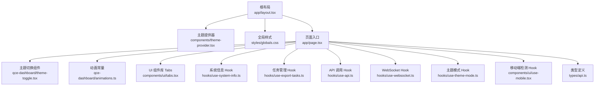
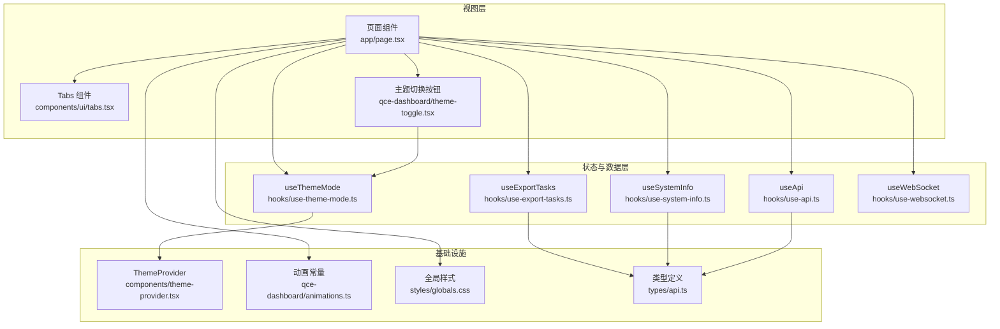
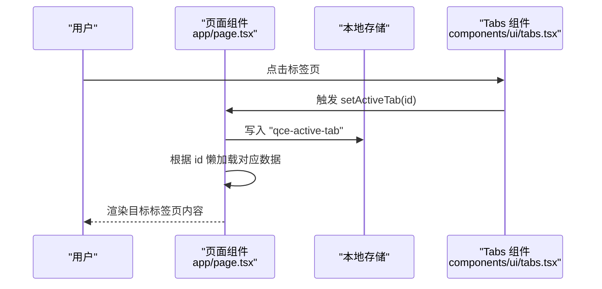
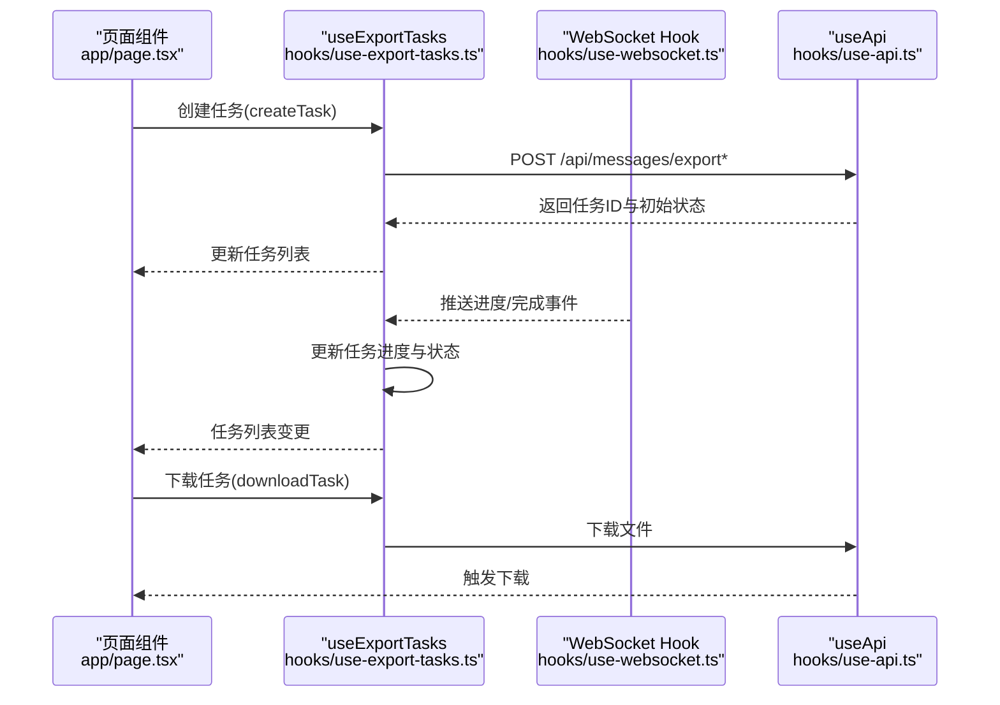
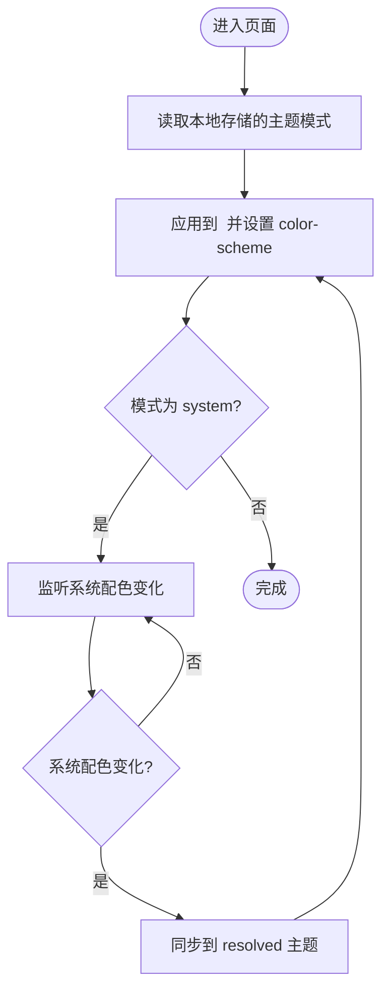
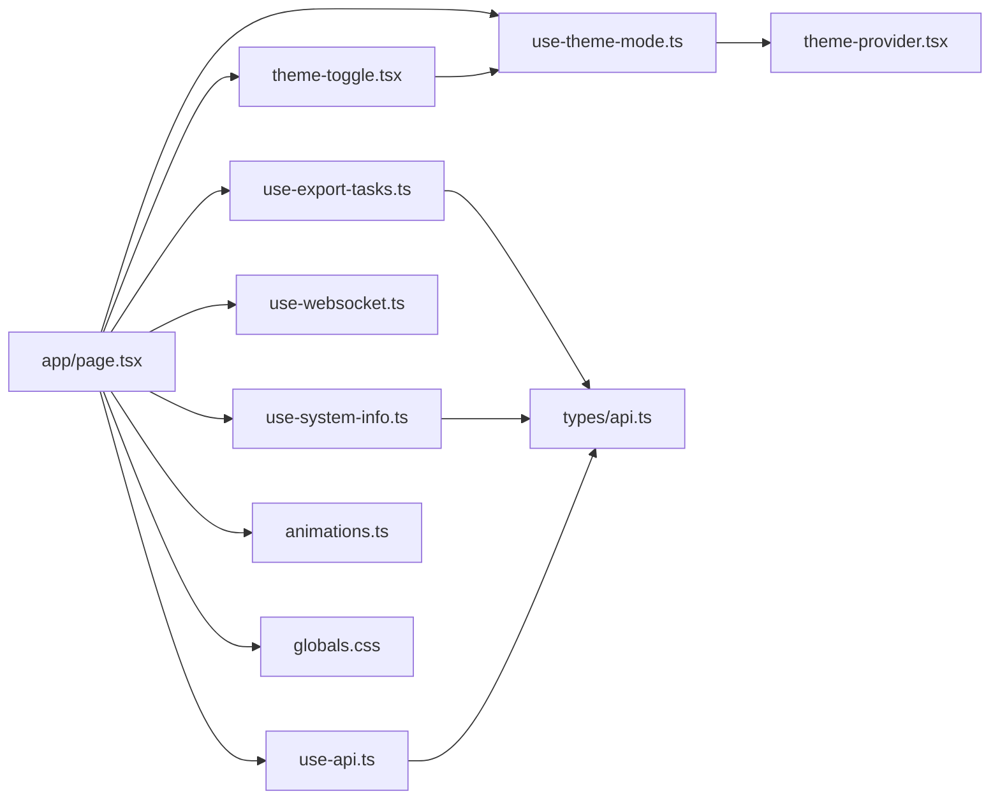

# 仪表板界面

<cite>
**本文引用的文件**
- [qce-v4-tool/app/page.tsx](file://qce-v4-tool/app/page.tsx)
- [qce-v4-tool/app/layout.tsx](file://qce-v4-tool/app/layout.tsx)
- [qce-v4-tool/components/qce-dashboard/theme-toggle.tsx](file://qce-v4-tool/components/qce-dashboard/theme-toggle.tsx)
- [qce-v4-tool/components/qce-dashboard/animations.ts](file://qce-v4-tool/components/qce-dashboard/animations.ts)
- [qce-v4-tool/components/ui/tabs.tsx](file://qce-v4-tool/components/ui/tabs.tsx)
- [qce-v4-tool/hooks/use-theme-mode.ts](file://qce-v4-tool/hooks/use-theme-mode.ts)
- [qce-v4-tool/hooks/use-system-info.ts](file://qce-v4-tool/hooks/use-system-info.ts)
- [qce-v4-tool/hooks/use-export-tasks.ts](file://qce-v4-tool/hooks/use-export-tasks.ts)
- [qce-v4-tool/hooks/use-api.ts](file://qce-v4-tool/hooks/use-api.ts)
- [qce-v4-tool/hooks/use-websocket.ts](file://qce-v4-tool/hooks/use-websocket.ts)
- [qce-v4-tool/components/theme-provider.tsx](file://qce-v4-tool/components/theme-provider.tsx)
- [qce-v4-tool/styles/globals.css](file://qce-v4-tool/styles/globals.css)
- [qce-v4-tool/types/api.ts](file://qce-v4-tool/types/api.ts)
- [qce-v4-tool/components/ui/use-mobile.tsx](file://qce-v4-tool/components/ui/use-mobile.tsx)
</cite>

## 目录
1. [简介](#简介)
2. [项目结构](#项目结构)
3. [核心组件](#核心组件)
4. [架构总览](#架构总览)
5. [详细组件分析](#详细组件分析)
6. [依赖关系分析](#依赖关系分析)
7. [性能考量](#性能考量)
8. [故障排查指南](#故障排查指南)
9. [结论](#结论)
10. [附录](#附录)

## 简介
本文件面向“仪表板界面”的设计与实现，聚焦于主仪表板的整体架构、多标签页导航系统、实时状态展示、任务管理与系统监控能力。文档同时阐述数据流架构、状态管理模式、用户交互设计、主题切换机制、动画效果与响应式布局适配，并给出定制化配置与扩展开发指南，帮助开发者快速理解与迭代该仪表板。

## 项目结构
仪表板位于 qce-v4-tool 工程的前端应用中，采用 Next.js App Router 结构，页面入口为根路由页面组件，全局样式与主题提供器在根布局中注入，核心业务逻辑通过自研 Hook 与类型定义进行组织。

图表来源
- [qce-v4-tool/app/layout.tsx](file://qce-v4-tool/app/layout.tsx#L15-L68)
- [qce-v4-tool/components/theme-provider.tsx](file://qce-v4-tool/components/theme-provider.tsx#L1-L12)
- [qce-v4-tool/styles/globals.css](file://qce-v4-tool/styles/globals.css#L1-L135)
- [qce-v4-tool/app/page.tsx](file://qce-v4-tool/app/page.tsx#L74-L1211)
- [qce-v4-tool/components/qce-dashboard/theme-toggle.tsx](file://qce-v4-tool/components/qce-dashboard/theme-toggle.tsx#L1-L37)
- [qce-v4-tool/components/qce-dashboard/animations.ts](file://qce-v4-tool/components/qce-dashboard/animations.ts#L1-L59)
- [qce-v4-tool/components/ui/tabs.tsx](file://qce-v4-tool/components/ui/tabs.tsx#L1-L67)
- [qce-v4-tool/hooks/use-system-info.ts](file://qce-v4-tool/hooks/use-system-info.ts#L1-L39)
- [qce-v4-tool/hooks/use-export-tasks.ts](file://qce-v4-tool/hooks/use-export-tasks.ts#L1-L579)
- [qce-v4-tool/hooks/use-api.ts](file://qce-v4-tool/hooks/use-api.ts#L1-L70)
- [qce-v4-tool/hooks/use-websocket.ts](file://qce-v4-tool/hooks/use-websocket.ts#L83-L131)
- [qce-v4-tool/hooks/use-theme-mode.ts](file://qce-v4-tool/hooks/use-theme-mode.ts#L1-L111)
- [qce-v4-tool/components/ui/use-mobile.tsx](file://qce-v4-tool/components/ui/use-mobile.tsx#L1-L20)
- [qce-v4-tool/types/api.ts](file://qce-v4-tool/types/api.ts#L1-L509)

章节来源
- [qce-v4-tool/app/layout.tsx](file://qce-v4-tool/app/layout.tsx#L15-L68)
- [qce-v4-tool/app/page.tsx](file://qce-v4-tool/app/page.tsx#L74-L1211)

## 核心组件
- 多标签页导航系统：基于 Radix UI Tabs 封装，支持动态切换与视觉反馈，配合本地存储持久化当前标签页。
- 实时状态展示：通过 WebSocket 接收导出进度与完成事件，结合任务 Hook 实时更新任务列表与状态。
- 任务管理：统一的任务创建、查询、删除、下载与原文件清理流程，支持静默轮询与批量导出。
- 系统监控：系统信息 Hook 提供运行时信息拉取与刷新，便于在仪表板中展示系统健康度。
- 主题切换：基于 next-themes 的主题提供器与自定义 Hook，支持系统/浅色/深色三态与系统偏好监听。
- 动画与交互：统一的动画常量与 Framer Motion 微动效，提升交互体验与过渡自然度。
- 响应式布局：移动端断点检测 Hook 与 Tailwind CSS 原子类，确保在不同设备上的一致体验。

章节来源
- [qce-v4-tool/components/ui/tabs.tsx](file://qce-v4-tool/components/ui/tabs.tsx#L1-L67)
- [qce-v4-tool/hooks/use-export-tasks.ts](file://qce-v4-tool/hooks/use-export-tasks.ts#L1-L579)
- [qce-v4-tool/hooks/use-system-info.ts](file://qce-v4-tool/hooks/use-system-info.ts#L1-L39)
- [qce-v4-tool/hooks/use-theme-mode.ts](file://qce-v4-tool/hooks/use-theme-mode.ts#L1-L111)
- [qce-v4-tool/components/qce-dashboard/animations.ts](file://qce-v4-tool/components/qce-dashboard/animations.ts#L1-L59)
- [qce-v4-tool/components/ui/use-mobile.tsx](file://qce-v4-tool/components/ui/use-mobile.tsx#L1-L20)

## 架构总览
仪表板采用“页面组件 + 自定义 Hook + 类型定义 + UI 组件库 + 主题与动画体系”的分层架构。页面组件负责状态编排与视图渲染；Hook 抽象网络请求、WebSocket 连接、主题与移动端检测；类型定义统一前后端数据契约；UI 组件库提供可复用的交互元素；主题与动画体系保证一致的视觉与交互体验。

图表来源
- [qce-v4-tool/app/page.tsx](file://qce-v4-tool/app/page.tsx#L74-L1211)
- [qce-v4-tool/components/ui/tabs.tsx](file://qce-v4-tool/components/ui/tabs.tsx#L1-L67)
- [qce-v4-tool/components/qce-dashboard/theme-toggle.tsx](file://qce-v4-tool/components/qce-dashboard/theme-toggle.tsx#L1-L37)
- [qce-v4-tool/hooks/use-theme-mode.ts](file://qce-v4-tool/hooks/use-theme-mode.ts#L1-L111)
- [qce-v4-tool/hooks/use-system-info.ts](file://qce-v4-tool/hooks/use-system-info.ts#L1-L39)
- [qce-v4-tool/hooks/use-export-tasks.ts](file://qce-v4-tool/hooks/use-export-tasks.ts#L1-L579)
- [qce-v4-tool/hooks/use-api.ts](file://qce-v4-tool/hooks/use-api.ts#L1-L70)
- [qce-v4-tool/hooks/use-websocket.ts](file://qce-v4-tool/hooks/use-websocket.ts#L83-L131)
- [qce-v4-tool/components/theme-provider.tsx](file://qce-v4-tool/components/theme-provider.tsx#L1-L12)
- [qce-v4-tool/components/qce-dashboard/animations.ts](file://qce-v4-tool/components/qce-dashboard/animations.ts#L1-L59)
- [qce-v4-tool/styles/globals.css](file://qce-v4-tool/styles/globals.css#L1-L135)
- [qce-v4-tool/types/api.ts](file://qce-v4-tool/types/api.ts#L1-L509)

## 详细组件分析

### 多标签页导航系统
- 设计要点：使用 Radix UI Tabs 封装，提供列表与触发器的统一样式与交互；页面组件维护当前激活标签页并在切换时写入本地存储。
- 数据流：标签页切换触发状态更新，页面根据激活标签懒加载对应模块数据（如任务、定时导出、聊天历史、表情包等）。
- 用户体验：标签页切换具备按压缩放与过渡动画，保持一致的视觉反馈。

图表来源
- [qce-v4-tool/app/page.tsx](file://qce-v4-tool/app/page.tsx#L158-L177)
- [qce-v4-tool/components/ui/tabs.tsx](file://qce-v4-tool/components/ui/tabs.tsx#L1-L67)

章节来源
- [qce-v4-tool/app/page.tsx](file://qce-v4-tool/app/page.tsx#L158-L177)
- [qce-v4-tool/components/ui/tabs.tsx](file://qce-v4-tool/components/ui/tabs.tsx#L1-L67)

### 实时状态展示与任务管理
- 数据流：页面组件通过 useExportTasks Hook 管理任务列表，包含加载、刷新、创建、删除、下载与原文件清理等操作；同时通过 useWebSocket Hook 维护与后端的 WebSocket 连接，接收导出进度与完成事件，驱动任务状态实时更新。
- 任务状态：支持 pending/running/completed/failed 四态，进度百分比与附加信息（如文件名、下载链接、错误信息）随事件更新。
- 静默轮询：当存在运行中的任务时，每 8 秒静默刷新一次任务列表，避免频繁阻塞 UI。
- 通知系统：根据任务完成类型（如 JSONL 分块、流式 ZIP、HTML 等）弹出相应通知，支持打开文件位置与进一步操作。

图表来源
- [qce-v4-tool/app/page.tsx](file://qce-v4-tool/app/page.tsx#L615-L630)
- [qce-v4-tool/hooks/use-export-tasks.ts](file://qce-v4-tool/hooks/use-export-tasks.ts#L105-L194)
- [qce-v4-tool/hooks/use-websocket.ts](file://qce-v4-tool/hooks/use-websocket.ts#L83-L131)
- [qce-v4-tool/hooks/use-api.ts](file://qce-v4-tool/hooks/use-api.ts#L49-L64)

章节来源
- [qce-v4-tool/app/page.tsx](file://qce-v4-tool/app/page.tsx#L615-L630)
- [qce-v4-tool/hooks/use-export-tasks.ts](file://qce-v4-tool/hooks/use-export-tasks.ts#L1-L579)
- [qce-v4-tool/hooks/use-websocket.ts](file://qce-v4-tool/hooks/use-websocket.ts#L83-L131)
- [qce-v4-tool/hooks/use-api.ts](file://qce-v4-tool/hooks/use-api.ts#L1-L70)

### 系统监控
- 数据来源：useSystemInfo Hook 通过 API 拉取系统信息（含 NapCat 运行环境、在线状态、Node 版本、平台架构、内存占用等），支持手动刷新与错误处理。
- 展示建议：可在仪表板概览页展示系统健康度指标，如运行时长、内存使用率、工作环境等，辅助用户判断导出服务状态。

章节来源
- [qce-v4-tool/hooks/use-system-info.ts](file://qce-v4-tool/hooks/use-system-info.ts#L1-L39)
- [qce-v4-tool/types/api.ts](file://qce-v4-tool/types/api.ts#L18-L56)

### 主题切换机制
- 三态模式：支持 system/light/dark 三种模式；当处于 system 时，自动监听系统配色偏好变化并同步到根元素 class 与 color-scheme。
- 存储与回退：主题模式持久化到本地存储，初始化时从本地恢复；提供“恢复系统默认”快捷操作。
- 视觉一致性：全局样式基于 oklch 色值变量，深浅主题下自动切换颜色变量，确保组件色彩一致。

图表来源
- [qce-v4-tool/hooks/use-theme-mode.ts](file://qce-v4-tool/hooks/use-theme-mode.ts#L32-L79)
- [qce-v4-tool/components/theme-provider.tsx](file://qce-v4-tool/components/theme-provider.tsx#L1-L12)
- [qce-v4-tool/styles/globals.css](file://qce-v4-tool/styles/globals.css#L6-L75)

章节来源
- [qce-v4-tool/hooks/use-theme-mode.ts](file://qce-v4-tool/hooks/use-theme-mode.ts#L1-L111)
- [qce-v4-tool/components/theme-provider.tsx](file://qce-v4-tool/components/theme-provider.tsx#L1-L12)
- [qce-v4-tool/styles/globals.css](file://qce-v4-tool/styles/globals.css#L1-L135)

### 动画效果与交互
- 动画常量：统一定义缓动曲线与持续时间，确保组件间动画风格一致。
- 微动效：卡片悬停抬升、按压缩放、级联容器入场、淡入淡出过渡、Toast 弹入等，提升交互自然度。
- 减少动画偏好：通过 useReducedMotion 适配系统“减少动画”偏好，降低不必要的动画。

章节来源
- [qce-v4-tool/components/qce-dashboard/animations.ts](file://qce-v4-tool/components/qce-dashboard/animations.ts#L1-L59)
- [qce-v4-tool/app/page.tsx](file://qce-v4-tool/app/page.tsx#L155-L156)

### 响应式布局适配
- 断点检测：移动端断点为 768px，通过媒体查询与 Hook 在组件内感知设备宽度。
- 样式体系：Tailwind CSS 原子类与自定义变量配合，确保在桌面与移动设备上的布局一致性。

章节来源
- [qce-v4-tool/components/ui/use-mobile.tsx](file://qce-v4-tool/components/ui/use-mobile.tsx#L1-L20)
- [qce-v4-tool/styles/globals.css](file://qce-v4-tool/styles/globals.css#L1-L135)

## 依赖关系分析
- 页面组件对 Hook 的依赖：useExportTasks、useSystemInfo、useApi、useWebSocket、useThemeMode、use-mobile。
- Hook 对类型定义的依赖：所有 API 请求与响应均遵循 types/api.ts 中的接口定义，保证前后端契约一致。
- 主题与动画：主题提供器与动画常量被页面与 UI 组件共享，形成统一的视觉与交互基线。

图表来源
- [qce-v4-tool/app/page.tsx](file://qce-v4-tool/app/page.tsx#L215-L240)
- [qce-v4-tool/hooks/use-export-tasks.ts](file://qce-v4-tool/hooks/use-export-tasks.ts#L1-L579)
- [qce-v4-tool/hooks/use-system-info.ts](file://qce-v4-tool/hooks/use-system-info.ts#L1-L39)
- [qce-v4-tool/hooks/use-api.ts](file://qce-v4-tool/hooks/use-api.ts#L1-L70)
- [qce-v4-tool/hooks/use-websocket.ts](file://qce-v4-tool/hooks/use-websocket.ts#L83-L131)
- [qce-v4-tool/hooks/use-theme-mode.ts](file://qce-v4-tool/hooks/use-theme-mode.ts#L1-L111)
- [qce-v4-tool/components/qce-dashboard/theme-toggle.tsx](file://qce-v4-tool/components/qce-dashboard/theme-toggle.tsx#L1-L37)
- [qce-v4-tool/components/theme-provider.tsx](file://qce-v4-tool/components/theme-provider.tsx#L1-L12)
- [qce-v4-tool/components/qce-dashboard/animations.ts](file://qce-v4-tool/components/qce-dashboard/animations.ts#L1-L59)
- [qce-v4-tool/styles/globals.css](file://qce-v4-tool/styles/globals.css#L1-L135)
- [qce-v4-tool/types/api.ts](file://qce-v4-tool/types/api.ts#L1-L509)

## 性能考量
- 任务静默轮询：仅在存在运行中任务时启动轮询，间隔 8 秒，避免无意义的频繁请求。
- 数据新鲜度：任务列表维护最后加载时间戳，超过 30 秒判定为陈旧，指导用户手动刷新。
- 动画降级：尊重系统“减少动画”偏好，降低动画复杂度以节省资源。
- 懒加载模块：标签页切换时才加载对应模块数据，减少首屏压力。
- 文件下载：通过 Blob URL 直接触发下载，避免额外内存拷贝。

章节来源
- [qce-v4-tool/hooks/use-export-tasks.ts](file://qce-v4-tool/hooks/use-export-tasks.ts#L534-L558)
- [qce-v4-tool/app/page.tsx](file://qce-v4-tool/app/page.tsx#L529-L532)

## 故障排查指南
- WebSocket 连接失败：检查后端服务可用性与网络连通性；页面组件会自动重连，观察控制台日志定位问题。
- 401/403 认证错误：useApi Hook 在捕获 401/403 时会清除本地 Token 并重定向至认证页，需重新登录。
- 任务长时间无进度：确认任务状态是否仍为 running，若异常可手动刷新或重新创建任务。
- 主题不生效：检查本地存储键值与系统配色偏好；确认根元素 class 与 color-scheme 是否正确设置。
- 下载失败：确认文件名有效且后端存在对应文件；检查浏览器下载权限与安全策略。

章节来源
- [qce-v4-tool/hooks/use-websocket.ts](file://qce-v4-tool/hooks/use-websocket.ts#L83-L131)
- [qce-v4-tool/hooks/use-api.ts](file://qce-v4-tool/hooks/use-api.ts#L32-L47)
- [qce-v4-tool/hooks/use-theme-mode.ts](file://qce-v4-tool/hooks/use-theme-mode.ts#L42-L79)

## 结论
该仪表板通过清晰的分层架构与完善的 Hook 抽象，实现了多标签页导航、实时任务状态展示、系统监控与主题动画等核心能力。其数据流与状态管理模式简洁可靠，配合响应式布局与性能优化策略，能够为用户提供流畅、一致的使用体验。后续可在通知系统、任务统计面板与资源索引可视化等方面进一步增强。

## 附录

### 数据流与状态管理模式
- 页面组件集中管理标签页与各模块状态，通过 Hook 抽象网络与 WebSocket，实现“视图-状态-数据”的解耦。
- 任务状态通过 WebSocket 事件驱动更新，结合本地存储与懒加载策略，平衡实时性与性能。

章节来源
- [qce-v4-tool/app/page.tsx](file://qce-v4-tool/app/page.tsx#L74-L1211)
- [qce-v4-tool/hooks/use-export-tasks.ts](file://qce-v4-tool/hooks/use-export-tasks.ts#L1-L579)

### 用户交互设计原则
- 一致性：统一的动画常量与组件样式，确保交互风格一致。
- 反馈及时：任务进度、通知与错误信息即时呈现，辅助用户决策。
- 可访问性：尊重系统动画偏好与键盘导航，保障无障碍使用。

章节来源
- [qce-v4-tool/components/qce-dashboard/animations.ts](file://qce-v4-tool/components/qce-dashboard/animations.ts#L1-L59)
- [qce-v4-tool/app/page.tsx](file://qce-v4-tool/app/page.tsx#L155-L156)

### 主题切换与样式体系
- 主题提供器与 Hook 共同实现三态主题与系统偏好监听；全局样式基于 oklch 变量，深浅主题自动切换。
- 移动端断点与 Tailwind 原子类确保在不同设备上的布局一致性。

章节来源
- [qce-v4-tool/components/theme-provider.tsx](file://qce-v4-tool/components/theme-provider.tsx#L1-L12)
- [qce-v4-tool/hooks/use-theme-mode.ts](file://qce-v4-tool/hooks/use-theme-mode.ts#L1-L111)
- [qce-v4-tool/styles/globals.css](file://qce-v4-tool/styles/globals.css#L1-L135)
- [qce-v4-tool/components/ui/use-mobile.tsx](file://qce-v4-tool/components/ui/use-mobile.tsx#L1-L20)

### 定制化配置与扩展开发指南
- 新增标签页：在页面组件中添加标签与懒加载逻辑，按需引入对应 Hook 与 UI 组件。
- 新增任务类型：在类型定义中扩展任务结构，完善 useExportTasks 的创建与处理逻辑。
- 新增通知类型：在通知系统中新增类型与动作回调，结合 useApi 的下载能力实现一键打开文件位置。
- 新增主题变体：在全局样式中扩展颜色变量与暗色变体规则，确保组件色彩一致。

章节来源
- [qce-v4-tool/app/page.tsx](file://qce-v4-tool/app/page.tsx#L74-L1211)
- [qce-v4-tool/types/api.ts](file://qce-v4-tool/types/api.ts#L107-L136)
- [qce-v4-tool/hooks/use-api.ts](file://qce-v4-tool/hooks/use-api.ts#L49-L64)