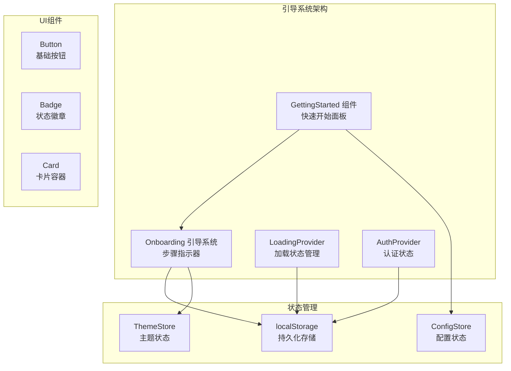
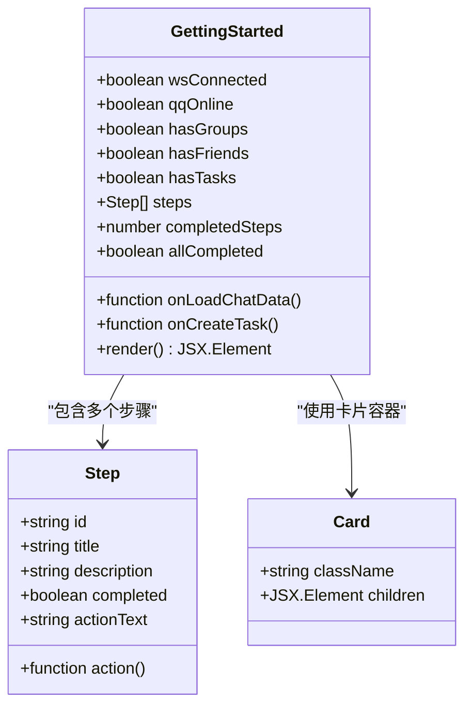
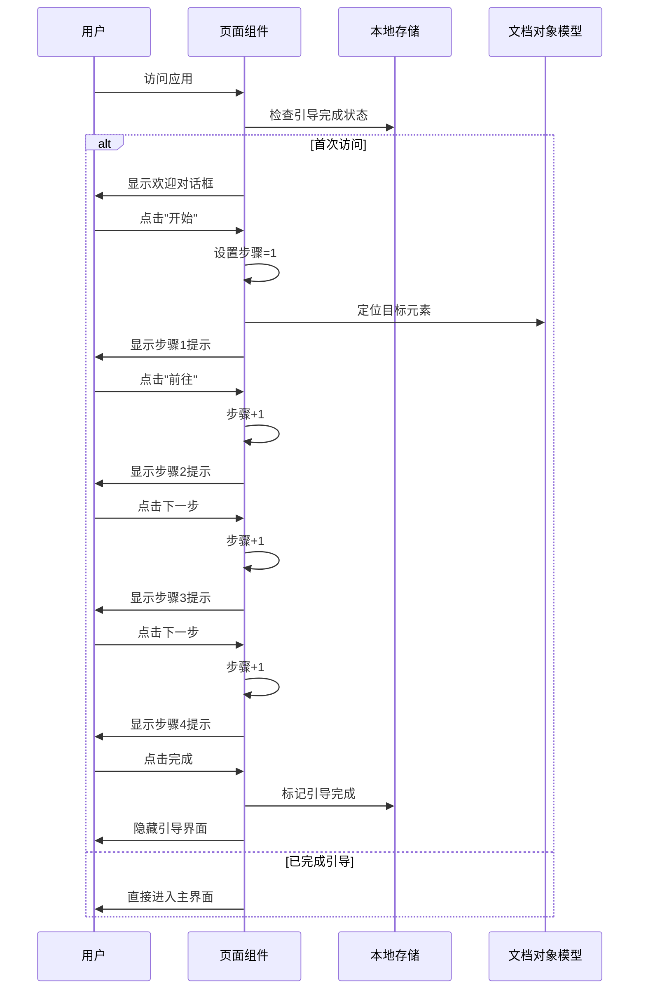
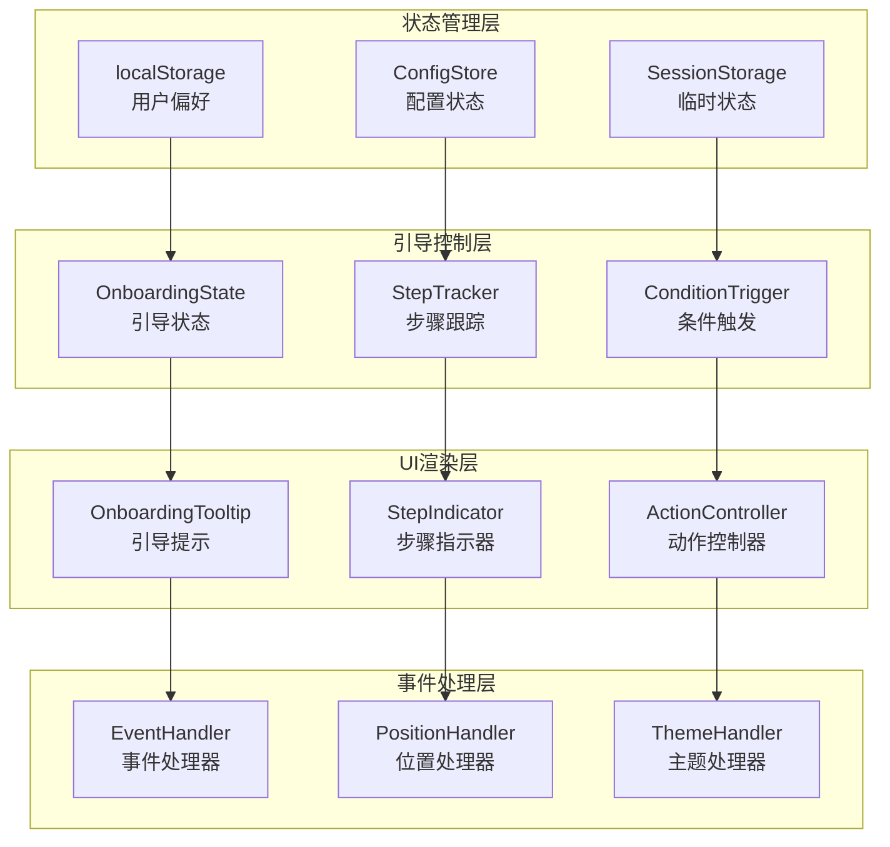
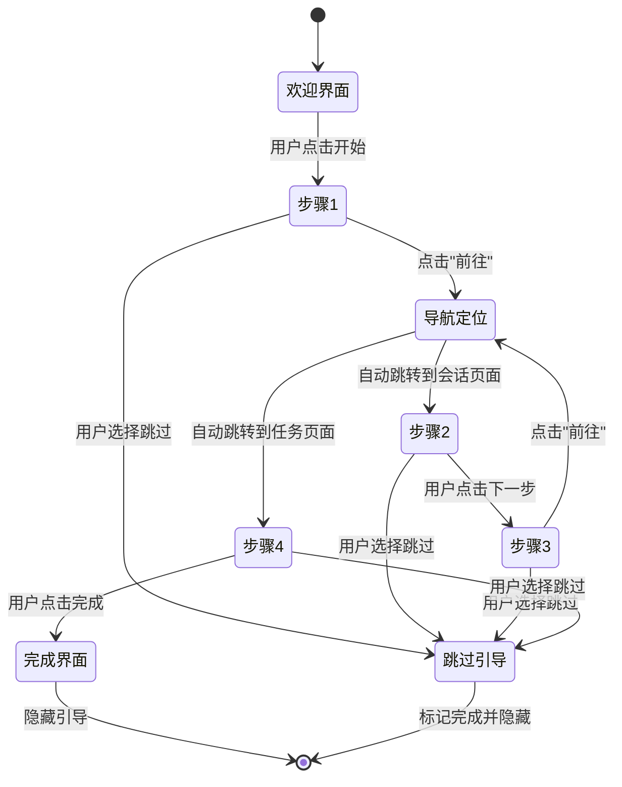
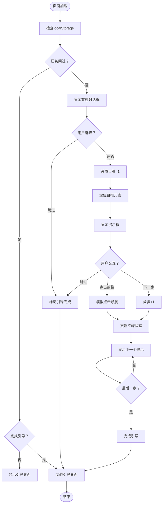
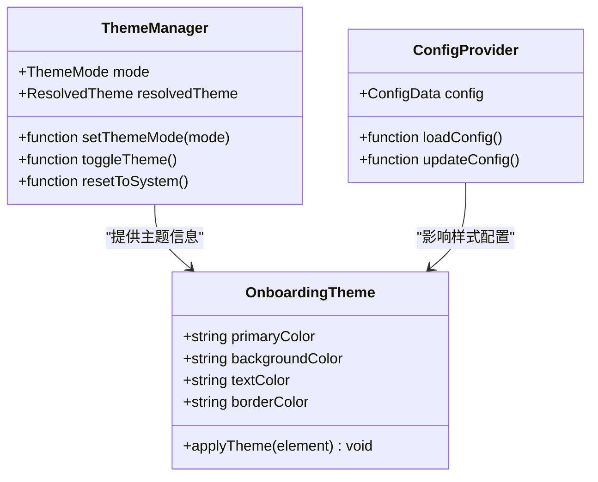
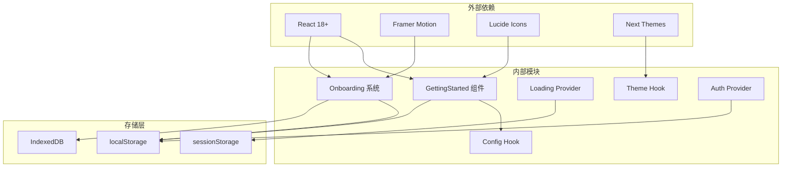

# 新手引导页面

<cite>
**本文档引用的文件**
- [getting-started.tsx](file://qce-v4-tool/components/ui/getting-started.tsx)
- [page.tsx](file://qce-v4-tool/app/page.tsx)
- [loading-provider.tsx](file://qce-v4-tool/components/loading-provider.tsx)
- [use-config.ts](file://qce-v4-tool/hooks/use-config.ts)
- [use-theme-mode.ts](file://qce-v4-tool/hooks/use-theme-mode.ts)
- [theme-provider.tsx](file://qce-v4-tool/components/theme-provider.tsx)
- [auth-provider.tsx](file://qce-v4-tool/components/auth-provider.tsx)
- [layout.tsx](file://qce-v4-tool/app/layout.tsx)
</cite>

## 目录
1. [简介](#简介)
2. [项目结构](#项目结构)
3. [核心组件](#核心组件)
4. [架构概览](#架构概览)
5. [详细组件分析](#详细组件分析)
6. [依赖关系分析](#依赖关系分析)
7. [性能考虑](#性能考虑)
8. [故障排除指南](#故障排除指南)
9. [结论](#结论)
10. [附录](#附录)

## 简介

新手引导页面是QQ聊天导出工具中的重要用户体验组件，旨在帮助新用户快速了解和掌握核心功能。该系统采用渐进式引导策略，通过分步骤的交互式教程，将复杂的导出流程分解为简单易懂的操作步骤。

系统实现了完整的引导生命周期管理，包括引导状态跟踪、用户偏好设置持久化、完成标记机制等核心功能。同时支持动态内容加载、条件显示和个性化配置，为用户提供定制化的引导体验。

## 项目结构

新手引导系统主要分布在以下关键文件中：

**图表来源**
- [getting-started.tsx](file://qce-v4-tool/components/ui/getting-started.tsx#L1-L164)
- [page.tsx](file://qce-v4-tool/app/page.tsx#L3315-L3527)

**章节来源**
- [getting-started.tsx](file://qce-v4-tool/components/ui/getting-started.tsx#L1-L164)
- [page.tsx](file://qce-v4-tool/app/page.tsx#L3315-L3527)

## 核心组件

### GettingStarted 快速开始组件

GettingStarted组件提供了基于步骤的引导框架，支持动态状态检测和用户交互：

**图表来源**
- [getting-started.tsx](file://qce-v4-tool/components/ui/getting-started.tsx#L8-L25)

组件特性：
- **动态步骤检测**：自动检测连接状态、数据加载和任务创建状态
- **可视化进度指示**：清晰显示完成进度和当前步骤
- **交互式操作**：提供一键执行相关操作的按钮
- **响应式设计**：适配不同屏幕尺寸和设备类型

**章节来源**
- [getting-started.tsx](file://qce-v4-tool/components/ui/getting-started.tsx#L27-L164)

### Onboarding 引导系统

主页面中的引导系统实现了完整的交互式教程流程：

**图表来源**
- [page.tsx](file://qce-v4-tool/app/page.tsx#L3316-L3524)

**章节来源**
- [page.tsx](file://qce-v4-tool/app/page.tsx#L3315-L3527)

## 架构概览

新手引导系统采用模块化架构设计，各组件职责明确且相互协作：

**图表来源**
- [page.tsx](file://qce-v4-tool/app/page.tsx#L165-L177)
- [getting-started.tsx](file://qce-v4-tool/components/ui/getting-started.tsx#L36-L62)

## 详细组件分析

### 引导状态管理系统

引导状态管理系统负责跟踪用户的引导进度和偏好设置：

**图表来源**
- [page.tsx](file://qce-v4-tool/app/page.tsx#L3324-L3521)

状态管理特性：
- **持久化存储**：使用localStorage保存引导完成状态
- **条件显示**：根据用户行为动态显示相应步骤
- **位置计算**：智能计算提示框的位置和偏移量
- **响应式布局**：适配不同屏幕尺寸和分辨率

**章节来源**
- [page.tsx](file://qce-v4-tool/app/page.tsx#L3316-L3527)

### 动态内容加载机制

系统实现了智能的动态内容加载，根据用户当前状态显示相应的引导内容：

**图表来源**
- [page.tsx](file://qce-v4-tool/app/page.tsx#L165-L177)
- [page.tsx](file://qce-v4-tool/app/page.tsx#L3366-L3407)

**章节来源**
- [page.tsx](file://qce-v4-tool/app/page.tsx#L165-L177)

### 个性化配置与主题集成

引导系统与整体主题系统深度集成，支持多种主题模式：

**图表来源**
- [use-theme-mode.ts](file://qce-v4-tool/hooks/use-theme-mode.ts#L24-L109)
- [theme-provider.tsx](file://qce-v4-tool/components/theme-provider.tsx#L1-L12)

**章节来源**
- [use-theme-mode.ts](file://qce-v4-tool/hooks/use-theme-mode.ts#L1-L110)
- [theme-provider.tsx](file://qce-v4-tool/components/theme-provider.tsx#L1-L12)

## 依赖关系分析

新手引导系统的依赖关系体现了清晰的分层架构：

**图表来源**
- [getting-started.tsx](file://qce-v4-tool/components/ui/getting-started.tsx#L1-L10)
- [page.tsx](file://qce-v4-tool/app/page.tsx#L3315-L3320)

**章节来源**
- [use-config.ts](file://qce-v4-tool/hooks/use-config.ts#L1-L73)
- [auth-provider.tsx](file://qce-v4-tool/components/auth-provider.tsx#L1-L90)

## 性能考虑

新手引导系统在设计时充分考虑了性能优化：

### 渲染优化
- **条件渲染**：仅在需要时渲染引导组件，避免不必要的DOM操作
- **懒加载**：引导内容按需加载，减少初始包体积
- **动画优化**：使用CSS硬件加速的动画属性

### 存储优化
- **增量更新**：只更新必要的状态，避免全量重渲染
- **防抖处理**：窗口大小变化时的重新定位操作进行防抖
- **内存管理**：及时清理DOM引用和事件监听器

### 网络优化
- **缓存策略**：引导状态持久化，避免重复的网络请求
- **异步加载**：引导内容异步加载，不影响主界面性能

## 故障排除指南

### 常见问题及解决方案

**引导不显示问题**
- 检查localStorage中`qce-onboarding-completed`键值
- 确认页面加载时的初始化逻辑
- 验证DOM元素的可用性

**步骤跳转异常**
- 检查目标元素的ID是否存在
- 确认activeTab状态正确更新
- 验证事件处理器绑定情况

**主题显示问题**
- 检查系统主题偏好设置
- 确认CSS类名正确应用
- 验证主题切换逻辑

**章节来源**
- [page.tsx](file://qce-v4-tool/app/page.tsx#L3366-L3407)
- [use-theme-mode.ts](file://qce-v4-tool/hooks/use-theme-mode.ts#L32-L79)

## 结论

新手引导页面系统通过精心设计的架构和实现，为用户提供了流畅、直观的引导体验。系统的核心优势包括：

1. **完整的生命周期管理**：从首次访问检测到引导完成标记的全流程覆盖
2. **智能化的状态跟踪**：基于用户行为和系统状态的动态内容展示
3. **深度的主题集成**：与整体UI系统的无缝融合
4. **优秀的性能表现**：优化的渲染策略和资源管理
5. **可扩展的设计**：模块化的组件结构便于功能扩展

该系统不仅满足了当前的功能需求，还为未来的功能增强和个性化定制奠定了坚实的基础。

## 附录

### 开发指南

#### 添加新的引导步骤
1. 在引导状态管理中添加新的步骤标识
2. 创建对应的UI组件和样式
3. 实现步骤间的导航逻辑
4. 更新完成标记机制

#### 自定义引导内容
1. 修改步骤描述和指导文本
2. 调整视觉样式和颜色方案
3. 配置动画效果和过渡时间
4. 测试不同设备和浏览器的兼容性

#### 扩展个性化功能
1. 添加新的配置选项和偏好设置
2. 实现动态主题切换机制
3. 集成用户反馈收集系统
4. 优化无障碍访问支持