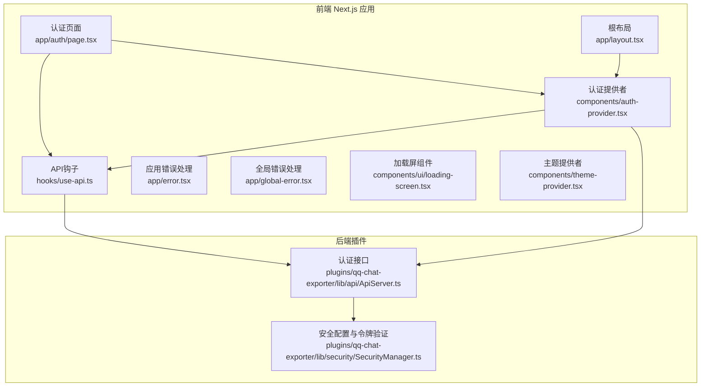
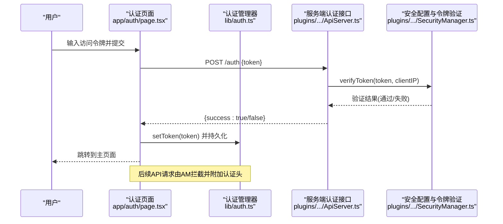
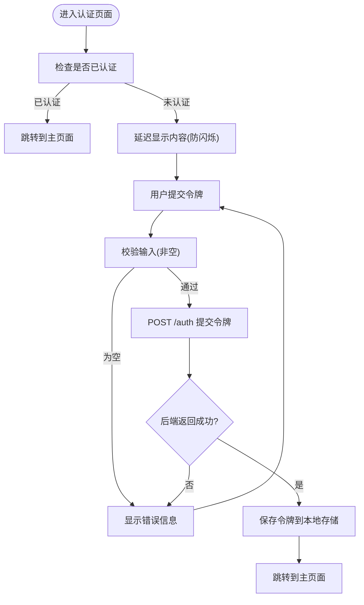
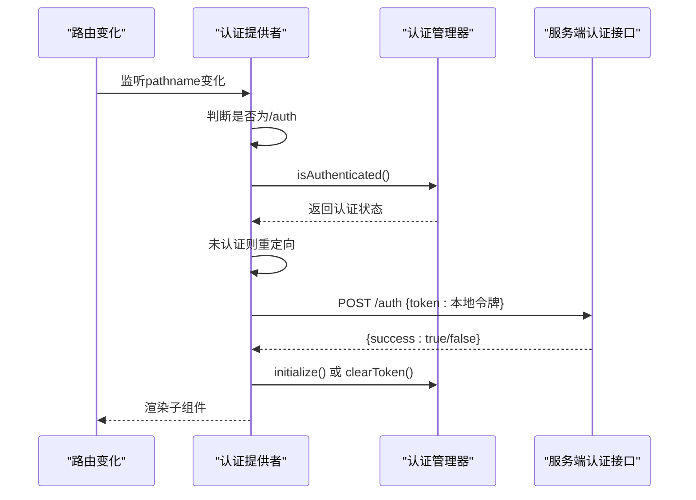
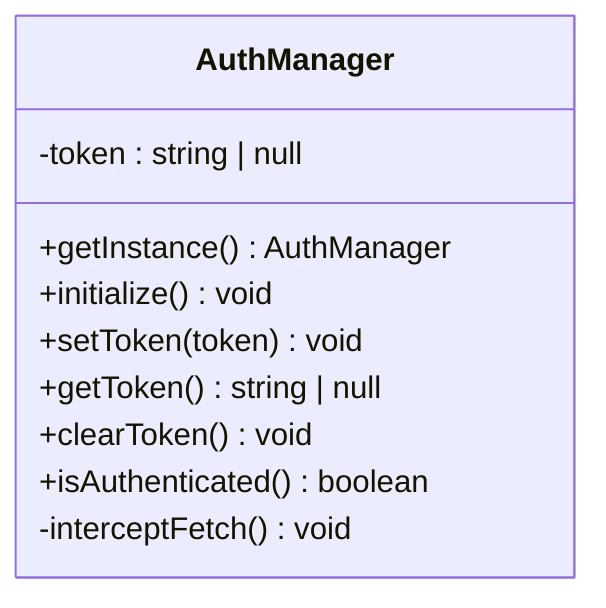
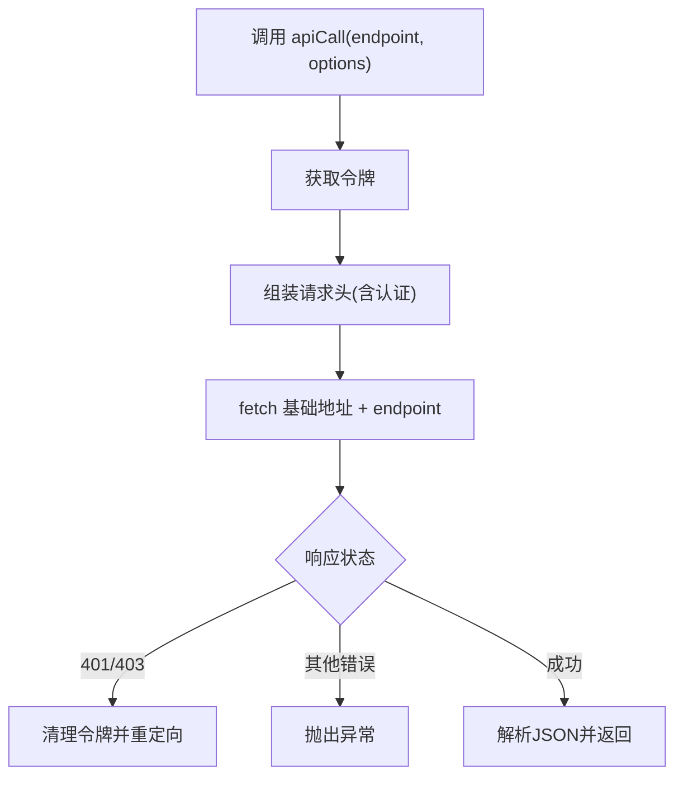
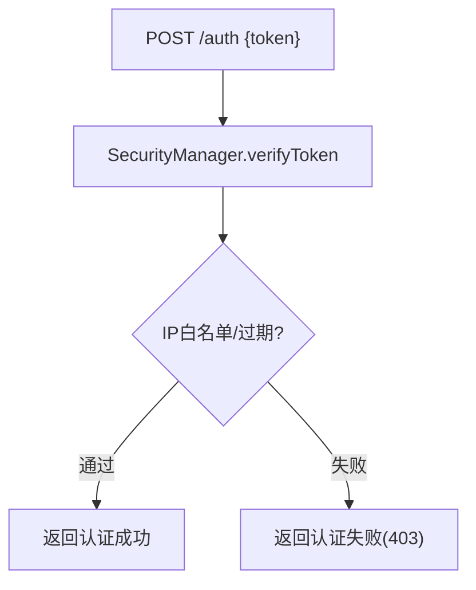
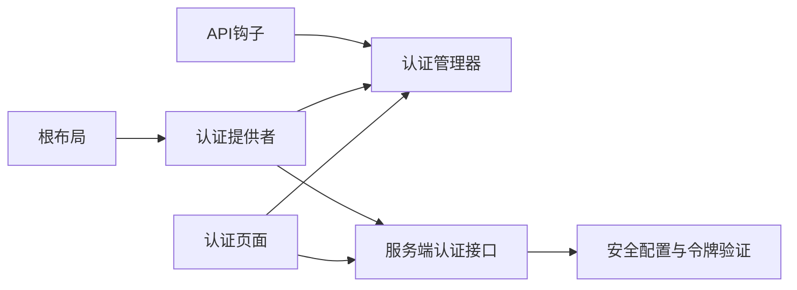
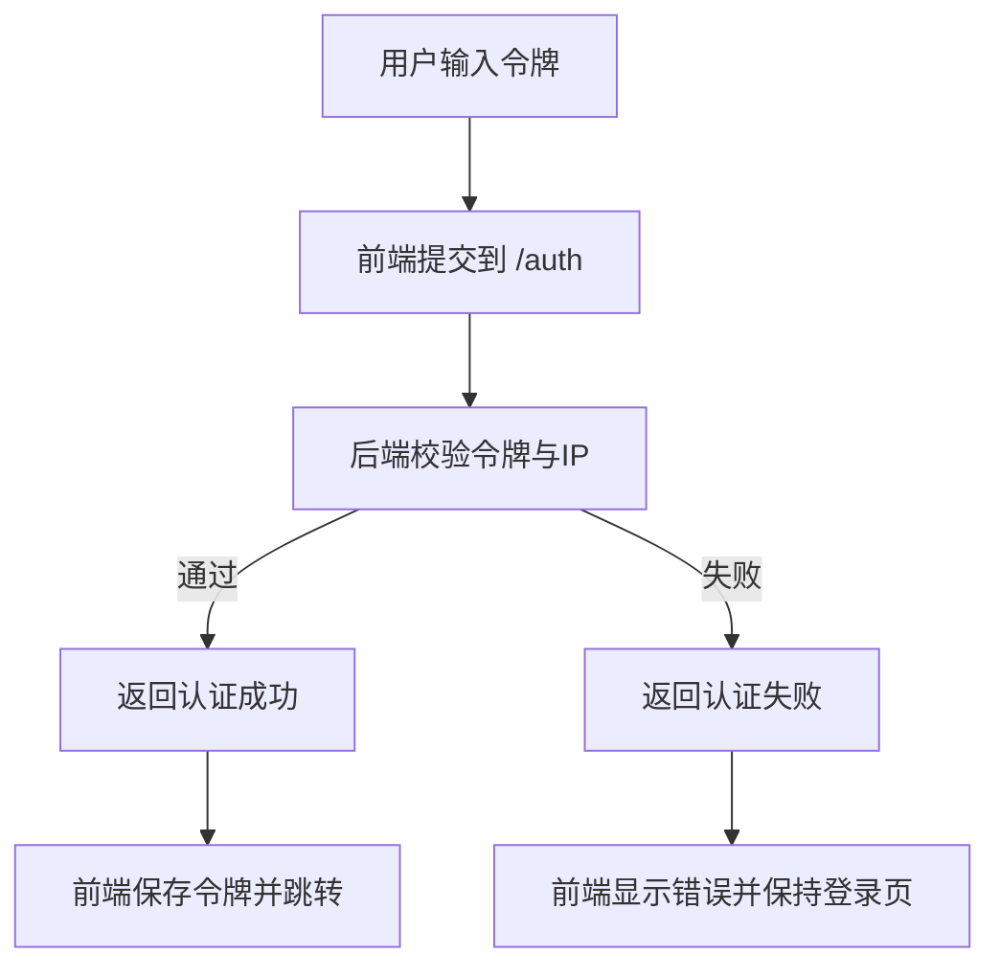

# 认证页面

<cite>
**本文档引用的文件**
- [认证页面](file://qce-v4-tool/app/auth/page.tsx)
- [认证管理器](file://qce-v4-tool/lib/auth.ts)
- [认证提供者](file://qce-v4-tool/components/auth-provider.tsx)
- [API钩子](file://qce-v4-tool/hooks/use-api.ts)
- [根布局](file://qce-v4-tool/app/layout.tsx)
- [API类型定义](file://qce-v4-tool/types/api.ts)
- [服务端认证接口](file://plugins/qq-chat-exporter/lib/api/ApiServer.ts)
- [安全配置与令牌验证](file://plugins/qq-chat-exporter/lib/security/SecurityManager.ts)
- [全局错误处理](file://qce-v4-tool/app/global-error.tsx)
- [应用错误处理](file://qce-v4-tool/app/error.tsx)
- [加载屏组件](file://qce-v4-tool/components/ui/loading-screen.tsx)
- [主题提供者](file://qce-v4-tool/components/theme-provider.tsx)
</cite>

## 目录
1. [简介](#简介)
2. [项目结构](#项目结构)
3. [核心组件](#核心组件)
4. [架构总览](#架构总览)
5. [详细组件分析](#详细组件分析)
6. [依赖关系分析](#依赖关系分析)
7. [性能考量](#性能考量)
8. [故障排除指南](#故障排除指南)
9. [结论](#结论)
10. [附录](#附录)

## 简介
本文件面向“认证页面”的实现进行深入技术文档化，覆盖登录界面设计、认证状态管理、安全验证机制、数据流与状态管理、错误处理策略、组件状态提升与上下文提供者模式、本地存储管理、安全性考虑、会话管理策略以及用户体验优化。同时提供扩展开发与自定义认证方式的实现指南。

## 项目结构
认证相关代码主要分布在前端 Next.js 应用与后端插件两部分：
- 前端：认证页面、认证提供者、API钩子、布局与错误处理
- 后端：认证验证接口、安全配置与令牌校验逻辑

**图表来源**
- [认证页面](file://qce-v4-tool/app/auth/page.tsx#L1-L238)
- [认证提供者](file://qce-v4-tool/components/auth-provider.tsx#L1-L90)
- [API钩子](file://qce-v4-tool/hooks/use-api.ts#L1-L70)
- [根布局](file://qce-v4-tool/app/layout.tsx#L1-L69)
- [应用错误处理](file://qce-v4-tool/app/error.tsx#L1-L129)
- [全局错误处理](file://qce-v4-tool/app/global-error.tsx#L1-L190)
- [加载屏组件](file://qce-v4-tool/components/ui/loading-screen.tsx#L1-L68)
- [主题提供者](file://qce-v4-tool/components/theme-provider.tsx#L1-L12)
- [服务端认证接口](file://plugins/qq-chat-exporter/lib/api/ApiServer.ts#L818-L838)
- [安全配置与令牌验证](file://plugins/qq-chat-exporter/lib/security/SecurityManager.ts#L331-L374)

**章节来源**
- [认证页面](file://qce-v4-tool/app/auth/page.tsx#L1-L238)
- [认证提供者](file://qce-v4-tool/components/auth-provider.tsx#L1-L90)
- [API钩子](file://qce-v4-tool/hooks/use-api.ts#L1-L70)
- [根布局](file://qce-v4-tool/app/layout.tsx#L1-L69)
- [服务端认证接口](file://plugins/qq-chat-exporter/lib/api/ApiServer.ts#L818-L838)
- [安全配置与令牌验证](file://plugins/qq-chat-exporter/lib/security/SecurityManager.ts#L331-L374)

## 核心组件
- 认证页面：负责展示登录表单、令牌输入、帮助弹窗、动画过渡与错误提示。
- 认证提供者：在客户端侧进行认证检查、令牌有效性验证、fetch拦截器初始化与重定向。
- 认证管理器：单例模式管理令牌的本地存储、获取、清理与fetch拦截逻辑。
- API钩子：统一发起API请求，自动附加认证头，处理401/403并触发重定向。
- 根布局：注入认证提供者与加载提供者，确保认证在应用顶层生效。
- 服务端认证接口：接收前端令牌，调用安全模块验证，返回认证结果。
- 安全配置与令牌验证：生成/轮换令牌、IP白名单、过期控制与配置热加载。

**章节来源**
- [认证页面](file://qce-v4-tool/app/auth/page.tsx#L1-L238)
- [认证提供者](file://qce-v4-tool/components/auth-provider.tsx#L1-L90)
- [认证管理器](file://qce-v4-tool/lib/auth.ts#L1-L123)
- [API钩子](file://qce-v4-tool/hooks/use-api.ts#L1-L70)
- [根布局](file://qce-v4-tool/app/layout.tsx#L1-L69)
- [服务端认证接口](file://plugins/qq-chat-exporter/lib/api/ApiServer.ts#L818-L838)
- [安全配置与令牌验证](file://plugins/qq-chat-exporter/lib/security/SecurityManager.ts#L331-L374)

## 架构总览
认证系统采用“前端令牌 + 后端安全验证 + 前端fetch拦截”的三层协作模式：
- 前端令牌：用户输入访问令牌，本地持久化，随请求自动附加。
- 后端验证：服务端对令牌进行校验，支持IP白名单与过期控制。
- 前端拦截：统一拦截API请求，自动添加认证头；遇到401/403自动清理令牌并重定向至登录页。

**图表来源**
- [认证页面](file://qce-v4-tool/app/auth/page.tsx#L25-L56)
- [认证管理器](file://qce-v4-tool/lib/auth.ts#L50-L120)
- [服务端认证接口](file://plugins/qq-chat-exporter/lib/api/ApiServer.ts#L818-L838)
- [安全配置与令牌验证](file://plugins/qq-chat-exporter/lib/security/SecurityManager.ts#L331-L374)

## 详细组件分析

### 认证页面（登录界面）
- 状态管理：本地状态包括令牌值、错误信息、加载状态、显示/隐藏令牌、帮助弹窗开关、就绪状态。
- 表单交互：防重复提交、空值校验、提交时发送POST请求到后端认证接口。
- 错误处理：捕获网络异常与后端错误响应，显示用户可读的错误信息。
- 动画与体验：首次加载与内容切换使用动画过渡，帮助弹窗采用模态对话框。
- 令牌可见性：支持切换明文/密码模式查看令牌。
- 自动跳转：认证成功后跳转到主页面。

**图表来源**
- [认证页面](file://qce-v4-tool/app/auth/page.tsx#L16-L56)

**章节来源**
- [认证页面](file://qce-v4-tool/app/auth/page.tsx#L1-L238)

### 认证提供者（客户端认证检查与拦截）
- 路径判断：对/auth路径直接放行，避免循环重定向。
- 认证检查：若无本地令牌，进入重定向状态并跳转到登录页。
- 令牌有效性验证：向后端再次验证本地令牌，解决“独立模式遗留假令牌”问题。
- fetch拦截：初始化拦截器，自动为API请求添加认证头；遇到401/403自动清理令牌并重定向。
- 网络异常处理：当后端不可达时，仍初始化拦截器并允许继续，后续请求由拦截器统一处理。

**图表来源**
- [认证提供者](file://qce-v4-tool/components/auth-provider.tsx#L17-L71)
- [认证管理器](file://qce-v4-tool/lib/auth.ts#L28-L120)
- [服务端认证接口](file://plugins/qq-chat-exporter/lib/api/ApiServer.ts#L818-L838)

**章节来源**
- [认证提供者](file://qce-v4-tool/components/auth-provider.tsx#L1-L90)

### 认证管理器（单例模式与本地存储）
- 单例：getInstance保证全局唯一实例，构造时从localStorage加载令牌。
- 令牌管理：setToken/clearToken/getToken，统一写入/删除localStorage。
- 认证初始化：initialize检查URL参数，必要时清除token参数；拦截fetch。
- fetch拦截：对相对路径或同域API请求自动添加Authorization与X-Access-Token；处理401/403并重定向。
- URL参数处理：从URL查询参数提取token并清理历史痕迹，避免分享链接泄露。

**图表来源**
- [认证管理器](file://qce-v4-tool/lib/auth.ts#L7-L123)

**章节来源**
- [认证管理器](file://qce-v4-tool/lib/auth.ts#L1-L123)

### API钩子（统一请求与错误处理）
- 统一入口：useApi封装API调用，自动拼接基础地址与附加认证头。
- 请求头：为每个请求添加Content-Type与X-Request-ID，若存在令牌则附加Authorization与X-Access-Token。
- 错误处理：对401/403主动清理令牌并重定向；对其他错误抛出异常。
- 下载支持：提供下载文件能力，成功时触发浏览器下载。

**图表来源**
- [API钩子](file://qce-v4-tool/hooks/use-api.ts#L7-L47)

**章节来源**
- [API钩子](file://qce-v4-tool/hooks/use-api.ts#L1-L70)

### 根布局（提供者注入与主题）
- 注入顺序：AuthProvider -> LoadingProvider -> 子组件树。
- 主题系统：通过ThemeProvider提供暗/亮主题切换能力。
- 防水合错：通过脚本修复浏览器翻译导致的DOM操作异常，减少hydration错误。

**章节来源**
- [根布局](file://qce-v4-tool/app/layout.tsx#L1-L69)
- [主题提供者](file://qce-v4-tool/components/theme-provider.tsx#L1-L12)

### 服务端认证接口与安全配置
- 认证端点：POST /auth，校验令牌与可选IP白名单，返回认证结果。
- 安全验证：verifyToken综合比较令牌、IP白名单、过期时间，更新最后访问时间。
- 配置管理：生成/轮换令牌、IP白名单增删、禁用IP白名单、配置热加载、Docker环境适配。

**图表来源**
- [服务端认证接口](file://plugins/qq-chat-exporter/lib/api/ApiServer.ts#L818-L838)
- [安全配置与令牌验证](file://plugins/qq-chat-exporter/lib/security/SecurityManager.ts#L331-L374)

**章节来源**
- [服务端认证接口](file://plugins/qq-chat-exporter/lib/api/ApiServer.ts#L818-L838)
- [安全配置与令牌验证](file://plugins/qq-chat-exporter/lib/security/SecurityManager.ts#L331-L374)

## 依赖关系分析
- 认证页面依赖认证管理器进行令牌持久化与fetch拦截初始化。
- 认证提供者依赖认证管理器进行认证检查与令牌验证。
- API钩子依赖认证管理器获取令牌并统一附加认证头。
- 根布局注入认证提供者，确保认证在应用顶层生效。
- 服务端认证接口依赖安全配置模块完成令牌与IP校验。

**图表来源**
- [认证页面](file://qce-v4-tool/app/auth/page.tsx#L6-L18)
- [认证提供者](file://qce-v4-tool/components/auth-provider.tsx#L5-L27)
- [API钩子](file://qce-v4-tool/hooks/use-api.ts#L3-L11)
- [根布局](file://qce-v4-tool/app/layout.tsx#L5-L6)
- [服务端认证接口](file://plugins/qq-chat-exporter/lib/api/ApiServer.ts#L818-L838)
- [安全配置与令牌验证](file://plugins/qq-chat-exporter/lib/security/SecurityManager.ts#L331-L374)

**章节来源**
- [认证页面](file://qce-v4-tool/app/auth/page.tsx#L1-L238)
- [认证提供者](file://qce-v4-tool/components/auth-provider.tsx#L1-L90)
- [API钩子](file://qce-v4-tool/hooks/use-api.ts#L1-L70)
- [根布局](file://qce-v4-tool/app/layout.tsx#L1-L69)
- [服务端认证接口](file://plugins/qq-chat-exporter/lib/api/ApiServer.ts#L818-L838)
- [安全配置与令牌验证](file://plugins/qq-chat-exporter/lib/security/SecurityManager.ts#L331-L374)

## 性能考量
- 首次渲染优化：认证页面与认证提供者均使用动画过渡与延迟显示，避免闪烁与不必要的重排。
- 请求拦截：统一在fetch层处理认证头与错误，减少重复代码与分支判断。
- 配置热加载：安全配置文件监听与去抖动，降低频繁I/O带来的性能损耗。
- 令牌持久化：localStorage读写在构造函数与初始化阶段完成，避免频繁写入。
- 错误处理：401/403即时清理令牌并重定向，避免无效请求堆积。

[本节为通用性能建议，无需特定文件引用]

## 故障排除指南
- 无法连接到服务器：前端提示“无法连接到服务器，请确保 NapCat 正在运行”，检查后端服务状态。
- 令牌验证失败：后端返回错误，前端显示“令牌验证失败”，确认令牌正确且未过期。
- 401/403错误：前端拦截器自动清理令牌并重定向至登录页，检查令牌有效性与IP白名单配置。
- 浏览器翻译导致的hydration错误：根布局内嵌脚本修复DOM操作异常，避免React在翻译后操作被移除节点。
- 全局错误与应用错误：提供友好的错误页面与反馈按钮，便于收集问题信息。

**章节来源**
- [认证页面](file://qce-v4-tool/app/auth/page.tsx#L48-L55)
- [认证管理器](file://qce-v4-tool/lib/auth.ts#L108-L119)
- [全局错误处理](file://qce-v4-tool/app/global-error.tsx#L1-L190)
- [应用错误处理](file://qce-v4-tool/app/error.tsx#L1-L129)

## 结论
该认证系统通过“前端令牌 + 后端安全验证 + 前端拦截”的组合，实现了简洁可靠的认证流程。前端负责用户体验与本地状态管理，后端负责安全策略与配置管理，两者配合确保了安全性与可用性的平衡。通过提供者模式与钩子抽象，系统具备良好的可维护性与扩展性。

[本节为总结性内容，无需特定文件引用]

## 附录

### 认证流程数据流图

**图表来源**
- [认证页面](file://qce-v4-tool/app/auth/page.tsx#L25-L56)
- [服务端认证接口](file://plugins/qq-chat-exporter/lib/api/ApiServer.ts#L818-L838)

### 安全性考虑与会话管理策略
- 令牌生成：复杂随机字符串，定期轮换，支持手动再生。
- IP白名单：支持精确匹配、CIDR网段与通配符，可禁用以适配Docker环境。
- 过期控制：令牌带过期时间，过期后自动轮换。
- 配置热加载：安全配置文件变更后自动加载，无需重启。
- 会话清理：401/403自动清理本地令牌并重定向，避免会话残留。

**章节来源**
- [安全配置与令牌验证](file://plugins/qq-chat-exporter/lib/security/SecurityManager.ts#L238-L291)
- [安全配置与令牌验证](file://plugins/qq-chat-exporter/lib/security/SecurityManager.ts#L331-L374)
- [认证管理器](file://qce-v4-tool/lib/auth.ts#L108-L119)

### 用户体验优化
- 动画过渡：页面切换与帮助弹窗使用流畅动画，提升感知质量。
- 令牌可见性：支持明文/密码模式切换，便于用户核对令牌。
- 帮助引导：提供“如何获取令牌”的详细说明与示例。
- 错误友好：错误页面提供重试与反馈按钮，便于问题上报。

**章节来源**
- [认证页面](file://qce-v4-tool/app/auth/page.tsx#L168-L234)
- [应用错误处理](file://qce-v4-tool/app/error.tsx#L77-L128)

### 扩展开发与自定义认证方式指南
- 新增认证方式：可在前端新增认证页面与提供者逻辑，后端新增认证端点与安全验证方法。
- 自定义拦截器：在认证管理器中扩展拦截逻辑，支持更多头部或中间件。
- 配置扩展：在安全配置模块中增加新字段与校验规则，保持向后兼容。
- 类型安全：在API类型定义中补充新接口的响应结构，确保前端类型安全。

**章节来源**
- [API类型定义](file://qce-v4-tool/types/api.ts#L1-L15)
- [认证管理器](file://qce-v4-tool/lib/auth.ts#L84-L120)
- [安全配置与令牌验证](file://plugins/qq-chat-exporter/lib/security/SecurityManager.ts#L133-L200)