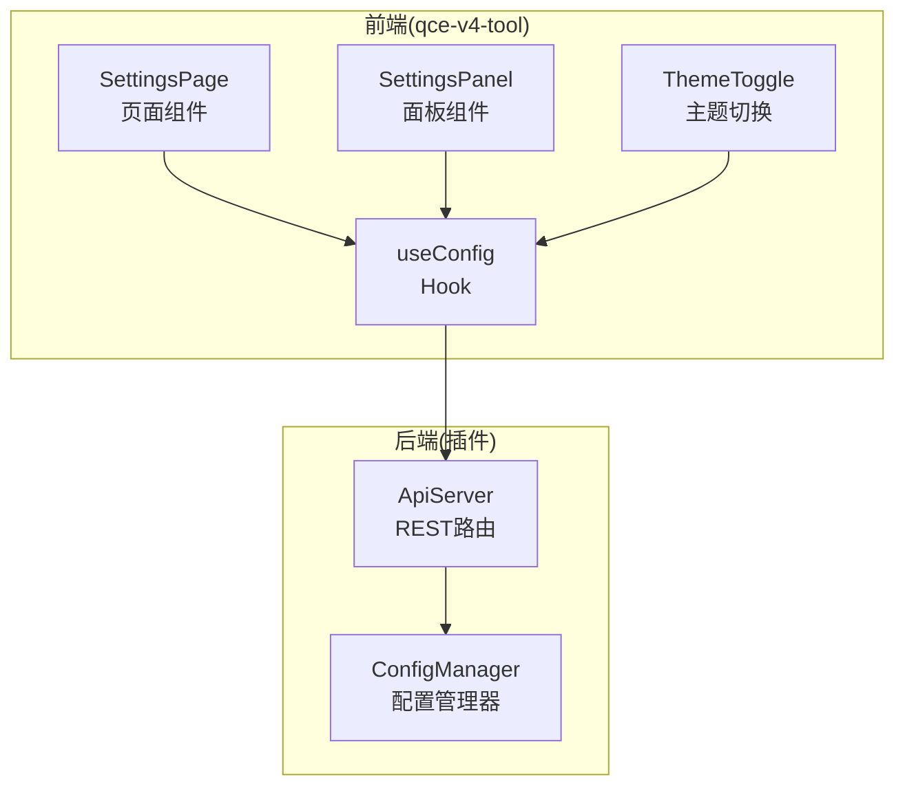
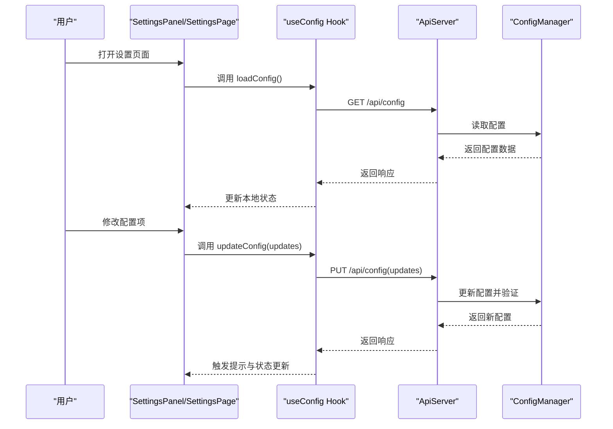
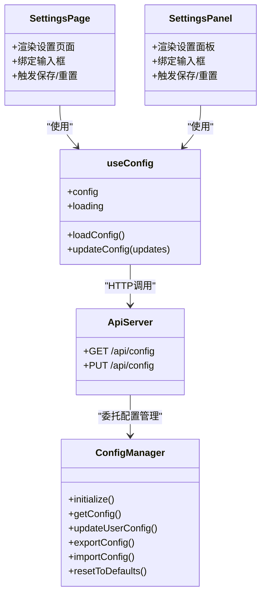

# 设置页面

<cite>
**本文引用的文件**
- [qce-v4-tool/app/settings/page.tsx](file://qce-v4-tool/app/settings/page.tsx)
- [qce-v4-tool/components/ui/settings-panel.tsx](file://qce-v4-tool/components/ui/settings-panel.tsx)
- [qce-v4-tool/hooks/use-config.ts](file://qce-v4-tool/hooks/use-config.ts)
- [plugins/qq-chat-exporter/lib/core/storage/ConfigManager.ts](file://plugins/qq-chat-exporter/lib/core/storage/ConfigManager.ts)
- [plugins/qq-chat-exporter/lib/api/ApiServer.ts](file://plugins/qq-chat-exporter/lib/api/ApiServer.ts)
- [plugins/qq-chat-exporter/lib/types/index.ts](file://plugins/qq-chat-exporter/lib/types/index.ts)
- [qce-v4-tool/components/qce-dashboard/theme-toggle.tsx](file://qce-v4-tool/components/qce-dashboard/theme-toggle.tsx)
- [qce-v4-tool/lib/version.ts](file://qce-v4-tool/lib/version.ts)
</cite>

## 目录
1. [简介](#简介)
2. [项目结构](#项目结构)
3. [核心组件](#核心组件)
4. [架构总览](#架构总览)
5. [详细组件分析](#详细组件分析)
6. [依赖关系分析](#依赖关系分析)
7. [性能考虑](#性能考虑)
8. [故障排除指南](#故障排除指南)
9. [结论](#结论)
10. [附录](#附录)

## 简介
本文件面向“设置页面”的设计与实现，系统性阐述配置管理界面的布局、配置项分类与用户交互；说明设置数据的持久化机制、配置验证规则与默认值管理；解释设置项的动态加载、实时预览与批量应用能力；并覆盖配置导入导出、重置恢复与版本兼容性处理。最后提供设置扩展开发与新增配置项的实现指南，帮助开发者在现有架构上安全地扩展配置体系。

## 项目结构
设置页面位于前端 Next.js 应用中，采用客户端组件与自定义 Hook 协同工作的方式，通过 API 与后端配置管理器交互。后端由 TypeScript 编写的配置管理器负责系统与用户配置的加载、校验、持久化与变更通知；同时提供 REST API 路由以支持前端读取与更新配置。

图表来源
- [qce-v4-tool/app/settings/page.tsx](file://qce-v4-tool/app/settings/page.tsx#L1-L124)
- [qce-v4-tool/components/ui/settings-panel.tsx](file://qce-v4-tool/components/ui/settings-panel.tsx#L1-L171)
- [qce-v4-tool/hooks/use-config.ts](file://qce-v4-tool/hooks/use-config.ts#L1-L73)
- [plugins/qq-chat-exporter/lib/api/ApiServer.ts](file://plugins/qq-chat-exporter/lib/api/ApiServer.ts#L1016-L1045)
- [plugins/qq-chat-exporter/lib/core/storage/ConfigManager.ts](file://plugins/qq-chat-exporter/lib/core/storage/ConfigManager.ts#L126-L162)

章节来源
- [qce-v4-tool/app/settings/page.tsx](file://qce-v4-tool/app/settings/page.tsx#L1-L124)
- [qce-v4-tool/components/ui/settings-panel.tsx](file://qce-v4-tool/components/ui/settings-panel.tsx#L1-L171)
- [qce-v4-tool/hooks/use-config.ts](file://qce-v4-tool/hooks/use-config.ts#L1-L73)
- [plugins/qq-chat-exporter/lib/api/ApiServer.ts](file://plugins/qq-chat-exporter/lib/api/ApiServer.ts#L1016-L1045)
- [plugins/qq-chat-exporter/lib/core/storage/ConfigManager.ts](file://plugins/qq-chat-exporter/lib/core/storage/ConfigManager.ts#L126-L162)

## 核心组件
- 页面组件 SettingsPage：提供完整的设置页面布局与交互，包含默认导出路径与定时导出路径的输入框、保存与重置按钮以及使用说明卡片。
- 面板组件 SettingsPanel：用于仪表板场景的轻量设置面板，具备相同的配置项与交互逻辑。
- Hook useConfig：封装配置的加载与更新，提供 loading 状态、配置数据与更新方法；内部通过 API 调用与后端通信。
- 配置管理器 ConfigManager：负责系统配置与用户配置的加载、合并默认值、环境变量覆盖、验证、持久化与变更通知；支持导出/导入配置、重置默认值。
- API 路由 /api/config：提供 GET（读取）与 PUT（更新）两个端点，供前端读取与更新配置。
- 主题切换 ThemeToggle：与设置页面协同，提供明暗主题切换与系统跟随模式。

章节来源
- [qce-v4-tool/app/settings/page.tsx](file://qce-v4-tool/app/settings/page.tsx#L11-L123)
- [qce-v4-tool/components/ui/settings-panel.tsx](file://qce-v4-tool/components/ui/settings-panel.tsx#L12-L169)
- [qce-v4-tool/hooks/use-config.ts](file://qce-v4-tool/hooks/use-config.ts#L12-L71)
- [plugins/qq-chat-exporter/lib/core/storage/ConfigManager.ts](file://plugins/qq-chat-exporter/lib/core/storage/ConfigManager.ts#L98-L124)
- [plugins/qq-chat-exporter/lib/api/ApiServer.ts](file://plugins/qq-chat-exporter/lib/api/ApiServer.ts#L1016-L1045)
- [qce-v4-tool/components/qce-dashboard/theme-toggle.tsx](file://qce-v4-tool/components/qce-dashboard/theme-toggle.tsx#L9-L36)

## 架构总览
设置页面的前后端交互遵循“前端 Hook -> 后端 API -> 配置管理器 -> 文件系统”的链路。前端通过 useConfig Hook 统一管理配置状态与操作；后端 ApiServer 提供 /api/config 路由；ConfigManager 负责配置的验证、持久化与变更通知。

图表来源
- [qce-v4-tool/components/ui/settings-panel.tsx](file://qce-v4-tool/components/ui/settings-panel.tsx#L19-L50)
- [qce-v4-tool/app/settings/page.tsx](file://qce-v4-tool/app/settings/page.tsx#L16-L39)
- [qce-v4-tool/hooks/use-config.ts](file://qce-v4-tool/hooks/use-config.ts#L17-L64)
- [plugins/qq-chat-exporter/lib/api/ApiServer.ts](file://plugins/qq-chat-exporter/lib/api/ApiServer.ts#L1016-L1045)
- [plugins/qq-chat-exporter/lib/core/storage/ConfigManager.ts](file://plugins/qq-chat-exporter/lib/core/storage/ConfigManager.ts#L437-L482)

## 详细组件分析

### 设置页面布局与交互
- 布局结构：页面顶部包含标题与描述；主体分为“导出路径设置”与“使用说明”两个卡片式区域；底部提供保存与重置按钮。
- 交互逻辑：首次进入页面自动加载配置；用户修改输入框后根据差异状态启用保存按钮；保存成功后触发全局提示；重置按钮将输入框回滚至当前配置值。
- 实时预览：在输入框下方展示当前实际生效的导出目录，便于用户确认修改效果。

章节来源
- [qce-v4-tool/app/settings/page.tsx](file://qce-v4-tool/app/settings/page.tsx#L41-L123)
- [qce-v4-tool/components/ui/settings-panel.tsx](file://qce-v4-tool/components/ui/settings-panel.tsx#L60-L169)

### 配置项分类与字段说明
- 默认导出路径：用于新建导出任务时的默认保存位置，支持留空使用默认路径。
- 定时导出路径：用于定时备份任务的默认保存位置，支持留空使用默认路径。
- 当前路径显示：在输入框下方显示当前实际使用的导出目录，便于用户确认。

章节来源
- [qce-v4-tool/app/settings/page.tsx](file://qce-v4-tool/app/settings/page.tsx#L62-L93)
- [qce-v4-tool/components/ui/settings-panel.tsx](file://qce-v4-tool/components/ui/settings-panel.tsx#L109-L159)

### 数据持久化机制
- 前端持久化：前端仅维护本地状态，不直接写入文件系统；保存操作通过 API 将更新提交至后端。
- 后端持久化：后端 ConfigManager 将配置写入用户主目录下的配置文件；系统配置与用户配置分别存储于不同文件，避免相互覆盖。
- 变更通知：配置更新后通过监听器通知订阅者，确保系统其他模块同步最新配置。

章节来源
- [plugins/qq-chat-exporter/lib/core/storage/ConfigManager.ts](file://plugins/qq-chat-exporter/lib/core/storage/ConfigManager.ts#L167-L200)
- [plugins/qq-chat-exporter/lib/core/storage/ConfigManager.ts](file://plugins/qq-chat-exporter/lib/core/storage/ConfigManager.ts#L237-L250)
- [plugins/qq-chat-exporter/lib/core/storage/ConfigManager.ts](file://plugins/qq-chat-exporter/lib/core/storage/ConfigManager.ts#L575-L602)

### 配置验证规则与默认值管理
- 默认值：系统配置与用户配置均提供默认值集合；首次运行或缺失字段时自动回退到默认值。
- 验证规则：对数值范围、整数约束、端口范围等进行严格校验；超出范围或类型不符将抛出验证错误。
- 环境变量覆盖：支持通过环境变量对部分系统配置进行覆盖，便于容器化部署与运维调优。

章节来源
- [plugins/qq-chat-exporter/lib/core/storage/ConfigManager.ts](file://plugins/qq-chat-exporter/lib/core/storage/ConfigManager.ts#L26-L84)
- [plugins/qq-chat-exporter/lib/core/storage/ConfigManager.ts](file://plugins/qq-chat-exporter/lib/core/storage/ConfigManager.ts#L282-L304)
- [plugins/qq-chat-exporter/lib/core/storage/ConfigManager.ts](file://plugins/qq-chat-exporter/lib/core/storage/ConfigManager.ts#L255-L277)

### 动态加载、实时预览与批量应用
- 动态加载：页面挂载时自动调用加载配置；输入框值与当前配置保持同步。
- 实时预览：在输入框下方显示当前实际导出目录，便于用户确认修改。
- 批量应用：当前设置页面聚焦于导出路径的单项更新；若需多配置项联动，可在前端组合多个更新请求并在后端统一校验与保存。

章节来源
- [qce-v4-tool/app/settings/page.tsx](file://qce-v4-tool/app/settings/page.tsx#L16-L25)
- [qce-v4-tool/components/ui/settings-panel.tsx](file://qce-v4-tool/components/ui/settings-panel.tsx#L19-L37)

### 配置导入导出、重置恢复与版本兼容性
- 导入导出：支持将系统配置与用户配置整体导出为文件，包含导出时间与版本标记；导入时进行完整校验，失败则回滚。
- 重置恢复：提供重置为默认配置的能力，确保异常配置快速恢复。
- 版本兼容：前端版本管理支持构建时注入与运行时 API 获取，检查版本一致性，避免跨版本配置不兼容导致的问题。

章节来源
- [plugins/qq-chat-exporter/lib/core/storage/ConfigManager.ts](file://plugins/qq-chat-exporter/lib/core/storage/ConfigManager.ts#L500-L573)
- [plugins/qq-chat-exporter/lib/core/storage/ConfigManager.ts](file://plugins/qq-chat-exporter/lib/core/storage/ConfigManager.ts#L487-L497)
- [qce-v4-tool/lib/version.ts](file://qce-v4-tool/lib/version.ts#L1-L36)

### 设置扩展开发与新增配置项指南
- 新增配置项步骤
  1) 在类型定义中声明新字段：参考用户配置接口，添加新字段并设定默认值。
  2) 在前端页面中增加输入控件：在设置页面或面板中添加对应输入框，并绑定到本地状态。
  3) 在 Hook 中暴露更新方法：在 useConfig 中扩展 updateConfig 的参数与调用逻辑。
  4) 在后端 API 中处理更新：在 /api/config 的 PUT 路由中接收并转发到 ConfigManager。
  5) 在 ConfigManager 中合并默认值与校验：在加载与更新流程中处理新字段，确保默认值与验证规则一致。
  6) 在导入导出中包含新字段：确保导出数据包含新字段，导入时进行兼容性处理。
  7) 在主题/版本等子系统中同步：如涉及主题或版本控制，按现有模式集成。
- 最佳实践
  - 保持默认值与验证规则的一致性，避免运行时异常。
  - 对敏感配置（如密码）采用安全存储与传输策略。
  - 对批量更新场景，建议在后端进行事务式校验与保存，失败时整体回滚。

章节来源
- [plugins/qq-chat-exporter/lib/types/index.ts](file://plugins/qq-chat-exporter/lib/types/index.ts#L41-L84)
- [qce-v4-tool/hooks/use-config.ts](file://qce-v4-tool/hooks/use-config.ts#L32-L64)
- [plugins/qq-chat-exporter/lib/api/ApiServer.ts](file://plugins/qq-chat-exporter/lib/api/ApiServer.ts#L1016-L1045)
- [plugins/qq-chat-exporter/lib/core/storage/ConfigManager.ts](file://plugins/qq-chat-exporter/lib/core/storage/ConfigManager.ts#L167-L200)
- [plugins/qq-chat-exporter/lib/core/storage/ConfigManager.ts](file://plugins/qq-chat-exporter/lib/core/storage/ConfigManager.ts#L437-L482)

## 依赖关系分析
设置页面与后端配置管理器之间通过 API 进行松耦合交互，前端仅依赖约定的数据结构与 HTTP 接口；后端 ConfigManager 负责严格的配置生命周期管理。

图表来源
- [qce-v4-tool/app/settings/page.tsx](file://qce-v4-tool/app/settings/page.tsx#L11-L123)
- [qce-v4-tool/components/ui/settings-panel.tsx](file://qce-v4-tool/components/ui/settings-panel.tsx#L12-L169)
- [qce-v4-tool/hooks/use-config.ts](file://qce-v4-tool/hooks/use-config.ts#L12-L71)
- [plugins/qq-chat-exporter/lib/api/ApiServer.ts](file://plugins/qq-chat-exporter/lib/api/ApiServer.ts#L1016-L1045)
- [plugins/qq-chat-exporter/lib/core/storage/ConfigManager.ts](file://plugins/qq-chat-exporter/lib/core/storage/ConfigManager.ts#L98-L162)

章节来源
- [qce-v4-tool/app/settings/page.tsx](file://qce-v4-tool/app/settings/page.tsx#L11-L123)
- [qce-v4-tool/components/ui/settings-panel.tsx](file://qce-v4-tool/components/ui/settings-panel.tsx#L12-L169)
- [qce-v4-tool/hooks/use-config.ts](file://qce-v4-tool/hooks/use-config.ts#L12-L71)
- [plugins/qq-chat-exporter/lib/api/ApiServer.ts](file://plugins/qq-chat-exporter/lib/api/ApiServer.ts#L1016-L1045)
- [plugins/qq-chat-exporter/lib/core/storage/ConfigManager.ts](file://plugins/qq-chat-exporter/lib/core/storage/ConfigManager.ts#L98-L162)

## 性能考虑
- 前端性能
  - 使用 React 状态与 useEffect 控制加载时机，避免重复请求。
  - 输入框变更采用本地状态缓存，减少不必要的网络请求。
- 后端性能
  - 配置文件读写采用异步 I/O，避免阻塞主线程。
  - 验证阶段尽早失败，减少无效写入。
- 网络与并发
  - API 层限制请求体大小，防止过大负载。
  - 并发更新时通过临时配置与原子保存保证一致性。

[本节为通用指导，不直接分析具体文件]

## 故障排除指南
- 加载配置失败
  - 检查后端服务是否正常启动；查看 API 路由是否存在。
  - 查看浏览器控制台与网络面板，确认请求是否返回 2xx。
- 更新配置失败
  - 检查配置验证规则是否满足；确认传入参数类型与范围。
  - 查看后端日志中的错误堆栈，定位具体字段问题。
- 配置未生效
  - 确认前端已收到更新后的配置数据；检查本地状态是否同步。
  - 若涉及系统级配置（如端口），确认进程权限与端口占用情况。
- 导入/导出异常
  - 检查导出文件格式与版本标记；导入时若失败会自动回滚至备份配置。

章节来源
- [qce-v4-tool/hooks/use-config.ts](file://qce-v4-tool/hooks/use-config.ts#L25-L30)
- [qce-v4-tool/hooks/use-config.ts](file://qce-v4-tool/hooks/use-config.ts#L53-L64)
- [plugins/qq-chat-exporter/lib/core/storage/ConfigManager.ts](file://plugins/qq-chat-exporter/lib/core/storage/ConfigManager.ts#L557-L573)

## 结论
设置页面在前端提供了简洁直观的配置入口，结合后端 ConfigManager 的严格验证与持久化能力，实现了可靠的配置管理体系。通过统一的 API 接口与清晰的扩展指南，开发者可以安全地新增配置项并维持系统的稳定性与可维护性。

[本节为总结性内容，不直接分析具体文件]

## 附录
- API 定义概览
  - GET /api/config：返回当前配置数据（包含系统与用户配置）。
  - PUT /api/config：接收更新对象（如自定义导出路径），返回更新后的配置数据。
- 配置字段参考
  - 用户配置包含偏好格式、自动备份、主题、语言、资源链接策略、通知开关等。
  - 系统配置包含数据库路径、输出根目录、批大小、超时、重试次数、并发任务数、WebUI 端口等。

章节来源
- [plugins/qq-chat-exporter/lib/api/ApiServer.ts](file://plugins/qq-chat-exporter/lib/api/ApiServer.ts#L1016-L1045)
- [plugins/qq-chat-exporter/lib/types/index.ts](file://plugins/qq-chat-exporter/lib/types/index.ts#L41-L84)
- [plugins/qq-chat-exporter/lib/core/storage/ConfigManager.ts](file://plugins/qq-chat-exporter/lib/core/storage/ConfigManager.ts#L26-L84)