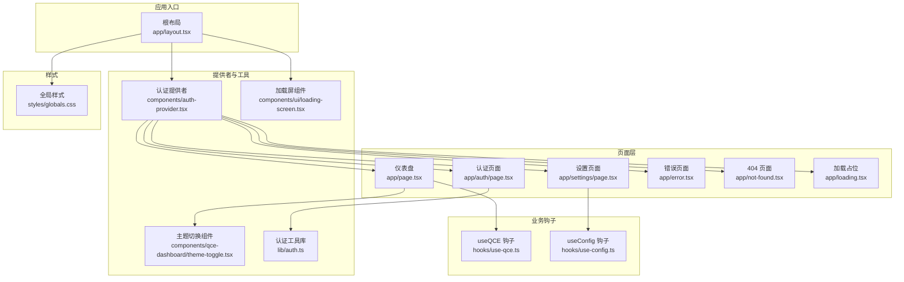
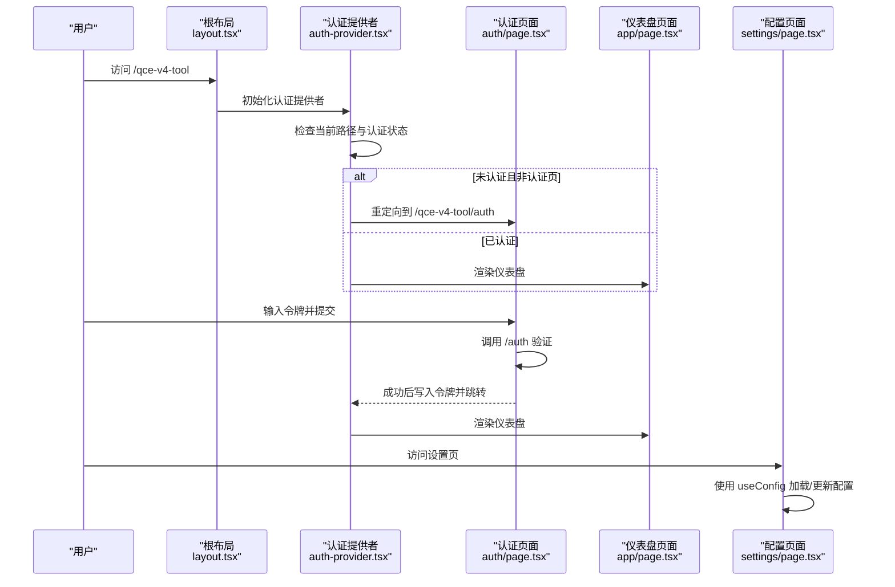
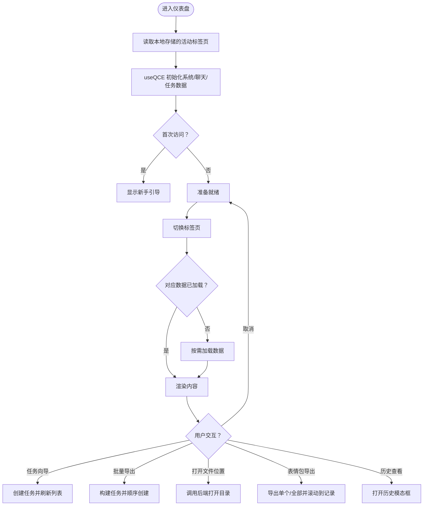
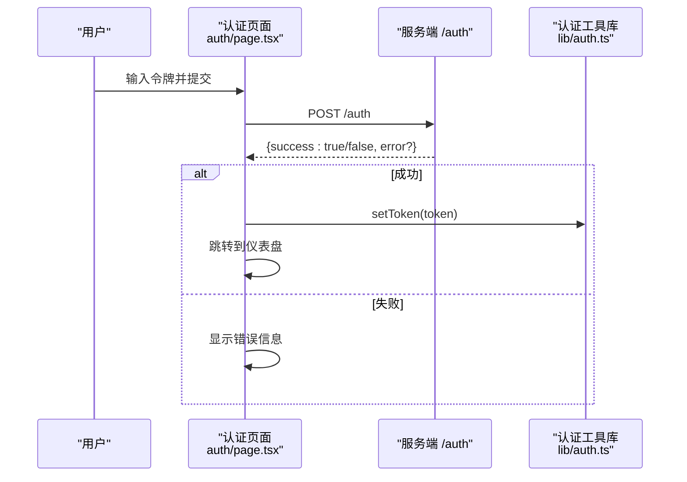
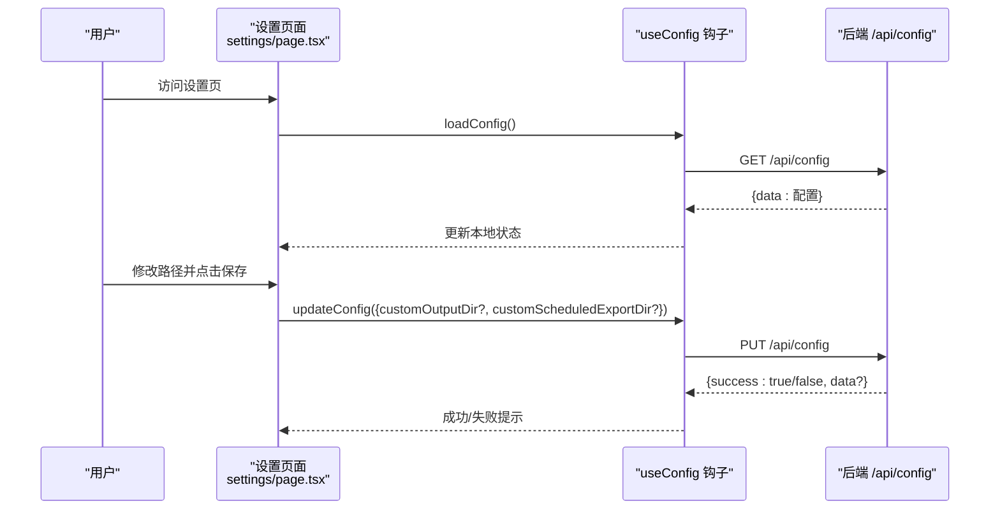
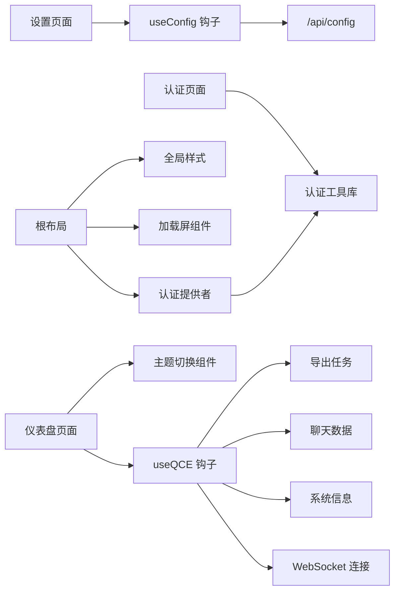

# 页面功能模块

<cite>
**本文引用的文件**
- [仪表盘页面](file://qce-v4-tool/app/page.tsx)
- [认证页面](file://qce-v4-tool/app/auth/page.tsx)
- [设置页面](file://qce-v4-tool/app/settings/page.tsx)
- [根布局](file://qce-v4-tool/app/layout.tsx)
- [错误处理页面](file://qce-v4-tool/app/error.tsx)
- [404 页面](file://qce-v4-tool/app/not-found.tsx)
- [加载占位页面](file://qce-v4-tool/app/loading.tsx)
- [主题切换组件](file://qce-v4-tool/components/qce-dashboard/theme-toggle.tsx)
- [全局样式](file://qce-v4-tool/styles/globals.css)
- [加载屏组件](file://qce-v4-tool/components/ui/loading-screen.tsx)
- [认证提供者](file://qce-v4-tool/components/auth-provider.tsx)
- [认证工具库](file://qce-v4-tool/lib/auth.ts)
- [useQCE 主钩子](file://qce-v4-tool/hooks/use-qce.ts)
- [useConfig 配置钩子](file://qce-v4-tool/hooks/use-config.ts)
</cite>

## 目录
1. [简介](#简介)
2. [项目结构](#项目结构)
3. [核心组件](#核心组件)
4. [架构总览](#架构总览)
5. [详细组件分析](#详细组件分析)
6. [依赖分析](#依赖分析)
7. [性能考虑](#性能考虑)
8. [故障排除指南](#故障排除指南)
9. [结论](#结论)
10. [附录](#附录)

## 简介
本文件系统性梳理 QQ Chat Exporter v5 前端页面功能模块，覆盖仪表盘界面、认证页面、设置页面与引导页面的设计与实现。重点阐述各页面的数据流、状态管理、用户交互流程、页面间导航关系、路由参数传递与页面级状态共享机制；同时给出响应式布局、用户体验优化与性能考量，并提供可扩展的定制化建议。

## 项目结构
前端采用 Next.js App Router 结构，页面位于 app 目录，UI 组件与业务逻辑钩子分布在 components 与 hooks 目录，样式通过 Tailwind 与自定义 CSS 变量统一管理。

图表来源
- [根布局](file://qce-v4-tool/app/layout.tsx#L15-L69)
- [仪表盘页面](file://qce-v4-tool/app/page.tsx#L74-L240)
- [认证页面](file://qce-v4-tool/app/auth/page.tsx#L8-L56)
- [设置页面](file://qce-v4-tool/app/settings/page.tsx#L11-L39)
- [错误处理页面](file://qce-v4-tool/app/error.tsx#L7-L33)
- [404 页面](file://qce-v4-tool/app/not-found.tsx#L6-L23)
- [加载占位页面](file://qce-v4-tool/app/loading.tsx#L1-L4)
- [认证提供者](file://qce-v4-tool/components/auth-provider.tsx#L7-L37)
- [主题切换组件](file://qce-v4-tool/components/qce-dashboard/theme-toggle.tsx#L9-L36)
- [认证工具库](file://qce-v4-tool/lib/auth.ts#L18-L23)
- [加载屏组件](file://qce-v4-tool/components/ui/loading-screen.tsx#L12-L25)
- [useQCE 主钩子](file://qce-v4-tool/hooks/use-qce.ts#L11-L75)
- [useConfig 配置钩子](file://qce-v4-tool/hooks/use-config.ts#L12-L72)
- [全局样式](file://qce-v4-tool/styles/globals.css#L1-L135)

章节来源
- [根布局](file://qce-v4-tool/app/layout.tsx#L15-L69)
- [仪表盘页面](file://qce-v4-tool/app/page.tsx#L74-L240)
- [认证页面](file://qce-v4-tool/app/auth/page.tsx#L8-L56)
- [设置页面](file://qce-v4-tool/app/settings/page.tsx#L11-L39)
- [认证提供者](file://qce-v4-tool/components/auth-provider.tsx#L7-L37)

## 核心组件
- 仪表盘页面：聚合系统信息、聊天数据、导出任务、定时导出、聊天历史与表情包管理，支持任务向导、批量导出、资源预览与历史执行查看。
- 认证页面：令牌输入与验证，提供令牌获取帮助与错误反馈。
- 设置页面：导出路径自定义与保存，包含默认导出路径与定时导出路径的配置。
- 主题切换组件：基于系统/浅色/深色模式的切换与持久化。
- 认证提供者：在客户端侧进行认证状态检查与重定向。
- 认证工具库：统一的令牌存储、拦截与清理逻辑。
- useQCE 钩子：整合系统信息、聊天数据与导出任务的主数据流。
- useConfig 钩子：配置加载与更新，集成 Toast 提示。

章节来源
- [仪表盘页面](file://qce-v4-tool/app/page.tsx#L74-L240)
- [认证页面](file://qce-v4-tool/app/auth/page.tsx#L8-L56)
- [设置页面](file://qce-v4-tool/app/settings/page.tsx#L11-L39)
- [主题切换组件](file://qce-v4-tool/components/qce-dashboard/theme-toggle.tsx#L9-L36)
- [认证提供者](file://qce-v4-tool/components/auth-provider.tsx#L7-L37)
- [认证工具库](file://qce-v4-tool/lib/auth.ts#L18-L23)
- [useQCE 主钩子](file://qce-v4-tool/hooks/use-qce.ts#L11-L75)
- [useConfig 配置钩子](file://qce-v4-tool/hooks/use-config.ts#L12-L72)

## 架构总览
页面间导航与状态共享通过以下机制实现：
- 路由：Next.js App Router，页面路径与 Next.js 约定一致。
- 认证：根布局中注入认证提供者，客户端检查令牌并在未认证时重定向至认证页面。
- 状态：仪表盘页面通过 useQCE 钩子集中管理系统、聊天与任务状态；设置页面通过 useConfig 钩子管理配置状态。
- 数据流：各页面通过 API 调用与 WebSocket 推送更新状态，配合本地存储持久化关键 UI 状态（如活动标签页、新手引导完成标记）。

图表来源
- [根布局](file://qce-v4-tool/app/layout.tsx#L58-L64)
- [认证提供者](file://qce-v4-tool/components/auth-provider.tsx#L17-L37)
- [认证页面](file://qce-v4-tool/app/auth/page.tsx#L25-L56)
- [仪表盘页面](file://qce-v4-tool/app/page.tsx#L74-L240)
- [设置页面](file://qce-v4-tool/app/settings/page.tsx#L11-L39)

## 详细组件分析

### 仪表盘界面（概览、会话、任务、定时、历史、表情包、关于）
- 功能要点
  - 活动标签页持久化：通过本地存储保存用户上次访问的标签页，刷新后恢复。
  - 新手引导：首次访问显示引导步骤，完成后标记完成。
  - 大规模导出帮助：监听自定义事件，弹出帮助对话框并展示文件路径。
  - GitHub Stars：异步拉取仓库星数用于展示。
  - 文件位置打开：调用后端接口打开文件所在目录。
  - 群头像导出：触发后端导出并提示结果。
  - 群精华消息与群文件/相册：打开模态框并传入目标群信息。
  - 批量导出：支持多选群/好友，构建任务表单并顺序创建任务。
  - 定时备份合并：打开对话框并加载任务列表。
  - 聊天历史与资源索引：按需加载并支持画廊视图与分页。
  - 表情包导出：支持单个与全部导出，并滚动到导出记录区域。
  - 通知系统：统一的通知队列，支持自动关闭与动作按钮。
- 数据流与状态管理
  - useQCE 钩子：统一管理系统信息、聊天数据、导出任务与 WebSocket 连接状态。
  - useScheduledExports/useChatHistory/useStickerPacks/useResourceIndex：分别管理定时导出、聊天历史、表情包与资源索引。
  - 本地状态：标签页、模态框开关、筛选器、批量模式、通知队列等。
- 用户交互流程
  - 任务向导：打开向导 -> 填写表单 -> 创建任务 -> 刷新任务列表 -> 通知提示。
  - 批量导出：进入批量模式 -> 选择项目 -> 打开批量导出对话框 -> 逐项创建任务 -> 退出批量模式 -> 刷新并提示。
  - 历史查看：打开历史模态框 -> 查看执行记录 -> 可跳转到任务页。
- 性能与体验
  - 首次访问加载屏：通过 LoadingProvider 控制首屏加载体验。
  - 动画降级：检测系统“减少动态效果”偏好，自动降低动画强度。
  - 分页与懒加载：聊天历史与资源索引支持分页与按需加载。
  - 通知与错误：统一的错误与通知处理，避免阻塞用户操作。

图表来源
- [仪表盘页面](file://qce-v4-tool/app/page.tsx#L165-L177)
- [仪表盘页面](file://qce-v4-tool/app/page.tsx#L215-L240)
- [仪表盘页面](file://qce-v4-tool/app/page.tsx#L534-L576)
- [仪表盘页面](file://qce-v4-tool/app/page.tsx#L615-L630)
- [仪表盘页面](file://qce-v4-tool/app/page.tsx#L704-L795)
- [仪表盘页面](file://qce-v4-tool/app/page.tsx#L296-L338)
- [仪表盘页面](file://qce-v4-tool/app/page.tsx#L465-L532)
- [仪表盘页面](file://qce-v4-tool/app/page.tsx#L429-L437)

章节来源
- [仪表盘页面](file://qce-v4-tool/app/page.tsx#L74-L240)
- [仪表盘页面](file://qce-v4-tool/app/page.tsx#L215-L240)
- [仪表盘页面](file://qce-v4-tool/app/page.tsx#L534-L576)
- [仪表盘页面](file://qce-v4-tool/app/page.tsx#L615-L630)
- [仪表盘页面](file://qce-v4-tool/app/page.tsx#L704-L795)
- [仪表盘页面](file://qce-v4-tool/app/page.tsx#L296-L338)
- [仪表盘页面](file://qce-v4-tool/app/page.tsx#L465-L532)
- [仪表盘页面](file://qce-v4-tool/app/page.tsx#L429-L437)

### 认证页面
- 功能要点
  - 令牌输入与验证：提交后调用 /auth 接口，成功后写入令牌并跳转仪表盘。
  - 令牌可见性切换：支持明文/密文切换。
  - 令牌获取帮助：展示如何在 NapCat 控制台查找令牌。
  - 自动重定向：若已认证则直接跳转仪表盘。
- 数据流与状态管理
  - 表单状态：token、error、loading、showToken、showHelp。
  - 认证工具库：统一拦截 fetch 请求，自动附加认证头；401/403 时清除令牌并重定向。
- 用户交互流程
  - 输入令牌 -> 提交 -> 网络请求 -> 成功/失败 -> 成功后写入令牌并跳转 -> 失败显示错误。
- 性能与体验
  - 首帧加载动画：使用 Framer Motion 实现平滑过渡。
  - 帮助对话框：模态框采用动画入场与背景遮罩。

图表来源
- [认证页面](file://qce-v4-tool/app/auth/page.tsx#L25-L56)
- [认证工具库](file://qce-v4-tool/lib/auth.ts#L50-L55)

章节来源
- [认证页面](file://qce-v4-tool/app/auth/page.tsx#L8-L56)
- [认证工具库](file://qce-v4-tool/lib/auth.ts#L50-L55)

### 设置页面
- 功能要点
  - 默认导出路径与定时导出路径自定义。
  - 保存与重置：保存后通过 useConfig 更新配置并提示。
  - 显示当前实际使用的导出目录。
- 数据流与状态管理
  - useConfig 钩子：加载配置、更新配置、错误处理与 Toast 提示。
  - 本地状态：customOutputDir、customScheduledExportDir。
- 用户交互流程
  - 加载配置 -> 编辑输入框 -> 点击保存 -> 调用 /api/config PUT -> 成功提示 -> 刷新显示当前目录。
- 性能与体验
  - 禁用状态：加载期间禁用按钮，避免重复提交。
  - 使用说明卡片：提供路径格式与行为说明。

图表来源
- [设置页面](file://qce-v4-tool/app/settings/page.tsx#L11-L39)
- [useConfig 配置钩子](file://qce-v4-tool/hooks/use-config.ts#L17-L64)

章节来源
- [设置页面](file://qce-v4-tool/app/settings/page.tsx#L11-L39)
- [useConfig 配置钩子](file://qce-v4-tool/hooks/use-config.ts#L12-L72)

### 引导页面（新手引导）
- 功能要点
  - 首次访问显示引导步骤，完成后写入本地存储标记完成。
  - 支持步骤切换与完成标记。
- 数据流与状态管理
  - 本地存储键：qce-onboarding-completed。
  - 仪表盘页面在挂载时检查并决定是否显示引导。
- 用户交互流程
  - 首次访问 -> 显示引导 -> 完成 -> 写入本地存储 -> 后续不再显示。

章节来源
- [仪表盘页面](file://qce-v4-tool/app/page.tsx#L171-L177)

## 依赖分析
- 组件耦合
  - 仪表盘页面高度依赖 useQCE 钩子，形成强耦合但职责清晰的数据中心。
  - 认证相关组件通过认证提供者与认证工具库解耦，便于复用。
  - 设置页面通过 useConfig 钩子与后端 API 解耦。
- 外部依赖
  - Next.js App Router：页面组织与路由。
  - Framer Motion：动画与过渡。
  - Tailwind CSS：样式与主题。
  - Vercel Analytics：统计埋点。
- 潜在循环依赖
  - 未发现直接循环依赖；认证提供者与认证工具库通过单例模式避免循环。

图表来源
- [仪表盘页面](file://qce-v4-tool/app/page.tsx#L215-L240)
- [useQCE 主钩子](file://qce-v4-tool/hooks/use-qce.ts#L11-L75)
- [认证页面](file://qce-v4-tool/app/auth/page.tsx#L25-L56)
- [认证工具库](file://qce-v4-tool/lib/auth.ts#L18-L23)
- [认证提供者](file://qce-v4-tool/components/auth-provider.tsx#L7-L37)
- [设置页面](file://qce-v4-tool/app/settings/page.tsx#L11-L39)
- [useConfig 配置钩子](file://qce-v4-tool/hooks/use-config.ts#L12-L72)
- [根布局](file://qce-v4-tool/app/layout.tsx#L58-L64)
- [加载屏组件](file://qce-v4-tool/components/ui/loading-screen.tsx#L12-L25)
- [全局样式](file://qce-v4-tool/styles/globals.css#L1-L135)
- [主题切换组件](file://qce-v4-tool/components/qce-dashboard/theme-toggle.tsx#L9-L36)

章节来源
- [useQCE 主钩子](file://qce-v4-tool/hooks/use-qce.ts#L11-L75)
- [认证工具库](file://qce-v4-tool/lib/auth.ts#L18-L23)
- [认证提供者](file://qce-v4-tool/components/auth-provider.tsx#L7-L37)
- [useConfig 配置钩子](file://qce-v4-tool/hooks/use-config.ts#L12-L72)
- [根布局](file://qce-v4-tool/app/layout.tsx#L58-L64)

## 性能考虑
- 首屏体验
  - 首次访问显示加载屏，避免白屏与闪烁。
  - 非首访跳过加载屏，提升二次访问速度。
- 动画与渲染
  - 检测系统“减少动态效果”，自动降低动画复杂度。
  - 使用骨架屏与渐进式渲染，避免大列表一次性渲染。
- 数据加载策略
  - 按需加载：仅在标签页激活时加载对应数据，避免冗余请求。
  - 并发加载：表情包与导出记录并行加载。
- 网络与错误
  - 认证拦截器统一处理 401/403，避免重复错误请求。
  - 错误页面收集环境信息，便于快速定位问题。

[本节为通用性能指导，无需列出具体文件来源]

## 故障排除指南
- 认证失败
  - 确认 NapCat 已启动且令牌正确。
  - 检查网络连通性与跨域设置。
  - 查看控制台错误与后端日志。
- 无法打开文件位置
  - 确认后端 /api/open-file-location 接口可用。
  - 检查文件路径是否存在与权限。
- 设置保存失败
  - 确认 /api/config 接口返回成功。
  - 查看 Toast 错误提示与后端响应。
- 错误页面
  - 使用内置“重试”按钮刷新。
  - 点击“反馈问题”自动打开 GitHub Issue 模板，附带错误信息与环境信息。

章节来源
- [认证页面](file://qce-v4-tool/app/auth/page.tsx#L25-L56)
- [仪表盘页面](file://qce-v4-tool/app/page.tsx#L296-L338)
- [设置页面](file://qce-v4-tool/app/settings/page.tsx#L27-L32)
- [错误处理页面](file://qce-v4-tool/app/error.tsx#L35-L75)

## 结论
本页面功能模块围绕“认证—数据—交互—状态”的主线设计，通过钩子与提供者实现清晰的职责分离与状态共享。仪表盘作为中枢页面整合多项能力，认证与设置页面分别负责安全与配置，整体具备良好的可维护性与扩展性。建议后续在大型导出与历史浏览场景中进一步引入虚拟滚动与缓存策略，以提升性能与稳定性。

[本节为总结性内容，无需列出具体文件来源]

## 附录
- 响应式布局与主题
  - 全局样式通过 CSS 变量与 Tailwind 统一管理，支持浅色/深色/系统跟随。
  - 主题切换组件支持快捷键重置到系统主题。
- 扩展与自定义
  - 新增页面：遵循 App Router 约定，在 app 目录下新增页面文件，使用现有提供者与钩子。
  - 自定义主题：修改全局样式中的 CSS 变量或新增主题变量。
  - 新增功能：优先通过钩子抽象数据流，保持页面组件的简洁与可测试性。

章节来源
- [全局样式](file://qce-v4-tool/styles/globals.css#L1-L135)
- [主题切换组件](file://qce-v4-tool/components/qce-dashboard/theme-toggle.tsx#L9-L36)
- [根布局](file://qce-v4-tool/app/layout.tsx#L58-L64)