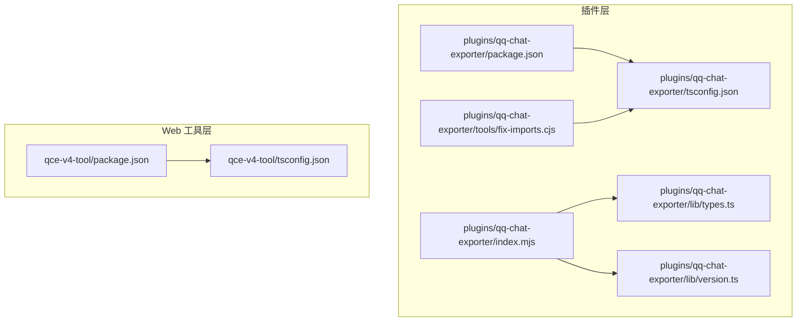
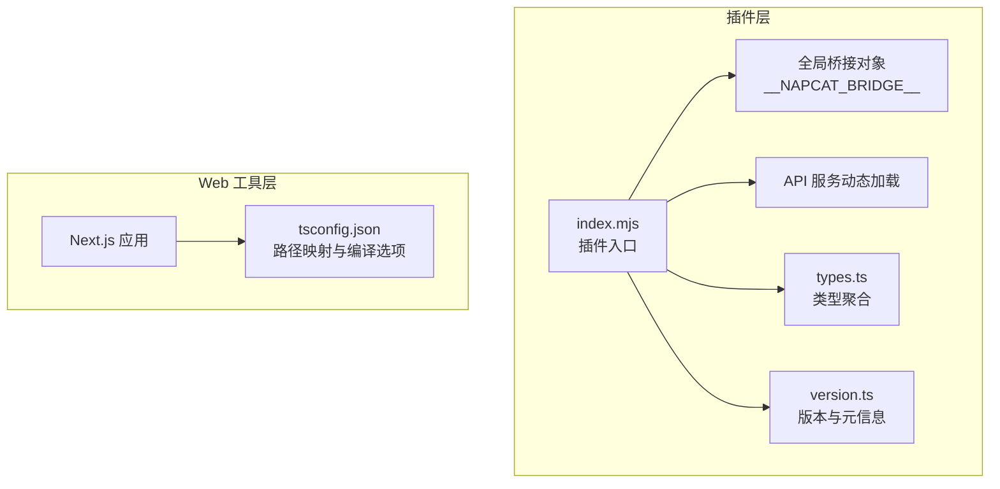
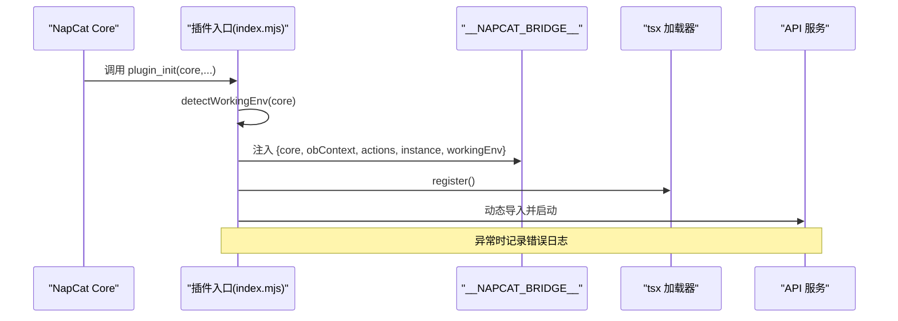
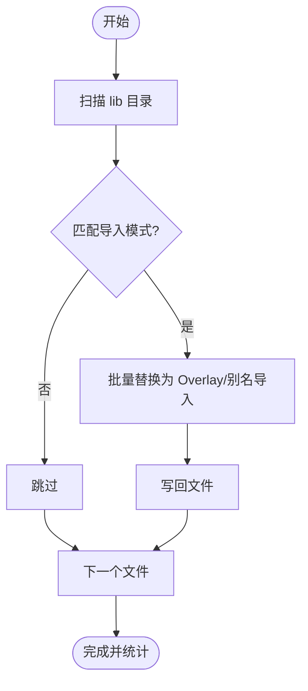
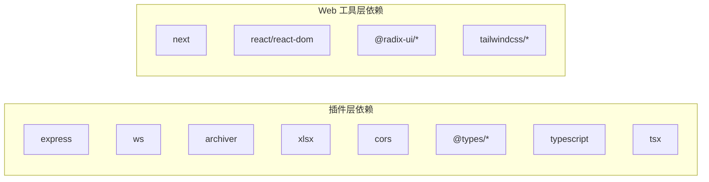

# 代码规范与最佳实践

<cite>
**本文引用的文件**
- [plugins/qq-chat-exporter/package.json](file://plugins/qq-chat-exporter/package.json)
- [plugins/qq-chat-exporter/tsconfig.json](file://plugins/qq-chat-exporter/tsconfig.json)
- [plugins/qq-chat-exporter/lib/types.ts](file://plugins/qq-chat-exporter/lib/types.ts)
- [plugins/qq-chat-exporter/lib/version.ts](file://plugins/qq-chat-exporter/lib/version.ts)
- [plugins/qq-chat-exporter/index.mjs](file://plugins/qq-chat-exporter/index.mjs)
- [plugins/qq-chat-exporter/tools/fix-imports.cjs](file://plugins/qq-chat-exporter/tools/fix-imports.cjs)
- [qce-v4-tool/package.json](file://qce-v4-tool/package.json)
- [qce-v4-tool/tsconfig.json](file://qce-v4-tool/tsconfig.json)
- [README.md](file://README.md)
- [docs/guide.md](file://docs/guide.md)
</cite>

## 目录
1. [简介](#简介)
2. [项目结构](#项目结构)
3. [核心组件](#核心组件)
4. [架构总览](#架构总览)
5. [详细组件分析](#详细组件分析)
6. [依赖分析](#依赖分析)
7. [性能考虑](#性能考虑)
8. [故障排查指南](#故障排查指南)
9. [结论](#结论)
10. [附录](#附录)

## 简介
本指南面向 QQ 聊天导出器（QQ Chat Exporter，简称 QCE）的 TypeScript 编码规范与最佳实践，覆盖类型系统、接口设计、泛型使用、命名约定、注释规范、代码组织、性能优化、内存管理与错误处理，并提供代码审查检查清单与质量保证流程。文档同时结合项目现有配置与脚本，给出可落地的实施建议。

## 项目结构
QCE 由三部分组成：
- 插件层（Node.js 插件）：负责与 NapCat 生态集成、启动 API 服务、桥接运行环境。
- Web 工具（Next.js 应用）：提供前端界面与交互，调用插件提供的 API。
- 辅助工具与脚本：用于构建、修复导入路径、生成覆盖层等。

图表来源
- [plugins/qq-chat-exporter/package.json](file://plugins/qq-chat-exporter/package.json#L1-L42)
- [plugins/qq-chat-exporter/tsconfig.json](file://plugins/qq-chat-exporter/tsconfig.json#L1-L39)
- [plugins/qq-chat-exporter/index.mjs](file://plugins/qq-chat-exporter/index.mjs#L1-L77)
- [plugins/qq-chat-exporter/lib/types.ts](file://plugins/qq-chat-exporter/lib/types.ts#L1-L8)
- [plugins/qq-chat-exporter/lib/version.ts](file://plugins/qq-chat-exporter/lib/version.ts#L1-L53)
- [plugins/qq-chat-exporter/tools/fix-imports.cjs](file://plugins/qq-chat-exporter/tools/fix-imports.cjs#L1-L94)
- [qce-v4-tool/package.json](file://qce-v4-tool/package.json#L1-L74)
- [qce-v4-tool/tsconfig.json](file://qce-v4-tool/tsconfig.json#L1-L56)

章节来源
- [plugins/qq-chat-exporter/package.json](file://plugins/qq-chat-exporter/package.json#L1-L42)
- [plugins/qq-chat-exporter/tsconfig.json](file://plugins/qq-chat-exporter/tsconfig.json#L1-L39)
- [qce-v4-tool/package.json](file://qce-v4-tool/package.json#L1-L74)
- [qce-v4-tool/tsconfig.json](file://qce-v4-tool/tsconfig.json#L1-L56)

## 核心组件
- 插件入口与运行模式检测：在插件初始化阶段检测运行环境（Shell/Framework），注入全局桥接对象，注册 tsx 加载器并动态启动 API 服务。
- 类型聚合导出：集中导出 NapCat QQ 的核心类型，便于上层消费。
- 版本与元信息：统一读取版本、应用名称、版权与仓库链接，支持 CI 注入。
- 导入路径修复工具：批量将相对路径导入转换为 Overlay/别名导入，确保跨环境一致性。

章节来源
- [plugins/qq-chat-exporter/index.mjs](file://plugins/qq-chat-exporter/index.mjs#L1-L77)
- [plugins/qq-chat-exporter/lib/types.ts](file://plugins/qq-chat-exporter/lib/types.ts#L1-L8)
- [plugins/qq-chat-exporter/lib/version.ts](file://plugins/qq-chat-exporter/lib/version.ts#L1-L53)
- [plugins/qq-chat-exporter/tools/fix-imports.cjs](file://plugins/qq-chat-exporter/tools/fix-imports.cjs#L1-L94)

## 架构总览
下图展示插件层与 Web 工具层的协作关系，以及关键配置对模块解析的影响。

图表来源
- [plugins/qq-chat-exporter/index.mjs](file://plugins/qq-chat-exporter/index.mjs#L1-L77)
- [plugins/qq-chat-exporter/lib/types.ts](file://plugins/qq-chat-exporter/lib/types.ts#L1-L8)
- [plugins/qq-chat-exporter/lib/version.ts](file://plugins/qq-chat-exporter/lib/version.ts#L1-L53)
- [qce-v4-tool/tsconfig.json](file://qce-v4-tool/tsconfig.json#L1-L56)

## 详细组件分析

### 插件入口与运行模式检测
- 功能要点
  - 通过上下文与进程环境判断运行模式（Shell/Framework/Unknown）。
  - 注入全局桥接对象，携带 core、obContext、actions、instance 与 workingEnv。
  - 使用 tsx 注册加载器，动态导入并启动 API 服务。
  - 提供清理函数停止 API 服务并删除桥接对象。
- 错误处理
  - 初始化失败时输出错误日志与堆栈；清理失败同样记录错误。
- 性能与稳定性
  - 动态导入避免冷启动阻塞；仅在必要时注册 tsx 加载器。
  - 通过全局桥接减少重复参数传递。

图表来源
- [plugins/qq-chat-exporter/index.mjs](file://plugins/qq-chat-exporter/index.mjs#L1-L77)

章节来源
- [plugins/qq-chat-exporter/index.mjs](file://plugins/qq-chat-exporter/index.mjs#L1-L77)

### 类型聚合导出（types.ts）
- 目标
  - 将 NapCat QQ 的核心类型统一导出，供插件与上层消费。
  - 通过路径别名与模块解析配置，确保导入一致性。
- 建议
  - 保持导出面精简，仅导出必要类型；新增类型时同步更新别名映射。
  - 在变更类型导出时，配合导入修复脚本进行批量更新。

章节来源
- [plugins/qq-chat-exporter/lib/types.ts](file://plugins/qq-chat-exporter/lib/types.ts#L1-L8)
- [plugins/qq-chat-exporter/tsconfig.json](file://plugins/qq-chat-exporter/tsconfig.json#L22-L25)

### 版本与元信息（version.ts）
- 目标
  - 统一读取版本号，支持 CI 注入；导出应用名称、全名、仓库地址与版权信息。
- 建议
  - 版本号变更遵循语义化版本；在 CI 中通过环境变量注入，保证发布一致性。
  - APP_INFO 使用只读常量，避免运行时被篡改。

章节来源
- [plugins/qq-chat-exporter/lib/version.ts](file://plugins/qq-chat-exporter/lib/version.ts#L1-L53)

### 导入路径修复工具（fix-imports.cjs）
- 目标
  - 将相对路径导入转换为 Overlay/别名导入，提升跨环境一致性。
- 行为
  - 递归扫描 lib 目录，匹配多种导入模式并批量替换。
  - 输出修改统计，便于审计与回滚。
- 建议
  - 在团队协作中统一使用别名导入；在迁移或重构时执行修复脚本。
  - 结合 tsconfig 的路径映射，确保模块解析一致。

图表来源
- [plugins/qq-chat-exporter/tools/fix-imports.cjs](file://plugins/qq-chat-exporter/tools/fix-imports.cjs#L1-L94)

章节来源
- [plugins/qq-chat-exporter/tools/fix-imports.cjs](file://plugins/qq-chat-exporter/tools/fix-imports.cjs#L1-L94)

### Web 工具层（Next.js）配置
- 目标
  - 通过 tsconfig 的路径映射与编译选项，统一前端模块解析与 JSX 处理。
- 建议
  - 保持路径映射简洁明确；在新增组件/库时同步更新映射。
  - 严格启用严格模式与增量编译，提升开发体验与构建效率。

章节来源
- [qce-v4-tool/package.json](file://qce-v4-tool/package.json#L1-L74)
- [qce-v4-tool/tsconfig.json](file://qce-v4-tool/tsconfig.json#L1-L56)

## 依赖分析
- 插件层依赖
  - 运行时：express、ws、archiver、xlsx、cors 等。
  - 开发时：@types/*、typescript、tsx。
- Web 工具层依赖
  - React 生态、Next.js、TailwindCSS、Radix UI 等。
- 建议
  - 定期更新依赖，关注安全公告；使用锁定文件保证环境一致性。
  - 在插件层尽量减少运行时依赖，降低打包体积与启动时间。

图表来源
- [plugins/qq-chat-exporter/package.json](file://plugins/qq-chat-exporter/package.json#L22-L36)
- [qce-v4-tool/package.json](file://qce-v4-tool/package.json#L12-L72)

章节来源
- [plugins/qq-chat-exporter/package.json](file://plugins/qq-chat-exporter/package.json#L1-L42)
- [qce-v4-tool/package.json](file://qce-v4-tool/package.json#L1-L74)

## 性能考虑
- 启动与模块加载
  - 使用动态导入与 tsx 注册器，避免不必要的同步加载。
  - 将大型依赖延迟加载，仅在需要时初始化。
- 导出与资源处理
  - 对超大群或海量消息采用流式导出策略，分块处理以降低内存峰值。
  - 媒体资源下载采用并发限制与断点续传机制，避免阻塞主线程。
- 内存管理
  - 及时释放事件监听器与定时器；对临时缓冲区进行显式回收。
  - 使用生成器与迭代器处理大数据集，避免一次性加载到内存。
- I/O 与网络
  - 合理设置超时与重试策略；对频繁请求进行去抖与节流。
  - 使用压缩与分片传输，减少网络带宽占用。

## 故障排查指南
- 插件初始化失败
  - 检查 tsx 是否正确安装与注册；确认动态导入路径有效。
  - 查看控制台错误日志与堆栈，定位具体异常点。
- 运行模式识别异常
  - 核对上下文 workingEnv 与进程环境变量；确保桥接对象注入成功。
- 导入路径问题
  - 使用导入修复脚本批量替换相对路径为 Overlay/别名导入。
  - 检查 tsconfig 的路径映射是否与实际目录结构一致。
- Web 工具层构建问题
  - 确认 tsconfig 的 strict、jsx、incremental 等选项符合 Next.js 要求。
  - 清理缓存与重新安装依赖，排除本地状态干扰。

章节来源
- [plugins/qq-chat-exporter/index.mjs](file://plugins/qq-chat-exporter/index.mjs#L60-L63)
- [plugins/qq-chat-exporter/tools/fix-imports.cjs](file://plugins/qq-chat-exporter/tools/fix-imports.cjs#L37-L64)
- [qce-v4-tool/tsconfig.json](file://qce-v4-tool/tsconfig.json#L10-L18)

## 结论
本指南基于 QCE 项目的现有实现与配置，提出了面向 TypeScript 的编码规范与最佳实践。通过统一的类型导出、严格的命名与注释规范、清晰的模块组织、完善的性能与内存管理策略，以及系统化的错误处理与质量保证流程，能够显著提升代码质量与可维护性。建议团队在日常开发中严格执行这些规范，并结合导入修复脚本与 CI 流水线，持续改进代码质量。

## 附录

### TypeScript 编码标准与类型系统
- 类型定义
  - 使用联合类型与字面量类型表达有限集合；通过只读类型约束不变数据。
  - 对外暴露的公共类型使用明确的命名空间前缀，避免命名冲突。
- 接口设计
  - 接口职责单一，避免“胖接口”；必要时拆分为多个小接口并通过组合复用。
  - 对可选属性使用可选链与防御性编程，确保调用方的健壮性。
- 泛型使用
  - 在高复用逻辑中引入泛型，但需保持类型推断友好；避免过度抽象导致可读性下降。
  - 对数组/集合操作优先使用内置泛型类型，减少手写样板代码。

### 命名约定
- 变量命名
  - 使用动词短语描述行为（如 loadConfig、validateToken）；布尔变量以 is/has/can 前缀。
- 函数命名
  - 动词+名词结构（如 fetchMessages、processExportTask）；纯函数避免副作用。
- 类命名
  - 使用名词短语（如 ApiLauncher、ResourceDownloader），首字母大写。
- 文件命名
  - 采用帕斯卡命名法（如 ApiLauncher.ts），避免缩写；测试文件以 .test.ts 结尾。

### 注释规范
- JSDoc 注释
  - 为公共函数与类提供完整签名、参数说明与返回值描述；复杂逻辑补充算法说明。
  - 对异常场景与边界条件进行注释标注，便于后续维护。
- API 文档
  - 统一使用 Markdown 格式；在 README 与 docs 中提供使用示例与注意事项。
- 复杂逻辑说明
  - 对分支较多或状态转换复杂的函数，添加流程图与注释，说明关键决策点。

### 代码组织原则
- 模块划分
  - 按功能域划分目录（如 api、core、security、services、utils、webui），避免交叉耦合。
  - 每个模块对外仅暴露必要的接口，内部细节通过私有成员封装。
- 文件结构
  - 单文件职责单一；长文件拆分为多个小文件，提升可读性与可测试性。
- 导入导出规范
  - 优先使用绝对路径与别名导入；避免相对路径硬编码。
  - 使用 barrel 文件统一导出，简化上层引用。

### 性能优化与内存管理
- 性能优化
  - 使用懒加载与按需编译；对热点路径进行缓存与去重。
  - I/O 与网络请求设置合理的超时与重试策略，避免阻塞。
- 内存管理
  - 及时释放事件监听器与定时器；对大对象进行分块处理与及时回收。
  - 使用 WeakMap/WeakSet 存储弱引用，避免内存泄漏。

### 错误处理最佳实践
- 统一错误模型
  - 定义业务异常与系统异常的区分；为每类异常提供明确的错误码与消息模板。
- 日志与追踪
  - 使用结构化日志记录关键上下文；为关键路径添加 spanId 以便链路追踪。
- 降级与恢复
  - 对外部依赖失败提供降级策略；在可恢复场景自动重试并指数退避。

### 代码审查检查清单
- 代码风格
  - 是否遵循命名约定与注释规范；是否使用一致的导入导出方式。
- 类型安全
  - 是否启用严格模式；是否存在 any/unknown 的滥用；泛型使用是否合理。
- 性能与资源
  - 是否存在内存泄漏风险；I/O 是否异步化；是否使用流式处理。
- 可靠性
  - 是否覆盖关键分支与异常路径；是否有充分的日志与监控。
- 可维护性
  - 是否模块化良好；是否易于单元测试与集成测试；文档是否完整。

### 质量保证流程
- 提交前检查
  - 本地运行类型检查与单元测试；执行导入修复脚本与格式化。
- CI 流水线
  - 自动化运行 Lint、测试与构建；对依赖更新触发安全扫描。
- 发布与回滚
  - 使用语义化版本管理；发布前进行预发布验证；具备快速回滚预案。