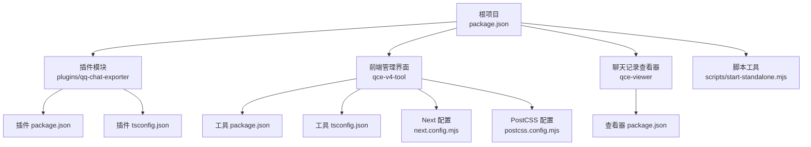
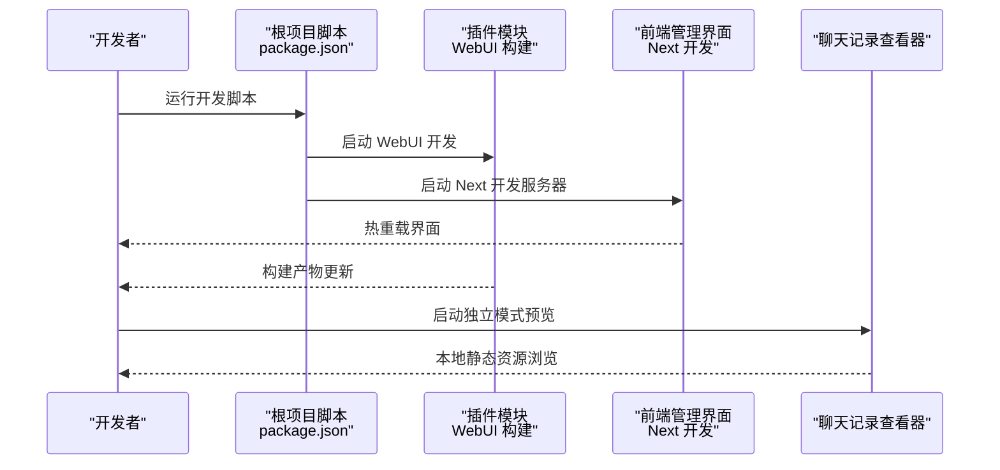
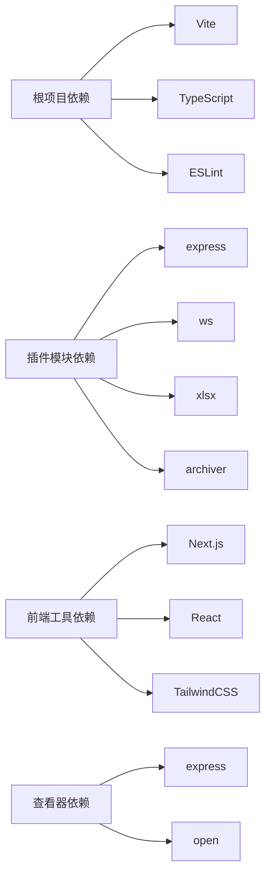

# 开发环境搭建

<cite>
**本文引用的文件**
- [package.json](file://package.json)
- [plugins/qq-chat-exporter/package.json](file://plugins/qq-chat-exporter/package.json)
- [plugins/qq-chat-exporter/tsconfig.json](file://plugins/qq-chat-exporter/tsconfig.json)
- [qce-v4-tool/package.json](file://qce-v4-tool/package.json)
- [qce-v4-tool/tsconfig.json](file://qce-v4-tool/tsconfig.json)
- [qce-v4-tool/next.config.mjs](file://qce-v4-tool/next.config.mjs)
- [qce-v4-tool/postcss.config.mjs](file://qce-v4-tool/postcss.config.mjs)
- [qce-viewer/package.json](file://qce-viewer/package.json)
- [scripts/start-standalone.mjs](file://scripts/start-standalone.mjs)
- [.gitignore](file://.gitignore)
- [README.md](file://README.md)
</cite>

## 目录
1. [简介](#简介)
2. [项目结构](#项目结构)
3. [核心组件](#核心组件)
4. [架构总览](#架构总览)
5. [详细组件分析](#详细组件分析)
6. [依赖分析](#依赖分析)
7. [性能考虑](#性能考虑)
8. [故障排查指南](#故障排查指南)
9. [结论](#结论)
10. [附录](#附录)

## 简介
本指南面向参与 QQ 聊天导出器（QCE）项目的开发者，提供从零搭建开发环境的完整流程与最佳实践。内容涵盖：
- Node.js 版本要求与包管理器选择（npm/pnpm）
- 根项目与子项目的依赖安装步骤
- TypeScript 编译配置与开发服务器启动方式
- 热重载与多入口开发流
- ESLint、Prettier 与 VSCode 推荐配置
- 断点调试、日志输出与性能分析
- 常见问题排查与解决方案

## 项目结构
该项目采用多包（monorepo）结构，主要由以下子模块组成：
- 根项目：提供统一的构建脚本与通用开发工具链
- 插件模块 plugins/qq-chat-exporter：核心导出功能与 WebUI 构建入口
- 前端管理界面 qce-v4-tool：基于 Next.js 的管理后台
- 聊天记录查看器 qce-viewer：独立的静态资源查看服务
- 脚本 scripts：辅助启动与打包脚本

图表来源
- [package.json](file://package.json#L1-L76)
- [plugins/qq-chat-exporter/package.json](file://plugins/qq-chat-exporter/package.json#L1-L42)
- [plugins/qq-chat-exporter/tsconfig.json](file://plugins/qq-chat-exporter/tsconfig.json#L1-L39)
- [qce-v4-tool/package.json](file://qce-v4-tool/package.json#L1-L74)
- [qce-v4-tool/tsconfig.json](file://qce-v4-tool/tsconfig.json#L1-L56)
- [qce-v4-tool/next.config.mjs](file://qce-v4-tool/next.config.mjs#L1-L41)
- [qce-v4-tool/postcss.config.mjs](file://qce-v4-tool/postcss.config.mjs#L1-L9)
- [qce-viewer/package.json](file://qce-viewer/package.json#L1-L22)
- [scripts/start-standalone.mjs](file://scripts/start-standalone.mjs#L1-L55)

章节来源
- [package.json](file://package.json#L1-L76)
- [plugins/qq-chat-exporter/package.json](file://plugins/qq-chat-exporter/package.json#L1-L42)
- [qce-v4-tool/package.json](file://qce-v4-tool/package.json#L1-L74)
- [qce-viewer/package.json](file://qce-viewer/package.json#L1-L22)
- [scripts/start-standalone.mjs](file://scripts/start-standalone.mjs#L1-L55)

## 核心组件
- 根项目脚本与工具链
  - 提供统一的构建与开发脚本，如构建不同模式（universal/framework/shell）、启动 WebUI 开发、代码质量检查等
  - 使用 Vite 作为核心构建工具，并通过子脚本协调子模块构建
- 插件模块
  - 以 ES Module 形式组织，提供导出器核心能力与 WebUI 构建入口
  - TypeScript 编译配置严格，启用严格模式与源映射
- 前端管理界面
  - Next.js 应用，支持静态导出与自定义基础路径
  - 集成 TailwindCSS 与 PostCSS，使用路径别名提升开发体验
- 聊天记录查看器
  - Express 服务，提供本地静态资源浏览能力
- 独立启动脚本
  - 支持无需 NapCat 登录的独立模式，便于预览导出结果

章节来源
- [package.json](file://package.json#L6-L19)
- [plugins/qq-chat-exporter/tsconfig.json](file://plugins/qq-chat-exporter/tsconfig.json#L2-L26)
- [qce-v4-tool/tsconfig.json](file://qce-v4-tool/tsconfig.json#L2-L24)
- [qce-v4-tool/next.config.mjs](file://qce-v4-tool/next.config.mjs#L18-L38)
- [qce-viewer/package.json](file://qce-viewer/package.json#L6-L9)
- [scripts/start-standalone.mjs](file://scripts/start-standalone.mjs#L25-L52)

## 架构总览
下图展示开发时的典型工作流：根项目脚本驱动插件与前端模块的构建与开发；前端管理界面通过 Next.js 提供管理能力；查看器用于本地预览导出结果。

图表来源
- [package.json](file://package.json#L10-L15)
- [qce-v4-tool/next.config.mjs](file://qce-v4-tool/next.config.mjs#L8-L14)
- [scripts/start-standalone.mjs](file://scripts/start-standalone.mjs#L25-L52)

章节来源
- [package.json](file://package.json#L6-L19)
- [qce-v4-tool/next.config.mjs](file://qce-v4-tool/next.config.mjs#L18-L38)
- [scripts/start-standalone.mjs](file://scripts/start-standalone.mjs#L25-L52)

## 详细组件分析

### Node.js 与包管理器要求
- Node.js 版本
  - 根项目未显式声明 engines 字段，但插件模块要求 Node >= 18.0.0
  - 建议使用 LTS 版本以获得稳定性和长期支持
- 包管理器
  - 根项目脚本使用 npm 脚本；插件模块与前端工具链同时兼容 npm 与 pnpm
  - 若团队统一使用 pnpm，可在子模块中使用 pnpm-lock.yaml

章节来源
- [plugins/qq-chat-exporter/package.json](file://plugins/qq-chat-exporter/package.json#L38-L40)
- [qce-v4-tool/package.json](file://qce-v4-tool/package.json#L1-L74)

### 依赖安装与子项目配置
- 根项目依赖安装
  - 在仓库根目录执行安装，确保统一的开发工具链可用
- 子模块独立安装
  - 插件模块：进入 plugins/qq-chat-exporter 并安装依赖
  - 前端工具：进入 qce-v4-tool 并安装依赖
  - 查看器：进入 qce-viewer 并安装依赖
- 安装注意事项
  - 插件模块与前端工具均包含 TypeScript 与相关类型依赖，需确保版本匹配
  - 若使用 pnpm，请在对应子目录使用 pnpm install

章节来源
- [package.json](file://package.json#L17-L18)
- [plugins/qq-chat-exporter/package.json](file://plugins/qq-chat-exporter/package.json#L22-L37)
- [qce-v4-tool/package.json](file://qce-v4-tool/package.json#L12-L73)
- [qce-viewer/package.json](file://qce-viewer/package.json#L13-L16)

### TypeScript 编译配置
- 插件模块 tsconfig
  - 目标与模块：ES2022 + nodenext
  - 严格模式：启用
  - 输出目录：dist，源码目录：lib
  - 路径映射：包含 NapCatQQ 类型路径别名
- 前端工具 tsconfig
  - 目标：ES6，模块：esnext，解析器：bundler
  - JSX：react-jsx，严格模式：启用
  - 路径别名：@/*、@/components/*、@/lib/*、@/hooks/*、@/types/*
- 构建与开发
  - 插件模块：通过根项目脚本触发 WebUI 构建与开发
  - 前端工具：Next.js 内置 TypeScript 处理，支持增量编译

章节来源
- [plugins/qq-chat-exporter/tsconfig.json](file://plugins/qq-chat-exporter/tsconfig.json#L2-L26)
- [qce-v4-tool/tsconfig.json](file://qce-v4-tool/tsconfig.json#L2-L24)

### 开发服务器与热重载
- 插件 WebUI 开发
  - 根项目脚本提供 dev:webui，切换至 plugins/qq-chat-exporter 并启动其开发流程
- 前端管理界面开发
  - qce-v4-tool 使用 next dev 启动开发服务器，支持热重载
  - Next 配置支持静态导出与自定义基础路径，便于部署与本地调试
- 查看器独立模式
  - scripts/start-standalone.mjs 提供独立启动逻辑，便于预览导出结果

章节来源
- [package.json](file://package.json#L15)
- [qce-v4-tool/next.config.mjs](file://qce-v4-tool/next.config.mjs#L18-L38)
- [scripts/start-standalone.mjs](file://scripts/start-standalone.mjs#L25-L52)

### 工具链配置（ESLint、Prettier、VSCode）
- ESLint
  - 根项目脚本包含 lint 脚本，可对源码进行修复
  - 建议在 VSCode 中安装 ESLint 扩展，并启用保存时自动修复
- Prettier
  - 仓库未提供 .prettierrc 文件，建议在项目根目录新增配置以统一格式化风格
  - VSCode 中安装 Prettier 扩展，并配置默认格式化程序
- VSCode 推荐设置
  - 启用 TypeScript/JavaScript 集成
  - 设置 ESLint 与 Prettier 为默认格式化工具
  - 配置 TypeScript 路径映射，提升编辑器智能感知

章节来源
- [package.json](file://package.json#L16)
- [.gitignore](file://.gitignore#L27-L32)

### 调试环境配置
- 断点调试
  - 插件模块：使用 tsx 或 Node 调试器附加到插件进程
  - 前端管理界面：Next.js 开发服务器支持 Node 调试器附加
  - 查看器：Express 服务可通过 Node 调试器附加
- 日志输出
  - 插件模块内置 QCELogger，支持彩色输出与按模块开关
  - 可通过环境变量控制调试日志输出
- 性能分析
  - 使用 Node.js 内置 profiler 或 Chrome DevTools 远程调试
  - 对前端管理界面可使用 Next.js 开发工具链自带的性能分析能力

章节来源
- [plugins/qq-chat-exporter/lib/utils/Logger.ts](file://plugins/qq-chat-exporter/lib/utils/Logger.ts#L1-L113)
- [qce-v4-tool/next.config.mjs](file://qce-v4-tool/next.config.mjs#L18-L38)

### 独立模式与资源查看
- 独立启动
  - 通过 scripts/start-standalone.mjs 启动独立模式，默认端口 40653
  - 自动注册 tsx 并动态导入 StandaloneServer
- 资源查看
  - qce-viewer 提供本地静态资源浏览能力，适合快速验证导出结果

章节来源
- [scripts/start-standalone.mjs](file://scripts/start-standalone.mjs#L25-L52)
- [qce-viewer/package.json](file://qce-viewer/package.json#L6-L9)

## 依赖分析
- 根项目
  - 构建工具：Vite、esbuild、@rollup/plugins
  - 语言与类型：TypeScript、@types/*
  - 代码质量：ESLint、globals、json5
- 插件模块
  - 运行时：express、ws、xlsx、archiver
  - 开发时：tsx、typescript
- 前端工具
  - 框架：Next.js、React、TailwindCSS
  - 工具链：postcss、autoprefixer、tailwindcss
- 查看器
  - 运行时：express、open

图表来源
- [package.json](file://package.json#L20-L69)
- [plugins/qq-chat-exporter/package.json](file://plugins/qq-chat-exporter/package.json#L22-L37)
- [qce-v4-tool/package.json](file://qce-v4-tool/package.json#L12-L73)
- [qce-viewer/package.json](file://qce-viewer/package.json#L13-L16)

章节来源
- [package.json](file://package.json#L20-L69)
- [plugins/qq-chat-exporter/package.json](file://plugins/qq-chat-exporter/package.json#L22-L37)
- [qce-v4-tool/package.json](file://qce-v4-tool/package.json#L12-L73)
- [qce-viewer/package.json](file://qce-viewer/package.json#L13-L16)

## 性能考虑
- 构建性能
  - 使用 Vite 的 esbuild 加速打包与开发服务器启动
  - 插件模块启用严格 TypeScript 检查，建议在 CI 中缓存依赖以减少重复安装时间
- 前端性能
  - Next.js 支持静态导出与增量编译，结合 TailwindCSS 实现按需样式
- 调试性能
  - 使用 Node.js 调试器与浏览器性能面板进行热点分析
  - 对大型导出任务建议分批处理与异步执行，避免阻塞主线程

## 故障排查指南
- Node 版本不兼容
  - 症状：安装或运行时报错
  - 解决：升级到 Node LTS，确保插件模块要求的最低版本满足
- 依赖安装失败
  - 症状：pnpm/npm 安装卡住或报错
  - 解决：清理缓存并重装；在子目录分别执行安装
- TypeScript 报错
  - 症状：严格模式导致编译错误
  - 解决：根据 tsconfig.json 调整代码；必要时临时放宽规则
- 热重载不生效
  - 症状：修改文件后页面未刷新
  - 解决：确认开发服务器正在运行；检查文件路径与路径别名配置
- 独立模式无法启动
  - 症状：启动失败并提示依赖缺失
  - 解决：先在插件目录安装依赖，再运行独立启动脚本
- 端口占用
  - 症状：开发服务器启动失败
  - 解决：更换端口或释放占用端口

章节来源
- [plugins/qq-chat-exporter/package.json](file://plugins/qq-chat-exporter/package.json#L38-L40)
- [scripts/start-standalone.mjs](file://scripts/start-standalone.mjs#L46-L51)
- [qce-v4-tool/next.config.mjs](file://qce-v4-tool/next.config.mjs#L28-L29)

## 结论
通过以上步骤，开发者可以在本地快速搭建 QQ 聊天导出器的开发环境。建议优先使用 LTS 版本的 Node.js，统一包管理器并在子模块内分别安装依赖。利用根项目脚本与 Next.js 开发服务器实现高效迭代，并结合 ESLint/Prettier 与 VSCode 扩展提升代码质量与开发效率。

## 附录
- 快速参考
  - 安装根依赖：在仓库根目录执行安装
  - 安装插件依赖：进入 plugins/qq-chat-exporter 并安装
  - 安装前端依赖：进入 qce-v4-tool 并安装
  - 启动插件 WebUI 开发：使用根项目脚本中的 dev:webui
  - 启动前端管理界面：在 qce-v4-tool 目录执行 next dev
  - 启动独立模式：执行 scripts/start-standalone.mjs
- 相关链接
  - 项目使用文档与快速开始：参见 README 中的“快速开始”与“文档”部分

章节来源
- [README.md](file://README.md#L11-L18)
- [package.json](file://package.json#L10-L15)
- [qce-v4-tool/next.config.mjs](file://qce-v4-tool/next.config.mjs#L28-L29)
- [scripts/start-standalone.mjs](file://scripts/start-standalone.mjs#L25-L52)