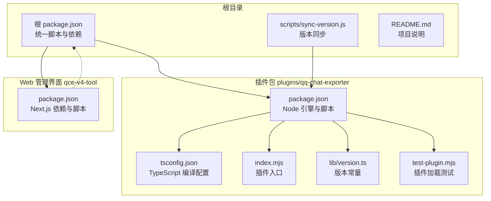
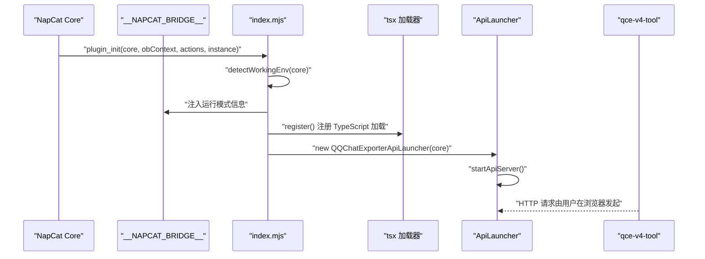
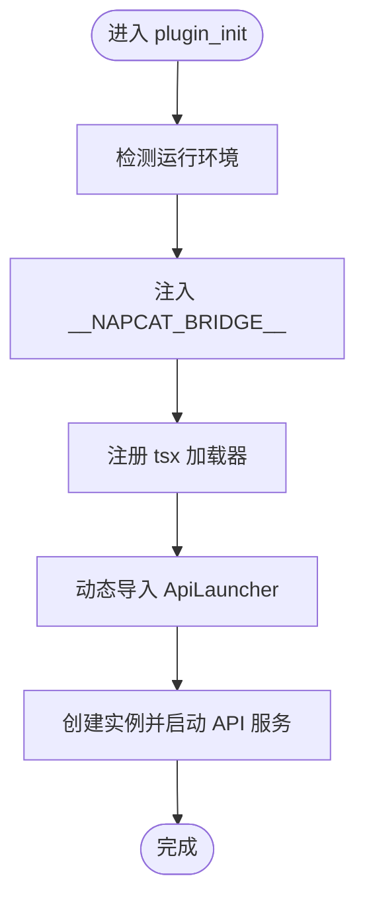
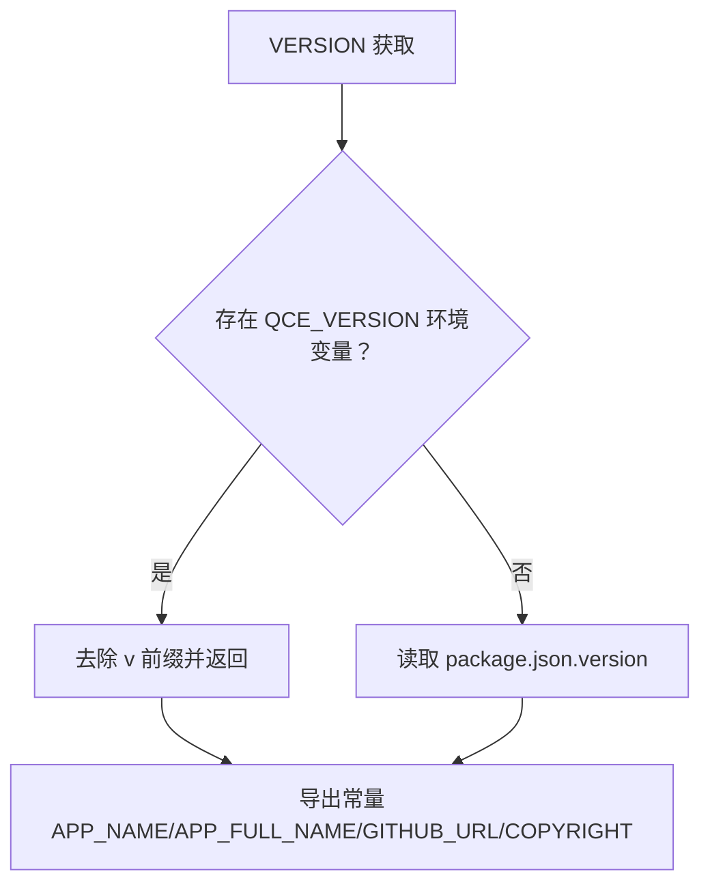
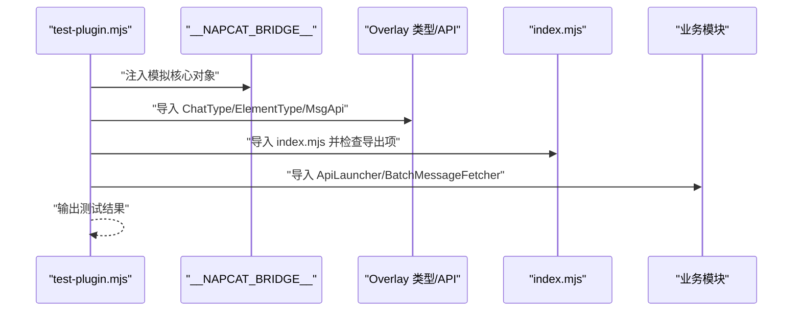
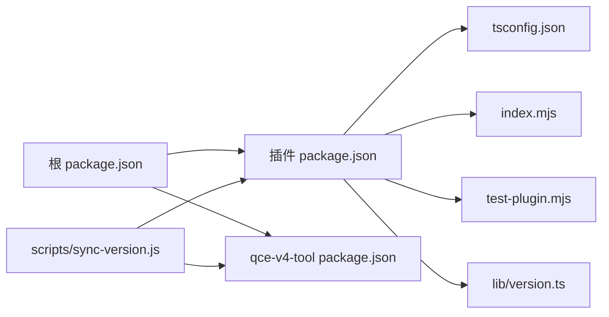
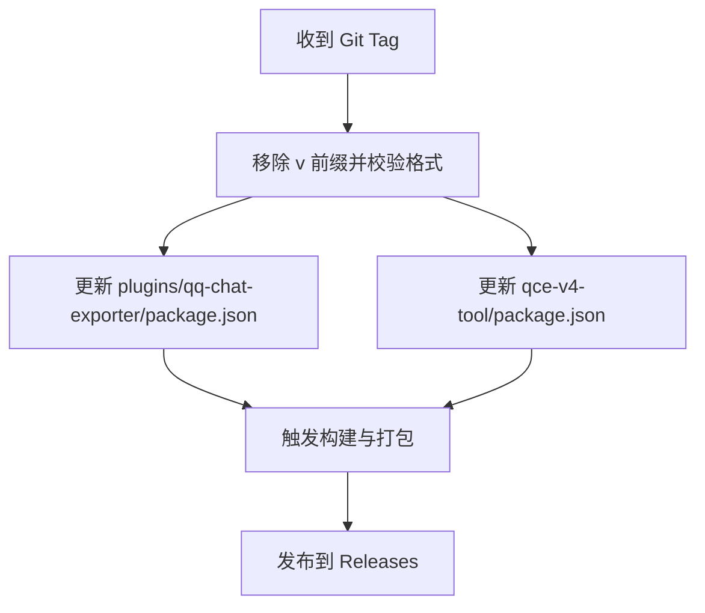

# 开发者指南

<cite>
**本文引用的文件**
- [README.md](file://README.md)
- [package.json](file://package.json)
- [plugins/qq-chat-exporter/package.json](file://plugins/qq-chat-exporter/package.json)
- [plugins/qq-chat-exporter/tsconfig.json](file://plugins/qq-chat-exporter/tsconfig.json)
- [plugins/qq-chat-exporter/index.mjs](file://plugins/qq-chat-exporter/index.mjs)
- [plugins/qq-chat-exporter/test-plugin.mjs](file://plugins/qq-chat-exporter/test-plugin.mjs)
- [plugins/qq-chat-exporter/lib/version.ts](file://plugins/qq-chat-exporter/lib/version.ts)
- [qce-v4-tool/package.json](file://qce-v4-tool/package.json)
- [scripts/sync-version.js](file://scripts/sync-version.js)
</cite>

## 目录
1. [简介](#简介)
2. [项目结构](#项目结构)
3. [核心组件](#核心组件)
4. [架构总览](#架构总览)
5. [详细组件分析](#详细组件分析)
6. [依赖关系分析](#依赖关系分析)
7. [性能与构建优化](#性能与构建优化)
8. [测试与调试指南](#测试与调试指南)
9. [代码规范与最佳实践](#代码规范与最佳实践)
10. [插件开发指南](#插件开发指南)
11. [版本管理与发布流程](#版本管理与发布流程)
12. [故障排查](#故障排查)
13. [结语](#结语)

## 简介
本指南面向希望参与 QQ 聊天导出器（QQ Chat Exporter，简称 QCE）开发的贡献者，覆盖开发环境搭建、代码规范、插件扩展、测试与调试、版本发布等全流程。项目采用多包结构，核心插件位于 plugins/qq-chat-exporter，配套 Web 管理界面位于 qce-v4-tool，根目录提供统一的构建与版本同步脚本。

## 项目结构
- plugins/qq-chat-exporter：主插件源码与构建产物，包含 TypeScript 源码、编译输出、工具脚本与测试脚本。
- qce-v4-tool：Next.js Web 界面，提供导出任务配置、历史查看、定时任务等管理能力。
- scripts：CI/CD 相关脚本，如版本同步。
- 根 package.json：统一脚本与依赖管理，便于跨包操作。
- README.md：项目概述与快速开始指引。

图表来源
- [plugins/qq-chat-exporter/package.json](file://plugins/qq-chat-exporter/package.json#L1-L42)
- [plugins/qq-chat-exporter/tsconfig.json](file://plugins/qq-chat-exporter/tsconfig.json#L1-L39)
- [plugins/qq-chat-exporter/index.mjs](file://plugins/qq-chat-exporter/index.mjs#L1-L77)
- [plugins/qq-chat-exporter/test-plugin.mjs](file://plugins/qq-chat-exporter/test-plugin.mjs#L1-L134)
- [plugins/qq-chat-exporter/lib/version.ts](file://plugins/qq-chat-exporter/lib/version.ts#L1-L53)
- [qce-v4-tool/package.json](file://qce-v4-tool/package.json#L1-L74)
- [scripts/sync-version.js](file://scripts/sync-version.js#L1-L75)

章节来源
- [README.md](file://README.md#L1-L42)
- [package.json](file://package.json#L1-L76)

## 核心组件
- 插件入口与运行模式检测：插件通过入口文件检测运行环境（Shell/Framework），注入全局桥接对象并按需注册 TypeScript 加载器，随后启动 API 服务。
- 版本管理：通过 lib/version.ts 统一读取版本号，优先使用 CI 注入的环境变量，回退到 package.json。
- 测试脚本：提供最小化测试，验证 Overlay 类型、API 导入与插件入口可用性，避免启动真实服务。

章节来源
- [plugins/qq-chat-exporter/index.mjs](file://plugins/qq-chat-exporter/index.mjs#L1-L77)
- [plugins/qq-chat-exporter/lib/version.ts](file://plugins/qq-chat-exporter/lib/version.ts#L1-L53)
- [plugins/qq-chat-exporter/test-plugin.mjs](file://plugins/qq-chat-exporter/test-plugin.mjs#L1-L134)

## 架构总览
下图展示插件在不同运行模式下的启动流程与关键交互：

图表来源
- [plugins/qq-chat-exporter/index.mjs](file://plugins/qq-chat-exporter/index.mjs#L28-L64)

## 详细组件分析

### 插件入口与运行模式检测
- 入口函数负责：
  - 识别运行环境（Shell 或 Framework），并记录日志。
  - 注入全局桥接对象，向 Overlay 层暴露核心上下文。
  - 注册 tsx 加载器以支持 TypeScript 源码直接运行。
  - 动态导入并启动 API 启动器。
- 清理函数负责停止 API 服务并清理桥接对象。

图表来源
- [plugins/qq-chat-exporter/index.mjs](file://plugins/qq-chat-exporter/index.mjs#L28-L64)

章节来源
- [plugins/qq-chat-exporter/index.mjs](file://plugins/qq-chat-exporter/index.mjs#L1-L77)

### 版本管理模块
- 优先从环境变量读取版本（CI 场景），否则回退到插件包内的 package.json。
- 提供应用名、全名、GitHub 地址、版权等常量，便于统一展示与分发。

图表来源
- [plugins/qq-chat-exporter/lib/version.ts](file://plugins/qq-chat-exporter/lib/version.ts#L9-L26)

章节来源
- [plugins/qq-chat-exporter/lib/version.ts](file://plugins/qq-chat-exporter/lib/version.ts#L1-L53)

### 测试脚本与最小化验证
- 测试脚本模拟 NapCat 环境，验证：
  - Overlay 类型与 API 是否可导入。
  - 插件入口是否可被导入且导出期望函数。
  - 关键业务模块（如 ApiLauncher、BatchMessageFetcher）是否可导入。
- 该测试避免启动真实服务，仅做静态导入与可用性校验。

图表来源
- [plugins/qq-chat-exporter/test-plugin.mjs](file://plugins/qq-chat-exporter/test-plugin.mjs#L60-L130)

章节来源
- [plugins/qq-chat-exporter/test-plugin.mjs](file://plugins/qq-chat-exporter/test-plugin.mjs#L1-L134)

## 依赖关系分析
- 根 package.json 提供统一的构建与开发脚本，便于在多包之间共享命令。
- 插件包内定义 Node 引擎最低版本要求，确保运行环境兼容。
- Web 管理界面使用 Next.js 生态，依赖 React、Radix UI、TailwindCSS 等。
- 版本同步脚本在 CI 中更新多个 package.json 的版本字段，保证一致性。

图表来源
- [package.json](file://package.json#L6-L18)
- [plugins/qq-chat-exporter/package.json](file://plugins/qq-chat-exporter/package.json#L38-L40)
- [qce-v4-tool/package.json](file://qce-v4-tool/package.json#L1-L74)
- [scripts/sync-version.js](file://scripts/sync-version.js#L17-L20)

章节来源
- [package.json](file://package.json#L1-L76)
- [plugins/qq-chat-exporter/package.json](file://plugins/qq-chat-exporter/package.json#L1-L42)
- [qce-v4-tool/package.json](file://qce-v4-tool/package.json#L1-L74)
- [scripts/sync-version.js](file://scripts/sync-version.js#L1-L75)

## 性能与构建优化
- 使用 tsx 在开发阶段直接运行 TypeScript，减少编译等待时间。
- 通过 tsconfig.json 的严格模式与 nodenext 模块解析提升类型安全与模块兼容性。
- 根 package.json 提供多模式构建脚本，便于在不同场景（Universal/Framework/Shell）下快速迭代。

章节来源
- [plugins/qq-chat-exporter/index.mjs](file://plugins/qq-chat-exporter/index.mjs#L43-L51)
- [plugins/qq-chat-exporter/tsconfig.json](file://plugins/qq-chat-exporter/tsconfig.json#L1-L39)
- [package.json](file://package.json#L6-L18)

## 测试与调试指南
- 单元测试（插件加载测试）：使用内置测试脚本验证导入链路与最小可用性，避免启动真实服务。
- 集成测试（Web 管理界面）：在 qce-v4-tool 中进行端到端交互测试，验证导出任务创建、执行与结果查看。
- 调试技巧：
  - 在插件入口处设置断点，观察运行模式检测与桥接对象注入。
  - 使用浏览器开发者工具检查 Web 管理界面与 API 服务之间的请求响应。
  - 利用根脚本统一构建，确保变更在各包间一致生效。

章节来源
- [plugins/qq-chat-exporter/test-plugin.mjs](file://plugins/qq-chat-exporter/test-plugin.mjs#L1-L134)
- [qce-v4-tool/package.json](file://qce-v4-tool/package.json#L6-L11)

## 代码规范与最佳实践
- TypeScript 编码标准
  - 使用严格模式与 nodenext 模块解析，确保类型安全与现代模块语法。
  - 保持路径映射与导出/导入解析一致，避免运行时解析问题。
- 命名约定
  - 文件与模块采用清晰的层级命名（如 lib/api/ApiLauncher.ts），便于维护。
  - 常量统一导出（如 VERSION、APP_NAME），集中管理。
- 注释规范
  - 公共接口与入口函数提供简明注释，说明用途与行为。
  - 错误处理与异常分支添加必要注释，便于排查。
- 依赖管理
  - 根 package.json 统一脚本，插件与 Web 界面分别维护各自依赖，避免污染。

章节来源
- [plugins/qq-chat-exporter/tsconfig.json](file://plugins/qq-chat-exporter/tsconfig.json#L2-L26)
- [plugins/qq-chat-exporter/lib/version.ts](file://plugins/qq-chat-exporter/lib/version.ts#L28-L52)

## 插件开发指南
- 自定义导出器实现
  - 在 lib/api 下新增导出器类或模块，遵循现有 ApiLauncher 的组织方式。
  - 通过 __NAPCAT_BRIDGE__ 获取核心上下文与动作集合，确保与 NapCat 框架解耦。
- API 扩展
  - 在 ApiLauncher 中注册新的路由与处理器，保持与现有中间件与鉴权机制一致。
- 中间件开发
  - 如需统一处理请求（如限流、日志、参数校验），可在启动器中引入中间件并按顺序挂载。
- 运行模式适配
  - 在入口处根据 detectWorkingEnv 的返回值调整行为（如资源路径、日志级别）。

章节来源
- [plugins/qq-chat-exporter/index.mjs](file://plugins/qq-chat-exporter/index.mjs#L12-L26)
- [plugins/qq-chat-exporter/index.mjs](file://plugins/qq-chat-exporter/index.mjs#L28-L64)

## 版本管理与发布流程
- 版本同步脚本
  - 在 CI 中接收 Git Tag，移除 v 前缀并校验格式，随后更新多个 package.json 的版本字段。
- 发布前检查
  - 确保所有包版本一致，构建产物完整，测试通过。
- 发布步骤建议
  - 更新根与子包版本，提交并推送 Tag；CI 触发同步与构建；上传制品至 Release。

图表来源
- [scripts/sync-version.js](file://scripts/sync-version.js#L43-L72)

章节来源
- [scripts/sync-version.js](file://scripts/sync-version.js#L1-L75)
- [plugins/qq-chat-exporter/package.json](file://plugins/qq-chat-exporter/package.json#L3-L4)
- [qce-v4-tool/package.json](file://qce-v4-tool/package.json#L4-L4)

## 故障排查
- 插件无法加载
  - 检查 Node 引擎版本是否满足最低要求。
  - 确认 tsx 已正确注册，且 ApiLauncher 等模块可被动态导入。
- 运行模式识别异常
  - 核对 __NAPCAT_BRIDGE__ 中的 workingEnv 字段来源，确认 NapCat 上下文是否正确注入。
- 版本不一致
  - 使用版本同步脚本统一更新各包版本，确保发布一致性。

章节来源
- [plugins/qq-chat-exporter/package.json](file://plugins/qq-chat-exporter/package.json#L38-L40)
- [plugins/qq-chat-exporter/index.mjs](file://plugins/qq-chat-exporter/index.mjs#L43-L51)
- [scripts/sync-version.js](file://scripts/sync-version.js#L52-L60)

## 结语
本指南提供了从环境搭建到插件扩展、从测试调试到版本发布的完整开发路径。建议在本地先通过测试脚本验证导入链路，再结合 Web 管理界面进行端到端验证，并在 CI 中通过版本同步脚本确保发布一致性。欢迎贡献者遵循上述规范，共同完善 QQ 聊天导出器生态。