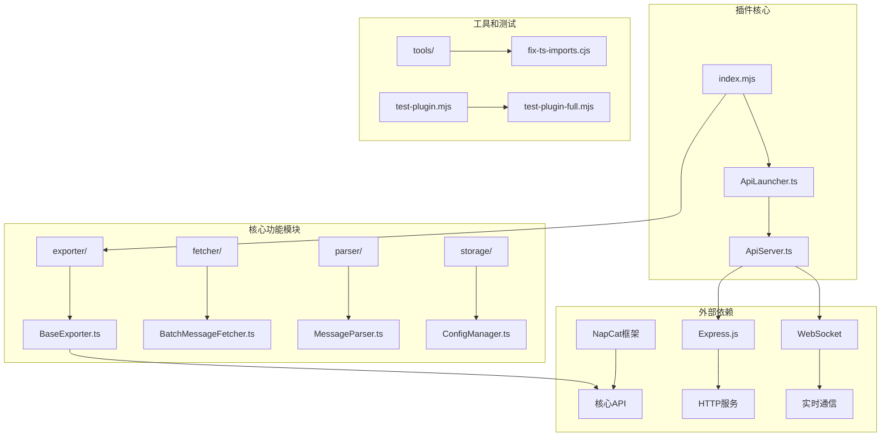
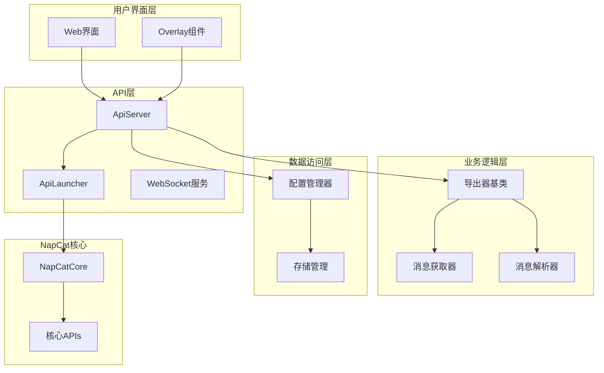
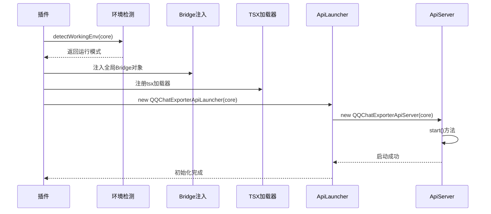
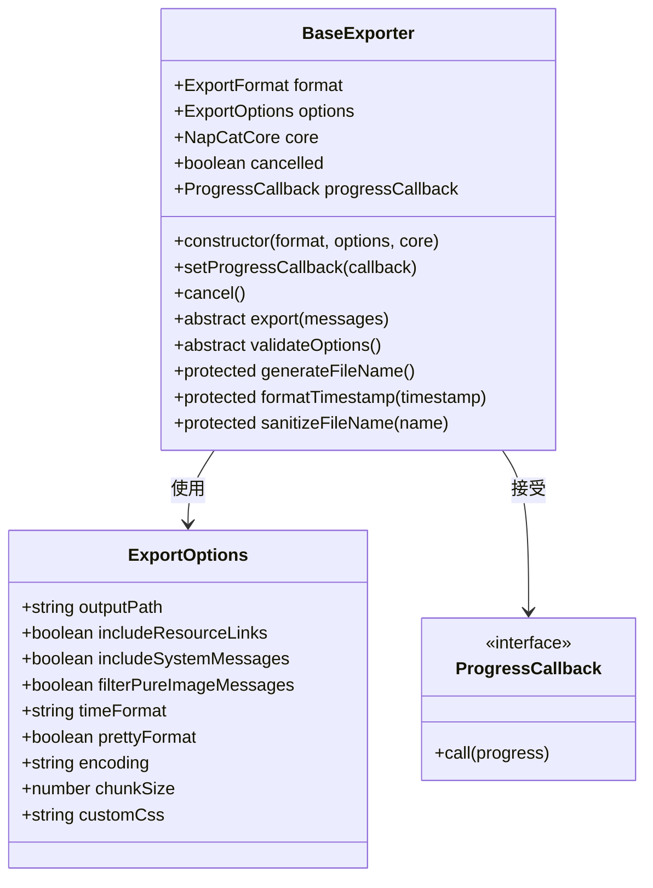
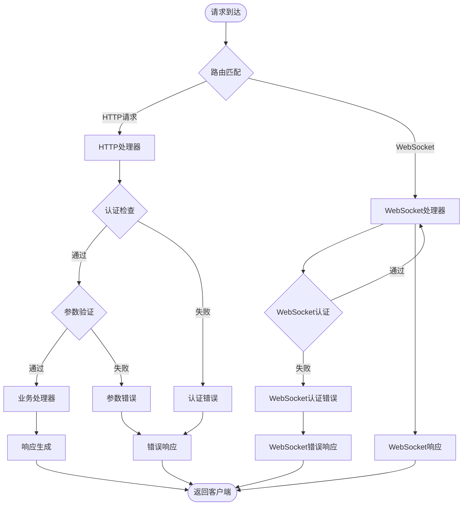
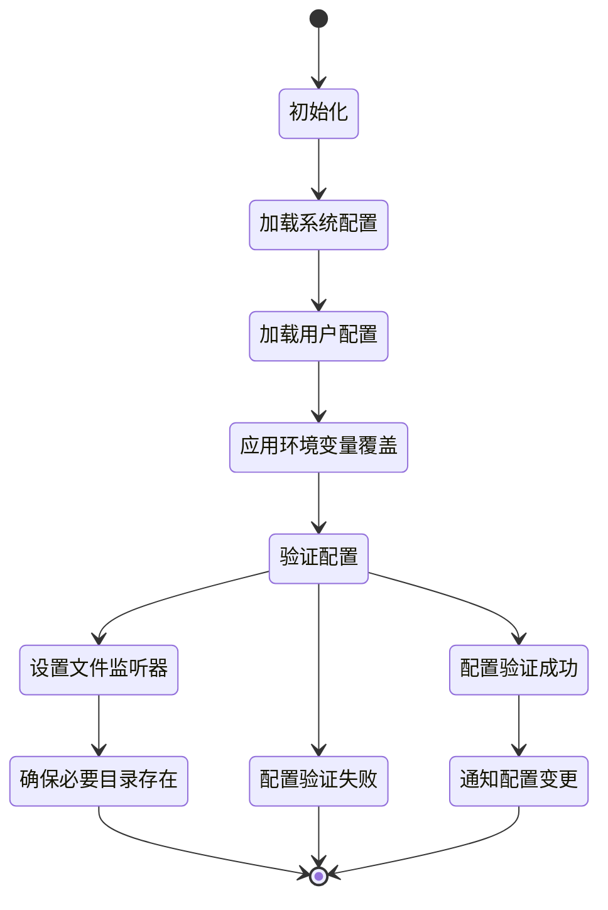

# 扩展开发指南

<cite>
**本文档引用的文件**
- [package.json](file://plugins/qq-chat-exporter/package.json)
- [index.mjs](file://plugins/qq-chat-exporter/index.mjs)
- [ApiLauncher.ts](file://plugins/qq-chat-exporter/lib/api/ApiLauncher.ts)
- [ApiServer.ts](file://plugins/qq-chat-exporter/lib/api/ApiServer.ts)
- [BaseExporter.ts](file://plugins/qq-chat-exporter/lib/core/exporter/BaseExporter.ts)
- [ConfigManager.ts](file://plugins/qq-chat-exporter/lib/core/storage/ConfigManager.ts)
- [version.ts](file://plugins/qq-chat-exporter/lib/version.ts)
- [test-plugin.mjs](file://plugins/qq-chat-exporter/test-plugin.mjs)
- [test-plugin-full.mjs](file://plugins/qq-chat-exporter/test-plugin-full.mjs)
- [fix-ts-imports.cjs](file://plugins/qq-chat-exporter/tools/fix-ts-imports.cjs)
- [fix-imports.cjs](file://plugins/qq-chat-exporter/tools/fix-imports.cjs)
- [fix-all-imports.cjs](file://plugins/qq-chat-exporter/tools/fix-all-imports.cjs)
</cite>

## 目录
1. [简介](#简介)
2. [项目结构](#项目结构)
3. [核心组件](#核心组件)
4. [架构概览](#架构概览)
5. [详细组件分析](#详细组件分析)
6. [依赖关系分析](#依赖关系分析)
7. [性能考虑](#性能考虑)
8. [故障排除指南](#故障排除指南)
9. [结论](#结论)
10. [附录](#附录)

## 简介

QQ聊天导出器是一个基于NapCat框架的插件，专门用于导出QQ聊天历史记录。该插件提供了强大的扩展能力，支持多种导出格式、自定义导出器、API扩展和配置管理。

本指南将深入解释插件架构设计和NapCat框架集成方式，详细说明自定义导出器的实现方法，包括BaseExporter基类的继承、抽象方法的实现和导出格式的定制。同时提供API扩展开发指南，包括新的HTTP端点创建、WebSocket事件处理和中间件开发，以及配置系统的扩展方法。

## 项目结构

该项目采用模块化的架构设计，主要分为以下几个核心部分：



**图表来源**
- [index.mjs](file://plugins/qq-chat-exporter/index.mjs#L1-L77)
- [ApiLauncher.ts](file://plugins/qq-chat-exporter/lib/api/ApiLauncher.ts#L1-L68)
- [ApiServer.ts](file://plugins/qq-chat-exporter/lib/api/ApiServer.ts)

**章节来源**
- [package.json](file://plugins/qq-chat-exporter/package.json#L1-L42)
- [index.mjs](file://plugins/qq-chat-exporter/index.mjs#L1-L77)

## 核心组件

### 插件入口点

插件的入口点位于 `index.mjs` 文件中，负责检测运行环境并初始化API服务器。

### API启动器

`ApiLauncher.ts` 提供了API服务器的启动、停止和重启功能，是整个插件的核心协调者。

### 导出器基类

`BaseExporter.ts` 定义了所有导出器的抽象基类，提供了统一的导出接口和工具方法。

### 配置管理器

`ConfigManager.ts` 负责配置文件的加载、验证和持久化，支持系统配置和用户配置的分离管理。

**章节来源**
- [index.mjs](file://plugins/qq-chat-exporter/index.mjs#L28-L64)
- [ApiLauncher.ts](file://plugins/qq-chat-exporter/lib/api/ApiLauncher.ts#L8-L67)
- [BaseExporter.ts](file://plugins/qq-chat-exporter/lib/core/exporter/BaseExporter.ts#L58-L102)
- [ConfigManager.ts](file://plugins/qq-chat-exporter/lib/core/storage/ConfigManager.ts#L126-L162)

## 架构概览

插件采用分层架构设计，从底层的NapCat核心API到上层的导出功能，形成了清晰的职责分离：



**图表来源**
- [index.mjs](file://plugins/qq-chat-exporter/index.mjs#L12-L26)
- [ApiLauncher.ts](file://plugins/qq-chat-exporter/lib/api/ApiLauncher.ts#L13-L15)
- [ApiServer.ts](file://plugins/qq-chat-exporter/lib/api/ApiServer.ts)

## 详细组件分析

### 插件初始化流程

插件初始化过程涉及多个关键步骤，从环境检测到API服务器启动：



**图表来源**
- [index.mjs](file://plugins/qq-chat-exporter/index.mjs#L28-L64)
- [ApiLauncher.ts](file://plugins/qq-chat-exporter/lib/api/ApiLauncher.ts#L17-L32)

**章节来源**
- [index.mjs](file://plugins/qq-chat-exporter/index.mjs#L12-L48)

### 导出器基类设计

BaseExporter基类提供了导出功能的通用框架，定义了标准的导出接口：



**图表来源**
- [BaseExporter.ts](file://plugins/qq-chat-exporter/lib/core/exporter/BaseExporter.ts#L58-L102)
- [BaseExporter.ts](file://plugins/qq-chat-exporter/lib/core/exporter/BaseExporter.ts#L13-L41)

**章节来源**
- [BaseExporter.ts](file://plugins/qq-chat-exporter/lib/core/exporter/BaseExporter.ts#L58-L88)

### API服务器架构

ApiServer提供了完整的HTTP和WebSocket服务，支持RESTful API和实时通信：



**图表来源**
- [ApiServer.ts](file://plugins/qq-chat-exporter/lib/api/ApiServer.ts#L3249-L3263)
- [ApiServer.ts](file://plugins/qq-chat-exporter/lib/api/ApiServer.ts#L3268-L3297)

**章节来源**
- [ApiServer.ts](file://plugins/qq-chat-exporter/lib/api/ApiServer.ts#L3249-L3297)

### 配置管理系统

ConfigManager实现了完整的配置管理功能，支持配置的加载、验证、持久化和热更新：



**图表来源**
- [ConfigManager.ts](file://plugins/qq-chat-exporter/lib/core/storage/ConfigManager.ts#L130-L162)

**章节来源**
- [ConfigManager.ts](file://plugins/qq-chat-exporter/lib/core/storage/ConfigManager.ts#L126-L162)

## 依赖关系分析

插件的依赖关系体现了清晰的分层架构：

```mermaid
graph LR
subgraph "运行时依赖"
A[express] --> B[HTTP服务器]
C[ws] --> D[WebSocket服务器]
E[cors] --> F[跨域支持]
G[archiver] --> H[压缩处理]
I[xlsx] --> J[Excel处理]
end
subgraph "开发时依赖"
K[typescript] --> L[类型定义]
M[@types/express] --> N[Express类型]
O[@types/ws] --> P[WebSocket类型]
Q[@types/node] --> R[Node.js类型]
S[tsx] --> T[TypeScript运行时]
end
subgraph "NapCat框架"
U[NapCatQQ] --> V[核心API]
W[Overlay Runtime] --> X[桥接层]
end
A --> U
C --> U
G --> U
I --> U
```

**图表来源**
- [package.json](file://plugins/qq-chat-exporter/package.json#L22-L36)

**章节来源**
- [package.json](file://plugins/qq-chat-exporter/package.json#L22-L40)

## 性能考虑

### 导出性能优化

1. **分块处理**: 支持大文件的分块导出，避免内存溢出
2. **异步处理**: 所有I/O操作采用异步方式，提高并发性能
3. **缓存机制**: 内部实现消息缓存，减少重复查询
4. **进度报告**: 提供实时进度反馈，改善用户体验

### 内存管理

1. **流式处理**: 对于大文件采用流式写入，降低内存占用
2. **及时释放**: 导出完成后及时清理临时资源
3. **垃圾回收**: 定期触发垃圾回收，释放不再使用的内存

## 故障排除指南

### 常见问题诊断

#### 插件初始化失败

**症状**: 插件无法启动，控制台显示初始化错误

**排查步骤**:
1. 检查NapCat框架版本兼容性
2. 验证Node.js版本要求（>=18.0.0）
3. 确认依赖包正确安装
4. 查看详细错误日志

#### API服务器启动失败

**症状**: HTTP服务器无法启动，端口被占用或权限不足

**解决方案**:
1. 检查端口40653是否被其他程序占用
2. 确认有足够的系统权限
3. 验证防火墙设置
4. 查看具体的错误信息

#### 导出功能异常

**症状**: 导出过程中出现错误或导出结果不完整

**排查方法**:
1. 检查消息获取API的可用性
2. 验证导出格式配置
3. 确认输出目录权限
4. 查看导出进度和错误日志

**章节来源**
- [index.mjs](file://plugins/qq-chat-exporter/index.mjs#L60-L63)
- [ApiLauncher.ts](file://plugins/qq-chat-exporter/lib/api/ApiLauncher.ts#L26-L31)

## 结论

QQ聊天导出器插件提供了一个完整、可扩展的框架，支持多种导出格式和自定义扩展。其模块化的设计使得开发者可以轻松地添加新的导出格式、API端点和配置选项。

通过遵循本文档的指导原则，开发者可以：
- 基于BaseExporter基类创建自定义导出器
- 扩展API服务器以支持新的HTTP端点
- 集成第三方库并处理版本兼容性
- 实现复杂的配置管理功能
- 开发WebSocket事件处理器

插件的测试套件确保了代码质量和稳定性，为扩展开发提供了可靠的基准。

## 附录

### 扩展开发最佳实践

#### 导出器开发指南

1. **继承BaseExporter**: 新的导出器必须继承BaseExporter基类
2. **实现抽象方法**: 必须实现export和validateOptions方法
3. **处理进度回调**: 在导出过程中定期调用进度回调
4. **错误处理**: 实现完善的错误处理机制
5. **资源清理**: 确保在导出完成后清理所有资源

#### API扩展开发指南

1. **路由设计**: 遵循RESTful设计原则
2. **中间件开发**: 创建可复用的中间件组件
3. **WebSocket处理**: 实现事件驱动的消息处理
4. **错误处理**: 提供一致的错误响应格式
5. **安全考虑**: 实现适当的认证和授权机制

#### 配置系统扩展

1. **配置项定义**: 在ConfigManager中添加新的配置项
2. **验证规则**: 实现配置验证逻辑
3. **默认值设置**: 为新配置项提供合理的默认值
4. **热更新支持**: 确保配置更改能够实时生效
5. **向后兼容**: 保持配置文件的向后兼容性

### 测试方法

#### 单元测试

使用提供的测试脚本验证插件的基本功能：

```bash
# 基本功能测试
npm test

# 完整TypeScript测试
npm run test:full
```

#### 集成测试

1. **环境模拟**: 使用mock对象模拟NapCat环境
2. **API测试**: 验证所有HTTP端点的功能
3. **WebSocket测试**: 测试实时通信功能
4. **导出测试**: 验证各种导出格式的正确性
5. **性能测试**: 评估大容量数据的处理能力

**章节来源**
- [test-plugin.mjs](file://plugins/qq-chat-exporter/test-plugin.mjs#L60-L130)
- [test-plugin-full.mjs](file://plugins/qq-chat-exporter/test-plugin-full.mjs#L83-L141)

### 依赖管理

#### 版本兼容性

插件严格遵循以下版本要求：
- Node.js: >=18.0.0
- TypeScript: ^5.7.2
- NapCat框架: 最新稳定版本

#### 第三方库集成

1. **库选择**: 选择经过验证的稳定库
2. **版本锁定**: 使用package-lock.json锁定版本
3. **兼容性测试**: 确保与现有代码的兼容性
4. **文档更新**: 更新相关文档和示例代码

**章节来源**
- [package.json](file://plugins/qq-chat-exporter/package.json#L38-L40)
- [fix-ts-imports.cjs](file://plugins/qq-chat-exporter/tools/fix-ts-imports.cjs#L1-L97)
- [fix-imports.cjs](file://plugins/qq-chat-exporter/tools/fix-imports.cjs#L37-L92)
- [fix-all-imports.cjs](file://plugins/qq-chat-exporter/tools/fix-all-imports.cjs#L50-L73)