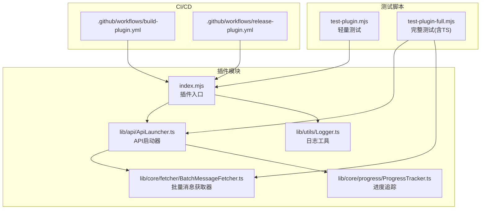
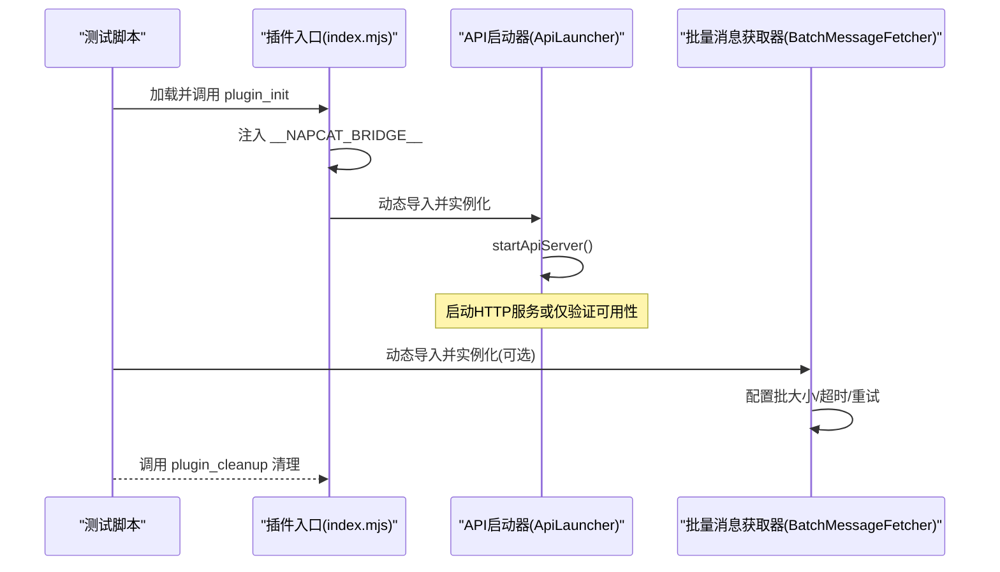
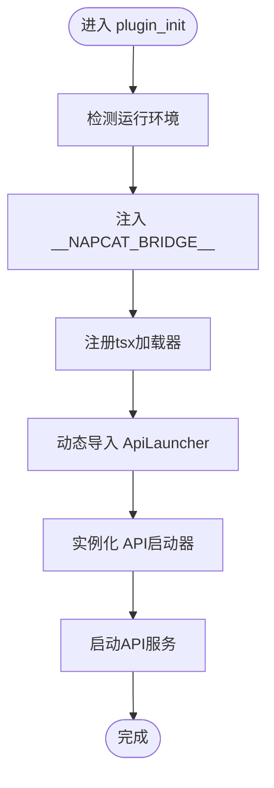
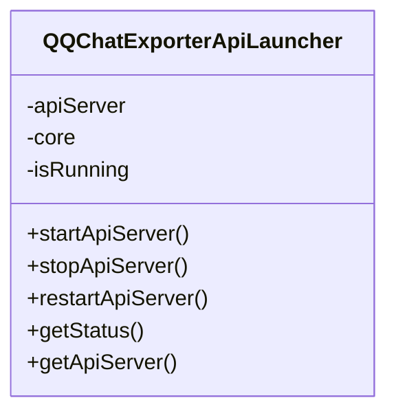
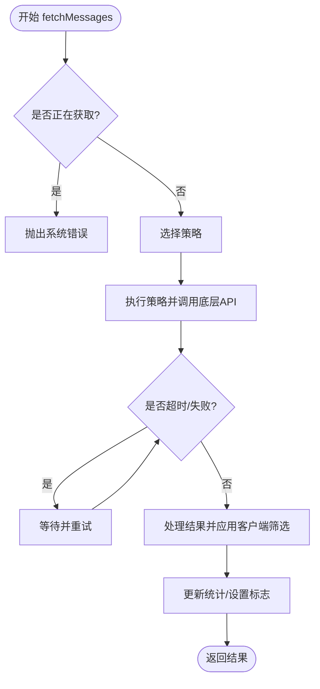
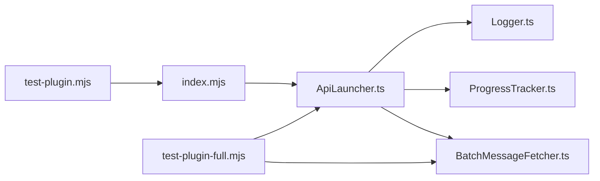

# 测试与调试

<cite>
**本文引用的文件**
- [plugins/qq-chat-exporter/package.json](file://plugins/qq-chat-exporter/package.json)
- [plugins/qq-chat-exporter/test-plugin.mjs](file://plugins/qq-chat-exporter/test-plugin.mjs)
- [plugins/qq-chat-exporter/test-plugin-full.mjs](file://plugins/qq-chat-exporter/test-plugin-full.mjs)
- [plugins/qq-chat-exporter/index.mjs](file://plugins/qq-chat-exporter/index.mjs)
- [plugins/qq-chat-exporter/lib/api/ApiLauncher.ts](file://plugins/qq-chat-exporter/lib/api/ApiLauncher.ts)
- [plugins/qq-chat-exporter/lib/core/fetcher/BatchMessageFetcher.ts](file://plugins/qq-chat-exporter/lib/core/fetcher/BatchMessageFetcher.ts)
- [plugins/qq-chat-exporter/lib/utils/Logger.ts](file://plugins/qq-chat-exporter/lib/utils/Logger.ts)
- [plugins/qq-chat-exporter/lib/core/progress/ProgressTracker.ts](file://plugins/qq-chat-exporter/lib/core/progress/ProgressTracker.ts)
- [.github/workflows/build-plugin.yml](file://.github/workflows/build-plugin.yml)
- [.github/workflows/release-plugin.yml](file://.github/workflows/release-plugin.yml)
</cite>

## 目录
1. [简介](#简介)
2. [项目结构](#项目结构)
3. [核心组件](#核心组件)
4. [架构总览](#架构总览)
5. [详细组件分析](#详细组件分析)
6. [依赖关系分析](#依赖关系分析)
7. [性能考虑](#性能考虑)
8. [故障排查指南](#故障排查指南)
9. [结论](#结论)
10. [附录](#附录)

## 简介
本指南面向“QQ聊天导出器”项目，提供从单元测试、集成测试到端到端测试的完整测试与调试方案，涵盖：
- 单元测试：测试框架选择、测试用例设计、Mock对象与依赖注入
- 集成测试：API测试、数据库测试、文件系统测试
- 端到端测试：用户场景模拟与自动化脚本
- 调试技巧：Node.js调试器、浏览器开发者工具、日志分析
- 性能与压力测试：吞吐、延迟、内存泄漏检测与优化
- 测试覆盖率与持续集成配置

## 项目结构
本项目采用多模块组织方式，核心逻辑位于插件目录，前端工具位于 qce-v4-tool，构建与发布流程由 GitHub Actions 管理。

图表来源
- [plugins/qq-chat-exporter/index.mjs](file://plugins/qq-chat-exporter/index.mjs#L1-L77)
- [plugins/qq-chat-exporter/lib/api/ApiLauncher.ts](file://plugins/qq-chat-exporter/lib/api/ApiLauncher.ts#L1-L68)
- [plugins/qq-chat-exporter/lib/core/fetcher/BatchMessageFetcher.ts](file://plugins/qq-chat-exporter/lib/core/fetcher/BatchMessageFetcher.ts#L1-L684)
- [plugins/qq-chat-exporter/lib/utils/Logger.ts](file://plugins/qq-chat-exporter/lib/utils/Logger.ts#L58-L113)
- [plugins/qq-chat-exporter/lib/core/progress/ProgressTracker.ts](file://plugins/qq-chat-exporter/lib/core/progress/ProgressTracker.ts#L457-L732)
- [plugins/qq-chat-exporter/test-plugin.mjs](file://plugins/qq-chat-exporter/test-plugin.mjs#L1-L134)
- [plugins/qq-chat-exporter/test-plugin-full.mjs](file://plugins/qq-chat-exporter/test-plugin-full.mjs#L1-L145)
- [.github/workflows/build-plugin.yml](file://.github/workflows/build-plugin.yml#L54-L95)
- [.github/workflows/release-plugin.yml](file://.github/workflows/release-plugin.yml#L83-L119)

章节来源
- [plugins/qq-chat-exporter/package.json](file://plugins/qq-chat-exporter/package.json#L1-L42)
- [plugins/qq-chat-exporter/index.mjs](file://plugins/qq-chat-exporter/index.mjs#L1-L77)
- [plugins/qq-chat-exporter/test-plugin.mjs](file://plugins/qq-chat-exporter/test-plugin.mjs#L1-L134)
- [plugins/qq-chat-exporter/test-plugin-full.mjs](file://plugins/qq-chat-exporter/test-plugin-full.mjs#L1-L145)

## 核心组件
- 插件入口与桥接：负责注入运行环境、动态加载TypeScript、创建并启动API服务
- API启动器：封装HTTP服务生命周期管理，提供状态查询与重启能力
- 批量消息获取器：封装底层消息API调用、重试、超时、统计与客户端筛选
- 日志工具：统一日志输出与开关控制
- 进度追踪：任务进度、性能统计与报告生成

章节来源
- [plugins/qq-chat-exporter/index.mjs](file://plugins/qq-chat-exporter/index.mjs#L28-L76)
- [plugins/qq-chat-exporter/lib/api/ApiLauncher.ts](file://plugins/qq-chat-exporter/lib/api/ApiLauncher.ts#L8-L67)
- [plugins/qq-chat-exporter/lib/core/fetcher/BatchMessageFetcher.ts](file://plugins/qq-chat-exporter/lib/core/fetcher/BatchMessageFetcher.ts#L47-L684)
- [plugins/qq-chat-exporter/lib/utils/Logger.ts](file://plugins/qq-chat-exporter/lib/utils/Logger.ts#L58-L113)
- [plugins/qq-chat-exporter/lib/core/progress/ProgressTracker.ts](file://plugins/qq-chat-exporter/lib/core/progress/ProgressTracker.ts#L457-L732)

## 架构总览
下图展示测试与调试相关的调用链路与交互：

图表来源
- [plugins/qq-chat-exporter/test-plugin.mjs](file://plugins/qq-chat-exporter/test-plugin.mjs#L60-L130)
- [plugins/qq-chat-exporter/test-plugin-full.mjs](file://plugins/qq-chat-exporter/test-plugin-full.mjs#L83-L141)
- [plugins/qq-chat-exporter/index.mjs](file://plugins/qq-chat-exporter/index.mjs#L28-L64)
- [plugins/qq-chat-exporter/lib/api/ApiLauncher.ts](file://plugins/qq-chat-exporter/lib/api/ApiLauncher.ts#L17-L32)
- [plugins/qq-chat-exporter/lib/core/fetcher/BatchMessageFetcher.ts](file://plugins/qq-chat-exporter/lib/core/fetcher/BatchMessageFetcher.ts#L66-L88)

## 详细组件分析

### 组件A：插件入口与桥接（index.mjs）
- 职责
  - 检测运行环境（Shell/Framework）
  - 注入全局桥接对象，供Overlay与TypeScript模块使用
  - 动态注册tsx加载器并导入TypeScript模块
  - 启动/停止API服务
- 测试要点
  - 环境检测分支覆盖
  - 桥接对象字段完整性
  - tsx加载器注册与导入异常处理
  - 启动/停止流程幂等性与异常冒泡

图表来源
- [plugins/qq-chat-exporter/index.mjs](file://plugins/qq-chat-exporter/index.mjs#L12-L64)

章节来源
- [plugins/qq-chat-exporter/index.mjs](file://plugins/qq-chat-exporter/index.mjs#L12-L76)

### 组件B：API启动器（ApiLauncher）
- 职责
  - 生命周期管理：启动、停止、重启
  - 状态查询：运行状态、端口、运行时长
  - 异常记录与传播
- 测试要点
  - 并发重复启动/停止的幂等性
  - 状态查询一致性
  - 异常路径日志与抛出行为

图表来源
- [plugins/qq-chat-exporter/lib/api/ApiLauncher.ts](file://plugins/qq-chat-exporter/lib/api/ApiLauncher.ts#L8-L67)

章节来源
- [plugins/qq-chat-exporter/lib/api/ApiLauncher.ts](file://plugins/qq-chat-exporter/lib/api/ApiLauncher.ts#L8-L67)

### 组件C：批量消息获取器（BatchMessageFetcher）
- 职责
  - 批量拉取消息、策略选择、重试与超时
  - 客户端侧筛选（时间、发送者、类型、关键词）
  - 统计信息与取消令牌
- 测试要点
  - 策略选择逻辑与边界条件
  - 重试与超时阈值
  - 客户端筛选准确性
  - 统计指标更新与并发安全

图表来源
- [plugins/qq-chat-exporter/lib/core/fetcher/BatchMessageFetcher.ts](file://plugins/qq-chat-exporter/lib/core/fetcher/BatchMessageFetcher.ts#L107-L151)
- [plugins/qq-chat-exporter/lib/core/fetcher/BatchMessageFetcher.ts](file://plugins/qq-chat-exporter/lib/core/fetcher/BatchMessageFetcher.ts#L225-L246)
- [plugins/qq-chat-exporter/lib/core/fetcher/BatchMessageFetcher.ts](file://plugins/qq-chat-exporter/lib/core/fetcher/BatchMessageFetcher.ts#L551-L594)

章节来源
- [plugins/qq-chat-exporter/lib/core/fetcher/BatchMessageFetcher.ts](file://plugins/qq-chat-exporter/lib/core/fetcher/BatchMessageFetcher.ts#L47-L684)

### 组件D：日志与进度追踪
- 日志工具
  - 提供不同级别日志与开关控制
  - 预置命名空间日志器
- 进度追踪
  - 任务状态、阶段、性能统计
  - 报告生成与历史速度维护

章节来源
- [plugins/qq-chat-exporter/lib/utils/Logger.ts](file://plugins/qq-chat-exporter/lib/utils/Logger.ts#L58-L113)
- [plugins/qq-chat-exporter/lib/core/progress/ProgressTracker.ts](file://plugins/qq-chat-exporter/lib/core/progress/ProgressTracker.ts#L457-L732)

## 依赖关系分析
- 插件入口依赖API启动器；API启动器依赖核心上下文与日志工具
- 批量消息获取器依赖NapCat核心API与类型定义
- 测试脚本通过Mock注入桥接对象，绕过真实环境

图表来源
- [plugins/qq-chat-exporter/index.mjs](file://plugins/qq-chat-exporter/index.mjs#L28-L64)
- [plugins/qq-chat-exporter/lib/api/ApiLauncher.ts](file://plugins/qq-chat-exporter/lib/api/ApiLauncher.ts#L1-L68)
- [plugins/qq-chat-exporter/lib/utils/Logger.ts](file://plugins/qq-chat-exporter/lib/utils/Logger.ts#L58-L113)
- [plugins/qq-chat-exporter/lib/core/progress/ProgressTracker.ts](file://plugins/qq-chat-exporter/lib/core/progress/ProgressTracker.ts#L457-L732)
- [plugins/qq-chat-exporter/lib/core/fetcher/BatchMessageFetcher.ts](file://plugins/qq-chat-exporter/lib/core/fetcher/BatchMessageFetcher.ts#L1-L684)
- [plugins/qq-chat-exporter/test-plugin.mjs](file://plugins/qq-chat-exporter/test-plugin.mjs#L60-L130)
- [plugins/qq-chat-exporter/test-plugin-full.mjs](file://plugins/qq-chat-exporter/test-plugin-full.mjs#L83-L141)

章节来源
- [plugins/qq-chat-exporter/package.json](file://plugins/qq-chat-exporter/package.json#L22-L30)

## 性能考虑
- 批量获取参数
  - 批大小、超时、重试次数与间隔直接影响吞吐与稳定性
  - 建议在测试环境中逐步调整并记录平均响应时间与失败率
- 策略选择
  - 混合策略需根据筛选条件动态切换，避免不必要的复杂API调用
- 统计与监控
  - 利用进度追踪的性能统计生成报告，识别瓶颈
- 内存与GC
  - 大批次消息处理时注意及时释放中间对象，避免累积
  - 使用进程级内存分析工具定位泄漏

[本节为通用指导，无需列出章节来源]

## 故障排查指南
- 启动失败
  - 检查桥接对象字段是否完整
  - 确认tsx加载器注册成功
  - 查看API启动器日志与异常栈
- 获取异常
  - 核对重试与超时配置
  - 检查客户端筛选是否导致空结果集
- 调试工具
  - Node.js：使用内置调试器或VS Code附加进程
  - 浏览器：结合前端工具与网络面板观察请求/响应
  - 日志：开启QCE_DEBUG或相应命名空间日志

章节来源
- [plugins/qq-chat-exporter/lib/utils/Logger.ts](file://plugins/qq-chat-exporter/lib/utils/Logger.ts#L69-L91)
- [plugins/qq-chat-exporter/lib/api/ApiLauncher.ts](file://plugins/qq-chat-exporter/lib/api/ApiLauncher.ts#L26-L31)
- [plugins/qq-chat-exporter/lib/core/fetcher/BatchMessageFetcher.ts](file://plugins/qq-chat-exporter/lib/core/fetcher/BatchMessageFetcher.ts#L551-L594)

## 结论
本指南提供了从单元到端到端的测试与调试实践，结合现有测试脚本与核心组件，建议在CI中集成构建与打包流程，并在本地引入覆盖率与性能回归检查，确保质量与稳定性。

[本节为总结性内容，无需列出章节来源]

## 附录

### 单元测试编写方法
- 测试框架
  - 推荐使用Mocha + Chai或Jest，便于断言与异步测试
- Mock对象
  - 使用jest.mock或Sinon对NapCat核心API进行拦截
  - 在测试前注入桥接对象，隔离真实依赖
- 测试用例设计
  - 正向路径：启动/停止、策略选择、筛选通过
  - 边界路径：空结果、超时、重试耗尽、取消令牌
  - 异常用例：异常抛出、日志记录、状态一致

章节来源
- [plugins/qq-chat-exporter/test-plugin.mjs](file://plugins/qq-chat-exporter/test-plugin.mjs#L10-L130)
- [plugins/qq-chat-exporter/test-plugin-full.mjs](file://plugins/qq-chat-exporter/test-plugin-full.mjs#L22-L141)

### 集成测试策略
- API测试
  - 使用Supertest或Axios发起HTTP请求，验证路由与响应
  - 覆盖启动/停止、状态查询、错误码
- 数据库测试
  - 如涉及持久化，使用内存数据库或临时目录
  - 验证读写一致性与事务回滚
- 文件系统测试
  - 验证导出文件生成、压缩与清理
  - 路径与权限校验

[本节为通用指导，无需列出章节来源]

### 端到端测试
- 用户场景
  - 登录、选择会话、设置导出范围、触发导出、查看结果
- 自动化脚本
  - 使用Playwright或Puppeteer驱动浏览器
  - 截图与断言页面元素状态
- 回归测试
  - 将常见场景录制为脚本，定期执行

[本节为通用指导，无需列出章节来源]

### 调试技巧与工具
- Node.js调试器
  - 使用inspect标志附加调试器，设置断点与变量观察
- 浏览器开发者工具
  - 网络面板抓取API请求，Console输出日志
- 日志分析
  - 使用命名空间日志区分模块，结合时间戳定位问题

章节来源
- [plugins/qq-chat-exporter/lib/utils/Logger.ts](file://plugins/qq-chat-exporter/lib/utils/Logger.ts#L103-L113)

### 性能与压力测试
- 吞吐与延迟
  - 使用Artillery或自定义脚本模拟高并发请求
  - 记录P95/P99延迟与错误率
- 内存泄漏检测
  - 使用heapdump与heap-snapshot对比快照
  - 关注大对象与事件监听器泄漏
- 优化建议
  - 合理批大小与并发度
  - 及时释放资源与缓存

[本节为通用指导，无需列出章节来源]

### 测试覆盖率与持续集成
- 覆盖率
  - Jest内置覆盖率报告，建议阈值：语句/分支/函数/行≥80%
- CI配置
  - 构建与打包：参考构建工作流
  - 发布流程：参考发布工作流
  - 建议新增测试与覆盖率步骤

章节来源
- [.github/workflows/build-plugin.yml](file://.github/workflows/build-plugin.yml#L54-L95)
- [.github/workflows/release-plugin.yml](file://.github/workflows/release-plugin.yml#L83-L119)