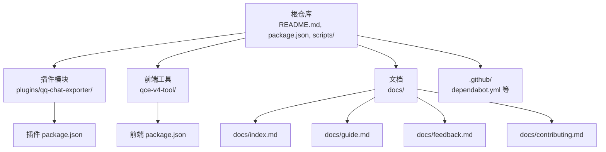
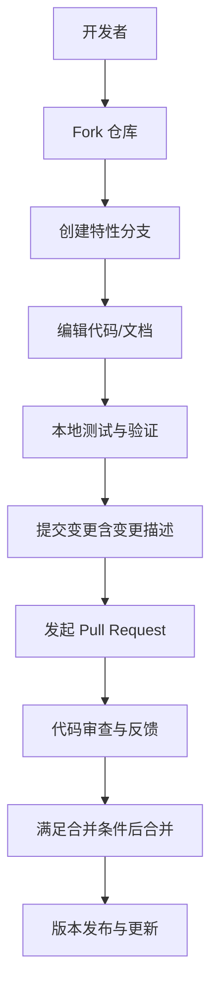
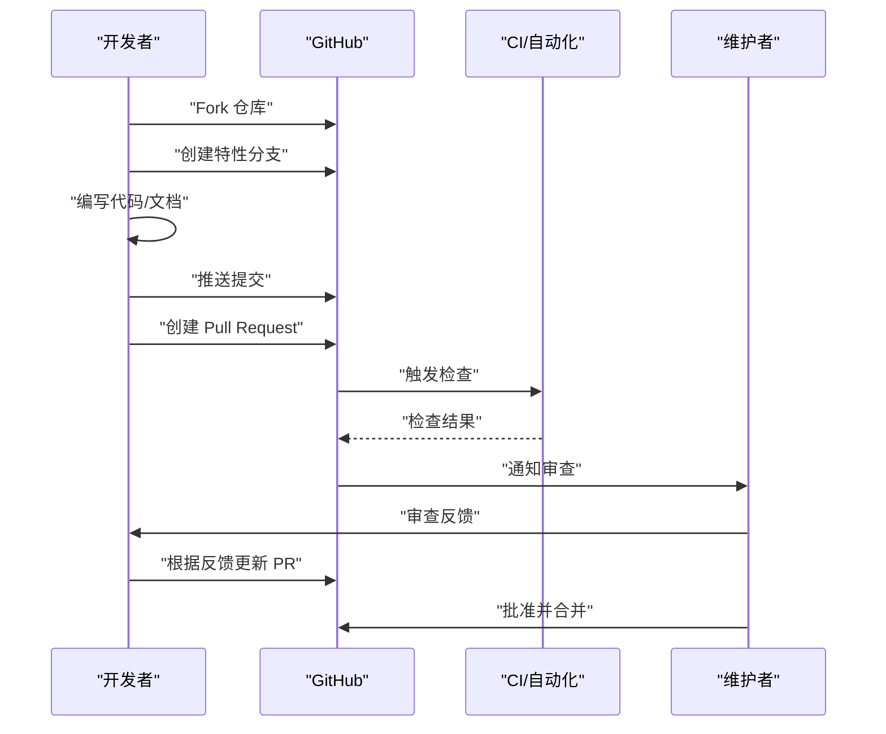
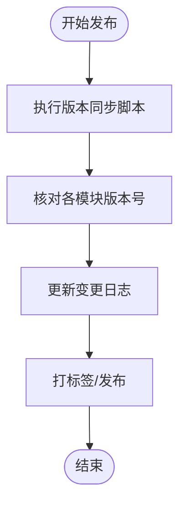
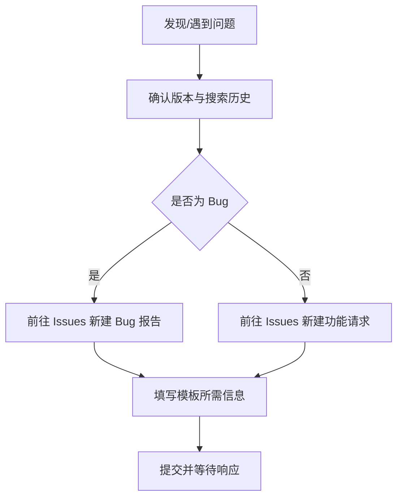
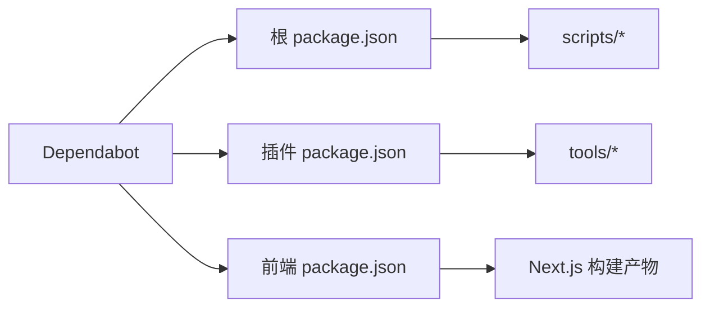

# 贡献流程与规范

<cite>
**本文引用的文件**
- [README.md](file://README.md)
- [docs/index.md](file://docs/index.md)
- [docs/contributing.md](file://docs/contributing.md)
- [docs/feedback.md](file://docs/feedback.md)
- [docs/guide.md](file://docs/guide.md)
- [package.json](file://package.json)
- [plugins/qq-chat-exporter/package.json](file://plugins/qq-chat-exporter/package.json)
- [qce-v4-tool/package.json](file://qce-v4-tool/package.json)
- [.github/dependabot.yml](file://.github/dependabot.yml)
- [CLAUDE.md](file://CLAUDE.md)
- [scripts/sync-version.js](file://scripts/sync-version.js)
</cite>

## 目录
1. [简介](#简介)
2. [项目结构](#项目结构)
3. [核心组件](#核心组件)
4. [架构总览](#架构总览)
5. [详细组件分析](#详细组件分析)
6. [依赖分析](#依赖分析)
7. [性能考虑](#性能考虑)
8. [故障排查指南](#故障排查指南)
9. [结论](#结论)
10. [附录](#附录)

## 简介
本指南面向希望为 QQ 聊天导出器（QCE）贡献代码、文档或提出问题的开发者与用户。内容覆盖从 Fork 项目到提交 Pull Request 的完整流程，涵盖提交信息规范、变更描述与版本号更新策略，以及代码审查标准、反馈与问题报告规范、文档贡献方式与社区沟通渠道。

## 项目结构
QCE 仓库包含多个子项目与文档资源，主要由以下部分组成：
- 根仓库：顶层说明、许可证、脚本与通用配置
- 插件模块：qq-chat-exporter 插件（核心导出逻辑与工具链）
- Web 前端工具：qce-v4-tool（Next.js 应用，提供图形化管理界面）
- 文档：docs 目录下的使用手册、贡献指南、反馈说明与首页索引
- GitHub 工作流与依赖策略：.github 目录下的自动化配置

图表来源
- [README.md](file://README.md#L1-L42)
- [docs/index.md](file://docs/index.md#L1-L14)
- [plugins/qq-chat-exporter/package.json](file://plugins/qq-chat-exporter/package.json#L1-L42)
- [qce-v4-tool/package.json](file://qce-v4-tool/package.json#L1-L74)

章节来源
- [README.md](file://README.md#L1-L42)
- [docs/index.md](file://docs/index.md#L1-L14)

## 核心组件
- 插件模块（qq-chat-exporter）：提供导出能力、测试脚本与工具链，负责与 NapCat 生态集成。
- 前端工具（qce-v4-tool）：基于 Next.js 的 Web 管理界面，用于任务调度、导出配置与资源管理。
- 文档系统：使用 MkDocs（mkdocs.yml）构建，提供在线文档与导航。
- 顶层脚本与配置：统一版本同步、打包与构建脚本，保障多模块一致性。

章节来源
- [plugins/qq-chat-exporter/package.json](file://plugins/qq-chat-exporter/package.json#L1-L42)
- [qce-v4-tool/package.json](file://qce-v4-tool/package.json#L1-L74)
- [package.json](file://package.json#L1-L76)

## 架构总览
QCE 的贡献涉及三个层面：
- 代码层：插件与前端工具的开发与测试
- 文档层：使用手册、贡献指南与反馈说明
- 流程层：版本同步、依赖更新与自动化策略

## 详细组件分析

### 贡献流程（从 Fork 到合并）
- Fork 项目：在 GitHub 上 Fork 主仓库至个人账户
- 创建分支：基于主分支创建特性分支，命名建议清晰表达变更意图
- 提交代码：遵循提交信息规范与变更描述要求
- 发起 PR：在 GitHub 上提交 Pull Request，并填写必要的描述与关联 Issue
- 代码审查：维护者进行审查，根据反馈迭代直至满足合并要求
- 合并：通过审查后，由维护者合并到主分支

章节来源
- [docs/contributing.md](file://docs/contributing.md)

### 提交规范（Commit Message 与变更描述）
- 提交信息格式建议采用“类型: 概述”结构，配合更详细的变更描述
- 变更描述需说明动机、影响范围与风险提示
- 若涉及版本号更新，需在提交信息中明确指出或在 PR 描述中说明

章节来源
- [docs/contributing.md](file://docs/contributing.md)

### 版本号更新策略
- 顶层与各模块均维护独立版本号，确保发布一致性
- 使用统一的版本同步脚本，保证多模块版本对齐
- 发布前核对版本号与变更日志，避免遗漏

章节来源
- [scripts/sync-version.js](file://scripts/sync-version.js)
- [package.json](file://package.json#L5-L5)
- [plugins/qq-chat-exporter/package.json](file://plugins/qq-chat-exporter/package.json#L3-L3)
- [qce-v4-tool/package.json](file://qce-v4-tool/package.json#L4-L4)

### 代码审查流程与标准
- 审查范围：功能正确性、性能影响、安全性、可维护性与兼容性
- 反馈处理：针对审查意见逐项回复与修正，必要时补充测试或文档
- 合并要求：至少一名维护者批准；自动化检查全部通过；无阻塞性异议

章节来源
- [docs/contributing.md](file://docs/contributing.md)

### 问题报告与功能请求
- 提交前建议：确认使用最新版本；搜索是否已有类似问题
- Bug 报告：提供版本号、运行模式、操作系统、复现步骤、错误信息与日志
- 功能建议：描述使用场景与期望效果；如有竞品参考可一并提供

章节来源
- [docs/feedback.md](file://docs/feedback.md#L1-L23)
- [docs/guide.md](file://docs/guide.md#L1-L200)

### 文档贡献指南
- 文档编写规范：结构清晰、语言简洁、术语一致；提供必要的截图与示例链接
- 翻译贡献：优先保证中文文档完整性，再进行多语言翻译；保持与英文版同步
- 示例代码：提供最小可运行示例与说明，便于用户快速上手

章节来源
- [docs/contributing.md](file://docs/contributing.md)
- [docs/index.md](file://docs/index.md#L1-L14)

### 社区参与与沟通渠道
- 使用文档与入门：通过文档首页链接访问使用手册与贡献指南
- 问题反馈：在 Issues 页面提交 Bug 与功能请求
- API 参考：通过 DeepWiki 获取接口文档
- 许可证与致谢：遵循 GPL-3.0 许可证，感谢相关生态团队的支持

章节来源
- [docs/index.md](file://docs/index.md#L1-L14)
- [README.md](file://README.md#L39-L42)

## 依赖分析
- 依赖更新策略：通过 Dependabot 定期扫描并生成更新建议
- 插件与前端依赖：各自维护独立的 package.json，确保模块化与可替换性
- 顶层脚本：统一构建、测试与打包流程，减少重复劳动

图表来源
- [.github/dependabot.yml](file://.github/dependabot.yml#L1-L7)
- [package.json](file://package.json#L1-L76)
- [plugins/qq-chat-exporter/package.json](file://plugins/qq-chat-exporter/package.json#L1-L42)
- [qce-v4-tool/package.json](file://qce-v4-tool/package.json#L1-L74)

章节来源
- [.github/dependabot.yml](file://.github/dependabot.yml#L1-L7)
- [package.json](file://package.json#L1-L76)

## 性能考虑
- 导出超大群时建议启用流式导出，降低内存占用与崩溃风险
- 批量导出与定时任务可提升效率，减少人工干预
- 前端构建产物需保持静态资源层级完整，避免运行时路径错误

章节来源
- [docs/guide.md](file://docs/guide.md#L170-L176)
- [docs/guide.md](file://docs/guide.md#L161-L169)

## 故障排查指南
- 插件部署：若出现模块缺失或路径错误，按部署指南重建 Overlay Runtime 并正确复制文件夹结构
- 前端构建：确保构建产物完整，静态路径映射与 index.html 引用一致
- 常见错误：参考部署文档中的错误定位与修复建议

章节来源
- [CLAUDE.md](file://CLAUDE.md#L60-L79)

## 结论
QCE 的贡献流程强调规范化与协作效率。通过清晰的提交规范、严格的审查流程与完善的文档体系，能够有效提升代码质量与用户体验。建议贡献者在提交前充分阅读相关文档，并按流程执行，共同维护项目的健康与可持续发展。

## 附录
- 快速入口
  - 使用手册：[docs/guide.md](file://docs/guide.md)
  - 贡献指南：[docs/contributing.md](file://docs/contributing.md)
  - 反馈与问题：[docs/feedback.md](file://docs/feedback.md)
  - 文档首页：[docs/index.md](file://docs/index.md)