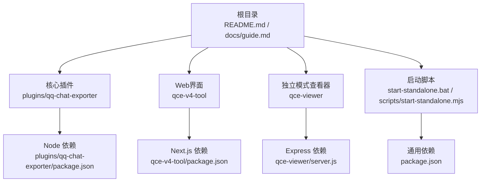
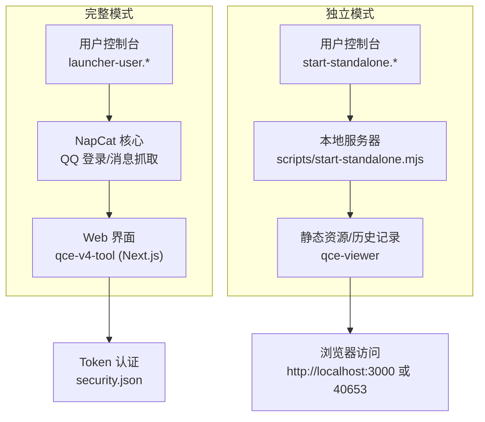
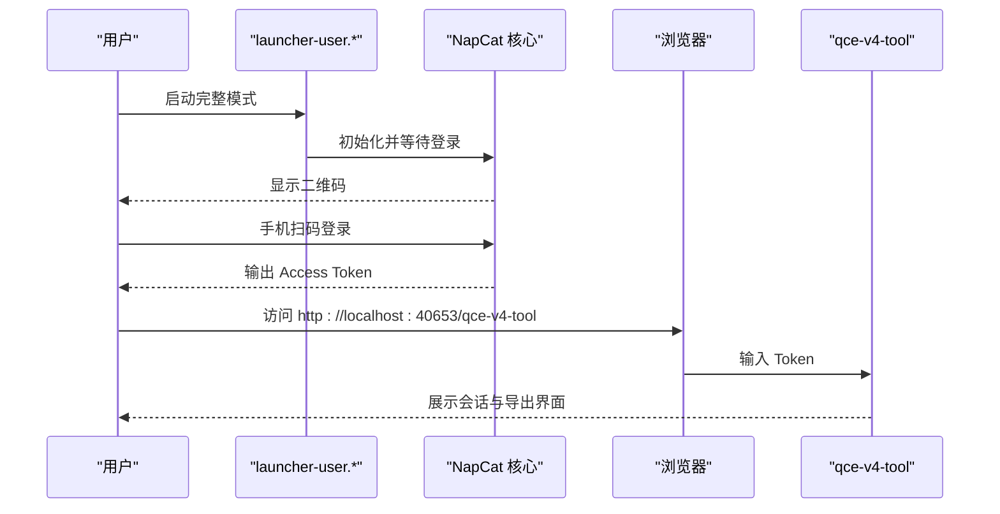
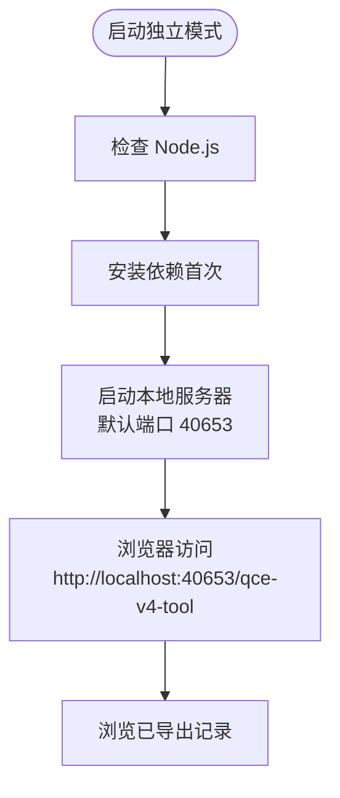
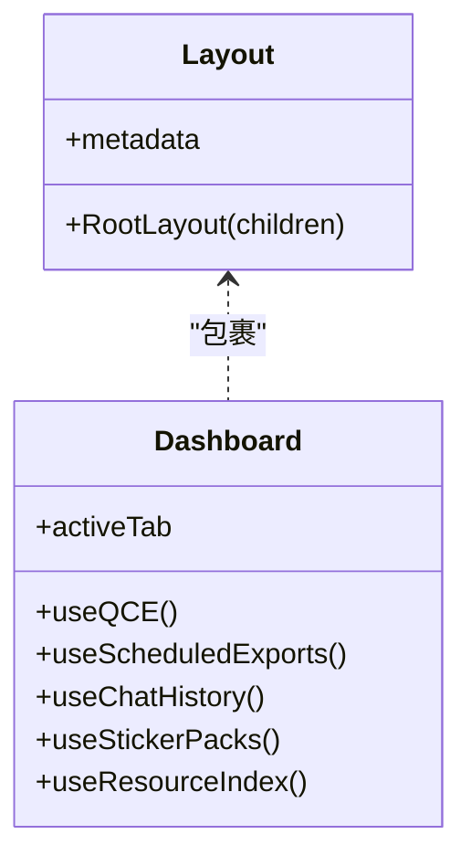
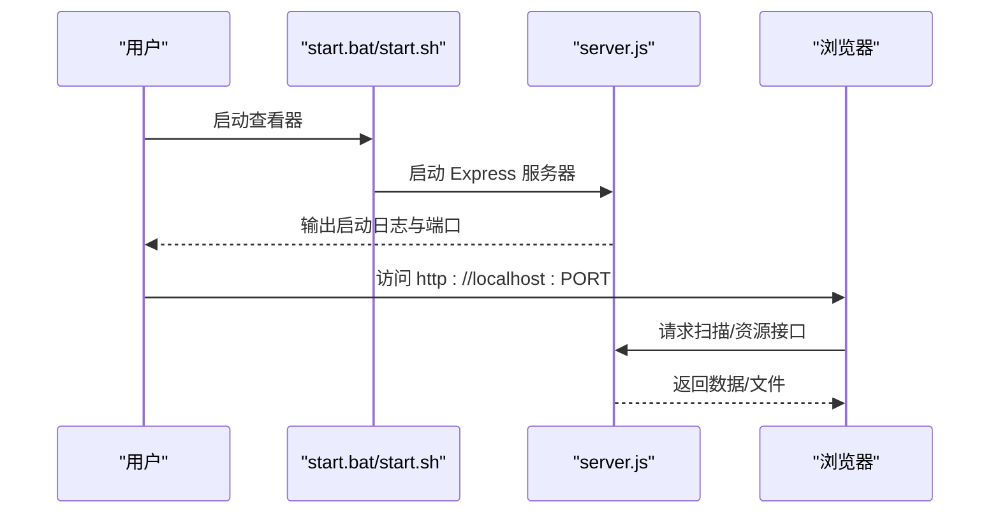
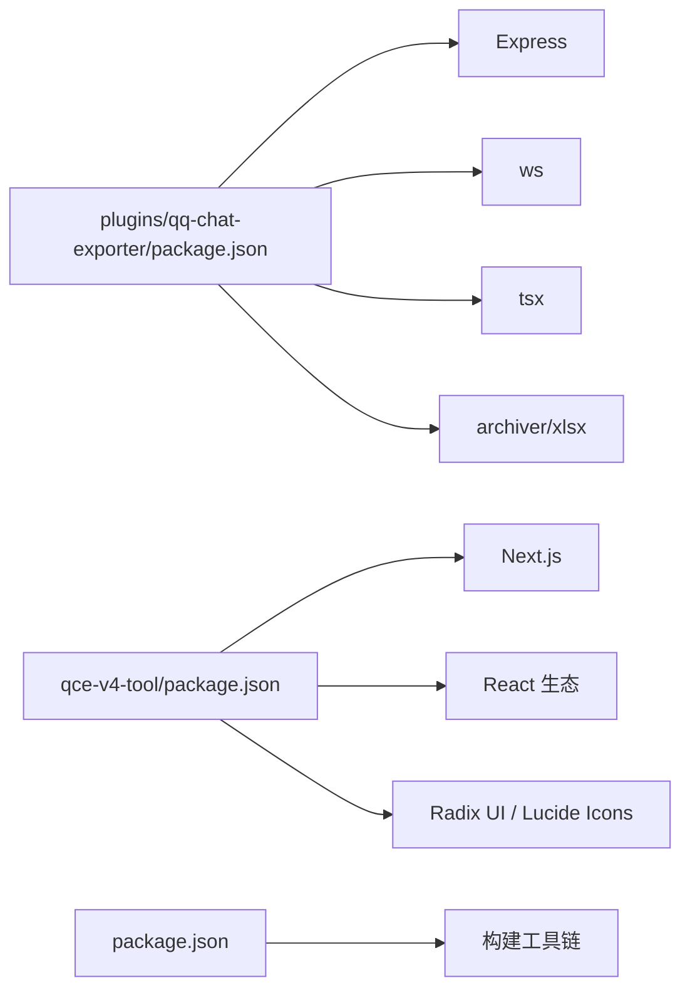

# 快速开始

<cite>
**本文引用的文件**
- [README.md](file://README.md)
- [docs/guide.md](file://docs/guide.md)
- [start-standalone.bat](file://start-standalone.bat)
- [scripts/start-standalone.mjs](file://scripts/start-standalone.mjs)
- [plugins/qq-chat-exporter/package.json](file://plugins/qq-chat-exporter/package.json)
- [qce-viewer/README.md](file://qce-viewer/README.md)
- [qce-viewer/server.js](file://qce-viewer/server.js)
- [qce-viewer/start.bat](file://qce-viewer/start.bat)
- [qce-viewer/start.sh](file://qce-viewer/start.sh)
- [qce-v4-tool/app/layout.tsx](file://qce-v4-tool/app/layout.tsx)
- [qce-v4-tool/app/page.tsx](file://qce-v4-tool/app/page.tsx)
- [qce-v4-tool/package.json](file://qce-v4-tool/package.json)
- [package.json](file://package.json)
</cite>

## 目录
1. [简介](#简介)
2. [项目结构](#项目结构)
3. [核心组件](#核心组件)
4. [架构总览](#架构总览)
5. [详细组件分析](#详细组件分析)
6. [依赖关系分析](#依赖关系分析)
7. [性能注意事项](#性能注意事项)
8. [故障排除指南](#故障排除指南)
9. [结论](#结论)
10. [附录](#附录)

## 简介
本指南面向首次使用 QQ 聊天导出器（QCE）的用户，提供从下载、启动、登录到访问 Web 界面的完整流程，覆盖 Windows 与 Linux 的不同启动方式，解释 Token 的作用与获取方法，并给出常见问题的解决方案。同时介绍独立模式与完整模式的区别，以及基本的导出配置与使用示例。

## 项目结构
本仓库包含多个子模块与工具：
- 核心插件与构建产物：plugins/qq-chat-exporter
- Web 界面（Next.js）：qce-v4-tool
- 独立模式查看器：qce-viewer
- 通用启动脚本与说明：根目录下的 README、docs/guide、start-standalone.bat、scripts/start-standalone.mjs 等

**图表来源**
- [README.md](file://README.md#L1-L42)
- [docs/guide.md](file://docs/guide.md#L1-L200)
- [plugins/qq-chat-exporter/package.json](file://plugins/qq-chat-exporter/package.json#L1-L42)
- [qce-v4-tool/package.json](file://qce-v4-tool/package.json#L1-L74)
- [qce-viewer/server.js](file://qce-viewer/server.js#L1-L233)
- [package.json](file://package.json#L1-L76)

**章节来源**
- [README.md](file://README.md#L1-L42)
- [docs/guide.md](file://docs/guide.md#L1-L200)

## 核心组件
- 完整模式（需登录 QQ）：通过 launcher-user.* 启动 NapCat 并在 Web 界面进行导出与管理。
- 独立模式（无需登录）：仅用于浏览已导出的历史记录，通过 start-standalone.* 启动本地服务器。
- Web 界面（qce-v4-tool）：Next.js 应用，提供会话、任务、定时导出、资源管理等功能。
- 独立查看器（qce-viewer）：Express 服务器，扫描并展示已导出的聊天文件，便于离线查看。

**章节来源**
- [docs/guide.md](file://docs/guide.md#L63-L118)
- [qce-v4-tool/app/layout.tsx](file://qce-v4-tool/app/layout.tsx#L1-L69)
- [qce-v4-tool/app/page.tsx](file://qce-v4-tool/app/page.tsx#L1-L800)
- [qce-viewer/README.md](file://qce-viewer/README.md#L1-L39)

## 架构总览
下图展示了两种启动模式与 Web 界面的关系：

**图表来源**
- [docs/guide.md](file://docs/guide.md#L35-L118)
- [scripts/start-standalone.mjs](file://scripts/start-standalone.mjs#L1-L55)
- [qce-viewer/server.js](file://qce-viewer/server.js#L1-L233)

## 详细组件分析

### 完整模式：下载、登录与 Web 界面访问
- 下载与选择模式
  - 从 Releases 页面下载对应平台的包（Shell 模式或 Framework 模式）。
  - Framework 模式需要退出已有 QQ 登录，再运行 napiLoader.bat 并扫码登录。
- 启动与登录
  - Windows：双击 launcher-user.bat；Linux：执行 ./launcher-user.sh。
  - 控制台出现二维码后，使用手机 QQ 扫码登录。
- 获取 Token
  - 登录成功后，在控制台复制 Access Token。
  - 若未找到，可通过 Win+R 打开 %USERPROFILE%\.qq-chat-exporter，打开 security.json，找到 accessToken。
- 访问 Web 界面
  - 在浏览器访问 http://localhost:40653/qce-v4-tool，粘贴 Token 后即可使用。

**图表来源**
- [docs/guide.md](file://docs/guide.md#L35-L118)

**章节来源**
- [docs/guide.md](file://docs/guide.md#L11-L118)
- [README.md](file://README.md#L11-L17)

### 独立模式：浏览已导出记录
- 启动方式
  - Windows：双击 start-standalone.bat；Linux：执行 ./start-standalone.sh。
  - 脚本会检查 Node.js 与依赖，自动安装并启动本地服务器，默认端口 40653。
- 访问与使用
  - 浏览器访问 http://localhost:40653/qce-v4-tool，无需 Token。
  - 该模式适合仅查看历史导出文件，不涉及实时登录。

**图表来源**
- [start-standalone.bat](file://start-standalone.bat#L1-L44)
- [scripts/start-standalone.mjs](file://scripts/start-standalone.mjs#L1-L55)

**章节来源**
- [docs/guide.md](file://docs/guide.md#L111-L118)
- [start-standalone.bat](file://start-standalone.bat#L1-L44)
- [scripts/start-standalone.mjs](file://scripts/start-standalone.mjs#L1-L55)

### Web 界面（qce-v4-tool）概览
- 技术栈与布局
  - Next.js + React，使用 Geist 字体与主题系统，支持暗色模式。
  - 布局文件负责全局样式与主题初始化。
- 主页功能
  - 会话列表、任务管理、定时导出、资源索引、表情包导出等。
  - 支持批量导出、流式导出、ZIP 打包等高级选项。
- 认证与 Token
  - 首次访问需要输入 Access Token，Token 来自 security.json。

**图表来源**
- [qce-v4-tool/app/layout.tsx](file://qce-v4-tool/app/layout.tsx#L1-L69)
- [qce-v4-tool/app/page.tsx](file://qce-v4-tool/app/page.tsx#L1-L800)

**章节来源**
- [qce-v4-tool/app/layout.tsx](file://qce-v4-tool/app/layout.tsx#L1-L69)
- [qce-v4-tool/app/page.tsx](file://qce-v4-tool/app/page.tsx#L1-L800)

### 独立查看器（qce-viewer）概览
- 启动脚本
  - Windows：start.bat；Linux：start.sh。均会检查 Node.js 与依赖，然后启动 server.js。
- 服务器功能
  - 提供静态文件服务、扫描导出文件、资源访问接口、健康检查等。
  - 默认端口 3000，可通过环境变量 PORT 修改。
- 使用场景
  - 无需登录即可浏览已导出的聊天记录与资源，适合离线查看。

**图表来源**
- [qce-viewer/start.bat](file://qce-viewer/start.bat#L1-L28)
- [qce-viewer/start.sh](file://qce-viewer/start.sh#L1-L25)
- [qce-viewer/server.js](file://qce-viewer/server.js#L1-L233)

**章节来源**
- [qce-viewer/README.md](file://qce-viewer/README.md#L10-L26)
- [qce-viewer/server.js](file://qce-viewer/server.js#L1-L233)

## 依赖关系分析
- 核心插件依赖
  - Node 版本要求 >= 18；使用 Express、ws、tsx、archiver、xlsx 等依赖。
- Web 界面依赖
  - Next.js、React、Radix UI、Lucide Icons、TailwindCSS 等。
- 通用依赖
  - 根 package.json 提供构建脚本与开发依赖。

**图表来源**
- [plugins/qq-chat-exporter/package.json](file://plugins/qq-chat-exporter/package.json#L22-L30)
- [qce-v4-tool/package.json](file://qce-v4-tool/package.json#L12-L73)
- [package.json](file://package.json#L20-L76)

**章节来源**
- [plugins/qq-chat-exporter/package.json](file://plugins/qq-chat-exporter/package.json#L1-L42)
- [qce-v4-tool/package.json](file://qce-v4-tool/package.json#L1-L74)
- [package.json](file://package.json#L1-L76)

## 性能注意事项
- 大群导出建议
  - 使用“流式导出”与“导出为 ZIP”，可显著降低内存占用并提升加载体验。
- 导出格式选择
  - HTML 适合人工阅读与分享，JSON/XLSX 适合数据分析，TXT 最节省空间。
- 资源下载策略
  - 默认自动下载图片/视频；若追求速度可勾选“快速导出（跳过资源下载）”。

**章节来源**
- [docs/guide.md](file://docs/guide.md#L132-L176)

## 故障排除指南
- 端口冲突
  - 独立查看器默认端口 3000，可在启动前设置环境变量 PORT=新端口号。
  - 独立模式默认端口 40653，可通过命令行参数传入自定义端口。
- 未检测到 Node.js
  - 启动脚本会提示安装 Node.js（版本要求见各 package.json）。
- 依赖安装失败
  - 确认网络可用，必要时清理缓存后重试；首次运行会自动安装依赖。
- Token 无效或找不到
  - 按 Win+R 打开 %USERPROFILE%\.qq-chat-exporter，打开 security.json，复制 accessToken。
- 权限问题
  - 确保导出目录可读写；若使用非管理员账户，注意目标路径权限。

**章节来源**
- [qce-viewer/README.md](file://qce-viewer/README.md#L24-L26)
- [docs/guide.md](file://docs/guide.md#L90-L110)
- [scripts/start-standalone.mjs](file://scripts/start-standalone.mjs#L25-L51)

## 结论
通过本快速开始指南，你可以完成从下载、启动、登录到访问 Web 界面的全流程。根据需求选择完整模式（需登录）或独立模式（无需登录）。遇到问题时，优先检查端口、Node.js 与依赖、Token 获取路径。祝你顺利导出并管理 QQ 聊天记录！

## 附录
- 常用入口
  - 完整模式：http://localhost:40653/qce-v4-tool（需 Token）
  - 独立模式：http://localhost:40653/qce-v4-tool（无需 Token）
  - 独立查看器：http://localhost:3000（查看已导出文件）

**章节来源**
- [README.md](file://README.md#L11-L17)
- [docs/guide.md](file://docs/guide.md#L111-L118)
- [qce-viewer/README.md](file://qce-viewer/README.md#L18-L18)