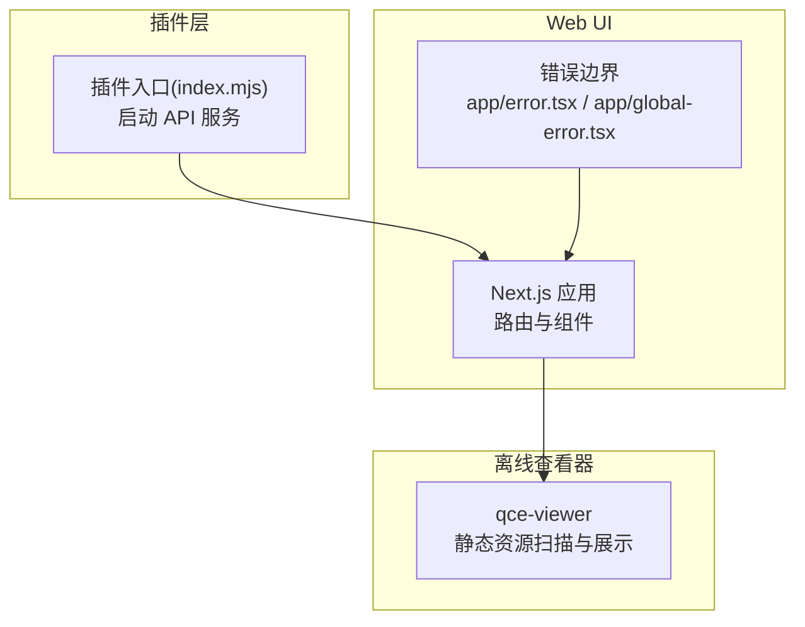
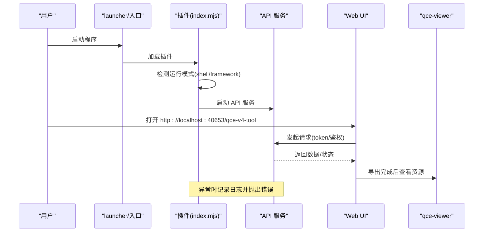
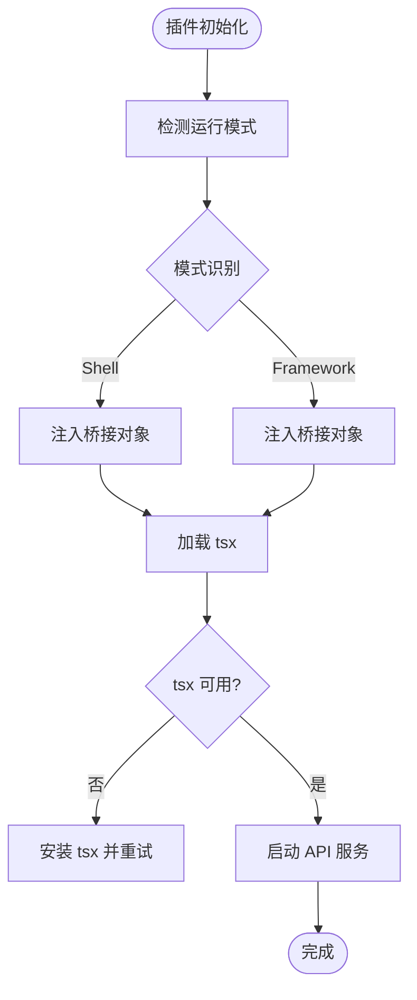
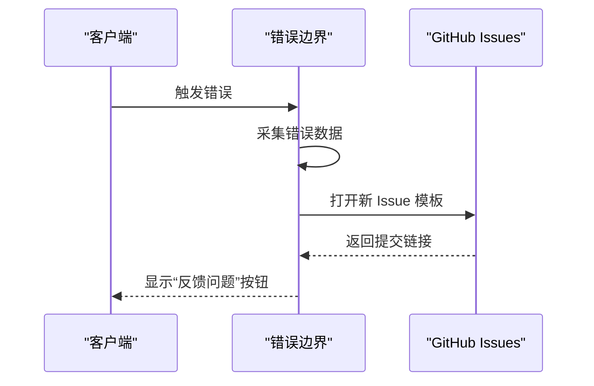
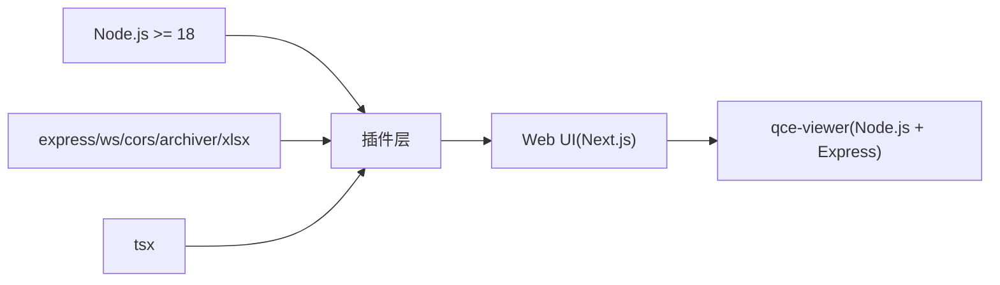

# 故障排除与常见问题

<cite>
**本文引用的文件**
- [README.md](file://README.md)
- [指南.md](file://docs/guide.md)
- [反馈.md](file://docs/feedback.md)
- [插件包(package.json)](file://plugins/qq-chat-exporter/package.json)
- [UI包(package.json)](file://qce-v4-tool/package.json)
- [qce-viewer 说明](file://qce-viewer/README.md)
- [插件入口(index.mjs)](file://plugins/qq-chat-exporter/index.mjs)
- [UI错误处理(app/error.tsx)](file://qce-v4-tool/app/error.tsx)
- [UI全局错误(app/global-error.tsx)](file://qce-v4-tool/app/global-error.tsx)
</cite>

## 目录
1. [简介](#简介)
2. [项目结构](#项目结构)
3. [核心组件](#核心组件)
4. [架构总览](#架构总览)
5. [详细组件分析](#详细组件分析)
6. [依赖关系分析](#依赖关系分析)
7. [性能考虑](#性能考虑)
8. [故障排除指南](#故障排除指南)
9. [结论](#结论)
10. [附录](#附录)

## 简介
本文件面向使用 QQ 聊天导出器（QCE）的用户与技术支持团队，提供系统化的故障排除与常见问题解答。内容覆盖安装、运行、导出、性能等维度，配套诊断步骤、日志分析方法、错误参考与修复建议，并给出跨平台差异与预防性维护建议。

## 项目结构
QCE 由三部分组成：
- 插件层：在 NapCat 框架中运行，负责与 QQ 协议交互、导出任务调度与 API 服务启动。
- Web UI 层：Next.js 构建的管理界面，提供会话、任务、定时、设置等功能。
- 离线查看器：qce-viewer，用于本地查看已导出的聊天包，无需登录。

图表来源
- [插件入口(index.mjs)](file://plugins/qq-chat-exporter/index.mjs#L1-L77)
- [UI错误处理(app/error.tsx)](file://qce-v4-tool/app/error.tsx#L1-L129)
- [UI全局错误(app/global-error.tsx)](file://qce-v4-tool/app/global-error.tsx#L1-L190)
- [qce-viewer 说明](file://qce-viewer/README.md#L1-L39)

章节来源
- [README.md](file://README.md#L1-L42)
- [插件入口(index.mjs)](file://plugins/qq-chat-exporter/index.mjs#L1-L77)
- [UI错误处理(app/error.tsx)](file://qce-v4-tool/app/error.tsx#L1-L129)
- [UI全局错误(app/global-error.tsx)](file://qce-v4-tool/app/global-error.tsx#L1-L190)
- [qce-viewer 说明](file://qce-viewer/README.md#L1-L39)

## 核心组件
- 插件入口与运行模式检测：负责识别 Shell/Framework 模式，注入桥接对象，动态加载并启动 API 服务。
- Web UI 错误处理：提供应用级与全局级错误捕获、堆栈采集与一键提交 Issue 的能力。
- qce-viewer：独立的本地查看器，扫描导出目录，支持多种格式预览与搜索。

章节来源
- [插件入口(index.mjs)](file://plugins/qq-chat-exporter/index.mjs#L12-L26)
- [插件入口(index.mjs)](file://plugins/qq-chat-exporter/index.mjs#L28-L64)
- [UI错误处理(app/error.tsx)](file://qce-v4-tool/app/error.tsx#L35-L75)
- [UI全局错误(app/global-error.tsx)](file://qce-v4-tool/app/global-error.tsx#L33-L73)
- [qce-viewer 说明](file://qce-viewer/README.md#L10-L26)

## 架构总览
下图展示了从启动到导出的关键流程与错误路径：

图表来源
- [插件入口(index.mjs)](file://plugins/qq-chat-exporter/index.mjs#L12-L26)
- [插件入口(index.mjs)](file://plugins/qq-chat-exporter/index.mjs#L54-L58)
- [指南.md](file://docs/guide.md#L63-L118)
- [qce-viewer 说明](file://qce-viewer/README.md#L10-L26)

## 详细组件分析

### 组件A：插件入口与运行模式检测
- 功能要点
  - 通过上下文与环境变量判断运行模式（Shell 或 Framework）。
  - 注入全局桥接对象，向 Overlay/前端传递运行模式信息。
  - 动态注册 TypeScript 加载器，再加载 API 启动器并启动服务。
- 常见问题与定位
  - 若未安装 tsx，初始化会失败；需先安装依赖。
  - Framework 模式下若未正确退出已有 QQ 登录，可能导致鉴权异常。
- 诊断步骤
  - 查看控制台输出的“运行模式”日志。
  - 确认 tsx 是否可用；若不可用，按提示安装。
  - 检查安全配置文件中的 token 是否存在且未过期。

图表来源
- [插件入口(index.mjs)](file://plugins/qq-chat-exporter/index.mjs#L12-L26)
- [插件入口(index.mjs)](file://plugins/qq-chat-exporter/index.mjs#L44-L48)
- [插件入口(index.mjs)](file://plugins/qq-chat-exporter/index.mjs#L54-L58)

章节来源
- [插件入口(index.mjs)](file://plugins/qq-chat-exporter/index.mjs#L12-L26)
- [插件入口(index.mjs)](file://plugins/qq-chat-exporter/index.mjs#L28-L64)

### 组件B：Web UI 错误处理与反馈
- 功能要点
  - 应用级错误边界与全局错误边界分别捕获客户端错误。
  - 自动采集错误信息（message、digest、stack、URL、UA、时间）。
  - 一键打开 GitHub Issues 模板，自动填充基础信息。
- 诊断步骤
  - 出错时点击“反馈问题”，检查模板是否已填充。
  - 复现步骤与期望结果需补充完整，便于开发者复现。
- 适用场景
  - 网络异常、权限不足、参数错误、资源加载失败等。

图表来源
- [UI错误处理(app/error.tsx)](file://qce-v4-tool/app/error.tsx#L35-L75)
- [UI全局错误(app/global-error.tsx)](file://qce-v4-tool/app/global-error.tsx#L33-L73)

章节来源
- [UI错误处理(app/error.tsx)](file://qce-v4-tool/app/error.tsx#L1-L129)
- [UI全局错误(app/global-error.tsx)](file://qce-v4-tool/app/global-error.tsx#L1-L190)

### 组件C：离线查看器（qce-viewer）
- 功能要点
  - 扫描默认导出目录，自动发现新增导出文件。
  - 支持多种格式预览与资源检索。
  - 端口占用时可通过环境变量切换端口。
- 诊断步骤
  - 确认导出目录存在且可读。
  - 若端口被占用，设置环境变量后重启。
  - 新增文件需手动刷新扫描。

章节来源
- [qce-viewer 说明](file://qce-viewer/README.md#L10-L26)

## 依赖关系分析
- 插件层依赖
  - Node.js >= 18（引擎要求）
  - express、ws、cors、archiver、xlsx 等运行时依赖
  - tsx 用于开发/动态加载 TypeScript
- UI 层依赖
  - Next.js、Radix UI、Framer Motion、TailwindCSS 等生态组件
  - 本地开发/构建脚本与类型定义

图表来源
- [插件包(package.json)](file://plugins/qq-chat-exporter/package.json#L38-L40)
- [插件包(package.json)](file://plugins/qq-chat-exporter/package.json#L22-L30)
- [UI包(package.json)](file://qce-v4-tool/package.json#L12-L73)
- [qce-viewer 说明](file://qce-viewer/README.md#L12-L18)

章节来源
- [插件包(package.json)](file://plugins/qq-chat-exporter/package.json#L1-L42)
- [UI包(package.json)](file://qce-v4-tool/package.json#L1-L74)
- [qce-viewer 说明](file://qce-viewer/README.md#L1-L39)

## 性能考虑
- 导出性能
  - 超大群建议启用“流式导出”，避免一次性加载导致内存压力。
  - 选择合适格式：HTML 更完整但体积较大；TXT 最小但无资源。
  - 媒体资源下载可按需开启，避免不必要的 IO。
- UI 与服务端
  - 控制并发任务数量，避免同时导出过多会话。
  - 合理设置时间范围，减少数据量。
- 资源监控
  - 关注 CPU、内存、磁盘 IO 使用率。
  - 导出期间避免进行其他高负载任务。

章节来源
- [指南.md](file://docs/guide.md#L170-L176)
- [指南.md](file://docs/guide.md#L140-L152)

## 故障排除指南

### 一、安装与运行问题
- 症状
  - 启动后无法访问 Web UI；端口被占用或服务未启动。
  - 控制台报错“请先安装 tsx”。
  - Framework 模式无法获取 Token。
- 诊断步骤
  - 确认 Node.js 版本满足要求（>= 18）。
  - 检查插件是否成功启动 API 服务（查看控制台日志）。
  - 若端口冲突，修改服务端口或释放端口。
  - Framework 模式需先退出已有 QQ 登录，再扫码登录。
- 修复建议
  - 安装缺失依赖（tsx），并重启插件。
  - 在安全配置文件中查找 Token，确认未过期。
  - 使用独立模式仅查看导出文件，无需登录。

章节来源
- [插件包(package.json)](file://plugins/qq-chat-exporter/package.json#L38-L40)
- [插件入口(index.mjs)](file://plugins/qq-chat-exporter/index.mjs#L44-L48)
- [指南.md](file://docs/guide.md#L63-L118)
- [指南.md](file://docs/guide.md#L44-L62)

### 二、导出问题
- 症状
  - 导出任务卡住、超时或失败。
  - 导出完成后图片/视频无法加载。
  - 导出包过大或格式不符合预期。
- 诊断步骤
  - 检查导出时间范围与格式设置。
  - 确认媒体资源下载选项与打包开关。
  - 对超大群启用“流式导出”，并确保导出包未被拆分。
- 修复建议
  - 缩短时间范围或关闭资源下载以降低负载。
  - 使用“导出为 ZIP”打包，避免资源路径丢失。
  - 对超大群启用流式导出，提升稳定性。

章节来源
- [指南.md](file://docs/guide.md#L170-L176)
- [指南.md](file://docs/guide.md#L140-L152)
- [指南.md](file://docs/guide.md#L132-L152)

### 三、性能问题
- 症状
  - 导出过程占用大量内存或 CPU。
  - UI 响应缓慢或页面卡顿。
- 诊断步骤
  - 使用系统监控工具观察资源使用情况。
  - 检查是否同时运行多个导出任务。
- 修复建议
  - 限制并发任务数，分批执行。
  - 选择更轻量的格式（如 TXT）或关闭资源下载。
  - 优化时间范围，减少数据量。

章节来源
- [指南.md](file://docs/guide.md#L170-L176)
- [指南.md](file://docs/guide.md#L140-L152)

### 四、跨平台特殊问题
- Windows
  - Framework 模式需先退出已有 QQ 登录。
  - Token 存放位置：%USERPROFILE%\.qq-chat-exporter\security.json。
- Linux
  - 使用独立脚本启动，注意权限与端口占用。
- macOS
  - 启动脚本需赋予执行权限；若端口被占用，设置环境变量切换端口。

章节来源
- [指南.md](file://docs/guide.md#L35-L62)
- [指南.md](file://docs/guide.md#L63-L118)
- [qce-viewer 说明](file://qce-viewer/README.md#L14-L18)

### 五、日志分析与错误参考
- 控制台日志
  - 插件初始化与 API 服务启动日志。
  - tsx 缺失、运行模式识别、错误堆栈等。
- Web UI 错误
  - 应用级与全局级错误边界会自动采集错误信息并提供一键反馈。
- 建议
  - 提交 Issue 时附带：版本号、运行模式、操作系统、操作步骤、报错信息、控制台日志。

章节来源
- [插件入口(index.mjs)](file://plugins/qq-chat-exporter/index.mjs#L60-L63)
- [UI错误处理(app/error.tsx)](file://qce-v4-tool/app/error.tsx#L23-L33)
- [UI全局错误(app/global-error.tsx)](file://qce-v4-tool/app/global-error.tsx#L21-L31)
- [反馈.md](file://docs/feedback.md#L7-L18)

### 六、预防性维护与最佳实践
- 定期更新至最新版本，修复潜在问题。
- 使用“定时备份”策略，按天增量导出，月末合并。
- 对超大群启用“流式导出”，避免一次性加载。
- 导出完成后统一打包为 ZIP，便于归档与传输。
- 避免同时运行过多导出任务，合理分配资源。

章节来源
- [指南.md](file://docs/guide.md#L161-L169)
- [指南.md](file://docs/guide.md#L170-L176)
- [指南.md](file://docs/guide.md#L140-L152)

### 七、用户反馈与问题报告流程
- 提交前准备
  - 确认使用最新版本；先搜索是否已有类似问题。
- 报告 Bug
  - 提供：版本号、运行模式、操作系统、具体操作、报错信息、控制台日志。
- 功能建议
  - 描述使用场景与期望效果；可附参考软件作为对比。

章节来源
- [反馈.md](file://docs/feedback.md#L1-L23)

## 结论
通过规范的诊断流程、完善的错误处理与反馈机制，以及针对不同平台与场景的最佳实践，QCE 能够稳定地完成聊天记录导出与查看。建议用户在日常使用中遵循预防性维护策略，技术支持团队可依据本文档的标准流程快速定位并解决问题。

## 附录

### A. 常见错误与处理对照
- 初始化失败（缺少 tsx）
  - 现象：控制台提示安装 tsx。
  - 处理：安装依赖后重启插件。
- Framework 模式无法获取 Token
  - 现象：找不到 Token 或提示错误。
  - 处理：退出已有 QQ 登录，扫码登录后在安全配置文件中查找。
- 端口被占用
  - 现象：无法启动服务或访问 UI。
  - 处理：释放端口或修改端口配置。
- 导出资源无法加载
  - 现象：HTML 中图片/视频空白。
  - 处理：确保导出包内资源目录完整，使用“导出为 ZIP”。

章节来源
- [插件入口(index.mjs)](file://plugins/qq-chat-exporter/index.mjs#L44-L48)
- [指南.md](file://docs/guide.md#L90-L110)
- [指南.md](file://docs/guide.md#L140-L152)