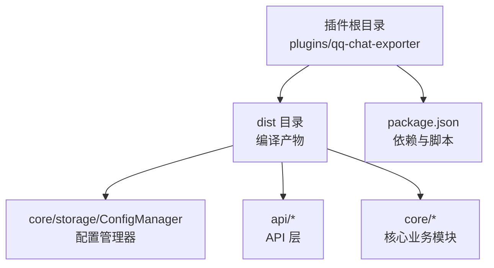
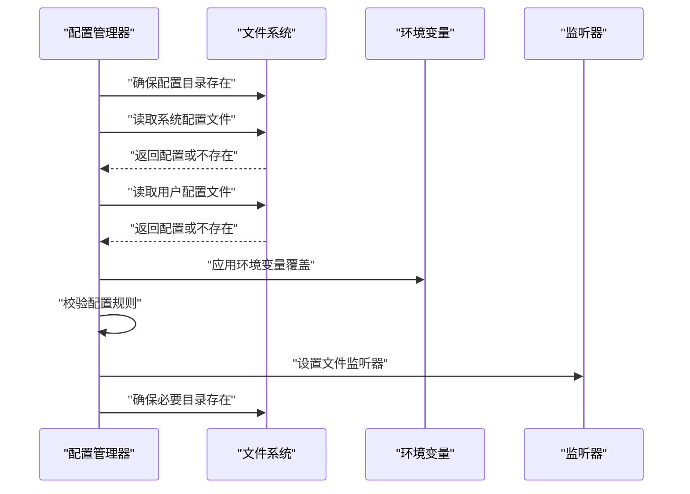
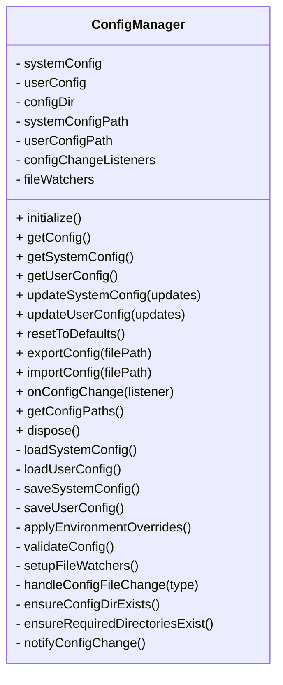
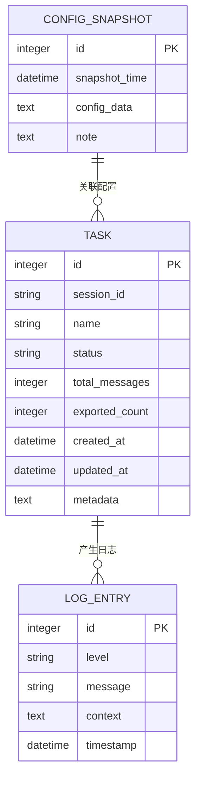
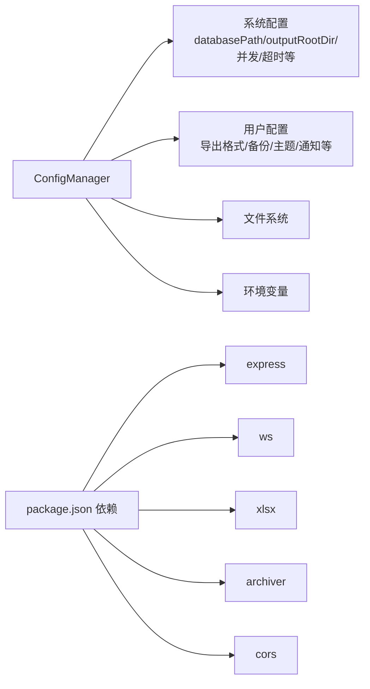

# 数据存储与配置

<cite>
**本文引用的文件**
- [ConfigManager.d.ts](file://plugins/qq-chat-exporter/dist/core/storage/ConfigManager.d.ts)
- [ConfigManager.js](file://plugins/qq-chat-exporter/dist/core/storage/ConfigManager.js)
- [package.json](file://plugins/qq-chat-exporter/package.json)
</cite>

## 目录
1. [简介](#简介)
2. [项目结构](#项目结构)
3. [核心组件](#核心组件)
4. [架构总览](#架构总览)
5. [详细组件分析](#详细组件分析)
6. [依赖分析](#依赖分析)
7. [性能考虑](#性能考虑)
8. [故障排除指南](#故障排除指南)
9. [结论](#结论)
10. [附录](#附录)

## 简介
本文件聚焦于 QQ 聊天导出器的数据存储与配置管理，系统性阐述配置管理器的设计与实现、SQLite 数据库存储模型、数据访问模式、缓存策略、性能优化、数据生命周期与迁移路径，以及配置参数的最佳实践。目标是帮助开发者与运维人员快速理解并正确使用该插件的数据层能力。

## 项目结构
- 插件主体位于 plugins/qq-chat-exporter，核心逻辑以 dist 目录中的编译产物为主，其中包含配置管理器等关键模块。
- package.json 定义了运行时依赖与脚本，为后续构建与打包提供基础。

**章节来源**
- file://plugins/qq-chat-exporter/package.json#L1-L42

## 核心组件
- 配置管理器：负责系统配置与用户配置的加载、保存、校验、热重载、监听与导入导出。
- SQLite 数据库：用于持久化任务状态、配置信息与日志数据（由系统其他模块使用，本文给出模型设计与约束）。

**章节来源**
- file://plugins/qq-chat-exporter/dist/core/storage/ConfigManager.d.ts#L42-L156
- file://plugins/qq-chat-exporter/dist/core/storage/ConfigManager.js#L48-L533

## 架构总览
配置管理器在启动时完成以下流程：
- 确保配置目录存在
- 读取系统配置与用户配置文件（若不存在则写入默认值）
- 应用环境变量覆盖
- 校验配置合法性
- 设置文件监听器，支持热重载
- 确保必要目录存在（数据库目录、导出目录等）

**图表来源**
- [ConfigManager.js](file://plugins/qq-chat-exporter/dist/core/storage/ConfigManager.js#L74-L100)
- [ConfigManager.js](file://plugins/qq-chat-exporter/dist/core/storage/ConfigManager.js#L190-L212)
- [ConfigManager.js](file://plugins/qq-chat-exporter/dist/core/storage/ConfigManager.js#L216-L259)
- [ConfigManager.js](file://plugins/qq-chat-exporter/dist/core/storage/ConfigManager.js#L263-L287)
- [ConfigManager.js](file://plugins/qq-chat-exporter/dist/core/storage/ConfigManager.js#L319-L335)

## 详细组件分析

### 配置管理器（ConfigManager）
- 职责
  - 统一管理“系统配置”与“用户配置”
  - 支持配置验证、热重载、环境变量覆盖、导入导出、变更监听
  - 提供安全的更新与回滚（临时配置+校验）
- 结构与职责分离
  - 私有字段：系统配置、用户配置、路径信息、监听器集合、文件监听器
  - 公共方法：initialize、getConfig/getSystemConfig/getUserConfig、updateSystemConfig/updateUserConfig、resetToDefaults、exportConfig/importConfig、onConfigChange、dispose
- 配置文件与默认值
  - 文件名：config.json（系统）、user-config.json（用户）
  - 默认系统配置包含数据库路径、输出目录、批大小、超时、重试、并发、健康检查间隔、调试开关、WebUI 端口等
  - 默认用户配置包含偏好导出格式、自动备份、备份保留天数、主题、语言、资源链接策略、系统消息包含策略、通知开关等
- 环境变量覆盖映射
  - QCE_DATABASE_PATH → databasePath
  - QCE_OUTPUT_DIR → outputRootDir
  - QCE_BATCH_SIZE → defaultBatchSize
  - QCE_TIMEOUT → defaultTimeout
  - QCE_RETRY_COUNT → defaultRetryCount
  - QCE_MAX_CONCURRENT_TASKS → maxConcurrentTasks
  - QCE_DEBUG_LOG → enableDebugLog
  - QCE_WEBUI_PORT → webuiPort
- 配置验证规则
  - 批量大小：1~50000
  - 超时：1000~300000 毫秒
  - 重试次数：0~10
  - 最大并发任务：1~10
  - WebUI 端口：1024~65535
  - 备份保留天数：1~365
- 热重载与监听
  - 监听系统配置与用户配置文件变更，防抖后重新加载、校验并通知监听者
- 目录保障
  - 自动创建数据库目录、导出根目录、自定义输出目录（如存在）

**图表来源**
- [ConfigManager.d.ts](file://plugins/qq-chat-exporter/dist/core/storage/ConfigManager.d.ts#L42-L156)
- [ConfigManager.js](file://plugins/qq-chat-exporter/dist/core/storage/ConfigManager.js#L48-L533)

**章节来源**
- file://plugins/qq-chat-exporter/dist/core/storage/ConfigManager.d.ts#L42-L156
- file://plugins/qq-chat-exporter/dist/core/storage/ConfigManager.js#L48-L533

### SQLite 数据库存储模型（设计与约束）
说明：数据库由系统其他模块使用，本文基于仓库中已知的系统配置默认数据库路径推导表结构设计与约束。实际字段以系统实现为准，以下为推荐的实体关系与字段定义。

- 实体关系概览
  - 任务表：记录导出任务元数据、状态与统计
  - 配置快照表：记录配置变更历史
  - 日志表：记录导出过程与系统事件日志

- 字段定义与约束（示例）
  - 任务表（TASK）
    - id：自增主键
    - session_id：会话标识，非空
    - name：任务名称，非空
    - status：任务状态枚举（待开始/进行中/成功/失败/取消），非空
    - total_messages/exported_count：整型，非负
    - created_at/updated_at：时间戳，非空
    - metadata：JSON 文本，存储扩展信息
  - 配置快照表（CONFIG_SNAPSHOT）
    - id：自增主键
    - snapshot_time：快照时间，非空
    - config_data：JSON 文本，存储配置快照
    - note：备注文本
  - 日志表（LOG_ENTRY）
    - id：自增主键
    - level：日志级别（info/warn/error/debug），非空
    - message：日志消息，非空
    - context：JSON 文本，上下文信息
    - timestamp：时间戳，非空

- 约束与索引建议
  - 在 session_id 上建立索引以加速查询
  - 在 status、timestamp 建立索引以支持筛选与排序
  - 对 JSON 字段使用 CHECK 约束确保格式有效（如适用）

**章节来源**
- file://plugins/qq-chat-exporter/dist/core/storage/ConfigManager.js#L18-L28
- file://plugins/qq-chat-exporter/dist/core/storage/ConfigManager.js#L32-L43

### 数据访问模式与缓存策略
- 访问模式
  - 单例配置管理器：全局仅需一个实例，负责集中读写配置
  - 事务性写入：更新配置时采用“临时配置+校验+保存”的原子化流程，失败自动回滚
  - 异步监听：文件变更触发异步重载，避免阻塞主线程
- 缓存策略
  - 内存缓存：配置对象常驻内存，减少磁盘 IO
  - 防抖重载：文件变更后短暂延时再重载，避免频繁重复读取
  - 目录预创建：启动时确保数据库与导出目录存在，降低运行期异常

**章节来源**
- file://plugins/qq-chat-exporter/dist/core/storage/ConfigManager.js#L291-L307
- file://plugins/qq-chat-exporter/dist/core/storage/ConfigManager.js#L360-L377
- file://plugins/qq-chat-exporter/dist/core/storage/ConfigManager.js#L381-L398

### 性能优化建议
- 配置读取
  - 将常用配置放入内存缓存；对不频繁变更的配置采用懒加载
- 文件监听
  - 使用防抖与去抖策略，避免高频变更导致的反复重载
- 目录与文件
  - 启动阶段一次性创建所需目录，运行期尽量避免动态创建
- 并发控制
  - 依据系统配置限制最大并发任务数，避免资源争用

**章节来源**
- file://plugins/qq-chat-exporter/dist/core/storage/ConfigManager.js#L230-L237
- file://plugins/qq-chat-exporter/dist/core/storage/ConfigManager.js#L319-L335

### 数据生命周期管理、备份与恢复
- 生命周期
  - 配置：随插件安装生成，首次运行写入默认值；后续按需更新
  - 数据库：随系统配置中的数据库路径创建；任务、日志、配置快照按需落盘
- 备份
  - 用户配置支持导出/导入，便于跨设备迁移
  - 可结合系统配置中的备份保留策略，定期清理过期备份
- 恢复
  - 通过导入功能恢复历史配置
  - 数据库层面可通过备份文件恢复（由系统其他模块实现）

**章节来源**
- file://plugins/qq-chat-exporter/dist/core/storage/ConfigManager.js#L414-L434
- file://plugins/qq-chat-exporter/dist/core/storage/ConfigManager.js#L438-L478

### 配置参数详解与最佳实践
- 系统配置（示例）
  - databasePath：数据库文件路径（默认位于用户主目录下的隐藏目录）
  - outputRootDir：导出根目录
  - defaultBatchSize：单批次抓取的消息条数（建议 1000~10000，视资源而定）
  - defaultTimeout：请求超时（建议 10000~60000）
  - defaultRetryCount：失败重试次数（建议 1~3）
  - maxConcurrentTasks：最大并发任务数（建议 1~5）
  - resourceHealthCheckInterval：资源健康检查间隔（毫秒）
  - enableDebugLog：是否开启调试日志
  - webuiPort：WebUI 端口（1024~65535）
- 用户配置（示例）
  - preferredFormats：偏好导出格式（HTML/JSON 等）
  - autoBackup：是否自动备份
  - backupRetentionDays：备份保留天数（1~365）
  - theme/language：界面主题与语言
  - showAdvancedOptions：是否显示高级选项
  - resourceLinkStrategy：资源链接处理策略（保留/下载/占位）
  - includeSystemMessages：是否包含系统消息
  - filterPureImageMessages：是否过滤纯图片消息
  - enableNotifications：是否启用通知
  - webuiPassword：WebUI 访问密码（可选）
- 最佳实践
  - 使用环境变量在容器/CI 场景中覆盖默认配置
  - 合理设置并发与批大小，平衡吞吐与稳定性
  - 开启调试日志仅在问题排查阶段，避免生产环境产生大量日志
  - 定期导出配置，作为灾难恢复的一部分

**章节来源**
- file://plugins/qq-chat-exporter/dist/core/storage/ConfigManager.js#L18-L28
- file://plugins/qq-chat-exporter/dist/core/storage/ConfigManager.js#L32-L43
- file://plugins/qq-chat-exporter/dist/core/storage/ConfigManager.js#L190-L212
- file://plugins/qq-chat-exporter/dist/core/storage/ConfigManager.js#L216-L259

## 依赖分析
- 运行时依赖
  - express、ws、xlsx、archiver、cors 等，用于 Web 服务、WebSocket、导出与压缩等能力
- 与配置管理的关系
  - 配置管理器通过系统配置决定数据库路径、导出目录、并发与超时等关键行为
  - 用户配置影响导出格式、备份策略与界面行为

**图表来源**
- [ConfigManager.js](file://plugins/qq-chat-exporter/dist/core/storage/ConfigManager.js#L6-L9)
- [package.json](file://plugins/qq-chat-exporter/package.json#L22-L29)

**章节来源**
- file://plugins/qq-chat-exporter/package.json#L22-L29
- file://plugins/qq-chat-exporter/dist/core/storage/ConfigManager.js#L6-L9

## 性能考虑
- 配置读写
  - 采用内存缓存与批量写入，减少磁盘 IO
- 文件监听
  - 防抖与去抖，避免频繁重载
- 数据库
  - 合理设置批大小与并发度，避免数据库锁竞争
  - 对高频查询字段建立索引

## 故障排除指南
- 配置文件损坏
  - 使用 resetToDefaults 重置为默认配置
  - 使用 exportConfig/importConfig 导出/导入配置
- 权限问题
  - 确认配置目录与数据库目录具备读写权限
- 端口占用
  - 修改 webuiPort 或释放占用端口
- 配置验证失败
  - 检查数值范围与类型，参考验证规则

**章节来源**
- file://plugins/qq-chat-exporter/dist/core/storage/ConfigManager.js#L216-L259
- file://plugins/qq-chat-exporter/dist/core/storage/ConfigManager.js#L402-L410
- file://plugins/qq-chat-exporter/dist/core/storage/ConfigManager.js#L414-L434
- file://plugins/qq-chat-exporter/dist/core/storage/ConfigManager.js#L438-L478

## 结论
配置管理器提供了稳定、可扩展的配置体系，结合 SQLite 数据库存储与合理的数据访问模式，能够满足导出任务的全生命周期管理需求。遵循本文的参数建议与最佳实践，可在保证性能的同时提升系统的可靠性与可维护性。

## 附录
- 快速定位
  - 配置管理器实现：plugins/qq-chat-exporter/dist/core/storage/ConfigManager.js
  - 配置管理器类型定义：plugins/qq-chat-exporter/dist/core/storage/ConfigManager.d.ts
  - 插件依赖与脚本：plugins/qq-chat-exporter/package.json