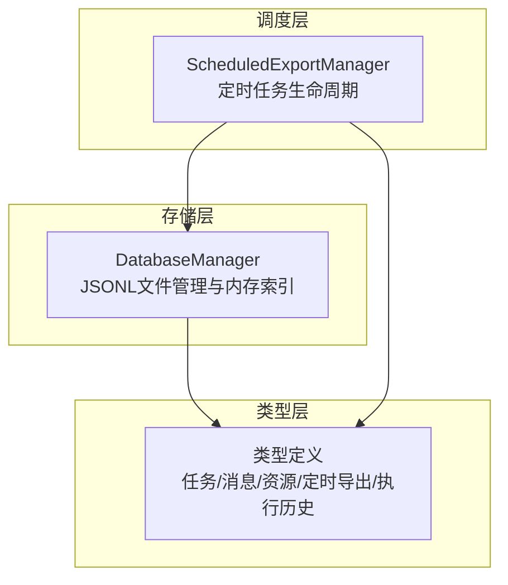
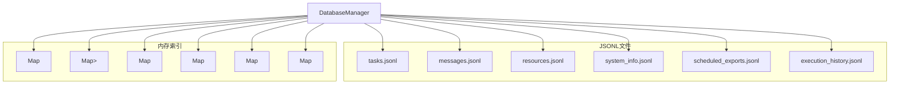
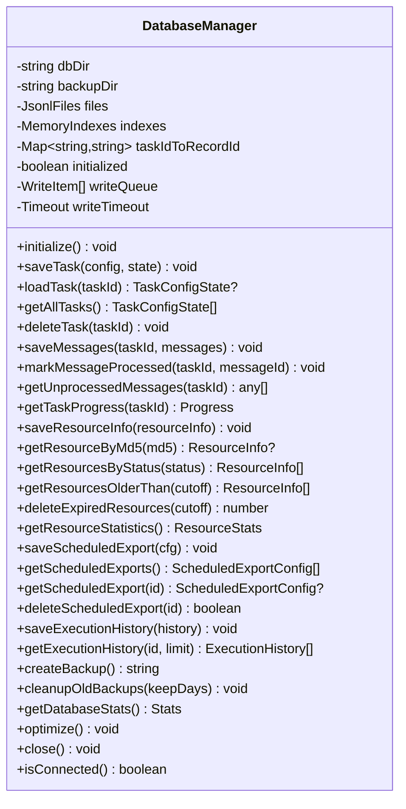
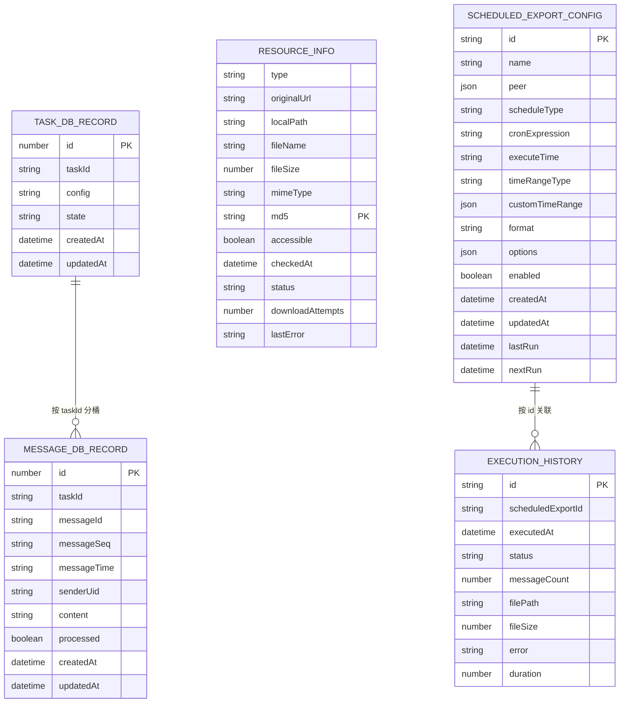

# 数据库设计

<cite>
**本文档引用的文件**
- [plugins/qq-chat-exporter/lib/core/storage/DatabaseManager.ts](file://plugins/qq-chat-exporter/lib/core/storage/DatabaseManager.ts)
- [plugins/qq-chat-exporter/lib/types/index.ts](file://plugins/qq-chat-exporter/lib/types/index.ts)
- [plugins/qq-chat-exporter/lib/core/scheduler/ScheduledExportManager.ts](file://plugins/qq-chat-exporter/lib/core/scheduler/ScheduledExportManager.ts)
- [plugins/qq-chat-exporter/dist/core/storage/DatabaseManager.js](file://plugins/qq-chat-exporter/dist/core/storage/DatabaseManager.js)
</cite>

## 目录
1. [简介](#简介)
2. [项目结构](#项目结构)
3. [核心组件](#核心组件)
4. [架构总览](#架构总览)
5. [详细组件分析](#详细组件分析)
6. [依赖分析](#依赖分析)
7. [性能考虑](#性能考虑)
8. [故障排查指南](#故障排查指南)
9. [结论](#结论)
10. [附录](#附录)

## 简介
本文件面向“QQ聊天导出器”的数据库设计，聚焦其基于JSONL（JSON Lines）的轻量级持久化方案。系统采用纯文本行式存储，将任务、消息、资源、系统信息、定时导出任务与执行历史分别存放在独立的.jsonl文件中，配合内存索引实现高性能查询与写入。本文档将系统阐述整体架构、表结构设计思路、数据模型、索引与查询优化、完整性与事务处理、初始化与迁移策略，以及备份与恢复最佳实践。

## 项目结构
数据库相关的核心实现位于插件模块的存储层与调度层：
- 存储层：DatabaseManager 负责所有 JSONL 文件的创建、读取、索引、批量写入、备份与优化。
- 类型层：统一定义任务、消息、资源、定时导出与执行历史的数据结构。
- 调度层：ScheduledExportManager 负责定时任务的生命周期管理，并与存储层交互持久化配置与执行历史。

图表来源
- [plugins/qq-chat-exporter/lib/core/storage/DatabaseManager.ts](file://plugins/qq-chat-exporter/lib/core/storage/DatabaseManager.ts#L57-L99)
- [plugins/qq-chat-exporter/lib/types/index.ts](file://plugins/qq-chat-exporter/lib/types/index.ts#L297-L348)
- [plugins/qq-chat-exporter/lib/core/scheduler/ScheduledExportManager.ts](file://plugins/qq-chat-exporter/lib/core/scheduler/ScheduledExportManager.ts#L120-L197)

章节来源
- [plugins/qq-chat-exporter/lib/core/storage/DatabaseManager.ts](file://plugins/qq-chat-exporter/lib/core/storage/DatabaseManager.ts#L57-L99)
- [plugins/qq-chat-exporter/lib/types/index.ts](file://plugins/qq-chat-exporter/lib/types/index.ts#L297-L348)
- [plugins/qq-chat-exporter/lib/core/scheduler/ScheduledExportManager.ts](file://plugins/qq-chat-exporter/lib/core/scheduler/ScheduledExportManager.ts#L120-L197)

## 核心组件
- DatabaseManager：负责数据库目录与文件初始化、内存索引加载、批量写入、备份、统计与优化。
- 类型系统：统一的任务、消息、资源、定时导出与执行历史的数据结构，确保跨模块一致性。
- ScheduledExportManager：负责定时导出任务的创建、调度、执行与历史记录持久化。

章节来源
- [plugins/qq-chat-exporter/lib/core/storage/DatabaseManager.ts](file://plugins/qq-chat-exporter/lib/core/storage/DatabaseManager.ts#L57-L148)
- [plugins/qq-chat-exporter/lib/types/index.ts](file://plugins/qq-chat-exporter/lib/types/index.ts#L84-L145)
- [plugins/qq-chat-exporter/lib/core/scheduler/ScheduledExportManager.ts](file://plugins/qq-chat-exporter/lib/core/scheduler/ScheduledExportManager.ts#L202-L246)

## 架构总览
系统采用“文件即数据库”的架构：每个实体类别对应一个.jsonl文件，文件内每行为一条记录；同时在内存中维护多级 Map 索引，以实现 O(1) 查询与快速更新。

图表来源
- [plugins/qq-chat-exporter/lib/core/storage/DatabaseManager.ts](file://plugins/qq-chat-exporter/lib/core/storage/DatabaseManager.ts#L32-L70)
- [plugins/qq-chat-exporter/lib/core/storage/DatabaseManager.ts](file://plugins/qq-chat-exporter/lib/core/storage/DatabaseManager.ts#L91-L98)

## 详细组件分析

### DatabaseManager：JSONL数据库管理器
- 目录与文件初始化：确保数据库目录与备份目录存在，创建六个核心.jsonl文件。
- 内存索引：为任务、消息、资源、系统信息、定时导出、执行历史建立 Map 索引，提升查询性能。
- 批量写入：写入队列+定时刷新，避免频繁磁盘 IO；支持手动 flush。
- 备份与清理：支持原子性复制所有.jsonl文件到备份目录；可清理过期备份。
- 优化与统计：支持重建文件、重新加载索引、统计任务/消息/资源数量与数据库大小。
- 失败任务清理：根据状态与进度自动清理长时间无进展的任务。

图表来源
- [plugins/qq-chat-exporter/lib/core/storage/DatabaseManager.ts](file://plugins/qq-chat-exporter/lib/core/storage/DatabaseManager.ts#L57-L148)
- [plugins/qq-chat-exporter/lib/core/storage/DatabaseManager.ts](file://plugins/qq-chat-exporter/lib/core/storage/DatabaseManager.ts#L418-L581)
- [plugins/qq-chat-exporter/lib/core/storage/DatabaseManager.ts](file://plugins/qq-chat-exporter/lib/core/storage/DatabaseManager.ts#L1024-L1153)
- [plugins/qq-chat-exporter/lib/core/storage/DatabaseManager.ts](file://plugins/qq-chat-exporter/lib/core/storage/DatabaseManager.ts#L1269-L1349)

章节来源
- [plugins/qq-chat-exporter/lib/core/storage/DatabaseManager.ts](file://plugins/qq-chat-exporter/lib/core/storage/DatabaseManager.ts#L105-L148)
- [plugins/qq-chat-exporter/lib/core/storage/DatabaseManager.ts](file://plugins/qq-chat-exporter/lib/core/storage/DatabaseManager.ts#L347-L415)
- [plugins/qq-chat-exporter/lib/core/storage/DatabaseManager.ts](file://plugins/qq-chat-exporter/lib/core/storage/DatabaseManager.ts#L840-L898)
- [plugins/qq-chat-exporter/lib/core/storage/DatabaseManager.ts](file://plugins/qq-chat-exporter/lib/core/storage/DatabaseManager.ts#L903-L942)
- [plugins/qq-chat-exporter/lib/core/storage/DatabaseManager.ts](file://plugins/qq-chat-exporter/lib/core/storage/DatabaseManager.ts#L947-L967)

### 数据模型与表结构设计思路
系统采用“文件即表”的设计，每个实体类别对应一个.jsonl文件，文件内每行为一条记录。以下为关键实体的结构定义与设计要点：

- 任务记录（tasks.jsonl）
  - 字段：id、taskId、config（JSON字符串）、state（JSON字符串）、createdAt、updatedAt
  - 设计要点：使用记录ID作为主键，taskId 通过 Map 反向映射；config/state 以 JSON 字符串存储，便于灵活扩展。

- 消息记录（messages.jsonl）
  - 字段：id、taskId、messageId、messageSeq、messageTime、senderUid、content（JSON字符串）、processed、createdAt、updatedAt
  - 设计要点：按 taskId 分桶存储，内存索引为 Map<taskId, Map<messageId, record>>；processed 字段用于增量处理。

- 资源记录（resources.jsonl）
  - 字段：type、originalUrl、localPath、fileName、fileSize、mimeType、md5、accessible（布尔）、checkedAt、status、downloadAttempts、lastError
  - 设计要点：以 md5 为键，便于去重与资源复用；日期字段统一为 ISO 字符串，加载时转换为 Date 对象。

- 系统信息（system_info.jsonl）
  - 字段：key、value、updated_at
  - 设计要点：键值对存储，用于保存 schema_version、initialized_at 等系统元数据。

- 定时导出任务（scheduled_exports.jsonl）
  - 字段：id、name、peer、scheduleType、cronExpression、executeTime、timeRangeType、customTimeRange、format、options、enabled、createdAt、updatedAt、lastRun、nextRun 等
  - 设计要点：包含调度策略、时间范围、输出选项与状态；支持自定义 cron 表达式。

- 执行历史（execution_history.jsonl）
  - 字段：id、scheduledExportId、executedAt、status、messageCount、filePath、fileSize、error、duration
  - 设计要点：按定时任务 ID 分桶，仅保留最近 100 条记录，节省空间。

图表来源
- [plugins/qq-chat-exporter/lib/types/index.ts](file://plugins/qq-chat-exporter/lib/types/index.ts#L309-L336)
- [plugins/qq-chat-exporter/lib/types/index.ts](file://plugins/qq-chat-exporter/lib/types/index.ts#L187-L212)
- [plugins/qq-chat-exporter/lib/types/index.ts](file://plugins/qq-chat-exporter/lib/types/index.ts#L120-L145)
- [plugins/qq-chat-exporter/lib/types/index.ts](file://plugins/qq-chat-exporter/lib/types/index.ts#L120-L173)
- [plugins/qq-chat-exporter/lib/types/index.ts](file://plugins/qq-chat-exporter/lib/types/index.ts#L178-L197)

章节来源
- [plugins/qq-chat-exporter/lib/types/index.ts](file://plugins/qq-chat-exporter/lib/types/index.ts#L297-L348)
- [plugins/qq-chat-exporter/lib/types/index.ts](file://plugins/qq-chat-exporter/lib/types/index.ts#L187-L212)
- [plugins/qq-chat-exporter/lib/types/index.ts](file://plugins/qq-chat-exporter/lib/types/index.ts#L120-L145)
- [plugins/qq-chat-exporter/lib/types/index.ts](file://plugins/qq-chat-exporter/lib/types/index.ts#L120-L173)

### 关系与外键约束
- 逻辑关系
  - 任务与消息：一对多（taskId 关联）
  - 定时导出与执行历史：一对多（scheduledExportId 关联）
  - 资源：以 md5 为主键，用于全局去重与复用
- 外键约束
  - 系统未使用传统 RDBMS 外键；通过业务逻辑保证引用一致性（如保存任务时写入 tasks.jsonl，保存消息时写入 messages.jsonl，且按 taskId 关联）

章节来源
- [plugins/qq-chat-exporter/lib/core/storage/DatabaseManager.ts](file://plugins/qq-chat-exporter/lib/core/storage/DatabaseManager.ts#L418-L581)
- [plugins/qq-chat-exporter/lib/core/storage/DatabaseManager.ts](file://plugins/qq-chat-exporter/lib/core/storage/DatabaseManager.ts#L1269-L1349)

### 索引策略与查询优化
- 内存索引
  - 任务：Map<recordId, TaskDbRecord> + Map<taskId, recordId>
  - 消息：Map<taskId, Map<messageId, MessageDbRecord>>
  - 资源：Map<md5, ResourceInfo>
  - 系统信息：Map<key, value>
  - 定时导出：Map<scheduledId, ScheduledExportConfig>
  - 执行历史：Map<scheduledId, ExecutionHistory[]>
- 查询优化
  - O(1) 读取：通过 Map 键查找
  - 按 taskId 获取消息：O(n) 遍历 Map<taskId> 的消息集合
  - 资源按状态/时间过滤：遍历内存索引并排序
- 写入优化
  - 批量写入：写入队列+定时刷新（100ms）+手动 flush
  - 并发写入：按文件分组并行写入多个 .jsonl 文件

章节来源
- [plugins/qq-chat-exporter/lib/core/storage/DatabaseManager.ts](file://plugins/qq-chat-exporter/lib/core/storage/DatabaseManager.ts#L347-L415)
- [plugins/qq-chat-exporter/lib/core/storage/DatabaseManager.ts](file://plugins/qq-chat-exporter/lib/core/storage/DatabaseManager.ts#L688-L768)
- [plugins/qq-chat-exporter/lib/core/storage/DatabaseManager.ts](file://plugins/qq-chat-exporter/lib/core/storage/DatabaseManager.ts#L1055-L1124)

### 数据完整性与事务处理
- 数据完整性
  - 任务去重：加载时保留每个 taskId 的最新记录，自动重建任务文件
  - 日期字段校验：资源与定时导出配置加载时对日期字段进行类型转换与有效性检查
  - 失败任务清理：自动清理 PENDING/RUNNING 且进度为 0 的任务
- 事务处理
  - 采用 JSONL 行式写入，单条记录写入具备原子性；批量写入通过队列合并，最终一次性追加写入文件
  - 重建文件采用临时文件 + 原子重命名的方式，确保一致性

章节来源
- [plugins/qq-chat-exporter/lib/core/storage/DatabaseManager.ts](file://plugins/qq-chat-exporter/lib/core/storage/DatabaseManager.ts#L204-L247)
- [plugins/qq-chat-exporter/lib/core/storage/DatabaseManager.ts](file://plugins/qq-chat-exporter/lib/core/storage/DatabaseManager.ts#L281-L318)
- [plugins/qq-chat-exporter/lib/core/storage/DatabaseManager.ts](file://plugins/qq-chat-exporter/lib/core/storage/DatabaseManager.ts#L637-L683)
- [plugins/qq-chat-exporter/lib/core/storage/DatabaseManager.ts](file://plugins/qq-chat-exporter/lib/core/storage/DatabaseManager.ts#L1354-L1385)
- [plugins/qq-chat-exporter/lib/core/storage/DatabaseManager.ts](file://plugins/qq-chat-exporter/lib/core/storage/DatabaseManager.ts#L1390-L1423)

### 初始化与迁移策略
- 初始化流程
  - 创建数据库目录与备份目录
  - 初始化六个 .jsonl 文件
  - 加载内存索引（任务、消息、资源、系统信息、定时导出、执行历史）
  - 设置系统信息（schema_version、initialized_at）
  - 清理失败任务
- 迁移策略
  - schema_version：当前版本为 1；未来升级时可在初始化阶段检测版本并执行迁移逻辑（预留位置）
  - 重建文件：当发现重复记录或执行删除/清理后，重建对应 .jsonl 文件以保持一致性

章节来源
- [plugins/qq-chat-exporter/lib/core/storage/DatabaseManager.ts](file://plugins/qq-chat-exporter/lib/core/storage/DatabaseManager.ts#L105-L148)
- [plugins/qq-chat-exporter/lib/core/storage/DatabaseManager.ts](file://plugins/qq-chat-exporter/lib/core/storage/DatabaseManager.ts#L131-L132)
- [plugins/qq-chat-exporter/lib/core/storage/DatabaseManager.ts](file://plugins/qq-chat-exporter/lib/core/storage/DatabaseManager.ts#L245-L247)
- [plugins/qq-chat-exporter/lib/core/storage/DatabaseManager.ts](file://plugins/qq-chat-exporter/lib/core/storage/DatabaseManager.ts#L586-L631)

### 备份与恢复最佳实践
- 备份
  - 在写入队列刷新后复制所有 .jsonl 文件至备份目录
  - 备份目录按时间戳命名，便于追踪
- 恢复
  - 将备份目录中的 .jsonl 文件复制回原数据库目录，重启服务后自动加载索引
- 清理
  - 支持按保留天数清理旧备份文件，避免磁盘占用增长

章节来源
- [plugins/qq-chat-exporter/lib/core/storage/DatabaseManager.ts](file://plugins/qq-chat-exporter/lib/core/storage/DatabaseManager.ts#L840-L873)
- [plugins/qq-chat-exporter/lib/core/storage/DatabaseManager.ts](file://plugins/qq-chat-exporter/lib/core/storage/DatabaseManager.ts#L878-L898)

## 依赖分析
- DatabaseManager 依赖类型系统提供的数据结构定义
- ScheduledExportManager 依赖 DatabaseManager 进行配置与执行历史的持久化
- 所有模块通过 .jsonl 文件进行解耦，便于独立演进与替换

图表来源
- [plugins/qq-chat-exporter/lib/types/index.ts](file://plugins/qq-chat-exporter/lib/types/index.ts#L297-L348)
- [plugins/qq-chat-exporter/lib/core/storage/DatabaseManager.ts](file://plugins/qq-chat-exporter/lib/core/storage/DatabaseManager.ts#L57-L99)
- [plugins/qq-chat-exporter/lib/core/scheduler/ScheduledExportManager.ts](file://plugins/qq-chat-exporter/lib/core/scheduler/ScheduledExportManager.ts#L202-L246)

章节来源
- [plugins/qq-chat-exporter/lib/types/index.ts](file://plugins/qq-chat-exporter/lib/types/index.ts#L297-L348)
- [plugins/qq-chat-exporter/lib/core/storage/DatabaseManager.ts](file://plugins/qq-chat-exporter/lib/core/storage/DatabaseManager.ts#L57-L99)
- [plugins/qq-chat-exporter/lib/core/scheduler/ScheduledExportManager.ts](file://plugins/qq-chat-exporter/lib/core/scheduler/ScheduledExportManager.ts#L202-L246)

## 性能考虑
- 写入性能
  - 批量写入：写入队列+定时刷新，减少磁盘 IO
  - 并行写入：按文件分组并行写入，提高吞吐
- 查询性能
  - 内存 Map 索引：O(1) 查找任务与资源
  - 消息按 taskId 分桶：快速定位消息集合
- 存储优化
  - 重建文件：定期优化碎片，保持文件紧凑
  - 执行历史限制：仅保留最近 100 条，控制文件增长

章节来源
- [plugins/qq-chat-exporter/lib/core/storage/DatabaseManager.ts](file://plugins/qq-chat-exporter/lib/core/storage/DatabaseManager.ts#L347-L415)
- [plugins/qq-chat-exporter/lib/core/storage/DatabaseManager.ts](file://plugins/qq-chat-exporter/lib/core/storage/DatabaseManager.ts#L1330-L1333)
- [plugins/qq-chat-exporter/lib/core/storage/DatabaseManager.ts](file://plugins/qq-chat-exporter/lib/core/storage/DatabaseManager.ts#L947-L967)

## 故障排查指南
- 初始化失败
  - 检查数据库目录权限与磁盘空间
  - 查看 SystemError 异常堆栈与上下文
- 数据异常
  - 任务重复：系统会自动重建任务文件，保留最新记录
  - 资源日期异常：加载时自动修正为当前时间
- 备份失败
  - 检查备份目录权限与磁盘空间
  - 查看 SystemError 中的 details 与 context
- 性能问题
  - 观察写入队列长度与刷新频率
  - 使用 optimize() 重建文件并重新加载索引

章节来源
- [plugins/qq-chat-exporter/lib/core/storage/DatabaseManager.ts](file://plugins/qq-chat-exporter/lib/core/storage/DatabaseManager.ts#L139-L147)
- [plugins/qq-chat-exporter/lib/core/storage/DatabaseManager.ts](file://plugins/qq-chat-exporter/lib/core/storage/DatabaseManager.ts#L245-L247)
- [plugins/qq-chat-exporter/lib/core/storage/DatabaseManager.ts](file://plugins/qq-chat-exporter/lib/core/storage/DatabaseManager.ts#L294-L310)
- [plugins/qq-chat-exporter/lib/core/storage/DatabaseManager.ts](file://plugins/qq-chat-exporter/lib/core/storage/DatabaseManager.ts#L864-L872)

## 结论
本设计以 JSONL 为核心，结合内存索引与批量写入策略，在保证数据一致性的同时实现了高吞吐与低延迟。通过明确的实体边界与清晰的生命周期管理，系统具备良好的可维护性与扩展性。建议在生产环境中定期执行优化与备份，并关注资源与执行历史的增长趋势，以维持长期稳定运行。

## 附录

### 数据库初始化脚本（概念描述）
- 创建数据库目录与备份目录
- 初始化六个 .jsonl 文件（空文件）
- 加载内存索引
- 设置系统信息（schema_version、initialized_at）
- 清理失败任务

章节来源
- [plugins/qq-chat-exporter/lib/core/storage/DatabaseManager.ts](file://plugins/qq-chat-exporter/lib/core/storage/DatabaseManager.ts#L111-L136)

### 迁移策略（概念描述）
- 版本检测：读取 system_info.jsonl 中的 schema_version
- 升级路径：按版本顺序执行迁移脚本（预留位置）
- 原子性：使用临时文件 + 原子重命名

章节来源
- [plugins/qq-chat-exporter/lib/core/storage/DatabaseManager.ts](file://plugins/qq-chat-exporter/lib/core/storage/DatabaseManager.ts#L131-L132)
- [plugins/qq-chat-exporter/lib/core/storage/DatabaseManager.ts](file://plugins/qq-chat-exporter/lib/core/storage/DatabaseManager.ts#L1354-L1385)