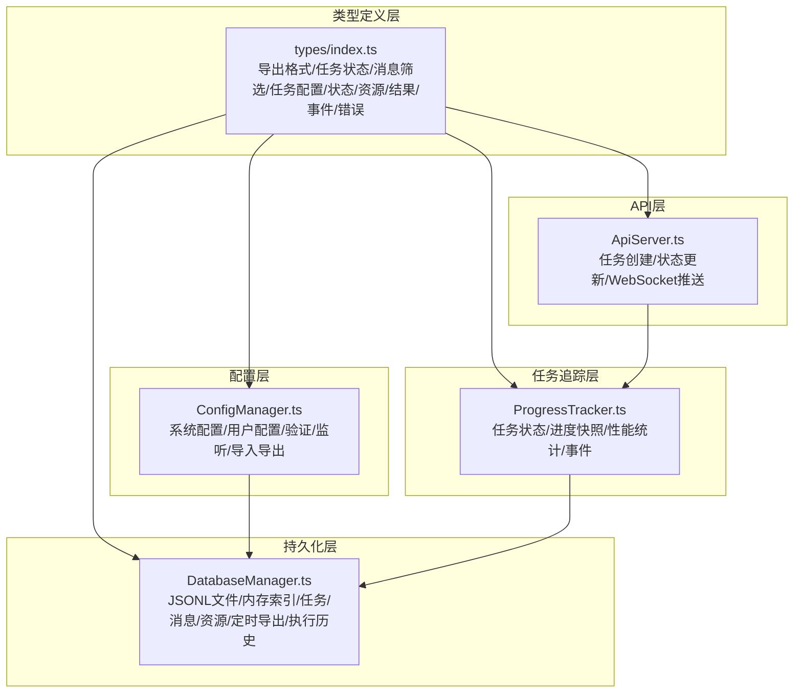
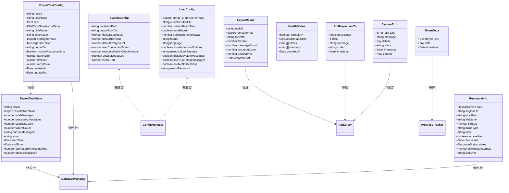
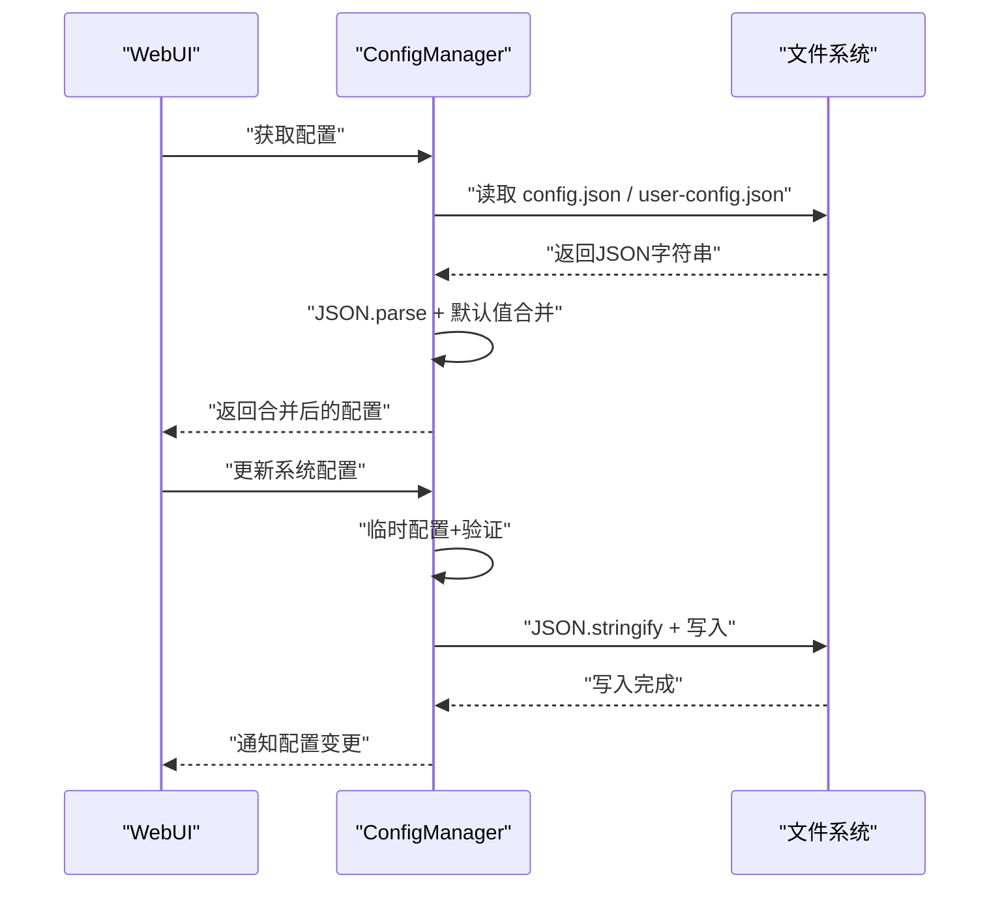
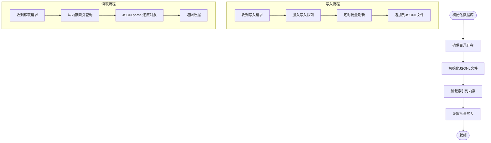
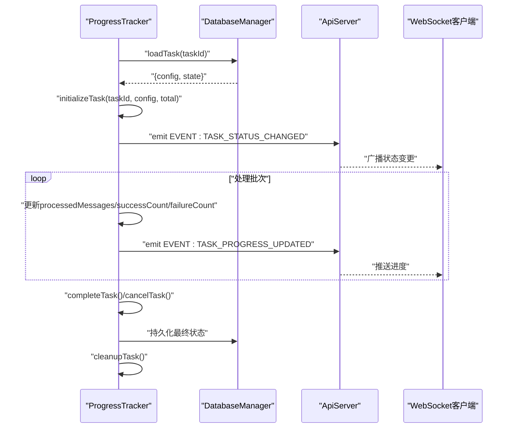
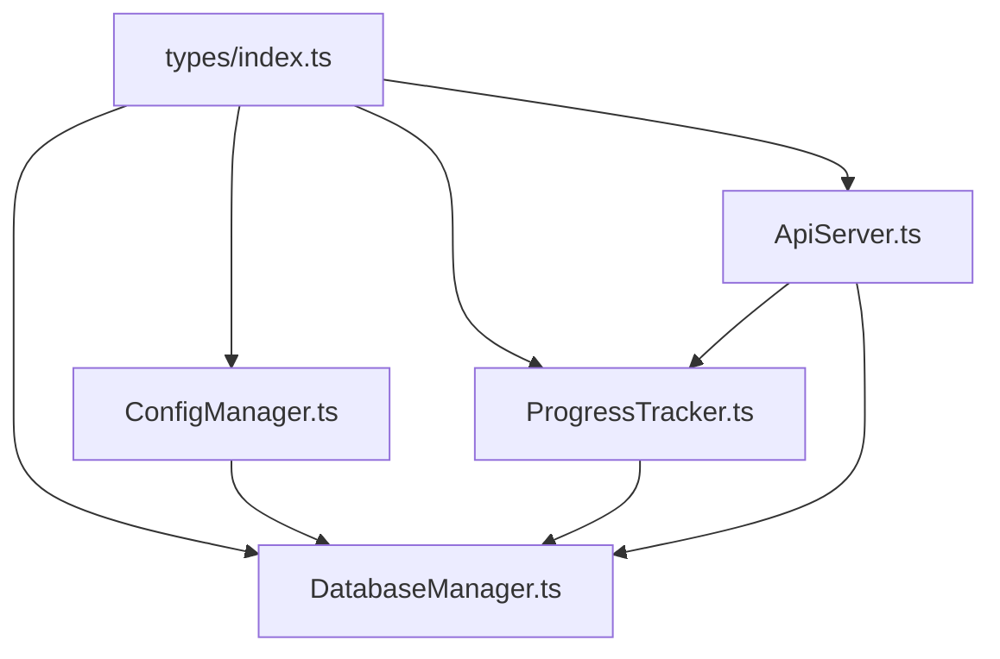

# 数据模型

<cite>
**本文引用的文件**
- [plugins/qq-chat-exporter/lib/types/index.ts](file://plugins/qq-chat-exporter/lib/types/index.ts)
- [plugins/qq-chat-exporter/lib/core/storage/ConfigManager.ts](file://plugins/qq-chat-exporter/lib/core/storage/ConfigManager.ts)
- [plugins/qq-chat-exporter/lib/core/storage/DatabaseManager.ts](file://plugins/qq-chat-exporter/lib/core/storage/DatabaseManager.ts)
- [plugins/qq-chat-exporter/lib/core/progress/ProgressTracker.ts](file://plugins/qq-chat-exporter/lib/core/progress/ProgressTracker.ts)
- [plugins/qq-chat-exporter/lib/api/ApiServer.ts](file://plugins/qq-chat-exporter/lib/api/ApiServer.ts)
- [plugins/qq-chat-exporter/dist/core/progress/ProgressTracker.js](file://plugins/qq-chat-exporter/dist/core/progress/ProgressTracker.js)
- [plugins/qq-chat-exporter/lib/version.ts](file://plugins/qq-chat-exporter/lib/version.ts)
- [qce-v4-tool/types/api.ts](file://qce-v4-tool/types/api.ts)
</cite>

## 目录
1. [简介](#简介)
2. [项目结构](#项目结构)
3. [核心数据模型](#核心数据模型)
4. [架构总览](#架构总览)
5. [组件详细分析](#组件详细分析)
6. [依赖关系分析](#依赖关系分析)
7. [性能考量](#性能考量)
8. [故障排查指南](#故障排查指南)
9. [结论](#结论)
10. [附录](#附录)

## 简介
本文件面向QQ聊天导出器系统的数据模型，系统围绕“配置管理”、“任务追踪”、“数据库持久化”三大支柱构建。本文档聚焦以下核心实体：SystemConfig（系统配置）、UserConfig（用户偏好配置）、ExportTask（导出任务）、ExportResult（导出结果），并补充任务状态、资源信息、健康监控等辅助模型。文档将详细说明各模型的字段定义、数据类型、约束条件、验证规则、序列化/反序列化流程、与API的数据交换格式，以及版本管理与向后兼容策略。

## 项目结构
数据模型主要分布在以下模块：
- 类型定义：集中于 types/index.ts，统一导出任务状态、导出格式、聊天类型、消息筛选、导出任务配置/状态、资源信息、导出结果、事件与错误类型等。
- 配置管理：ConfigManager 负责系统配置与用户配置的加载、保存、验证、热重载、环境变量覆盖、导入/导出与监听。
- 数据库管理：DatabaseManager 负责以JSONL格式持久化任务、消息、资源、定时导出与执行历史，并维护内存索引以实现高性能查询。
- 任务追踪：ProgressTracker 负责任务生命周期管理、状态变更、进度快照、性能统计与事件广播。
- API服务：ApiServer 提供导出任务的创建、状态查询、WebSocket进度推送与错误通知。
- 版本管理：version.ts 提供统一版本号、主版本号、应用信息与版权等元数据。

图表来源
- [plugins/qq-chat-exporter/lib/types/index.ts](file://plugins/qq-chat-exporter/lib/types/index.ts#L1-L506)
- [plugins/qq-chat-exporter/lib/core/storage/ConfigManager.ts](file://plugins/qq-chat-exporter/lib/core/storage/ConfigManager.ts#L1-L635)
- [plugins/qq-chat-exporter/lib/core/storage/DatabaseManager.ts](file://plugins/qq-chat-exporter/lib/core/storage/DatabaseManager.ts#L1-L200)
- [plugins/qq-chat-exporter/lib/core/progress/ProgressTracker.ts](file://plugins/qq-chat-exporter/lib/core/progress/ProgressTracker.ts#L117-L455)
- [plugins/qq-chat-exporter/lib/api/ApiServer.ts](file://plugins/qq-chat-exporter/lib/api/ApiServer.ts#L3844-L3874)

章节来源
- [plugins/qq-chat-exporter/lib/types/index.ts](file://plugins/qq-chat-exporter/lib/types/index.ts#L1-L506)
- [plugins/qq-chat-exporter/lib/core/storage/ConfigManager.ts](file://plugins/qq-chat-exporter/lib/core/storage/ConfigManager.ts#L1-L635)
- [plugins/qq-chat-exporter/lib/core/storage/DatabaseManager.ts](file://plugins/qq-chat-exporter/lib/core/storage/DatabaseManager.ts#L1-L200)
- [plugins/qq-chat-exporter/lib/core/progress/ProgressTracker.ts](file://plugins/qq-chat-exporter/lib/core/progress/ProgressTracker.ts#L117-L455)
- [plugins/qq-chat-exporter/lib/api/ApiServer.ts](file://plugins/qq-chat-exporter/lib/api/ApiServer.ts#L3844-L3874)

## 核心数据模型

### SystemConfig（系统配置）
- 描述：系统级运行参数，决定数据库位置、输出根目录、默认批大小、超时、重试、并发限制、资源健康检查间隔、调试日志开关与WebUI端口等。
- 字段与类型
  - databasePath: string（数据库文件路径）
  - outputRootDir: string（导出根目录）
  - defaultBatchSize: number（整数，范围1..50000）
  - defaultTimeout: number（整数，范围1000..300000毫秒）
  - defaultRetryCount: number（整数，范围0..10）
  - maxConcurrentTasks: number（整数，范围1..10）
  - resourceHealthCheckInterval: number（整数，毫秒）
  - enableDebugLog: boolean（调试日志开关）
  - webuiPort: number（整数，范围1024..65535）
- 约束与验证
  - 通过 ConfigManager.validateConfig() 进行范围校验；超出范围将抛出系统错误。
  - 支持环境变量覆盖（如 QCE_DATABASE_PATH、QCE_OUTPUT_DIR、QCE_BATCH_SIZE、QCE_TIMEOUT、QCE_RETRY_COUNT、QCE_MAX_CONCURRENT_TASKS、QCE_DEBUG_LOG、QCE_WEBUI_PORT）。
- 序列化/反序列化
  - 读取/保存采用 JSON.stringify/JSON.parse；首次运行或缺失时写入默认值。
- 与API交互
  - 通过 ConfigManager.getConfig()/getSystemConfig() 暴露给上层组件；WebUI通过API获取/更新系统配置。

章节来源
- [plugins/qq-chat-exporter/lib/types/index.ts](file://plugins/qq-chat-exporter/lib/types/index.ts#L270-L292)
- [plugins/qq-chat-exporter/lib/core/storage/ConfigManager.ts](file://plugins/qq-chat-exporter/lib/core/storage/ConfigManager.ts#L282-L327)
- [plugins/qq-chat-exporter/lib/core/storage/ConfigManager.ts](file://plugins/qq-chat-exporter/lib/core/storage/ConfigManager.ts#L255-L277)

### UserConfig（用户偏好配置）
- 描述：用户个人偏好，包括导出格式偏好、自定义输出目录、批量大小、自动备份、备份保留天数、主题、语言、资源链接策略、是否包含系统消息、是否过滤纯图片消息、通知开关、WebUI访问密码等。
- 字段与类型
  - preferredFormats: ExportFormat[]（默认包含HTML、JSON）
  - customOutputDir?: string（自定义输出目录）
  - customBatchSize?: number（自定义批量大小）
  - autoBackup: boolean（默认true）
  - backupRetentionDays: number（范围1..365）
  - theme: 'light'|'dark'|'auto'
  - language: 'zh-CN'|'en-US'
  - showAdvancedOptions: boolean（默认false）
  - resourceLinkStrategy: 'keep'|'download'|'placeholder'
  - includeSystemMessages: boolean（默认true）
  - filterPureImageMessages: boolean（默认false）
  - enableNotifications: boolean（默认true）
  - webuiPassword?: string（可选）
- 约束与验证
  - backupRetentionDays 单独校验范围1..365；其他字段通过类型约束与默认值保证。
- 序列化/反序列化
  - 与SystemConfig一致，采用JSON读写；首次运行写入默认值。
- 与API交互
  - 通过 ConfigManager.getUserConfig()/updateUserConfig() 提供读取与更新；WebUI提供配置界面。

章节来源
- [plugins/qq-chat-exporter/lib/types/index.ts](file://plugins/qq-chat-exporter/lib/types/index.ts#L38-L84)
- [plugins/qq-chat-exporter/lib/core/storage/ConfigManager.ts](file://plugins/qq-chat-exporter/lib/core/storage/ConfigManager.ts#L319-L327)

### ExportTaskConfig（导出任务配置）
- 描述：描述一次导出任务的完整配置，包括目标聊天对象、聊天类型、任务名称、导出格式、筛选条件、输出目录、资源链接策略、批大小、超时、重试、创建/更新时间等。
- 字段与类型
  - taskId: string（任务唯一标识）
  - taskName: string（任务名称）
  - peer: Peer（对等体信息）
  - chatType: ChatTypeSimple（私聊/群聊/临时）
  - chatName: string（群名/好友昵称）
  - chatAvatar?: string（头像URL）
  - formats: ExportFormat[]（导出格式数组）
  - filter: MessageFilter（消息筛选条件）
  - outputDir: string（输出目录）
  - includeResourceLinks: boolean（是否包含资源链接）
  - batchSize: number（批大小）
  - timeout: number（超时毫秒）
  - retryCount: number（重试次数）
  - createdAt: Date
  - updatedAt: Date
- 约束与验证
  - 由上层调用方在创建任务时保证字段完整性；数据库层以字符串形式持久化，后续加载时进行JSON解析。
- 序列化/反序列化
  - 以字符串形式存储于数据库记录的config字段，加载时JSON.parse还原为对象。
- 与API交互
  - 通过 ApiServer 创建任务并返回 taskId；WebUI通过任务列表与详情接口消费。

章节来源
- [plugins/qq-chat-exporter/lib/types/index.ts](file://plugins/qq-chat-exporter/lib/types/index.ts#L82-L115)

### ExportTaskState（导出任务状态）
- 描述：描述任务执行过程中的实时状态与统计信息，包括总消息数、已处理数、成功/失败计数、当前处理消息ID、错误信息、开始/结束时间、剩余时间估算、处理速度等。
- 字段与类型
  - taskId: string
  - status: ExportTaskStatus（pending/running/paused/completed/failed/cancelled）
  - totalMessages: number
  - processedMessages: number
  - successCount: number
  - failureCount: number
  - currentMessageId?: string
  - error?: string
  - startTime?: Date
  - endTime?: Date
  - estimatedTimeRemaining?: number（毫秒）
  - processingSpeed?: number（消息/秒）
- 约束与验证
  - 由 ProgressTracker 在任务生命周期内维护；状态变更通过事件广播。
- 序列化/反序列化
  - 以字符串形式存储于数据库记录的state字段，加载时JSON.parse还原为对象。
- 与API交互
  - ProgressTracker 提供 getTaskState()/getProgressHistory() 等查询；ApiServer 通过 WebSocket 推送状态变更。

章节来源
- [plugins/qq-chat-exporter/lib/types/index.ts](file://plugins/qq-chat-exporter/lib/types/index.ts#L118-L145)
- [plugins/qq-chat-exporter/lib/core/progress/ProgressTracker.ts](file://plugins/qq-chat-exporter/lib/core/progress/ProgressTracker.ts#L126-L455)

### ExportResult（导出结果）
- 描述：描述单次导出完成后的结果，包括任务ID、导出格式、输出文件路径、文件大小、导出消息数、资源数、导出耗时、完成时间等。
- 字段与类型
  - taskId: string
  - format: ExportFormat
  - filePath: string
  - fileSize: number（字节）
  - messageCount: number
  - resourceCount: number
  - exportTime: number（毫秒）
  - completedAt: Date
- 约束与验证
  - 由导出器在完成后填充；用于WebUI展示与下载链接生成。
- 序列化/反序列化
  - 作为普通对象传递，不直接参与数据库持久化。
- 与API交互
  - ApiServer 在导出完成后通过 WebSocket 推送结果信息。

章节来源
- [plugins/qq-chat-exporter/lib/types/index.ts](file://plugins/qq-chat-exporter/lib/types/index.ts#L214-L234)
- [plugins/qq-chat-exporter/lib/api/ApiServer.ts](file://plugins/qq-chat-exporter/lib/api/ApiServer.ts#L3844-L3874)

### ResourceInfo（资源信息）
- 描述：描述导出过程中涉及的资源文件（图片/视频/音频/文件）的状态与元数据。
- 字段与类型
  - type: ResourceType（image/video/audio/file）
  - originalUrl: string
  - localPath?: string
  - fileName: string
  - fileSize: number（字节）
  - mimeType?: string
  - md5: string
  - accessible: boolean
  - checkedAt: Date
  - status?: ResourceStatus（pending/downloading/downloaded/failed/corrupted/skipped）
  - downloadAttempts?: number
  - lastError?: string
- 约束与验证
  - 由资源处理器维护；状态机遵循 ResourceStatus 枚举。
- 序列化/反序列化
  - 以字符串形式存储于数据库记录的 resourceInfo 字段，加载时JSON.parse还原为对象。
- 与API交互
  - 通过 DatabaseManager 的资源索引查询与更新。

章节来源
- [plugins/qq-chat-exporter/lib/types/index.ts](file://plugins/qq-chat-exporter/lib/types/index.ts#L184-L212)
- [plugins/qq-chat-exporter/lib/core/storage/DatabaseManager.ts](file://plugins/qq-chat-exporter/lib/core/storage/DatabaseManager.ts#L462-L505)

### 健康监控与事件模型
- 健康状态 HealthStatus：包含 isHealthy、API调用统计、错误与警告列表、检查时间。
- 事件 EventData：包含事件类型、数据与时间戳。
- API响应 ApiResponse：统一的API响应结构，包含 success、data、message、code、timestamp。
- 错误 SystemError/SystemErrorData：统一错误封装，包含类型、消息、详情、栈、时间戳与上下文。

章节来源
- [plugins/qq-chat-exporter/lib/types/index.ts](file://plugins/qq-chat-exporter/lib/types/index.ts#L254-L398)
- [plugins/qq-chat-exporter/lib/types/index.ts](file://plugins/qq-chat-exporter/lib/types/index.ts#L455-L506)

## 架构总览
下图展示了数据模型在系统中的角色与交互：

图表来源
- [plugins/qq-chat-exporter/lib/types/index.ts](file://plugins/qq-chat-exporter/lib/types/index.ts#L1-L506)
- [plugins/qq-chat-exporter/lib/core/storage/ConfigManager.ts](file://plugins/qq-chat-exporter/lib/core/storage/ConfigManager.ts#L1-L635)
- [plugins/qq-chat-exporter/lib/core/storage/DatabaseManager.ts](file://plugins/qq-chat-exporter/lib/core/storage/DatabaseManager.ts#L1-L200)
- [plugins/qq-chat-exporter/lib/core/progress/ProgressTracker.ts](file://plugins/qq-chat-exporter/lib/core/progress/ProgressTracker.ts#L117-L455)
- [plugins/qq-chat-exporter/lib/api/ApiServer.ts](file://plugins/qq-chat-exporter/lib/api/ApiServer.ts#L3844-L3874)

## 组件详细分析

### 配置管理（ConfigManager）
- 职责
  - 加载/保存系统配置与用户配置
  - 验证配置范围与有效性
  - 环境变量覆盖
  - 文件监听与热重载
  - 导入/导出配置
- 数据验证规则
  - SystemConfig：批量大小、超时、重试、并发、端口等数值范围校验
  - UserConfig：备份保留天数范围校验
- 序列化/反序列化
  - JSON读写；首次运行写入默认值
- 与API交互
  - 提供 getConfig()/getSystemConfig()/getUserConfig() 与 updateSystemConfig()/updateUserConfig()

图表来源
- [plugins/qq-chat-exporter/lib/core/storage/ConfigManager.ts](file://plugins/qq-chat-exporter/lib/core/storage/ConfigManager.ts#L167-L250)
- [plugins/qq-chat-exporter/lib/core/storage/ConfigManager.ts](file://plugins/qq-chat-exporter/lib/core/storage/ConfigManager.ts#L437-L482)

章节来源
- [plugins/qq-chat-exporter/lib/core/storage/ConfigManager.ts](file://plugins/qq-chat-exporter/lib/core/storage/ConfigManager.ts#L1-L635)

### 数据库管理（DatabaseManager）
- 职责
  - 以JSONL格式持久化任务、消息、资源、定时导出与执行历史
  - 维护内存索引，提供O(1)查询性能
  - 写入队列与批量写入
  - 系统信息与模式版本管理
- 数据模型映射
  - 任务：TaskDbRecord（id、createdAt、updatedAt、taskId、config、state）
  - 消息：MessageDbRecord（taskId、messageId、messageSeq、messageTime、senderUid、content、processed）
  - 资源：ResourceDbRecord（taskId、messageId、resourceInfo）
- 序列化/反序列化
  - config/state/resourceInfo 以字符串存储，加载时JSON.parse
- 与API交互
  - ProgressTracker 通过 loadTask()/getAllTasks() 查询任务；ApiServer 通过数据库读取导出历史与结果

图表来源
- [plugins/qq-chat-exporter/lib/core/storage/DatabaseManager.ts](file://plugins/qq-chat-exporter/lib/core/storage/DatabaseManager.ts#L105-L148)
- [plugins/qq-chat-exporter/lib/core/storage/DatabaseManager.ts](file://plugins/qq-chat-exporter/lib/core/storage/DatabaseManager.ts#L165-L183)
- [plugins/qq-chat-exporter/lib/core/storage/DatabaseManager.ts](file://plugins/qq-chat-exporter/lib/core/storage/DatabaseManager.ts#L462-L505)

章节来源
- [plugins/qq-chat-exporter/lib/core/storage/DatabaseManager.ts](file://plugins/qq-chat-exporter/lib/core/storage/DatabaseManager.ts#L1-L200)
- [plugins/qq-chat-exporter/lib/core/storage/DatabaseManager.ts](file://plugins/qq-chat-exporter/lib/core/storage/DatabaseManager.ts#L462-L505)

### 任务追踪（ProgressTracker）
- 职责
  - 初始化任务、更新状态、记录进度快照、计算性能统计、事件广播、清理任务资源
- 生命周期
  - initializeTask -> 运行中 -> completeTask/cancelTask -> 清理
- 与数据库交互
  - 通过 DatabaseManager.loadTask()/getAllTasks() 恢复/查询任务状态
- 与API交互
  - 通过事件与WebSocket推送进度与状态

图表来源
- [plugins/qq-chat-exporter/lib/core/progress/ProgressTracker.ts](file://plugins/qq-chat-exporter/lib/core/progress/ProgressTracker.ts#L126-L455)
- [plugins/qq-chat-exporter/lib/core/storage/DatabaseManager.ts](file://plugins/qq-chat-exporter/lib/core/storage/DatabaseManager.ts#L472-L505)
- [plugins/qq-chat-exporter/lib/api/ApiServer.ts](file://plugins/qq-chat-exporter/lib/api/ApiServer.ts#L3844-L3874)

章节来源
- [plugins/qq-chat-exporter/lib/core/progress/ProgressTracker.ts](file://plugins/qq-chat-exporter/lib/core/progress/ProgressTracker.ts#L117-L455)
- [plugins/qq-chat-exporter/dist/core/progress/ProgressTracker.js](file://plugins/qq-chat-exporter/dist/core/progress/ProgressTracker.js#L503-L549)

### API与数据交换
- WebUI API响应结构
  - ApiResponse<T>：success、data、message、code、timestamp
- WebSocket进度消息
  - WebSocketProgressMessage：包含 taskId、progress、status、error、fileName、filePath、fileSize、downloadUrl、completedAt、isZipExport、originalFilePath、streamingMode、chunkCount、message、messageCount 等字段
- 任务创建与状态更新
  - ApiServer 负责创建任务、更新状态并在失败时广播错误

章节来源
- [plugins/qq-chat-exporter/lib/types/index.ts](file://plugins/qq-chat-exporter/lib/types/index.ts#L384-L398)
- [qce-v4-tool/types/api.ts](file://qce-v4-tool/types/api.ts#L190-L249)
- [plugins/qq-chat-exporter/lib/api/ApiServer.ts](file://plugins/qq-chat-exporter/lib/api/ApiServer.ts#L3844-L3874)

## 依赖关系分析

图表来源
- [plugins/qq-chat-exporter/lib/types/index.ts](file://plugins/qq-chat-exporter/lib/types/index.ts#L1-L506)
- [plugins/qq-chat-exporter/lib/core/storage/ConfigManager.ts](file://plugins/qq-chat-exporter/lib/core/storage/ConfigManager.ts#L1-L635)
- [plugins/qq-chat-exporter/lib/core/storage/DatabaseManager.ts](file://plugins/qq-chat-exporter/lib/core/storage/DatabaseManager.ts#L1-L200)
- [plugins/qq-chat-exporter/lib/core/progress/ProgressTracker.ts](file://plugins/qq-chat-exporter/lib/core/progress/ProgressTracker.ts#L117-L455)
- [plugins/qq-chat-exporter/lib/api/ApiServer.ts](file://plugins/qq-chat-exporter/lib/api/ApiServer.ts#L3844-L3874)

章节来源
- [plugins/qq-chat-exporter/lib/types/index.ts](file://plugins/qq-chat-exporter/lib/types/index.ts#L1-L506)
- [plugins/qq-chat-exporter/lib/core/storage/ConfigManager.ts](file://plugins/qq-chat-exporter/lib/core/storage/ConfigManager.ts#L1-L635)
- [plugins/qq-chat-exporter/lib/core/storage/DatabaseManager.ts](file://plugins/qq-chat-exporter/lib/core/storage/DatabaseManager.ts#L1-L200)
- [plugins/qq-chat-exporter/lib/core/progress/ProgressTracker.ts](file://plugins/qq-chat-exporter/lib/core/progress/ProgressTracker.ts#L117-L455)
- [plugins/qq-chat-exporter/lib/api/ApiServer.ts](file://plugins/qq-chat-exporter/lib/api/ApiServer.ts#L3844-L3874)

## 性能考量
- JSONL持久化：以行式JSON存储，便于流式读取与追加写入，减少锁竞争。
- 内存索引：任务/消息/资源分别建立Map索引，实现O(1)查询；通过记录ID而非taskId作为索引键，避免重复映射。
- 批量写入：写入队列与定时批量刷新，降低磁盘IO压力。
- 任务清理：任务完成后延迟清理内存数据，兼顾查询与资源回收平衡。
- 配置热重载：文件监听器与防抖处理，避免频繁重载影响性能。

## 故障排查指南
- 配置验证失败
  - 现象：启动时报“系统配置验证失败”
  - 排查：检查对应字段范围（如批量大小、超时、端口等）；确认环境变量覆盖是否有效
  - 参考：ConfigManager.validateConfig()
- 数据库初始化失败
  - 现象：启动时报“JSONL数据库初始化失败”
  - 排查：检查数据库目录权限、磁盘空间；查看具体错误堆栈
  - 参考：DatabaseManager.initialize()
- 任务数据解析失败
  - 现象：加载任务时报“解析任务数据失败”
  - 排查：检查config/state字段是否为合法JSON；核对数据库文件完整性
  - 参考：DatabaseManager.loadTask()
- 导出任务失败
  - 现象：导出过程中断，WebSocket推送错误
  - 排查：查看ApiServer错误日志与SystemError上下文；确认资源下载状态与网络状况
  - 参考：ApiServer导出流程与SystemError封装

章节来源
- [plugins/qq-chat-exporter/lib/core/storage/ConfigManager.ts](file://plugins/qq-chat-exporter/lib/core/storage/ConfigManager.ts#L307-L327)
- [plugins/qq-chat-exporter/lib/core/storage/DatabaseManager.ts](file://plugins/qq-chat-exporter/lib/core/storage/DatabaseManager.ts#L139-L147)
- [plugins/qq-chat-exporter/lib/core/storage/DatabaseManager.ts](file://plugins/qq-chat-exporter/lib/core/storage/DatabaseManager.ts#L491-L498)
- [plugins/qq-chat-exporter/lib/api/ApiServer.ts](file://plugins/qq-chat-exporter/lib/api/ApiServer.ts#L3844-L3874)
- [plugins/qq-chat-exporter/lib/types/index.ts](file://plugins/qq-chat-exporter/lib/types/index.ts#L455-L506)

## 结论
本数据模型以类型定义为核心，配合配置管理、数据库持久化与任务追踪三大组件，实现了高可靠、高性能且易于扩展的导出系统。通过严格的字段约束、统一的序列化/反序列化流程与完善的错误处理机制，系统在复杂场景下仍能保持稳定运行。建议在后续版本中进一步完善版本迁移脚本与向后兼容策略，确保配置与数据库Schema演进的平滑过渡。

## 附录

### 版本管理与向后兼容
- 版本来源：version.ts 从 package.json 或环境变量读取版本号，提供 MAJOR_VERSION、APP_NAME、APP_FULL_NAME、APP_INFO 等信息
- 数据库模式版本：DB_SCHEMA_VERSION=1，用于标识数据库结构版本；初始化时写入系统信息，后续可通过升级脚本迁移

章节来源
- [plugins/qq-chat-exporter/lib/version.ts](file://plugins/qq-chat-exporter/lib/version.ts#L1-L53)
- [plugins/qq-chat-exporter/lib/core/storage/DatabaseManager.ts](file://plugins/qq-chat-exporter/lib/core/storage/DatabaseManager.ts#L24-L39)
- [plugins/qq-chat-exporter/lib/core/storage/DatabaseManager.ts](file://plugins/qq-chat-exporter/lib/core/storage/DatabaseManager.ts#L130-L133)