# 数据访问模式

<cite>
**本文档引用的文件**
- [DatabaseManager.ts](file://plugins/qq-chat-exporter/lib/core/storage/DatabaseManager.ts)
- [ConfigManager.ts](file://plugins/qq-chat-exporter/lib/core/storage/ConfigManager.ts)
- [BatchMessageFetcher.ts](file://plugins/qq-chat-exporter/lib/core/fetcher/BatchMessageFetcher.ts)
- [MessageParser.ts](file://plugins/qq-chat-exporter/lib/core/parser/MessageParser.ts)
- [ResourceHandler.ts](file://plugins/qq-chat-exporter/lib/core/resource/ResourceHandler.ts)
- [ScheduledExportManager.ts](file://plugins/qq-chat-exporter/lib/core/scheduler/ScheduledExportManager.ts)
- [ProgressTracker.ts](file://plugins/qq-chat-exporter/lib/core/progress/ProgressTracker.ts)
- [BaseExporter.ts](file://plugins/qq-chat-exporter/lib/core/exporter/BaseExporter.ts)
- [ChatSessionManager.ts](file://plugins/qq-chat-exporter/lib/core/chat/ChatSessionManager.ts)
- [index.ts](file://plugins/qq-chat-exporter/lib/types/index.ts)
</cite>

## 目录
1. [简介](#简介)
2. [项目结构](#项目结构)
3. [核心组件](#核心组件)
4. [架构概览](#架构概览)
5. [详细组件分析](#详细组件分析)
6. [依赖关系分析](#依赖关系分析)
7. [性能考虑](#性能考虑)
8. [故障排除指南](#故障排除指南)
9. [结论](#结论)

## 简介

QQ聊天导出器采用了一套完整的数据访问模式，实现了高效、可靠的聊天数据持久化和管理。该系统通过多种设计模式的组合应用，提供了灵活的数据访问层，支持大规模聊天数据的存储、检索和处理。

系统的核心特点包括：
- **多层数据持久化**：结合内存索引、文件系统和数据库技术
- **高性能并发处理**：支持多任务并发和异步操作
- **智能缓存策略**：多层次缓存机制提升性能
- **完善的错误处理**：全面的异常捕获和恢复机制
- **灵活的配置管理**：支持运行时配置热更新

## 项目结构

项目采用模块化设计，按照功能层次组织代码结构：

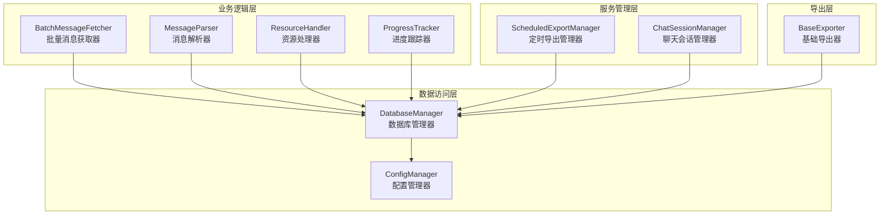

**图表来源**
- [DatabaseManager.ts](file://plugins/qq-chat-exporter/lib/core/storage/DatabaseManager.ts#L57-L99)
- [ConfigManager.ts](file://plugins/qq-chat-exporter/lib/core/storage/ConfigManager.ts#L98-L124)
- [BatchMessageFetcher.ts](file://plugins/qq-chat-exporter/lib/core/fetcher/BatchMessageFetcher.ts#L47-L88)

**章节来源**
- [DatabaseManager.ts](file://plugins/qq-chat-exporter/lib/core/storage/DatabaseManager.ts#L1-L100)
- [ConfigManager.ts](file://plugins/qq-chat-exporter/lib/core/storage/ConfigManager.ts#L1-L100)

## 核心组件

### 数据库管理器 (DatabaseManager)

DatabaseManager是系统的核心数据访问组件，采用了创新的JSONL（JSON Lines）格式存储方案：

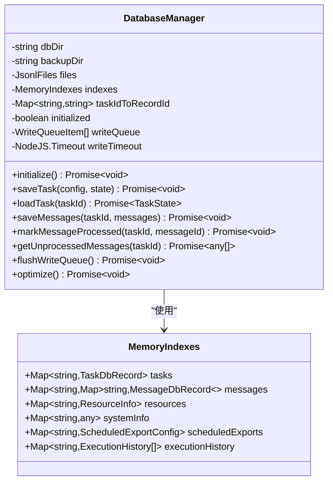

**图表来源**
- [DatabaseManager.ts](file://plugins/qq-chat-exporter/lib/core/storage/DatabaseManager.ts#L57-L70)
- [DatabaseManager.ts](file://plugins/qq-chat-exporter/lib/core/storage/DatabaseManager.ts#L42-L51)

### 配置管理器 (ConfigManager)

ConfigManager提供了统一的配置管理解决方案：

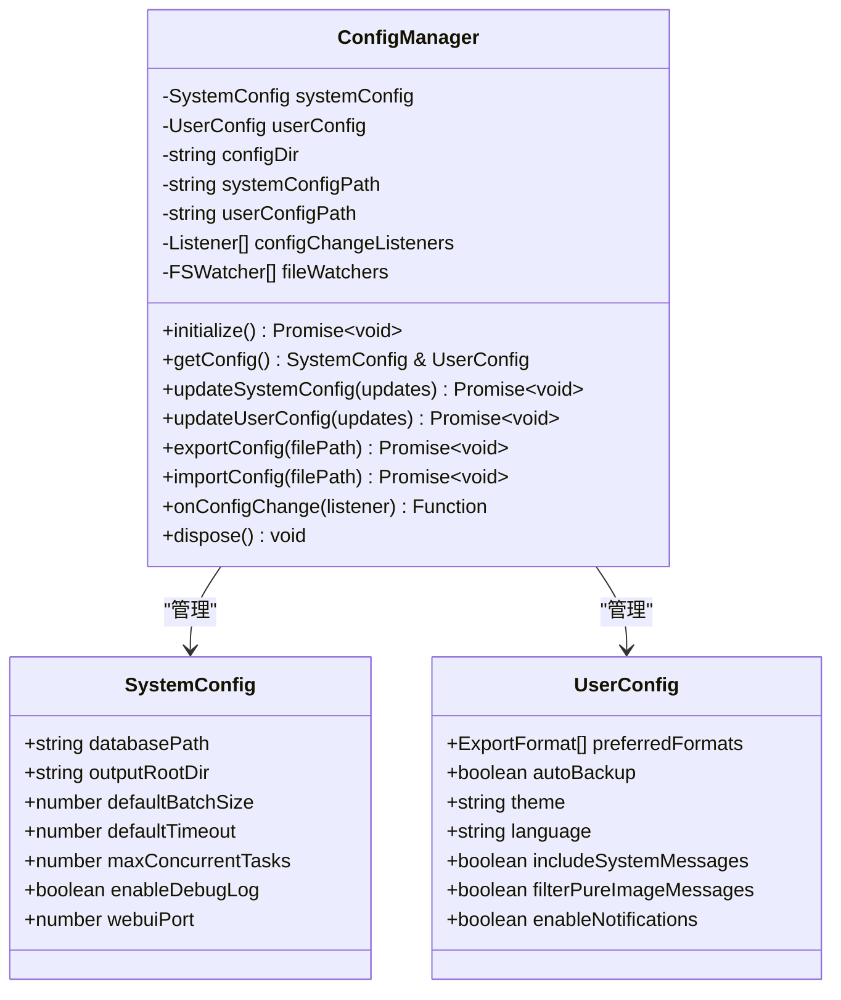

**图表来源**
- [ConfigManager.ts](file://plugins/qq-chat-exporter/lib/core/storage/ConfigManager.ts#L98-L124)
- [ConfigManager.ts](file://plugins/qq-chat-exporter/lib/core/storage/ConfigManager.ts#L26-L84)

**章节来源**
- [DatabaseManager.ts](file://plugins/qq-chat-exporter/lib/core/storage/DatabaseManager.ts#L57-L148)
- [ConfigManager.ts](file://plugins/qq-chat-exporter/lib/core/storage/ConfigManager.ts#L98-L250)

## 架构概览

系统采用分层架构设计，各层职责明确，耦合度低：

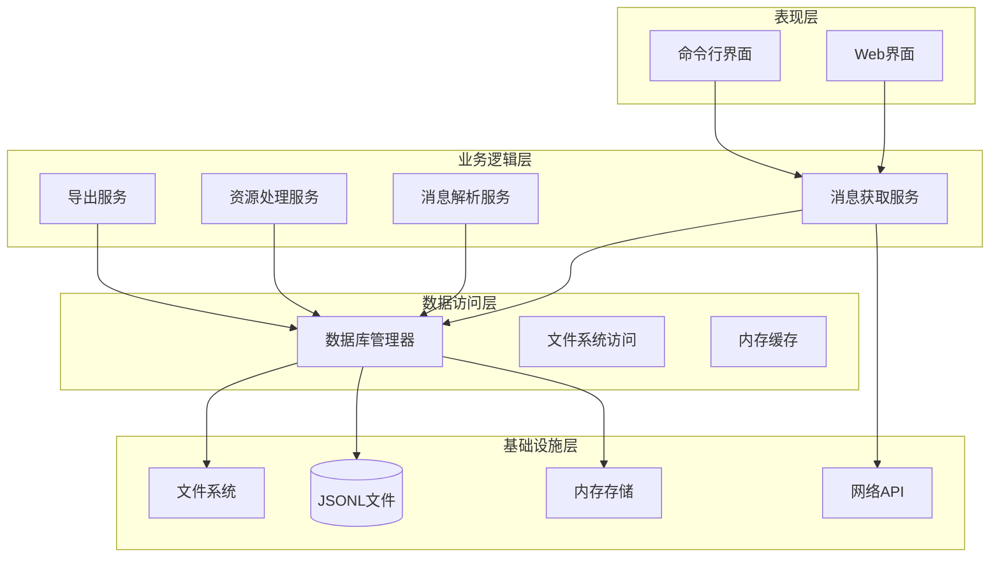

**图表来源**
- [DatabaseManager.ts](file://plugins/qq-chat-exporter/lib/core/storage/DatabaseManager.ts#L105-L148)
- [BatchMessageFetcher.ts](file://plugins/qq-chat-exporter/lib/core/fetcher/BatchMessageFetcher.ts#L107-L151)

## 详细组件分析

### 批量消息获取器 (BatchMessageFetcher)

BatchMessageFetcher实现了智能的消息获取策略：

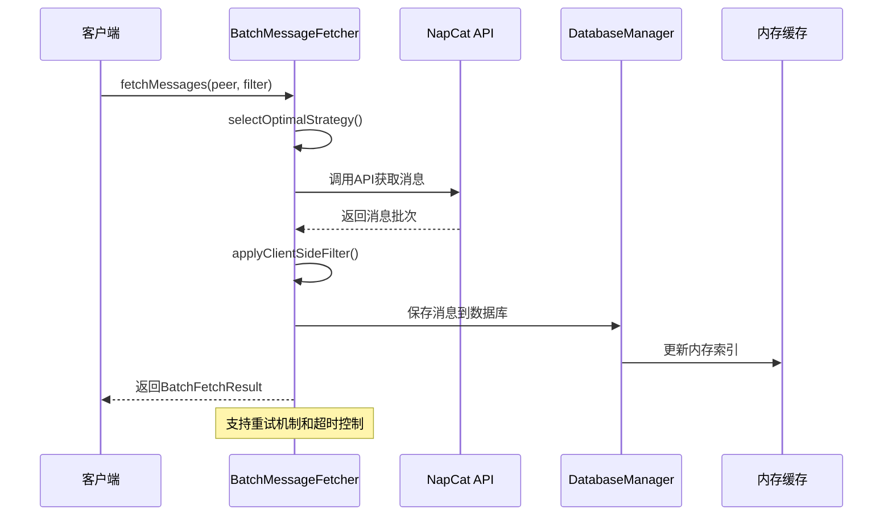

**图表来源**
- [BatchMessageFetcher.ts](file://plugins/qq-chat-exporter/lib/core/fetcher/BatchMessageFetcher.ts#L107-L151)
- [BatchMessageFetcher.ts](file://plugins/qq-chat-exporter/lib/core/fetcher/BatchMessageFetcher.ts#L282-L316)

### 消息解析器 (MessageParser)

MessageParser采用了高性能的并发解析策略：

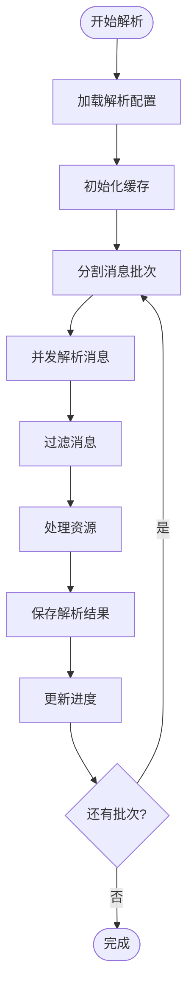

**图表来源**
- [MessageParser.ts](file://plugins/qq-chat-exporter/lib/core/parser/MessageParser.ts#L580-L622)
- [MessageParser.ts](file://plugins/qq-chat-exporter/lib/core/parser/MessageParser.ts#L629-L670)

### 资源处理器 (ResourceHandler)

ResourceHandler实现了智能的资源管理策略：

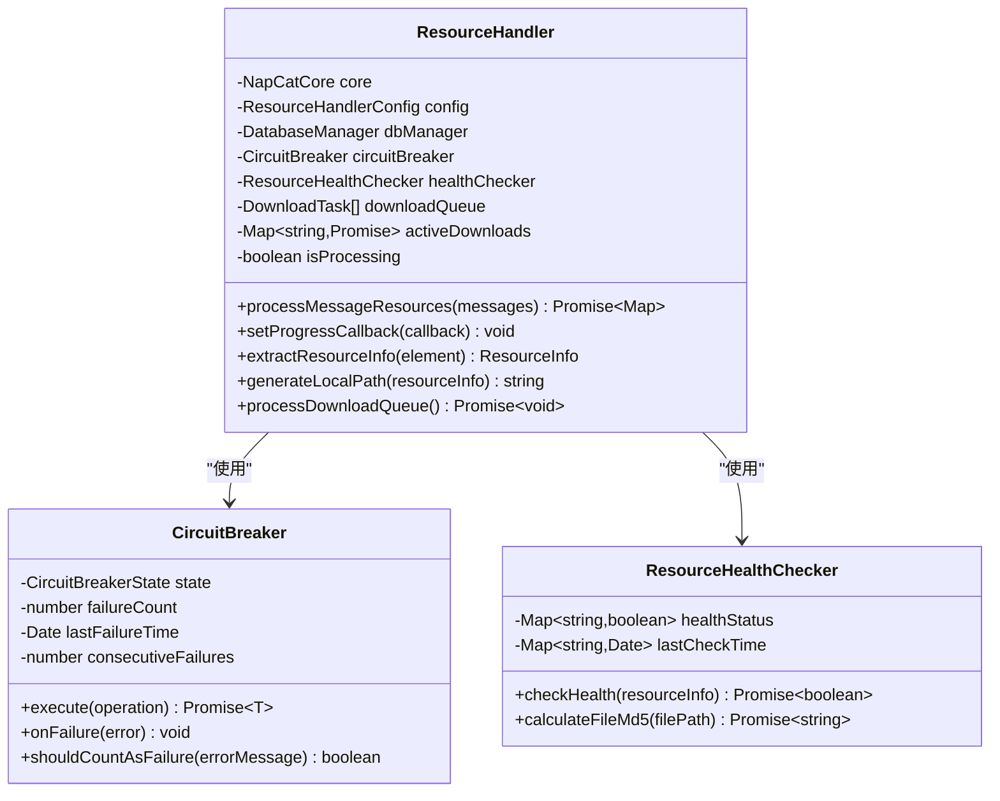

**图表来源**
- [ResourceHandler.ts](file://plugins/qq-chat-exporter/lib/core/resource/ResourceHandler.ts#L277-L321)
- [ResourceHandler.ts](file://plugins/qq-chat-exporter/lib/core/resource/ResourceHandler.ts#L71-L193)

**章节来源**
- [BatchMessageFetcher.ts](file://plugins/qq-chat-exporter/lib/core/fetcher/BatchMessageFetcher.ts#L47-L151)
- [MessageParser.ts](file://plugins/qq-chat-exporter/lib/core/parser/MessageParser.ts#L415-L622)
- [ResourceHandler.ts](file://plugins/qq-chat-exporter/lib/core/resource/ResourceHandler.ts#L277-L403)

### 定时导出管理器 (ScheduledExportManager)

ScheduledExportManager提供了完整的定时任务管理功能：

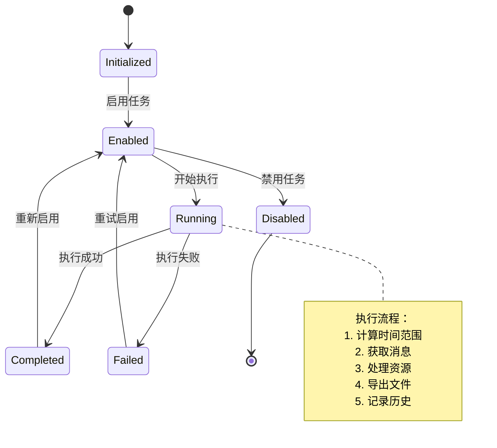

**图表来源**
- [ScheduledExportManager.ts](file://plugins/qq-chat-exporter/lib/core/scheduler/ScheduledExportManager.ts#L202-L246)
- [ScheduledExportManager.ts](file://plugins/qq-chat-exporter/lib/core/scheduler/ScheduledExportManager.ts#L489-L632)

**章节来源**
- [ScheduledExportManager.ts](file://plugins/qq-chat-exporter/lib/core/scheduler/ScheduledExportManager.ts#L202-L333)
- [ProgressTracker.ts](file://plugins/qq-chat-exporter/lib/core/progress/ProgressTracker.ts#L89-L203)

## 依赖关系分析

系统采用松耦合的设计原则，通过接口和事件机制实现组件间的通信：

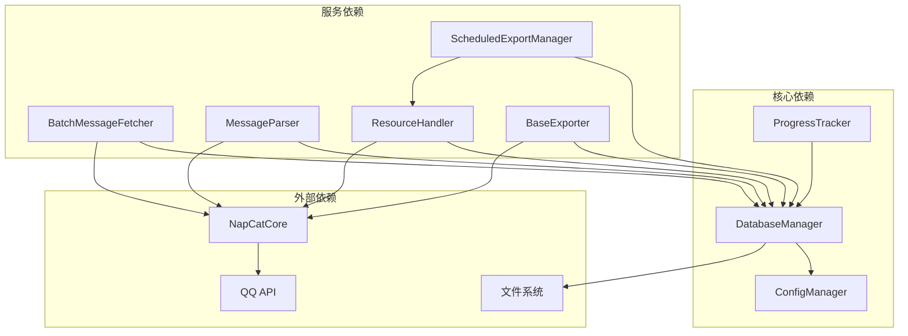

**图表来源**
- [DatabaseManager.ts](file://plugins/qq-chat-exporter/lib/core/storage/DatabaseManager.ts#L105-L148)
- [BatchMessageFetcher.ts](file://plugins/qq-chat-exporter/lib/core/fetcher/BatchMessageFetcher.ts#L66-L88)

**章节来源**
- [ChatSessionManager.ts](file://plugins/qq-chat-exporter/lib/core/chat/ChatSessionManager.ts#L15-L33)
- [BaseExporter.ts](file://plugins/qq-chat-exporter/lib/core/exporter/BaseExporter.ts#L58-L88)

## 性能考虑

### 内存优化策略

系统采用了多层次的内存优化策略：

1. **LRU缓存机制**：消息引用索引使用LRU缓存，限制内存使用
2. **分批处理**：消息解析采用分批处理，避免内存峰值
3. **流式导出**：大型文件采用流式处理，减少内存占用
4. **智能垃圾回收**：定期触发垃圾回收，释放内存

### 并发控制

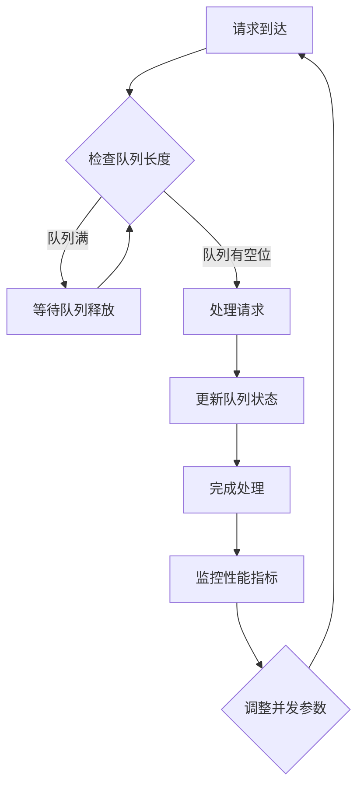

**图表来源**
- [MessageParser.ts](file://plugins/qq-chat-exporter/lib/core/parser/MessageParser.ts#L500-L573)
- [ResourceHandler.ts](file://plugins/qq-chat-exporter/lib/core/resource/ResourceHandler.ts#L596-L649)

### 数据持久化优化

1. **批量写入**：采用写入队列和批量写入机制
2. **内存索引**：使用内存索引提供O(1)查询性能
3. **文件系统优化**：JSONL格式提供高效的随机访问
4. **自动备份**：定期备份机制确保数据安全

**章节来源**
- [DatabaseManager.ts](file://plugins/qq-chat-exporter/lib/core/storage/DatabaseManager.ts#L347-L415)
- [MessageParser.ts](file://plugins/qq-chat-exporter/lib/core/parser/MessageParser.ts#L82-L119)

## 故障排除指南

### 常见问题及解决方案

#### 数据库连接问题

**症状**：数据库初始化失败或查询超时

**诊断步骤**：
1. 检查数据库目录权限
2. 验证JSONL文件完整性
3. 检查磁盘空间

**解决方案**：
```typescript
// 数据库初始化错误处理
try {
    await dbManager.initialize();
} catch (error) {
    if (error instanceof SystemError) {
        console.error(`数据库初始化失败: ${error.message}`);
        // 尝试重建数据库
        await dbManager.rebuildFiles();
    }
}
```

#### 内存溢出问题

**症状**：解析大量消息时出现内存不足

**诊断步骤**：
1. 检查消息批次大小
2. 监控内存使用情况
3. 验证垃圾回收设置

**解决方案**：
```typescript
// 调整并发参数
const parser = new MessageParser(core, {
    batchSize: 10000,    // 减少批次大小
    concurrency: 4,      // 降低并发度
    memorySoftLimitMB: 1000  // 设置内存限制
});
```

#### 网络超时问题

**症状**：消息获取API调用超时

**诊断步骤**：
1. 检查网络连接稳定性
2. 验证API密钥有效性
3. 监控服务器负载

**解决方案**：
```typescript
// 配置重试机制
const fetcher = new BatchMessageFetcher(core, {
    timeout: 60000,      // 增加超时时间
    retryCount: 5,       // 增加重试次数
    retryInterval: 2000  // 调整重试间隔
});
```

### 监控和调试

系统提供了全面的监控和调试功能：

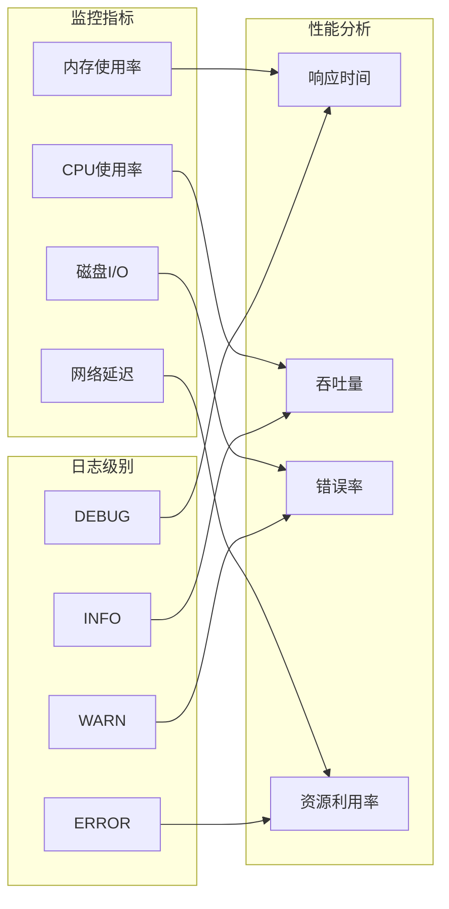

**图表来源**
- [ProgressTracker.ts](file://plugins/qq-chat-exporter/lib/core/progress/ProgressTracker.ts#L618-L647)
- [ResourceHandler.ts](file://plugins/qq-chat-exporter/lib/core/resource/ResourceHandler.ts#L717-L775)

**章节来源**
- [ProgressTracker.ts](file://plugins/qq-chat-exporter/lib/core/progress/ProgressTracker.ts#L618-L732)
- [ConfigManager.ts](file://plugins/qq-chat-exporter/lib/core/storage/ConfigManager.ts#L332-L356)

## 结论

QQ聊天导出器的数据访问模式展现了现代应用程序的最佳实践：

### 设计优势

1. **模块化架构**：清晰的分层设计使得系统易于维护和扩展
2. **高性能实现**：多层缓存和并发处理确保了系统的高效运行
3. **可靠性保障**：完善的错误处理和恢复机制提高了系统稳定性
4. **灵活性设计**：配置驱动的架构支持各种使用场景

### 技术亮点

- **创新的数据持久化**：JSONL格式提供了高效的存储和查询能力
- **智能缓存策略**：多层次缓存机制平衡了性能和内存使用
- **并发控制**：合理的并发管理确保了系统的稳定性和性能
- **监控体系**：全面的监控和调试功能便于问题诊断和性能优化

### 未来改进方向

1. **数据库优化**：考虑引入更专业的数据库解决方案
2. **缓存策略**：进一步优化缓存算法和策略
3. **性能监控**：增强实时性能监控和告警功能
4. **扩展性**：支持分布式部署和水平扩展

这套数据访问模式为类似的大规模数据处理应用提供了宝贵的参考和借鉴价值。