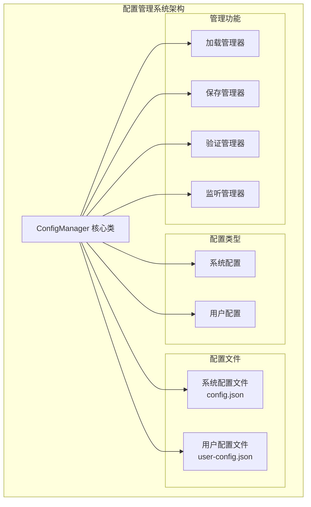
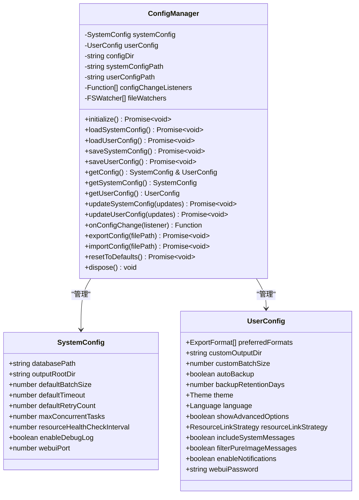
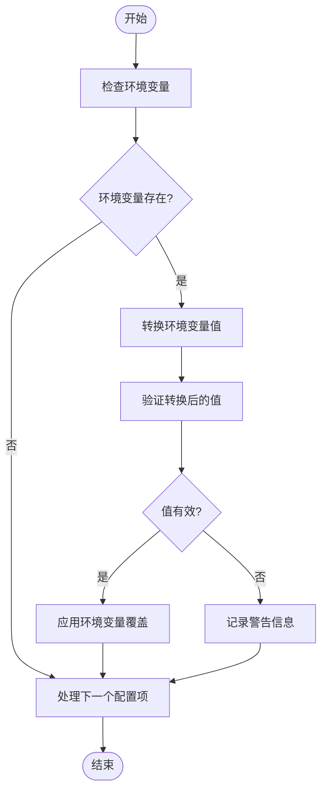
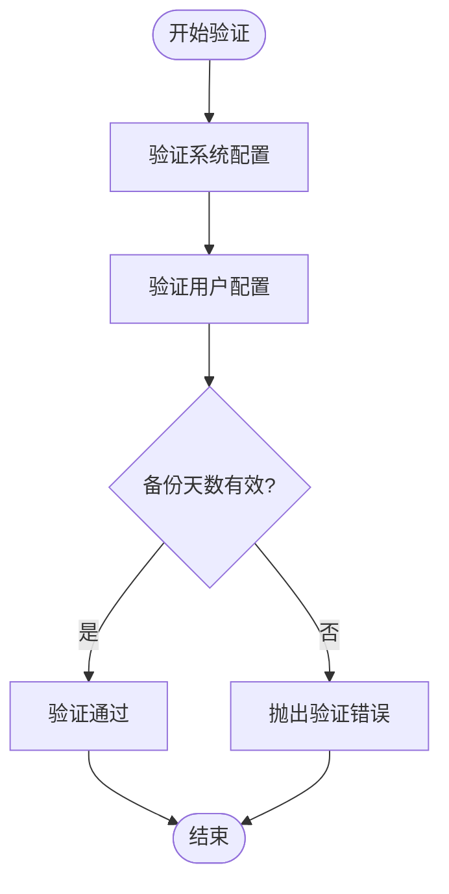
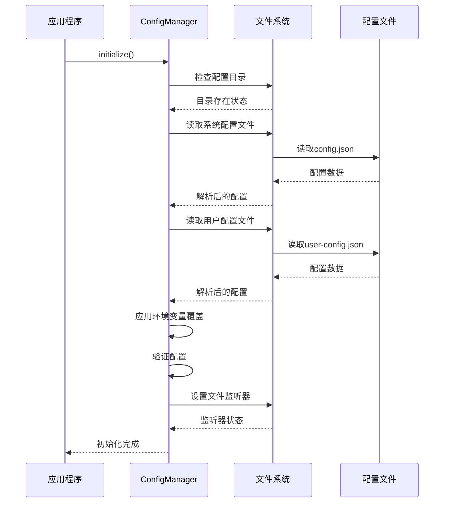
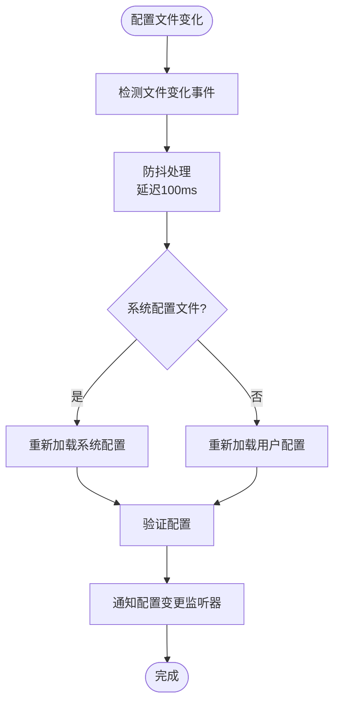
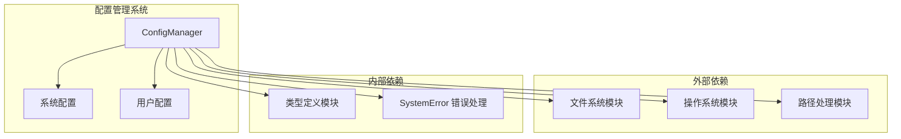
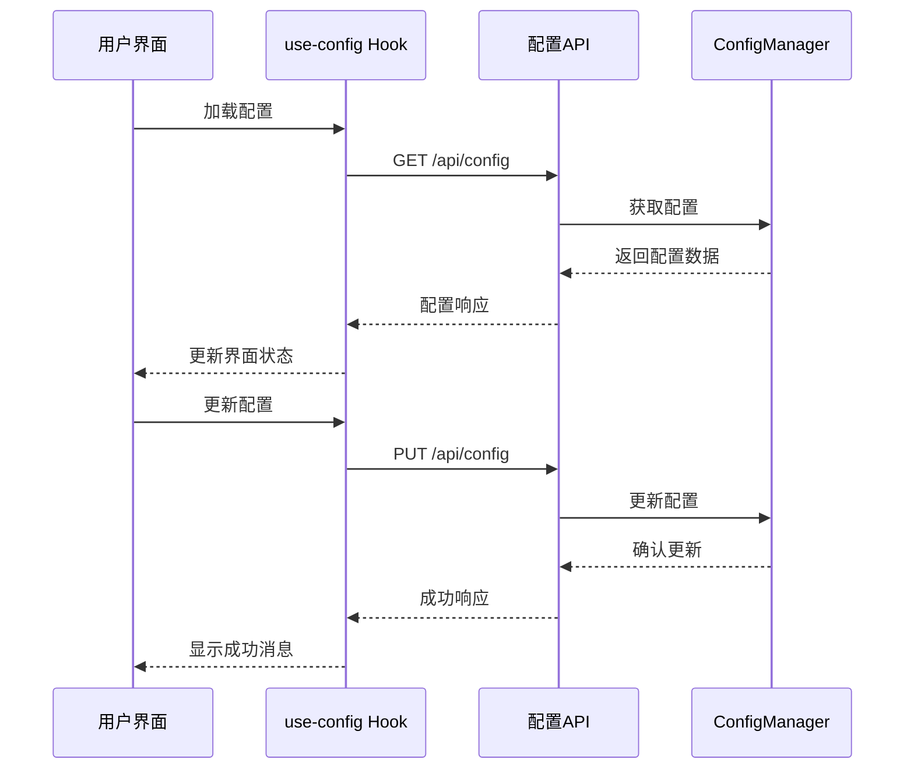

# 配置管理系统

<cite>
**本文档引用的文件**
- [ConfigManager.ts](file://plugins/qq-chat-exporter/lib/core/storage/ConfigManager.ts)
- [use-config.ts](file://qce-v4-tool/hooks/use-config.ts)
</cite>

## 目录
1. [简介](#简介)
2. [项目结构](#项目结构)
3. [核心组件](#核心组件)
4. [架构概览](#架构概览)
5. [详细组件分析](#详细组件分析)
6. [依赖关系分析](#依赖关系分析)
7. [性能考虑](#性能考虑)
8. [故障排除指南](#故障排除指南)
9. [结论](#结论)

## 简介

QQ聊天导出器的配置管理系统是一个高度模块化的配置管理解决方案，专门设计用于管理系统的系统配置和用户配置。该系统提供了完整的配置生命周期管理，包括配置的加载、保存、验证、热重载和监听功能。

系统采用分离管理模式，将系统配置（影响应用程序整体行为的配置）和用户配置（影响用户界面和用户体验的配置）分开管理，确保了配置的清晰性和可维护性。

## 项目结构

配置管理系统主要由以下关键组件构成：



**图表来源**
- [ConfigManager.ts](file://plugins/qq-chat-exporter/lib/core/storage/ConfigManager.ts#L98-L124)

**章节来源**
- [ConfigManager.ts](file://plugins/qq-chat-exporter/lib/core/storage/ConfigManager.ts#L1-L635)

## 核心组件

### ConfigManager 类

ConfigManager 是整个配置管理系统的核心类，负责协调所有配置管理功能。它提供了完整的配置生命周期管理能力，包括初始化、加载、保存、验证、监听和清理等操作。

#### 主要职责
- **配置加载**: 从文件系统加载系统配置和用户配置
- **配置保存**: 将配置持久化到文件系统
- **配置验证**: 验证配置的有效性和完整性
- **配置监听**: 实时监控配置文件变化并触发相应处理
- **配置合并**: 将系统配置和用户配置合并为完整配置
- **配置导入导出**: 支持配置的导入和导出功能

#### 关键特性
- **异步操作**: 所有配置操作都是异步的，确保不会阻塞主线程
- **错误处理**: 完善的错误处理机制，提供详细的错误信息
- **热重载**: 支持配置文件的实时热重载功能
- **监听机制**: 提供配置变更监听器，支持回调通知

**章节来源**
- [ConfigManager.ts](file://plugins/qq-chat-exporter/lib/core/storage/ConfigManager.ts#L98-L124)

## 架构概览

配置管理系统采用了分层架构设计，确保了各组件之间的松耦合和高内聚。



**图表来源**
- [ConfigManager.ts](file://plugins/qq-chat-exporter/lib/core/storage/ConfigManager.ts#L98-L124)
- [ConfigManager.ts](file://plugins/qq-chat-exporter/lib/core/storage/ConfigManager.ts#L26-L84)

## 详细组件分析

### 系统配置管理

系统配置管理负责管理影响应用程序整体行为的配置项，这些配置通常由系统管理员或开发者控制。

#### 默认系统配置

系统配置提供了完整的默认值集合，确保应用程序在首次启动时能够正常运行。

| 配置项 | 数据类型 | 默认值 | 描述 |
|--------|----------|--------|------|
| databasePath | string | 用户主目录/.qq-chat-exporter/database.db | SQLite数据库文件路径 |
| outputRootDir | string | 用户主目录/.qq-chat-exporter/exports | 导出文件根目录 |
| defaultBatchSize | number | 5000 | 默认批量处理大小 |
| defaultTimeout | number | 30000 | 默认超时时间（毫秒） |
| defaultRetryCount | number | 3 | 默认重试次数 |
| maxConcurrentTasks | number | 3 | 最大并发任务数 |
| resourceHealthCheckInterval | number | 60000 | 资源健康检查间隔（毫秒） |
| enableDebugLog | boolean | false | 是否启用调试日志 |
| webuiPort | number | 8080 | WebUI服务端口 |

#### 环境变量覆盖机制

系统支持通过环境变量覆盖配置，提供了灵活的部署方式。



**图表来源**
- [ConfigManager.ts](file://plugins/qq-chat-exporter/lib/core/storage/ConfigManager.ts#L255-L277)

**章节来源**
- [ConfigManager.ts](file://plugins/qq-chat-exporter/lib/core/storage/ConfigManager.ts#L26-L36)
- [ConfigManager.ts](file://plugins/qq-chat-exporter/lib/core/storage/ConfigManager.ts#L255-L277)

### 用户配置管理

用户配置管理负责管理影响用户界面和用户体验的配置项，这些配置通常由最终用户控制。

#### 默认用户配置

用户配置提供了完整的默认值集合，确保应用程序具有良好的用户体验。

| 配置项 | 数据类型 | 默认值 | 描述 |
|--------|----------|--------|------|
| preferredFormats | ExportFormat[] | [HTML, JSON] | 用户偏好的导出格式 |
| autoBackup | boolean | true | 是否自动备份 |
| backupRetentionDays | number | 7 | 备份保留天数 |
| theme | Theme | 'auto' | 主题设置（light/dark/auto） |
| language | Language | 'zh-CN' | 语言设置 |
| showAdvancedOptions | boolean | false | 是否显示高级选项 |
| resourceLinkStrategy | ResourceLinkStrategy | 'keep' | 资源链接处理策略 |
| includeSystemMessages | boolean | true | 是否包含系统消息 |
| filterPureImageMessages | boolean | false | 是否过滤纯图片消息 |
| enableNotifications | boolean | true | 是否启用通知 |
| webuiPassword | string | 无 | WebUI访问密码 |

#### 配置验证规则

用户配置包含特定的验证规则，确保配置的有效性。



**图表来源**
- [ConfigManager.ts](file://plugins/qq-chat-exporter/lib/core/storage/ConfigManager.ts#L282-L327)

**章节来源**
- [ConfigManager.ts](file://plugins/qq-chat-exporter/lib/core/storage/ConfigManager.ts#L73-L84)
- [ConfigManager.ts](file://plugins/qq-chat-exporter/lib/core/storage/ConfigManager.ts#L282-L327)

### 配置文件管理

配置文件管理负责配置文件的读写操作，确保配置数据的持久化。

#### 文件结构

系统使用两个独立的JSON文件来存储配置数据：

1. **系统配置文件** (`config.json`): 存储系统级别的配置
2. **用户配置文件** (`user-config.json`): 存储用户级别的配置

#### 文件操作流程



**图表来源**
- [ConfigManager.ts](file://plugins/qq-chat-exporter/lib/core/storage/ConfigManager.ts#L130-L162)

**章节来源**
- [ConfigManager.ts](file://plugins/qq-chat-exporter/lib/core/storage/ConfigManager.ts#L167-L214)

### 配置监听机制

配置监听机制提供了实时监控配置文件变化的能力，支持热重载功能。

#### 监听器类型

系统支持两种类型的配置监听器：

1. **系统配置监听器**: 监控系统配置文件的变化
2. **用户配置监听器**: 监控用户配置文件的变化

#### 监听器工作流程



**图表来源**
- [ConfigManager.ts](file://plugins/qq-chat-exporter/lib/core/storage/ConfigManager.ts#L361-L378)

**章节来源**
- [ConfigManager.ts](file://plugins/qq-chat-exporter/lib/core/storage/ConfigManager.ts#L332-L378)

### 配置导入导出功能

配置导入导出功能允许用户在不同环境之间共享配置设置。

#### 导出功能

配置导出功能支持将当前配置保存为标准格式的文件，包含以下信息：
- 系统配置数据
- 用户配置数据
- 导出时间戳
- 版本信息

#### 导入功能

配置导入功能支持从标准格式的文件中恢复配置，包含以下步骤：
- 验证导入文件格式
- 备份当前配置
- 应用导入的配置
- 验证新配置
- 保存配置并通知监听器

**章节来源**
- [ConfigManager.ts](file://plugins/qq-chat-exporter/lib/core/storage/ConfigManager.ts#L502-L573)

## 依赖关系分析

配置管理系统与其他系统组件之间的依赖关系如下：



**图表来源**
- [ConfigManager.ts](file://plugins/qq-chat-exporter/lib/core/storage/ConfigManager.ts#L7-L15)

### 前端集成

配置管理系统还提供了前端集成接口，支持Web界面的配置管理。

#### use-config Hook

前端使用 `use-config` Hook 来管理配置状态：



**图表来源**
- [use-config.ts](file://qce-v4-tool/hooks/use-config.ts#L17-L71)

**章节来源**
- [use-config.ts](file://qce-v4-tool/hooks/use-config.ts#L1-L73)

## 性能考虑

配置管理系统在设计时充分考虑了性能优化，确保在大量配置操作时仍能保持良好的响应性。

### 异步操作优化

- **非阻塞操作**: 所有文件I/O操作都是异步的，避免阻塞主线程
- **批量操作**: 支持批量配置更新，减少文件写入次数
- **缓存机制**: 配置数据在内存中缓存，减少重复读取

### 内存管理

- **垃圾回收**: 及时释放不再使用的监听器和处理器
- **资源清理**: 提供 `dispose()` 方法清理所有资源
- **监听器管理**: 支持动态添加和移除监听器

### 文件系统优化

- **防抖处理**: 配置文件变化监听器包含防抖机制，避免频繁重载
- **增量更新**: 支持部分配置更新，减少不必要的全量重载
- **错误恢复**: 配置加载失败时自动回退到默认配置

## 故障排除指南

### 常见问题及解决方案

#### 配置文件加载失败

**问题描述**: 应用程序无法加载配置文件，启动失败

**可能原因**:
- 配置文件权限不足
- 配置文件格式错误
- 配置文件损坏

**解决方法**:
1. 检查配置文件是否存在且可读
2. 验证配置文件JSON格式正确性
3. 检查文件权限设置
4. 如有必要，删除损坏的配置文件让系统重新生成

#### 配置验证失败

**问题描述**: 应用程序启动时配置验证失败

**可能原因**:
- 配置值超出有效范围
- 配置类型不匹配
- 配置格式错误

**解决方法**:
1. 检查配置值是否在有效范围内
2. 验证配置类型是否正确
3. 查看错误日志获取具体失败原因
4. 使用默认配置重置系统

#### 配置监听失效

**问题描述**: 配置文件修改后应用程序未响应

**可能原因**:
- 文件监听器异常
- 文件系统权限问题
- 防抖机制导致的延迟

**解决方法**:
1. 检查文件监听器状态
2. 验证文件系统权限
3. 等待防抖延迟结束后再次尝试
4. 重启应用程序重新建立监听

### 调试技巧

#### 启用调试日志

可以通过设置 `enableDebugLog` 配置项来启用详细的调试信息：

```bash
export QCE_DEBUG_LOG=true
```

#### 配置路径检查

使用 `getConfigPaths()` 方法获取配置文件的实际路径：

```typescript
const configManager = new ConfigManager();
const paths = configManager.getConfigPaths();
console.log('配置目录:', paths.configDir);
console.log('系统配置文件:', paths.systemConfigPath);
console.log('用户配置文件:', paths.userConfigPath);
```

**章节来源**
- [ConfigManager.ts](file://plugins/qq-chat-exporter/lib/core/storage/ConfigManager.ts#L607-L617)

## 结论

QQ聊天导出器的配置管理系统是一个设计精良、功能完善的配置管理解决方案。它通过分离管理模式实现了系统配置和用户配置的有效隔离，提供了完整的配置生命周期管理能力。

### 主要优势

1. **模块化设计**: 清晰的组件分离和职责划分
2. **灵活性**: 支持环境变量覆盖和多种配置来源
3. **可靠性**: 完善的错误处理和恢复机制
4. **可扩展性**: 易于添加新的配置项和验证规则
5. **用户友好**: 提供直观的配置管理和导入导出功能

### 技术亮点

- **异步架构**: 完全基于Promise的异步操作
- **热重载支持**: 实时配置变更响应机制
- **验证机制**: 多层次的配置验证确保数据完整性
- **监听系统**: 灵活的配置变更通知机制
- **错误处理**: 详细的错误信息和恢复策略

该配置管理系统为QQ聊天导出器提供了稳定可靠的配置管理基础，确保了应用程序在各种部署环境中的可靠运行。