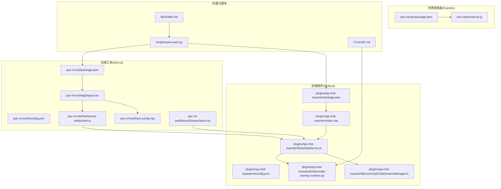
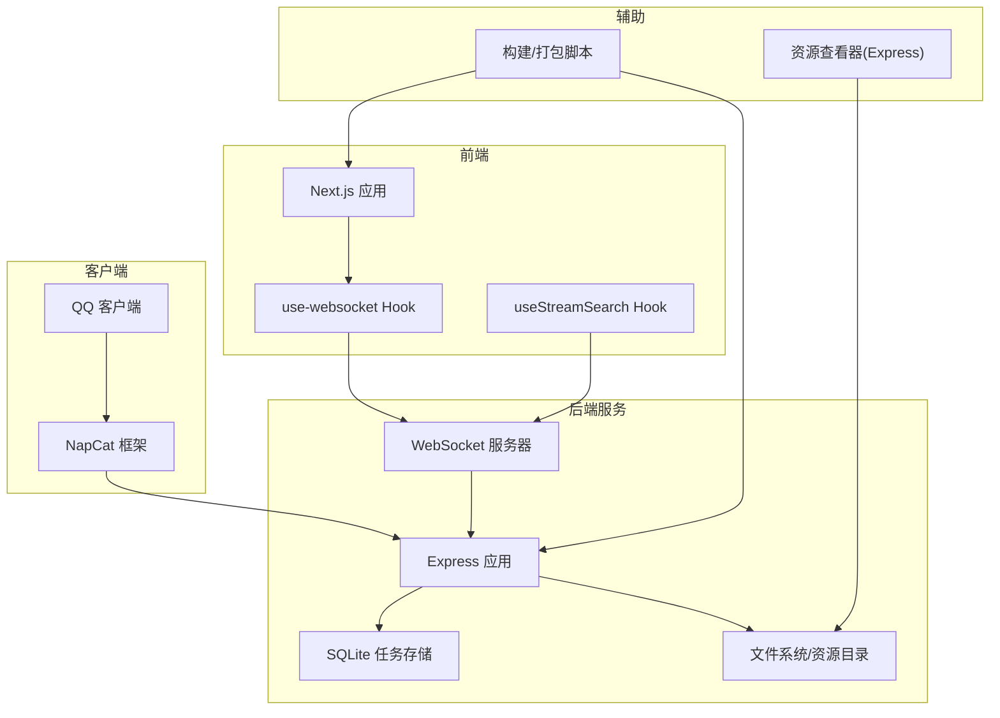
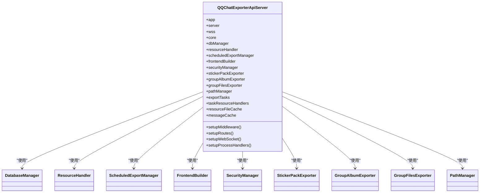
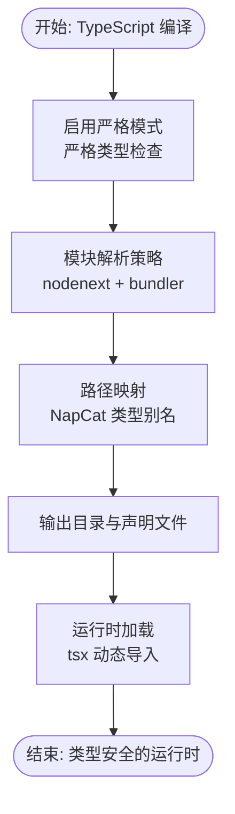
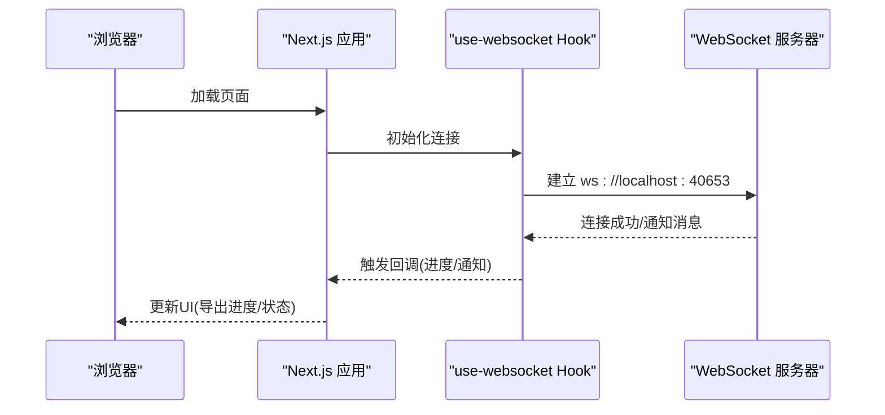
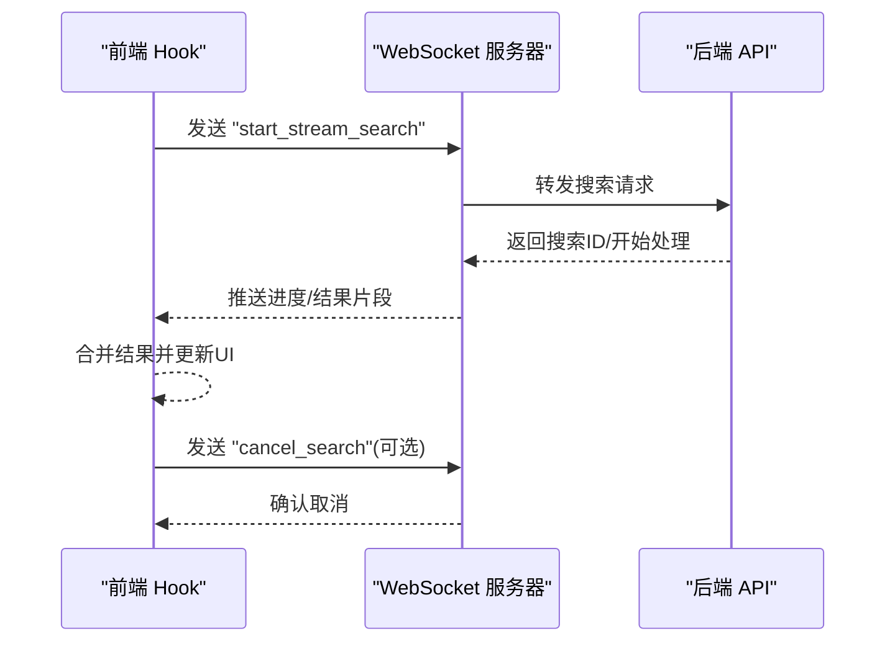
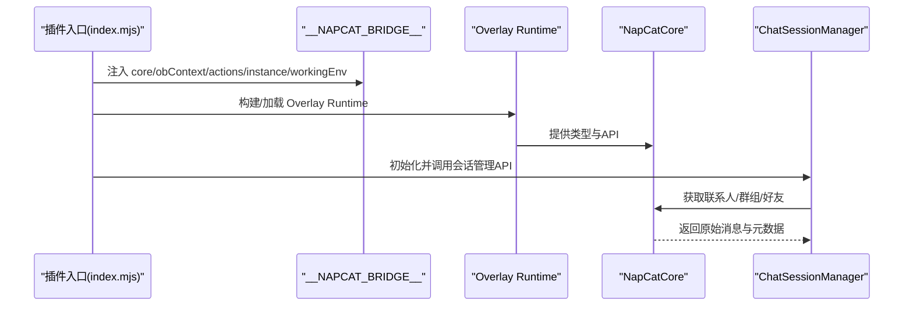
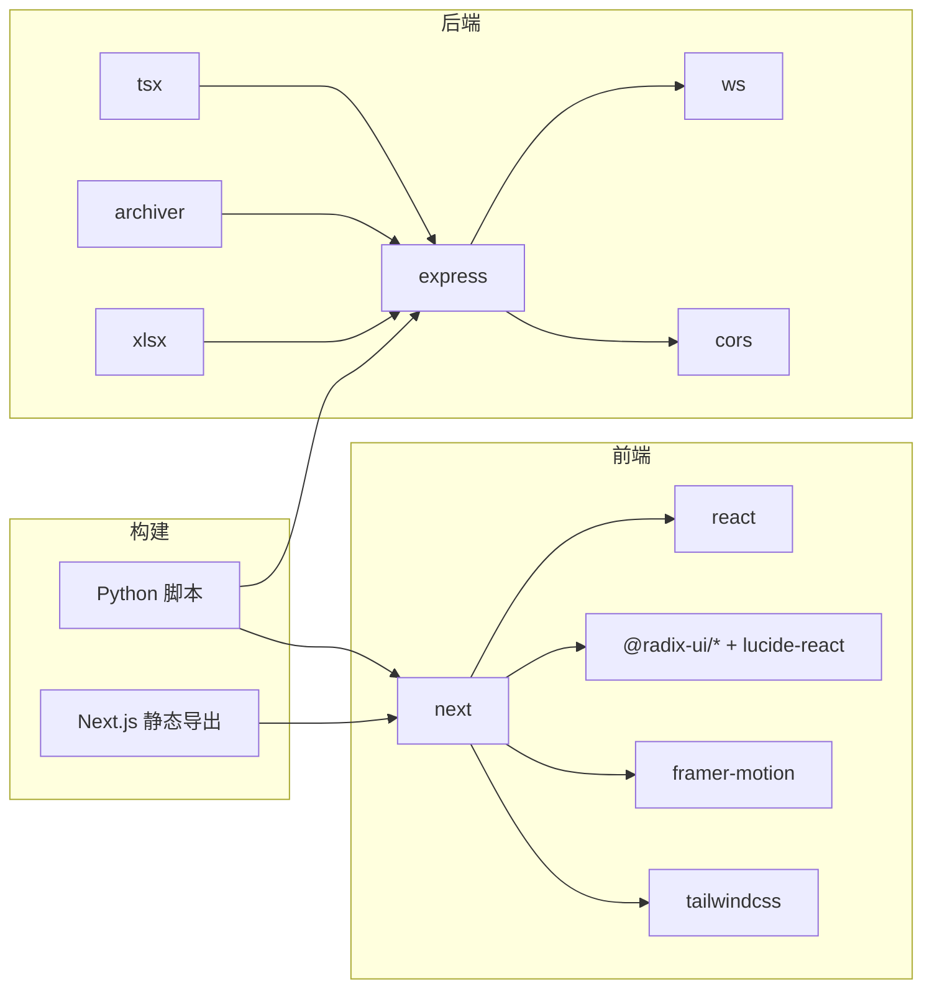

# 技术栈选型

<cite>
**本文引用的文件**
- [plugins/qq-chat-exporter/package.json](file://plugins/qq-chat-exporter/package.json)
- [plugins/qq-chat-exporter/tsconfig.json](file://plugins/qq-chat-exporter/tsconfig.json)
- [plugins/qq-chat-exporter/index.mjs](file://plugins/qq-chat-exporter/index.mjs)
- [plugins/qq-chat-exporter/lib/api/ApiServer.ts](file://plugins/qq-chat-exporter/lib/api/ApiServer.ts)
- [plugins/qq-chat-exporter/lib/core/chat/ChatSessionManager.ts](file://plugins/qq-chat-exporter/lib/core/chat/ChatSessionManager.ts)
- [plugins/qq-chat-exporter/tools/create-overlay-runtime.cjs](file://plugins/qq-chat-exporter/tools/create-overlay-runtime.cjs)
- [qce-v4-tool/package.json](file://qce-v4-tool/package.json)
- [qce-v4-tool/tsconfig.json](file://qce-v4-tool/tsconfig.json)
- [qce-v4-tool/app/layout.tsx](file://qce-v4-tool/app/layout.tsx)
- [qce-v4-tool/next.config.mjs](file://qce-v4-tool/next.config.mjs)
- [qce-v4-tool/hooks/use-websocket.ts](file://qce-v4-tool/hooks/use-websocket.ts)
- [qce-v4-tool/lib/useStreamSearch.ts](file://qce-v4-tool/lib/useStreamSearch.ts)
- [qce-viewer/package.json](file://qce-viewer/package.json)
- [qce-viewer/server.js](file://qce-viewer/server.js)
- [scripts/quick-pack.py](file://scripts/quick-pack.py)
- [README.md](file://README.md)
- [CLAUDE.md](file://CLAUDE.md)
</cite>

## 目录
1. [简介](#简介)
2. [项目结构](#项目结构)
3. [核心组件](#核心组件)
4. [架构总览](#架构总览)
5. [详细组件分析](#详细组件分析)
6. [依赖关系分析](#依赖关系分析)
7. [性能考量](#性能考量)
8. [故障排查指南](#故障排查指南)
9. [结论](#结论)
10. [附录](#附录)

## 简介
本技术栈选型文档聚焦于“QQ聊天导出器”的整体技术架构与选型理由，围绕以下目标展开：
- 解释后端运行时选择 Node.js + Express 的性能与生态优势
- 说明 TypeScript 在类型安全与开发体验方面的价值
- 阐述 Next.js 前端框架在现代特性与开发效率上的收益
- 描述 WebSocket 实时通信在导出流程中的作用
- 明确 NapCat 框架作为 QQ 客户端集成基础的重要性
- 对比其他技术方案的优缺点，给出权衡考虑
- 给出版本要求与兼容性说明

## 项目结构
该项目采用多模块分层组织：
- 插件后端（Node.js + Express + TypeScript）：负责与 NapCat 集成、提供 API 与 WebSocket、执行导出任务
- 前端工具（Next.js）：提供现代化 Web 界面，支持实时通信与交互
- 资源查看器（Express）：独立的静态资源查看服务
- 构建与打包脚本：自动化配置与部署

图表来源
- [plugins/qq-chat-exporter/package.json](file://plugins/qq-chat-exporter/package.json#L1-L42)
- [plugins/qq-chat-exporter/tsconfig.json](file://plugins/qq-chat-exporter/tsconfig.json#L1-L39)
- [plugins/qq-chat-exporter/index.mjs](file://plugins/qq-chat-exporter/index.mjs#L1-L77)
- [plugins/qq-chat-exporter/lib/api/ApiServer.ts](file://plugins/qq-chat-exporter/lib/api/ApiServer.ts#L1-L200)
- [plugins/qq-chat-exporter/lib/core/chat/ChatSessionManager.ts](file://plugins/qq-chat-exporter/lib/core/chat/ChatSessionManager.ts#L1-L33)
- [plugins/qq-chat-exporter/tools/create-overlay-runtime.cjs](file://plugins/qq-chat-exporter/tools/create-overlay-runtime.cjs#L183-L238)
- [qce-v4-tool/package.json](file://qce-v4-tool/package.json#L1-L74)
- [qce-v4-tool/tsconfig.json](file://qce-v4-tool/tsconfig.json#L1-L56)
- [qce-v4-tool/app/layout.tsx](file://qce-v4-tool/app/layout.tsx#L1-L69)
- [qce-v4-tool/next.config.mjs](file://qce-v4-tool/next.config.mjs#L1-L41)
- [qce-v4-tool/hooks/use-websocket.ts](file://qce-v4-tool/hooks/use-websocket.ts#L1-L131)
- [qce-v4-tool/lib/useStreamSearch.ts](file://qce-v4-tool/lib/useStreamSearch.ts#L23-L219)
- [qce-viewer/package.json](file://qce-viewer/package.json#L1-L22)
- [qce-viewer/server.js](file://qce-viewer/server.js#L1-L233)
- [scripts/quick-pack.py](file://scripts/quick-pack.py#L524-L780)
- [README.md](file://README.md#L1-L42)
- [CLAUDE.md](file://CLAUDE.md#L1-L79)

章节来源
- [README.md](file://README.md#L1-L42)
- [CLAUDE.md](file://CLAUDE.md#L1-L79)

## 核心组件
- 后端插件（Node.js + Express + TypeScript）
  - 使用 Express 提供 REST API 与 WebSocket 服务
  - 使用 TypeScript 提升类型安全与开发体验
  - 通过 NapCat 框架访问 QQ 客户端能力
- 前端工具（Next.js）
  - 基于 App Router 的现代化前端界面
  - 使用自定义 Hook 管理 WebSocket 连接与消息
  - 支持流式搜索与进度通知
- 资源查看器（Express）
  - 提供静态资源浏览与健康检查接口
- 构建与部署
  - Python 脚本统一打包 NapCat 与插件配置
  - Next.js 静态导出配合前端构建产物

章节来源
- [plugins/qq-chat-exporter/package.json](file://plugins/qq-chat-exporter/package.json#L1-L42)
- [plugins/qq-chat-exporter/tsconfig.json](file://plugins/qq-chat-exporter/tsconfig.json#L1-L39)
- [plugins/qq-chat-exporter/index.mjs](file://plugins/qq-chat-exporter/index.mjs#L1-L77)
- [plugins/qq-chat-exporter/lib/api/ApiServer.ts](file://plugins/qq-chat-exporter/lib/api/ApiServer.ts#L1-L200)
- [qce-v4-tool/package.json](file://qce-v4-tool/package.json#L1-L74)
- [qce-v4-tool/tsconfig.json](file://qce-v4-tool/tsconfig.json#L1-L56)
- [qce-v4-tool/app/layout.tsx](file://qce-v4-tool/app/layout.tsx#L1-L69)
- [qce-v4-tool/next.config.mjs](file://qce-v4-tool/next.config.mjs#L1-L41)
- [qce-v4-tool/hooks/use-websocket.ts](file://qce-v4-tool/hooks/use-websocket.ts#L1-L131)
- [qce-v4-tool/lib/useStreamSearch.ts](file://qce-v4-tool/lib/useStreamSearch.ts#L23-L219)
- [qce-viewer/package.json](file://qce-viewer/package.json#L1-L22)
- [qce-viewer/server.js](file://qce-viewer/server.js#L1-L233)
- [scripts/quick-pack.py](file://scripts/quick-pack.py#L524-L780)

## 架构总览
整体架构由“NapCat 集成层 + 后端服务层 + 前端交互层 + 资源查看层”构成，前后端通过 WebSocket 实现实时通信。

图表来源
- [plugins/qq-chat-exporter/lib/api/ApiServer.ts](file://plugins/qq-chat-exporter/lib/api/ApiServer.ts#L84-L187)
- [qce-v4-tool/hooks/use-websocket.ts](file://qce-v4-tool/hooks/use-websocket.ts#L42-L99)
- [qce-v4-tool/lib/useStreamSearch.ts](file://qce-v4-tool/lib/useStreamSearch.ts#L34-L61)
- [qce-viewer/server.js](file://qce-viewer/server.js#L1-L233)
- [scripts/quick-pack.py](file://scripts/quick-pack.py#L524-L780)

## 详细组件分析

### 后端运行时：Node.js + Express
- 选择理由
  - 生态成熟：拥有丰富的中间件与工具链，便于快速搭建 API 与 WebSocket
  - 性能稳定：事件驱动模型适合高并发 I/O 场景（文件读写、导出任务）
  - 与 NapCat 集成友好：通过 Overlay Runtime 与 TypeScript 模块解析实现无缝对接
- 关键实现点
  - Express 应用初始化与路由注册
  - WebSocket 服务器与连接管理
  - 数据库与资源目录管理
  - 进程信号处理与优雅关闭

图表来源
- [plugins/qq-chat-exporter/lib/api/ApiServer.ts](file://plugins/qq-chat-exporter/lib/api/ApiServer.ts#L84-L187)

章节来源
- [plugins/qq-chat-exporter/lib/api/ApiServer.ts](file://plugins/qq-chat-exporter/lib/api/ApiServer.ts#L1-L200)
- [plugins/qq-chat-exporter/lib/api/ApiServer.ts](file://plugins/qq-chat-exporter/lib/api/ApiServer.ts#L3275-L3297)

### 类型系统：TypeScript
- 选择理由
  - 类型安全：在大型工程中显著降低运行时错误
  - 开发体验：智能提示与编译期检查提升迭代效率
  - 与 NapCat Overlay Runtime 协同：通过 tsconfig 的 nodenext 与路径映射，确保类型与模块解析正确
- 关键实现点
  - 编译选项严格模式与 ES 模块解析
  - NapCat 类型路径映射与声明文件解析
  - 与 tsx 的动态加载配合，支持开发时热更新

图表来源
- [plugins/qq-chat-exporter/tsconfig.json](file://plugins/qq-chat-exporter/tsconfig.json#L2-L26)
- [plugins/qq-chat-exporter/index.mjs](file://plugins/qq-chat-exporter/index.mjs#L43-L51)

章节来源
- [plugins/qq-chat-exporter/tsconfig.json](file://plugins/qq-chat-exporter/tsconfig.json#L1-L39)
- [plugins/qq-chat-exporter/index.mjs](file://plugins/qq-chat-exporter/index.mjs#L1-L77)

### 前端框架：Next.js
- 选择理由
  - App Router 与 SSR/SSG：提升首屏性能与 SEO
  - 现代开发体验：类型安全、自动代码分割、增量构建
  - 静态导出：便于与 NapCat 部署产物整合
- 关键实现点
  - 布局与全局样式注入
  - Next 配置与版本注入
  - 自定义 Hook 管理 WebSocket 连接与消息分发

图表来源
- [qce-v4-tool/app/layout.tsx](file://qce-v4-tool/app/layout.tsx#L15-L69)
- [qce-v4-tool/next.config.mjs](file://qce-v4-tool/next.config.mjs#L17-L38)
- [qce-v4-tool/hooks/use-websocket.ts](file://qce-v4-tool/hooks/use-websocket.ts#L42-L99)

章节来源
- [qce-v4-tool/package.json](file://qce-v4-tool/package.json#L1-L74)
- [qce-v4-tool/tsconfig.json](file://qce-v4-tool/tsconfig.json#L1-L56)
- [qce-v4-tool/app/layout.tsx](file://qce-v4-tool/app/layout.tsx#L1-L69)
- [qce-v4-tool/next.config.mjs](file://qce-v4-tool/next.config.mjs#L1-L41)
- [qce-v4-tool/hooks/use-websocket.ts](file://qce-v4-tool/hooks/use-websocket.ts#L1-L131)
- [qce-v4-tool/lib/useStreamSearch.ts](file://qce-v4-tool/lib/useStreamSearch.ts#L23-L219)

### 实时通信：WebSocket
- 选择理由
  - 实时反馈：导出进度、通知、搜索状态等即时推送
  - 低延迟：相比轮询更高效，适合大文件与长任务
- 关键实现点
  - 后端 WebSocketServer 管理连接与消息分发
  - 前端 Hook 封装连接生命周期与自动重连
  - 流式搜索通过 WebSocket 推送增量结果

图表来源
- [qce-v4-tool/hooks/use-websocket.ts](file://qce-v4-tool/hooks/use-websocket.ts#L56-L81)
- [qce-v4-tool/lib/useStreamSearch.ts](file://qce-v4-tool/lib/useStreamSearch.ts#L166-L176)
- [plugins/qq-chat-exporter/lib/api/ApiServer.ts](file://plugins/qq-chat-exporter/lib/api/ApiServer.ts#L3275-L3297)

章节来源
- [qce-v4-tool/hooks/use-websocket.ts](file://qce-v4-tool/hooks/use-websocket.ts#L1-L131)
- [qce-v4-tool/lib/useStreamSearch.ts](file://qce-v4-tool/lib/useStreamSearch.ts#L23-L219)
- [plugins/qq-chat-exporter/lib/api/ApiServer.ts](file://plugins/qq-chat-exporter/lib/api/ApiServer.ts#L3275-L3297)

### NapCat 框架：QQ 客户端集成基础
- 选择理由
  - 与 QQ 客户端深度集成：通过 NapCat 获取真实聊天数据与上下文
  - Overlay Runtime：将 NapCat 类型与模块以本地方式暴露，便于 TypeScript 与构建工具识别
- 关键实现点
  - 插件入口检测运行模式（Shell/Framework），注入桥接对象
  - Overlay Runtime 构建与复制流程，确保类型与模块路径正确
  - 会话管理器基于 NapCat API 获取联系人、群组与好友信息

图表来源
- [plugins/qq-chat-exporter/index.mjs](file://plugins/qq-chat-exporter/index.mjs#L12-L26)
- [plugins/qq-chat-exporter/index.mjs](file://plugins/qq-chat-exporter/index.mjs#L33-L39)
- [plugins/qq-chat-exporter/tools/create-overlay-runtime.cjs](file://plugins/qq-chat-exporter/tools/create-overlay-runtime.cjs#L183-L238)
- [plugins/qq-chat-exporter/lib/core/chat/ChatSessionManager.ts](file://plugins/qq-chat-exporter/lib/core/chat/ChatSessionManager.ts#L15-L33)

章节来源
- [plugins/qq-chat-exporter/index.mjs](file://plugins/qq-chat-exporter/index.mjs#L1-L77)
- [plugins/qq-chat-exporter/tools/create-overlay-runtime.cjs](file://plugins/qq-chat-exporter/tools/create-overlay-runtime.cjs#L183-L238)
- [plugins/qq-chat-exporter/lib/core/chat/ChatSessionManager.ts](file://plugins/qq-chat-exporter/lib/core/chat/ChatSessionManager.ts#L1-L33)
- [CLAUDE.md](file://CLAUDE.md#L1-L79)

## 依赖关系分析
- 后端依赖
  - express：Web 服务器与路由
  - ws：WebSocket 服务器
  - cors：跨域支持
  - archiver/xlsx：压缩与表格导出
  - tsx：TypeScript 动态加载
- 前端依赖
  - next：框架核心
  - react/react-dom：UI 基础
  - @radix-ui/*、lucide-react、recharts 等：UI 组件与图表
  - framer-motion、tailwindcss 等：动画与样式
- 构建与部署
  - Python 脚本统一生成 NapCat 配置与 OneBot 配置
  - Next.js 静态导出产物放置于 /static/qce-v4-tool

图表来源
- [plugins/qq-chat-exporter/package.json](file://plugins/qq-chat-exporter/package.json#L22-L30)
- [qce-v4-tool/package.json](file://qce-v4-tool/package.json#L12-L73)
- [scripts/quick-pack.py](file://scripts/quick-pack.py#L524-L563)

章节来源
- [plugins/qq-chat-exporter/package.json](file://plugins/qq-chat-exporter/package.json#L1-L42)
- [qce-v4-tool/package.json](file://qce-v4-tool/package.json#L1-L74)
- [scripts/quick-pack.py](file://scripts/quick-pack.py#L524-L780)

## 性能考量
- 后端
  - Express 事件驱动模型适合 I/O 密集场景（文件读写、导出任务）
  - WebSocket 减少轮询开销，提高实时性
  - SQLite 本地存储满足中小规模任务管理需求
- 前端
  - Next.js 静态导出减少服务器压力，提升首屏性能
  - 自定义 Hook 管理连接与自动重连，优化用户体验
- 构建与部署
  - Overlay Runtime 构建一次，避免每次开发都重新解析类型
  - Python 脚本统一配置，减少手工错误

## 故障排查指南
- WebSocket 连接失败
  - 检查后端是否启动并监听指定端口
  - 查看前端 Hook 的错误回调与自动重连逻辑
- NapCat 类型或模块找不到
  - 确认已执行 Overlay Runtime 构建与复制流程
  - 检查 tsconfig 的路径映射与 nodenext 解析
- 前端静态资源路径问题
  - 确认 Next 配置中的 basePath 与 assetPrefix
  - 确认构建产物已复制到 /static/qce-v4-tool

章节来源
- [qce-v4-tool/hooks/use-websocket.ts](file://qce-v4-tool/hooks/use-websocket.ts#L83-L96)
- [CLAUDE.md](file://CLAUDE.md#L70-L79)
- [qce-v4-tool/next.config.mjs](file://qce-v4-tool/next.config.mjs#L27-L38)

## 结论
该技术栈在“功能完整性、开发效率与运行时性能”之间取得良好平衡：
- Node.js + Express 提供稳定高效的后端运行时
- TypeScript 提升类型安全与开发体验
- Next.js 带来现代化前端开发与交付体验
- WebSocket 实现导出过程的实时反馈
- NapCat 框架确保与 QQ 客户端的深度集成

与其他方案的权衡：
- 若追求极致性能与更低资源占用，可考虑 Rust/Go 后端，但会牺牲生态与开发效率
- 若追求纯前端方案，可考虑 Electron，但会增加打包体积与分发复杂度
- 若追求传统 MVC 架构，可选用 Koa 或 Fastify，但 Next.js 在现代前端场景更具优势

## 附录

### 版本要求与兼容性
- Node.js
  - 后端插件：>= 18.0.0
  - 资源查看器：>= 14.0.0
- TypeScript
  - 后端插件：^5.x
  - 前端工具：^5.x
- Express
  - 后端插件：^4.21.1
  - 资源查看器：^4.18.2
- WebSocket
  - 后端：ws ^8.18.0
  - 前端：浏览器原生 WebSocket
- Next.js
  - 前端工具：latest（按 package.json）

章节来源
- [plugins/qq-chat-exporter/package.json](file://plugins/qq-chat-exporter/package.json#L38-L40)
- [qce-viewer/package.json](file://qce-viewer/package.json#L17-L19)
- [qce-v4-tool/package.json](file://qce-v4-tool/package.json#L66-L72)