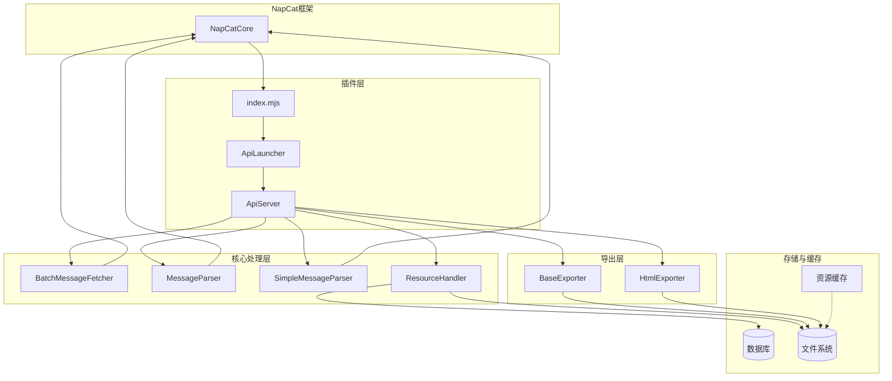
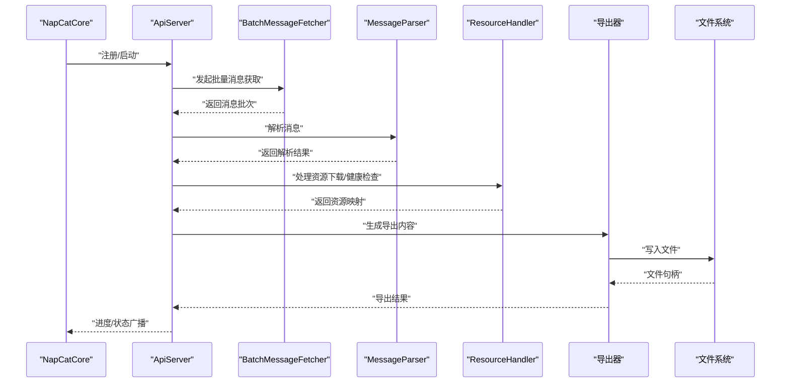
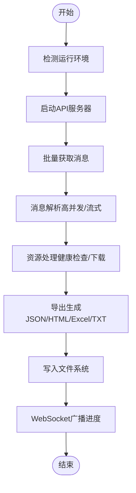
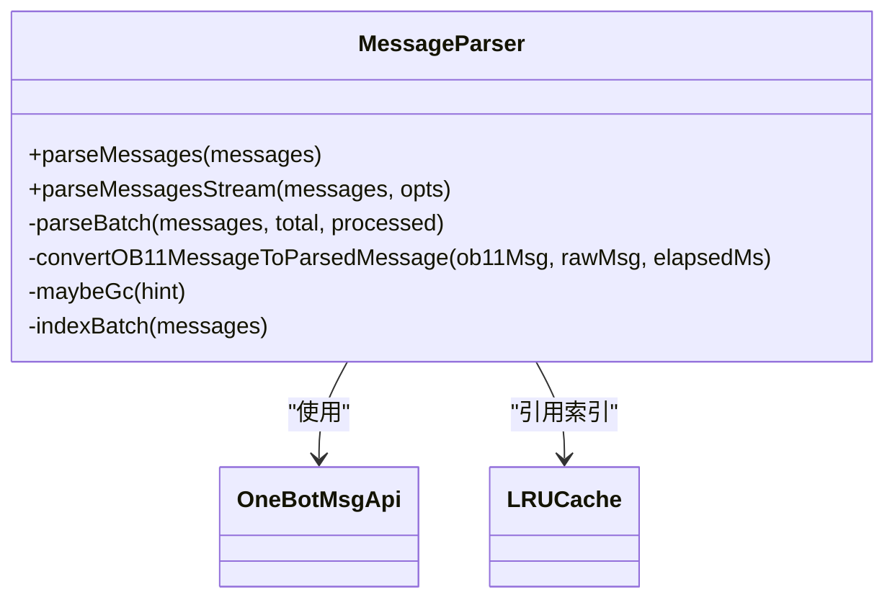
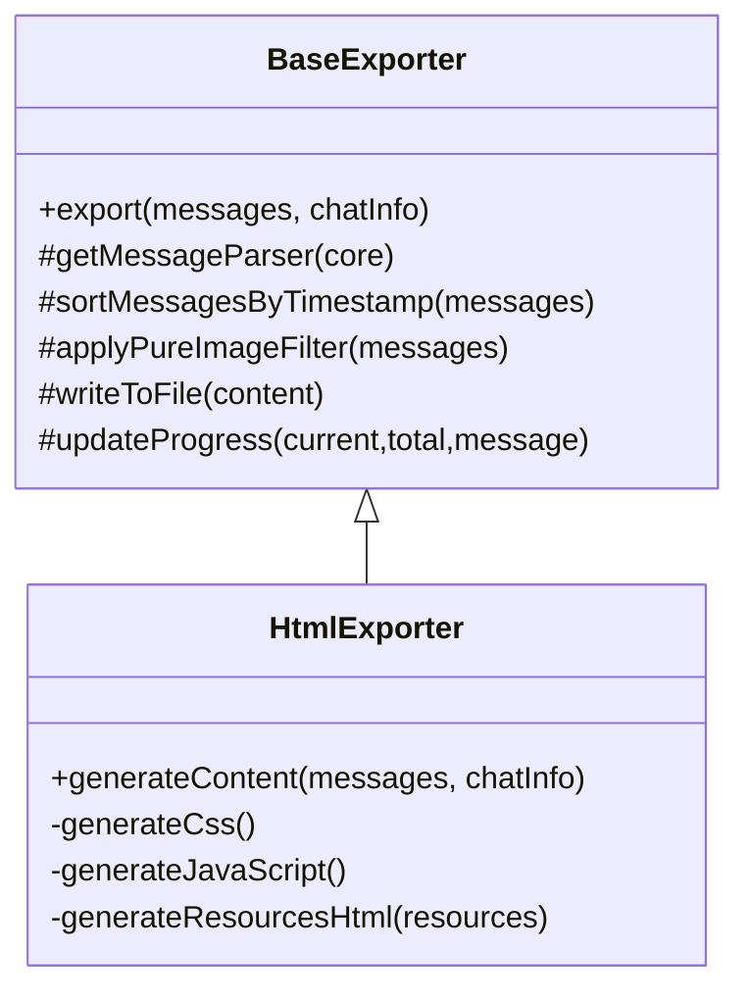
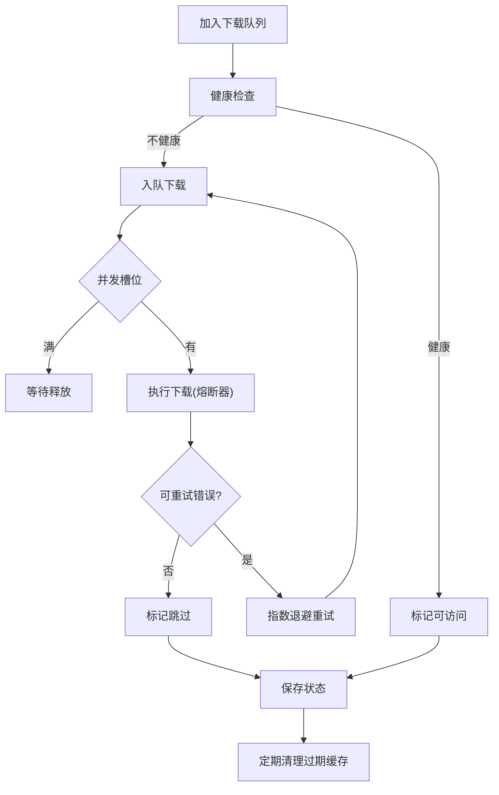
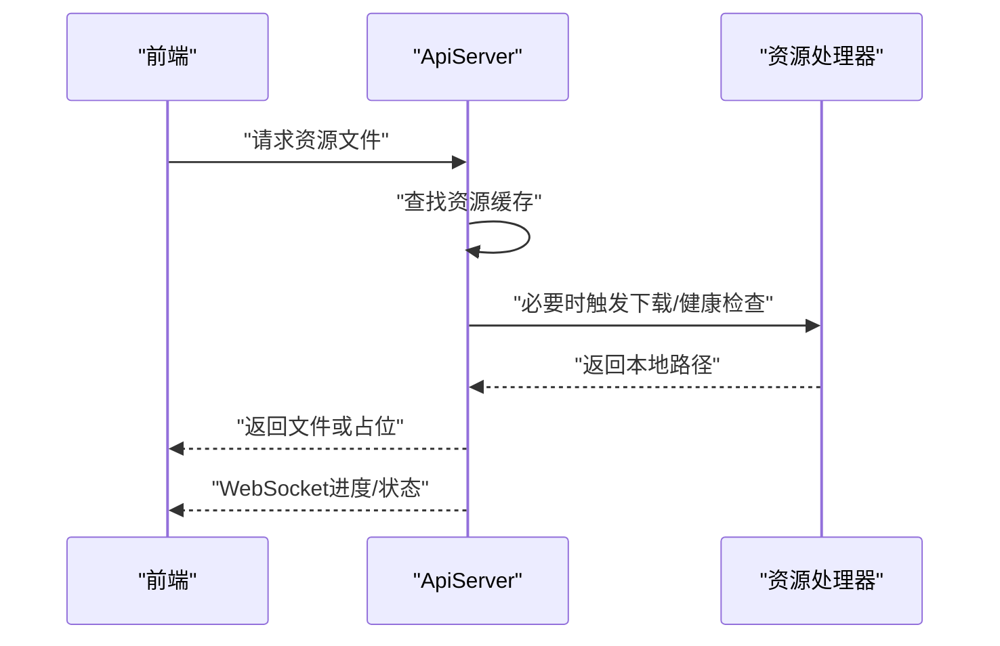
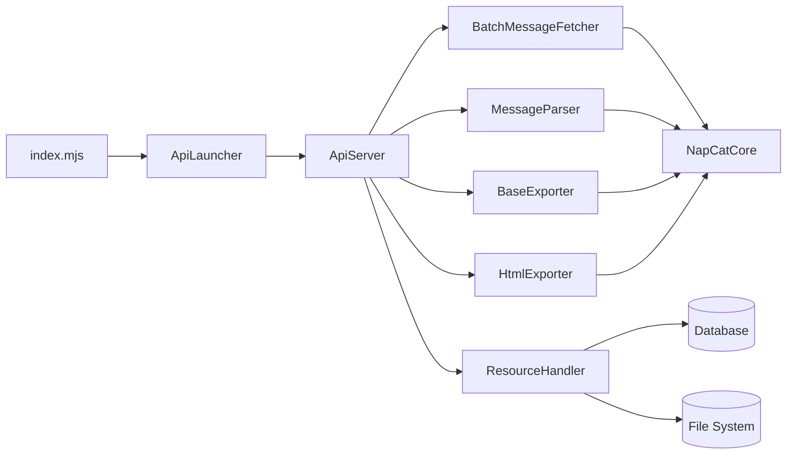

# 数据流设计

<cite>
**本文档引用的文件**
- [index.mjs](file://plugins/qq-chat-exporter/index.mjs)
- [ApiLauncher.ts](file://plugins/qq-chat-exporter/lib/api/ApiLauncher.ts)
- [ApiServer.ts](file://plugins/qq-chat-exporter/lib/api/ApiServer.ts)
- [MessageParser.ts](file://plugins/qq-chat-exporter/lib/core/parser/MessageParser.ts)
- [SimpleMessageParser.ts](file://plugins/qq-chat-exporter/lib/core/parser/SimpleMessageParser.ts)
- [BaseExporter.ts](file://plugins/qq-chat-exporter/lib/core/exporter/BaseExporter.ts)
- [HtmlExporter.ts](file://plugins/qq-chat-exporter/lib/core/exporter/HtmlExporter.ts)
- [BatchMessageFetcher.ts](file://plugins/qq-chat-exporter/lib/core/fetcher/BatchMessageFetcher.ts)
- [ResourceHandler.ts](file://plugins/qq-chat-exporter/lib/core/resource/ResourceHandler.ts)
- [index.ts](file://plugins/qq-chat-exporter/lib/types/index.ts)
</cite>

## 目录
1. [简介](#简介)
2. [项目结构](#项目结构)
3. [核心组件](#核心组件)
4. [架构总览](#架构总览)
5. [详细组件分析](#详细组件分析)
6. [依赖关系分析](#依赖关系分析)
7. [性能考量](#性能考量)
8. [故障排查指南](#故障排查指南)
9. [结论](#结论)

## 简介
本文件面向QQ聊天导出器，系统性梳理从NapCat框架接收原始消息数据，经消息解析器处理，到导出器模块转换，再到文件系统输出的完整数据流。重点说明文本消息、多媒体资源、表情包等不同类型数据的处理方式，给出数据流图与处理时序图，并解释数据验证、错误恢复与性能优化策略。

## 项目结构
- 插件入口负责检测运行环境并启动API服务器
- API服务器聚合消息获取、解析、导出、资源处理、定时任务等功能
- 核心解析器负责将原始消息转换为统一的解析模型
- 导出器将解析结果转换为多种格式（JSON/HTML/Excel/TXT）
- 资源处理器负责图片/视频/音频/文件的下载、健康检查与缓存

图表来源
- [index.mjs](file://plugins/qq-chat-exporter/index.mjs#L28-L64)
- [ApiLauncher.ts](file://plugins/qq-chat-exporter/lib/api/ApiLauncher.ts#L17-L32)
- [ApiServer.ts](file://plugins/qq-chat-exporter/lib/api/ApiServer.ts#L84-L187)
- [BatchMessageFetcher.ts](file://plugins/qq-chat-exporter/lib/core/fetcher/BatchMessageFetcher.ts#L47-L88)
- [MessageParser.ts](file://plugins/qq-chat-exporter/lib/core/parser/MessageParser.ts#L415-L446)
- [SimpleMessageParser.ts](file://plugins/qq-chat-exporter/lib/core/parser/SimpleMessageParser.ts#L1-L50)
- [ResourceHandler.ts](file://plugins/qq-chat-exporter/lib/core/resource/ResourceHandler.ts#L277-L321)
- [BaseExporter.ts](file://plugins/qq-chat-exporter/lib/core/exporter/BaseExporter.ts#L58-L88)
- [HtmlExporter.ts](file://plugins/qq-chat-exporter/lib/core/exporter/HtmlExporter.ts#L109-L132)

章节来源
- [index.mjs](file://plugins/qq-chat-exporter/index.mjs#L12-L64)
- [ApiLauncher.ts](file://plugins/qq-chat-exporter/lib/api/ApiLauncher.ts#L8-L67)
- [ApiServer.ts](file://plugins/qq-chat-exporter/lib/api/ApiServer.ts#L84-L187)

## 核心组件
- 插件入口与API启动器：检测运行环境，启动API服务器，注入桥接信息
- API服务器：统一路由、WebSocket广播、任务调度、资源文件快速查找
- 批量消息获取器：基于时间/序列号策略，带重试与超时控制
- 消息解析器：高并发解析、OneBot回退、流式分批、LRU引用索引
- 导出器：统一接口、进度回调、排序与过滤、文件写入
- 资源处理器：熔断器、健康检查、并发下载、缓存清理

章节来源
- [index.mjs](file://plugins/qq-chat-exporter/index.mjs#L28-L64)
- [ApiLauncher.ts](file://plugins/qq-chat-exporter/lib/api/ApiLauncher.ts#L17-L67)
- [ApiServer.ts](file://plugins/qq-chat-exporter/lib/api/ApiServer.ts#L84-L187)
- [BatchMessageFetcher.ts](file://plugins/qq-chat-exporter/lib/core/fetcher/BatchMessageFetcher.ts#L47-L88)
- [MessageParser.ts](file://plugins/qq-chat-exporter/lib/core/parser/MessageParser.ts#L415-L446)
- [BaseExporter.ts](file://plugins/qq-chat-exporter/lib/core/exporter/BaseExporter.ts#L58-L88)
- [ResourceHandler.ts](file://plugins/qq-chat-exporter/lib/core/resource/ResourceHandler.ts#L277-L321)

## 架构总览
系统采用“插件入口 → API服务器 → 核心处理 → 存储/文件系统”的分层架构。API服务器通过WebSocket向前端推送进度与状态，核心处理模块之间解耦，便于扩展新的导出格式与资源类型。

图表来源
- [ApiServer.ts](file://plugins/qq-chat-exporter/lib/api/ApiServer.ts#L4234-L4264)
- [BatchMessageFetcher.ts](file://plugins/qq-chat-exporter/lib/core/fetcher/BatchMessageFetcher.ts#L107-L151)
- [MessageParser.ts](file://plugins/qq-chat-exporter/lib/core/parser/MessageParser.ts#L580-L622)
- [ResourceHandler.ts](file://plugins/qq-chat-exporter/lib/core/resource/ResourceHandler.ts#L353-L403)
- [BaseExporter.ts](file://plugins/qq-chat-exporter/lib/core/exporter/BaseExporter.ts#L110-L158)

## 详细组件分析

### 数据流与处理时序
- 原始消息获取：根据筛选条件选择策略（时间/序列号/混合），带重试与超时
- 消息解析：高并发解析，支持OneBot回退；流式分批避免内存峰值
- 资源处理：健康检查、熔断器、并发下载、缓存映射
- 导出生成：统一排序/过滤，按格式写出至文件系统
- 进度与状态：WebSocket广播，前端实时更新

图表来源
- [index.mjs](file://plugins/qq-chat-exporter/index.mjs#L12-L64)
- [ApiServer.ts](file://plugins/qq-chat-exporter/lib/api/ApiServer.ts#L84-L187)
- [BatchMessageFetcher.ts](file://plugins/qq-chat-exporter/lib/core/fetcher/BatchMessageFetcher.ts#L225-L246)
- [MessageParser.ts](file://plugins/qq-chat-exporter/lib/core/parser/MessageParser.ts#L629-L670)
- [ResourceHandler.ts](file://plugins/qq-chat-exporter/lib/core/resource/ResourceHandler.ts#L353-L403)
- [BaseExporter.ts](file://plugins/qq-chat-exporter/lib/core/exporter/BaseExporter.ts#L110-L158)

章节来源
- [index.mjs](file://plugins/qq-chat-exporter/index.mjs#L28-L64)
- [ApiServer.ts](file://plugins/qq-chat-exporter/lib/api/ApiServer.ts#L84-L187)
- [BatchMessageFetcher.ts](file://plugins/qq-chat-exporter/lib/core/fetcher/BatchMessageFetcher.ts#L107-L151)
- [MessageParser.ts](file://plugins/qq-chat-exporter/lib/core/parser/MessageParser.ts#L580-L622)
- [ResourceHandler.ts](file://plugins/qq-chat-exporter/lib/core/resource/ResourceHandler.ts#L353-L403)
- [BaseExporter.ts](file://plugins/qq-chat-exporter/lib/core/exporter/BaseExporter.ts#L110-L158)

### 消息解析器（MessageParser）
- 并发控制与让步：mapLimit保证有序输出，周期性让出事件循环
- OneBot回退：优先原生解析，失败时尝试OneBot，支持超时与回退策略
- 流式解析：parseMessagesStream按批次回调，适合大体量导出
- 引用解析：LRU滑动窗口索引，跨批引用策略可配置
- 内存监控：批次间GC与软上限告警

图表来源
- [MessageParser.ts](file://plugins/qq-chat-exporter/lib/core/parser/MessageParser.ts#L415-L446)
- [MessageParser.ts](file://plugins/qq-chat-exporter/lib/core/parser/MessageParser.ts#L500-L573)
- [MessageParser.ts](file://plugins/qq-chat-exporter/lib/core/parser/MessageParser.ts#L629-L670)

章节来源
- [MessageParser.ts](file://plugins/qq-chat-exporter/lib/core/parser/MessageParser.ts#L12-L119)
- [MessageParser.ts](file://plugins/qq-chat-exporter/lib/core/parser/MessageParser.ts#L415-L446)
- [MessageParser.ts](file://plugins/qq-chat-exporter/lib/core/parser/MessageParser.ts#L500-L573)
- [MessageParser.ts](file://plugins/qq-chat-exporter/lib/core/parser/MessageParser.ts#L629-L670)

### 导出器（BaseExporter/HtmlExporter）
- 统一接口：排序、过滤、进度回调、文件写入
- HTML导出：主题、统计、搜索、懒加载、打印样式
- 资源链接：根据配置决定是否包含资源链接

图表来源
- [BaseExporter.ts](file://plugins/qq-chat-exporter/lib/core/exporter/BaseExporter.ts#L58-L88)
- [BaseExporter.ts](file://plugins/qq-chat-exporter/lib/core/exporter/BaseExporter.ts#L110-L158)
- [HtmlExporter.ts](file://plugins/qq-chat-exporter/lib/core/exporter/HtmlExporter.ts#L109-L132)
- [HtmlExporter.ts](file://plugins/qq-chat-exporter/lib/core/exporter/HtmlExporter.ts#L138-L171)

章节来源
- [BaseExporter.ts](file://plugins/qq-chat-exporter/lib/core/exporter/BaseExporter.ts#L58-L227)
- [HtmlExporter.ts](file://plugins/qq-chat-exporter/lib/core/exporter/HtmlExporter.ts#L109-L171)

### 资源处理器（ResourceHandler）
- 熔断器：区分可重试与不可重试错误，半开恢复
- 健康检查：本地文件存在性与MD5校验
- 下载队列：优先级调度、并发控制、指数退避重试
- 缓存清理：按阈值清理过期资源

图表来源
- [ResourceHandler.ts](file://plugins/qq-chat-exporter/lib/core/resource/ResourceHandler.ts#L277-L321)
- [ResourceHandler.ts](file://plugins/qq-chat-exporter/lib/core/resource/ResourceHandler.ts#L408-L434)
- [ResourceHandler.ts](file://plugins/qq-chat-exporter/lib/core/resource/ResourceHandler.ts#L717-L775)
- [ResourceHandler.ts](file://plugins/qq-chat-exporter/lib/core/resource/ResourceHandler.ts#L1125-L1149)

章节来源
- [ResourceHandler.ts](file://plugins/qq-chat-exporter/lib/core/resource/ResourceHandler.ts#L67-L193)
- [ResourceHandler.ts](file://plugins/qq-chat-exporter/lib/core/resource/ResourceHandler.ts#L277-L321)
- [ResourceHandler.ts](file://plugins/qq-chat-exporter/lib/core/resource/ResourceHandler.ts#L408-L434)
- [ResourceHandler.ts](file://plugins/qq-chat-exporter/lib/core/resource/ResourceHandler.ts#L717-L775)
- [ResourceHandler.ts](file://plugins/qq-chat-exporter/lib/core/resource/ResourceHandler.ts#L1125-L1149)

### API服务器与消息缓存
- 资源文件名缓存：短名到完整文件名映射，O(1)查找
- 消息缓存：预览与搜索用，避免重复获取
- WebSocket广播：导出进度、任务状态实时通知

图表来源
- [ApiServer.ts](file://plugins/qq-chat-exporter/lib/api/ApiServer.ts#L459-L465)
- [ResourceHandler.ts](file://plugins/qq-chat-exporter/lib/core/resource/ResourceHandler.ts#L353-L403)

章节来源
- [ApiServer.ts](file://plugins/qq-chat-exporter/lib/api/ApiServer.ts#L128-L137)
- [ApiServer.ts](file://plugins/qq-chat-exporter/lib/api/ApiServer.ts#L459-L465)

## 依赖关系分析
- 插件入口依赖ApiLauncher，后者创建并启动ApiServer
- ApiServer聚合Fetcher、Parser、Exporter、ResourceHandler等核心模块
- Parser与Exporter依赖NapCatCore提供的消息API
- ResourceHandler依赖数据库管理器与文件系统
- 类型系统统一定义导出格式、任务状态、错误类型等

图表来源
- [index.mjs](file://plugins/qq-chat-exporter/index.mjs#L28-L64)
- [ApiLauncher.ts](file://plugins/qq-chat-exporter/lib/api/ApiLauncher.ts#L17-L32)
- [ApiServer.ts](file://plugins/qq-chat-exporter/lib/api/ApiServer.ts#L84-L187)
- [BatchMessageFetcher.ts](file://plugins/qq-chat-exporter/lib/core/fetcher/BatchMessageFetcher.ts#L47-L88)
- [MessageParser.ts](file://plugins/qq-chat-exporter/lib/core/parser/MessageParser.ts#L415-L446)
- [BaseExporter.ts](file://plugins/qq-chat-exporter/lib/core/exporter/BaseExporter.ts#L58-L88)
- [HtmlExporter.ts](file://plugins/qq-chat-exporter/lib/core/exporter/HtmlExporter.ts#L109-L132)
- [ResourceHandler.ts](file://plugins/qq-chat-exporter/lib/core/resource/ResourceHandler.ts#L277-L321)

章节来源
- [index.ts](file://plugins/qq-chat-exporter/lib/types/index.ts#L28-L52)
- [index.ts](file://plugins/qq-chat-exporter/lib/types/index.ts#L431-L453)

## 性能考量
- 并发与让步：解析器使用mapLimit与周期性yield，避免长时间占用事件循环
- 流式处理：parseMessagesStream与导出器的批次回调，降低内存峰值
- 熔断与重试：资源下载采用智能熔断与指数退避，提升稳定性
- 缓存与预热：资源文件名缓存与消息缓存减少重复IO与网络请求
- 内存监控：批次间GC与软上限告警，避免内存泄漏

章节来源
- [MessageParser.ts](file://plugins/qq-chat-exporter/lib/core/parser/MessageParser.ts#L12-L119)
- [MessageParser.ts](file://plugins/qq-chat-exporter/lib/core/parser/MessageParser.ts#L629-L670)
- [ResourceHandler.ts](file://plugins/qq-chat-exporter/lib/core/resource/ResourceHandler.ts#L67-L193)
- [BaseExporter.ts](file://plugins/qq-chat-exporter/lib/core/exporter/BaseExporter.ts#L379-L393)

## 故障排查指南
- API启动失败：检查ApiLauncher状态与日志，确认端口占用与依赖安装
- 导出超时/失败：查看BaseExporter的wrapError封装，定位具体操作与上下文
- 资源下载异常：检查熔断器状态、重试次数、不可重试错误类型
- 进度不更新：确认WebSocket连接与广播逻辑，核对任务状态与进度计算

章节来源
- [ApiLauncher.ts](file://plugins/qq-chat-exporter/lib/api/ApiLauncher.ts#L26-L31)
- [BaseExporter.ts](file://plugins/qq-chat-exporter/lib/core/exporter/BaseExporter.ts#L306-L314)
- [ResourceHandler.ts](file://plugins/qq-chat-exporter/lib/core/resource/ResourceHandler.ts#L85-L104)
- [ApiServer.ts](file://plugins/qq-chat-exporter/lib/api/ApiServer.ts#L4234-L4264)

## 结论
本系统通过清晰的分层与模块化设计，实现了从原始消息到多格式导出的高效数据流。解析器与导出器的流式与并发策略，配合资源处理器的熔断与缓存机制，在保证性能的同时提升了稳定性与用户体验。建议在大规模导出场景中优先使用流式解析与导出，并结合资源缓存与健康检查策略，以获得最佳效果。