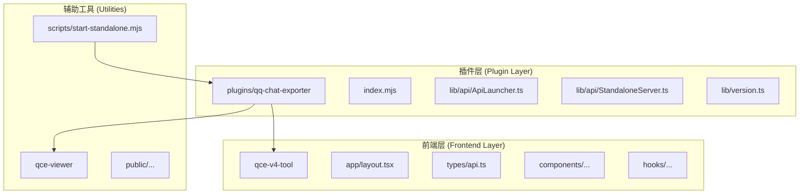
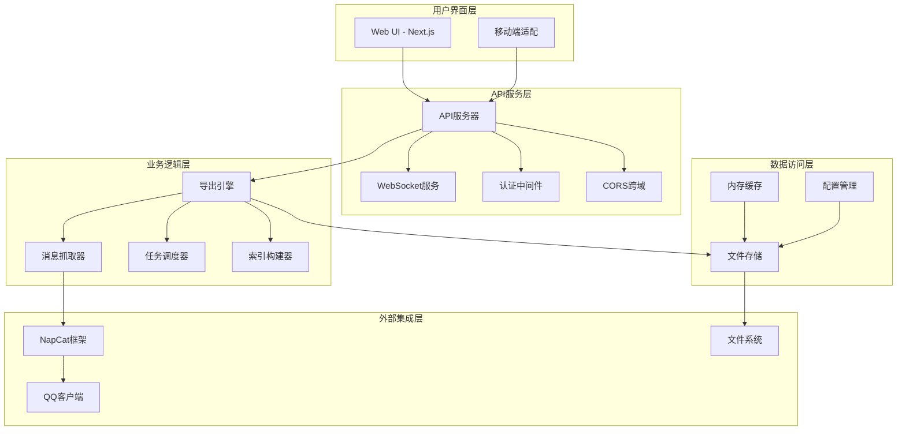
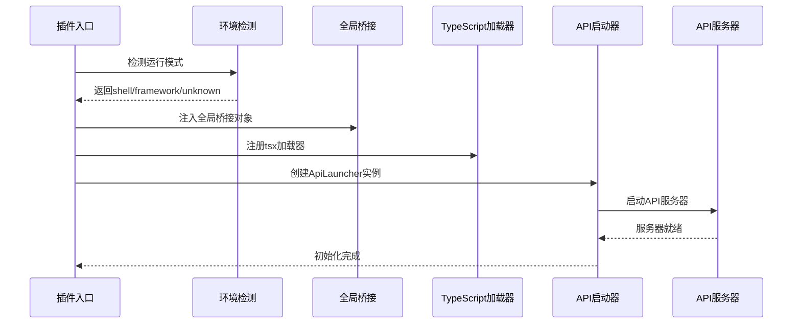
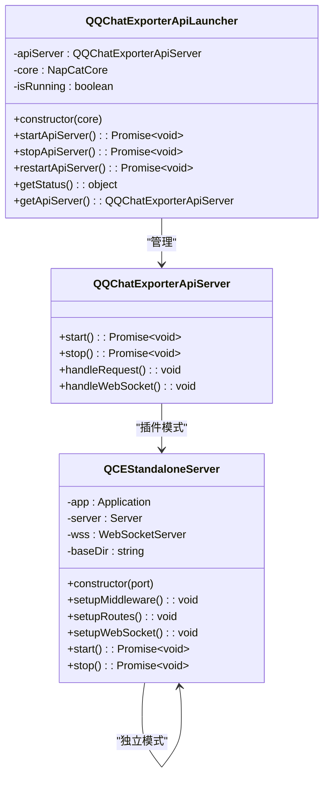
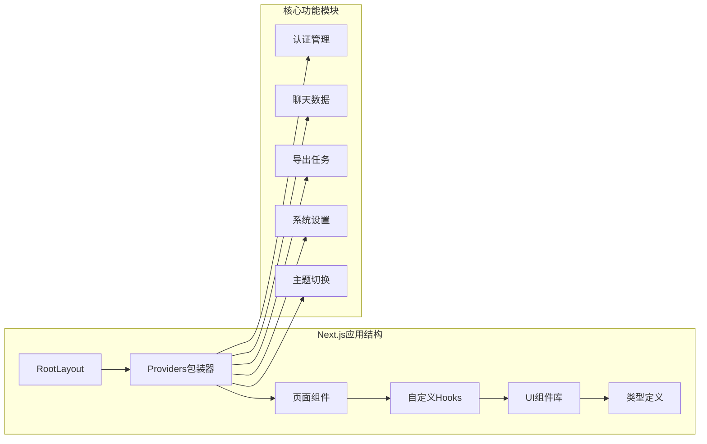
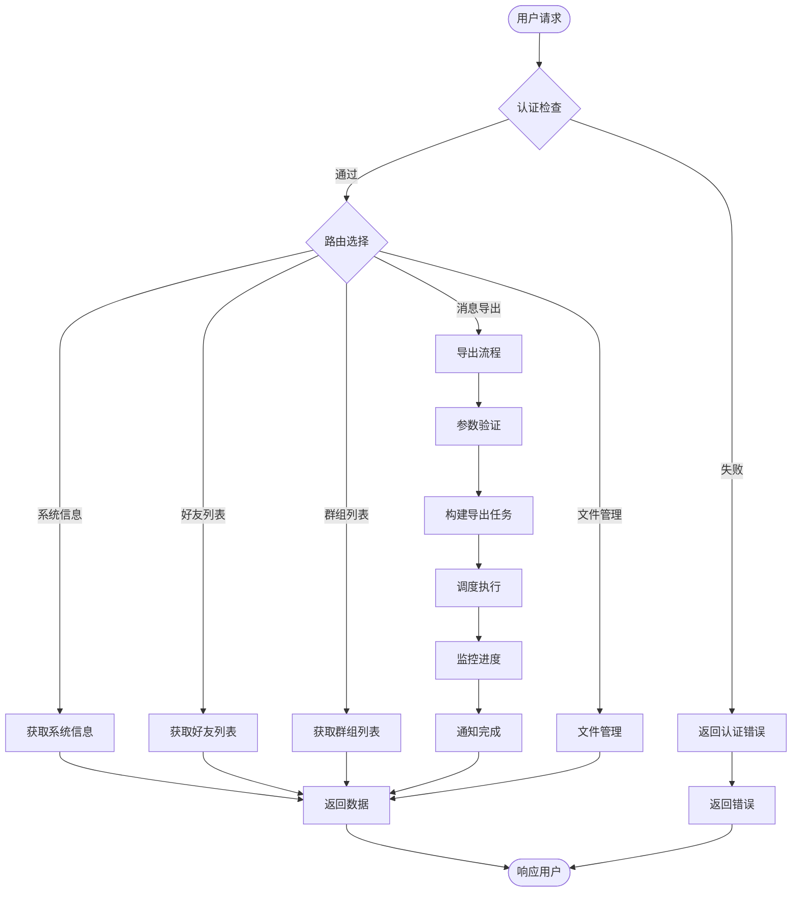
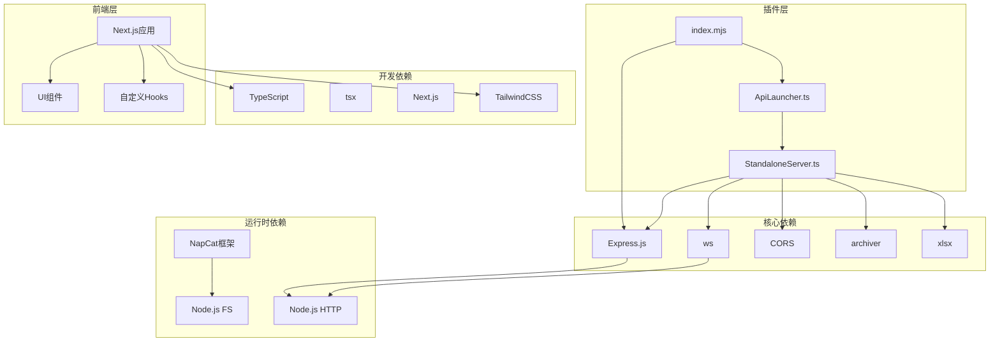
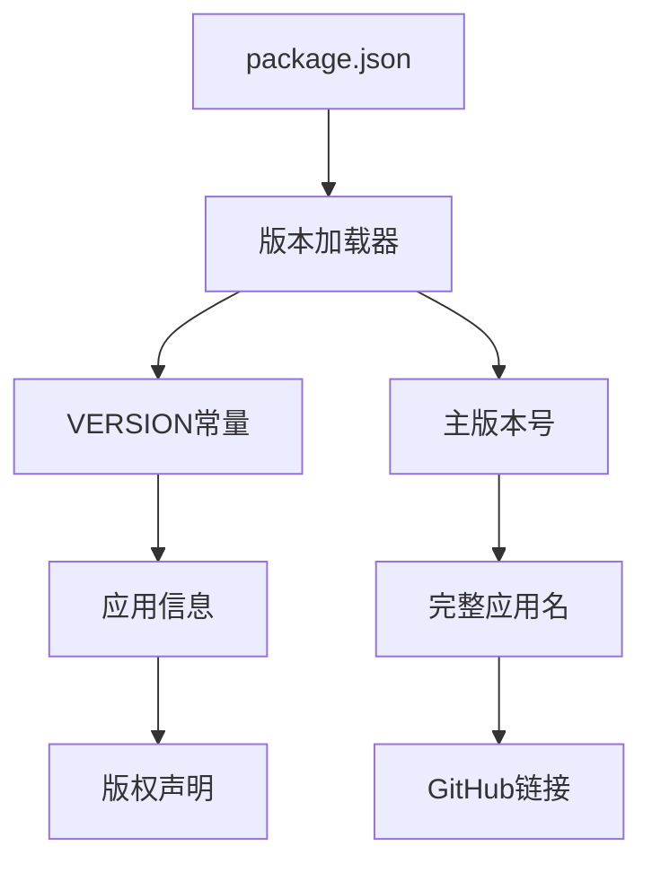

# 整体架构设计

<cite>
**本文档引用的文件**
- [plugins/qq-chat-exporter/package.json](file://plugins/qq-chat-exporter/package.json)
- [plugins/qq-chat-exporter/index.mjs](file://plugins/qq-chat-exporter/index.mjs)
- [plugins/qq-chat-exporter/lib/api/ApiLauncher.ts](file://plugins/qq-chat-exporter/lib/api/ApiLauncher.ts)
- [plugins/qq-chat-exporter/lib/api/StandaloneServer.ts](file://plugins/qq-chat-exporter/lib/api/StandaloneServer.ts)
- [plugins/qq-chat-exporter/lib/version.ts](file://plugins/qq-chat-exporter/lib/version.ts)
- [plugins/qq-chat-exporter/test-plugin.mjs](file://plugins/qq-chat-exporter/test-plugin.mjs)
- [plugins/qq-chat-exporter/test-plugin-full.mjs](file://plugins/qq-chat-exporter/test-plugin-full.mjs)
- [qce-v4-tool/package.json](file://qce-v4-tool/package.json)
- [qce-v4-tool/app/layout.tsx](file://qce-v4-tool/app/layout.tsx)
- [qce-v4-tool/types/api.ts](file://qce-v4-tool/types/api.ts)
- [qce-viewer/package.json](file://qce-viewer/package.json)
- [scripts/start-standalone.mjs](file://scripts/start-standalone.mjs)
</cite>

## 目录
1. [简介](#简介)
2. [项目结构](#项目结构)
3. [核心组件](#核心组件)
4. [架构总览](#架构总览)
5. [详细组件分析](#详细组件分析)
6. [依赖关系分析](#依赖关系分析)
7. [性能考虑](#性能考虑)
8. [故障排除指南](#故障排除指南)
9. [结论](#结论)
10. [附录](#附录)

## 简介
本项目是一个基于 NapCat 框架的 QQ 聊天导出工具，采用三层架构设计：
- NapCat 插件层：负责与 QQ 客户端通信、消息抓取、导出任务调度
- API 服务层：提供统一的 RESTful API 和 WebSocket 接口，支撑前后端交互
- 前端界面层：Next.js 应用，提供现代化的用户交互体验

系统支持两种运行模式：插件模式（与 NapCat 集成）和独立模式（无需登录即可浏览已导出内容）。通过模块化设计实现了高度的可扩展性和维护性。

## 项目结构
项目采用多模块组织方式，主要包含以下核心模块：

**图表来源**
- [plugins/qq-chat-exporter/package.json](file://plugins/qq-chat-exporter/package.json#L1-L42)
- [qce-v4-tool/package.json](file://qce-v4-tool/package.json#L1-L74)
- [qce-viewer/package.json](file://qce-viewer/package.json#L1-L22)

**章节来源**
- [plugins/qq-chat-exporter/package.json](file://plugins/qq-chat-exporter/package.json#L1-L42)
- [qce-v4-tool/package.json](file://qce-v4-tool/package.json#L1-L74)
- [qce-viewer/package.json](file://qce-viewer/package.json#L1-L22)

## 核心组件
系统的核心组件包括插件入口、API 启动器、独立服务器和前端应用，每个组件都有明确的职责分工：

### 插件入口组件
负责插件初始化、运行模式检测和 API 服务器启动，支持 NapCat Shell 和 Framework 两种运行模式。

### API 启动器组件
封装 API 服务器的生命周期管理，提供启动、停止和重启功能，统一错误处理机制。

### 独立服务器组件
提供独立运行模式下的完整 Web 服务，支持导出文件管理、资源浏览和静态文件服务。

### 前端应用组件
基于 Next.js 的现代化界面，提供用户友好的交互体验和完整的功能覆盖。

**章节来源**
- [plugins/qq-chat-exporter/index.mjs](file://plugins/qq-chat-exporter/index.mjs#L28-L76)
- [plugins/qq-chat-exporter/lib/api/ApiLauncher.ts](file://plugins/qq-chat-exporter/lib/api/ApiLauncher.ts#L8-L67)
- [plugins/qq-chat-exporter/lib/api/StandaloneServer.ts](file://plugins/qq-chat-exporter/lib/api/StandaloneServer.ts#L38-L67)

## 架构总览
系统采用分层架构设计，通过清晰的职责划分和接口定义实现松耦合的组件交互：

**图表来源**
- [plugins/qq-chat-exporter/lib/api/ApiLauncher.ts](file://plugins/qq-chat-exporter/lib/api/ApiLauncher.ts#L17-L32)
- [plugins/qq-chat-exporter/lib/api/StandaloneServer.ts](file://plugins/qq-chat-exporter/lib/api/StandaloneServer.ts#L110-L134)

## 详细组件分析

### 插件初始化流程
插件初始化流程是系统启动的关键环节，涉及运行模式检测、环境准备和服务器启动：

**图表来源**
- [plugins/qq-chat-exporter/index.mjs](file://plugins/qq-chat-exporter/index.mjs#L12-L64)

#### 运行模式检测机制
系统支持三种运行模式的智能检测：

| 模式 | 检测条件 | 特征 |
|------|----------|------|
| Framework | `core.context.workingEnv === 2` | Electron 环境，QQNT 插件 |
| Shell | `core.context.workingEnv === 1` 或 `process.env.NAPCAT_SHELL` | 无头模式，独立运行 |
| Unknown | 其他情况 | 环境检测失败 |

**章节来源**
- [plugins/qq-chat-exporter/index.mjs](file://plugins/qq-chat-exporter/index.mjs#L12-L26)

### API服务器启动机制
API 服务器采用启动器模式管理生命周期，提供统一的启动、停止和状态查询接口：

**图表来源**
- [plugins/qq-chat-exporter/lib/api/ApiLauncher.ts](file://plugins/qq-chat-exporter/lib/api/ApiLauncher.ts#L8-L67)
- [plugins/qq-chat-exporter/lib/api/StandaloneServer.ts](file://plugins/qq-chat-exporter/lib/api/StandaloneServer.ts#L38-L67)

### 前端应用架构
前端采用 Next.js 框架构建，提供现代化的用户界面和良好的开发体验：

**图表来源**
- [qce-v4-tool/app/layout.tsx](file://qce-v4-tool/app/layout.tsx#L15-L68)
- [qce-v4-tool/types/api.ts](file://qce-v4-tool/types/api.ts#L1-L509)

**章节来源**
- [qce-v4-tool/app/layout.tsx](file://qce-v4-tool/app/layout.tsx#L15-L68)
- [qce-v4-tool/types/api.ts](file://qce-v4-tool/types/api.ts#L1-L509)

### 数据流向和控制流程
系统内部的数据流和控制流程体现了清晰的分层设计：

**图表来源**
- [plugins/qq-chat-exporter/lib/api/StandaloneServer.ts](file://plugins/qq-chat-exporter/lib/api/StandaloneServer.ts#L139-L443)

## 依赖关系分析
系统采用模块化设计，各组件间的依赖关系清晰明确：

**图表来源**
- [plugins/qq-chat-exporter/package.json](file://plugins/qq-chat-exporter/package.json#L22-L30)
- [qce-v4-tool/package.json](file://qce-v4-tool/package.json#L12-L73)

**章节来源**
- [plugins/qq-chat-exporter/package.json](file://plugins/qq-chat-exporter/package.json#L22-L30)
- [qce-v4-tool/package.json](file://qce-v4-tool/package.json#L12-L73)

## 性能考虑
系统在设计时充分考虑了性能优化和可扩展性：

### 缓存策略
- 资源文件缓存：使用 Map 结构缓存资源文件映射关系
- 内存缓存：对频繁访问的数据进行内存缓存
- 文件系统缓存：合理利用操作系统文件系统缓存

### 并发处理
- 异步I/O：所有文件操作采用异步模式
- 并发限制：对大量文件操作设置合理的并发限制
- 连接池：WebSocket连接采用连接池管理

### 内存管理
- 流式处理：支持超大文件的流式处理
- 对象复用：重用对象减少GC压力
- 内存监控：定期监控内存使用情况

## 故障排除指南
系统提供了完善的错误处理和诊断机制：

### 常见问题及解决方案

| 问题类型 | 症状 | 解决方案 |
|----------|------|----------|
| 插件加载失败 | 控制台显示加载错误 | 检查Node.js版本和依赖安装 |
| API服务器启动失败 | 端口占用或权限不足 | 更换端口或以管理员权限运行 |
| WebSocket连接失败 | 前端无法连接 | 检查CORS配置和防火墙设置 |
| 导出任务超时 | 大文件导出耗时过长 | 启用流式ZIP模式或增加超时时间 |
| 资源文件缺失 | HTML预览中图片无法显示 | 检查资源文件路径和权限 |

### 调试工具
- 控制台日志：详细的运行时日志输出
- 错误追踪：完整的错误堆栈信息
- 性能监控：内置的性能指标收集
- 状态检查：健康检查端点和状态查询

**章节来源**
- [plugins/qq-chat-exporter/index.mjs](file://plugins/qq-chat-exporter/index.mjs#L60-L63)
- [plugins/qq-chat-exporter/lib/api/ApiLauncher.ts](file://plugins/qq-chat-exporter/lib/api/ApiLauncher.ts#L26-L31)

## 结论
QQ聊天导出器采用清晰的三层架构设计，通过模块化和分层的方式实现了高度的可维护性和扩展性。系统支持多种运行模式，既可以在 NapCat 框架中作为插件运行，也可以独立运行浏览已导出内容。前端采用现代化的 Next.js 技术栈，提供了优秀的用户体验。整体架构设计充分考虑了性能优化、错误处理和可扩展性，为后续的功能扩展和技术演进奠定了坚实的基础。

## 附录

### 版本信息管理
系统采用统一的版本管理机制，确保各组件版本的一致性：

**图表来源**
- [plugins/qq-chat-exporter/lib/version.ts](file://plugins/qq-chat-exporter/lib/version.ts#L9-L26)

### 测试策略
系统提供了完整的测试覆盖，包括单元测试、集成测试和端到端测试：

- 插件加载测试：验证插件入口和依赖加载
- TypeScript编译测试：确保TypeScript代码正确编译
- API功能测试：验证核心API接口的正确性
- 端到端测试：模拟完整的用户使用流程

**章节来源**
- [plugins/qq-chat-exporter/test-plugin.mjs](file://plugins/qq-chat-exporter/test-plugin.mjs#L60-L130)
- [plugins/qq-chat-exporter/test-plugin-full.mjs](file://plugins/qq-chat-exporter/test-plugin-full.mjs#L83-L141)