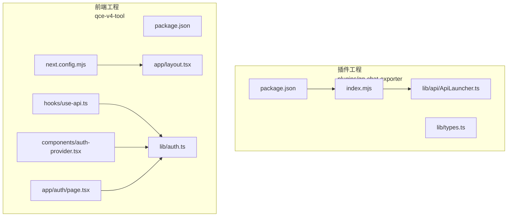
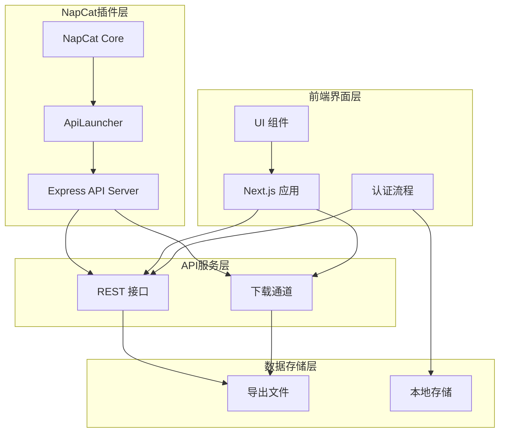
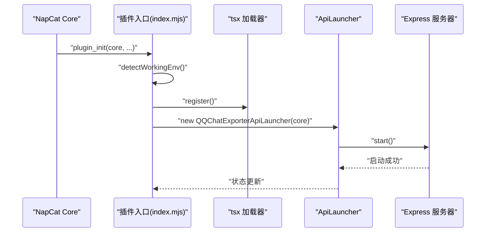
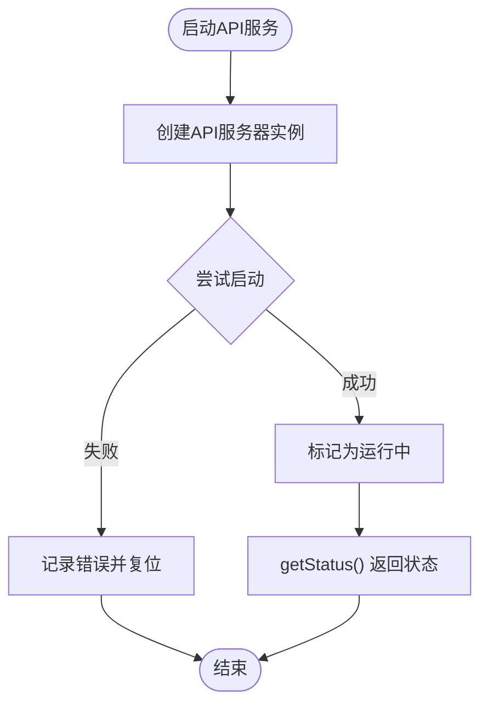
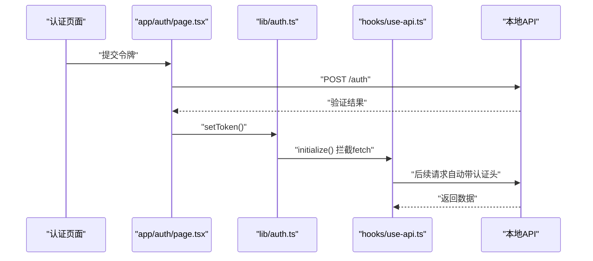
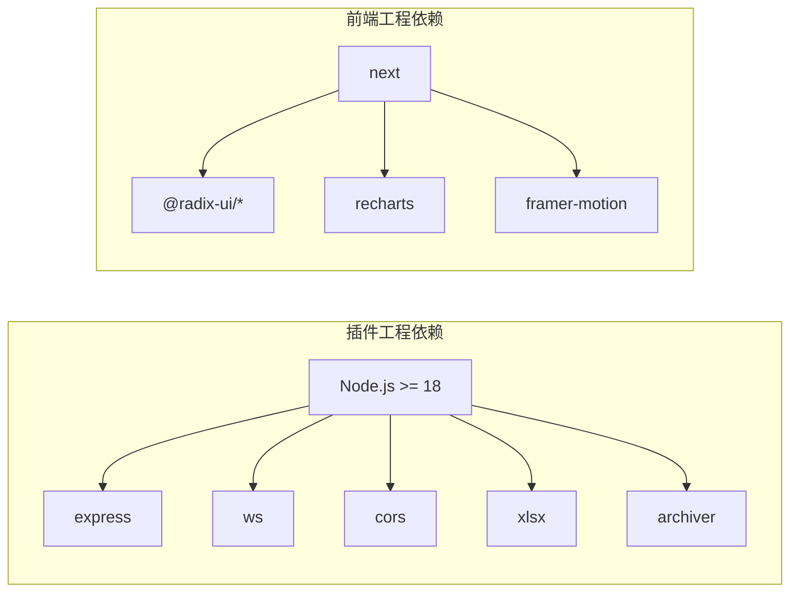

# 架构设计

<cite>
**本文引用的文件**
- [plugins/qq-chat-exporter/package.json](file://plugins/qq-chat-exporter/package.json)
- [plugins/qq-chat-exporter/index.mjs](file://plugins/qq-chat-exporter/index.mjs)
- [plugins/qq-chat-exporter/lib/types.ts](file://plugins/qq-chat-exporter/lib/types.ts)
- [plugins/qq-chat-exporter/lib/api/ApiLauncher.ts](file://plugins/qq-chat-exporter/lib/api/ApiLauncher.ts)
- [qce-v4-tool/package.json](file://qce-v4-tool/package.json)
- [qce-v4-tool/next.config.mjs](file://qce-v4-tool/next.config.mjs)
- [qce-v4-tool/app/layout.tsx](file://qce-v4-tool/app/layout.tsx)
- [qce-v4-tool/hooks/use-api.ts](file://qce-v4-tool/hooks/use-api.ts)
- [qce-v4-tool/components/auth-provider.tsx](file://qce-v4-tool/components/auth-provider.tsx)
- [qce-v4-tool/lib/auth.ts](file://qce-v4-tool/lib/auth.ts)
- [qce-v4-tool/app/auth/page.tsx](file://qce-v4-tool/app/auth/page.tsx)
</cite>

## 目录
1. [引言](#引言)
2. [项目结构](#项目结构)
3. [核心组件](#核心组件)
4. [架构总览](#架构总览)
5. [详细组件分析](#详细组件分析)
6. [依赖分析](#依赖分析)
7. [性能考虑](#性能考虑)
8. [故障排查指南](#故障排查指南)
9. [结论](#结论)
10. [附录](#附录)

## 引言
本架构设计文档面向“QQ聊天导出器”项目，系统化阐述其分层架构与组件交互关系。该系统由四层构成：NapCat插件层、API服务层、前端界面层、数据存储层。NapCat插件层负责与QQ客户端通信并提供导出能力；API服务层提供REST接口与下载通道；前端界面层基于Next.js构建，提供认证、任务管理与历史查看；数据存储层则由导出生成的文件与本地缓存组成。本文还解释技术栈选型（Node.js+Express、Next.js、WebSocket等）、系统边界、数据流与集成模式，并给出可扩展性、性能优化与安全设计建议。

## 项目结构
项目采用多包/多模块组织方式：
- 插件工程：位于 plugins/qq-chat-exporter，作为 NapCat 的运行时插件，提供API服务与导出能力。
- 前端工程：位于 qce-v4-tool，基于 Next.js 构建静态可部署的Web界面。
- 公共资源：public 下的静态资源与 qce-viewer 提供的聊天查看器（非本文重点）。

**图表来源**
- [plugins/qq-chat-exporter/package.json](file://plugins/qq-chat-exporter/package.json#L1-L42)
- [plugins/qq-chat-exporter/index.mjs](file://plugins/qq-chat-exporter/index.mjs#L1-L77)
- [plugins/qq-chat-exporter/lib/types.ts](file://plugins/qq-chat-exporter/lib/types.ts#L1-L8)
- [plugins/qq-chat-exporter/lib/api/ApiLauncher.ts](file://plugins/qq-chat-exporter/lib/api/ApiLauncher.ts#L1-L68)
- [qce-v4-tool/package.json](file://qce-v4-tool/package.json#L1-L74)
- [qce-v4-tool/next.config.mjs](file://qce-v4-tool/next.config.mjs#L1-L41)
- [qce-v4-tool/app/layout.tsx](file://qce-v4-tool/app/layout.tsx#L1-L69)
- [qce-v4-tool/hooks/use-api.ts](file://qce-v4-tool/hooks/use-api.ts#L1-L70)
- [qce-v4-tool/components/auth-provider.tsx](file://qce-v4-tool/components/auth-provider.tsx#L1-L90)
- [qce-v4-tool/lib/auth.ts](file://qce-v4-tool/lib/auth.ts#L1-L123)
- [qce-v4-tool/app/auth/page.tsx](file://qce-v4-tool/app/auth/page.tsx#L1-L238)

**章节来源**
- [plugins/qq-chat-exporter/package.json](file://plugins/qq-chat-exporter/package.json#L1-L42)
- [qce-v4-tool/package.json](file://qce-v4-tool/package.json#L1-L74)

## 核心组件
- NapCat插件入口与运行模式检测：插件入口负责检测运行环境（Framework/Shell），注入桥接对象，并动态注册TypeScript加载器，随后启动API服务。
- API启动器：封装API服务生命周期，统一启动、停止与重启逻辑，并暴露状态查询。
- 前端认证与API调用：前端通过自定义Hook与认证库完成令牌校验、请求拦截与下载流程。
- Next.js布局与静态配置：Next应用提供全局样式、主题与分析埋点，同时通过配置注入版本信息与静态资源前缀。

**章节来源**
- [plugins/qq-chat-exporter/index.mjs](file://plugins/qq-chat-exporter/index.mjs#L12-L64)
- [plugins/qq-chat-exporter/lib/api/ApiLauncher.ts](file://plugins/qq-chat-exporter/lib/api/ApiLauncher.ts#L17-L66)
- [qce-v4-tool/hooks/use-api.ts](file://qce-v4-tool/hooks/use-api.ts#L7-L47)
- [qce-v4-tool/lib/auth.ts](file://qce-v4-tool/lib/auth.ts#L28-L45)
- [qce-v4-tool/next.config.mjs](file://qce-v4-tool/next.config.mjs#L17-L38)

## 架构总览
系统采用“插件+Web界面”的双端架构。NapCat插件在QQ客户端侧提供导出能力并通过本地API服务对外暴露接口；前端Next.js应用通过HTTP与本地API交互，实现认证、任务管理与结果下载。

**图表来源**
- [plugins/qq-chat-exporter/lib/api/ApiLauncher.ts](file://plugins/qq-chat-exporter/lib/api/ApiLauncher.ts#L17-L32)
- [qce-v4-tool/hooks/use-api.ts](file://qce-v4-tool/hooks/use-api.ts#L24-L47)
- [qce-v4-tool/lib/auth.ts](file://qce-v4-tool/lib/auth.ts#L84-L120)

## 详细组件分析

### NapCat插件层
- 运行模式检测：优先从上下文读取工作环境标识，回退至进程环境变量与Electron存在性判断，支持Framework（QQNT插件）与Shell（独立无头）两种模式。
- 动态加载与启动：通过tsx注册TypeScript加载器，动态导入API启动器并实例化，随后启动API服务。
- 生命周期管理：提供启动、停止与重启方法，以及状态查询（运行中、端口、运行时长）。

**图表来源**
- [plugins/qq-chat-exporter/index.mjs](file://plugins/qq-chat-exporter/index.mjs#L28-L58)
- [plugins/qq-chat-exporter/lib/api/ApiLauncher.ts](file://plugins/qq-chat-exporter/lib/api/ApiLauncher.ts#L17-L32)

**章节来源**
- [plugins/qq-chat-exporter/index.mjs](file://plugins/qq-chat-exporter/index.mjs#L12-L64)
- [plugins/qq-chat-exporter/lib/api/ApiLauncher.ts](file://plugins/qq-chat-exporter/lib/api/ApiLauncher.ts#L1-L68)

### API服务层
- 启动与停止：封装API服务的启动与关闭，异常时记录日志并保持状态一致。
- 状态查询：返回运行状态、监听端口与运行时长，便于前端与监控使用。
- 集成点：与前端通过HTTP协议交互，提供REST接口与下载通道。

**图表来源**
- [plugins/qq-chat-exporter/lib/api/ApiLauncher.ts](file://plugins/qq-chat-exporter/lib/api/ApiLauncher.ts#L17-L66)

**章节来源**
- [plugins/qq-chat-exporter/lib/api/ApiLauncher.ts](file://plugins/qq-chat-exporter/lib/api/ApiLauncher.ts#L17-L66)

### 前端界面层
- 认证流程：页面组件负责令牌输入与提交，认证库负责本地存储、URL参数解析与fetch拦截；认证提供者在客户端挂载后进行令牌有效性校验。
- API调用：自定义Hook封装统一的请求方法与下载方法，自动附加认证头，处理401/403重定向。
- 布局与主题：根布局注入主题初始化脚本与分析埋点，Next配置注入版本信息与静态资源前缀。

**图表来源**
- [qce-v4-tool/app/auth/page.tsx](file://qce-v4-tool/app/auth/page.tsx#L25-L56)
- [qce-v4-tool/lib/auth.ts](file://qce-v4-tool/lib/auth.ts#L28-L45)
- [qce-v4-tool/hooks/use-api.ts](file://qce-v4-tool/hooks/use-api.ts#L7-L47)

**章节来源**
- [qce-v4-tool/app/auth/page.tsx](file://qce-v4-tool/app/auth/page.tsx#L1-L238)
- [qce-v4-tool/lib/auth.ts](file://qce-v4-tool/lib/auth.ts#L1-L123)
- [qce-v4-tool/hooks/use-api.ts](file://qce-v4-tool/hooks/use-api.ts#L1-L70)
- [qce-v4-tool/app/layout.tsx](file://qce-v4-tool/app/layout.tsx#L1-L69)

### 数据存储层
- 导出文件：由API服务生成并提供下载，前端通过下载接口保存到本地。
- 本地存储：前端使用localStorage持久化访问令牌，保障用户体验与二次访问的便捷性。

**章节来源**
- [qce-v4-tool/hooks/use-api.ts](file://qce-v4-tool/hooks/use-api.ts#L49-L64)
- [qce-v4-tool/lib/auth.ts](file://qce-v4-tool/lib/auth.ts#L50-L72)

## 依赖分析
- 技术栈与版本：插件工程使用Node.js与Express、WS、CORS、XLSX、Archiver等依赖；前端工程使用Next.js、Radix UI、Recharts、Framer Motion等生态组件。
- 版本同步：前端通过Next配置从插件工程的package.json读取版本，保证前后端版本一致性。
- 运行模式：插件入口根据环境变量与Electron存在性判断运行模式，确保在不同宿主环境中正确初始化。

**图表来源**
- [plugins/qq-chat-exporter/package.json](file://plugins/qq-chat-exporter/package.json#L22-L30)
- [qce-v4-tool/package.json](file://qce-v4-tool/package.json#L12-L73)

**章节来源**
- [plugins/qq-chat-exporter/package.json](file://plugins/qq-chat-exporter/package.json#L1-L42)
- [qce-v4-tool/package.json](file://qce-v4-tool/package.json#L1-L74)
- [qce-v4-tool/next.config.mjs](file://qce-v4-tool/next.config.mjs#L6-L15)

## 性能考虑
- 本地服务：API服务运行在本地回环地址，减少网络延迟与外部依赖。
- 资源前缀与静态导出：前端配置静态导出与资源前缀，降低CDN与路径复杂度，提升首屏加载稳定性。
- 请求拦截：前端对fetch进行统一拦截，减少重复头部构造与错误处理分支。
- 导出格式：支持多种格式导出，结合压缩与分块策略可进一步优化大体量数据的传输与存储。

[本节为通用指导，无需具体文件分析]

## 故障排查指南
- 认证失败：若返回401/403，前端会清除本地令牌并重定向至认证页；检查令牌来源与有效期。
- 无法连接：确认NapCat已启动且API服务处于运行中；检查本地端口占用与防火墙设置。
- 令牌位置：令牌在NapCat控制台输出中可见，首次启动时生成，需手动复制粘贴。
- 开发与生产差异：开发模式下可直接访问本地API，生产模式需确保静态资源前缀与基础路径正确。

**章节来源**
- [qce-v4-tool/hooks/use-api.ts](file://qce-v4-tool/hooks/use-api.ts#L32-L38)
- [qce-v4-tool/app/auth/page.tsx](file://qce-v4-tool/app/auth/page.tsx#L204-L219)

## 结论
本架构以NapCat插件为核心，结合本地Express API与Next.js前端，形成轻量、可移植且易于扩展的系统。通过明确的分层职责、清晰的组件交互与严格的认证与安全策略，系统在保证易用性的同时兼顾了安全性与可维护性。未来可在导出引擎、并发处理与缓存策略等方面持续优化，以应对更大规模的数据导出场景。

[本节为总结性内容，无需具体文件分析]

## 附录
- 系统边界：插件层与前端通过本地HTTP通信；数据存储为导出文件与本地令牌。
- 集成模式：前端静态部署，后端API服务按需启动；认证采用本地令牌机制。
- 安全设计：令牌仅在本地存储与请求头传递，避免泄露；401/403自动重定向清理令牌。

[本节为概念性内容，无需具体文件分析]