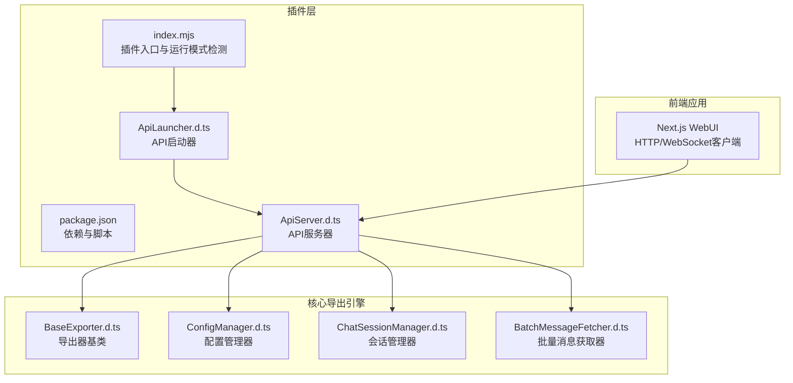
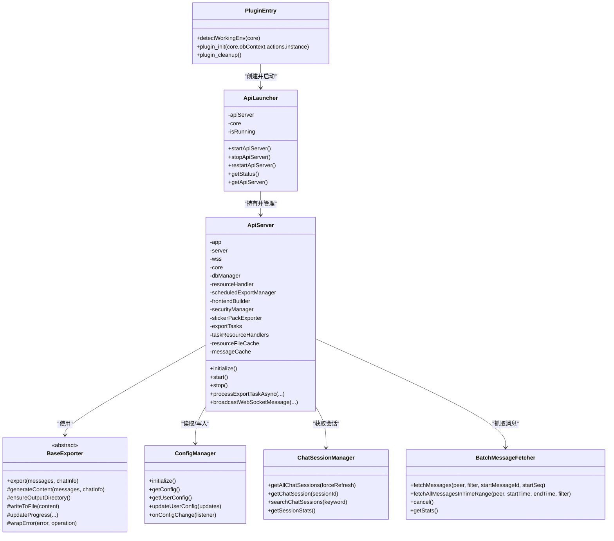
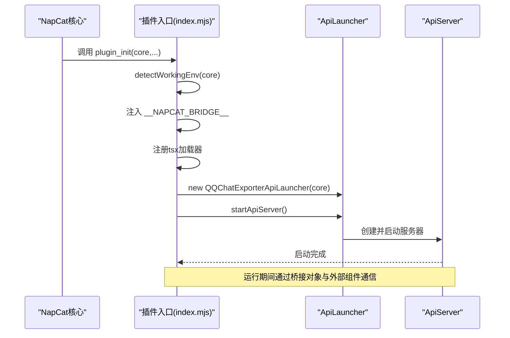
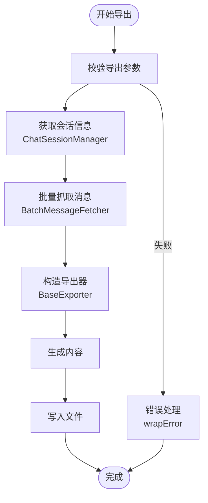
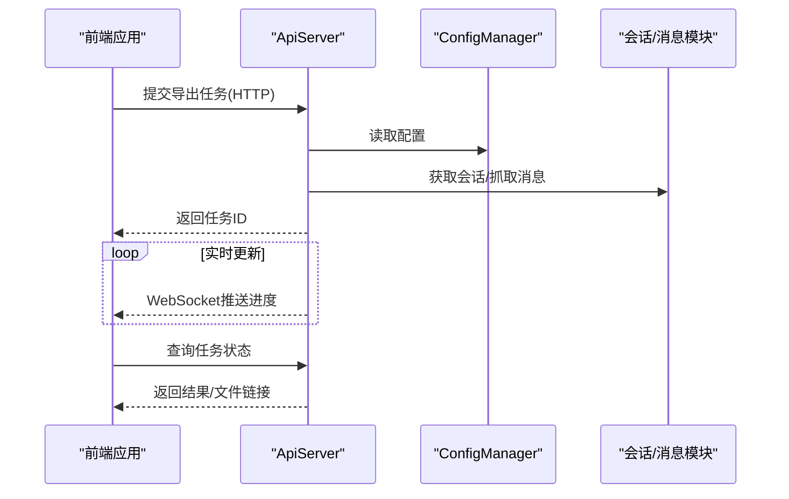
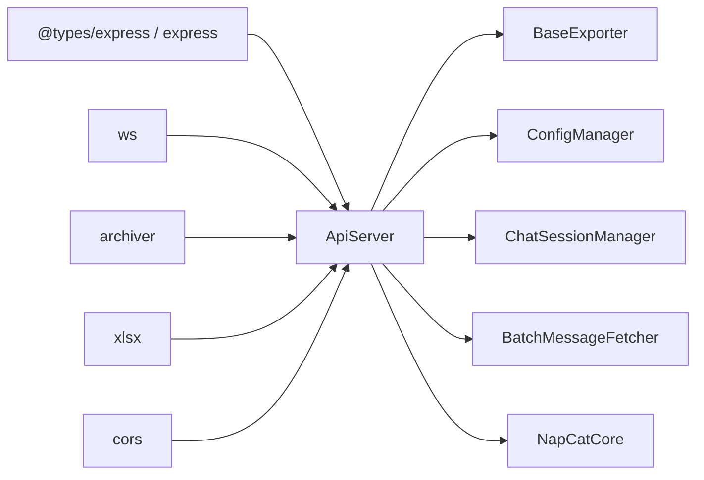

# 组件交互关系

<cite>
**本文引用的文件**
- [plugins/qq-chat-exporter/package.json](file://plugins/qq-chat-exporter/package.json)
- [plugins/qq-chat-exporter/index.mjs](file://plugins/qq-chat-exporter/index.mjs)
- [plugins/qq-chat-exporter/dist/api/ApiLauncher.d.ts](file://plugins/qq-chat-exporter/dist/api/ApiLauncher.d.ts)
- [plugins/qq-chat-exporter/dist/api/ApiServer.d.ts](file://plugins/qq-chat-exporter/dist/api/ApiServer.d.ts)
- [plugins/qq-chat-exporter/dist/core/exporter/BaseExporter.d.ts](file://plugins/qq-chat-exporter/dist/core/exporter/BaseExporter.d.ts)
- [plugins/qq-chat-exporter/dist/core/storage/ConfigManager.d.ts](file://plugins/qq-chat-exporter/dist/core/storage/ConfigManager.d.ts)
- [plugins/qq-chat-exporter/dist/core/chat/ChatSessionManager.d.ts](file://plugins/qq-chat-exporter/dist/core/chat/ChatSessionManager.d.ts)
- [plugins/qq-chat-exporter/dist/core/fetcher/BatchMessageFetcher.d.ts](file://plugins/qq-chat-exporter/dist/core/fetcher/BatchMessageFetcher.d.ts)
</cite>

## 目录
1. [引言](#引言)
2. [项目结构](#项目结构)
3. [核心组件](#核心组件)
4. [架构总览](#架构总览)
5. [详细组件分析](#详细组件分析)
6. [依赖关系分析](#依赖关系分析)
7. [性能考量](#性能考量)
8. [故障排查指南](#故障排查指南)
9. [结论](#结论)
10. [附录](#附录)

## 引言
本文件聚焦“QQ聊天导出器”组件的交互关系，围绕以下目标展开：
- ApiServer与导出器模块的交互与调用链
- 前端组件与API服务的通信机制
- 插件系统与NapCat框架的集成方式
- 接口定义、数据传递方式与错误处理机制
- 典型业务流程的时序图与调用关系图
- 组件解耦设计与依赖注入模式的应用

## 项目结构
该仓库包含三部分关键资产：
- 插件层（NapCat插件）：负责在NapCat环境中启动API服务，并向外部暴露导出能力
- 核心导出引擎：提供导出器基类、消息抓取、会话管理、配置管理等能力
- 前端应用（Next.js）：通过HTTP/WebSocket与API服务交互，完成导出任务的发起、监控与结果获取

图表来源
- [plugins/qq-chat-exporter/package.json](file://plugins/qq-chat-exporter/package.json#L1-L42)
- [plugins/qq-chat-exporter/index.mjs](file://plugins/qq-chat-exporter/index.mjs#L1-L77)
- [plugins/qq-chat-exporter/dist/api/ApiLauncher.d.ts](file://plugins/qq-chat-exporter/dist/api/ApiLauncher.d.ts#L1-L43)
- [plugins/qq-chat-exporter/dist/api/ApiServer.d.ts](file://plugins/qq-chat-exporter/dist/api/ApiServer.d.ts#L1-L143)
- [plugins/qq-chat-exporter/dist/core/exporter/BaseExporter.d.ts](file://plugins/qq-chat-exporter/dist/core/exporter/BaseExporter.d.ts#L1-L129)
- [plugins/qq-chat-exporter/dist/core/storage/ConfigManager.d.ts](file://plugins/qq-chat-exporter/dist/core/storage/ConfigManager.d.ts#L1-L156)
- [plugins/qq-chat-exporter/dist/core/chat/ChatSessionManager.d.ts](file://plugins/qq-chat-exporter/dist/core/chat/ChatSessionManager.d.ts#L1-L81)
- [plugins/qq-chat-exporter/dist/core/fetcher/BatchMessageFetcher.d.ts](file://plugins/qq-chat-exporter/dist/core/fetcher/BatchMessageFetcher.d.ts#L1-L156)

章节来源
- [plugins/qq-chat-exporter/package.json](file://plugins/qq-chat-exporter/package.json#L1-L42)
- [plugins/qq-chat-exporter/index.mjs](file://plugins/qq-chat-exporter/index.mjs#L1-L77)

## 核心组件
- 插件入口与运行模式检测：负责识别NapCat运行模式（Shell/Framework），注入桥接对象，并动态加载API启动器
- API启动器：封装API服务器的生命周期管理（启动/停止/重启/状态查询）
- API服务器：提供HTTP路由与WebSocket通道，协调导出任务、资源处理、定时导出、进度广播等
- 导出器基类：定义导出选项、进度回调、取消机制与通用工具方法
- 配置管理器：统一管理系统配置与用户偏好，支持热重载与变更监听
- 会话管理器：基于NapCat底层API获取并缓存会话信息（最近联系人、群组、好友）
- 批量消息获取器：封装复杂筛选与分批拉取逻辑，提供多种获取策略与重试机制

章节来源
- [plugins/qq-chat-exporter/index.mjs](file://plugins/qq-chat-exporter/index.mjs#L12-L26)
- [plugins/qq-chat-exporter/dist/api/ApiLauncher.d.ts](file://plugins/qq-chat-exporter/dist/api/ApiLauncher.d.ts#L10-L42)
- [plugins/qq-chat-exporter/dist/api/ApiServer.d.ts](file://plugins/qq-chat-exporter/dist/api/ApiServer.d.ts#L9-L142)
- [plugins/qq-chat-exporter/dist/core/exporter/BaseExporter.d.ts](file://plugins/qq-chat-exporter/dist/core/exporter/BaseExporter.d.ts#L46-L128)
- [plugins/qq-chat-exporter/dist/core/storage/ConfigManager.d.ts](file://plugins/qq-chat-exporter/dist/core/storage/ConfigManager.d.ts#L42-L154)
- [plugins/qq-chat-exporter/dist/core/chat/ChatSessionManager.d.ts](file://plugins/qq-chat-exporter/dist/core/chat/ChatSessionManager.d.ts#L12-L80)
- [plugins/qq-chat-exporter/dist/core/fetcher/BatchMessageFetcher.d.ts](file://plugins/qq-chat-exporter/dist/core/fetcher/BatchMessageFetcher.d.ts#L37-L155)

## 架构总览
下图展示了插件、API服务与核心导出引擎之间的高层交互关系。

图表来源
- [plugins/qq-chat-exporter/index.mjs](file://plugins/qq-chat-exporter/index.mjs#L28-L76)
- [plugins/qq-chat-exporter/dist/api/ApiLauncher.d.ts](file://plugins/qq-chat-exporter/dist/api/ApiLauncher.d.ts#L10-L42)
- [plugins/qq-chat-exporter/dist/api/ApiServer.d.ts](file://plugins/qq-chat-exporter/dist/api/ApiServer.d.ts#L9-L142)
- [plugins/qq-chat-exporter/dist/core/exporter/BaseExporter.d.ts](file://plugins/qq-chat-exporter/dist/core/exporter/BaseExporter.d.ts#L46-L128)
- [plugins/qq-chat-exporter/dist/core/storage/ConfigManager.d.ts](file://plugins/qq-chat-exporter/dist/core/storage/ConfigManager.d.ts#L42-L154)
- [plugins/qq-chat-exporter/dist/core/chat/ChatSessionManager.d.ts](file://plugins/qq-chat-exporter/dist/core/chat/ChatSessionManager.d.ts#L12-L80)
- [plugins/qq-chat-exporter/dist/core/fetcher/BatchMessageFetcher.d.ts](file://plugins/qq-chat-exporter/dist/core/fetcher/BatchMessageFetcher.d.ts#L37-L155)

## 详细组件分析

### 插件系统与NapCat框架集成
- 运行模式检测：优先从core上下文读取工作环境标识，回退至Electron与环境变量判断
- 桥接对象注入：将核心对象与运行模式注入全局桥接，供Overlay等组件使用
- 动态加载：通过tsx注册TypeScript加载器后动态导入API启动器
- 生命周期：插件初始化创建并启动API服务器；清理阶段停止服务器并移除桥接对象

图表来源
- [plugins/qq-chat-exporter/index.mjs](file://plugins/qq-chat-exporter/index.mjs#L28-L76)
- [plugins/qq-chat-exporter/dist/api/ApiLauncher.d.ts](file://plugins/qq-chat-exporter/dist/api/ApiLauncher.d.ts#L17-L29)

章节来源
- [plugins/qq-chat-exporter/index.mjs](file://plugins/qq-chat-exporter/index.mjs#L12-L26)
- [plugins/qq-chat-exporter/index.mjs](file://plugins/qq-chat-exporter/index.mjs#L28-L76)

### API服务与导出器模块交互
- API服务器聚合多个子系统：导出任务调度、资源处理、定时任务、安全控制、贴图导出等
- 导出器基类提供统一的导出流程：参数校验、进度回调、内容生成、文件写入、错误包装
- 会话管理器与批量消息获取器为导出提供数据来源，确保高效、稳定的抓取与缓存

图表来源
- [plugins/qq-chat-exporter/dist/api/ApiServer.d.ts](file://plugins/qq-chat-exporter/dist/api/ApiServer.d.ts#L79-L121)
- [plugins/qq-chat-exporter/dist/core/exporter/BaseExporter.d.ts](file://plugins/qq-chat-exporter/dist/core/exporter/BaseExporter.d.ts#L73-L98)
- [plugins/qq-chat-exporter/dist/core/chat/ChatSessionManager.d.ts](file://plugins/qq-chat-exporter/dist/core/chat/ChatSessionManager.d.ts#L32-L65)
- [plugins/qq-chat-exporter/dist/core/fetcher/BatchMessageFetcher.d.ts](file://plugins/qq-chat-exporter/dist/core/fetcher/BatchMessageFetcher.d.ts#L67-L78)

章节来源
- [plugins/qq-chat-exporter/dist/api/ApiServer.d.ts](file://plugins/qq-chat-exporter/dist/api/ApiServer.d.ts#L79-L121)
- [plugins/qq-chat-exporter/dist/core/exporter/BaseExporter.d.ts](file://plugins/qq-chat-exporter/dist/core/exporter/BaseExporter.d.ts#L46-L128)
- [plugins/qq-chat-exporter/dist/core/chat/ChatSessionManager.d.ts](file://plugins/qq-chat-exporter/dist/core/chat/ChatSessionManager.d.ts#L12-L80)
- [plugins/qq-chat-exporter/dist/core/fetcher/BatchMessageFetcher.d.ts](file://plugins/qq-chat-exporter/dist/core/fetcher/BatchMessageFetcher.d.ts#L37-L155)

### 前端组件与API服务通信
- HTTP接口：前端通过REST API提交导出任务、查询任务状态、下载导出文件
- WebSocket通道：实时接收导出进度、日志与完成通知，提升用户体验
- 安全控制：API服务器内置安全策略与可选访问密码，保障WebUI访问安全

图表来源
- [plugins/qq-chat-exporter/dist/api/ApiServer.d.ts](file://plugins/qq-chat-exporter/dist/api/ApiServer.d.ts#L63-L85)
- [plugins/qq-chat-exporter/dist/core/storage/ConfigManager.d.ts](file://plugins/qq-chat-exporter/dist/core/storage/ConfigManager.d.ts#L103-L121)

章节来源
- [plugins/qq-chat-exporter/dist/api/ApiServer.d.ts](file://plugins/qq-chat-exporter/dist/api/ApiServer.d.ts#L35-L77)
- [plugins/qq-chat-exporter/dist/core/storage/ConfigManager.d.ts](file://plugins/qq-chat-exporter/dist/core/storage/ConfigManager.d.ts#L42-L154)

### 组件解耦与依赖注入
- 依赖注入：ApiServer在构造时接收NapCat核心实例，通过组合而非继承实现解耦
- 抽象与扩展：BaseExporter以抽象类形式定义导出规范，具体格式导出器仅需实现内容生成逻辑
- 配置驱动：ConfigManager集中管理配置，前端与后端共享同一套配置模型，降低耦合度
- 模块化：各子系统（会话、消息、导出、资源、定时任务）边界清晰，通过APIServer统一编排

章节来源
- [plugins/qq-chat-exporter/dist/api/ApiServer.d.ts](file://plugins/qq-chat-exporter/dist/api/ApiServer.d.ts#L29-L29)
- [plugins/qq-chat-exporter/dist/core/exporter/BaseExporter.d.ts](file://plugins/qq-chat-exporter/dist/core/exporter/BaseExporter.d.ts#L46-L58)
- [plugins/qq-chat-exporter/dist/core/storage/ConfigManager.d.ts](file://plugins/qq-chat-exporter/dist/core/storage/ConfigManager.d.ts#L42-L61)

## 依赖关系分析
- 外部依赖：Express、WS、Archiver、XLSX、CORS等，支撑HTTP服务、WebSocket、压缩与表格导出
- 内部依赖：ApiServer聚合导出器、配置、会话、消息抓取等模块；ApiLauncher负责生命周期管理
- 运行时依赖：NapCat核心（NapCatQQ/src/core/index.js），用于获取会话与消息数据

图表来源
- [plugins/qq-chat-exporter/package.json](file://plugins/qq-chat-exporter/package.json#L22-L29)
- [plugins/qq-chat-exporter/dist/api/ApiServer.d.ts](file://plugins/qq-chat-exporter/dist/api/ApiServer.d.ts#L5-L25)

章节来源
- [plugins/qq-chat-exporter/package.json](file://plugins/qq-chat-exporter/package.json#L22-L29)
- [plugins/qq-chat-exporter/dist/api/ApiServer.d.ts](file://plugins/qq-chat-exporter/dist/api/ApiServer.d.ts#L5-L25)

## 性能考量
- 批量抓取策略：根据时间范围与序列号选择最优获取策略，结合重试与超时控制，平衡吞吐与稳定性
- 缓存机制：会话管理器与资源文件缓存减少重复API调用与磁盘扫描开销
- 流式处理：导出过程支持进度回调与分块写入，避免内存峰值
- 并发控制：WebSocket广播与任务队列分离，避免阻塞主线程

章节来源
- [plugins/qq-chat-exporter/dist/core/fetcher/BatchMessageFetcher.d.ts](file://plugins/qq-chat-exporter/dist/core/fetcher/BatchMessageFetcher.d.ts#L80-L101)
- [plugins/qq-chat-exporter/dist/core/chat/ChatSessionManager.d.ts](file://plugins/qq-chat-exporter/dist/core/chat/ChatSessionManager.d.ts#L14-L19)
- [plugins/qq-chat-exporter/dist/api/ApiServer.d.ts](file://plugins/qq-chat-exporter/dist/api/ApiServer.d.ts#L43-L53)

## 故障排查指南
- 插件初始化失败：检查tsx是否可用、运行模式检测结果、桥接对象注入是否成功
- API服务器启动失败：确认端口占用、CORS与SSL配置、静态资源路径
- 导出任务异常：查看进度回调中的错误包装信息，核对导出选项与消息过滤规则
- 配置不生效：确认配置文件路径、监听器是否触发、环境变量覆盖逻辑

章节来源
- [plugins/qq-chat-exporter/index.mjs](file://plugins/qq-chat-exporter/index.mjs#L60-L63)
- [plugins/qq-chat-exporter/dist/api/ApiServer.d.ts](file://plugins/qq-chat-exporter/dist/api/ApiServer.d.ts#L96-L97)
- [plugins/qq-chat-exporter/dist/core/exporter/BaseExporter.d.ts](file://plugins/qq-chat-exporter/dist/core/exporter/BaseExporter.d.ts#L114-L114)
- [plugins/qq-chat-exporter/dist/core/storage/ConfigManager.d.ts](file://plugins/qq-chat-exporter/dist/core/storage/ConfigManager.d.ts#L87-L93)

## 结论
本项目通过“插件入口 + API启动器 + API服务器”的分层设计，将NapCat框架与导出引擎有效解耦。前端通过HTTP/WebSocket与API服务交互，形成清晰的职责边界与可扩展的架构。导出器基类、配置管理器、会话与消息抓取模块共同构成稳定高效的导出能力，满足复杂场景下的批量导出需求。

## 附录
- 典型业务流程：会话获取 → 消息抓取 → 导出执行 → 进度广播 → 结果交付
- 接口要点：导出选项标准化、进度回调统一、错误包装一致化、配置热重载