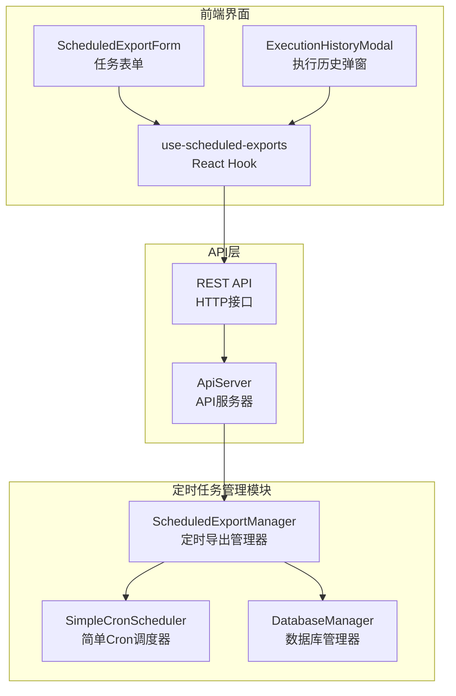
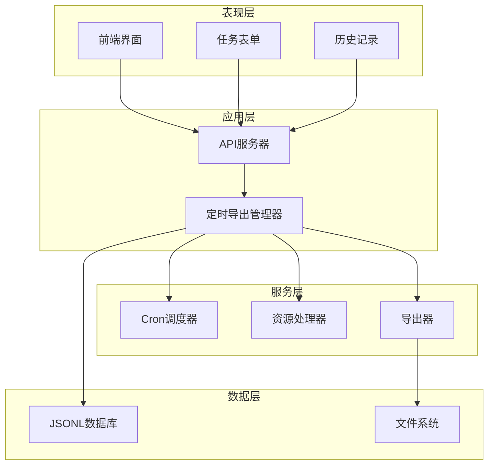
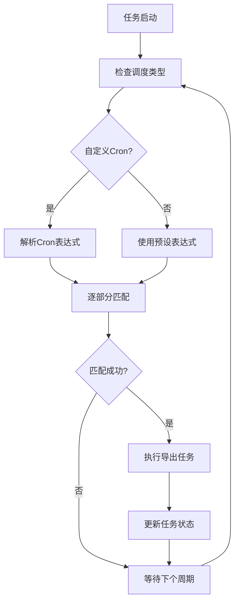
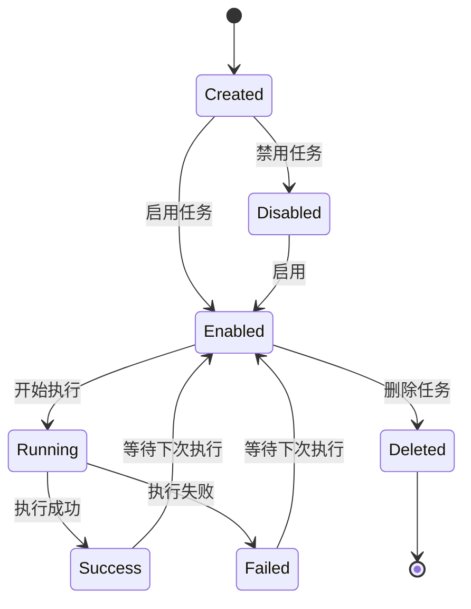
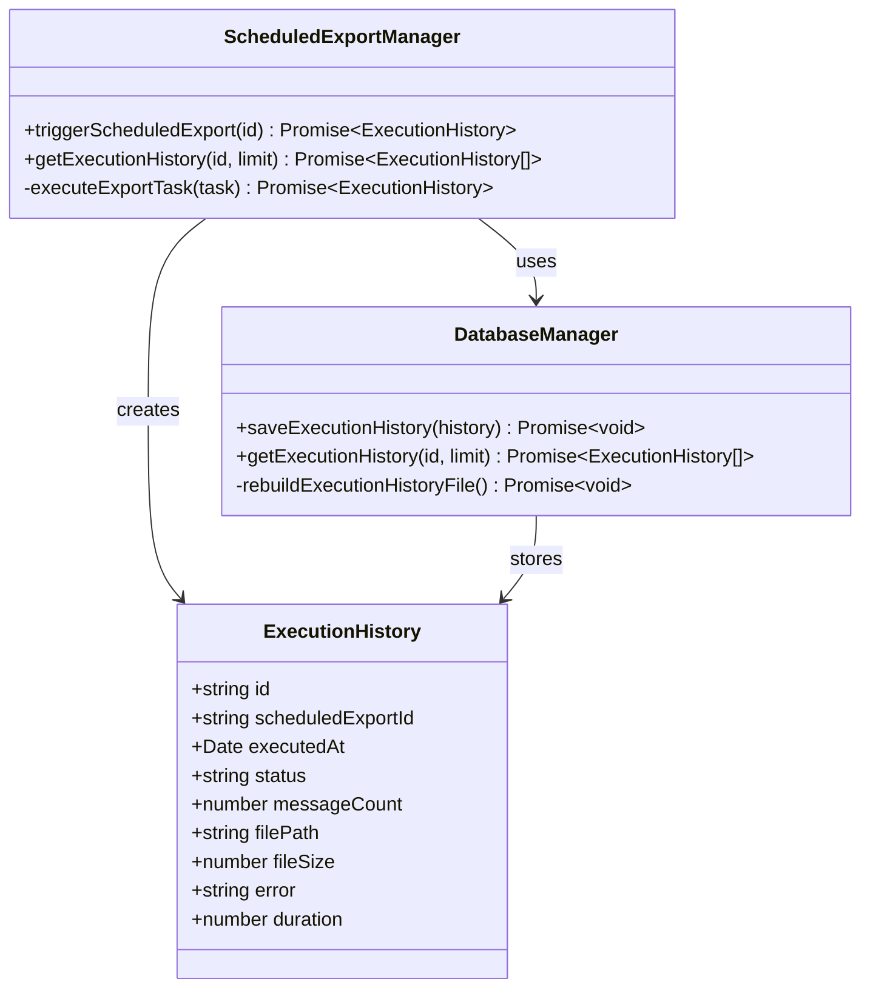
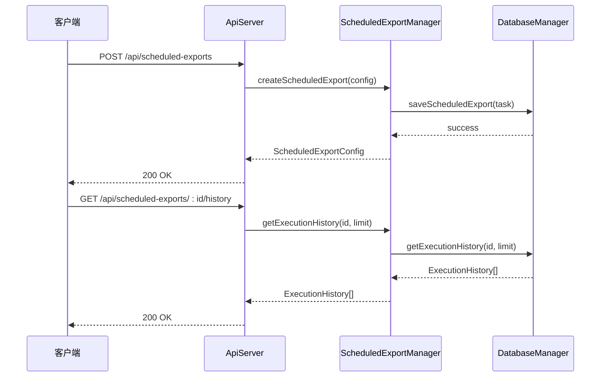
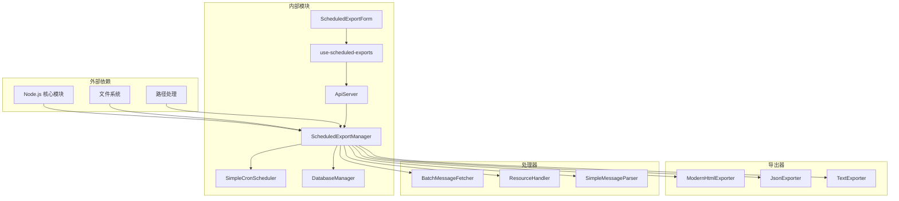
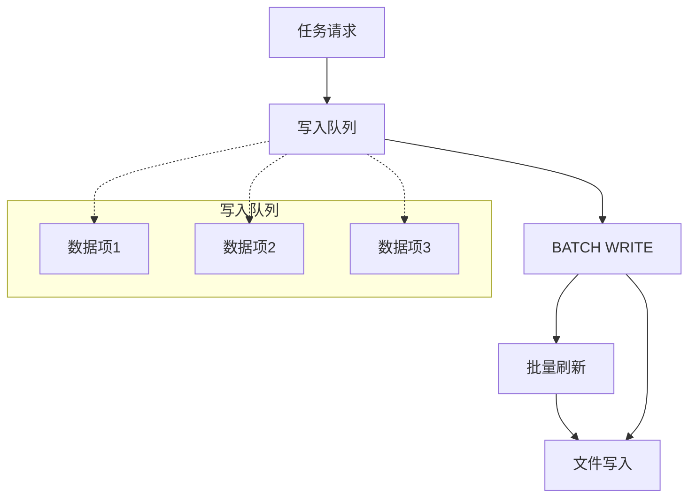

# 定时任务管理

<cite>
**本文档引用的文件**
- [ScheduledExportManager.ts](file://plugins/qq-chat-exporter/lib/core/scheduler/ScheduledExportManager.ts)
- [DatabaseManager.ts](file://plugins/qq-chat-exporter/lib/core/storage/DatabaseManager.ts)
- [ApiServer.ts](file://plugins/qq-chat-exporter/lib/api/ApiServer.ts)
- [scheduled-export-form.tsx](file://qce-v4-tool/components/ui/scheduled-export-form.tsx)
- [use-scheduled-exports.ts](file://qce-v4-tool/hooks/use-scheduled-exports.ts)
- [execution-history-modal.tsx](file://qce-v4-tool/components/ui/execution-history-modal.tsx)
</cite>

## 目录
1. [简介](#简介)
2. [项目结构](#项目结构)
3. [核心组件](#核心组件)
4. [架构概览](#架构概览)
5. [详细组件分析](#详细组件分析)
6. [依赖关系分析](#依赖关系分析)
7. [性能考虑](#性能考虑)
8. [故障排除指南](#故障排除指南)
9. [结论](#结论)

## 简介

定时任务管理模块是QQ聊天导出器项目中的关键组件，负责管理和执行定时导出任务。该模块提供了完整的任务生命周期管理，包括任务创建、调度、执行监控和历史记录等功能。系统采用JSONL格式进行数据持久化，支持多种调度模式和灵活的任务配置。

## 项目结构

定时任务管理模块在项目中的组织结构如下：

**图表来源**
- [ScheduledExportManager.ts](file://plugins/qq-chat-exporter/lib/core/scheduler/ScheduledExportManager.ts#L202-L680)
- [DatabaseManager.ts](file://plugins/qq-chat-exporter/lib/core/storage/DatabaseManager.ts#L57-L1424)
- [ApiServer.ts](file://plugins/qq-chat-exporter/lib/api/ApiServer.ts#L2612-L2721)

**章节来源**
- [ScheduledExportManager.ts](file://plugins/qq-chat-exporter/lib/core/scheduler/ScheduledExportManager.ts#L1-L100)
- [DatabaseManager.ts](file://plugins/qq-chat-exporter/lib/core/storage/DatabaseManager.ts#L1-L100)

## 核心组件

### ScheduledExportManager 定时导出管理器

ScheduledExportManager是整个定时任务管理的核心类，负责任务的全生命周期管理：

#### 主要职责
- 任务创建和更新
- Cron表达式解析和任务调度
- 执行历史记录管理
- 数据持久化操作
- 异常处理和错误恢复

#### 关键特性
- 支持四种调度类型：每日、每周、每月、自定义
- Cron表达式支持（分/时/日/月/周）
- 流式导出优化内存使用
- 执行历史记录和监控
- 自动任务重启和恢复

**章节来源**
- [ScheduledExportManager.ts](file://plugins/qq-chat-exporter/lib/core/scheduler/ScheduledExportManager.ts#L202-L680)

### SimpleCronScheduler 简单Cron调度器

这是一个轻量级的Cron表达式解析器，替代了完整的node-cron库：

#### 支持的功能
- 分钟、小时、日期、月份、星期的精确匹配
- 通配符(*)支持
- 列表(1,2,3)和步长(/)语法
- 周日转换为7的特殊处理

#### 实现特点
- 每分钟检查一次执行条件
- 内存友好的间隔器实现
- 可停止的调度任务

**章节来源**
- [ScheduledExportManager.ts](file://plugins/qq-chat-exporter/lib/core/scheduler/ScheduledExportManager.ts#L14-L75)

### DatabaseManager 数据库管理器

采用JSONL格式的高性能数据库管理系统：

#### 数据持久化策略
- 使用JSON Lines格式确保数据完整性
- 内存索引提供O(1)查询性能
- 批量写入优化I/O性能
- 原子性文件重建机制

#### 支持的数据类型
- 定时导出任务配置
- 执行历史记录
- 资源信息管理

**章节来源**
- [DatabaseManager.ts](file://plugins/qq-chat-exporter/lib/core/storage/DatabaseManager.ts#L57-L1424)

## 架构概览

定时任务管理模块采用分层架构设计，确保各组件职责清晰分离：

**图表来源**
- [ApiServer.ts](file://plugins/qq-chat-exporter/lib/api/ApiServer.ts#L2612-L2721)
- [ScheduledExportManager.ts](file://plugins/qq-chat-exporter/lib/core/scheduler/ScheduledExportManager.ts#L428-L462)
- [DatabaseManager.ts](file://plugins/qq-chat-exporter/lib/core/storage/DatabaseManager.ts#L1195-L1230)

## 详细组件分析

### 任务调度算法

定时任务调度采用基于Cron表达式的精确匹配算法：

**图表来源**
- [ScheduledExportManager.ts](file://plugins/qq-chat-exporter/lib/core/scheduler/ScheduledExportManager.ts#L428-L462)
- [ScheduledExportManager.ts](file://plugins/qq-chat-exporter/lib/core/scheduler/ScheduledExportManager.ts#L41-L75)

#### Cron表达式支持详解

| 字段 | 支持格式 | 示例 | 说明 |
|------|----------|------|------|
| 分钟 | 0-59 | 0,15,30,45 | 精确到分钟 |
| 小时 | 0-23 | 2,14 | 24小时制 |
| 日期 | 1-31 | 1,15,31 | 月份中的日期 |
| 月份 | 1-12 | 1,6,12 | 1-12月 |
| 星期 | 1-7 | 1,7 | 1=周一, 7=周日 |

**章节来源**
- [ScheduledExportManager.ts](file://plugins/qq-chat-exporter/lib/core/scheduler/ScheduledExportManager.ts#L41-L75)

### 任务状态管理

系统实现了完整的任务状态跟踪机制：

**图表来源**
- [ScheduledExportManager.ts](file://plugins/qq-chat-exporter/lib/core/scheduler/ScheduledExportManager.ts#L489-L632)

#### 状态字段说明

| 字段 | 类型 | 描述 | 更新时机 |
|------|------|------|----------|
| enabled | boolean | 任务是否启用 | 创建/更新时 |
| lastRun | Date | 上次执行时间 | 执行完成后 |
| nextRun | Date | 下次执行时间 | 计算并更新 |
| createdAt | Date | 创建时间 | 任务创建时 |
| updatedAt | Date | 更新时间 | 任务更新时 |

**章节来源**
- [ScheduledExportManager.ts](file://plugins/qq-chat-exporter/lib/core/scheduler/ScheduledExportManager.ts#L120-L173)

### 执行历史记录

系统提供详细的执行历史记录功能：

**图表来源**
- [ScheduledExportManager.ts](file://plugins/qq-chat-exporter/lib/core/scheduler/ScheduledExportManager.ts#L178-L197)
- [DatabaseManager.ts](file://plugins/qq-chat-exporter/lib/core/storage/DatabaseManager.ts#L1318-L1349)

#### 历史记录特性

- 最多保留100条最近记录
- 支持按任务ID查询历史
- 包含详细的执行统计信息
- 自动清理过期记录

**章节来源**
- [DatabaseManager.ts](file://plugins/qq-chat-exporter/lib/core/storage/DatabaseManager.ts#L1318-L1349)

### API接口设计

系统提供完整的REST API接口：

**图表来源**
- [ApiServer.ts](file://plugins/qq-chat-exporter/lib/api/ApiServer.ts#L2612-L2721)

#### 主要API端点

| 端点 | 方法 | 功能 | 请求体 | 响应 |
|------|------|------|--------|------|
| /api/scheduled-exports | POST | 创建任务 | ScheduledExportConfig | ScheduledExportConfig |
| /api/scheduled-exports | GET | 获取所有任务 | - | { scheduledExports: [] } |
| /api/scheduled-exports/:id | GET | 获取指定任务 | - | ScheduledExportConfig |
| /api/scheduled-exports/:id | PUT | 更新任务 | Partial<ScheduledExportConfig> | ScheduledExportConfig |
| /api/scheduled-exports/:id | DELETE | 删除任务 | - | { message: string } |
| /api/scheduled-exports/:id/trigger | POST | 手动触发 | - | ExecutionHistory |
| /api/scheduled-exports/:id/history | GET | 获取历史记录 | limit | { history: [] } |

**章节来源**
- [ApiServer.ts](file://plugins/qq-chat-exporter/lib/api/ApiServer.ts#L2612-L2721)

## 依赖关系分析

定时任务管理模块的依赖关系图：

**图表来源**
- [ScheduledExportManager.ts](file://plugins/qq-chat-exporter/lib/core/scheduler/ScheduledExportManager.ts#L76-L88)
- [ApiServer.ts](file://plugins/qq-chat-exporter/lib/api/ApiServer.ts#L21-L25)

### 组件耦合度分析

| 组件 | 内聚性 | 耦合度 | 说明 |
|------|--------|--------|------|
| ScheduledExportManager | 高 | 中等 | 核心业务逻辑，与数据库和导出器有适度耦合 |
| SimpleCronScheduler | 高 | 低 | 独立的调度功能，耦合度最低 |
| DatabaseManager | 高 | 中等 | 数据持久化，与多个组件交互 |
| ApiServer | 中等 | 高 | 与多个组件紧密集成，承担接口职责 |

**章节来源**
- [ScheduledExportManager.ts](file://plugins/qq-chat-exporter/lib/core/scheduler/ScheduledExportManager.ts#L202-L680)
- [DatabaseManager.ts](file://plugins/qq-chat-exporter/lib/core/storage/DatabaseManager.ts#L57-L1424)

## 性能考虑

### 内存优化策略

1. **流式导出优化**
   - 使用迭代器模式处理大量消息
   - 避免一次性加载所有数据到内存
   - 支持大文件的渐进式处理

2. **内存索引管理**
   - JSONL文件的内存映射
   - 按需加载和清理索引
   - 最大化内存使用效率

### I/O性能优化

1. **批量写入机制**
   - 100ms批量写入间隔
   - 并行文件写入操作
   - 原子性文件重建

2. **文件系统优化**
   - JSON Lines格式减少碎片
   - 增量更新策略
   - 自动备份和恢复

### 并发控制

**图表来源**
- [DatabaseManager.ts](file://plugins/qq-chat-exporter/lib/core/storage/DatabaseManager.ts#L347-L415)

**章节来源**
- [DatabaseManager.ts](file://plugins/qq-chat-exporter/lib/core/storage/DatabaseManager.ts#L347-L415)

## 故障排除指南

### 常见问题及解决方案

#### 1. 任务无法启动

**症状**: 任务创建成功但不执行
**排查步骤**:
1. 检查任务状态是否为enabled
2. 验证Cron表达式格式正确性
3. 确认系统时间设置正确
4. 查看执行历史记录

**解决方案**:
- 重新创建任务并验证配置
- 检查系统时区设置
- 确保有足够的磁盘空间

#### 2. 导出文件为空

**症状**: 任务执行成功但导出文件为空
**可能原因**:
- 指定时间范围内没有消息
- 聊天对象ID配置错误
- 权限不足访问消息数据

**解决方法**:
- 调整时间范围配置
- 验证聊天对象ID格式
- 检查账户权限设置

#### 3. 数据库写入失败

**症状**: 任务状态无法持久化
**排查方法**:
1. 检查数据库目录权限
2. 验证磁盘空间充足
3. 确认文件系统正常

**修复方案**:
- 重启应用程序
- 清理损坏的JSONL文件
- 检查磁盘空间

**章节来源**
- [ScheduledExportManager.ts](file://plugins/qq-chat-exporter/lib/core/scheduler/ScheduledExportManager.ts#L489-L632)
- [DatabaseManager.ts](file://plugins/qq-chat-exporter/lib/core/storage/DatabaseManager.ts#L1318-L1349)

### 调试工具和技巧

1. **启用详细日志**
   - 检查控制台输出
   - 查看任务执行日志
   - 监控系统资源使用

2. **使用执行历史**
   - 分析任务执行结果
   - 识别常见错误模式
   - 跟踪性能指标

3. **手动测试**
   - 使用触发API测试任务
   - 验证导出格式正确性
   - 检查文件完整性

**章节来源**
- [ApiServer.ts](file://plugins/qq-chat-exporter/lib/api/ApiServer.ts#L2694-L2721)

## 结论

定时任务管理模块是一个设计精良、功能完整的系统，具有以下优势：

### 核心优势
- **可靠性**: JSONL格式确保数据持久性和一致性
- **性能**: 流式处理和批量写入优化I/O性能
- **可扩展性**: 模块化设计支持功能扩展
- **易用性**: 完整的API和前端界面

### 技术特色
- 自定义Cron调度器替代第三方依赖
- 流式导出优化内存使用
- 详细的执行历史记录
- 完整的错误处理机制

### 改进建议
1. **增强监控**: 添加实时状态监控和告警功能
2. **扩展调度**: 支持更复杂的调度模式
3. **性能优化**: 实现任务优先级和并发控制
4. **安全性**: 添加任务权限和访问控制

该模块为QQ聊天导出器提供了稳定可靠的定时任务管理能力，满足了用户对自动化导出的需求。