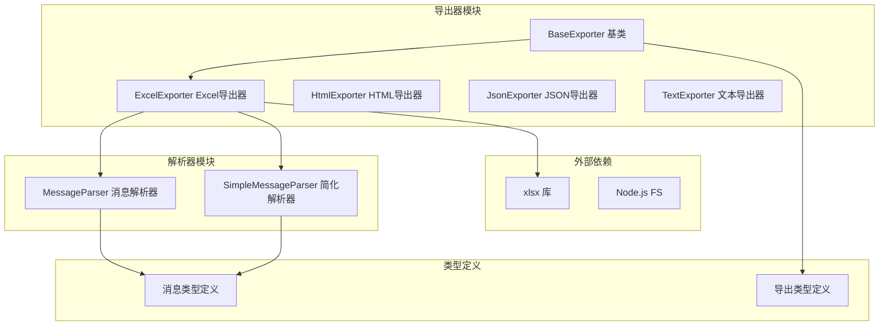
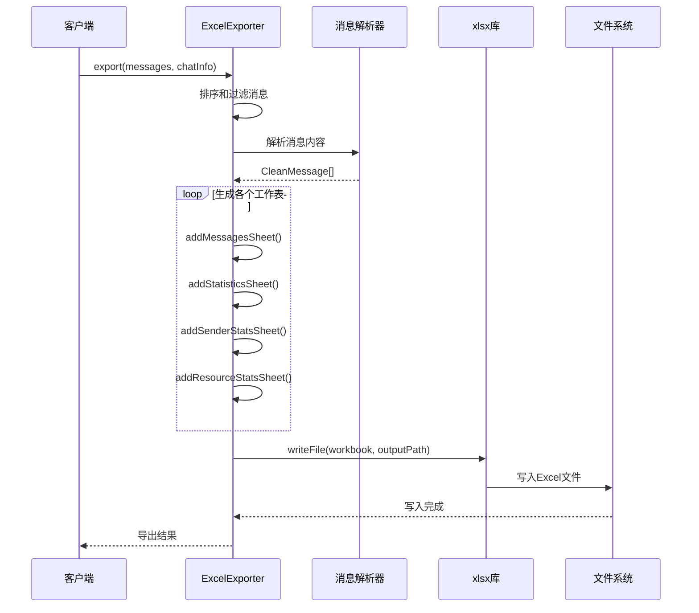
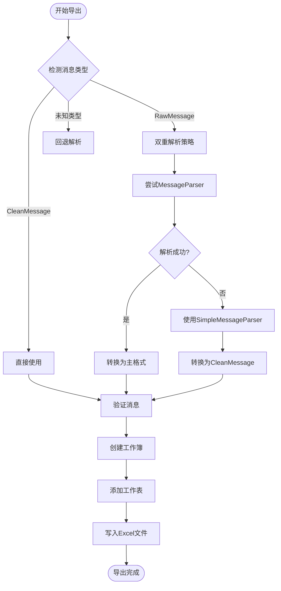
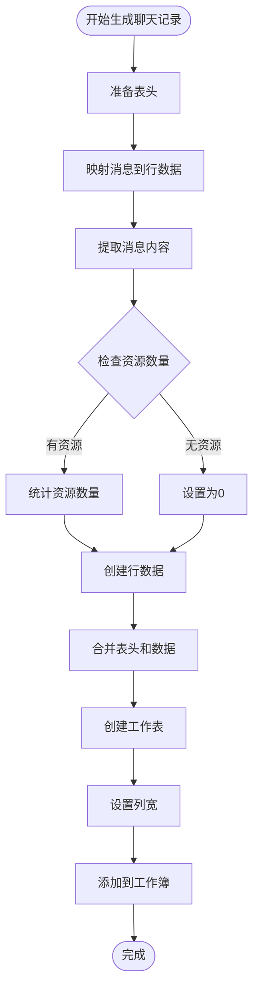
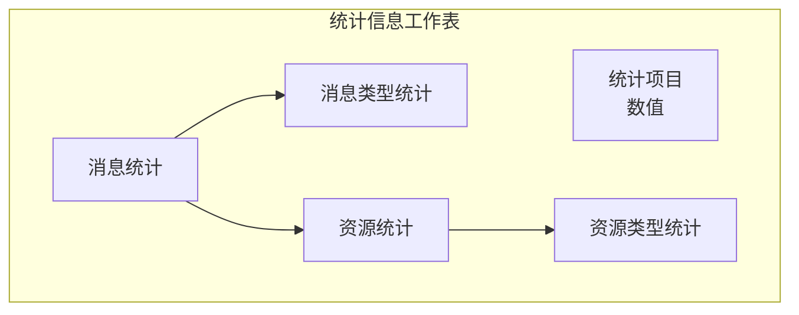
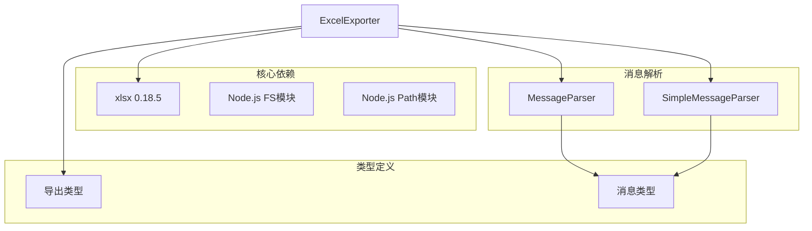
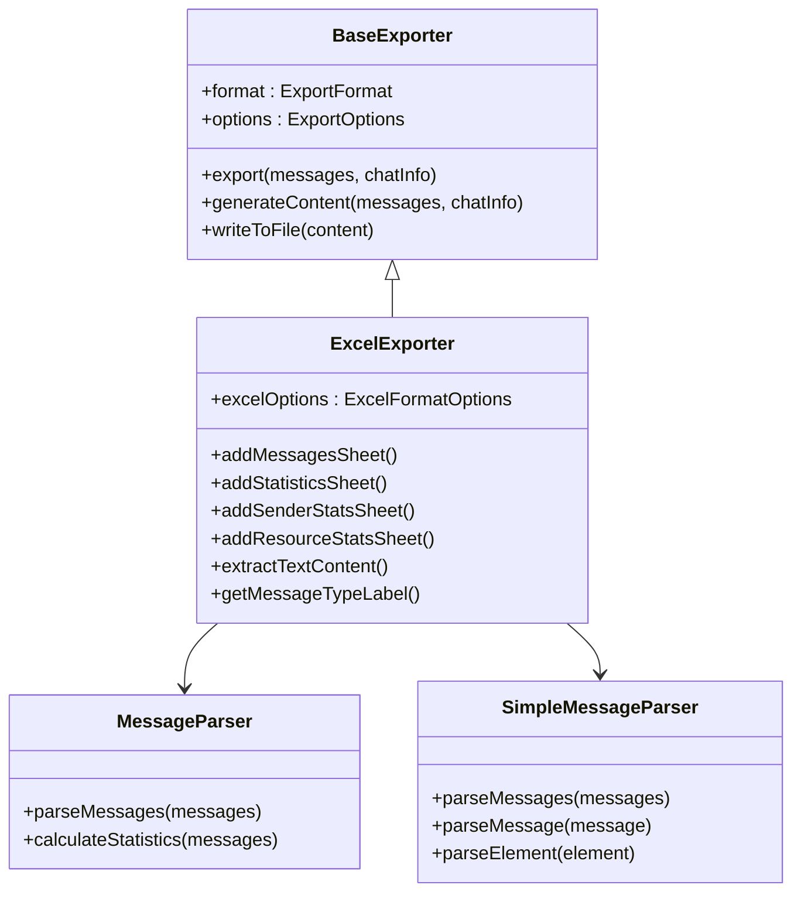
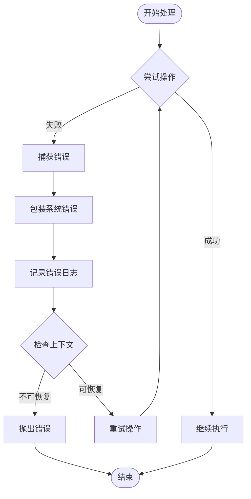

# Excel格式导出器

<cite>
**本文档引用的文件**
- [ExcelExporter.ts](file://plugins/qq-chat-exporter/lib/core/exporter/ExcelExporter.ts)
- [BaseExporter.ts](file://plugins/qq-chat-exporter/lib/core/exporter/BaseExporter.ts)
- [SimpleMessageParser.ts](file://plugins/qq-chat-exporter/lib/core/parser/SimpleMessageParser.ts)
- [MessageParser.ts](file://plugins/qq-chat-exporter/lib/core/parser/MessageParser.ts)
- [index.ts](file://plugins/qq-chat-exporter/lib/types/index.ts)
- [qce_json_to_excel.py](file://scripts/qce_json_to_excel.py)
- [package.json](file://plugins/qq-chat-exporter/package.json)
</cite>

## 目录
1. [简介](#简介)
2. [项目结构](#项目结构)
3. [核心组件](#核心组件)
4. [架构概览](#架构概览)
5. [详细组件分析](#详细组件分析)
6. [依赖关系分析](#依赖关系分析)
7. [性能考虑](#性能考虑)
8. [故障排除指南](#故障排除指南)
9. [结论](#结论)
10. [附录](#附录)

## 简介

Excel格式导出器是QQ聊天导出器项目中的核心组件之一，负责将聊天记录转换为Excel格式文件。该导出器基于xlsx库实现，能够生成包含多个工作表的Excel文件，支持数据分析和统计需求。

该导出器的主要特点包括：
- 多工作表组织结构
- 灵活的消息类型处理
- 统计信息自动生成
- 资源链接管理
- 性能优化和内存管理

## 项目结构

项目采用模块化架构设计，Excel导出器位于核心导出器模块中：

**图表来源**
- [ExcelExporter.ts](file://plugins/qq-chat-exporter/lib/core/exporter/ExcelExporter.ts#L1-L505)
- [BaseExporter.ts](file://plugins/qq-chat-exporter/lib/core/exporter/BaseExporter.ts#L1-L393)

**章节来源**
- [ExcelExporter.ts](file://plugins/qq-chat-exporter/lib/core/exporter/ExcelExporter.ts#L1-L50)
- [BaseExporter.ts](file://plugins/qq-chat-exporter/lib/core/exporter/BaseExporter.ts#L1-L88)

## 核心组件

### ExcelExporter类

ExcelExporter是专门负责Excel格式导出的类，继承自BaseExporter基类。它实现了以下核心功能：

#### 主要特性
- **多工作表支持**：自动生成聊天记录、统计信息、发送者统计、资源列表等多个工作表
- **灵活的消息处理**：支持RawMessage和CleanMessage两种消息格式
- **配置化选项**：支持工作表名称、列宽、统计信息显示等配置
- **资源管理**：自动处理消息中的各种资源类型

#### 关键属性
- `excelOptions`：Excel格式配置选项
- `workbook`：xlsx工作簿对象
- `worksheet`：当前工作表对象

**章节来源**
- [ExcelExporter.ts](file://plugins/qq-chat-exporter/lib/core/exporter/ExcelExporter.ts#L40-L64)

### 工作表结构设计

系统自动生成四个主要工作表：

#### 1. 聊天记录工作表
- **表头**：序号、时间、发送者、消息类型、消息内容、是否撤回、资源数量
- **数据布局**：按时间顺序排列的消息记录
- **列宽配置**：可根据内容动态调整

#### 2. 统计信息工作表
- **统计项目**：消息总数、时间范围、资源统计等
- **分类统计**：按消息类型和资源类型的详细统计

#### 3. 发送者统计工作表
- **排名统计**：按消息数量对发送者进行排序
- **占比分析**：计算每个发送者的消息占比

#### 4. 资源列表工作表
- **资源详情**：文件名、大小、URL、本地路径等
- **类型分类**：图片、视频、音频、文件等不同类型资源

**章节来源**
- [ExcelExporter.ts](file://plugins/qq-chat-exporter/lib/core/exporter/ExcelExporter.ts#L132-L282)

## 架构概览

Excel导出器采用分层架构设计，确保代码的可维护性和扩展性：

**图表来源**
- [ExcelExporter.ts](file://plugins/qq-chat-exporter/lib/core/exporter/ExcelExporter.ts#L69-L127)
- [BaseExporter.ts](file://plugins/qq-chat-exporter/lib/core/exporter/BaseExporter.ts#L110-L158)

**章节来源**
- [ExcelExporter.ts](file://plugins/qq-chat-exporter/lib/core/exporter/ExcelExporter.ts#L69-L127)
- [BaseExporter.ts](file://plugins/qq-chat-exporter/lib/core/exporter/BaseExporter.ts#L110-L158)

## 详细组件分析

### 消息处理机制

Excel导出器具备智能的消息类型检测和处理能力：

**图表来源**
- [ExcelExporter.ts](file://plugins/qq-chat-exporter/lib/core/exporter/ExcelExporter.ts#L78-L101)
- [ExcelExporter.ts](file://plugins/qq-chat-exporter/lib/core/exporter/ExcelExporter.ts#L342-L366)

#### 消息类型映射

系统支持多种消息类型的转换：

| 原始类型 | 映射后类型 | 描述 |
|---------|-----------|------|
| text | text | 文本消息 |
| file | file | 文件消息 |
| video | video | 视频消息 |
| audio | audio | 音频消息 |
| image | image | 图片消息 |
| face | face | 表情消息 |
| market_face | market_face | 商城表情 |
| reply | reply | 回复消息 |
| forward | forward | 转发消息 |
| json | json | JSON卡片消息 |

**章节来源**
- [ExcelExporter.ts](file://plugins/qq-chat-exporter/lib/core/exporter/ExcelExporter.ts#L322-L337)

### 工作表生成算法

#### 聊天记录工作表生成

**图表来源**
- [ExcelExporter.ts](file://plugins/qq-chat-exporter/lib/core/exporter/ExcelExporter.ts#L132-L175)

#### 统计信息工作表生成

统计信息工作表包含多层次的数据汇总：

**图表来源**
- [ExcelExporter.ts](file://plugins/qq-chat-exporter/lib/core/exporter/ExcelExporter.ts#L180-L206)

**章节来源**
- [ExcelExporter.ts](file://plugins/qq-chat-exporter/lib/core/exporter/ExcelExporter.ts#L132-L282)

### 数据列映射规则

Excel导出器遵循严格的数据列映射规则：

#### 基础信息映射
- **序号**：消息在列表中的位置（从1开始递增）
- **时间**：格式化的本地时间字符串
- **发送者**：优先使用群名片，其次备注，最后昵称
- **消息类型**：中文标签映射
- **消息内容**：提取的纯文本内容
- **是否撤回**：布尔值的中文表示
- **资源数量**：消息中资源文件的数量

#### 资源信息映射
- **资源类型**：图片、视频、音频、文件等
- **文件名**：原始文件名或默认名称
- **大小**：文件大小（字节）
- **URL**：原始资源URL或本地路径
- **时间戳**：消息发送时间

**章节来源**
- [ExcelExporter.ts](file://plugins/qq-chat-exporter/lib/core/exporter/ExcelExporter.ts#L140-L174)
- [ExcelExporter.ts](file://plugins/qq-chat-exporter/lib/core/exporter/ExcelExporter.ts#L250-L282)

### 单元格格式设置

系统提供灵活的单元格格式配置：

#### 列宽配置
- **时间列**：默认20字符宽度
- **发送者列**：默认15字符宽度  
- **消息类型列**：默认12字符宽度
- **消息内容列**：默认60字符宽度
- **序号列**：固定8字符宽度
- **资源数量列**：固定12字符宽度

#### 格式化规则
- **时间格式**：本地化格式化为"YYYY-MM-DD HH:mm:ss"
- **布尔值**：转换为"是"/"否"
- **数字格式**：整数格式化
- **文本截断**：超长文本自动截断

**章节来源**
- [ExcelExporter.ts](file://plugins/qq-chat-exporter/lib/core/exporter/ExcelExporter.ts#L56-L63)
- [ExcelExporter.ts](file://plugins/qq-chat-exporter/lib/core/exporter/ExcelExporter.ts#L162-L171)

## 依赖关系分析

### 外部依赖

Excel导出器依赖于以下关键组件：

**图表来源**
- [package.json](file://plugins/qq-chat-exporter/package.json#L22-L41)
- [ExcelExporter.ts](file://plugins/qq-chat-exporter/lib/core/exporter/ExcelExporter.ts#L7-L13)

### 内部依赖关系

**图表来源**
- [ExcelExporter.ts](file://plugins/qq-chat-exporter/lib/core/exporter/ExcelExporter.ts#L40-L505)
- [BaseExporter.ts](file://plugins/qq-chat-exporter/lib/core/exporter/BaseExporter.ts#L58-L88)

**章节来源**
- [ExcelExporter.ts](file://plugins/qq-chat-exporter/lib/core/exporter/ExcelExporter.ts#L1-L505)
- [BaseExporter.ts](file://plugins/qq-chat-exporter/lib/core/exporter/BaseExporter.ts#L1-L393)

## 性能考虑

### 内存优化策略

Excel导出器采用了多项内存优化技术：

#### 流式处理
- **消息流式解析**：使用AsyncGenerator实现逐条消息处理
- **工作表流式写入**：避免一次性加载所有数据到内存
- **垃圾回收监控**：定期触发垃圾回收清理内存

#### 并发控制
- **解析并发度**：根据CPU核心数动态调整并发度
- **进度让出**：定期让出事件循环防止阻塞
- **内存监控**：实时监控堆内存使用情况

#### 数据压缩
- **原始数据过滤**：移除不必要的原始字段
- **HTML内容控制**：可选的HTML内容生成
- **资源链接优化**：可配置的资源链接包含策略

**章节来源**
- [SimpleMessageParser.ts](file://plugins/qq-chat-exporter/lib/core/parser/SimpleMessageParser.ts#L12-L56)
- [BaseExporter.ts](file://plugins/qq-chat-exporter/lib/core/exporter/BaseExporter.ts#L379-L393)

### 大数据处理

#### 分页输出策略
- **工作表分页**：单个工作表最多1,000,000行
- **自动分片**：超过限制时自动创建新工作表
- **命名规范**：聊天消息-1、聊天消息-2等

#### 性能监控
- **进度回调**：实时反馈处理进度
- **内存使用**：监控堆内存使用情况
- **处理速度**：计算消息处理速度

**章节来源**
- [qce_json_to_excel.py](file://scripts/qce_json_to_excel.py#L25-L34)
- [qce_json_to_excel.py](file://scripts/qce_json_to_excel.py#L300-L359)

## 故障排除指南

### 常见问题及解决方案

#### 导出文件损坏
**问题描述**：生成的Excel文件无法打开或显示错误
**解决方案**：
1. 检查文件完整性验证
2. 确认磁盘空间充足
3. 验证输出路径权限

#### 内存不足错误
**问题描述**：处理大量消息时出现内存溢出
**解决方案**：
1. 启用流式处理模式
2. 调整并发度设置
3. 增加Node.js内存限制

#### 消息解析失败
**问题描述**：某些消息无法正确解析
**解决方案**：
1. 检查消息格式兼容性
2. 使用回退解析器
3. 验证消息数据完整性

#### 性能问题
**问题描述**：导出过程耗时过长
**解决方案**：
1. 优化并发设置
2. 启用进度回调
3. 考虑分批处理大数据集

**章节来源**
- [ExcelExporter.ts](file://plugins/qq-chat-exporter/lib/core/exporter/ExcelExporter.ts#L489-L502)
- [BaseExporter.ts](file://plugins/qq-chat-exporter/lib/core/exporter/BaseExporter.ts#L306-L314)

### 错误处理机制

系统提供了完善的错误处理和恢复机制：

**图表来源**
- [BaseExporter.ts](file://plugins/qq-chat-exporter/lib/core/exporter/BaseExporter.ts#L306-L314)

**章节来源**
- [BaseExporter.ts](file://plugins/qq-chat-exporter/lib/core/exporter/BaseExporter.ts#L306-L314)

## 结论

Excel格式导出器是一个功能完整、性能优异的聊天记录导出解决方案。其主要优势包括：

### 技术优势
- **模块化设计**：清晰的分层架构便于维护和扩展
- **性能优化**：流式处理和内存管理确保大文件处理能力
- **灵活性**：丰富的配置选项满足不同使用场景
- **稳定性**：完善的错误处理和恢复机制

### 功能特色
- **多工作表组织**：提供完整的数据分析视角
- **智能消息处理**：支持多种消息类型的转换
- **统计分析**：内置丰富的统计信息生成
- **资源管理**：完整的资源链接和文件管理

### 应用价值
该导出器为QQ聊天数据的分析和归档提供了强有力的技术支撑，特别适合需要进行大规模聊天数据分析的场景。其设计充分考虑了实际应用中的性能和可靠性要求，是一个值得信赖的生产级解决方案。

## 附录

### 配置选项参考

#### Excel导出配置
| 选项名称 | 类型 | 默认值 | 描述 |
|---------|------|--------|------|
| sheetName | string | '聊天记录' | 工作表名称 |
| includeStatistics | boolean | true | 是否包含统计信息 |
| includeSenderStats | boolean | true | 是否包含发送者统计 |
| includeResourceStats | boolean | true | 是否包含资源统计 |
| columnWidths.timestamp | number | 20 | 时间列宽 |
| columnWidths.sender | number | 15 | 发送者列宽 |
| columnWidths.content | number | 60 | 内容列宽 |
| columnWidths.type | number | 12 | 类型列宽 |

#### 导出选项配置
| 选项名称 | 类型 | 默认值 | 描述 |
|---------|------|--------|------|
| outputPath | string | 必填 | 输出文件路径 |
| includeResourceLinks | boolean | true | 是否包含资源链接 |
| includeSystemMessages | boolean | true | 是否包含系统消息 |
| filterPureImageMessages | boolean | false | 是否过滤纯图片消息 |
| timeFormat | string | 'YYYY-MM-DD HH:mm:ss' | 时间格式 |
| prettyFormat | boolean | true | 是否美化输出 |
| encoding | string | 'utf-8' | 文件编码 |

**章节来源**
- [ExcelExporter.ts](file://plugins/qq-chat-exporter/lib/core/exporter/ExcelExporter.ts#L18-L63)
- [BaseExporter.ts](file://plugins/qq-chat-exporter/lib/core/exporter/BaseExporter.ts#L23-L84)