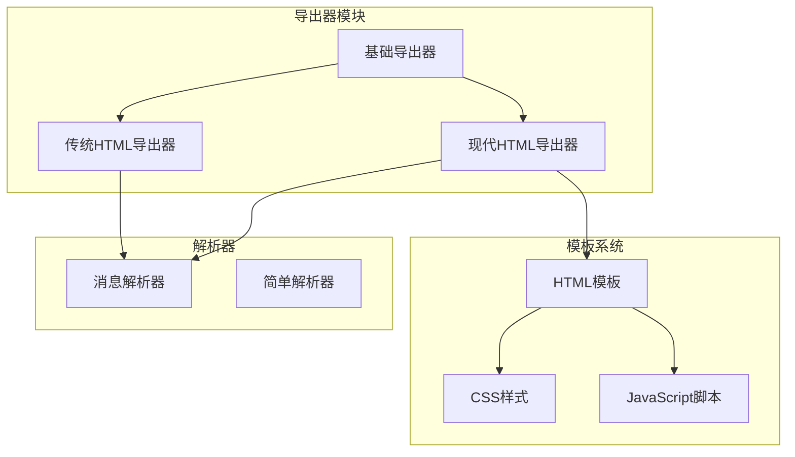
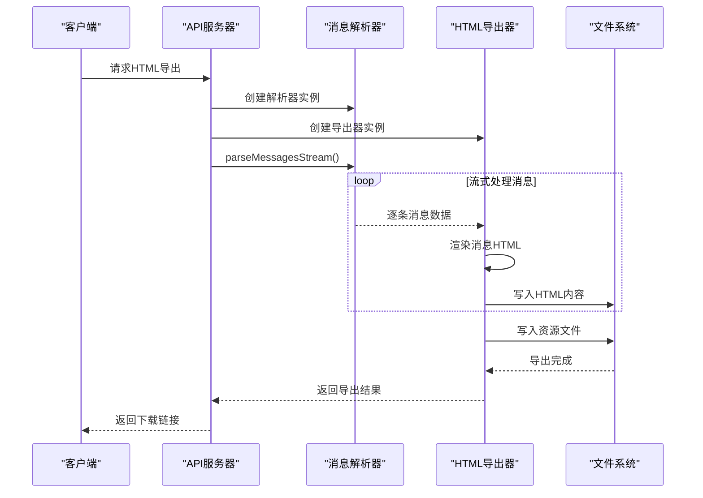
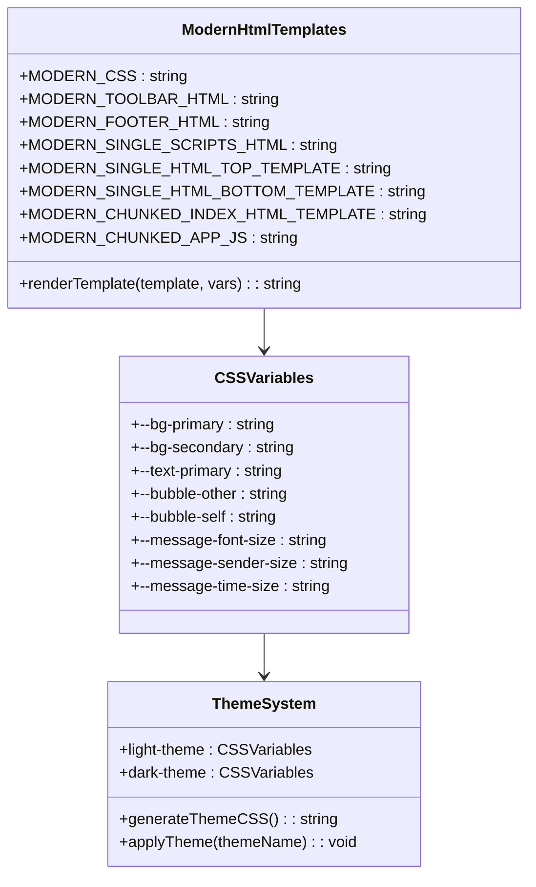
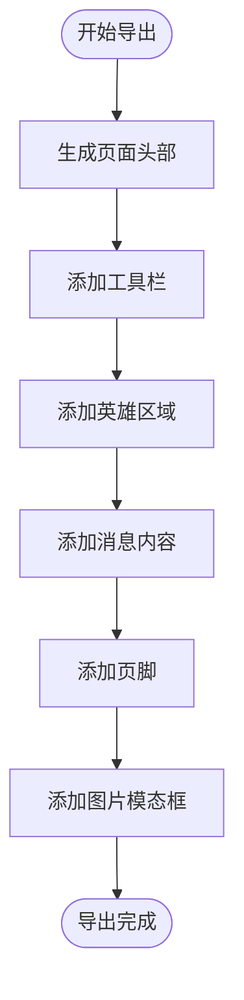
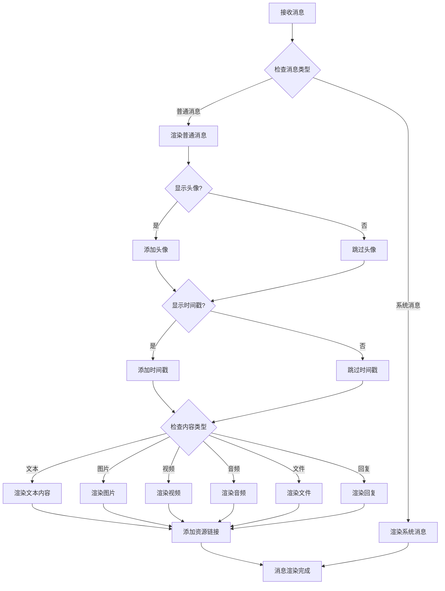
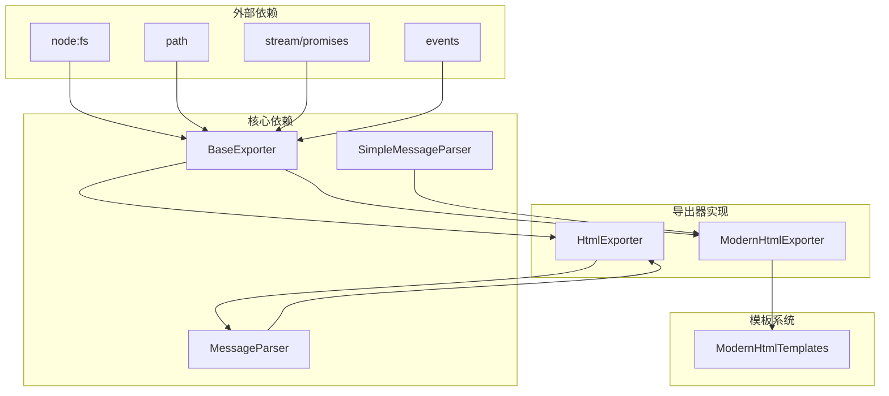

# HTML格式导出器

<cite>
**本文档引用的文件**
- [HtmlExporter.ts](file://plugins/qq-chat-exporter/lib/core/exporter/HtmlExporter.ts)
- [ModernHtmlExporter.ts](file://plugins/qq-chat-exporter/lib/core/exporter/ModernHtmlExporter.ts)
- [ModernHtmlTemplates.ts](file://plugins/qq-chat-exporter/lib/core/exporter/ModernHtmlTemplates.ts)
- [BaseExporter.ts](file://plugins/qq-chat-exporter/lib/core/exporter/BaseExporter.ts)
- [ApiServer.ts](file://plugins/qq-chat-exporter/lib/api/ApiServer.ts)
- [MessageParser.ts](file://plugins/qq-chat-exporter/lib/core/parser/MessageParser.ts)
</cite>

## 目录
1. [简介](#简介)
2. [项目结构](#项目结构)
3. [核心组件](#核心组件)
4. [架构概览](#架构概览)
5. [详细组件分析](#详细组件分析)
6. [依赖关系分析](#依赖关系分析)
7. [性能考虑](#性能考虑)
8. [故障排除指南](#故障排除指南)
9. [结论](#结论)

## 简介

HTML格式导出器是QQ聊天记录导出工具的核心组件之一，负责将聊天数据转换为美观、功能丰富的HTML网页格式。该导出器提供了现代化的界面设计、丰富的交互功能和灵活的定制选项。

主要特性包括：
- 现代化的UI设计和响应式布局
- 内置多种主题和自定义样式支持
- 搜索、筛选和时间范围选择功能
- 虚拟滚动优化大量消息的显示性能
- 多媒体内容的完整支持（图片、视频、音频、文件）
- 流式导出以支持超大数据量

## 项目结构

HTML格式导出器位于插件项目的导出器模块中，采用模块化设计：

**图表来源**
- [BaseExporter.ts](file://plugins/qq-chat-exporter/lib/core/exporter/BaseExporter.ts#L58-L88)
- [HtmlExporter.ts](file://plugins/qq-chat-exporter/lib/core/exporter/HtmlExporter.ts#L109-L132)
- [ModernHtmlExporter.ts](file://plugins/qq-chat-exporter/lib/core/exporter/ModernHtmlExporter.ts#L1-L20)

**章节来源**
- [BaseExporter.ts](file://plugins/qq-chat-exporter/lib/core/exporter/BaseExporter.ts#L1-L393)
- [HtmlExporter.ts](file://plugins/qq-chat-exporter/lib/core/exporter/HtmlExporter.ts#L1-L997)
- [ModernHtmlExporter.ts](file://plugins/qq-chat-exporter/lib/core/exporter/ModernHtmlExporter.ts#L1-L1741)

## 核心组件

### 基础导出器 (BaseExporter)

基础导出器提供了所有导出器的通用框架和基础设施：

- **导出选项管理**：统一处理输出路径、资源链接、编码格式等选项
- **进度跟踪**：提供详细的导出进度反馈
- **错误处理**：统一的错误包装和处理机制
- **消息排序**：确保消息按时间顺序正确排列
- **文件写入**：支持不同编码格式的文件写入

### 传统HTML导出器 (HtmlExporter)

传统HTML导出器提供了经典的功能实现：

- **主题系统**：内置多种预设主题（默认、暗黑、简约、微信风格）
- **响应式设计**：适配不同屏幕尺寸的设备
- **消息渲染**：完整的消息内容渲染，包括文本、链接、提及等
- **多媒体支持**：图片、视频、音频、文件的完整支持
- **交互功能**：搜索、统计信息、时间戳显示等功能

### 现代HTML导出器 (ModernHtmlExporter)

现代HTML导出器是最新版本，提供了增强的功能：

- **流式导出**：支持超大数据量的流式处理
- **分块加载**：大型HTML文件的分块加载和渲染
- **虚拟滚动**：优化大量消息的显示性能
- **高级过滤**：时间范围、发送者、搜索的组合过滤
- **主题切换**：动态主题切换和持久化存储

**章节来源**
- [BaseExporter.ts](file://plugins/qq-chat-exporter/lib/core/exporter/BaseExporter.ts#L23-L84)
- [HtmlExporter.ts](file://plugins/qq-chat-exporter/lib/core/exporter/HtmlExporter.ts#L16-L103)
- [ModernHtmlExporter.ts](file://plugins/qq-chat-exporter/lib/core/exporter/ModernHtmlExporter.ts#L23-L78)

## 架构概览

HTML格式导出器采用分层架构设计，确保了良好的可维护性和扩展性：

**图表来源**
- [ApiServer.ts](file://plugins/qq-chat-exporter/lib/api/ApiServer.ts#L3722-L3739)
- [ModernHtmlExporter.ts](file://plugins/qq-chat-exporter/lib/core/exporter/ModernHtmlExporter.ts#L600-L787)

**章节来源**
- [ApiServer.ts](file://plugins/qq-chat-exporter/lib/api/ApiServer.ts#L3709-L3899)

## 详细组件分析

### HTML模板系统

现代HTML导出器使用分离的模板系统，提供了高度模块化的结构：

#### CSS样式系统

**图表来源**
- [ModernHtmlTemplates.ts](file://plugins/qq-chat-exporter/lib/core/exporter/ModernHtmlTemplates.ts#L12-L1286)

#### JavaScript交互系统

现代HTML导出器包含了完整的JavaScript交互功能：

- **虚拟滚动管理器**：优化大量消息的渲染性能
- **搜索功能**：实时搜索和高亮显示匹配内容
- **时间范围筛选**：基于日期范围的消息筛选
- **发送者筛选**：按消息发送者进行筛选
- **主题切换**：动态主题切换和持久化

#### HTML页面结构

**图表来源**
- [ModernHtmlTemplates.ts](file://plugins/qq-chat-exporter/lib/core/exporter/ModernHtmlTemplates.ts#L2065-L2145)

**章节来源**
- [ModernHtmlTemplates.ts](file://plugins/qq-chat-exporter/lib/core/exporter/ModernHtmlTemplates.ts#L1-L3342)

### 消息渲染逻辑

HTML导出器的消息渲染遵循严格的逻辑流程：

#### 消息类型处理

**图表来源**
- [HtmlExporter.ts](file://plugins/qq-chat-exporter/lib/core/exporter/HtmlExporter.ts#L664-L697)

#### 资源文件处理

现代HTML导出器提供了灵活的资源文件处理机制：

- **本地路径优先**：优先使用本地相对路径
- **远程链接回退**：当本地路径不可用时使用原始URL
- **类型分类**：按类型自动分类到不同的资源目录
- **懒加载支持**：图片资源的懒加载优化

**章节来源**
- [HtmlExporter.ts](file://plugins/qq-chat-exporter/lib/core/exporter/HtmlExporter.ts#L713-L750)
- [ModernHtmlExporter.ts](file://plugins/qq-chat-exporter/lib/core/exporter/ModernHtmlExporter.ts#L981-L1017)

### 主题定制系统

HTML导出器提供了强大的主题定制功能：

#### 预定义主题

| 主题名称 | 主要特点 | 适用场景 |
|---------|----------|----------|
| 默认主题 | 经典蓝色调，适合大多数用户 | 一般聊天记录查看 |
| 暗黑主题 | 黑色背景，护眼设计 | 夜间使用，长时间阅读 |
| 简约主题 | 绿色调，简洁明了 | 注重内容本身 |
| 微信风格 | 绿色系，仿微信界面 | 习惯微信风格的用户 |

#### 自定义CSS样式

开发者可以通过以下方式定制样式：

1. **全局样式覆盖**：通过自定义CSS覆盖默认样式
2. **主题变量调整**：修改CSS变量值改变整体外观
3. **组件级样式**：针对特定组件进行样式定制
4. **响应式设计**：适配不同屏幕尺寸

**章节来源**
- [HtmlExporter.ts](file://plugins/qq-chat-exporter/lib/core/exporter/HtmlExporter.ts#L66-L103)
- [HtmlExporter.ts](file://plugins/qq-chat-exporter/lib/core/exporter/HtmlExporter.ts#L977-L988)

## 依赖关系分析

HTML格式导出器的依赖关系体现了清晰的分层设计：

**图表来源**
- [BaseExporter.ts](file://plugins/qq-chat-exporter/lib/core/exporter/BaseExporter.ts#L1-L18)
- [ModernHtmlExporter.ts](file://plugins/qq-chat-exporter/lib/core/exporter/ModernHtmlExporter.ts#L1-L18)

**章节来源**
- [BaseExporter.ts](file://plugins/qq-chat-exporter/lib/core/exporter/BaseExporter.ts#L1-L393)
- [HtmlExporter.ts](file://plugins/qq-chat-exporter/lib/core/exporter/HtmlExporter.ts#L1-L12)

## 性能考虑

HTML格式导出器在设计时充分考虑了性能优化：

### 内存管理

- **流式处理**：使用流式API处理大量数据，避免内存峰值
- **分块导出**：大型HTML文件按块导出，减少内存占用
- **垃圾回收**：定期触发垃圾回收，释放不再使用的内存

### 渲染优化

- **虚拟滚动**：只有可见区域的消息实际渲染
- **懒加载**：图片资源的懒加载减少初始加载时间
- **增量更新**：只更新发生变化的部分

### 并发处理

- **消息解析并发**：使用并发限制控制解析速度
- **资源下载并发**：多线程下载资源文件
- **进度报告**：实时更新导出进度

**章节来源**
- [ModernHtmlExporter.ts](file://plugins/qq-chat-exporter/lib/core/exporter/ModernHtmlExporter.ts#L798-L806)
- [MessageParser.ts](file://plugins/qq-chat-exporter/lib/core/parser/MessageParser.ts#L13-L36)

## 故障排除指南

### 常见问题及解决方案

#### 导出文件过大

**问题描述**：HTML文件体积过大，难以打开或加载缓慢

**解决方案**：
1. 启用分块导出功能
2. 关闭资源链接包含选项
3. 使用流式导出模式

#### 内存不足错误

**问题描述**：导出过程中出现内存不足错误

**解决方案**：
1. 减少同时处理的消息数量
2. 增加系统内存
3. 使用流式导出替代批量导出

#### 图片显示问题

**问题描述**：导出的HTML中图片无法正常显示

**解决方案**：
1. 检查资源文件路径
2. 确认资源文件完整性
3. 使用绝对路径而非相对路径

#### 搜索功能失效

**问题描述**：HTML页面中的搜索功能无法正常工作

**解决方案**：
1. 检查JavaScript文件加载
2. 确认浏览器兼容性
3. 清除浏览器缓存

**章节来源**
- [BaseExporter.ts](file://plugins/qq-chat-exporter/lib/core/exporter/BaseExporter.ts#L306-L314)
- [ModernHtmlExporter.ts](file://plugins/qq-chat-exporter/lib/core/exporter/ModernHtmlExporter.ts#L781-L786)

## 结论

HTML格式导出器是一个功能完善、设计精良的组件，它成功地将复杂的聊天数据转换为美观、易用的HTML页面。其主要优势包括：

1. **现代化设计**：采用最新的Web技术栈，提供优秀的用户体验
2. **高度可定制**：支持主题切换、样式定制、功能配置
3. **性能优化**：通过流式处理、虚拟滚动等技术优化性能
4. **扩展性强**：模块化设计便于功能扩展和维护
5. **兼容性好**：支持多种浏览器和设备

对于开发者而言，HTML格式导出器提供了清晰的架构和丰富的API，便于二次开发和集成。对于最终用户而言，它提供了直观易用的界面和强大的功能，能够满足各种聊天记录查看和分享需求。

未来的发展方向包括进一步优化性能、增强交互功能、支持更多媒体格式以及提升移动端体验等方面。