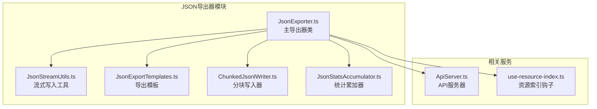
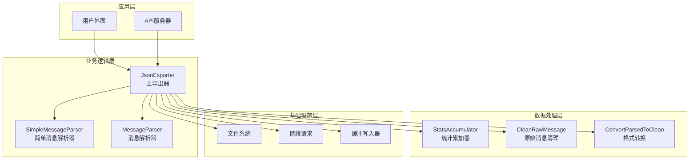
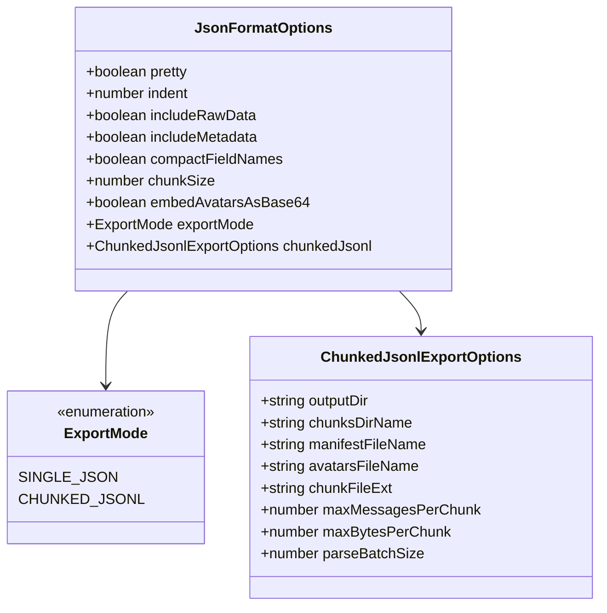
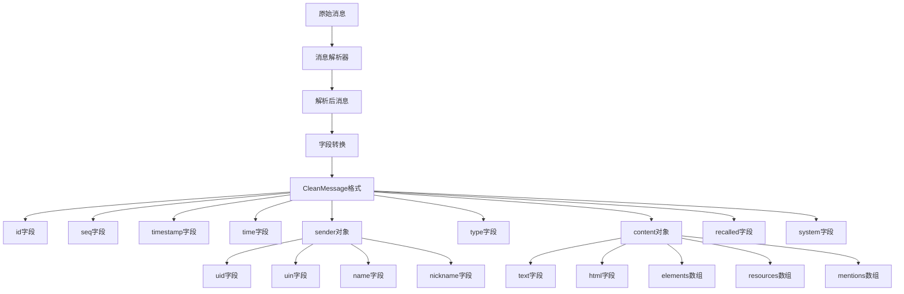
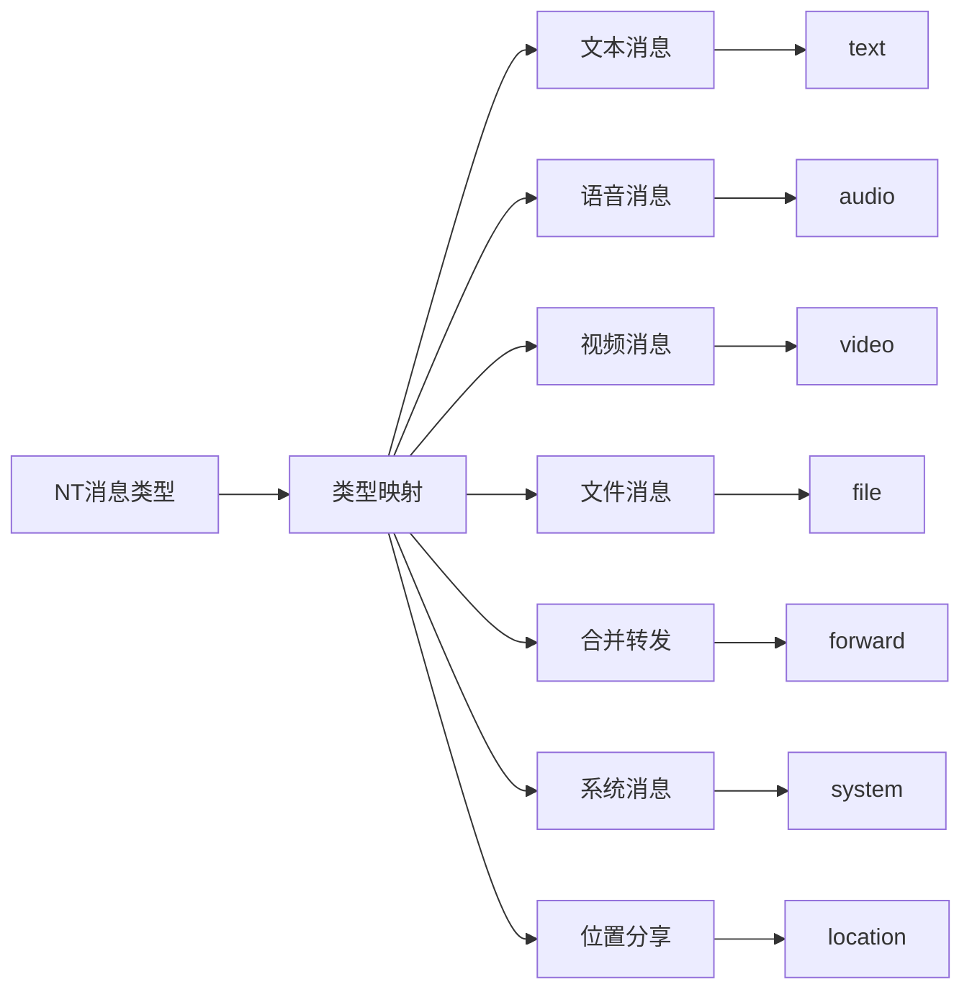
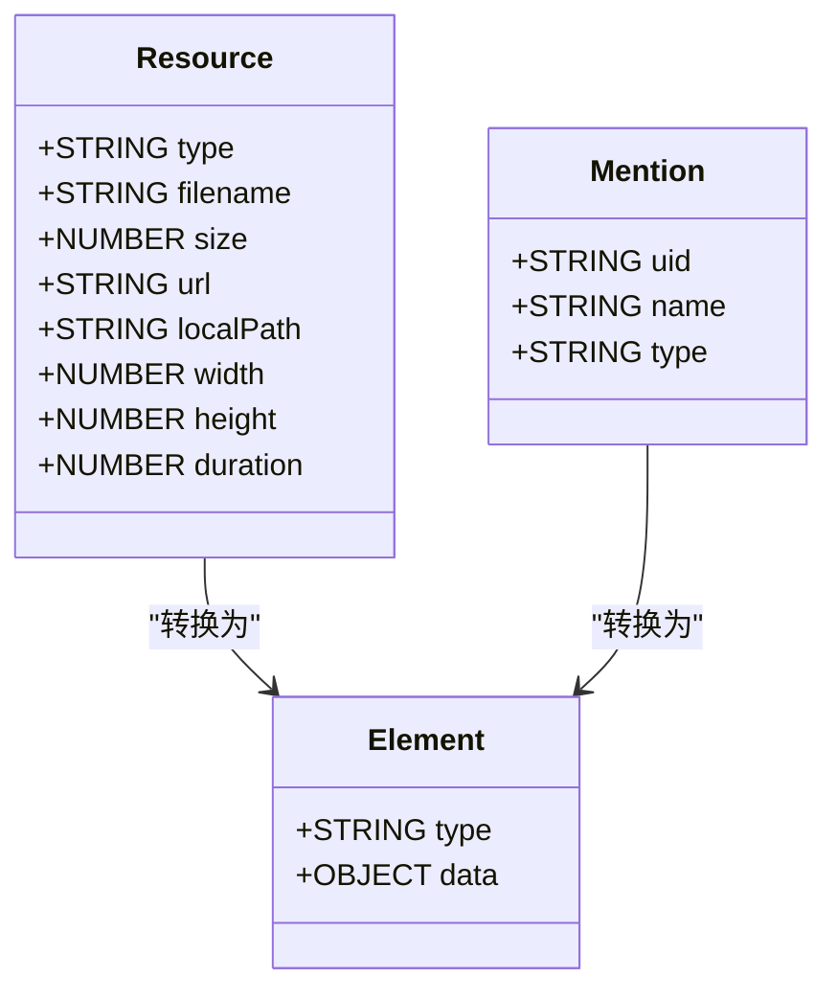
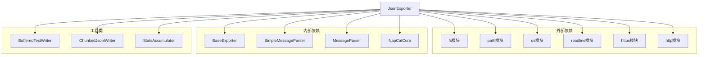
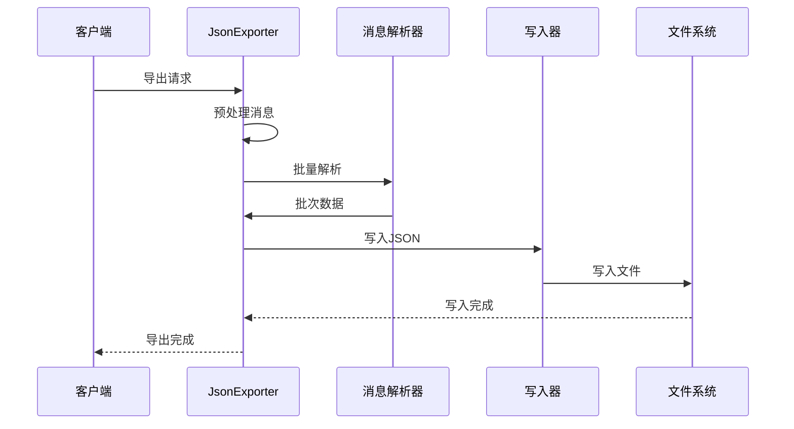

# JSON格式导出器

<cite>
**本文档引用的文件**
- [JsonExporter.ts](file://plugins/qq-chat-exporter/lib/core/exporter/JsonExporter.ts)
- [JsonStreamUtils.ts](file://plugins/qq-chat-exporter/lib/core/exporter/JsonStreamUtils.ts)
- [JsonExportTemplates.ts](file://plugins/qq-chat-exporter/lib/core/exporter/JsonExportTemplates.ts)
- [ChunkedJsonlWriter.ts](file://plugins/qq-chat-exporter/lib/core/exporter/ChunkedJsonlWriter.ts)
- [JsonStatsAccumulator.ts](file://plugins/qq-chat-exporter/lib/core/exporter/JsonStatsAccumulator.ts)
- [ApiServer.ts](file://plugins/qq-chat-exporter/lib/api/ApiServer.ts)
- [use-resource-index.ts](file://qce-v4-tool/hooks/use-resource-index.ts)
</cite>

## 目录
1. [简介](#简介)
2. [项目结构](#项目结构)
3. [核心组件](#核心组件)
4. [架构概览](#架构概览)
5. [详细组件分析](#详细组件分析)
6. [依赖关系分析](#依赖关系分析)
7. [性能考虑](#性能考虑)
8. [故障排除指南](#故障排除指南)
9. [结论](#结论)
10. [附录](#附录)

## 简介
JSON格式导出器是QQ聊天导出器的核心组件之一，负责将聊天记录转换为结构化的JSON格式。该导出器提供了多种导出模式，包括传统的单文件JSON导出和优化的大文件分块导出（chunked-jsonl）。它支持灵活的配置选项，能够处理大规模数据集，同时保持内存效率和性能。

## 项目结构
JSON导出器位于插件项目的导出器模块中，采用模块化设计，包含以下关键文件：



**图表来源**
- [JsonExporter.ts](file://plugins/qq-chat-exporter/lib/core/exporter/JsonExporter.ts#L1-L50)
- [JsonStreamUtils.ts](file://plugins/qq-chat-exporter/lib/core/exporter/JsonStreamUtils.ts#L1-L30)
- [JsonExportTemplates.ts](file://plugins/qq-chat-exporter/lib/core/exporter/JsonExportTemplates.ts#L1-L30)

**章节来源**
- [JsonExporter.ts](file://plugins/qq-chat-exporter/lib/core/exporter/JsonExporter.ts#L1-L100)
- [JsonStreamUtils.ts](file://plugins/qq-chat-exporter/lib/core/exporter/JsonStreamUtils.ts#L1-L50)

## 核心组件
JSON导出器包含以下核心组件：

### 主要导出器类
JsonExporter类继承自BaseExporter，提供完整的JSON导出功能。它支持两种主要导出模式：
- **单文件JSON模式**：保持现有输出结构，适合中小规模数据
- **分块JSONL模式**：适用于大规模数据集，提供更好的内存管理

### 流式写入工具
JsonStreamUtils模块提供了高效的流式写入能力，包括：
- 背压处理（backpressure）防止内存溢出
- 缓冲文本写入器，减少频繁的文件I/O操作
- 编码规范化处理

### 导出模板系统
JsonExportTemplates模块实现了模板化导出，支持：
- 单文件JSON模板
- 流式JSON对象模板
- 统一的缩进和格式化上下文

### 分块写入器
ChunkedJsonlWriter专门处理大规模数据的分块写入，具有：
- 消息数量限制
- 字节大小限制
- 自动文件轮转机制

**章节来源**
- [JsonExporter.ts](file://plugins/qq-chat-exporter/lib/core/exporter/JsonExporter.ts#L235-L261)
- [JsonStreamUtils.ts](file://plugins/qq-chat-exporter/lib/core/exporter/JsonStreamUtils.ts#L83-L124)
- [JsonExportTemplates.ts](file://plugins/qq-chat-exporter/lib/core/exporter/JsonExportTemplates.ts#L49-L105)

## 架构概览
JSON导出器采用分层架构设计，确保高内聚低耦合：



**图表来源**
- [JsonExporter.ts](file://plugins/qq-chat-exporter/lib/core/exporter/JsonExporter.ts#L8-L29)
- [JsonExporter.ts](file://plugins/qq-chat-exporter/lib/core/exporter/JsonExporter.ts#L235-L261)

## 详细组件分析

### JSON格式选项系统
JsonExporter支持丰富的配置选项，通过JsonFormatOptions接口定义：



**图表来源**
- [JsonExporter.ts](file://plugins/qq-chat-exporter/lib/core/exporter/JsonExporter.ts#L114-L142)

#### prettyFormat选项详解
prettyFormat选项控制JSON输出的格式化程度：

| 选项 | 类型 | 默认值 | 影响 |
|------|------|--------|------|
| pretty | boolean | true | 控制是否进行格式化输出 |
| indent | number | 2 | 格式化时的缩进空格数 |
| compactFieldNames | boolean | false | 是否压缩字段名 |

**章节来源**
- [JsonExporter.ts](file://plugins/qq-chat-exporter/lib/core/exporter/JsonExporter.ts#L246-L260)

### 消息对象字段映射规则
JsonExporter将原始消息转换为CleanMessage格式，字段映射规则如下：



**图表来源**
- [JsonExporter.ts](file://plugins/qq-chat-exporter/lib/core/exporter/JsonExporter.ts#L921-L967)

#### 嵌套数据结构处理
导出器对嵌套数据结构采用智能处理策略：

1. **资源信息处理**：将资源对象扁平化为标准字段
2. **提及信息处理**：统一提及对象的字段结构
3. **表情元素处理**：根据表情类型进行分类映射
4. **回复元素处理**：保留引用消息的完整信息

**章节来源**
- [JsonExporter.ts](file://plugins/qq-chat-exporter/lib/core/exporter/JsonExporter.ts#L944-L1032)

### JSON数据模型设计
JSON导出器采用层次化的数据模型设计：

```mermaid
erDiagram
JSON_EXPORT_DATA {
OBJECT metadata
OBJECT chatInfo
OBJECT statistics
ARRAY messages
OBJECT exportOptions
OBJECT avatars
}
METADATA {
STRING name
STRING copyright
STRING version
}
CHAT_INFO {
STRING name
STRING type
STRING avatar
NUMBER participantCount
STRING selfUid
STRING selfUin
STRING selfName
}
STATISTICS {
NUMBER totalMessages
OBJECT timeRange
OBJECT messageTypes
ARRAY senders
OBJECT resources
}
MESSAGE {
STRING id
STRING timestamp
OBJECT sender
STRING type
OBJECT content
BOOLEAN recalled
BOOLEAN system
}
SENDER {
STRING uid
STRING uin
STRING name
STRING nickname
STRING groupCard
STRING remark
STRING avatarBase64
}
CONTENT {
STRING text
STRING html
ARRAY elements
ARRAY resources
ARRAY mentions
}
JSON_EXPORT_DATA ||--|| METADATA
JSON_EXPORT_DATA ||--|| CHAT_INFO
JSON_EXPORT_DATA ||--|| STATISTICS
JSON_EXPORT_DATA ||--o{ MESSAGES
MESSAGES ||--|| SENDER
MESSAGES ||--|| CONTENT
```

**图表来源**
- [JsonExporter.ts](file://plugins/qq-chat-exporter/lib/core/exporter/JsonExporter.ts#L147-L227)

**章节来源**
- [JsonExporter.ts](file://plugins/qq-chat-exporter/lib/core/exporter/JsonExporter.ts#L147-L227)

### 时间戳格式化机制
导出器支持多种时间戳格式化方式：

| 时间戳来源 | 格式化方式 | 输出格式 |
|------------|------------|----------|
| Date对象 | toLocaleString | 'yyyy-MM-dd-HH:mm:ss' |
| 时间戳(ms) | getTime() | 毫秒时间戳 |
| ISO字符串 | Date.parse() | 标准ISO格式 |

**章节来源**
- [JsonExporter.ts](file://plugins/qq-chat-exporter/lib/core/exporter/JsonExporter.ts#L925-L934)
- [JsonExporter.ts](file://plugins/qq-chat-exporter/lib/core/exporter/JsonExporter.ts#L749-L762)

### 消息类型标识系统
消息类型通过NTMsgType映射到标准化类型标识：



**图表来源**
- [JsonExporter.ts](file://plugins/qq-chat-exporter/lib/core/exporter/JsonExporter.ts#L1037-L1064)

**章节来源**
- [JsonExporter.ts](file://plugins/qq-chat-exporter/lib/core/exporter/JsonExporter.ts#L1037-L1064)

### 资源信息的JSON表示
资源信息在JSON中的表示方式：



**图表来源**
- [JsonExporter.ts](file://plugins/qq-chat-exporter/lib/core/exporter/JsonExporter.ts#L948-L962)

**章节来源**
- [JsonExporter.ts](file://plugins/qq-chat-exporter/lib/core/exporter/JsonExporter.ts#L948-L962)

### 导出模式对比
| 特性 | 单文件JSON | 分块JSONL |
|------|------------|-----------|
| 内存使用 | 高 | 低 |
| 处理速度 | 快 | 中等 |
| 文件大小 | 大 | 小 |
| 并发支持 | 有限 | 优秀 |
| 错误恢复 | 困难 | 容易 |
| 流式处理 | 部分 | 完全 |

**章节来源**
- [JsonExporter.ts](file://plugins/qq-chat-exporter/lib/core/exporter/JsonExporter.ts#L268-L276)
- [JsonExporter.ts](file://plugins/qq-chat-exporter/lib/core/exporter/JsonExporter.ts#L488-L502)

## 依赖关系分析



**图表来源**
- [JsonExporter.ts](file://plugins/qq-chat-exporter/lib/core/exporter/JsonExporter.ts#L7-L29)

**章节来源**
- [JsonExporter.ts](file://plugins/qq-chat-exporter/lib/core/exporter/JsonExporter.ts#L7-L29)

## 性能考虑

### 内存优化策略
1. **流式处理**：避免将整个数据集加载到内存
2. **批量处理**：使用批处理大小控制内存使用
3. **及时清理**：定期清理临时对象和缓存
4. **背压处理**：防止写入缓冲区溢出

### 大数据量处理


**图表来源**
- [JsonExporter.ts](file://plugins/qq-chat-exporter/lib/core/exporter/JsonExporter.ts#L337-L377)

### 编码格式选择
支持多种编码格式，通过normalizeEncoding函数进行规范化：

| 编码格式 | 用途 | 优势 |
|----------|------|------|
| utf8 | 默认 | 兼容性好，体积小 |
| utf16le | 多语言 | 支持更多字符集 |
| base64 | 二进制数据 | 适合嵌入资源 |
| latin1 | ASCII文本 | 处理速度快 |

**章节来源**
- [JsonStreamUtils.ts](file://plugins/qq-chat-exporter/lib/core/exporter/JsonStreamUtils.ts#L10-L21)

## 故障排除指南

### 常见问题及解决方案

#### JSON格式验证失败
**症状**：导出完成后验证失败
**原因**：JSON语法错误或编码问题
**解决方案**：
1. 检查prettyFormat选项设置
2. 验证编码格式兼容性
3. 确认特殊字符处理

#### 内存溢出错误
**症状**：导出过程中出现内存不足
**原因**：大文件处理或配置不当
**解决方案**：
1. 切换到分块JSONL模式
2. 调整批处理大小
3. 启用背压处理

#### 头像下载失败
**症状**：头像显示为URL而非图片
**原因**：网络问题或权限限制
**解决方案**：
1. 检查网络连接
2. 验证URL有效性
3. 调整超时设置

**章节来源**
- [JsonExporter.ts](file://plugins/qq-chat-exporter/lib/core/exporter/JsonExporter.ts#L1512-L1522)
- [JsonExporter.ts](file://plugins/qq-chat-exporter/lib/core/exporter/JsonExporter.ts#L1127-L1172)

## 结论
JSON格式导出器提供了强大而灵活的数据导出功能，支持从小规模到超大规模数据的各种场景。其模块化设计和流式处理机制确保了高性能和低内存占用。通过合理的配置选项和优化策略，开发者可以根据具体需求选择最适合的导出模式和参数设置。

## 附录

### 配置选项参考
| 选项名称 | 类型 | 默认值 | 描述 |
|----------|------|--------|------|
| pretty | boolean | true | 是否格式化输出 |
| indent | number | 2 | 格式化缩进空格数 |
| includeRawData | boolean | false | 是否包含原始数据 |
| includeMetadata | boolean | true | 是否包含元数据 |
| compactFieldNames | boolean | false | 是否压缩字段名 |
| chunkSize | number | 0 | 分块大小（字节） |
| embedAvatarsAsBase64 | boolean | false | 是否嵌入头像 |
| exportMode | string | 'single-json' | 导出模式 |
| parseBatchSize | number | 5000 | 批处理大小 |

### 性能优化建议
1. **大数据集**：优先使用分块JSONL模式
2. **内存受限**：调整批处理大小和缓冲区大小
3. **网络环境**：启用背压处理和错误重试
4. **存储空间**：合理设置分块大小和文件命名