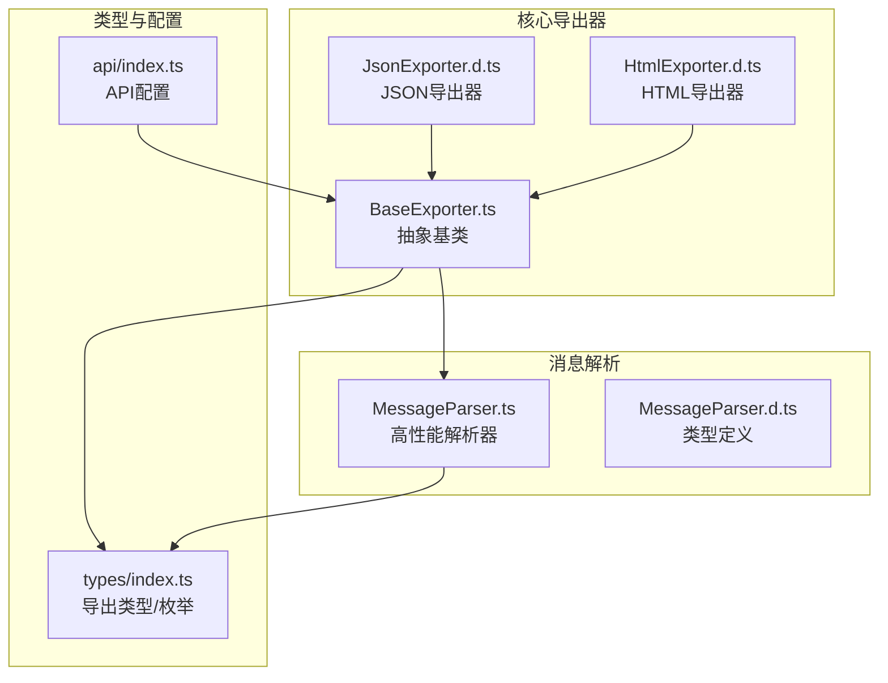
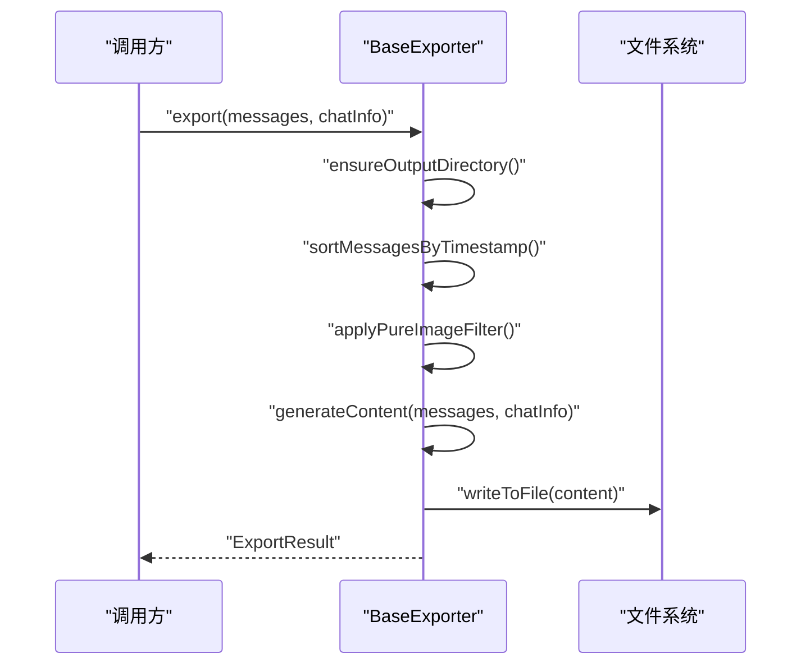
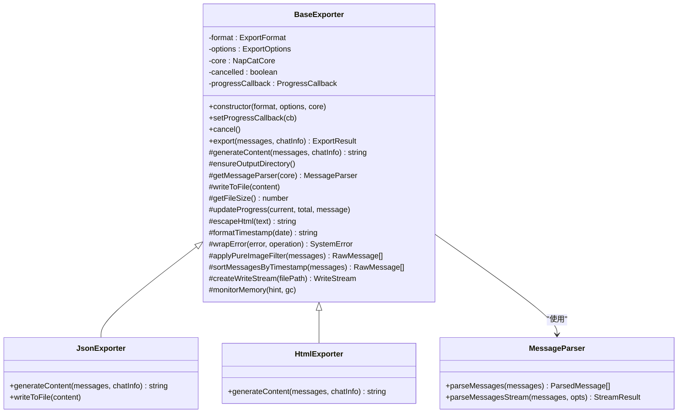
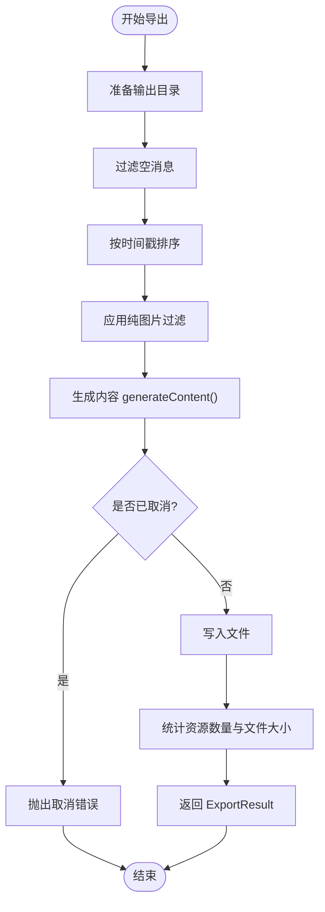
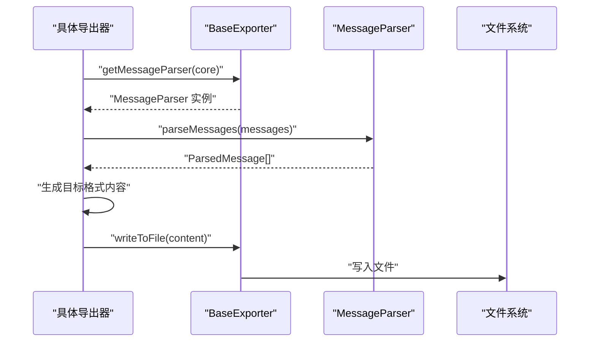
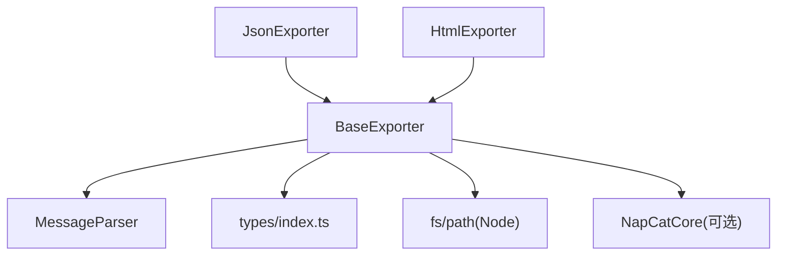

# 基础导出器

<cite>
**本文档引用的文件**
- [plugins/qq-chat-exporter/lib/core/exporter/BaseExporter.ts](file://plugins/qq-chat-exporter/lib/core/exporter/BaseExporter.ts)
- [plugins/qq-chat-exporter/dist/core/exporter/BaseExporter.d.ts](file://plugins/qq-chat-exporter/dist/core/exporter/BaseExporter.d.ts)
- [plugins/qq-chat-exporter/dist/core/exporter/JsonExporter.d.ts](file://plugins/qq-chat-exporter/dist/core/exporter/JsonExporter.d.ts)
- [plugins/qq-chat-exporter/dist/core/exporter/HtmlExporter.d.ts](file://plugins/qq-chat-exporter/dist/core/exporter/HtmlExporter.d.ts)
- [plugins/qq-chat-exporter/dist/core/parser/MessageParser.d.ts](file://plugins/qq-chat-exporter/dist/core/parser/MessageParser.d.ts)
- [plugins/qq-chat-exporter/lib/core/parser/MessageParser.ts](file://plugins/qq-chat-exporter/lib/core/parser/MessageParser.ts)
- [plugins/qq-chat-exporter/lib/types/index.ts](file://plugins/qq-chat-exporter/lib/types/index.ts)
- [plugins/qq-chat-exporter/lib/api/index.ts](file://plugins/qq-chat-exporter/lib/api/index.ts)
</cite>

## 目录
1. [简介](#简介)
2. [项目结构](#项目结构)
3. [核心组件](#核心组件)
4. [架构总览](#架构总览)
5. [详细组件分析](#详细组件分析)
6. [依赖关系分析](#依赖关系分析)
7. [性能考量](#性能考量)
8. [故障排查指南](#故障排查指南)
9. [结论](#结论)
10. [附录](#附录)

## 简介
本文件围绕基础导出器体系，系统阐述 BaseExporter 抽象类的设计理念、核心架构与扩展点，并深入解析导出选项接口 ExportOptions 的全部配置项及其作用；同时覆盖进度回调机制 ProgressCallback 的实现方式、取消导出功能的实现原理、消息过滤与排序逻辑；最后提供基于 BaseExporter 继承的自定义导出器示例路径、generateContent 抽象方法的实现要求、工具方法的使用方式、错误处理策略、文件写入流程、HTML 转义与时间格式化等关键能力，帮助开发者快速理解并扩展导出器。

## 项目结构
本项目采用按领域分层与按功能模块组织的结构。与导出器相关的代码主要位于 plugins/qq-chat-exporter/lib/core 下，其中 exporter 子目录定义了导出器抽象与多种具体实现（如 JSON、HTML、TXT 等），parser 子目录提供了高性能的消息解析器，types 定义了导出相关的类型与枚举，api 定义了导出 API 的配置与入口。

**图表来源**
- [plugins/qq-chat-exporter/lib/core/exporter/BaseExporter.ts](file://plugins/qq-chat-exporter/lib/core/exporter/BaseExporter.ts#L58-L393)
- [plugins/qq-chat-exporter/dist/core/exporter/JsonExporter.d.ts](file://plugins/qq-chat-exporter/dist/core/exporter/JsonExporter.d.ts#L29-L109)
- [plugins/qq-chat-exporter/dist/core/exporter/HtmlExporter.d.ts](file://plugins/qq-chat-exporter/dist/core/exporter/HtmlExporter.d.ts#L64-L159)
- [plugins/qq-chat-exporter/lib/core/parser/MessageParser.ts](file://plugins/qq-chat-exporter/lib/core/parser/MessageParser.ts#L415-L622)
- [plugins/qq-chat-exporter/dist/core/parser/MessageParser.d.ts](file://plugins/qq-chat-exporter/dist/core/parser/MessageParser.d.ts#L127-L193)
- [plugins/qq-chat-exporter/lib/types/index.ts](file://plugins/qq-chat-exporter/lib/types/index.ts#L1-L506)
- [plugins/qq-chat-exporter/lib/api/index.ts](file://plugins/qq-chat-exporter/lib/api/index.ts#L1-L35)

**章节来源**
- [plugins/qq-chat-exporter/lib/core/exporter/BaseExporter.ts](file://plugins/qq-chat-exporter/lib/core/exporter/BaseExporter.ts#L1-L393)
- [plugins/qq-chat-exporter/lib/types/index.ts](file://plugins/qq-chat-exporter/lib/types/index.ts#L1-L506)

## 核心组件
- BaseExporter 抽象类：定义导出器的通用框架、生命周期、工具方法与抽象接口，所有具体格式导出器均继承该类。
- ExportOptions 导出选项接口：统一管理输出路径、资源链接、系统消息、纯图片过滤、时间格式、美化输出、编码、分块大小等导出参数。
- ProgressCallback 进度回调类型：标准化导出过程中的进度通知，包含当前进度、总量、百分比与描述信息。
- MessageParser 消息解析器：负责将原始消息转换为结构化内容，支持多策略解析、并发控制、跨批引用、内存与性能优化。
- 具体导出器实现：如 JsonExporter、HtmlExporter 等，通过覆写 generateContent 并复用 BaseExporter 的工具方法完成内容生成与落盘。

**章节来源**
- [plugins/qq-chat-exporter/lib/core/exporter/BaseExporter.ts](file://plugins/qq-chat-exporter/lib/core/exporter/BaseExporter.ts#L23-L52)
- [plugins/qq-chat-exporter/dist/core/exporter/BaseExporter.d.ts](file://plugins/qq-chat-exporter/dist/core/exporter/BaseExporter.d.ts#L11-L46)
- [plugins/qq-chat-exporter/lib/core/parser/MessageParser.ts](file://plugins/qq-chat-exporter/lib/core/parser/MessageParser.ts#L415-L622)
- [plugins/qq-chat-exporter/dist/core/parser/MessageParser.d.ts](file://plugins/qq-chat-exporter/dist/core/parser/MessageParser.d.ts#L127-L193)

## 架构总览
下图展示了 BaseExporter 的核心控制流：初始化导出选项与进度回调、准备输出目录、过滤与排序消息、生成内容、写入文件、统计资源数量并返回导出结果。期间穿插取消检测与错误包装，确保导出过程可控、可观测且可恢复。

**图表来源**
- [plugins/qq-chat-exporter/lib/core/exporter/BaseExporter.ts](file://plugins/qq-chat-exporter/lib/core/exporter/BaseExporter.ts#L110-L158)
- [plugins/qq-chat-exporter/lib/core/exporter/BaseExporter.ts](file://plugins/qq-chat-exporter/lib/core/exporter/BaseExporter.ts#L208-L215)

**章节来源**
- [plugins/qq-chat-exporter/lib/core/exporter/BaseExporter.ts](file://plugins/qq-chat-exporter/lib/core/exporter/BaseExporter.ts#L110-L158)

## 详细组件分析

### BaseExporter 抽象类与导出选项
- 设计理念
  - 统一导出流程：封装“准备目录—过滤与排序—生成内容—写入文件—统计结果”的标准步骤。
  - 可扩展性：通过抽象方法 generateContent 与工具方法（HTML 转义、时间格式化、进度回调、内存监控等）降低具体导出器实现成本。
  - 可观测性：内置进度回调与错误包装，便于上层任务调度与日志追踪。
  - 可靠性：提供取消导出能力与健壮的错误处理，避免中途失败导致的状态不一致。
- 关键成员与职责
  - format/options/core：保存导出格式、导出选项与可选的 NapCatCore 实例。
  - cancelled/progressCallback：控制导出中断与进度上报。
  - export()：主流程编排，贯穿过滤、排序、生成、写入与统计。
  - generateContent()：抽象方法，子类必须实现。
  - 工具方法：ensureOutputDirectory、writeToFile、updateProgress、escapeHtml、formatTimestamp、wrapError、sortMessagesByTimestamp、createWriteStream、monitorMemory。
- 导出选项 ExportOptions 参数详解
  - outputPath：输出文件绝对或相对路径。
  - includeResourceLinks：是否在内容中包含资源链接。
  - includeSystemMessages：是否包含系统消息。
  - filterPureImageMessages：是否过滤掉纯图片消息（当前基类实现为直接返回，子类可覆写）。
  - timeFormat：时间格式，支持“年-月-日 时:分:秒”、“日期仅”、“时间仅”、“相对时间”等。
  - prettyFormat：是否美化输出（如 JSON 缩进）。
  - customCss：自定义 CSS（HTML 导出器使用）。
  - encoding：文件编码，默认 UTF-8。
  - chunkSize：分块大小（大文件分块输出，部分导出器使用）。
- 进度回调机制 ProgressCallback
  - updateProgress(current, total, message)：计算百分比并调用回调，用于 UI 展示与任务状态同步。
  - 在导出开始、每一步处理完成后调用，确保进度连续可感知。
- 取消导出机制
  - cancel()：设置 cancelled 标记。
  - 在 export() 主流程中定期检查 cancelled，若为真则抛出错误，上层捕获后视为取消。
- 消息过滤与排序逻辑
  - 过滤空消息：export() 中对传入 messages 做空值过滤。
  - 排序：sortMessagesByTimestamp() 按时间戳升序排列，兼容秒级与毫秒级时间戳，无效时间戳置于前部。
  - 纯图片过滤：applyPureImageFilter() 当前返回原数组，子类可覆写实现过滤策略。
- 工具方法与功能
  - HTML 转义：escapeHtml() 将特殊字符转义为 HTML 实体，防止注入与渲染异常。
  - 时间格式化：formatTimestamp() 支持多种格式，包含相对时间（“X天前/小时前/分钟前/刚刚”）。
  - 文件写入：writeToFile() 使用指定编码写入文件；createWriteStream() 提供流式写入能力（部分导出器使用）。
  - 内存监控：monitorMemory(hint, gc) 记录堆内存使用并在满足条件时触发 GC（需要 Node 启用 --expose-gc）。
  - 错误包装：wrapError() 将底层错误包装为 SystemError，携带类型、上下文与时间戳，便于统一处理与日志追踪。

**图表来源**
- [plugins/qq-chat-exporter/lib/core/exporter/BaseExporter.ts](file://plugins/qq-chat-exporter/lib/core/exporter/BaseExporter.ts#L58-L393)
- [plugins/qq-chat-exporter/dist/core/exporter/JsonExporter.d.ts](file://plugins/qq-chat-exporter/dist/core/exporter/JsonExporter.d.ts#L29-L109)
- [plugins/qq-chat-exporter/dist/core/exporter/HtmlExporter.d.ts](file://plugins/qq-chat-exporter/dist/core/exporter/HtmlExporter.d.ts#L64-L159)
- [plugins/qq-chat-exporter/lib/core/parser/MessageParser.ts](file://plugins/qq-chat-exporter/lib/core/parser/MessageParser.ts#L415-L622)

**章节来源**
- [plugins/qq-chat-exporter/lib/core/exporter/BaseExporter.ts](file://plugins/qq-chat-exporter/lib/core/exporter/BaseExporter.ts#L58-L393)
- [plugins/qq-chat-exporter/lib/types/index.ts](file://plugins/qq-chat-exporter/lib/types/index.ts#L1-L506)

### 导出流程与错误处理
- 导出流程要点
  - 准备阶段：校验并创建输出目录，初始化进度回调。
  - 数据准备：过滤空消息，按时间戳排序，应用纯图片过滤（可选）。
  - 内容生成：调用 generateContent() 生成最终内容字符串。
  - 写入阶段：根据编码写入文件，统计资源数量与文件大小。
  - 结果返回：构造 ExportResult，包含任务 ID（占位）、格式、路径、大小、消息数、资源数、耗时与完成时间。
- 错误处理策略
  - 包装策略：统一使用 wrapError() 将异常包装为 SystemError，便于上层识别与分类处理。
  - 取消检测：在关键节点检查 cancelled，及时终止并反馈取消状态。
  - 文件操作：writeToFile() 捕获文件系统异常并包装为系统错误。
- 示例路径
  - 导出主流程：[export()](file://plugins/qq-chat-exporter/lib/core/exporter/BaseExporter.ts#L110-L158)
  - 写入文件：[writeToFile()](file://plugins/qq-chat-exporter/lib/core/exporter/BaseExporter.ts#L208-L215)
  - 错误包装：[wrapError()](file://plugins/qq-chat-exporter/lib/core/exporter/BaseExporter.ts#L306-L314)

**图表来源**
- [plugins/qq-chat-exporter/lib/core/exporter/BaseExporter.ts](file://plugins/qq-chat-exporter/lib/core/exporter/BaseExporter.ts#L110-L158)
- [plugins/qq-chat-exporter/lib/core/exporter/BaseExporter.ts](file://plugins/qq-chat-exporter/lib/core/exporter/BaseExporter.ts#L208-L215)

**章节来源**
- [plugins/qq-chat-exporter/lib/core/exporter/BaseExporter.ts](file://plugins/qq-chat-exporter/lib/core/exporter/BaseExporter.ts#L110-L158)

### 自定义导出器开发指南
- 继承与实现
  - 继承 BaseExporter，构造函数传入导出格式与 ExportOptions，并可选传入 NapCatCore。
  - 必须实现 generateContent()：接收已过滤与排序的消息数组及聊天信息，返回最终内容字符串。
  - 可选择覆写 applyPureImageFilter() 以实现纯图片过滤策略。
  - 可选择覆写 writeToFile() 以实现分块写入等高级特性（如 JSON 导出器）。
- 工具方法使用
  - 使用 getMessageParser(core) 获取解析器实例，结合 BaseExporter 内置配置生成结构化内容。
  - 使用 escapeHtml() 与 formatTimestamp() 保证输出安全与一致性。
  - 使用 createWriteStream() 与 monitorMemory() 优化大文件导出的内存与性能。
- 示例路径
  - 抽象方法定义：[generateContent()](file://plugins/qq-chat-exporter/lib/core/exporter/BaseExporter.ts#L164-L164)
  - 解析器获取：[getMessageParser()](file://plugins/qq-chat-exporter/lib/core/exporter/BaseExporter.ts#L179-L203)
  - HTML 转义：[escapeHtml()](file://plugins/qq-chat-exporter/lib/core/exporter/BaseExporter.ts#L247-L257)
  - 时间格式化：[formatTimestamp()](file://plugins/qq-chat-exporter/lib/core/exporter/BaseExporter.ts#L262-L280)
  - 流式写入：[createWriteStream()](file://plugins/qq-chat-exporter/lib/core/exporter/BaseExporter.ts#L374-L377)
  - 内存监控：[monitorMemory()](file://plugins/qq-chat-exporter/lib/core/exporter/BaseExporter.ts#L380-L392)

**章节来源**
- [plugins/qq-chat-exporter/lib/core/exporter/BaseExporter.ts](file://plugins/qq-chat-exporter/lib/core/exporter/BaseExporter.ts#L164-L203)

### 消息解析与内容生成
- MessageParser 高性能解析
  - 并发解析：mapLimit 控制并发度，resolveConcurrency 自适应 CPU 核心数。
  - 超时回退：withTimeout 对 OneBot 解析设置超时，失败时回退到本地解析。
  - 跨批引用：LRU 窗口缓存消息索引，支持跨批引用解析。
  - 流式分批：parseMessagesStream 支持边解析边回调，适合大体量导出。
  - 内存与性能：内置 GC 触发、软内存上限、周期性让出事件循环，避免长时间占用。
- 典型用法
  - 在 generateContent() 中调用 getMessageParser(core) 获取解析器，解析消息后生成目标格式内容。
  - 对于 JSON 导出器，可采用双重解析策略（MessageParser + SimpleMessageParser）以提升稳定性。
- 示例路径
  - 并发与超时：[mapLimit/withTimeout](file://plugins/qq-chat-exporter/lib/core/parser/MessageParser.ts#L13-L79)
  - 并发度自适应：[resolveConcurrency](file://plugins/qq-chat-exporter/lib/core/parser/MessageParser.ts#L39-L51)
  - 流式解析入口：[parseMessagesStream()](file://plugins/qq-chat-exporter/lib/core/parser/MessageParser.ts#L629-L670)
  - 解析器类型定义：[MessageParser.d.ts](file://plugins/qq-chat-exporter/dist/core/parser/MessageParser.d.ts#L127-L193)

**图表来源**
- [plugins/qq-chat-exporter/lib/core/exporter/BaseExporter.ts](file://plugins/qq-chat-exporter/lib/core/exporter/BaseExporter.ts#L179-L203)
- [plugins/qq-chat-exporter/lib/core/parser/MessageParser.ts](file://plugins/qq-chat-exporter/lib/core/parser/MessageParser.ts#L580-L622)
- [plugins/qq-chat-exporter/lib/core/exporter/BaseExporter.ts](file://plugins/qq-chat-exporter/lib/core/exporter/BaseExporter.ts#L208-L215)

**章节来源**
- [plugins/qq-chat-exporter/lib/core/parser/MessageParser.ts](file://plugins/qq-chat-exporter/lib/core/parser/MessageParser.ts#L415-L670)
- [plugins/qq-chat-exporter/dist/core/parser/MessageParser.d.ts](file://plugins/qq-chat-exporter/dist/core/parser/MessageParser.d.ts#L127-L193)

### 具体导出器实现参考
- JSON 导出器（JsonExporter）
  - 特点：结构化 JSON，支持美化、元数据、分块写入与校验。
  - 关键方法：generateContent()、writeToFile()（覆写以支持分块）、validateOutput()、序列化工具等。
  - 示例路径：[JsonExporter.d.ts](file://plugins/qq-chat-exporter/dist/core/exporter/JsonExporter.d.ts#L29-L109)
- HTML 导出器（HtmlExporter）
  - 特点：美观的网页格式，支持主题、响应式、搜索、统计、懒加载等。
  - 关键方法：generateContent()、生成头部/CSS/消息/脚本等模块化方法。
  - 示例路径：[HtmlExporter.d.ts](file://plugins/qq-chat-exporter/dist/core/exporter/HtmlExporter.d.ts#L64-L159)

**章节来源**
- [plugins/qq-chat-exporter/dist/core/exporter/JsonExporter.d.ts](file://plugins/qq-chat-exporter/dist/core/exporter/JsonExporter.d.ts#L29-L109)
- [plugins/qq-chat-exporter/dist/core/exporter/HtmlExporter.d.ts](file://plugins/qq-chat-exporter/dist/core/exporter/HtmlExporter.d.ts#L64-L159)

## 依赖关系分析
- 组件耦合
  - BaseExporter 与 MessageParser：通过 getMessageParser(core) 解耦，便于替换解析策略与版本升级。
  - BaseExporter 与导出格式实现：通过抽象方法 generateContent() 与工具方法解耦具体格式差异。
  - BaseExporter 与系统类型：依赖 types/index.ts 中的枚举与接口，确保导出状态、任务配置、资源信息等类型一致。
- 外部依赖
  - NapCatCore：可选注入，用于获取解析器与调用 OneBot API。
  - Node fs/path：用于文件系统操作与路径处理。
- 潜在风险
  - 过大消息集导致内存峰值：建议使用 MessageParser 的流式解析与 BaseExporter 的分块写入策略。
  - 时间戳不一致：排序逻辑已兼容秒级与毫秒级，仍需确保上游数据质量。

**图表来源**
- [plugins/qq-chat-exporter/lib/core/exporter/BaseExporter.ts](file://plugins/qq-chat-exporter/lib/core/exporter/BaseExporter.ts#L10-L18)
- [plugins/qq-chat-exporter/lib/types/index.ts](file://plugins/qq-chat-exporter/lib/types/index.ts#L1-L506)

**章节来源**
- [plugins/qq-chat-exporter/lib/core/exporter/BaseExporter.ts](file://plugins/qq-chat-exporter/lib/core/exporter/BaseExporter.ts#L10-L18)
- [plugins/qq-chat-exporter/lib/types/index.ts](file://plugins/qq-chat-exporter/lib/types/index.ts#L1-L506)

## 性能考量
- 并发与让步
  - MessageParser 使用 mapLimit 控制并发度，resolveConcurrency 自适应 CPU 核心数，避免过度并发导致内存飙升。
  - 每处理若干条消息后让出事件循环，保证 UI/事件响应不阻塞。
- 超时与回退
  - OneBot 解析设置超时，失败时回退到本地解析，兼顾性能与稳定性。
- 内存管理
  - BaseExporter 提供 monitorMemory() 与 GC 触发（需 --expose-gc），在批次间尝试回收，缓解大文件导出内存压力。
  - MessageParser 使用 LRU 窗口缓存消息索引，限制跨批引用带来的内存增长。
- I/O 优化
  - createWriteStream() 与分块写入（如 JSON 导出器）降低一次性写入大字符串的内存峰值。
  - BaseExporter 的 ensureOutputDirectory() 与 writeToFile() 统一编码写入，减少重复开销。

**章节来源**
- [plugins/qq-chat-exporter/lib/core/parser/MessageParser.ts](file://plugins/qq-chat-exporter/lib/core/parser/MessageParser.ts#L13-L79)
- [plugins/qq-chat-exporter/lib/core/parser/MessageParser.ts](file://plugins/qq-chat-exporter/lib/core/parser/MessageParser.ts#L39-L51)
- [plugins/qq-chat-exporter/lib/core/parser/MessageParser.ts](file://plugins/qq-chat-exporter/lib/core/parser/MessageParser.ts#L475-L497)
- [plugins/qq-chat-exporter/lib/core/exporter/BaseExporter.ts](file://plugins/qq-chat-exporter/lib/core/exporter/BaseExporter.ts#L374-L392)

## 故障排查指南
- 常见问题与定位
  - 导出被意外取消：检查调用方是否在导出过程中调用 cancel()，或在 export() 中检测到 cancelled。
  - 文件写入失败：确认 outputPath 所在目录存在且具备写权限；查看 wrapError() 包装的系统错误详情。
  - 时间戳异常：排序逻辑对无效时间戳有容错，但建议检查上游数据质量；必要时调整时间格式。
  - 内存过高：启用 monitorMemory() 观察堆内存变化；考虑启用 GC（--expose-gc）与分块写入。
- 错误类型与上下文
  - SystemError：统一包装底层异常，包含类型、消息、细节、时间戳与上下文（如操作、选项）。
  - 导出 API 配置：可通过 api/index.ts 的 DEFAULT_API_CONFIG 与 ApiServerConfig 调整监听端口、静态路径等。
- 示例路径
  - 取消检测：[export() 中的 cancelled 检查](file://plugins/qq-chat-exporter/lib/core/exporter/BaseExporter.ts#L131-L133)
  - 错误包装：[wrapError()](file://plugins/qq-chat-exporter/lib/core/exporter/BaseExporter.ts#L306-L314)
  - API 配置：[ApiServerConfig/DEFAULT_API_CONFIG](file://plugins/qq-chat-exporter/lib/api/index.ts#L9-L35)

**章节来源**
- [plugins/qq-chat-exporter/lib/core/exporter/BaseExporter.ts](file://plugins/qq-chat-exporter/lib/core/exporter/BaseExporter.ts#L131-L133)
- [plugins/qq-chat-exporter/lib/core/exporter/BaseExporter.ts](file://plugins/qq-chat-exporter/lib/core/exporter/BaseExporter.ts#L306-L314)
- [plugins/qq-chat-exporter/lib/api/index.ts](file://plugins/qq-chat-exporter/lib/api/index.ts#L9-L35)

## 结论
BaseExporter 通过抽象与工具方法的组合，为多种导出格式提供了统一、可靠、可观测的基础设施。配合高性能的消息解析器与完善的错误处理、进度回调与内存管理策略，开发者可以快速扩展新的导出格式，同时在大体量场景下保持稳定与高效。建议在自定义导出器中充分利用 generateContent 的抽象能力与 BaseExporter 的工具方法，遵循统一的错误包装与进度上报规范，确保整体系统的可维护性与一致性。

## 附录
- 导出选项 ExportOptions 参数一览
  - outputPath：输出文件路径
  - includeResourceLinks：是否包含资源链接
  - includeSystemMessages：是否包含系统消息
  - filterPureImageMessages：是否过滤纯图片消息
  - timeFormat：时间格式（默认“YYYY-MM-DD HH:mm:ss”）
  - prettyFormat：是否美化输出
  - customCss：自定义 CSS（HTML 导出器使用）
  - encoding：文件编码（默认“utf-8”）
  - chunkSize：分块大小（大文件分块输出）
- 导出结果 ExportResult 字段
  - taskId：任务 ID（占位）
  - format：导出格式
  - filePath：输出文件路径
  - fileSize：文件大小（字节）
  - messageCount：导出的消息数量
  - resourceCount：包含的资源数量
  - exportTime：导出耗时（毫秒）
  - completedAt：导出完成时间

**章节来源**
- [plugins/qq-chat-exporter/lib/core/exporter/BaseExporter.ts](file://plugins/qq-chat-exporter/lib/core/exporter/BaseExporter.ts#L23-L42)
- [plugins/qq-chat-exporter/lib/types/index.ts](file://plugins/qq-chat-exporter/lib/types/index.ts#L217-L234)