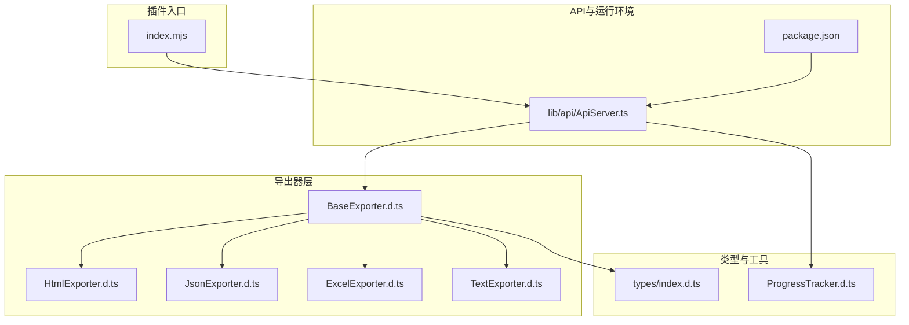
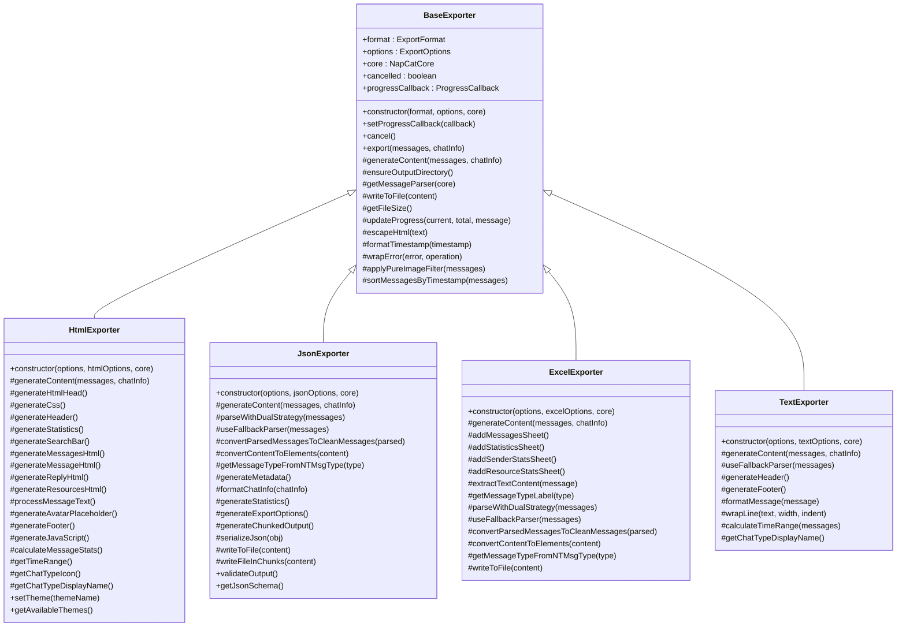
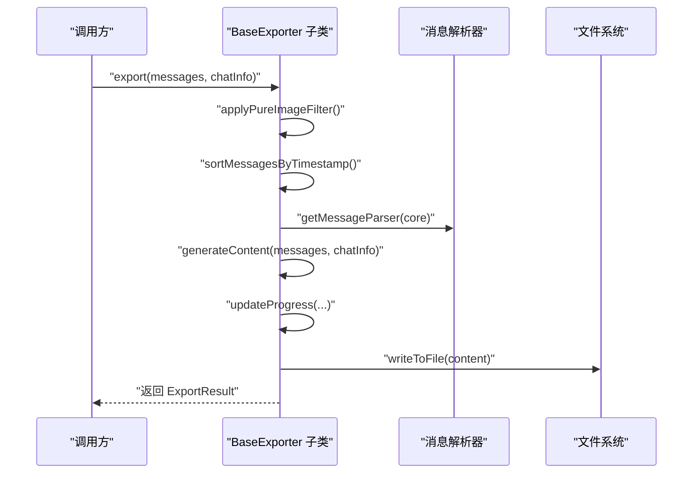
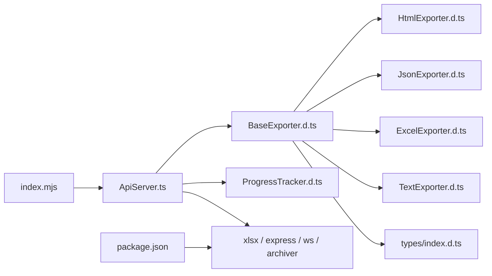

# 导出器系统

<cite>
**本文引用的文件**
- [plugins/qq-chat-exporter/dist/core/exporter/BaseExporter.d.ts](file://plugins/qq-chat-exporter/dist/core/exporter/BaseExporter.d.ts)
- [plugins/qq-chat-exporter/dist/core/exporter/HtmlExporter.d.ts](file://plugins/qq-chat-exporter/dist/core/exporter/HtmlExporter.d.ts)
- [plugins/qq-chat-exporter/dist/core/exporter/JsonExporter.d.ts](file://plugins/qq-chat-exporter/dist/core/exporter/JsonExporter.d.ts)
- [plugins/qq-chat-exporter/dist/core/exporter/ExcelExporter.d.ts](file://plugins/qq-chat-exporter/dist/core/exporter/ExcelExporter.d.ts)
- [plugins/qq-chat-exporter/dist/core/exporter/TextExporter.d.ts](file://plugins/qq-chat-exporter/dist/core/exporter/TextExporter.d.ts)
- [plugins/qq-chat-exporter/dist/types/index.d.ts](file://plugins/qq-chat-exporter/dist/types/index.d.ts)
- [plugins/qq-chat-exporter/index.mjs](file://plugins/qq-chat-exporter/index.mjs)
- [plugins/qq-chat-exporter/package.json](file://plugins/qq-chat-exporter/package.json)
- [plugins/qq-chat-exporter/lib/api/ApiServer.ts](file://plugins/qq-chat-exporter/lib/api/ApiServer.ts)
- [plugins/qq-chat-exporter/dist/core/progress/ProgressTracker.d.ts](file://plugins/qq-chat-exporter/dist/core/progress/ProgressTracker.d.ts)
</cite>

## 目录
1. [简介](#简介)
2. [项目结构](#项目结构)
3. [核心组件](#核心组件)
4. [架构总览](#架构总览)
5. [详细组件分析](#详细组件分析)
6. [依赖关系分析](#依赖关系分析)
7. [性能考虑](#性能考虑)
8. [故障排查指南](#故障排查指南)
9. [结论](#结论)
10. [附录](#附录)

## 简介
本文件系统性阐述“导出器系统”的设计理念、架构与实现细节，覆盖基类 BaseExporter 的抽象接口、各具体导出器（HtmlExporter、JsonExporter、ExcelExporter、TextExporter）的功能特性与使用场景，并对导出选项配置、进度回调机制、错误处理策略、文件写入流程进行深入说明。同时提供扩展机制与自定义格式支持的最佳实践，帮助开发者快速上手并安全地定制导出能力。

## 项目结构
导出器系统位于插件目录下，采用“dist”产物与“lib”源码分离的结构。核心导出器位于 dist/core/exporter 目录，类型定义集中在 dist/types。插件入口通过 index.mjs 动态加载 TypeScript 源码并启动 API 服务。

图表来源
- [plugins/qq-chat-exporter/index.mjs](file://plugins/qq-chat-exporter/index.mjs#L28-L64)
- [plugins/qq-chat-exporter/dist/core/exporter/BaseExporter.d.ts](file://plugins/qq-chat-exporter/dist/core/exporter/BaseExporter.d.ts#L46-L128)
- [plugins/qq-chat-exporter/dist/core/exporter/HtmlExporter.d.ts](file://plugins/qq-chat-exporter/dist/core/exporter/HtmlExporter.d.ts#L64-L157)
- [plugins/qq-chat-exporter/dist/core/exporter/JsonExporter.d.ts](file://plugins/qq-chat-exporter/dist/core/exporter/JsonExporter.d.ts#L29-L106)
- [plugins/qq-chat-exporter/dist/core/exporter/ExcelExporter.d.ts](file://plugins/qq-chat-exporter/dist/core/exporter/ExcelExporter.d.ts#L32-L96)
- [plugins/qq-chat-exporter/dist/core/exporter/TextExporter.d.ts](file://plugins/qq-chat-exporter/dist/core/exporter/TextExporter.d.ts#L34-L80)
- [plugins/qq-chat-exporter/dist/types/index.d.ts](file://plugins/qq-chat-exporter/dist/types/index.d.ts#L26-L35)
- [plugins/qq-chat-exporter/lib/api/ApiServer.ts](file://plugins/qq-chat-exporter/lib/api/ApiServer.ts#L4161-L4196)
- [plugins/qq-chat-exporter/dist/core/progress/ProgressTracker.d.ts](file://plugins/qq-chat-exporter/dist/core/progress/ProgressTracker.d.ts#L503-L549)

章节来源
- [plugins/qq-chat-exporter/index.mjs](file://plugins/qq-chat-exporter/index.mjs#L1-L77)
- [plugins/qq-chat-exporter/package.json](file://plugins/qq-chat-exporter/package.json#L1-L42)

## 核心组件
本节聚焦 BaseExporter 抽象基类及其导出选项、进度回调、错误包装、文件写入等通用能力。

- 抽象接口与职责
  - 统一导出流程：构造函数接收导出格式、基础选项与可选核心实例；提供 export 公共入口，内部协调内容生成、进度上报与文件写入。
  - 抽象方法：generateContent 由子类实现，负责将原始消息转换为目标格式的内容字符串。
  - 工具方法：确保输出目录存在、获取消息解析器、写入文件、计算文件大小、更新进度、HTML 转义、时间格式化、相对时间计算、错误包装、纯图片消息过滤、按时间戳排序等。
- 导出选项 ExportOptions
  - outputPath：输出文件路径
  - includeResourceLinks：是否包含资源链接
  - includeSystemMessages：是否包含系统消息
  - filterPureImageMessages：是否过滤纯图片消息
  - timeFormat：时间格式
  - prettyFormat：美化输出（JSON等）
  - customCss：自定义CSS（HTML）
  - encoding：编码格式
  - chunkSize：分块大小（大文件分块输出）
- 进度回调 ProgressCallback
  - 参数包含当前进度、总进度、百分比与提示消息，便于UI或外部系统实时反馈。
- 错误处理
  - wrapError 将任意异常包装为 SystemError，携带类型、详情、堆栈、时间戳与上下文，统一错误语义。
- 文件写入
  - writeToFile 提供通用写入能力；部分导出器（如 JSON、Excel）重写该方法以支持二进制或分块写入。

章节来源
- [plugins/qq-chat-exporter/dist/core/exporter/BaseExporter.d.ts](file://plugins/qq-chat-exporter/dist/core/exporter/BaseExporter.d.ts#L13-L32)
- [plugins/qq-chat-exporter/dist/core/exporter/BaseExporter.d.ts](file://plugins/qq-chat-exporter/dist/core/exporter/BaseExporter.d.ts#L46-L128)
- [plugins/qq-chat-exporter/dist/types/index.d.ts](file://plugins/qq-chat-exporter/dist/types/index.d.ts#L401-L462)

## 架构总览
导出器系统遵循“基类+多态实现”的分层设计。API 层负责任务编排与进度广播，核心导出器负责内容生成与落盘，类型系统提供统一的数据契约与错误模型。

图表来源
- [plugins/qq-chat-exporter/dist/core/exporter/BaseExporter.d.ts](file://plugins/qq-chat-exporter/dist/core/exporter/BaseExporter.d.ts#L46-L128)
- [plugins/qq-chat-exporter/dist/core/exporter/HtmlExporter.d.ts](file://plugins/qq-chat-exporter/dist/core/exporter/HtmlExporter.d.ts#L64-L157)
- [plugins/qq-chat-exporter/dist/core/exporter/JsonExporter.d.ts](file://plugins/qq-chat-exporter/dist/core/exporter/JsonExporter.d.ts#L29-L106)
- [plugins/qq-chat-exporter/dist/core/exporter/ExcelExporter.d.ts](file://plugins/qq-chat-exporter/dist/core/exporter/ExcelExporter.d.ts#L32-L96)
- [plugins/qq-chat-exporter/dist/core/exporter/TextExporter.d.ts](file://plugins/qq-chat-exporter/dist/core/exporter/TextExporter.d.ts#L34-L80)

## 详细组件分析

### HtmlExporter（HTML 导出器）
- 设计目标
  - 生成美观、功能丰富的 HTML 页面，支持主题、响应式设计、搜索、统计、懒加载等特性。
- 关键特性
  - 主题系统：预设主题与可配置主色、背景、字体等；支持动态切换。
  - 内容生成：头部、统计、搜索栏、消息列表、回复、资源、页脚、JS/CSS 等模块化生成。
  - 文本处理：链接识别、@提及、换行处理等。
  - 进度与资源：可选择包含资源链接、时间戳、头像、统计信息等。
- 使用场景
  - 需要可视化浏览与检索的聊天记录归档。
  - 需要嵌入浏览器或静态站点的聊天页面。
- 高级特性
  - 自定义CSS：通过 ExportOptions.customCss 与 HtmlFormatOptions.customCss 合并注入。
  - 响应式与懒加载：提升大图场景下的加载体验。
  - JavaScript 交互：搜索、统计、主题切换等交互功能。

章节来源
- [plugins/qq-chat-exporter/dist/core/exporter/HtmlExporter.d.ts](file://plugins/qq-chat-exporter/dist/core/exporter/HtmlExporter.d.ts#L64-L157)

### JsonExporter（JSON 导出器）
- 设计目标
  - 生成结构化 JSON，便于程序化处理、分析与二次开发。
- 关键特性
  - 双重解析策略：优先使用消息解析器，失败时回退到简单解析器，保证兼容性。
  - 元数据与统计：生成导出配置、聊天信息、消息统计等辅助数据。
  - 分块输出：支持大文件分块写入，降低内存占用。
  - 格式化控制：美化输出、缩进、字段压缩等。
- 使用场景
  - 数据分析、机器学习训练、报表生成、API 导出。
- 高级特性
  - 分块写入：writeFileInChunks 保障大体量 JSON 的稳定导出。
  - JSON 模式：提供 JSON Schema 以约束输出结构。

章节来源
- [plugins/qq-chat-exporter/dist/core/exporter/JsonExporter.d.ts](file://plugins/qq-chat-exporter/dist/core/exporter/JsonExporter.d.ts#L29-L106)

### ExcelExporter（Excel 导出器）
- 设计目标
  - 生成包含多工作表的 Excel 文件，便于统计与表格分析。
- 关键特性
  - 多工作表：消息明细、统计、发送者统计、资源统计等。
  - 列宽与标签：可配置列宽、消息类型标签映射。
  - 双重解析策略：与 JSON/文本导出一致的解析兼容性。
- 使用场景
  - 需要结构化表格导出、统计报表、BI 工具导入。
- 高级特性
  - 二进制写入：针对 Excel 的二进制格式优化写入流程。

章节来源
- [plugins/qq-chat-exporter/dist/core/exporter/ExcelExporter.d.ts](file://plugins/qq-chat-exporter/dist/core/exporter/ExcelExporter.d.ts#L32-L96)

### TextExporter（纯文本导出器）
- 设计目标
  - 生成易读的纯文本格式，支持多种布局与格式化选项。
- 关键特性
  - 布局控制：消息分隔符、时间戳格式、发送者显示、消息类型、行宽、缩进、序号等。
  - 回退解析：在复杂消息结构下仍能稳定输出。
  - 时间范围：计算真实最早/最晚时间，增强可读性。
- 使用场景
  - 快速审阅、日志分析、轻量级归档。
- 高级特性
  - 换行处理：wrapLine 控制行长与缩进，避免长文本截断。

章节来源
- [plugins/qq-chat-exporter/dist/core/exporter/TextExporter.d.ts](file://plugins/qq-chat-exporter/dist/core/exporter/TextExporter.d.ts#L34-L80)

### BaseExporter（基类）与通用流程
- 导出流程
  - 初始化：构造函数保存格式、选项与核心实例，准备取消标志与进度回调。
  - 执行：export 入口负责调用 generateContent、applyPureImageFilter、sortMessagesByTimestamp 等步骤，期间通过 updateProgress 上报进度。
  - 写入：writeToFile 将内容写入指定路径，必要时进行目录创建与编码处理。
  - 错误：wrapError 统一封装异常，便于上层捕获与处理。
- 进度回调
  - updateProgress 接收当前/总量与消息，触发外部回调，便于 UI 或任务系统感知进度。
- 文件写入
  - 默认 writeToFile 支持文本写入；JSON/Excel 导出器重写以支持分块或二进制写入。
- 过滤与排序
  - applyPureImageFilter 在启用时过滤纯图片消息，提升可读性。
  - sortMessagesByTimestamp 确保消息按时间升序排列。

图表来源
- [plugins/qq-chat-exporter/dist/core/exporter/BaseExporter.d.ts](file://plugins/qq-chat-exporter/dist/core/exporter/BaseExporter.d.ts#L73-L98)
- [plugins/qq-chat-exporter/dist/core/exporter/JsonExporter.d.ts](file://plugins/qq-chat-exporter/dist/core/exporter/JsonExporter.d.ts#L94-L98)
- [plugins/qq-chat-exporter/dist/core/exporter/ExcelExporter.d.ts](file://plugins/qq-chat-exporter/dist/core/exporter/ExcelExporter.d.ts#L96-L96)

## 依赖关系分析
- 运行时依赖
  - xlsx：Excel 导出所需的二进制写入能力。
  - express/ws：API 服务与 WebSocket 广播。
  - archiver：打包导出产物（在 API 层使用）。
- 插件入口
  - index.mjs 动态注册 tsx 加载器并加载 ApiLauncher.ts，启动 API 服务器，从而驱动导出器工作。
- 类型与契约
  - types/index.d.ts 定义了导出格式枚举、任务状态、错误类型、导出结果等核心类型，确保导出器与上层系统的一致性。

图表来源
- [plugins/qq-chat-exporter/index.mjs](file://plugins/qq-chat-exporter/index.mjs#L28-L64)
- [plugins/qq-chat-exporter/lib/api/ApiServer.ts](file://plugins/qq-chat-exporter/lib/api/ApiServer.ts#L4161-L4196)
- [plugins/qq-chat-exporter/package.json](file://plugins/qq-chat-exporter/package.json#L22-L29)
- [plugins/qq-chat-exporter/dist/types/index.d.ts](file://plugins/qq-chat-exporter/dist/types/index.d.ts#L26-L35)

章节来源
- [plugins/qq-chat-exporter/package.json](file://plugins/qq-chat-exporter/package.json#L22-L29)
- [plugins/qq-chat-exporter/dist/types/index.d.ts](file://plugins/qq-chat-exporter/dist/types/index.d.ts#L26-L35)

## 性能考虑
- 分块输出
  - JSON/Excel 导出器支持分块写入，避免一次性加载大量数据导致内存峰值过高。
- 解析兼容性
  - 双重解析策略（MessageParser + SimpleMessageParser）在复杂消息结构下仍能稳定生成内容，减少失败重试成本。
- 进度与监控
  - ProgressTracker 提供任务状态、进度快照与性能统计，结合 BaseExporter 的 updateProgress，可实现细粒度的性能观测与清理。
- I/O 优化
  - ensureOutputDirectory 预创建目录，减少运行时 IO 异常；writeToFile 统一编码写入，避免重复开闭文件带来的额外开销。

章节来源
- [plugins/qq-chat-exporter/dist/core/exporter/JsonExporter.d.ts](file://plugins/qq-chat-exporter/dist/core/exporter/JsonExporter.d.ts#L84-L98)
- [plugins/qq-chat-exporter/dist/core/exporter/ExcelExporter.d.ts](file://plugins/qq-chat-exporter/dist/core/exporter/ExcelExporter.d.ts#L94-L96)
- [plugins/qq-chat-exporter/dist/core/progress/ProgressTracker.d.ts](file://plugins/qq-chat-exporter/dist/core/progress/ProgressTracker.d.ts#L503-L549)

## 故障排查指南
- 常见错误类型
  - API_ERROR、NETWORK_ERROR、DATABASE_ERROR、RESOURCE_ERROR、FILESYSTEM_ERROR、CONFIG_ERROR、VALIDATION_ERROR、PERMISSION_ERROR、TIMEOUT_ERROR、AUTH_ERROR、UNKNOWN_ERROR。
- 错误封装与定位
  - SystemError 携带类型、消息、详情、堆栈、时间戳与上下文，便于快速定位问题来源。
- 导出中断与清理
  - cancel() 可设置取消标志；ProgressTracker.cleanupTask 会在任务结束后清理定时器与内存缓存，避免资源泄漏。
- 进度与事件
  - API 层通过 WebSocket 广播导出进度事件，便于前端或外部系统实时感知状态变化。

章节来源
- [plugins/qq-chat-exporter/dist/types/index.d.ts](file://plugins/qq-chat-exporter/dist/types/index.d.ts#L401-L462)
- [plugins/qq-chat-exporter/dist/core/progress/ProgressTracker.d.ts](file://plugins/qq-chat-exporter/dist/core/progress/ProgressTracker.d.ts#L514-L526)
- [plugins/qq-chat-exporter/lib/api/ApiServer.ts](file://plugins/qq-chat-exporter/lib/api/ApiServer.ts#L4161-L4196)

## 结论
导出器系统以 BaseExporter 为核心，通过多态实现满足不同格式的导出需求。系统提供了完善的导出选项、进度回调、错误处理与文件写入机制，并针对大文件场景引入分块与二进制写入策略。配合类型系统与 API 层的事件广播，整体具备良好的扩展性与可观测性。开发者可基于现有导出器快速定制新格式，或复用通用能力实现更复杂的导出流程。

## 附录
- 使用建议
  - 优先选择符合业务需求的格式：HTML 适合浏览与检索，JSON 适合分析与二次开发，Excel 适合统计与报表，纯文本适合快速审阅。
  - 合理配置导出选项：根据消息体量与存储空间选择分块大小与编码格式。
  - 监控与回退：利用进度回调与错误封装，结合双重解析策略，提升导出稳定性。
- 扩展机制
  - 新增格式：继承 BaseExporter，实现 generateContent 与必要的 writeToFile 重写，补充类型定义与导出选项接口。
  - 高级特性：自定义 CSS、编码、分块输出、主题切换等，均可通过选项与工具方法实现。