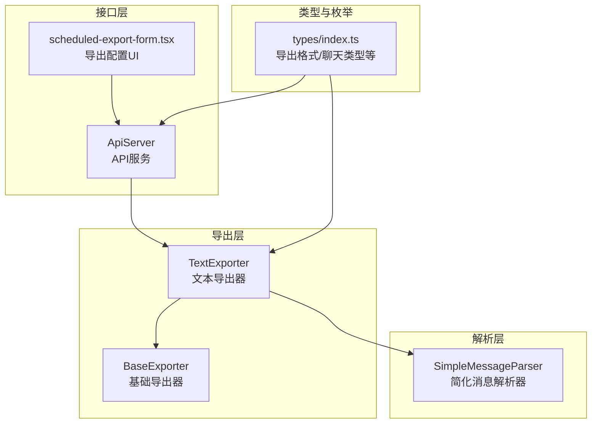
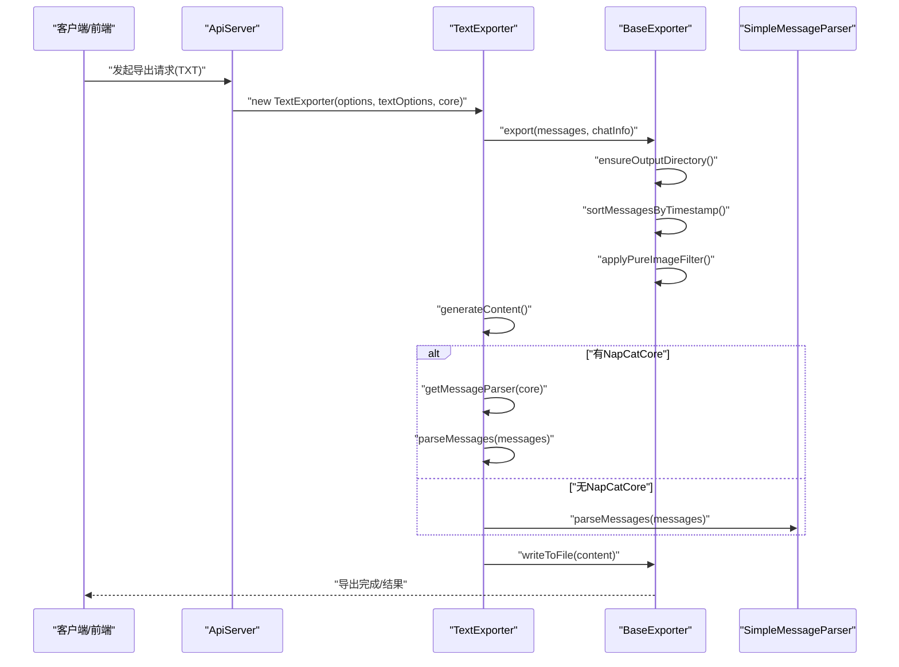
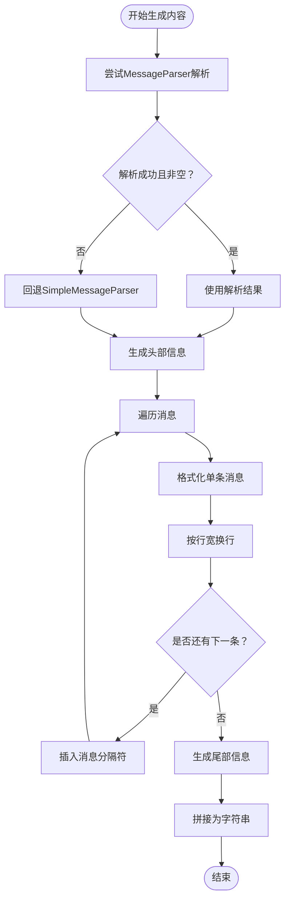
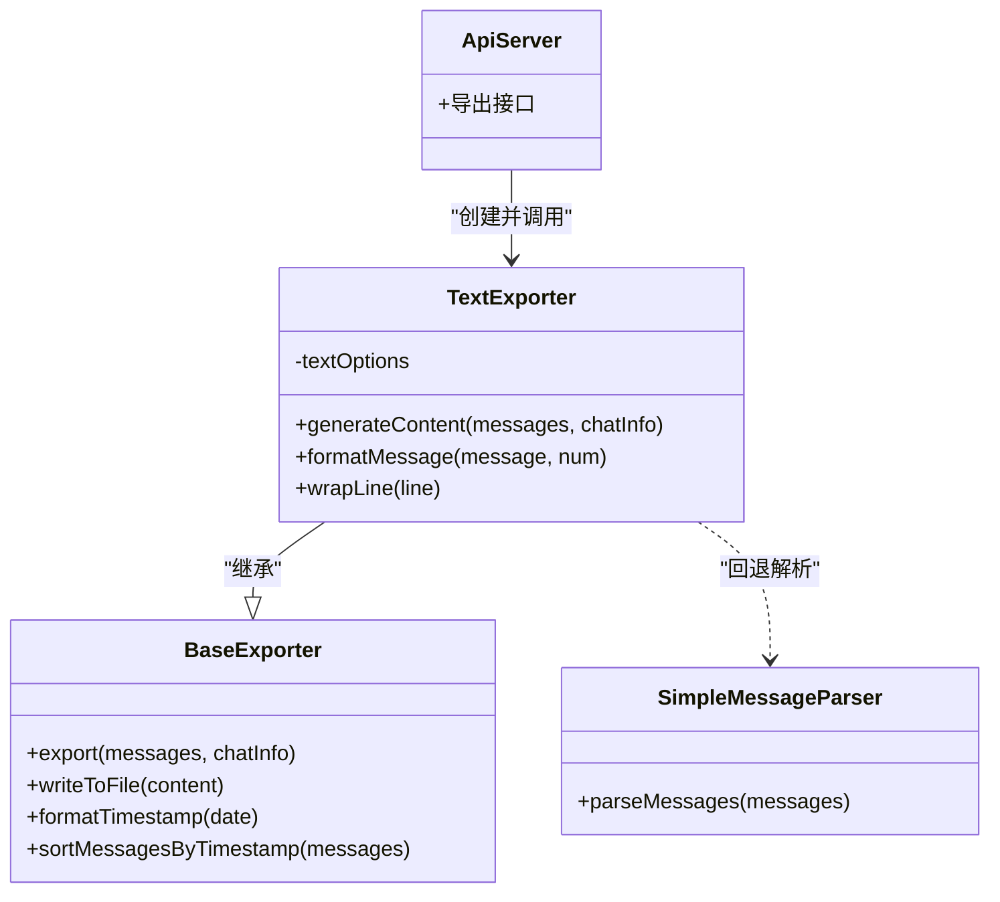

# 文本格式导出器

<cite>
**本文引用的文件**
- [TextExporter.ts](file://plugins/qq-chat-exporter/lib/core/exporter/TextExporter.ts)
- [BaseExporter.ts](file://plugins/qq-chat-exporter/lib/core/exporter/BaseExporter.ts)
- [SimpleMessageParser.ts](file://plugins/qq-chat-exporter/lib/core/parser/SimpleMessageParser.ts)
- [ApiServer.ts](file://plugins/qq-chat-exporter/lib/api/ApiServer.ts)
- [index.ts](file://plugins/qq-chat-exporter/lib/types/index.ts)
- [scheduled-export-form.tsx](file://qce-v4-tool/components/ui/scheduled-export-form.tsx)
</cite>

## 目录
1. [简介](#简介)
2. [项目结构](#项目结构)
3. [核心组件](#核心组件)
4. [架构总览](#架构总览)
5. [详细组件分析](#详细组件分析)
6. [依赖关系分析](#依赖关系分析)
7. [性能考量](#性能考量)
8. [故障排查指南](#故障排查指南)
9. [结论](#结论)
10. [附录](#附录)

## 简介
本文件面向开发者与高级用户，系统化阐述文本格式导出器（TextExporter）的设计与实现，重点包括：
- 纯文本生成机制与格式化规则
- 文本编码处理、换行符与分隔符策略
- 消息格式的简化处理与可读性优化
- 文件结构设计、用户名与时间戳显示格式
- 特殊字符处理、长文本截断策略
- 配置项说明与最佳实践
- 兼容性与大文件处理策略

## 项目结构
围绕文本导出器的关键文件组织如下：
- 导出器实现：TextExporter.ts
- 基类与通用能力：BaseExporter.ts
- 简化解析器：SimpleMessageParser.ts
- API集成入口：ApiServer.ts
- 类型与枚举：types/index.ts
- UI配置界面：scheduled-export-form.tsx

图表来源
- [TextExporter.ts](file://plugins/qq-chat-exporter/lib/core/exporter/TextExporter.ts#L40-L62)
- [BaseExporter.ts](file://plugins/qq-chat-exporter/lib/core/exporter/BaseExporter.ts#L58-L88)
- [SimpleMessageParser.ts](file://plugins/qq-chat-exporter/lib/core/parser/SimpleMessageParser.ts#L1-L200)
- [ApiServer.ts](file://plugins/qq-chat-exporter/lib/api/ApiServer.ts#L3709-L3712)
- [index.ts](file://plugins/qq-chat-exporter/lib/types/index.ts#L31-L40)

章节来源
- [TextExporter.ts](file://plugins/qq-chat-exporter/lib/core/exporter/TextExporter.ts#L1-L62)
- [BaseExporter.ts](file://plugins/qq-chat-exporter/lib/core/exporter/BaseExporter.ts#L1-L88)
- [ApiServer.ts](file://plugins/qq-chat-exporter/lib/api/ApiServer.ts#L3709-L3712)
- [index.ts](file://plugins/qq-chat-exporter/lib/types/index.ts#L31-L40)

## 核心组件
- TextExporter：负责将聊天记录以纯文本形式输出，支持灵活的格式化选项与简化消息解析回退。
- BaseExporter：提供导出流程骨架（排序、过滤、生成内容、写文件、进度与错误处理）。
- SimpleMessageParser：在缺少核心解析能力时，提供轻量的消息解析与清洗。
- ApiServer：对外提供导出接口，根据请求格式选择对应导出器。
- 类型系统：统一导出格式、聊天类型等枚举与接口。

章节来源
- [TextExporter.ts](file://plugins/qq-chat-exporter/lib/core/exporter/TextExporter.ts#L40-L62)
- [BaseExporter.ts](file://plugins/qq-chat-exporter/lib/core/exporter/BaseExporter.ts#L58-L88)
- [SimpleMessageParser.ts](file://plugins/qq-chat-exporter/lib/core/parser/SimpleMessageParser.ts#L1-L200)
- [ApiServer.ts](file://plugins/qq-chat-exporter/lib/api/ApiServer.ts#L3709-L3712)
- [index.ts](file://plugins/qq-chat-exporter/lib/types/index.ts#L31-L40)

## 架构总览
文本导出器遵循“基类+具体实现”的分层设计。调用链路如下：
- API层接收导出请求，选择TXT格式后构造TextExporter
- TextExporter基于BaseExporter执行通用流程：消息排序、过滤、生成内容
- 生成内容阶段，优先使用MessageParser解析，失败或无核心实例时回退至SimpleMessageParser
- 最终通过BaseExporter写入指定编码的文本文件

图表来源
- [ApiServer.ts](file://plugins/qq-chat-exporter/lib/api/ApiServer.ts#L3709-L3712)
- [TextExporter.ts](file://plugins/qq-chat-exporter/lib/core/exporter/TextExporter.ts#L67-L131)
- [BaseExporter.ts](file://plugins/qq-chat-exporter/lib/core/exporter/BaseExporter.ts#L110-L158)
- [SimpleMessageParser.ts](file://plugins/qq-chat-exporter/lib/core/parser/SimpleMessageParser.ts#L1-L200)

## 详细组件分析

### TextExporter：纯文本生成机制与格式化规则
- 构造与默认配置
  - 默认启用消息分隔符、完整时间戳、显示发送者、显示资源统计、缩进空格等
  - 可通过textOptions覆盖默认行为
- 内容生成流程
  - 优先尝试MessageParser解析；若解析为空或异常，则回退SimpleMessageParser
  - 生成头部（软件信息、标题、聊天信息、导出信息）、消息列表、尾部（完成信息）
  - 每条消息按字段顺序输出，支持可选字段：发送者、时间戳、消息类型、内容、资源统计、提及、回复
- 换行与分隔
  - 行宽控制：超过设定宽度时按固定宽度切片，并以缩进字符连接
  - 消息分隔符：在消息之间插入自定义分隔符，默认为单个换行
- 时间戳格式
  - 支持完整时间、仅日期、仅时间、相对时间四种模式
  - 相对时间按“天/小时/分钟/刚刚”展示
- 用户名与聊天类型
  - 发送者名称优先使用解析结果，否则回退到UID
  - 聊天类型映射为中文显示名称
- 特殊消息处理
  - 系统消息、表情消息、无文本内容消息均以占位提示替代
  - 资源消息显示资源数量与文件名清单
- 进度与取消
  - 每处理一定数量的消息更新一次进度
  - 支持取消导出

图表来源
- [TextExporter.ts](file://plugins/qq-chat-exporter/lib/core/exporter/TextExporter.ts#L67-L131)
- [TextExporter.ts](file://plugins/qq-chat-exporter/lib/core/exporter/TextExporter.ts#L136-L190)
- [TextExporter.ts](file://plugins/qq-chat-exporter/lib/core/exporter/TextExporter.ts#L256-L316)
- [TextExporter.ts](file://plugins/qq-chat-exporter/lib/core/exporter/TextExporter.ts#L321-L332)

章节来源
- [TextExporter.ts](file://plugins/qq-chat-exporter/lib/core/exporter/TextExporter.ts#L48-L62)
- [TextExporter.ts](file://plugins/qq-chat-exporter/lib/core/exporter/TextExporter.ts#L67-L131)
- [TextExporter.ts](file://plugins/qq-chat-exporter/lib/core/exporter/TextExporter.ts#L136-L190)
- [TextExporter.ts](file://plugins/qq-chat-exporter/lib/core/exporter/TextExporter.ts#L256-L316)
- [TextExporter.ts](file://plugins/qq-chat-exporter/lib/core/exporter/TextExporter.ts#L321-L332)

### BaseExporter：通用导出框架与工具
- 导出流程
  - 确保输出目录存在
  - 按时间戳排序消息（兼容秒级与毫秒级时间戳）
  - 过滤无效消息（空消息）
  - 生成内容并写入文件
- 编码与写入
  - 通过options.encoding指定编码，默认UTF-8
  - 写入采用同步写文件方式，保证简单可靠
- 时间戳格式化
  - 支持“完整/仅日期/仅时间/相对时间”
- 进度与错误
  - 提供进度回调与错误包装
- 解析器配置
  - MessageParser配置包含资源链接、系统消息、多转发、快速回复等策略

章节来源
- [BaseExporter.ts](file://plugins/qq-chat-exporter/lib/core/exporter/BaseExporter.ts#L110-L158)
- [BaseExporter.ts](file://plugins/qq-chat-exporter/lib/core/exporter/BaseExporter.ts#L208-L215)
- [BaseExporter.ts](file://plugins/qq-chat-exporter/lib/core/exporter/BaseExporter.ts#L262-L280)
- [BaseExporter.ts](file://plugins/qq-chat-exporter/lib/core/exporter/BaseExporter.ts#L179-L203)

### SimpleMessageParser：简化解析器
- 能力概述
  - 在无核心解析能力时，仍能将原始消息解析为CleanMessage结构
  - 提供并发限流、事件让渡、高性能HTML转义等工具
- 作用
  - 作为TextExporter的回退解析器，保障在任何环境下都能导出可用文本

章节来源
- [SimpleMessageParser.ts](file://plugins/qq-chat-exporter/lib/core/parser/SimpleMessageParser.ts#L1-L200)

### ApiServer：导出接口集成
- 格式选择
  - 根据请求格式创建对应导出器：TXT、JSON、EXCEL、HTML
- TXT导出示例
  - 通过new TextExporter(...)创建实例并执行export
- ZIP导出联动
  - HTML导出可选打包为ZIP，TXT导出直接生成文本文件

章节来源
- [ApiServer.ts](file://plugins/qq-chat-exporter/lib/api/ApiServer.ts#L3709-L3712)

### 类型系统：导出格式与聊天类型
- 导出格式枚举：TXT、JSON、HTML、EXCEL
- 聊天类型：private、group、temp
- 用于统一导出器与UI配置的类型约束

章节来源
- [index.ts](file://plugins/qq-chat-exporter/lib/types/index.ts#L31-L40)
- [index.ts](file://plugins/qq-chat-exporter/lib/types/index.ts#L45-L52)

## 依赖关系分析
- TextExporter依赖BaseExporter（继承）与SimpleMessageParser（回退）
- ApiServer在运行时根据格式选择导出器
- 类型系统为导出器与UI提供统一约束

图表来源
- [BaseExporter.ts](file://plugins/qq-chat-exporter/lib/core/exporter/BaseExporter.ts#L58-L88)
- [TextExporter.ts](file://plugins/qq-chat-exporter/lib/core/exporter/TextExporter.ts#L40-L62)
- [SimpleMessageParser.ts](file://plugins/qq-chat-exporter/lib/core/parser/SimpleMessageParser.ts#L1-L200)
- [ApiServer.ts](file://plugins/qq-chat-exporter/lib/api/ApiServer.ts#L3709-L3712)

## 性能考量
- 内存与IO
  - BaseExporter采用一次性生成内容再写入文件的方式，避免流式写入的复杂性，适合中小规模导出
  - 对于超大文件，建议结合分块导出策略（如JSON的分块方案）或外部工具拆分
- 换行与行宽
  - 行宽限制会增加字符串处理开销；建议在需要时开启并合理设置宽度
- 进度与取消
  - 每百条消息更新一次进度，便于长任务监控
  - 支持中途取消，及时释放资源

[本节为通用性能讨论，无需列出具体文件来源]

## 故障排查指南
- 导出失败
  - 检查输出路径是否存在、权限是否足够
  - 查看错误包装信息，定位具体操作（导出、写文件等）
- 消息解析异常
  - 若MessageParser解析失败，将自动回退SimpleMessageParser
  - 如仍失败，确认输入消息结构与核心实例可用性
- 时间戳异常
  - BaseExporter会对无效时间戳进行警告并排序
  - 确认消息时间戳格式（秒/毫秒）与一致性
- 编码问题
  - 确认options.encoding设置为期望编码（如UTF-8、GBK等）
  - 文本编辑器需与导出编码一致以避免乱码

章节来源
- [BaseExporter.ts](file://plugins/qq-chat-exporter/lib/core/exporter/BaseExporter.ts#L155-L158)
- [BaseExporter.ts](file://plugins/qq-chat-exporter/lib/core/exporter/BaseExporter.ts#L330-L371)
- [TextExporter.ts](file://plugins/qq-chat-exporter/lib/core/exporter/TextExporter.ts#L74-L93)

## 结论
TextExporter以简洁、稳定的纯文本导出为目标，通过可配置的格式化选项与可靠的解析回退机制，在兼容性与可读性之间取得平衡。对于大规模导出场景，建议结合分块策略或外部工具优化整体性能与可维护性。

[本节为总结性内容，无需列出具体文件来源]

## 附录

### 文本导出配置要点与最佳实践
- 基础导出选项（来自BaseExporter）
  - outputPath：输出文件路径
  - includeResourceLinks：是否包含资源链接
  - includeSystemMessages：是否包含系统消息
  - filterPureImageMessages：是否过滤纯图片消息
  - timeFormat：时间格式（完整/仅日期/仅时间/相对）
  - prettyFormat：美化输出（JSON等格式适用）
  - encoding：文件编码（如UTF-8）
  - chunkSize：分块大小（大文件分块输出）
- 文本格式选项（TextExporter）
  - messageSeparator：消息分隔符（默认换行）
  - timestampFormat：时间戳格式（full/time-only/date-only/relative）
  - showSender：是否显示发送者
  - showMessageType：是否显示消息类型
  - showResourceStats：是否显示资源统计
  - lineWidth：行宽限制（0表示不限制）
  - indentChar：换行缩进字符
  - showMessageNumber：是否显示消息序号
- 编码处理
  - 默认UTF-8；如需兼容旧系统可改为GBK/GB2312等
  - 确保编辑器与导出编码一致
- 换行与分隔符
  - 通过lineWidth与indentChar控制长文本可读性
  - 通过messageSeparator控制消息间分隔
- 消息简化处理
  - 无文本内容时以占位提示替代，避免空行过多
  - 资源消息显示资源数量与文件名，便于检索
- 大文件处理策略
  - 中等规模：直接导出，注意内存占用
  - 大规模：结合分块导出或外部工具拆分
- 兼容性考虑
  - TXT格式兼容性最佳，适合跨平台共享
  - UI中明确标注“兼容”属性，便于用户选择

章节来源
- [BaseExporter.ts](file://plugins/qq-chat-exporter/lib/core/exporter/BaseExporter.ts#L23-L42)
- [TextExporter.ts](file://plugins/qq-chat-exporter/lib/core/exporter/TextExporter.ts#L17-L34)
- [TextExporter.ts](file://plugins/qq-chat-exporter/lib/core/exporter/TextExporter.ts#L51-L61)
- [scheduled-export-form.tsx](file://qce-v4-tool/components/ui/scheduled-export-form.tsx#L365-L368)