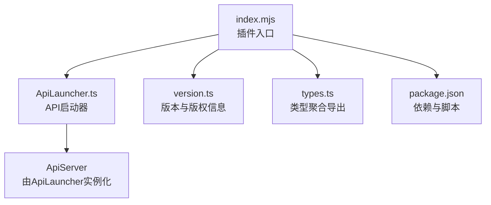
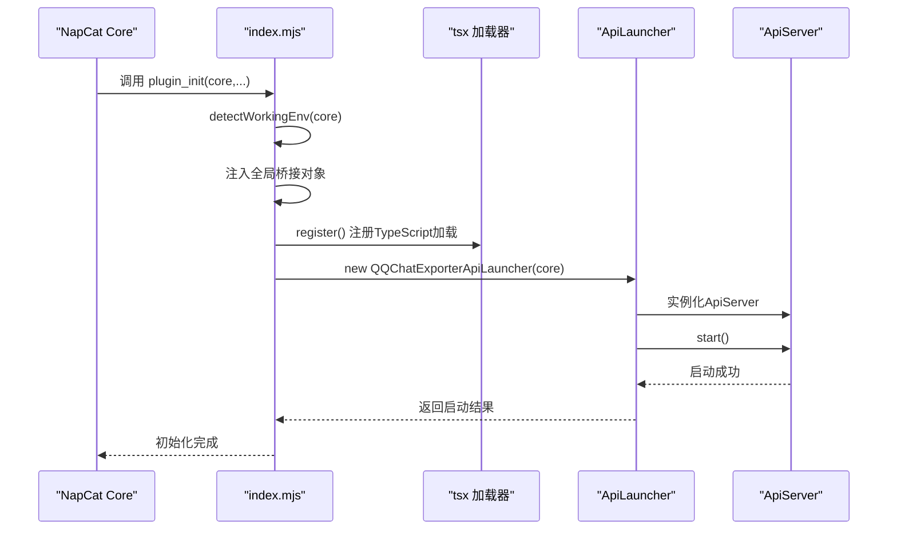
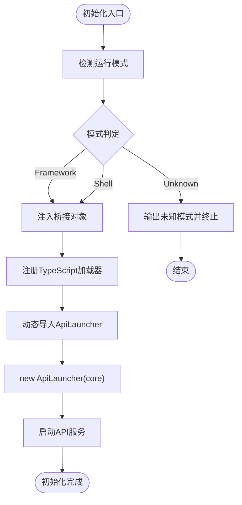
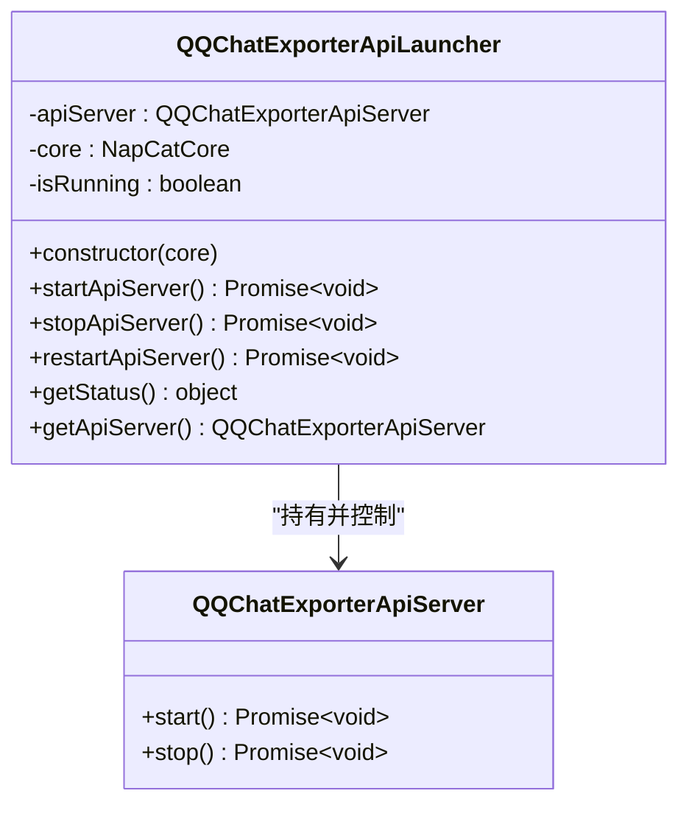
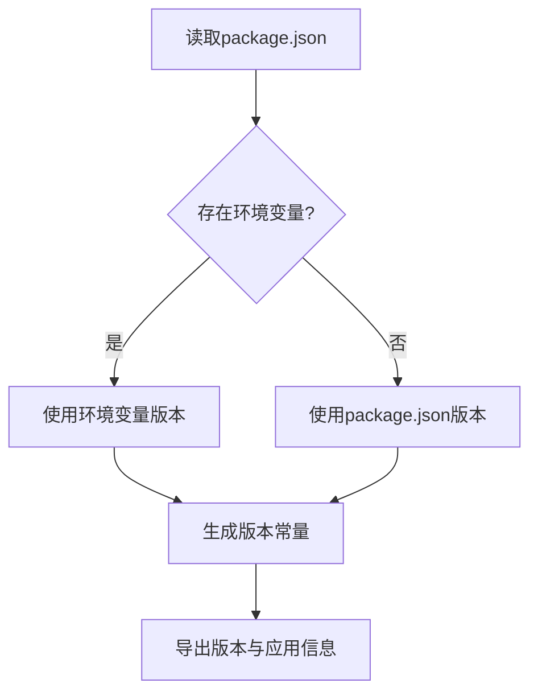
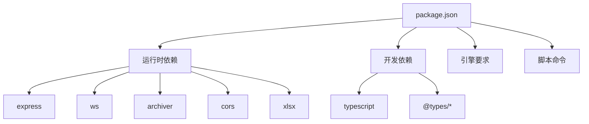

# 核心功能模块

<cite>
**本文引用的文件**
- [plugins/qq-chat-exporter/package.json](file://plugins/qq-chat-exporter/package.json)
- [plugins/qq-chat-exporter/index.mjs](file://plugins/qq-chat-exporter/index.mjs)
- [plugins/qq-chat-exporter/lib/version.ts](file://plugins/qq-chat-exporter/lib/version.ts)
- [plugins/qq-chat-exporter/lib/types.ts](file://plugins/qq-chat-exporter/lib/types.ts)
- [plugins/qq-chat-exporter/lib/api/ApiLauncher.ts](file://plugins/qq-chat-exporter/lib/api/ApiLauncher.ts)
</cite>

## 目录
1. [简介](#简介)
2. [项目结构](#项目结构)
3. [核心组件](#核心组件)
4. [架构总览](#架构总览)
5. [详细组件分析](#详细组件分析)
6. [依赖分析](#依赖分析)
7. [性能考虑](#性能考虑)
8. [故障排除指南](#故障排除指南)
9. [结论](#结论)
10. [附录](#附录)

## 简介
本文件面向QQ聊天导出器（QQChatExporter，简称QCE）的核心功能模块，系统梳理其在NapCat Shell与Framework两种运行模式下的启动流程、API服务启动器、版本与类型管理等关键能力。文档重点解释模块间协作关系、数据传递机制、生命周期管理、错误处理策略与性能优化建议，并通过图示帮助开发者快速理解复杂交互逻辑。

## 项目结构
QCE作为NapCat插件，采用模块化组织方式，核心入口负责运行模式检测与API服务启动；版本与类型管理分别提供统一版本信息与类型聚合；API启动器封装HTTP/WebSocket服务的启停与状态查询。

**图表来源**
- [plugins/qq-chat-exporter/index.mjs](file://plugins/qq-chat-exporter/index.mjs#L28-L64)
- [plugins/qq-chat-exporter/lib/api/ApiLauncher.ts](file://plugins/qq-chat-exporter/lib/api/ApiLauncher.ts#L17-L32)
- [plugins/qq-chat-exporter/lib/version.ts](file://plugins/qq-chat-exporter/lib/version.ts#L28-L52)
- [plugins/qq-chat-exporter/lib/types.ts](file://plugins/qq-chat-exporter/lib/types.ts#L1-L8)
- [plugins/qq-chat-exporter/package.json](file://plugins/qq-chat-exporter/package.json#L1-L42)

**章节来源**
- [plugins/qq-chat-exporter/index.mjs](file://plugins/qq-chat-exporter/index.mjs#L1-L77)
- [plugins/qq-chat-exporter/lib/api/ApiLauncher.ts](file://plugins/qq-chat-exporter/lib/api/ApiLauncher.ts#L1-L68)
- [plugins/qq-chat-exporter/lib/version.ts](file://plugins/qq-chat-exporter/lib/version.ts#L1-L53)
- [plugins/qq-chat-exporter/lib/types.ts](file://plugins/qq-chat-exporter/lib/types.ts#L1-L8)
- [plugins/qq-chat-exporter/package.json](file://plugins/qq-chat-exporter/package.json#L1-L42)

## 核心组件
- 插件入口与运行模式检测：负责识别Shell或Framework模式，注入桥接对象，注册TypeScript加载器，并启动API服务。
- API启动器：封装API服务的启动、停止、重启与状态查询，确保生命周期可控。
- 版本与版权信息：集中管理应用名称、版本、GitHub链接与版权声明。
- 类型聚合导出：统一导出类型定义，便于上层使用。

**章节来源**
- [plugins/qq-chat-exporter/index.mjs](file://plugins/qq-chat-exporter/index.mjs#L12-L64)
- [plugins/qq-chat-exporter/lib/api/ApiLauncher.ts](file://plugins/qq-chat-exporter/lib/api/ApiLauncher.ts#L8-L67)
- [plugins/qq-chat-exporter/lib/version.ts](file://plugins/qq-chat-exporter/lib/version.ts#L28-L52)
- [plugins/qq-chat-exporter/lib/types.ts](file://plugins/qq-chat-exporter/lib/types.ts#L1-L8)

## 架构总览
下图展示了从插件入口到API服务的整体调用链路，以及各模块之间的依赖关系。

**图表来源**
- [plugins/qq-chat-exporter/index.mjs](file://plugins/qq-chat-exporter/index.mjs#L28-L58)
- [plugins/qq-chat-exporter/lib/api/ApiLauncher.ts](file://plugins/qq-chat-exporter/lib/api/ApiLauncher.ts#L17-L32)

## 详细组件分析

### 插件入口与运行模式检测
- 运行模式判定：优先读取core上下文中的工作环境标识，回退至Electron存在性与环境变量判断。
- 全局桥接注入：向globalThis注入包含core、obContext、actions、instance与运行模式的桥接对象，供Overlay等模块使用。
- TypeScript支持：通过tsx注册TypeScript加载器，随后动态导入API启动器类。
- 生命周期：提供plugin_cleanup用于停止API服务并清理桥接对象。

**图表来源**
- [plugins/qq-chat-exporter/index.mjs](file://plugins/qq-chat-exporter/index.mjs#L12-L64)

**章节来源**
- [plugins/qq-chat-exporter/index.mjs](file://plugins/qq-chat-exporter/index.mjs#L12-L77)

### API启动器（ApiLauncher）
- 职责：封装API服务的生命周期管理，包括启动、停止、重启与状态查询。
- 关键方法：
  - startApiServer：实例化ApiServer并启动，设置运行状态。
  - stopApiServer：停止服务并重置状态。
  - restartApiServer：先停止再启动。
  - getStatus：返回运行状态、端口与运行时长。
  - getApiServer：返回内部ApiServer实例。
- 错误处理：捕获启动/停止过程中的异常，记录日志并抛出。

**图表来源**
- [plugins/qq-chat-exporter/lib/api/ApiLauncher.ts](file://plugins/qq-chat-exporter/lib/api/ApiLauncher.ts#L8-L67)

**章节来源**
- [plugins/qq-chat-exporter/lib/api/ApiLauncher.ts](file://plugins/qq-chat-exporter/lib/api/ApiLauncher.ts#L8-L68)

### 版本与版权信息（version.ts）
- 提供统一版本号、主版本号、应用名称、完整名称、GitHub地址与版权声明。
- 版本来源优先级：环境变量（CI构建注入） > package.json。
- 常量导出：VERSION、MAJOR_VERSION、APP_NAME、APP_FULL_NAME、GITHUB_URL、COPYRIGHT、APP_INFO。

**图表来源**
- [plugins/qq-chat-exporter/lib/version.ts](file://plugins/qq-chat-exporter/lib/version.ts#L9-L26)

**章节来源**
- [plugins/qq-chat-exporter/lib/version.ts](file://plugins/qq-chat-exporter/lib/version.ts#L1-L53)

### 类型聚合导出（types.ts）
- 负责聚合导出类型定义，便于上层模块统一引用。
- 同时导出来自NapCatQQ核心的原始消息类型，确保与底层协议一致。

**章节来源**
- [plugins/qq-chat-exporter/lib/types.ts](file://plugins/qq-chat-exporter/lib/types.ts#L1-L8)

## 依赖分析
- 运行时依赖：Express、WebSocket（ws）、Archiver、CORS、xlsx等，用于Web服务、实时通信、压缩打包与Excel导出。
- 开发依赖：TypeScript及相关类型声明，确保类型安全与开发体验。
- 引擎要求：Node >= 18。
- 插件入口脚本：提供生成覆盖层、修复导入路径与测试脚本。

**图表来源**
- [plugins/qq-chat-exporter/package.json](file://plugins/qq-chat-exporter/package.json#L22-L39)

**章节来源**
- [plugins/qq-chat-exporter/package.json](file://plugins/qq-chat-exporter/package.json#L1-L42)

## 性能考虑
- 启动阶段仅在需要时注册TypeScript加载器，避免不必要的开销。
- API服务启动失败时及时记录错误并中止，防止资源泄漏。
- 状态查询返回轻量信息（运行状态、端口、运行时长），减少计算与IO压力。
- 建议：在高并发场景下，结合外部反向代理与连接池配置，进一步提升稳定性与吞吐。

## 故障排除指南
- 初始化失败：检查是否正确安装tsx依赖并在入口中注册加载器。
- API服务启动失败：查看核心日志输出，确认端口占用与权限问题。
- 运行模式识别异常：确认core上下文、Electron环境与环境变量设置。
- 清理阶段异常：确保stopApiServer被调用且无未捕获异常。

**章节来源**
- [plugins/qq-chat-exporter/index.mjs](file://plugins/qq-chat-exporter/index.mjs#L60-L76)
- [plugins/qq-chat-exporter/lib/api/ApiLauncher.ts](file://plugins/qq-chat-exporter/lib/api/ApiLauncher.ts#L22-L46)

## 结论
QCE通过清晰的模块划分与严格的生命周期管理，实现了在不同运行模式下的稳定部署与扩展。插件入口负责模式检测与服务启动，API启动器提供可靠的服务控制，版本与类型管理确保一致性与可维护性。配合完善的错误处理与性能考量，QCE为后续的聊天管理、资源处理与定时任务等功能奠定了坚实基础。

## 附录
- 常见用例路径参考：
  - 插件初始化入口：[plugins/qq-chat-exporter/index.mjs](file://plugins/qq-chat-exporter/index.mjs#L28-L58)
  - API服务启动器：[plugins/qq-chat-exporter/lib/api/ApiLauncher.ts](file://plugins/qq-chat-exporter/lib/api/ApiLauncher.ts#L17-L32)
  - 版本信息导出：[plugins/qq-chat-exporter/lib/version.ts](file://plugins/qq-chat-exporter/lib/version.ts#L28-L52)
  - 类型聚合导出：[plugins/qq-chat-exporter/lib/types.ts](file://plugins/qq-chat-exporter/lib/types.ts#L1-L8)
  - 依赖与脚本配置：[plugins/qq-chat-exporter/package.json](file://plugins/qq-chat-exporter/package.json#L1-L42)